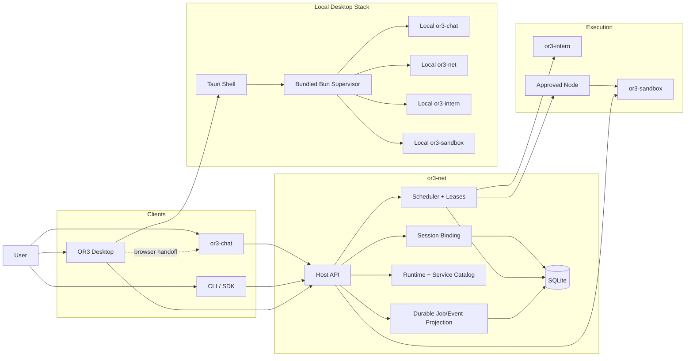
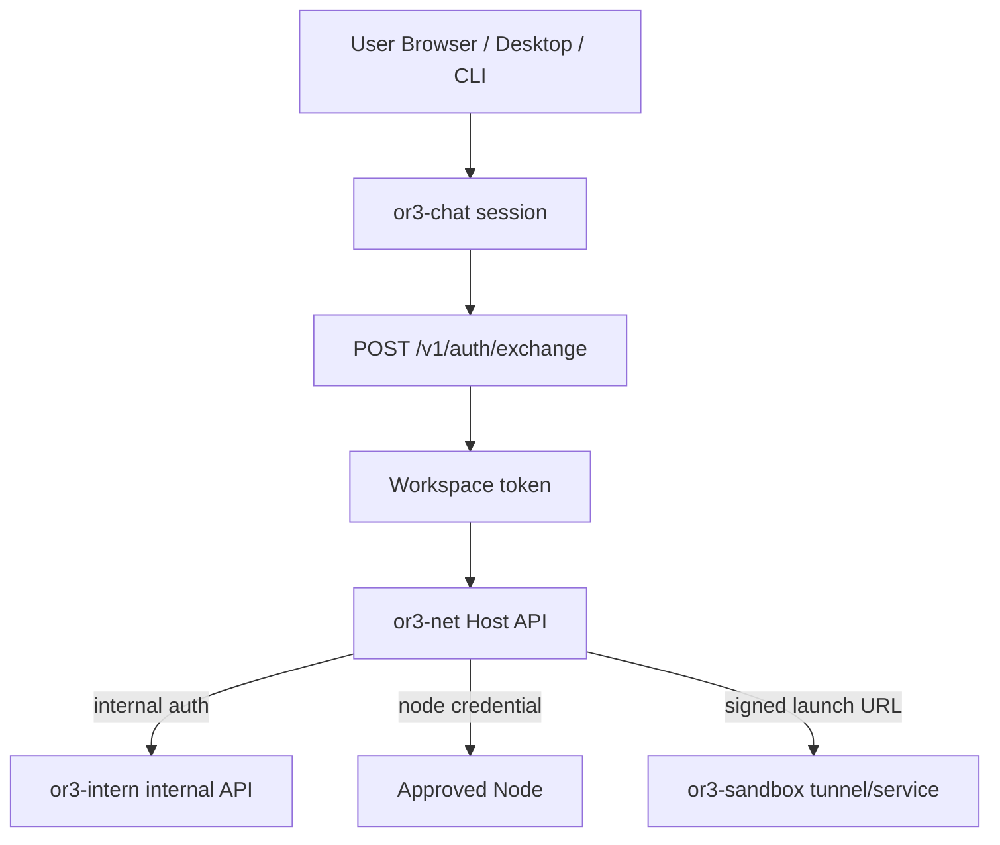
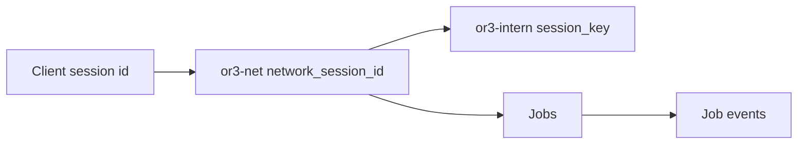
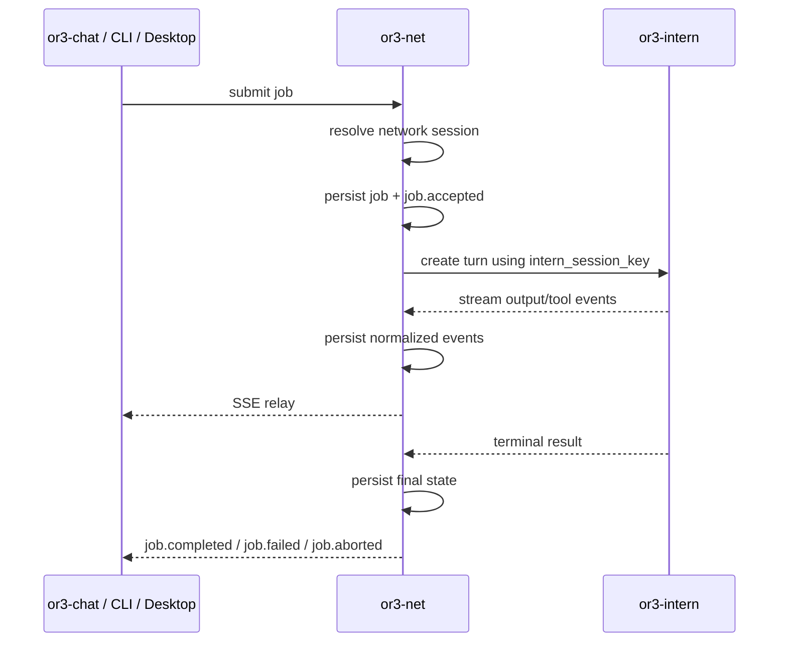
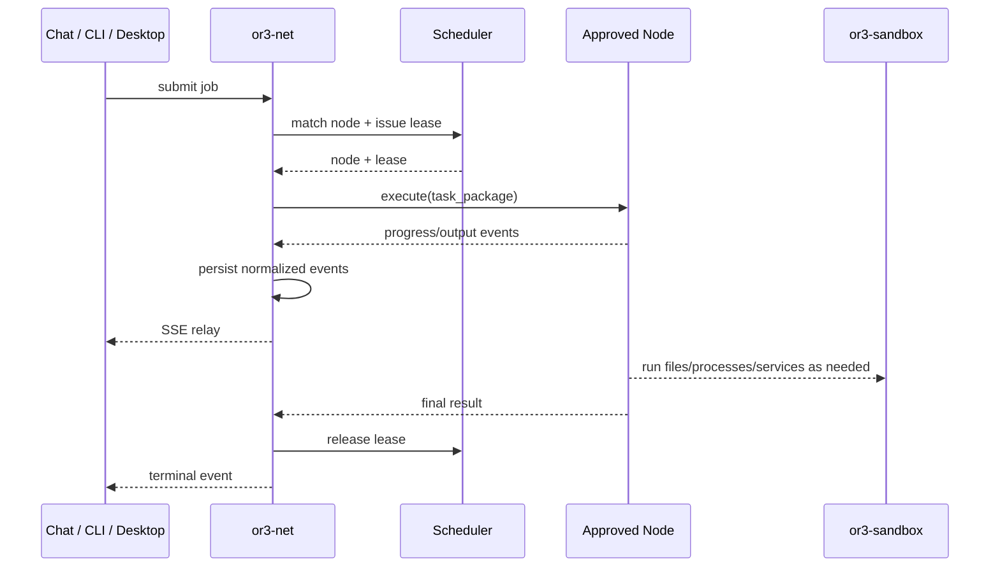
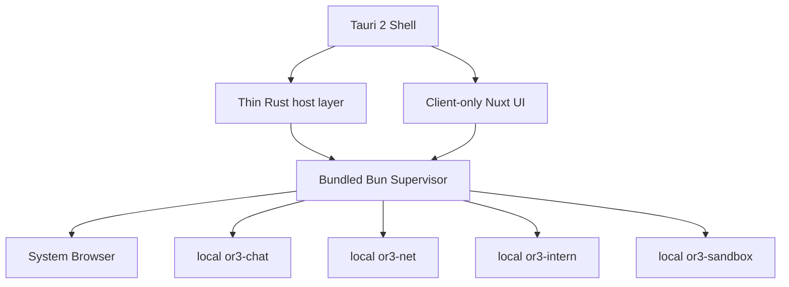

This file is a merged representation of a subset of the codebase, containing files not matching ignore patterns, combined into a single document by Repomix.

# File Summary

## Purpose
This file contains a packed representation of a subset of the repository's contents that is considered the most important context.
It is designed to be easily consumable by AI systems for analysis, code review,
or other automated processes.

## File Format
The content is organized as follows:
1. This summary section
2. Repository information
3. Directory structure
4. Repository files (if enabled)
5. Multiple file entries, each consisting of:
  a. A header with the file path (## File: path/to/file)
  b. The full contents of the file in a code block

## Usage Guidelines
- This file should be treated as read-only. Any changes should be made to the
  original repository files, not this packed version.
- When processing this file, use the file path to distinguish
  between different files in the repository.
- Be aware that this file may contain sensitive information. Handle it with
  the same level of security as you would the original repository.

## Notes
- Some files may have been excluded based on .gitignore rules and Repomix's configuration
- Binary files are not included in this packed representation. Please refer to the Repository Structure section for a complete list of file paths, including binary files
- Files matching these patterns are excluded: planning, **/*.test.ts
- Files matching patterns in .gitignore are excluded
- Files matching default ignore patterns are excluded
- Files are sorted by Git change count (files with more changes are at the bottom)

# Directory Structure
```
cli/
  index.ts
sdk/
  intern/
    client.ts
    index.ts
    types.ts
  sandbox/
    client.ts
    index.ts
    types.ts
src/
  agents/
    index.ts
    service.ts
  api/
    app.ts
    index.ts
  auth/
    index.ts
    service.ts
    tokens.ts
  console/
    index.ts
  contracts/
    core.ts
    index.ts
    previews.ts
    protocol.ts
    shared.ts
  db/
    client.ts
    index.ts
    schema.ts
  execution/
    job-streams.ts
    local-jobs.ts
  lib/
    crypto.ts
    ids.ts
    time.ts
  nodes/
    adapter-sandbox.ts
    executor.ts
    index.ts
    registry.ts
    signatures.ts
    transport-https.ts
    transport-registry.ts
    transport-wss.ts
    transport.ts
  previews/
    service.ts
  scheduler/
    index.ts
    scheduler.ts
    warmpool.ts
  session/
    index.ts
    service.ts
  workspace/
    files.ts
  index.ts
  server.ts
.gitignore
dumb-issues.md
eslint.config.mjs
index.ts
or3-net.md
package.json
README.md
tsconfig.json
```

# Files

## File: sdk/intern/index.ts
````typescript
export * from "./client.ts";
export * from "./types.ts";
````

## File: sdk/intern/types.ts
````typescript
export interface InternTurnRequest {
  readonly sessionKey: string;
  readonly message: string;
  readonly allowedTools?: string[];
  readonly meta?: Record<string, unknown>;
  readonly profileName?: string;
}

export interface InternTurnResponse {
  readonly job_id: string;
  readonly status: string;
  readonly final_text?: string;
  readonly error?: string;
}

export interface InternSubagentRequest {
  readonly parentSessionKey: string;
  readonly task: string;
  readonly promptSnapshot: Record<string, unknown>[];
  readonly allowedTools?: string[];
  readonly timeoutSeconds?: number;
  readonly meta?: Record<string, unknown>;
  readonly profileName?: string;
  readonly channel?: string;
  readonly replyTo?: string;
}

export interface InternSubagentResponse {
  readonly job_id: string;
  readonly child_session_key: string;
  readonly status: string;
}

export interface InternJobEvent {
  readonly event: string;
  readonly data: Record<string, unknown>;
}

export interface InternAbortResponse {
  readonly ok: boolean;
  readonly job_id: string;
  readonly status?: string;
}

export interface InternClient {
  submitTurn(request: InternTurnRequest): Promise<InternTurnResponse>;
  submitTurnStream(request: InternTurnRequest): AsyncIterable<InternJobEvent>;
  spawnSubagent(request: InternSubagentRequest): Promise<InternSubagentResponse>;
  streamJob(jobId: string): AsyncIterable<InternJobEvent>;
  abortJob(jobId: string): Promise<InternAbortResponse>;
}
````

## File: sdk/sandbox/index.ts
````typescript
export * from "./client.ts";
export * from "./types.ts";
````

## File: src/agents/index.ts
````typescript
export * from "./service.ts";
````

## File: src/agents/service.ts
````typescript
import type { Agent } from "../contracts/index.ts";
import type { ControlPlaneDatabase, StoredAgent } from "../db/index.ts";

export class AgentService {
  public constructor(private readonly database: ControlPlaneDatabase) {}

  public listAgents(workspaceId: string): StoredAgent[] {
    return this.database.workspace(workspaceId).listAgents();
  }

  public getAgent(workspaceId: string, agentId: string): StoredAgent {
    return this.database.workspace(workspaceId).getAgent(agentId);
  }

  public saveAgent(workspaceId: string, agentInput: Agent): StoredAgent {
    return this.database.workspace(workspaceId).saveAgent(agentInput);
  }

  public deleteAgent(workspaceId: string, agentId: string): void {
    this.database.workspace(workspaceId).deleteAgent(agentId);
  }
}
````

## File: src/api/index.ts
````typescript
export interface RouteDescriptor {
  readonly method: string;
  readonly path: string;
  readonly summary: string;
}
````

## File: src/auth/index.ts
````typescript
export interface SessionProofValidator {
  validateSessionProof(input: {
    provider: string;
    session_proof: Record<string, unknown>;
    workspace_hint?: string;
  }): Promise<{ user_id: string; workspace_id: string; scopes: string[] }>;
}
````

## File: src/auth/tokens.ts
````typescript
import { z } from "zod";

import type { AuthToken } from "../contracts/index.ts";
import { authTokenSchema, nonEmptyStringSchema } from "../contracts/index.ts";
import { decodeBase64Url, encodeBase64Url, hmacSha256Hex } from "../lib/crypto.ts";

const workspaceTokenClaimsSchema = z.object({
  sub: nonEmptyStringSchema,
  workspace_id: nonEmptyStringSchema,
  scopes: z.array(nonEmptyStringSchema).min(1),
  iat: z.number().int().positive(),
  exp: z.number().int().positive(),
  kind: z.literal("workspace-token"),
});

export interface WorkspacePrincipal {
  readonly subject: string;
  readonly workspace_id: string;
  readonly scopes: string[];
  readonly auth_type: "workspace-token" | "api-key";
}

export interface IssueWorkspaceTokenInput {
  readonly secret: string;
  readonly subject: string;
  readonly workspace_id: string;
  readonly scopes: string[];
  readonly ttlMs?: number;
  readonly now?: Date;
}

export const issueWorkspaceToken = async (input: IssueWorkspaceTokenInput): Promise<AuthToken> => {
  const now = input.now ?? new Date();
  const expiresAt = new Date(now.getTime() + (input.ttlMs ?? 15 * 60_000));
  const claims = workspaceTokenClaimsSchema.parse({
    sub: input.subject,
    workspace_id: input.workspace_id,
    scopes: input.scopes,
    iat: Math.floor(now.getTime() / 1000),
    exp: Math.floor(expiresAt.getTime() / 1000),
    kind: "workspace-token",
  });
  const payload = encodeBase64Url(JSON.stringify(claims));
  const signature = await hmacSha256Hex(input.secret, payload);

  return authTokenSchema.parse({
    token: `${payload}.${signature}`,
    workspace_id: input.workspace_id,
    expires_at: expiresAt.toISOString(),
    scopes: input.scopes,
  });
};

export const validateWorkspaceToken = async (
  secret: string,
  token: string,
  now = new Date(),
): Promise<WorkspacePrincipal> => {
  const [payloadPart, signaturePart] = token.trim().split(".", 2);
  if (payloadPart === undefined || signaturePart === undefined) {
    throw new Error("invalid workspace token format");
  }

  const expectedSignature = await hmacSha256Hex(secret, payloadPart);
  if (expectedSignature !== signaturePart) {
    throw new Error("invalid workspace token signature");
  }

  const claims = workspaceTokenClaimsSchema.parse(JSON.parse(decodeBase64Url(payloadPart)) as unknown);
  const nowSeconds = Math.floor(now.getTime() / 1000);
  if (claims.exp <= nowSeconds) {
    throw new Error("workspace token expired");
  }

  return {
    subject: claims.sub,
    workspace_id: claims.workspace_id,
    scopes: claims.scopes,
    auth_type: "workspace-token",
  };
};
````

## File: src/contracts/core.ts
````typescript
import { z } from "zod";

import {
  isoDateTimeSchema,
  jsonObjectSchema,
  nonEmptyStringSchema,
  nonNegativeIntegerSchema,
  positiveIntegerSchema,
} from "./shared.ts";

export const adapterKindValues = ["local", "remote", "sandbox"] as const;
export const transportKindValues = ["https", "outbound-wss"] as const;
export const resetMethodValues = [
  "process_kill",
  "fs_scrub",
  "credential_rotation",
] as const;
export const leaseStateValues = ["active", "expired", "released", "failed"] as const;
export const jobStatusValues = [
  "pending",
  "scheduled",
  "running",
  "completed",
  "failed",
  "aborted",
] as const;
export const nodeApprovalStatusValues = ["pending", "approved", "revoked"] as const;
export const nodeHealthStatusValues = ["unknown", "healthy", "degraded", "stale"] as const;
export const toolPolicyModeValues = ["allow_all", "deny_all", "allow_list", "deny_list"] as const;
export const adapterKindSchema = z.enum(adapterKindValues);
export const transportKindSchema = z.enum(transportKindValues);
export const resetMethodSchema = z.enum(resetMethodValues);
export const leaseStateSchema = z.enum(leaseStateValues);
export const jobStatusSchema = z.enum(jobStatusValues);
export const nodeApprovalStatusSchema = z.enum(nodeApprovalStatusValues);
export const nodeHealthStatusSchema = z.enum(nodeHealthStatusValues);

export const toolPolicySchema = z
  .object({
    mode: z.enum(toolPolicyModeValues),
    allowed_tools: z.array(nonEmptyStringSchema).default([]),
    blocked_tools: z.array(nonEmptyStringSchema).default([]),
  })
  .superRefine((value, context) => {
    if (value.mode === "allow_list" && value.allowed_tools.length === 0) {
      context.addIssue({
        code: "custom",
        message: "allow_list policies must declare at least one allowed tool",
        path: ["allowed_tools"],
      });
    }

    if (value.mode === "deny_list" && value.blocked_tools.length === 0) {
      context.addIssue({
        code: "custom",
        message: "deny_list policies must declare at least one blocked tool",
        path: ["blocked_tools"],
      });
    }
  });

export const nodeRequirementsSchema = z.object({
  adapter_kind: adapterKindSchema.optional(),
  capabilities: z.array(nonEmptyStringSchema).default([]),
  isolation_class: nonEmptyStringSchema.optional(),
  preferred_node_ids: z.array(nonEmptyStringSchema).default([]),
});

export const nodeManifestSchema = z.object({
  node_id: nonEmptyStringSchema,
  pubkey: nonEmptyStringSchema,
  signature: nonEmptyStringSchema,
  adapter_kind: adapterKindSchema,
  capabilities: z.array(nonEmptyStringSchema).min(1),
  isolation_class: nonEmptyStringSchema,
  supports_transports: z.array(transportKindSchema).min(1),
  resource_limits: z.object({
    max_concurrent_jobs: positiveIntegerSchema,
    cpu_cores: positiveIntegerSchema,
    memory_mb: positiveIntegerSchema,
    disk_mb: positiveIntegerSchema,
  }),
  lease_policy: z.object({
    max_ttl_seconds: positiveIntegerSchema,
    supports_warm_pool: z.boolean(),
    reset_methods: z.array(resetMethodSchema).min(1),
  }),
  certification: z
    .object({
      issuer: nonEmptyStringSchema,
      certificate: nonEmptyStringSchema,
      expires_at: isoDateTimeSchema,
    })
    .optional(),
  version: nonEmptyStringSchema,
});

export const artifactDescriptorSchema = z
  .object({
    artifact_id: nonEmptyStringSchema,
    path: nonEmptyStringSchema,
    kind: nonEmptyStringSchema,
    content_type: nonEmptyStringSchema,
    size_bytes: nonNegativeIntegerSchema,
    text: z.string().optional(),
    bytes_base64: z.string().optional(),
    source_url: z.url().optional(),
  })
  .refine(
    (value) => value.text !== undefined || value.bytes_base64 !== undefined || value.source_url !== undefined,
    {
      message: "artifact descriptors must provide inline text, bytes, or a source URL",
    },
  );

export const leaseProfileSchema = z.object({
  profile_id: nonEmptyStringSchema,
  ttl_seconds: positiveIntegerSchema,
  isolation_class: nonEmptyStringSchema.optional(),
  required_capabilities: z.array(nonEmptyStringSchema).default([]),
});

export const subagentPolicySchema = z.object({
  enabled: z.boolean(),
  max_depth: nonNegativeIntegerSchema,
  max_jobs: nonNegativeIntegerSchema,
});

export const taskPackageSchema = z.object({
  workspace_id: nonEmptyStringSchema,
  job_id: nonEmptyStringSchema,
  kind: nonEmptyStringSchema,
  instructions: nonEmptyStringSchema,
  artifacts: z.array(artifactDescriptorSchema).default([]),
  tool_policy: toolPolicySchema,
  timeout: z.object({
    soft_ms: positiveIntegerSchema,
    hard_ms: positiveIntegerSchema.optional(),
  }),
  lease_profile: leaseProfileSchema,
  subagent_policy: subagentPolicySchema,
  metadata: jsonObjectSchema.default({}),
});

export const leaseSchema = z.object({
  lease_id: nonEmptyStringSchema,
  node_id: nonEmptyStringSchema,
  profile: leaseProfileSchema,
  ttl: positiveIntegerSchema,
  reset_required: z.boolean(),
  state: leaseStateSchema,
});

export const jobResultSchema = z.object({
  output_text: z.string().optional(),
  artifacts: z.array(artifactDescriptorSchema).default([]),
  meta: jsonObjectSchema.default({}),
});

export const jobErrorSchema = z.object({
  code: nonEmptyStringSchema,
  message: nonEmptyStringSchema,
  retriable: z.boolean().default(false),
  details: jsonObjectSchema.default({}),
});

export const jobSchema = z.object({
  job_id: nonEmptyStringSchema,
  workspace_id: nonEmptyStringSchema,
  status: jobStatusSchema,
  node_id: nonEmptyStringSchema.optional(),
  created_at: isoDateTimeSchema,
  started_at: isoDateTimeSchema.optional(),
  completed_at: isoDateTimeSchema.optional(),
  result: jobResultSchema.optional(),
  error: jobErrorSchema.optional(),
});

export const agentSchema = z.object({
  agent_id: nonEmptyStringSchema,
  workspace_id: nonEmptyStringSchema,
  name: nonEmptyStringSchema,
  instructions: nonEmptyStringSchema,
  tool_policy: toolPolicySchema,
  node_requirements: nodeRequirementsSchema,
  created_at: isoDateTimeSchema.optional(),
  updated_at: isoDateTimeSchema.optional(),
});

export const workspaceSchema = z.object({
  workspace_id: nonEmptyStringSchema,
  name: nonEmptyStringSchema,
  created_at: isoDateTimeSchema,
  updated_at: isoDateTimeSchema.optional(),
  config: jsonObjectSchema.optional(),
});

export const authTokenSchema = z.object({
  token: nonEmptyStringSchema,
  workspace_id: nonEmptyStringSchema,
  expires_at: isoDateTimeSchema,
  scopes: z.array(nonEmptyStringSchema).min(1),
});

export type AdapterKind = z.infer<typeof adapterKindSchema>;
export type Agent = z.infer<typeof agentSchema>;
export type ArtifactDescriptor = z.infer<typeof artifactDescriptorSchema>;
export type AuthToken = z.infer<typeof authTokenSchema>;
export type Job = z.infer<typeof jobSchema>;
export type JobError = z.infer<typeof jobErrorSchema>;
export type JobResult = z.infer<typeof jobResultSchema>;
export type Lease = z.infer<typeof leaseSchema>;
export type LeaseProfile = z.infer<typeof leaseProfileSchema>;
export type NodeHealthStatus = z.infer<typeof nodeHealthStatusSchema>;
export type NodeApprovalStatus = z.infer<typeof nodeApprovalStatusSchema>;
export type NodeManifest = z.infer<typeof nodeManifestSchema>;
export type NodeRequirements = z.infer<typeof nodeRequirementsSchema>;
export type TaskPackage = z.infer<typeof taskPackageSchema>;
export type ToolPolicy = z.infer<typeof toolPolicySchema>;
export type Workspace = z.infer<typeof workspaceSchema>;
````

## File: src/contracts/index.ts
````typescript
export * from "./core.ts";
export * from "./previews.ts";
export * from "./protocol.ts";
export * from "./shared.ts";
````

## File: src/contracts/previews.ts
````typescript
import { z } from "zod";

import {
  isoDateTimeSchema,
  nonEmptyStringSchema,
  nonNegativeIntegerSchema,
} from "./shared.ts";

export const workspaceFileKindValues = ["file", "directory"] as const;
export const previewKindValues = ["static-site", "web-app", "dashboard", "artifact-preview"] as const;
export const previewDeliveryModeValues = [
  "embedded",
  "external",
  "embedded-preferred",
  "external-preferred",
] as const;
export const previewSourceTypeValues = ["files", "live-service"] as const;
export const previewStatusValues = ["ready", "pending", "revoked", "expired", "error"] as const;
export const launchModeHintValues = ["pane", "new_tab", "external_browser"] as const;

export const workspaceFileEntrySchema = z.object({
  workspace_id: nonEmptyStringSchema,
  path: nonEmptyStringSchema,
  kind: z.enum(workspaceFileKindValues),
  size_bytes: nonNegativeIntegerSchema,
  mime_type: z.string().optional(),
  etag: z.string().optional(),
  modified_at: isoDateTimeSchema,
});

export const previewDescriptorSchema = z.object({
  preview_id: nonEmptyStringSchema,
  workspace_id: nonEmptyStringSchema,
  node_id: nonEmptyStringSchema.optional(),
  kind: z.enum(previewKindValues),
  delivery_mode: z.enum(previewDeliveryModeValues),
  source_type: z.enum(previewSourceTypeValues),
  path: nonEmptyStringSchema.optional(),
  port: nonNegativeIntegerSchema.optional(),
  entry_path: nonEmptyStringSchema.optional(),
  service_id: nonEmptyStringSchema.optional(),
  status: z.enum(previewStatusValues),
  embed_url: z.url().optional(),
  launch_url: z.url().optional(),
  expires_at: isoDateTimeSchema.optional(),
  supports_iframe: z.boolean(),
  supports_new_tab: z.boolean(),
});

export const previewLaunchRequestSchema = z.object({
  launch_mode_hint: z.enum(launchModeHintValues).optional(),
  path_hint: nonEmptyStringSchema.optional(),
});

export const previewLaunchMetadataSchema = z.object({
  preview_id: nonEmptyStringSchema,
  workspace_id: nonEmptyStringSchema,
  launch_url: z.url(),
  embed_url: z.url().optional(),
  delivery_mode: z.enum(previewDeliveryModeValues),
  supports_iframe: z.boolean(),
  supports_new_tab: z.boolean(),
  reused_tunnel: z.boolean().default(false),
  service_status: z.enum(previewStatusValues),
  expires_at: isoDateTimeSchema,
});

export type PreviewDescriptor = z.infer<typeof previewDescriptorSchema>;
export type PreviewLaunchMetadata = z.infer<typeof previewLaunchMetadataSchema>;
export type PreviewLaunchRequest = z.infer<typeof previewLaunchRequestSchema>;
export type WorkspaceFileEntry = z.infer<typeof workspaceFileEntrySchema>;
````

## File: src/contracts/protocol.ts
````typescript
import { z } from "zod";

import { jobErrorSchema, jobResultSchema, nodeManifestSchema, taskPackageSchema } from "./core.ts";
import { nonEmptyStringSchema, nonNegativeIntegerSchema } from "./shared.ts";

export const executionProgressSchema = z.object({
  percent: nonNegativeIntegerSchema.max(100),
  message: nonEmptyStringSchema,
});

export const nodeRequestSchema = z.discriminatedUnion("method", [
  z.object({
    id: nonEmptyStringSchema,
    method: z.literal("handshake"),
    params: nodeManifestSchema,
  }),
  z.object({
    id: nonEmptyStringSchema,
    method: z.literal("execute"),
    params: taskPackageSchema,
  }),
  z.object({
    id: nonEmptyStringSchema,
    method: z.literal("heartbeat"),
  }),
  z.object({
    id: nonEmptyStringSchema,
    method: z.literal("abort"),
    params: z.object({
      job_id: nonEmptyStringSchema,
    }),
  }),
]);

export const nodeResponseSchema = z.union([
  z.object({
    id: nonEmptyStringSchema,
    result: jobResultSchema,
  }),
  z.object({
    id: nonEmptyStringSchema,
    error: jobErrorSchema,
  }),
]);

export const nodeEventSchema = z.discriminatedUnion("event", [
  z.object({
    event: z.literal("output"),
    data: z.object({
      text: z.string(),
    }),
  }),
  z.object({
    event: z.literal("tool_call"),
    data: z.object({
      name: nonEmptyStringSchema,
      params: z.record(z.string(), z.unknown()),
    }),
  }),
  z.object({
    event: z.literal("tool_result"),
    data: z.object({
      name: nonEmptyStringSchema,
      result: z.string(),
    }),
  }),
  z.object({
    event: z.literal("progress"),
    data: executionProgressSchema,
  }),
  z.object({
    event: z.literal("complete"),
    data: jobResultSchema,
  }),
  z.object({
    event: z.literal("error"),
    data: jobErrorSchema,
  }),
]);

export const jobStreamEventSchema = z.discriminatedUnion("event", [
  z.object({ event: z.literal("job.accepted"), data: z.object({ job_id: nonEmptyStringSchema }) }),
  z.object({ event: z.literal("job.started"), data: z.object({ job_id: nonEmptyStringSchema }) }),
  z.object({ event: z.literal("text.delta"), data: z.object({ text: z.string() }) }),
  z.object({ event: z.literal("tool.call"), data: z.object({ name: nonEmptyStringSchema }) }),
  z.object({ event: z.literal("tool.result"), data: z.object({ name: nonEmptyStringSchema, result: z.string() }) }),
  z.object({ event: z.literal("job.completed"), data: jobResultSchema }),
  z.object({ event: z.literal("job.aborted"), data: z.object({ job_id: nonEmptyStringSchema }) }),
  z.object({ event: z.literal("job.failed"), data: jobErrorSchema }),
]);

export type JobStreamEvent = z.infer<typeof jobStreamEventSchema>;
export type NodeEvent = z.infer<typeof nodeEventSchema>;
export type NodeRequest = z.infer<typeof nodeRequestSchema>;
export type NodeResponse = z.infer<typeof nodeResponseSchema>;
````

## File: src/contracts/shared.ts
````typescript
import { z } from "zod";

export type JsonPrimitive = boolean | null | number | string;
export type JsonValue = JsonPrimitive | JsonValue[] | { [key: string]: JsonValue };

export const nonEmptyStringSchema = z.string().trim().min(1);
export const isoDateTimeSchema = z.iso.datetime({ offset: true });
export const positiveIntegerSchema = z.number().int().positive();
export const nonNegativeIntegerSchema = z.number().int().nonnegative();

export const jsonValueSchema: z.ZodType<JsonValue> = z.lazy(() =>
  z.union([
    z.string(),
    z.number(),
    z.boolean(),
    z.null(),
    z.array(jsonValueSchema),
    z.record(z.string(), jsonValueSchema),
  ]),
);

export const jsonObjectSchema = z.record(z.string(), jsonValueSchema);

export const serializeWithSchema = <TSchema extends z.ZodType>(
  schema: TSchema,
  value: z.input<TSchema>,
): string => JSON.stringify(schema.parse(value));

export const parseWithSchema = <TSchema extends z.ZodType>(
  schema: TSchema,
  payload: string,
): z.output<TSchema> => schema.parse(JSON.parse(payload) as unknown);

export const parseOptionalWithSchema = <TSchema extends z.ZodType>(
  schema: TSchema,
  payload: string | null,
): z.output<TSchema> | null => {
  if (payload === null) {
    return null;
  }

  return parseWithSchema(schema, payload);
};
````

## File: src/db/index.ts
````typescript
export * from "./client.ts";
export * from "./schema.ts";
````

## File: src/execution/job-streams.ts
````typescript
import type { JobStreamEvent } from "../contracts/index.ts";

interface JobStreamState {
  readonly history: JobStreamEvent[];
  readonly subscribers: Set<(event: JobStreamEvent) => void>;
  terminal: boolean;
}

export class JobStreamBroker {
  private readonly streams = new Map<string, JobStreamState>();

  public publish(jobId: string, event: JobStreamEvent): void {
    const state = this.ensure(jobId);
    state.history.push(event);
    if (event.event === "job.completed" || event.event === "job.failed" || event.event === "job.aborted") {
      state.terminal = true;
    }
    for (const subscriber of state.subscribers) {
      subscriber(event);
    }
  }

  public history(jobId: string): JobStreamEvent[] {
    return [...this.ensure(jobId).history];
  }

  public stream(jobId: string): ReadableStream<Uint8Array> {
    const encoder = new TextEncoder();
    const state = this.ensure(jobId);
    let subscriber: ((event: JobStreamEvent) => void) | null = null;

    return new ReadableStream<Uint8Array>({
      start: (controller) => {
        for (const event of state.history) {
          controller.enqueue(encoder.encode(formatSseEvent(event)));
        }

        if (state.terminal) {
          controller.close();
          return;
        }

        subscriber = (event: JobStreamEvent): void => {
          controller.enqueue(encoder.encode(formatSseEvent(event)));
          if (event.event === "job.completed" || event.event === "job.failed" || event.event === "job.aborted") {
            if (subscriber !== null) {
              state.subscribers.delete(subscriber);
            }
            controller.close();
          }
        };

        state.subscribers.add(subscriber);
      },
      cancel: () => {
        if (subscriber !== null) {
          state.subscribers.delete(subscriber);
        }
      },
    });
  }

  private ensure(jobId: string): JobStreamState {
    const existing = this.streams.get(jobId);
    if (existing !== undefined) {
      return existing;
    }

    const created: JobStreamState = {
      history: [],
      subscribers: new Set(),
      terminal: false,
    };
    this.streams.set(jobId, created);
    return created;
  }
}

const formatSseEvent = (event: JobStreamEvent): string => `event: ${event.event}\ndata: ${JSON.stringify(event.data)}\n\n`;
````

## File: src/lib/crypto.ts
````typescript
const encoder = new TextEncoder();

const toArrayBuffer = (value: string): ArrayBuffer => {
  const encoded = encoder.encode(value);
  return encoded.buffer.slice(encoded.byteOffset, encoded.byteOffset + encoded.byteLength);
};

const toHex = (bytes: Uint8Array): string =>
  Array.from(bytes, (value) => value.toString(16).padStart(2, "0")).join("");

export const sha256Hex = async (input: string): Promise<string> => {
  const digest = await crypto.subtle.digest("SHA-256", toArrayBuffer(input));
  return toHex(new Uint8Array(digest));
};

export const hmacSha256Hex = async (secret: string, message: string): Promise<string> => {
  const key = await crypto.subtle.importKey(
    "raw",
    toArrayBuffer(secret),
    { name: "HMAC", hash: "SHA-256" },
    false,
    ["sign"],
  );
  const signature = await crypto.subtle.sign("HMAC", key, toArrayBuffer(message));
  return toHex(new Uint8Array(signature));
};

export const encodeBase64Url = (value: string): string => Buffer.from(value, "utf8").toString("base64url");
export const decodeBase64Url = (value: string): string => Buffer.from(value, "base64url").toString("utf8");
export const hashApiKey = async (token: string): Promise<string> => sha256Hex(token.trim());
````

## File: src/lib/ids.ts
````typescript
export const createId = (prefix: string): string => {
  const suffix = crypto.randomUUID().replaceAll("-", "");
  return `${prefix}_${suffix}`;
};
````

## File: src/lib/time.ts
````typescript
export const toIsoDateTime = (timestampMs: number): string => new Date(timestampMs).toISOString();
export const fromIsoDateTime = (timestamp: string): number => Date.parse(timestamp);
````

## File: src/nodes/signatures.ts
````typescript
import nacl from "tweetnacl";

import type { NodeManifest } from "../contracts/index.ts";
import { nodeManifestSchema } from "../contracts/index.ts";

const encoder = new TextEncoder();

const sortJson = (value: unknown): unknown => {
  if (Array.isArray(value)) {
    return value.map(sortJson);
  }
  if (value !== null && typeof value === "object") {
    return Object.fromEntries(
      Object.entries(value)
        .sort(([left], [right]) => left.localeCompare(right))
        .map(([key, nested]) => [key, sortJson(nested)]),
    );
  }
  return value;
};

export const canonicalizeManifestPayload = (manifestInput: NodeManifest): Uint8Array => {
  const manifest = nodeManifestSchema.parse(manifestInput);
  const { signature, ...unsignedManifest } = manifest;
  void signature;
  return encoder.encode(JSON.stringify(sortJson(unsignedManifest)));
};

export const verifyNodeManifestSignature = (manifestInput: NodeManifest): boolean => {
  const manifest = nodeManifestSchema.parse(manifestInput);
  const payload = canonicalizeManifestPayload(manifest);
  const publicKey = Buffer.from(manifest.pubkey, "base64");
  const signature = Buffer.from(manifest.signature, "base64");
  return nacl.sign.detached.verify(payload, new Uint8Array(signature), new Uint8Array(publicKey));
};

export const signNodeManifest = (manifestInput: Omit<NodeManifest, "signature">, secretKey: Uint8Array): string => {
  const payload = canonicalizeManifestPayload({ ...manifestInput, signature: Buffer.alloc(64).toString("base64") });
  return Buffer.from(nacl.sign.detached(payload, secretKey)).toString("base64");
};
````

## File: src/scheduler/index.ts
````typescript
export * from "./scheduler.ts";

export interface SchedulerCandidate {
  readonly node_id: string;
  readonly active_leases: number;
}
````

## File: src/session/index.ts
````typescript
export * from "./service.ts";
````

## File: src/session/service.ts
````typescript
import { createId } from "../lib/ids.ts";
import type { ControlPlaneDatabase, StoredNetworkSession } from "../db/index.ts";

export interface ResolveSessionBindingInput {
  readonly workspace_id: string;
  readonly network_session_id?: string;
  readonly client_kind?: string;
  readonly client_session_id?: string;
  readonly session_key?: string;
  readonly initiator_subject?: string;
}

export class SessionBindingService {
  public constructor(private readonly database: ControlPlaneDatabase) {}

  public resolveBinding(input: ResolveSessionBindingInput): StoredNetworkSession {
    const store = this.database.workspace(input.workspace_id);

    if (input.network_session_id !== undefined) {
      const existing = store.getNetworkSession(input.network_session_id);
      return store.touchNetworkSession(existing.network_session_id, {
        last_activity_at: new Date().toISOString(),
      });
    }

    if (input.client_kind !== undefined && input.client_session_id !== undefined) {
      const existing = store.findNetworkSessionByClient(input.client_kind, input.client_session_id);
      if (existing !== null) {
        return store.touchNetworkSession(existing.network_session_id, {
          last_activity_at: new Date().toISOString(),
        });
      }

      const networkSessionId = createId("sess");
      return store.saveNetworkSession({
        network_session_id: networkSessionId,
        client_kind: input.client_kind,
        client_session_id: input.client_session_id,
        intern_session_key: input.session_key ?? `svc:${networkSessionId}`,
        status: "active",
        created_at: new Date().toISOString(),
        updated_at: new Date().toISOString(),
        last_activity_at: new Date().toISOString(),
        ...(input.initiator_subject === undefined ? {} : { initiator_subject: input.initiator_subject }),
      });
    }

    if (input.session_key !== undefined) {
      const existing = store.findNetworkSessionByInternSessionKey(input.session_key);
      if (existing !== null) {
        return store.touchNetworkSession(existing.network_session_id, {
          last_activity_at: new Date().toISOString(),
        });
      }

      const networkSessionId = createId("sess");
      return store.saveNetworkSession({
        network_session_id: networkSessionId,
        client_kind: input.client_kind ?? "legacy",
        intern_session_key: input.session_key,
        status: "active",
        created_at: new Date().toISOString(),
        updated_at: new Date().toISOString(),
        last_activity_at: new Date().toISOString(),
        ...(input.client_session_id === undefined ? {} : { client_session_id: input.client_session_id }),
        ...(input.initiator_subject === undefined ? {} : { initiator_subject: input.initiator_subject }),
      });
    }

    throw new Error("job submission requires network_session_id, client session identity, or session_key");
  }

  public touchBinding(workspaceId: string, networkSessionId: string, input: { last_job_id?: string; status?: string; closed_at?: string } = {}): StoredNetworkSession {
    return this.database.workspace(workspaceId).touchNetworkSession(networkSessionId, {
      ...input,
      last_activity_at: new Date().toISOString(),
    });
  }

  public listBindings(workspaceId: string): StoredNetworkSession[] {
    return this.database.workspace(workspaceId).listNetworkSessions();
  }

  public getBinding(workspaceId: string, networkSessionId: string): StoredNetworkSession {
    return this.database.workspace(workspaceId).getNetworkSession(networkSessionId);
  }
}
````

## File: src/workspace/files.ts
````typescript
import type { WorkspaceFileEntry } from "../contracts/index.ts";

interface StoredFile {
  readonly entry: WorkspaceFileEntry;
  readonly content: string;
}

export class InMemoryWorkspaceFileService {
  private readonly files = new Map<string, Map<string, StoredFile>>();

  public putFile(workspaceId: string, entry: WorkspaceFileEntry, content: string): void {
    const workspaceFiles = this.files.get(workspaceId) ?? new Map<string, StoredFile>();
    workspaceFiles.set(entry.path, { entry, content });
    this.files.set(workspaceId, workspaceFiles);
  }

  public listFiles(workspaceId: string): WorkspaceFileEntry[] {
    return Array.from(this.files.get(workspaceId)?.values() ?? []).map((file) => file.entry);
  }

  public readFile(workspaceId: string, path: string): { entry: WorkspaceFileEntry; content: string } {
    const file = this.files.get(workspaceId)?.get(path);
    if (file === undefined) {
      throw new Error(`file ${path} was not found in workspace ${workspaceId}`);
    }
    return file;
  }
}
````

## File: .gitignore
````
# dependencies (bun install)
node_modules

# output
out
dist
*.tgz

# code coverage
coverage
*.lcov

# logs
logs
_.log
report.[0-9]_.[0-9]_.[0-9]_.[0-9]_.json

# dotenv environment variable files
.env
.env.development.local
.env.test.local
.env.production.local
.env.local

# caches
.eslintcache
.cache
*.tsbuildinfo

# IntelliJ based IDEs
.idea

# Finder (MacOS) folder config
.DS_Store
````

## File: eslint.config.mjs
````javascript
import js from '@eslint/js';
import importPlugin from 'eslint-plugin-import';
import tseslint from 'typescript-eslint';

export default tseslint.config(
  {
    ignores: ['dist/**', 'coverage/**', 'node_modules/**', 'eslint.config.mjs'],
  },
  js.configs.recommended,
  importPlugin.flatConfigs.recommended,
  importPlugin.flatConfigs.typescript,
  ...tseslint.configs.strictTypeChecked,
  ...tseslint.configs.stylisticTypeChecked,
  {
    files: ['**/*.{ts,tsx,mts,cts}'],
    languageOptions: {
      parserOptions: {
        project: './tsconfig.json',
        tsconfigRootDir: import.meta.dirname,
      },
    },
    settings: {
      'import/core-modules': ['bun:sqlite', 'bun:test'],
      'import/resolver': {
        typescript: true,
      },
    },
    rules: {
      '@typescript-eslint/no-explicit-any': 'error',
      '@typescript-eslint/no-unsafe-assignment': 'error',
      '@typescript-eslint/no-unsafe-argument': 'error',
      '@typescript-eslint/no-unsafe-call': 'error',
      '@typescript-eslint/no-unsafe-member-access': 'error',
      '@typescript-eslint/no-unsafe-return': 'error',
      '@typescript-eslint/no-unsafe-enum-comparison': 'error',
      '@typescript-eslint/consistent-type-definitions': ['error', 'interface'],
      '@typescript-eslint/consistent-type-imports': ['error', { prefer: 'type-imports', fixStyle: 'inline-type-imports' }],
      '@typescript-eslint/explicit-function-return-type': ['error', { allowExpressions: true }],
      '@typescript-eslint/no-import-type-side-effects': 'error',
      '@typescript-eslint/no-redundant-type-constituents': 'error',
      '@typescript-eslint/no-unnecessary-type-assertion': 'error',
      '@typescript-eslint/no-unnecessary-type-parameters': 'error',
      '@typescript-eslint/no-confusing-void-expression': ['error', { ignoreArrowShorthand: false }],
      '@typescript-eslint/switch-exhaustiveness-check': 'error',
      'import/first': 'error',
      'import/newline-after-import': 'error',
      'import/no-default-export': 'error',
      'import/no-duplicates': 'error',
    },
  },
  {
    files: ['**/*.js', '**/*.mjs'],
    rules: {
      'import/no-default-export': 'off',
    },
  },
);
````

## File: or3-net.md
````markdown
# OR3 Net Architecture

This document describes the **target architecture** for OR3 once the planned `or3-net`, `or3-chat`, `or3-intern`, `or3-sandbox`, and desktop work is implemented.

It is meant to be the easy-to-understand, whole-system view:

- what each repo owns
- how requests move through the system
- where data lives
- how auth, sessions, jobs, previews, and services work
- how the future desktop product fits in

This is the **intended final shape**, not just the current code snapshot.

## 1. The short version

If you remember only one thing, remember this:

- **`or3-chat`** is the user-facing app and identity source.
- **`or3-net`** is the control plane and coordination layer.
- **`or3-intern`** is the execution brain for turns, tools, memory, and agent policy.
- **`or3-sandbox`** is the sandbox and runtime manager for isolated files, processes, tunnels, and services.
- **OR3 Desktop** is a local launcher/operator shell on top of `or3-net`, not a replacement for it.

## 2. Big Picture



## 3. Responsibility Split

| Component | Owns | Does not own |
| --- | --- | --- |
| `or3-chat` | user auth UX, workspace context, plugin UX, pane previews, browser session state | remote scheduling, node control, sandbox control, execution policy |
| `or3-net` | public control plane, host API, sessions, jobs, leases, node registry, provider catalogs, service launch, previews, operator APIs | LLM turn logic, memory engine internals, sandbox runtime internals |
| `or3-intern` | turn execution, tool loops, memory, subagent policy, quotas, audit, execution session meaning | user login, browser-facing control plane, sandbox lifecycle |
| `or3-sandbox` | isolated runtime lifecycle, exec, files, TTY, tunnels, snapshots, quotas, runtime health | OR3 workspace auth, node approval, job routing, chat session ownership |
| OR3 Desktop | local machine orchestration, local updates, logs, launch/open flows, remote-host attach UX | canonical sessions/jobs, remote node auth, direct remote sandbox or intern control |

## 4. Mental Model

The easiest way to think about the system is as four layers:

### 1. User layer

The user interacts with:

- `or3-chat` in the browser
- OR3 Desktop on their machine
- CLI or SDK clients

### 2. Control-plane layer

`or3-net` is the center of the system. It decides:

- who is allowed to do what
- which session a request belongs to
- whether a job runs locally or remotely
- which node is eligible
- how services and previews are exposed

### 3. Execution layer

`or3-intern` performs the actual agent turn execution:

- model calls
- tool loops
- memory retrieval
- subagent rules
- quotas and audit

### 4. Isolation/runtime layer

`or3-sandbox` provides isolated places for code, files, services, and browser tunnels to live.

## 5. Target Deployment Shapes

There are really three supported ways this system is used.

### A. Browser-first hosted flow

- User signs into `or3-chat`
- `or3-chat` exchanges session proof for an `or3-net` workspace token
- `or3-chat` submits jobs to `or3-net`
- `or3-net` calls `or3-intern` or an approved node
- previews/services are opened via `or3-net`

### B. Desktop local stack

- OR3 Desktop launches a bundled local stack
- local `or3-chat`, `or3-net`, `or3-intern`, and `or3-sandbox` run on the user’s machine
- desktop opens those browser surfaces externally
- desktop supervises lifecycle, logs, updates, and local health

### C. Remote operator/client flow

- Desktop or CLI attaches to a remote `or3-net` host
- all remote actions go through the host API
- no SSH and no direct `or3-intern` or `or3-sandbox` calls from clients

## 6. Auth and Trust Boundaries



### Public auth

Public clients authenticate to `or3-net` through:

- short-lived workspace bearer tokens from `POST /v1/auth/exchange`
- workspace-scoped API keys for CLI/SDK/operator clients

### Internal auth

Internal service-to-service auth is separate:

- `or3-net -> or3-intern` uses internal service auth
- `or3-net -> node` uses approved-node credentials
- browser service launches use short-lived launch URLs, not sandbox admin credentials

### Why this matters

This prevents the browser client from becoming a privileged runtime controller.

The browser or desktop UI asks for **jobs**, **previews**, and **services**.
It does not get raw control of:

- sandbox bearer tokens
- arbitrary tunnels
- `or3-intern` internal APIs
- node credentials

## 7. Canonical Data Ownership

This is the most important part for understanding the architecture cleanly.

| Data | Canonical owner |
| --- | --- |
| user identity, workspace membership, chat thread UI state | `or3-chat` |
| network session binding, job routing, operator-visible event history | `or3-net` |
| execution session meaning, memory, tool loop state, audit | `or3-intern` |
| isolated files, processes, tunnels, snapshots, runtime state | `or3-sandbox` |
| local service lifecycle, update checkpoints, local logs | OR3 Desktop supervisor |

### What `or3-net` stores

`or3-net` stores **control-plane state**, not full chat history:

- workspaces
- agents
- jobs
- leases
- nodes
- node credentials
- previews
- API keys
- `network_sessions`
- `job_events`

### What `or3-net` explicitly should not become

It should not become:

- a second chat database
- a second memory engine
- a copy of `or3-intern` transcripts

## 8. Session Model

The final system uses an explicit three-part session bridge:

1. **Client session identity**
   - from `or3-chat`, CLI, SDK, or desktop context
   - examples: chat thread ID, pane ID, CLI session ID

2. **`or3-net` network session**
   - durable coordination record in `network_sessions`
   - links client identity to execution identity

3. **`or3-intern` execution session**
   - `intern_session_key`
   - the canonical execution/memory session inside `or3-intern`



This gives the system:

- replayable operator history
- stable reconnect behavior
- browser/client recovery after refresh
- clear ownership boundaries

## 9. Job Execution Path

There are two execution modes: local and remote.

### Local execution via `or3-intern`



### Remote execution via approved nodes



### Why the scheduler matters

The scheduler is responsible for:

- matching capabilities
- respecting isolation class
- enforcing node approval and health
- consuming issued node credentials
- releasing capacity immediately on terminal states

That is what turns `or3-net` from “just an API wrapper” into a real control plane.

## 10. Provider Model

The final system has two related but different registries:

### Runtime provider registry

These are execution-capable backends:

- `or3-intern`
- `nullclaw`
- future hosted/local runtimes

They advertise:

- execution capability
- launch/abort behavior
- session semantics
- health
- control features

### Service/app registry

These are launchable user-facing UIs:

- `openclaw`
- future dashboards
- other web apps

They advertise:

- launch modes
- browser suitability
- iframe suitability
- restart/revoke capabilities

This distinction matters because `openclaw` is not the abstraction for the whole system.
It is just one launchable app.

## 11. Files, Previews, and Services

The product model is deliberately simple:

- **files** = workspace-owned artifacts inside the workspace sandbox boundary
- **previews** = user-viewable outputs
- **services** = running apps that expose HTTP/WebSocket UIs or APIs

### Static preview

Examples:

- generated websites
- docs builds
- HTML reports

Usually:

- served directly from files
- iframe-friendly
- good for pane embedding in `or3-chat`

### Live service

Examples:

- `openclaw`
- app dev server
- dashboard UI

Usually:

- backed by a process
- may require a temporary tunnel
- may open externally in the browser

### Why users never think about ports

The public product contract is:

- launch a **service**
- open a **preview**

Not:

- create raw tunnel
- manage proxy token
- paste sandbox credential

That complexity stays behind `or3-net`.

## 12. Service Launch Flow

For sandbox-backed services like `openclaw`, the browser launch flow looks like this:

1. User clicks `Open Dashboard` in `or3-chat`, desktop, or another client
2. Client calls `or3-net`
3. `or3-net` checks workspace and service authorization
4. `or3-net` creates or reuses a private `or3-sandbox` tunnel
5. `or3-net` requests a short-lived signed browser URL
6. `or3-net` returns an opaque `launch_url`
7. Browser opens the app through that narrow capability

This is the main reason `or3-net` exists as a distinct layer: it turns raw runtime mechanics into product-safe launch semantics.

## 13. Desktop Architecture

The future OR3 desktop app is not a second control plane. It is a local operator shell.



### Desktop owns

- local install/start/stop/restart/reset
- local logs and health
- local update/rollback
- local browser handoff
- remote host attach UX

### Desktop does not own

- canonical jobs/sessions
- remote scheduling
- remote node approval/auth
- direct remote sandbox control

### Local sandbox posture

On macOS, desktop uses a managed `QEMU`/`HVF` local VM path for `or3-sandbox`.

Important distinction:

- macOS `HVF` is a local/dev-grade VM posture
- Linux/KVM remains the production reference posture

The desktop app should be honest about that.

## 14. Security and Safety Rules

The final architecture relies on a few hard rules:

- workspace tokens are separate from node credentials
- browser clients never receive raw sandbox admin credentials
- service launches are narrow and short-lived
- warm pools are workspace-scoped only
- runtimes must be reset before reuse
- `or3-net` persists durable terminal states and normalized event history
- desktop local control uses a local authenticated boundary

This keeps the system understandable because each layer has a narrow responsibility and a narrow trust scope.

## 15. What the Repo Looks Like When This Is Implemented

At a high level, the `or3-net` repo becomes:

```text
or3-net/
  src/                 # host API, contracts, scheduler, execution, nodes, previews
  sdk/                 # typed SDKs for intern, sandbox, and possibly host clients
  cli/                 # operator and developer CLI
  supervisor/          # bundled Bun local orchestration daemon
  desktop/             # Tauri + client-only Nuxt shell
  planning/            # architecture and implementation plans
```

### `src/`

Owns:

- public host API
- session binding
- durable event projection
- scheduler and leases
- node registry
- preview/service launch
- provider catalogs

### `supervisor/`

Owns:

- local machine state
- service lifecycle
- bundle updates
- local rollback
- local browser-open actions

### `desktop/`

Owns:

- user-facing local operator shell
- tray/menu-bar
- local/remote host attach UI
- update and logs UI

## 16. The Practical “How It All Works Together” Story

If everything is implemented, the normal OR3 story looks like this:

1. A user signs into `or3-chat`
2. `or3-chat` resolves the current workspace
3. It exchanges that session for a short-lived `or3-net` token
4. It submits work to `or3-net`
5. `or3-net` resolves the network session and stores job metadata
6. `or3-net` decides whether to run locally through `or3-intern` or remotely through an approved node
7. The execution backend may use `or3-sandbox` to provide isolated files, processes, services, and previews
8. `or3-net` normalizes all of that into stable job events, sessions, previews, and service launches
9. `or3-chat`, desktop, CLI, and operator tools all consume the same control-plane truth

That is the real value of `or3-net`:

it is the layer that makes **multiple clients**, **multiple runtimes**, and **multiple execution environments** feel like one system instead of a pile of related projects.

## 17. Related Planning Docs

The most important detailed plans behind this document are:

- `planning/01-responsibilities.md`
- `planning/02-communication-architecture.md`
- `planning/03-security-model.md`
- `planning/04-host-api.md`
- `planning/08-files-tunnels-previews.md`
- `planning/remote-execution-completion/requirements.md`
- `planning/operator-session-completion/design.md`
- `planning/chat-v1-integration/design.md`
- `planning/desktop/design.md`

If you want the shortest explanation, read this file.
If you want implementation detail, follow those plan docs.
````

## File: src/auth/service.ts
````typescript
import type { ControlPlaneDatabase, StoredApiKey } from "../db/index.ts";

import { createId } from "../lib/ids.ts";
import { hashApiKey } from "../lib/crypto.ts";
import type { AuthToken } from "../contracts/index.ts";
import { issueWorkspaceToken, validateWorkspaceToken, type WorkspacePrincipal } from "./tokens.ts";

export interface SessionProofValidator {
  validateSessionProof(input: {
    provider: string;
    session_proof: Record<string, unknown>;
    workspace_hint?: string;
  }): Promise<{ user_id: string; workspace_id: string; scopes: string[] }>;
}

export interface AuthServiceOptions {
  readonly secret: string;
  readonly database: ControlPlaneDatabase;
  readonly sessionProofValidator: SessionProofValidator;
  readonly tokenTtlMs?: number;
}

export interface ExchangeSessionInput {
  readonly provider: string;
  readonly session_proof: Record<string, unknown>;
  readonly workspace_id?: string;
}

export class AuthService {
  private readonly tokenTtlMs: number;

  public constructor(private readonly options: AuthServiceOptions) {
    this.tokenTtlMs = options.tokenTtlMs ?? 15 * 60_000;
  }

  public async exchangeSessionProof(input: ExchangeSessionInput): Promise<AuthToken> {
    const validated = await this.options.sessionProofValidator.validateSessionProof({
      provider: input.provider,
      session_proof: input.session_proof,
      ...(input.workspace_id === undefined ? {} : { workspace_hint: input.workspace_id }),
    });

    return issueWorkspaceToken({
      secret: this.options.secret,
      subject: validated.user_id,
      workspace_id: validated.workspace_id,
      scopes: validated.scopes,
      ttlMs: this.tokenTtlMs,
    });
  }

  public async authenticateBearerToken(headerValue: string | null): Promise<WorkspacePrincipal> {
    if (headerValue === null) {
      throw new Error("missing bearer token");
    }

    const [scheme, value] = headerValue.trim().split(/\s+/, 2);
    if (scheme?.toLowerCase() !== "bearer" || value === undefined || value.trim() === "") {
      throw new Error("missing bearer token");
    }

    try {
      return await validateWorkspaceToken(this.options.secret, value);
    } catch {
      const apiKey = await this.authenticateApiKey(value);
      return {
        subject: apiKey.api_key_id,
        workspace_id: apiKey.workspace_id,
        scopes: apiKey.scopes,
        auth_type: "api-key",
      };
    }
  }

  public async createApiKey(input: {
    readonly workspace_id: string;
    readonly name: string;
    readonly scopes: string[];
    readonly expires_at?: string;
  }): Promise<{ api_key: string; record: StoredApiKey }> {
    const rawToken = `or3k_${createId("token")}`;
    const keyHash = await hashApiKey(rawToken);
    const record = this.options.database.saveApiKey({
      api_key_id: createId("api"),
      workspace_id: input.workspace_id,
      name: input.name,
      key_hash: keyHash,
      scopes: input.scopes,
      ...(input.expires_at === undefined ? {} : { expires_at: input.expires_at }),
    });
    return { api_key: rawToken, record };
  }

  public listApiKeys(workspaceId: string): StoredApiKey[] {
    return this.options.database.listApiKeys(workspaceId);
  }

  public revokeApiKey(workspaceId: string, apiKeyId: string): StoredApiKey {
    return this.options.database.revokeApiKey(workspaceId, apiKeyId);
  }

  private async authenticateApiKey(rawToken: string): Promise<StoredApiKey> {
    const keyHash = await hashApiKey(rawToken);
    const apiKey = this.options.database.findActiveApiKeyByHash(keyHash);
    if (apiKey === null) {
      throw new Error("invalid bearer token");
    }
    return apiKey;
  }
}
````

## File: src/nodes/index.ts
````typescript
export * from "./registry.ts";
export * from "./signatures.ts";
export * from "./executor.ts";
export * from "./transport.ts";
export * from "./transport-https.ts";
export * from "./transport-registry.ts";
export * from "./transport-wss.ts";

export interface NodeTransport {
  readonly kind: "https" | "outbound-wss";
}
````

## File: src/nodes/transport-https.ts
````typescript
import { createId } from "../lib/ids.ts";
import { nodeEventSchema, nodeResponseSchema, type NodeEvent, type NodeRequest, type NodeResponse } from "../contracts/index.ts";

import {
  nodeEventsToResult,
  normalizeNodeEvent,
  parseNodeResponseResult,
  type NodeExecutionContext,
  type NodeExecutionHandle,
  type NodeRpcTransport,
} from "./transport.ts";

export class HttpsNodeTransport implements NodeRpcTransport {
  public readonly kind = "https" as const;

  public constructor(
    private readonly options: {
      readonly endpoint: string;
      readonly fetch?: typeof fetch;
    },
  ) {}

  private async request(request: NodeRequest, context: NodeExecutionContext, endpoint = this.options.endpoint): Promise<NodeResponse> {
    const fetchImpl = this.options.fetch ?? fetch;
    const response = await fetchImpl(endpoint, {
      method: "POST",
      headers: {
        "Content-Type": "application/json",
        Authorization: `Bearer ${context.credential.token}`,
      },
      body: JSON.stringify(request),
    });
    if (!response.ok) {
      throw new Error(`HTTPS node transport failed with status ${String(response.status)}`);
    }
    if (response.status === 204) {
      return { id: request.id, result: { output_text: "", artifacts: [], meta: {} } };
    }
    return nodeResponseSchema.parse((await response.json()) as NodeResponse);
  }

  public async startExecution(taskPackage: Parameters<NodeRpcTransport["startExecution"]>[0], context: NodeExecutionContext): Promise<NodeExecutionHandle> {
    const fetchImpl = this.options.fetch ?? fetch;
    const response = await fetchImpl(this.options.endpoint, {
      method: "POST",
      headers: {
        "Content-Type": "application/json",
        Authorization: `Bearer ${context.credential.token}`,
      },
      body: JSON.stringify({
        id: createId("rpc"),
        method: "execute",
        params: taskPackage,
      } satisfies NodeRequest),
    });

    if (!response.ok) {
      throw new Error(`HTTPS node transport failed with status ${String(response.status)}`);
    }

    const payload = (await response.json()) as NodeResponse | { events?: NodeEvent[] };
    const events = Array.isArray((payload as { events?: unknown }).events)
      ? ((payload as { events: unknown[] }).events.map((event) => nodeEventSchema.parse(event)) as NodeEvent[])
      : [];
    const fallback = "id" in payload ? parseNodeResponseResult(nodeResponseSchema.parse(payload as NodeResponse)) : undefined;

    return {
      nodeId: context.nodeId,
      stream: createNormalizedStream(events),
      result: Promise.resolve().then(() => nodeEventsToResult(events, fallback)),
      abort: async () => {
        await this.request(
          {
            id: createId("rpc"),
            method: "abort",
            params: { job_id: taskPackage.job_id },
          },
          context,
          `${this.options.endpoint.replace(/\/$/, "")}/abort`,
        );
      },
    };
  }
}

const createNormalizedStream = async function* (events: readonly NodeEvent[]) {
  for (const event of events) {
    const normalized = normalizeNodeEvent(event);
    if (normalized !== null) {
      yield normalized;
    }
  }
};
````

## File: src/scheduler/warmpool.ts
````typescript
import type { SandboxClient, SandboxInfo } from "../../sdk/sandbox/index.ts";

interface WarmPoolOptions {
  readonly maxPoolSizePerWorkspace?: number;
  readonly allowTunnels?: boolean;
  readonly healthTimeoutMs?: number;
  readonly healthPollIntervalMs?: number;
}

export class WarmPoolManager {
  private readonly readySandboxes = new Map<string, SandboxInfo[]>();
  private readonly quarantinedSandboxes = new Set<string>();
  private readonly maxPoolSizePerWorkspace: number;
  private readonly allowTunnels: boolean;
  private readonly healthTimeoutMs: number;
  private readonly healthPollIntervalMs: number;

  public constructor(
    private readonly sandboxClient: SandboxClient,
    options: WarmPoolOptions = {},
  ) {
    this.maxPoolSizePerWorkspace = options.maxPoolSizePerWorkspace ?? 2;
    this.allowTunnels = options.allowTunnels ?? false;
    this.healthTimeoutMs = options.healthTimeoutMs ?? 15_000;
    this.healthPollIntervalMs = options.healthPollIntervalMs ?? 100;
  }

  public async acquire(workspaceId: string): Promise<SandboxInfo> {
    const pool = this.readySandboxes.get(workspaceId);
    if (pool !== undefined && pool.length > 0) {
      const sandbox = pool.shift();
      if (sandbox !== undefined) {
        if (await this.isHealthy(sandbox)) {
          return sandbox;
        }
        await this.quarantine(sandbox);
      }
    }
    return this.createHealthySandbox(workspaceId);
  }

  public async release(workspaceId: string, sandbox: SandboxInfo): Promise<void> {
    const replacement = await this.resetForReuse(sandbox, workspaceId);
    if (replacement === null) {
      await this.quarantine(sandbox);
      return;
    }

    const pool = this.readySandboxes.get(workspaceId) ?? [];
    if (pool.length >= this.maxPoolSizePerWorkspace) {
      await this.sandboxClient.delete(replacement.id);
      return;
    }

    pool.push(replacement);
    this.readySandboxes.set(workspaceId, pool);
  }

  public async retainForNode(workspaceId: string, sandbox: SandboxInfo): Promise<SandboxInfo> {
    if (await this.isHealthy(sandbox)) {
      return sandbox;
    }

    await this.quarantine(sandbox);
    return this.createHealthySandbox(workspaceId);
  }

  private async resetForReuse(sandbox: SandboxInfo, workspaceId: string): Promise<SandboxInfo | null> {
    try {
      await this.sandboxClient.delete(sandbox.id);
      return await this.createHealthySandbox(workspaceId);
    } catch {
      return null;
    }
  }

  private async createHealthySandbox(workspaceId: string): Promise<SandboxInfo> {
    const created = await this.sandboxClient.create(this.buildCreateRequest(workspaceId));
    try {
      return (await this.isHealthy(created)) ? created : await this.awaitHealthy(created.id);
    } catch (error) {
      await this.quarantineById(created.id);
      throw error;
    }
  }

  private buildCreateRequest(workspaceId: string): { workspace_id: string; start: true; allow_tunnels?: true } {
    return this.allowTunnels
      ? { workspace_id: workspaceId, start: true, allow_tunnels: true }
      : { workspace_id: workspaceId, start: true };
  }

  private async isHealthy(sandbox: SandboxInfo): Promise<boolean> {
    if (this.quarantinedSandboxes.has(sandbox.id)) {
      return false;
    }

    try {
      const current = await this.sandboxClient.get(sandbox.id);
      return current.status === "running";
    } catch {
      return false;
    }
  }

  private async quarantine(sandbox: SandboxInfo): Promise<void> {
    await this.quarantineById(sandbox.id);
  }

  private async quarantineById(sandboxId: string): Promise<void> {
    this.quarantinedSandboxes.add(sandboxId);
    try {
      await this.sandboxClient.delete(sandboxId);
    } catch {
      return;
    }
  }

  private async awaitHealthy(sandboxId: string): Promise<SandboxInfo> {
    const deadline = Date.now() + this.healthTimeoutMs;
    let lastSeen: SandboxInfo | null = null;
    let lastError: unknown = null;
    while (Date.now() < deadline) {
      try {
        const current = await this.sandboxClient.get(sandboxId);
        lastSeen = current;
        lastError = null;
        if (current.status === "running") {
          return current;
        }
      } catch (error) {
        lastError = error;
        break;
      }
      await Bun.sleep(this.healthPollIntervalMs);
    }
    if (lastError instanceof Error) {
      throw new Error(`sandbox ${sandboxId} did not become healthy (${lastError.message})`);
    }
    if (lastSeen !== null) {
      throw new Error(`sandbox ${sandboxId} did not become healthy (last status: ${lastSeen.status})`);
    }
    throw new Error(`sandbox ${sandboxId} did not become healthy`);
  }
}
````

## File: src/server.ts
````typescript
import type { AuthService } from "./auth/service.ts";
import type { AgentService } from "./agents/index.ts";
import { handleAppRequest, Or3NetApp } from "./api/app.ts";
import type { LocalJobService } from "./execution/local-jobs.ts";
import type { SandboxNodeAdapter } from "./nodes/adapter-sandbox.ts";
import type { NodeRegistryService } from "./nodes/index.ts";
import type { PreviewService } from "./previews/service.ts";
import type { InMemoryWorkspaceFileService } from "./workspace/files.ts";

export interface ServerOptions {
  readonly authService: AuthService;
  readonly localJobService: LocalJobService;
  readonly nodeRegistryService?: NodeRegistryService;
  readonly agentService?: AgentService;
  readonly previewService?: PreviewService;
  readonly workspaceFileService?: InMemoryWorkspaceFileService;
  readonly sandboxNodeAdapter?: SandboxNodeAdapter;
}

export const createServerApp = (options: ServerOptions): Or3NetApp =>
  new Or3NetApp({
    authService: options.authService,
    localJobService: options.localJobService,
    ...(options.nodeRegistryService === undefined ? {} : { nodeRegistryService: options.nodeRegistryService }),
    ...(options.agentService === undefined ? {} : { agentService: options.agentService }),
    ...(options.previewService === undefined ? {} : { previewService: options.previewService }),
    ...(options.workspaceFileService === undefined ? {} : { workspaceFileService: options.workspaceFileService }),
    ...(options.sandboxNodeAdapter === undefined ? {} : { sandboxNodeAdapter: options.sandboxNodeAdapter }),
  });

export const startServer = (
  options: ServerOptions & { readonly port?: number },
): ReturnType<typeof Bun.serve> => {
  const app = createServerApp(options);
  return Bun.serve({
    port: options.port ?? 3001,
    fetch: (request) => handleAppRequest(app, request),
  });
};
````

## File: dumb-issues.md
````markdown
## Remote abort is fake

Exact refs:
- `src/execution/local-jobs.ts:92-102`
- `src/execution/local-jobs.ts:198-236`
- `src/execution/local-jobs.ts:369-384`

Why this is bad:
Remote jobs never populate `backendJobIds`, so `abortJob()` takes the `backendJobId === undefined` branch every time and immediately calls `finalizeAbort()`. That only mutates host state. It does not cancel sandbox execution, does not tell a remote transport to stop, and does not release anything downstream. The UI gets a clean `{ ok: true }` while the remote job keeps running.

Real-world consequence:
As soon as you have approved nodes, abort becomes fiction. Users think work stopped. It did not. The remote process keeps burning compute, can keep mutating files, and can still complete after the host already marked the job aborted.

Concrete fix:
Track remote execution handles the same way local execution tracks backend job IDs, then route abort through the active backend:

```ts
interface RemoteExecutionHandle {
  abort(): Promise<void>;
}

private readonly remoteHandles = new Map<string, RemoteExecutionHandle>();

public async abortJob(workspaceId: string, jobId: string): Promise<{ ok: boolean; job_id: string }> {
  void this.getJob(workspaceId, jobId);

  const remoteHandle = this.remoteHandles.get(jobId);
  if (remoteHandle !== undefined) {
    await remoteHandle.abort();
    this.finalizeAbort(workspaceId, jobId);
    return { ok: true, job_id: jobId };
  }

  const backendJobId = this.backendJobIds.get(jobId);
  if (backendJobId !== undefined) {
    await this.options.internClient.abortJob(backendJobId);
    this.finalizeAbort(workspaceId, jobId);
    return { ok: true, job_id: jobId };
  }

  this.pendingAbortJobs.add(jobId);
  this.finalizeAbort(workspaceId, jobId);
  return { ok: true, job_id: jobId };
}
```

Tests to add:
- prove `abortJob()` invokes the remote executor abort path for remote jobs
- prove no `job.completed` event is persisted after a successful remote abort
- prove remote abort also clears or releases the associated lease

## Your leases never get released on remote completion

Exact refs:
- `src/execution/local-jobs.ts:198-236`
- `src/scheduler/scheduler.ts:18-90`
- `src/db/client.ts:412-442`

Why this is bad:
`issueLease()` creates an active lease and `countActiveLeases()` uses those rows for scheduling pressure. Nothing in `runRemoteTask()` marks the lease released when the job completes, fails, or is aborted. So capacity only comes back after TTL expiry or startup reconciliation. That is not scheduling. That is self-inflicted starvation.

Real-world consequence:
A node with `max_concurrent_jobs = 1` can finish a job successfully and still be considered busy for minutes. Under load, the scheduler starts throwing “no approved node is currently available” while the node is sitting idle.

Concrete fix:
Capture the returned lease from `issueLease()` and release it in a `finally` block around remote execution:

```ts
const leaseRecord = scheduler.issueLease({
  workspace_id: workspaceId,
  job_id: jobId,
  task_package: taskPackage,
});

try {
  const result = await this.executeRemoteTask(workspaceId, node.manifest.adapter_kind, node, taskPackage);
  // publish terminal success
} finally {
  this.options.database.workspace(workspaceId).saveLease({
    workspace_id: workspaceId,
    job_id: jobId,
    lease: {
      ...leaseRecord.lease,
      state: "released",
    },
    created_at: leaseRecord.created_at,
    expires_at: leaseRecord.expires_at,
    released_at: new Date().toISOString(),
  });
}
```

Tests to add:
- prove a completed remote job no longer counts against scheduler capacity
- prove failed and aborted remote jobs also release the lease
- prove a second job can be scheduled immediately after the first remote job finishes

## Malformed JSON becomes a 500 and leaks internals

Exact refs:
- `src/api/app.ts:385-386`
- `src/api/app.ts:527-532`
- `src/api/app.ts:535-552`

Why this is bad:
`readOptionalJson()` calls `JSON.parse()` directly. A bad body throws `SyntaxError`, and `handleAppRequest()` turns that into a 500 with the raw error message. That is the wrong class of failure and the wrong payload. Invalid client JSON is a 400. Returning parser text to callers is just leaking implementation detail for free.

Real-world consequence:
Any typo in a preview launch request gets reported as a server fault. Monitoring lies, clients retry a non-retriable error, and you hand attackers one more source of noisy internal behavior.

Concrete fix:
Normalize malformed JSON at the boundary and treat it as a request error:

```ts
const readOptionalJson = async (request: Request): Promise<unknown> => {
  const text = await request.text();
  if (text.trim() === "") {
    return {};
  }

  try {
    return JSON.parse(text) as unknown;
  } catch {
    throw new HttpError(400, "invalid JSON body");
  }
};
```

Tests to add:
- `POST /v1/workspaces/:workspaceId/previews/:previewId/launch` with malformed JSON returns 400
- response body is a stable client-facing error, not engine-specific parser text

## Preview launch capabilities leak memory forever

Exact refs:
- `src/previews/service.ts:25-27`
- `src/previews/service.ts:90-109`
- `src/previews/service.ts:141-176`

Why this is bad:
Every launch inserts into `launchCapabilities`, `previewLaunchTokens`, and maybe `scopedLaunchTokens`. Revocation only flips a boolean. Expiry does not prune anything. Resolution does not prune anything. The reverse indexes are never cleaned up. This service is a permanent in-memory junk drawer keyed by every preview launch the process has ever seen.

Real-world consequence:
Long-lived processes accumulate dead launch capabilities forever. Memory climbs with every dashboard open and preview launch. Restarting the process becomes your garbage collector.

Concrete fix:
Delete expired or revoked capabilities and remove their token references from the reverse indexes:

```ts
private deleteCapability(token: string, capability: LaunchCapability): void {
  this.launchCapabilities.delete(token);

  if (capability.preview_id !== undefined) {
    const previewTokens = this.previewLaunchTokens.get(capability.preview_id);
    previewTokens?.delete(token);
    if (previewTokens?.size === 0) this.previewLaunchTokens.delete(capability.preview_id);
  }

  if (capability.scope_key !== undefined) {
    const scopedTokens = this.scopedLaunchTokens.get(capability.scope_key);
    scopedTokens?.delete(token);
    if (scopedTokens?.size === 0) this.scopedLaunchTokens.delete(capability.scope_key);
  }
}
```

Then call it from expiry, revoke, and successful resolution cleanup paths.

Tests to add:
- prove expired capabilities are removed after lookup
- prove preview revoke empties both the capability map and reverse index entries
- prove repeated service launch/revoke cycles do not grow internal token sets unbounded

**Findings**
- High: Remote-job abort is not wired to remote execution. [`local-jobs.ts#L92`](/Users/brendon/Documents/or3-net/src/execution/local-jobs.ts#L92) only knows how to cancel intern-backed jobs and otherwise marks the job aborted locally; the remote path never checks `pendingAbortJobs` or forwards an abort to the node [`local-jobs.ts#L198`](/Users/brendon/Documents/or3-net/src/execution/local-jobs.ts#L198), [`executor.ts#L13`](/Users/brendon/Documents/or3-net/src/nodes/executor.ts#L13). That leaves 2.3/4.3 incomplete and can let remote work continue after the API says it was aborted.

- High: The sandbox SDK is not compatible with the real `or3-sandbox` API. `execStream()` omits `?stream=1` and assumes JSON SSE frames [`client.ts#L39`](/Users/brendon/Documents/or3-net/sdk/sandbox/client.ts#L39), while the daemon only streams with that query flag and emits raw text `stdout`/`stderr` chunks [`router.go#L456`](/Users/brendon/Documents/or3-sandbox/internal/api/router.go#L456), [`router.go#L1558`](/Users/brendon/Documents/or3-sandbox/internal/api/router.go#L1558). The create/file/tunnel types are also mismatched [`types.ts#L1`](/Users/brendon/Documents/or3-net/sdk/sandbox/types.ts#L1), [`model.go#L124`](/Users/brendon/Documents/or3-sandbox/internal/model/model.go#L124), [`model.go#L222`](/Users/brendon/Documents/or3-sandbox/internal/model/model.go#L222), and most required endpoints are missing entirely [`types.ts#L46`](/Users/brendon/Documents/or3-net/sdk/sandbox/types.ts#L46). P0.2 is still unfinished.

- High: The node transport layer is still mostly a stub. Remote execution only sends `execute` request/response [`executor.ts#L13`](/Users/brendon/Documents/or3-net/src/nodes/executor.ts#L13); `stream()` is unused [`transport.ts#L3`](/Users/brendon/Documents/or3-net/src/nodes/transport.ts#L3), outbound WSS is only an injected handler [`transport-wss.ts#L5`](/Users/brendon/Documents/or3-net/src/nodes/transport-wss.ts#L5), HTTPS transport sends no issued node credential [`transport-https.ts#L15`](/Users/brendon/Documents/or3-net/src/nodes/transport-https.ts#L15), and issued node credentials are never consumed beyond storage [`registry.ts#L50`](/Users/brendon/Documents/or3-net/src/nodes/registry.ts#L50). Managed-mode certification also never affects scheduling: the scheduler only checks approval/health/capabilities/isolation [`scheduler.ts#L38`](/Users/brendon/Documents/or3-net/src/scheduler/scheduler.ts#L38) even though `certification` exists in the contract [`core.ts#L88`](/Users/brendon/Documents/or3-net/src/contracts/core.ts#L88). That leaves 3.2, 4.4, 4.6, 7.1, and 7.2 unfinished.

- Medium: `or3-net` still lacks several required host/operator surfaces. The DB can list jobs [`client.ts#L405`](/Users/brendon/Documents/or3-net/src/db/client.ts#L405), but the API exposes only job create/get/stream/abort and has no job-list or API-key-management routes [`app.ts#L51`](/Users/brendon/Documents/or3-net/src/api/app.ts#L51), [`app.ts#L57`](/Users/brendon/Documents/or3-net/src/api/app.ts#L57). The CLI only implements `auth exchange`, `nodes list/enroll/approve`, `jobs submit/get/stream`, and `agents list` [`index.ts#L26`](/Users/brendon/Documents/or3-net/cli/index.ts#L26). The built-in console is an unauthenticated HTML page [`app.ts#L38`](/Users/brendon/Documents/or3-net/src/api/app.ts#L38) that only lists nodes/agents/previews, submits a job, and launches services [`index.ts#L30`](/Users/brendon/Documents/or3-net/src/console/index.ts#L30); it does not provide the required overview, approval queue, API key management, or job-stream switching.

- Medium: The `or3-intern` service/SDK contract still diverges from the planned prerequisite surface. Turns and subagents accept `allowed_tools` allowlists rather than a real `tool_policy`, and subagents require `parent_session_key` [`service.go#L26`](/Users/brendon/Documents/or3-intern/cmd/or3-intern/service.go#L26), [`service.go#L34`](/Users/brendon/Documents/or3-intern/cmd/or3-intern/service.go#L34), [`types.ts#L1`](/Users/brendon/Documents/or3-net/sdk/intern/types.ts#L1). The SSE event model is also broader than the planned typed surface, with extra lifecycle/status variants not clearly frozen in docs [`service.go#L102`](/Users/brendon/Documents/or3-intern/cmd/or3-intern/service.go#L102), [`job_registry.go#L153`](/Users/brendon/Documents/or3-intern/internal/agent/job_registry.go#L153). P0.1/P0.3 are not fully locked down yet.

- Medium: `POST /internal/v1/subagents` is conditional, not guaranteed. Service mode returns `503` when no subagent manager is configured [`service.go#L161`](/Users/brendon/Documents/or3-intern/cmd/or3-intern/service.go#L161), so one of the advertised prerequisite endpoints only exists when subagents are separately enabled.

**Notes**
`bun test` in `/Users/brendon/Documents/or3-net` passes (`53/53`). I did not run the Go test suites in `or3-intern` or `or3-sandbox`; those findings are from code and test inspection.

The main remaining work is: finish the sandbox SDK against the real API, complete remote-node transport/abort/auth/certification enforcement, and add the missing job-list/API-key/operator CLI and console surfaces.
````

## File: index.ts
````typescript
export * from "./src/index.ts";
````

## File: README.md
````markdown
# or3-net

`or3-net` is the Bun/TypeScript control plane for OR3 network execution: auth exchange, workspace-scoped jobs, node enrollment, previews, service launch, CLI workflows, and a minimal built-in operator console.

## Install

```bash
bun install
```

## Validate

```bash
bun run typecheck && bun run lint && bun test
```

## CLI

```bash
bun run cli -- help
bun run cli -- auth exchange --workspace-id ws_demo
bun run cli -- nodes list --workspace-id ws_demo --token <token>
bun run cli -- jobs submit --workspace-id ws_demo --token <token> --session-key svc:demo --message "hello"
```

## Console

The built-in operator console is served at `/console` by the Bun server. It provides a minimal authenticated UI for nodes, jobs, previews, and service actions such as `Open Dashboard`, `Revoke Access`, and `Restart Service`.
````

## File: tsconfig.json
````json
{
  "compilerOptions": {
    // Environment setup & latest features
    "lib": ["ESNext"],
    "target": "ESNext",
    "module": "Preserve",
    "moduleDetection": "force",
    "jsx": "react-jsx",
    "allowJs": true,

    // Bundler mode
    "moduleResolution": "bundler",
    "allowImportingTsExtensions": true,
    "verbatimModuleSyntax": true,
    "noEmit": true,

    // Best practices
    "strict": true,
    "exactOptionalPropertyTypes": true,
    "noImplicitAny": true,
    "noImplicitReturns": true,
    "noImplicitThis": true,
    "useUnknownInCatchVariables": true,
    "skipLibCheck": true,
    "noFallthroughCasesInSwitch": true,
    "noUncheckedIndexedAccess": true,
    "noImplicitOverride": true,
    "noUnusedLocals": true,
    "noUnusedParameters": true,
    "noPropertyAccessFromIndexSignature": true,

    // Paths
    "baseUrl": ".",
    "paths": {
      "@/*": ["src/*"],
      "@sdk/*": ["sdk/*"],
      "@cli/*": ["cli/*"]
    }
  },
  "include": ["src", "sdk", "cli", "tests", "index.ts", "eslint.config.mjs"]
}
````

## File: cli/index.ts
````typescript
export const cliName = "or3-net";

interface CliDependencies {
	readonly fetch: typeof fetch;
	readonly stdout: { write(chunk: string): void };
	readonly stderr: { write(chunk: string): void };
}

interface ParsedArgs {
	readonly commandPath: string[];
	readonly flags: Record<string, string>;
}

const defaultBaseUrl = "http://127.0.0.1:3001";

export const runCli = async (argv: string[], deps: CliDependencies): Promise<number> => {
	const parsed = parseArgs(argv);
	const [section, action] = parsed.commandPath;

	if (section === undefined || section === "help" || parsed.flags["help"] !== undefined) {
		deps.stdout.write(renderHelp());
		return 0;
	}

	try {
		switch (`${section}:${action ?? ""}`) {
			case "auth:exchange":
				await handleAuthExchange(parsed.flags, deps);
				return 0;
			case "api-keys:list":
				await handleJsonRequest("GET", buildWorkspacePath(parsed.flags, "/api-keys"), parsed.flags, deps);
				return 0;
			case "api-keys:create":
				await handleJsonRequest(
					"POST",
					buildWorkspacePath(parsed.flags, "/api-keys"),
					parsed.flags,
					deps,
					{
						name: requireFlag(parsed.flags, "name"),
						scopes: splitCsv(requireFlag(parsed.flags, "scopes")),
						...(parsed.flags["expires-at"] === undefined ? {} : { expires_at: parsed.flags["expires-at"] }),
					},
				);
				return 0;
			case "api-keys:revoke":
				await handleJsonRequest(
					"POST",
					buildWorkspacePath(parsed.flags, `/api-keys/${requireFlag(parsed.flags, "api-key-id")}/revoke`),
					parsed.flags,
					deps,
				);
				return 0;
			case "nodes:list":
				await handleJsonRequest("GET", buildWorkspacePath(parsed.flags, "/nodes"), parsed.flags, deps);
				return 0;
			case "nodes:approve":
				await handleJsonRequest("POST", buildWorkspacePath(parsed.flags, `/nodes/${requireFlag(parsed.flags, "node-id")}/approve`), parsed.flags, deps);
				return 0;
			case "nodes:enroll":
				await handleJsonRequest(
					"POST",
					buildWorkspacePath(parsed.flags, "/nodes/enroll"),
					parsed.flags,
					deps,
					parseJsonFlag(parsed.flags, "manifest-json"),
				);
				return 0;
			case "jobs:submit":
				await handleJsonRequest(
					"POST",
					buildWorkspacePath(parsed.flags, "/jobs"),
					parsed.flags,
					deps,
					{
						session_key: requireFlag(parsed.flags, "session-key"),
						message: requireFlag(parsed.flags, "message"),
						allowed_tools: splitCsv(parsed.flags["allowed-tools"]),
					},
				);
				return 0;
			case "jobs:list": {
				const search = new URLSearchParams();
				if (parsed.flags["status"] !== undefined) {
					search.set("status", parsed.flags["status"]);
				}
				if (parsed.flags["session-id"] !== undefined) {
					search.set("network_session_id", parsed.flags["session-id"]);
				}
				const path = `${buildWorkspacePath(parsed.flags, "/jobs")}${search.size === 0 ? "" : `?${search.toString()}`}`;
				await handleJsonRequest("GET", path, parsed.flags, deps);
				return 0;
			}
			case "jobs:get":
				await handleJsonRequest("GET", `/v1/jobs/${requireFlag(parsed.flags, "job-id")}`, parsed.flags, deps);
				return 0;
			case "jobs:abort":
				await handleJsonRequest("POST", `/v1/jobs/${requireFlag(parsed.flags, "job-id")}/abort`, parsed.flags, deps);
				return 0;
			case "jobs:stream":
				await handleStreamRequest(`/v1/jobs/${requireFlag(parsed.flags, "job-id")}/stream`, parsed.flags, deps);
				return 0;
			case "sessions:list":
				await handleJsonRequest("GET", buildWorkspacePath(parsed.flags, "/sessions"), parsed.flags, deps);
				return 0;
			case "sessions:get":
				await handleJsonRequest(
					"GET",
					buildWorkspacePath(parsed.flags, `/sessions/${requireFlag(parsed.flags, "session-id")}`),
					parsed.flags,
					deps,
				);
				return 0;
			case "sessions:events":
				await handleJsonRequest(
					"GET",
					buildWorkspacePath(parsed.flags, `/sessions/${requireFlag(parsed.flags, "session-id")}/events`),
					parsed.flags,
					deps,
				);
				return 0;
			case "agents:list":
				await handleJsonRequest("GET", buildWorkspacePath(parsed.flags, "/agents"), parsed.flags, deps);
				return 0;
			default:
				deps.stderr.write(`Unknown command: ${parsed.commandPath.join(" ")}\n\n${renderHelp()}`);
				return 1;
		}
	} catch (error) {
		deps.stderr.write(`${error instanceof Error ? error.message : "CLI command failed"}\n`);
		return 1;
	}
};

const parseArgs = (argv: string[]): ParsedArgs => {
	const commandPath: string[] = [];
	const flags: Record<string, string> = {};

	for (let index = 0; index < argv.length; index += 1) {
		const value = argv[index];
		if (value === undefined) {
			continue;
		}
		if (value.startsWith("--")) {
			const key = value.slice(2);
			const next = argv[index + 1];
			if (next === undefined || next.startsWith("--")) {
				flags[key] = "true";
				continue;
			}
			flags[key] = next;
			index += 1;
			continue;
		}

		commandPath.push(value);
	}

	return { commandPath, flags };
};

const buildWorkspacePath = (flags: Record<string, string>, suffix: string): string =>
	`/v1/workspaces/${requireFlag(flags, "workspace-id")}${suffix}`;

const requireFlag = (flags: Record<string, string>, key: string): string => {
	const value = flags[key];
	if (value === undefined || value.trim() === "") {
		throw new Error(`Missing required flag --${key}`);
	}
	return value;
};

const parseJsonFlag = (flags: Record<string, string>, key: string): unknown => JSON.parse(requireFlag(flags, key)) as unknown;

const splitCsv = (value: string | undefined): string[] =>
	value === undefined || value.trim() === "" ? [] : value.split(",").map((item) => item.trim()).filter((item) => item !== "");

const buildUrl = (flags: Record<string, string>, path: string): URL => new URL(path, flags["base-url"] ?? defaultBaseUrl);

const authHeaders = (flags: Record<string, string>, includeJson: boolean): Record<string, string> => ({
	...(flags["token"] === undefined ? {} : { Authorization: `Bearer ${flags["token"]}` }),
	...(includeJson ? { "Content-Type": "application/json" } : {}),
});

const handleAuthExchange = async (flags: Record<string, string>, deps: CliDependencies): Promise<void> => {
	await handleJsonRequest(
		"POST",
		"/v1/auth/exchange",
		flags,
		deps,
		{
			provider: flags["provider"] ?? "test",
			workspace_id: requireFlag(flags, "workspace-id"),
			session_proof: flags["proof-json"] === undefined ? { ok: true } : parseJsonFlag(flags, "proof-json"),
		},
	);
};

const handleJsonRequest = async (
	method: string,
	path: string,
	flags: Record<string, string>,
	deps: CliDependencies,
	body?: unknown,
): Promise<void> => {
	const response = await deps.fetch(buildUrl(flags, path), {
		method,
		headers: authHeaders(flags, body !== undefined),
		...(body === undefined ? {} : { body: JSON.stringify(body) }),
	});
	const text = await response.text();
	if (!response.ok) {
		throw new Error(text === "" ? `Request failed with status ${String(response.status)}` : text);
	}
	deps.stdout.write(`${formatJson(text)}\n`);
};

const handleStreamRequest = async (path: string, flags: Record<string, string>, deps: CliDependencies): Promise<void> => {
	const response = await deps.fetch(buildUrl(flags, path), {
		method: "GET",
		headers: authHeaders(flags, false),
	});
	if (!response.ok) {
		throw new Error(`Stream request failed with status ${String(response.status)}`);
	}
	deps.stdout.write(`${await response.text()}\n`);
};

const formatJson = (text: string): string => {
	try {
		return JSON.stringify(JSON.parse(text) as unknown, null, 2);
	} catch {
		return text;
	}
};

const renderHelp = (): string => `${cliName} commands:
	auth exchange --workspace-id <id> [--provider test] [--proof-json '{"ok":true}'] [--base-url <url>]
	api-keys list --workspace-id <id> --token <token> [--base-url <url>]
	api-keys create --workspace-id <id> --token <token> --name <name> --scopes jobs:read,jobs:write [--expires-at <iso>] [--base-url <url>]
	api-keys revoke --workspace-id <id> --api-key-id <id> --token <token> [--base-url <url>]
	nodes list --workspace-id <id> --token <token> [--base-url <url>]
	nodes enroll --workspace-id <id> --token <token> --manifest-json '<json>' [--base-url <url>]
	nodes approve --workspace-id <id> --node-id <id> --token <token> [--base-url <url>]
	jobs submit --workspace-id <id> --session-key <key> --message <text> --token <token> [--allowed-tools a,b]
	jobs list --workspace-id <id> --token <token> [--status running|terminal|all] [--session-id <id>] [--base-url <url>]
	jobs get --job-id <id> --token <token> [--base-url <url>]
	jobs abort --job-id <id> --token <token> [--base-url <url>]
	jobs stream --job-id <id> --token <token> [--base-url <url>]
	sessions list --workspace-id <id> --token <token> [--base-url <url>]
	sessions get --workspace-id <id> --session-id <id> --token <token> [--base-url <url>]
	sessions events --workspace-id <id> --session-id <id> --token <token> [--base-url <url>]
	agents list --workspace-id <id> --token <token> [--base-url <url>]
`;

if (import.meta.main) {
	const exitCode = await runCli(Bun.argv.slice(2), {
		fetch,
		stdout: { write: (chunk) => process.stdout.write(chunk) },
		stderr: { write: (chunk) => process.stderr.write(chunk) },
	});
	process.exit(exitCode);
}
````

## File: sdk/intern/client.ts
````typescript
import type {
  InternAbortResponse,
  InternClient,
  InternJobEvent,
  InternSubagentRequest,
  InternSubagentResponse,
  InternTurnRequest,
  InternTurnResponse,
} from "./types.ts";
import { encodeBase64Url, hmacSha256Hex } from "../../src/lib/crypto.ts";

interface InternClientOptions {
  readonly baseUrl: string;
  readonly secret: string;
  readonly fetch?: typeof fetch;
}

interface ServiceTokenClaims {
  readonly iat: number;
  readonly nonce: string;
}

export class HttpInternClient implements InternClient {
  private readonly fetchImpl: typeof fetch;

  public constructor(private readonly options: InternClientOptions) {
    this.fetchImpl = options.fetch ?? fetch;
  }

  public async submitTurn(request: InternTurnRequest): Promise<InternTurnResponse> {
    const response = await this.fetchImpl(new URL("/internal/v1/turns", this.options.baseUrl), {
      method: "POST",
      headers: await this.createHeaders(),
      body: JSON.stringify(serializeTurnRequest(request)),
    });
    return parseJsonResponse<InternTurnResponse>(response);
  }

  public async *submitTurnStream(request: InternTurnRequest): AsyncIterable<InternJobEvent> {
    const response = await this.fetchImpl(new URL("/internal/v1/turns", this.options.baseUrl), {
      method: "POST",
      headers: await this.createHeaders({ Accept: "text/event-stream" }),
      body: JSON.stringify(serializeTurnRequest(request)),
    });
    yield* parseEventStream(response);
  }

  public async spawnSubagent(request: InternSubagentRequest): Promise<InternSubagentResponse> {
    const response = await this.fetchImpl(new URL("/internal/v1/subagents", this.options.baseUrl), {
      method: "POST",
      headers: await this.createHeaders(),
      body: JSON.stringify(serializeSubagentRequest(request)),
    });
    return parseJsonResponse<InternSubagentResponse>(response);
  }

  public async *streamJob(jobId: string): AsyncIterable<InternJobEvent> {
    const response = await this.fetchImpl(new URL(`/internal/v1/jobs/${jobId}/stream`, this.options.baseUrl), {
      method: "GET",
      headers: await this.createHeaders({ Accept: "text/event-stream" }),
    });
    yield* parseEventStream(response);
  }

  public async abortJob(jobId: string): Promise<InternAbortResponse> {
    const response = await this.fetchImpl(new URL(`/internal/v1/jobs/${jobId}/abort`, this.options.baseUrl), {
      method: "POST",
      headers: await this.createHeaders(),
    });
    return parseJsonResponse<InternAbortResponse>(response);
  }

  private async createHeaders(extra: Record<string, string> = {}): Promise<Headers> {
    const headers = new Headers(extra);
    headers.set("Authorization", `Bearer ${await issueServiceBearerToken(this.options.secret)}`);
    headers.set("Content-Type", "application/json");
    return headers;
  }
}

const issueServiceBearerToken = async (secret: string, now = new Date()): Promise<string> => {
  const claims: ServiceTokenClaims = {
    iat: Math.floor(now.getTime() / 1000),
    nonce: crypto.randomUUID().replaceAll("-", ""),
  };
  const payload = encodeBase64Url(JSON.stringify(claims));
  const signature = await hmacSha256Hex(secret, payload);
  return `${payload}.${signature}`;
};

const parseJsonResponse = async <T>(response: Response): Promise<T> => {
  if (!response.ok) {
    throw new Error(`Intern request failed with status ${String(response.status)}`);
  }
  return (await response.json()) as T;
};

const parseEventStream = async function* (response: Response): AsyncIterable<InternJobEvent> {
  if (!response.ok) {
    throw new Error(`Intern stream failed with status ${String(response.status)}`);
  }
  if (response.body === null) {
    throw new Error("Intern stream response missing body");
  }

  const body = response.body as ReadableStream<Uint8Array>;
  const decoder = new TextDecoder();
  let buffer = "";

  for await (const value of body as AsyncIterable<Uint8Array>) {
    buffer += decoder.decode(value, { stream: true });
    const frames = buffer.split("\n\n");
    buffer = frames.pop() ?? "";

    for (const frame of frames) {
      const event = parseEventFrame(frame);
      if (event !== null) {
        yield event;
      }
    }
  }

  buffer += decoder.decode();

  if (buffer.trim() !== "") {
    const event = parseEventFrame(buffer);
    if (event !== null) {
      yield event;
    }
  }
};

const parseEventFrame = (frame: string): InternJobEvent | null => {
  const lines = frame.split("\n");
  let eventType: string | null = null;
  const dataLines: string[] = [];

  for (const line of lines) {
    if (line.startsWith("event:")) {
      eventType = line.slice(6).trim();
      continue;
    }
    if (line.startsWith("data:")) {
      dataLines.push(line.slice(5).trim());
    }
  }

  if (eventType === null || dataLines.length === 0) {
    return null;
  }

  return {
    event: eventType,
    data: JSON.parse(dataLines.join("\n")) as Record<string, unknown>,
  };
};

const serializeTurnRequest = (request: InternTurnRequest): Record<string, unknown> => ({
  session_key: request.sessionKey,
  message: request.message,
  ...(request.allowedTools === undefined ? {} : { allowed_tools: request.allowedTools }),
  ...(request.meta === undefined ? {} : { meta: request.meta }),
  ...(request.profileName === undefined ? {} : { profile_name: request.profileName }),
});

const serializeSubagentRequest = (request: InternSubagentRequest): Record<string, unknown> => ({
  parent_session_key: request.parentSessionKey,
  task: request.task,
  prompt_snapshot: request.promptSnapshot,
  ...(request.allowedTools === undefined ? {} : { allowed_tools: request.allowedTools }),
  ...(request.timeoutSeconds === undefined ? {} : { timeout_seconds: request.timeoutSeconds }),
  ...(request.meta === undefined ? {} : { meta: request.meta }),
  ...(request.profileName === undefined ? {} : { profile_name: request.profileName }),
  ...(request.channel === undefined ? {} : { channel: request.channel }),
  ...(request.replyTo === undefined ? {} : { reply_to: request.replyTo }),
});
````

## File: sdk/sandbox/types.ts
````typescript
export interface SandboxInfo {
  readonly id: string;
  readonly status: string;
  readonly workspace_id?: string;
  readonly runtime_backend?: string;
  readonly network_mode?: string;
}

export interface SandboxFileContent {
  readonly path: string;
  readonly content?: string;
  readonly content_base64?: string;
  readonly encoding?: string;
}

export interface SandboxExecRequest {
  readonly command: string[];
  readonly cwd?: string;
}

export interface SandboxExecEvent {
  readonly event: string;
  readonly data: Record<string, unknown>;
}

export interface SandboxExecResult {
  readonly exit_code: number;
  readonly stdout?: string;
  readonly stderr?: string;
  readonly status?: string;
}

export interface SandboxWriteFileRequest {
  readonly path: string;
  readonly content: string;
}

export interface SandboxTunnel {
  readonly id: string;
  readonly sandbox_id: string;
  readonly target_port: number;
  readonly endpoint: string;
  readonly access_token?: string;
  readonly auth_mode?: string;
  readonly visibility?: string;
}

export interface CreateSandboxRequest {
  readonly workspace_id?: string;
  readonly base_image_ref?: string;
  readonly start?: boolean;
  readonly allow_tunnels?: boolean;
  readonly network_mode?: string;
}

export interface CreateTunnelRequest {
  readonly target_port: number;
  readonly protocol?: string;
  readonly auth_mode?: string;
  readonly visibility?: string;
}

export interface CreateTunnelSignedUrlRequest {
  readonly path?: string;
  readonly ttl_seconds?: number;
}

export interface SandboxTunnelSignedUrl {
  readonly url: string;
  readonly expires_at: string;
}

export interface RuntimeHealth {
  readonly status: string;
  readonly [key: string]: unknown;
}

export interface RuntimeInfo {
  readonly [key: string]: unknown;
}

export interface RuntimeCapacity {
  readonly [key: string]: unknown;
}

export interface SandboxQuota {
  readonly [key: string]: unknown;
}

export interface SandboxClient {
  create(request: CreateSandboxRequest): Promise<SandboxInfo>;
  list(): Promise<SandboxInfo[]>;
  get(sandboxId: string): Promise<SandboxInfo>;
  delete(sandboxId: string): Promise<void>;
  start(sandboxId: string): Promise<SandboxInfo>;
  stop(sandboxId: string): Promise<SandboxInfo>;
  suspend(sandboxId: string): Promise<SandboxInfo>;
  resume(sandboxId: string): Promise<SandboxInfo>;
  exec(sandboxId: string, request: SandboxExecRequest): Promise<SandboxExecResult>;
  execStream(sandboxId: string, request: SandboxExecRequest): AsyncIterable<SandboxExecEvent>;
  readFile(sandboxId: string, path: string): Promise<SandboxFileContent>;
  writeFile(sandboxId: string, request: SandboxWriteFileRequest): Promise<void>;
  deleteFile(sandboxId: string, path: string): Promise<void>;
  mkdir(sandboxId: string, path: string): Promise<void>;
  createTunnel(sandboxId: string, request: CreateTunnelRequest): Promise<SandboxTunnel>;
  listTunnels(sandboxId: string): Promise<SandboxTunnel[]>;
  revokeTunnel(tunnelId: string): Promise<void>;
  createSignedTunnelUrl(tunnelId: string, request?: CreateTunnelSignedUrlRequest): Promise<SandboxTunnelSignedUrl>;
  runtimeInfo(): Promise<RuntimeInfo>;
  runtimeHealth(): Promise<RuntimeHealth>;
  runtimeCapacity(): Promise<RuntimeCapacity>;
  getQuota(): Promise<SandboxQuota>;
  getMetrics(): Promise<string>;
}
````

## File: src/db/schema.ts
````typescript
import type {
  Agent,
  Job,
  JobError,
  JobResult,
  Lease,
  NodeManifest,
  PreviewDescriptor,
  TaskPackage,
  Workspace,
} from "../contracts/index.ts";
import type { JsonValue } from "../contracts/shared.ts";

export interface Migration {
  readonly version: number;
  readonly name: string;
  readonly statements: readonly string[];
}

export interface WorkspaceRow {
  readonly id: string;
  readonly name: string;
  readonly config_json: string | null;
  readonly created_at: number;
  readonly updated_at: number;
}

export interface ApiKeyRow {
  readonly id: string;
  readonly workspace_id: string;
  readonly key_hash: string;
  readonly name: string;
  readonly scopes_json: string;
  readonly created_at: number;
  readonly expires_at: number | null;
  readonly revoked_at: number | null;
}

export interface NodeRow {
  readonly id: string;
  readonly workspace_id: string;
  readonly manifest_json: string;
  readonly pubkey_fingerprint: string;
  readonly status: string;
  readonly health_status: string;
  readonly adapter_kind: string;
  readonly approved_at: number | null;
  readonly revoked_at: number | null;
  readonly last_seen_at: number | null;
  readonly last_error: string | null;
  readonly created_at: number;
}

export interface NodeCredentialRow {
  readonly id: string;
  readonly node_id: string;
  readonly workspace_id: string;
  readonly token_hash: string;
  readonly token_ciphertext: string | null;
  readonly issued_at: number;
  readonly expires_at: number;
  readonly rotated_at: number | null;
}

export interface JobRow {
  readonly id: string;
  readonly workspace_id: string;
  readonly network_session_id: string | null;
  readonly agent_id: string | null;
  readonly node_id: string | null;
  readonly lease_id: string | null;
  readonly status: string;
  readonly task_package_json: string;
  readonly result_json: string | null;
  readonly error_json: string | null;
  readonly created_at: number;
  readonly started_at: number | null;
  readonly completed_at: number | null;
}

export interface LeaseRow {
  readonly id: string;
  readonly node_id: string;
  readonly job_id: string;
  readonly workspace_id: string;
  readonly profile_json: string;
  readonly ttl_seconds: number;
  readonly state: string;
  readonly reset_required: number;
  readonly created_at: number;
  readonly expires_at: number;
  readonly released_at: number | null;
}

export interface AgentRow {
  readonly id: string;
  readonly workspace_id: string;
  readonly name: string;
  readonly instructions: string;
  readonly tool_policy_json: string;
  readonly node_requirements_json: string;
  readonly created_at: number;
  readonly updated_at: number;
}

export interface NetworkSessionRow {
  readonly workspace_id: string;
  readonly id: string;
  readonly client_kind: string;
  readonly client_session_id: string | null;
  readonly intern_session_key: string;
  readonly initiator_subject: string | null;
  readonly status: string;
  readonly created_at: number;
  readonly updated_at: number;
  readonly last_job_id: string | null;
  readonly last_activity_at: number;
  readonly closed_at: number | null;
}

export interface JobEventRow {
  readonly workspace_id: string;
  readonly id: string;
  readonly job_id: string;
  readonly network_session_id: string | null;
  readonly event_type: string;
  readonly sequence: number;
  readonly payload_json: string;
  readonly created_at: number;
}

export interface PreviewRow {
  readonly id: string;
  readonly workspace_id: string;
  readonly node_id: string | null;
  readonly kind: string;
  readonly delivery_mode: string;
  readonly source_type: string;
  readonly path: string | null;
  readonly port: number | null;
  readonly entry_path: string | null;
  readonly service_id: string | null;
  readonly descriptor_json: string;
  readonly status: string;
  readonly expires_at: number | null;
  readonly revoked_at: number | null;
  readonly created_at: number;
  readonly updated_at: number;
}

export interface StoredNode {
  readonly workspace_id: string;
  readonly manifest: NodeManifest;
  readonly pubkey_fingerprint: string;
  readonly status: string;
  readonly health_status: string;
  readonly approved_at: string | null;
  readonly revoked_at: string | null;
  readonly last_seen_at: string | null;
  readonly last_error: string | null;
  readonly created_at: string;
}

export interface StoredJob {
  readonly job: Job;
  readonly task_package: TaskPackage;
}

export interface StoredJobWithDiagnostics extends StoredJob {
  readonly network_session_id: string | null;
  readonly error: JobError | null;
  readonly result: JobResult | null;
}

export interface StoredLease {
  readonly workspace_id: string;
  readonly job_id: string;
  readonly lease: Lease;
  readonly expires_at: string;
  readonly created_at: string;
  readonly released_at: string | null;
}

export interface StoredAgent extends Agent {
  readonly created_at: string;
  readonly updated_at: string;
}

export interface StoredWorkspace extends Workspace {
  readonly config: Record<string, JsonValue> | undefined;
  readonly updated_at: string;
}

export interface StoredApiKey {
  readonly api_key_id: string;
  readonly workspace_id: string;
  readonly name: string;
  readonly key_hash: string;
  readonly scopes: string[];
  readonly created_at: string;
  readonly expires_at: string | null;
  readonly revoked_at: string | null;
}

export interface StoredPreview {
  readonly preview: PreviewDescriptor;
  readonly revoked_at: string | null;
  readonly created_at: string;
  readonly updated_at: string;
}

export interface StoredNodeCredential {
  readonly credential_id: string;
  readonly node_id: string;
  readonly workspace_id: string;
  readonly token_hash: string;
  readonly token_ciphertext: string | null;
  readonly issued_at: string;
  readonly expires_at: string;
  readonly rotated_at: string | null;
}

export interface StoredNetworkSession {
  readonly network_session_id: string;
  readonly workspace_id: string;
  readonly client_kind: string;
  readonly client_session_id: string | null;
  readonly intern_session_key: string;
  readonly initiator_subject: string | null;
  readonly status: string;
  readonly created_at: string;
  readonly updated_at: string;
  readonly last_job_id: string | null;
  readonly last_activity_at: string;
  readonly closed_at: string | null;
}

export interface StoredJobEvent {
  readonly event_id: string;
  readonly workspace_id: string;
  readonly job_id: string;
  readonly network_session_id: string | null;
  readonly event_type: string;
  readonly sequence: number;
  readonly payload_json: string;
  readonly created_at: string;
}

export const schemaMigrations: readonly Migration[] = [
  {
    version: 1,
    name: "initial-control-plane",
    statements: [
      "CREATE TABLE IF NOT EXISTS schema_migrations (version INTEGER PRIMARY KEY, name TEXT NOT NULL, applied_at INTEGER NOT NULL)",
      "CREATE TABLE IF NOT EXISTS workspaces (id TEXT PRIMARY KEY, name TEXT NOT NULL, config_json TEXT, created_at INTEGER NOT NULL, updated_at INTEGER NOT NULL)",
      "CREATE TABLE IF NOT EXISTS api_keys (id TEXT PRIMARY KEY, workspace_id TEXT NOT NULL REFERENCES workspaces(id) ON DELETE CASCADE, key_hash TEXT NOT NULL, name TEXT NOT NULL, scopes_json TEXT NOT NULL, created_at INTEGER NOT NULL, expires_at INTEGER, revoked_at INTEGER)",
      "CREATE INDEX IF NOT EXISTS idx_api_keys_workspace_id ON api_keys(workspace_id)",
      "CREATE TABLE IF NOT EXISTS nodes (id TEXT PRIMARY KEY, workspace_id TEXT NOT NULL REFERENCES workspaces(id) ON DELETE CASCADE, manifest_json TEXT NOT NULL, pubkey_fingerprint TEXT NOT NULL, status TEXT NOT NULL, health_status TEXT NOT NULL DEFAULT 'unknown', adapter_kind TEXT NOT NULL, approved_at INTEGER, revoked_at INTEGER, last_seen_at INTEGER, last_error TEXT, created_at INTEGER NOT NULL)",
      "CREATE INDEX IF NOT EXISTS idx_nodes_workspace_id ON nodes(workspace_id)",
      "CREATE TABLE IF NOT EXISTS node_credentials (id TEXT PRIMARY KEY, node_id TEXT NOT NULL REFERENCES nodes(id) ON DELETE CASCADE, workspace_id TEXT NOT NULL REFERENCES workspaces(id) ON DELETE CASCADE, token_hash TEXT NOT NULL, issued_at INTEGER NOT NULL, expires_at INTEGER NOT NULL, rotated_at INTEGER)",
      "CREATE INDEX IF NOT EXISTS idx_node_credentials_workspace_id ON node_credentials(workspace_id)",
      "CREATE TABLE IF NOT EXISTS jobs (id TEXT PRIMARY KEY, workspace_id TEXT NOT NULL REFERENCES workspaces(id) ON DELETE CASCADE, agent_id TEXT, node_id TEXT REFERENCES nodes(id), lease_id TEXT, status TEXT NOT NULL, task_package_json TEXT NOT NULL, result_json TEXT, error_json TEXT, created_at INTEGER NOT NULL, started_at INTEGER, completed_at INTEGER)",
      "CREATE INDEX IF NOT EXISTS idx_jobs_workspace_status ON jobs(workspace_id, status)",
      "CREATE TABLE IF NOT EXISTS leases (id TEXT PRIMARY KEY, node_id TEXT NOT NULL REFERENCES nodes(id) ON DELETE CASCADE, job_id TEXT NOT NULL REFERENCES jobs(id) ON DELETE CASCADE, workspace_id TEXT NOT NULL REFERENCES workspaces(id) ON DELETE CASCADE, profile_json TEXT NOT NULL, ttl_seconds INTEGER NOT NULL, state TEXT NOT NULL, reset_required INTEGER NOT NULL DEFAULT 1, created_at INTEGER NOT NULL, expires_at INTEGER NOT NULL, released_at INTEGER)",
      "CREATE INDEX IF NOT EXISTS idx_leases_workspace_state ON leases(workspace_id, state)",
      "CREATE TABLE IF NOT EXISTS agents (id TEXT PRIMARY KEY, workspace_id TEXT NOT NULL REFERENCES workspaces(id) ON DELETE CASCADE, name TEXT NOT NULL, instructions TEXT NOT NULL, tool_policy_json TEXT NOT NULL, node_requirements_json TEXT NOT NULL, created_at INTEGER NOT NULL, updated_at INTEGER NOT NULL)",
      "CREATE INDEX IF NOT EXISTS idx_agents_workspace_id ON agents(workspace_id)",
      "CREATE TABLE IF NOT EXISTS previews (id TEXT PRIMARY KEY, workspace_id TEXT NOT NULL REFERENCES workspaces(id) ON DELETE CASCADE, node_id TEXT REFERENCES nodes(id), kind TEXT NOT NULL, delivery_mode TEXT NOT NULL, source_type TEXT NOT NULL, path TEXT, port INTEGER, entry_path TEXT, service_id TEXT, descriptor_json TEXT NOT NULL, status TEXT NOT NULL, expires_at INTEGER, revoked_at INTEGER, created_at INTEGER NOT NULL, updated_at INTEGER NOT NULL)",
      "CREATE INDEX IF NOT EXISTS idx_previews_workspace_status ON previews(workspace_id, status)",
    ],
  },
  {
    version: 2,
    name: "workspace-scoped-keys-and-safe-fks",
    statements: [
      "PRAGMA foreign_keys = OFF",
      "ALTER TABLE api_keys RENAME TO api_keys_v1",
      "ALTER TABLE nodes RENAME TO nodes_v1",
      "ALTER TABLE node_credentials RENAME TO node_credentials_v1",
      "ALTER TABLE jobs RENAME TO jobs_v1",
      "ALTER TABLE leases RENAME TO leases_v1",
      "ALTER TABLE agents RENAME TO agents_v1",
      "ALTER TABLE previews RENAME TO previews_v1",
      "DROP INDEX IF EXISTS idx_api_keys_workspace_id",
      "DROP INDEX IF EXISTS idx_nodes_workspace_id",
      "DROP INDEX IF EXISTS idx_node_credentials_workspace_id",
      "DROP INDEX IF EXISTS idx_jobs_workspace_status",
      "DROP INDEX IF EXISTS idx_leases_workspace_state",
      "DROP INDEX IF EXISTS idx_agents_workspace_id",
      "DROP INDEX IF EXISTS idx_previews_workspace_status",
      "CREATE TABLE api_keys (workspace_id TEXT NOT NULL REFERENCES workspaces(id) ON DELETE CASCADE, id TEXT NOT NULL, key_hash TEXT NOT NULL, name TEXT NOT NULL, scopes_json TEXT NOT NULL, created_at INTEGER NOT NULL, expires_at INTEGER, revoked_at INTEGER, PRIMARY KEY (workspace_id, id))",
      "CREATE INDEX idx_api_keys_workspace_id ON api_keys(workspace_id)",
      "CREATE TABLE nodes (workspace_id TEXT NOT NULL REFERENCES workspaces(id) ON DELETE CASCADE, id TEXT NOT NULL, manifest_json TEXT NOT NULL, pubkey_fingerprint TEXT NOT NULL, status TEXT NOT NULL, health_status TEXT NOT NULL DEFAULT 'unknown', adapter_kind TEXT NOT NULL, approved_at INTEGER, revoked_at INTEGER, last_seen_at INTEGER, last_error TEXT, created_at INTEGER NOT NULL, PRIMARY KEY (workspace_id, id))",
      "CREATE INDEX idx_nodes_workspace_id ON nodes(workspace_id)",
      "CREATE TABLE node_credentials (workspace_id TEXT NOT NULL, id TEXT NOT NULL, node_id TEXT NOT NULL, token_hash TEXT NOT NULL, issued_at INTEGER NOT NULL, expires_at INTEGER NOT NULL, rotated_at INTEGER, PRIMARY KEY (workspace_id, id), FOREIGN KEY (workspace_id) REFERENCES workspaces(id) ON DELETE CASCADE, FOREIGN KEY (workspace_id, node_id) REFERENCES nodes(workspace_id, id) ON DELETE CASCADE)",
      "CREATE INDEX idx_node_credentials_workspace_id ON node_credentials(workspace_id)",
      "CREATE TABLE agents (workspace_id TEXT NOT NULL REFERENCES workspaces(id) ON DELETE CASCADE, id TEXT NOT NULL, name TEXT NOT NULL, instructions TEXT NOT NULL, tool_policy_json TEXT NOT NULL, node_requirements_json TEXT NOT NULL, created_at INTEGER NOT NULL, updated_at INTEGER NOT NULL, PRIMARY KEY (workspace_id, id))",
      "CREATE INDEX idx_agents_workspace_id ON agents(workspace_id)",
      "CREATE TABLE jobs (workspace_id TEXT NOT NULL REFERENCES workspaces(id) ON DELETE CASCADE, id TEXT NOT NULL, agent_id TEXT, node_id TEXT, lease_id TEXT, status TEXT NOT NULL, task_package_json TEXT NOT NULL, result_json TEXT, error_json TEXT, created_at INTEGER NOT NULL, started_at INTEGER, completed_at INTEGER, PRIMARY KEY (workspace_id, id), FOREIGN KEY (workspace_id, agent_id) REFERENCES agents(workspace_id, id) ON DELETE SET NULL, FOREIGN KEY (workspace_id, node_id) REFERENCES nodes(workspace_id, id) ON DELETE SET NULL)",
      "CREATE INDEX idx_jobs_workspace_status ON jobs(workspace_id, status)",
      "CREATE TABLE leases (workspace_id TEXT NOT NULL, id TEXT NOT NULL, node_id TEXT NOT NULL, job_id TEXT NOT NULL, profile_json TEXT NOT NULL, ttl_seconds INTEGER NOT NULL, state TEXT NOT NULL, reset_required INTEGER NOT NULL DEFAULT 1, created_at INTEGER NOT NULL, expires_at INTEGER NOT NULL, released_at INTEGER, PRIMARY KEY (workspace_id, id), FOREIGN KEY (workspace_id) REFERENCES workspaces(id) ON DELETE CASCADE, FOREIGN KEY (workspace_id, node_id) REFERENCES nodes(workspace_id, id) ON DELETE CASCADE, FOREIGN KEY (workspace_id, job_id) REFERENCES jobs(workspace_id, id) ON DELETE CASCADE)",
      "CREATE INDEX idx_leases_workspace_state ON leases(workspace_id, state)",
      "CREATE TABLE previews (workspace_id TEXT NOT NULL REFERENCES workspaces(id) ON DELETE CASCADE, id TEXT NOT NULL, node_id TEXT, kind TEXT NOT NULL, delivery_mode TEXT NOT NULL, source_type TEXT NOT NULL, path TEXT, port INTEGER, entry_path TEXT, service_id TEXT, descriptor_json TEXT NOT NULL, status TEXT NOT NULL, expires_at INTEGER, revoked_at INTEGER, created_at INTEGER NOT NULL, updated_at INTEGER NOT NULL, PRIMARY KEY (workspace_id, id), FOREIGN KEY (workspace_id, node_id) REFERENCES nodes(workspace_id, id) ON DELETE SET NULL)",
      "CREATE INDEX idx_previews_workspace_status ON previews(workspace_id, status)",
      "INSERT INTO api_keys (workspace_id, id, key_hash, name, scopes_json, created_at, expires_at, revoked_at) SELECT workspace_id, id, key_hash, name, scopes_json, created_at, expires_at, revoked_at FROM api_keys_v1",
      "INSERT INTO nodes (workspace_id, id, manifest_json, pubkey_fingerprint, status, health_status, adapter_kind, approved_at, revoked_at, last_seen_at, last_error, created_at) SELECT workspace_id, id, manifest_json, pubkey_fingerprint, status, health_status, adapter_kind, approved_at, revoked_at, last_seen_at, last_error, created_at FROM nodes_v1",
      "INSERT INTO node_credentials (workspace_id, id, node_id, token_hash, issued_at, expires_at, rotated_at) SELECT workspace_id, id, node_id, token_hash, issued_at, expires_at, rotated_at FROM node_credentials_v1",
      "INSERT INTO agents (workspace_id, id, name, instructions, tool_policy_json, node_requirements_json, created_at, updated_at) SELECT workspace_id, id, name, instructions, tool_policy_json, node_requirements_json, created_at, updated_at FROM agents_v1",
      "INSERT INTO jobs (workspace_id, id, agent_id, node_id, lease_id, status, task_package_json, result_json, error_json, created_at, started_at, completed_at) SELECT workspace_id, id, agent_id, node_id, lease_id, status, task_package_json, result_json, error_json, created_at, started_at, completed_at FROM jobs_v1",
      "INSERT INTO leases (workspace_id, id, node_id, job_id, profile_json, ttl_seconds, state, reset_required, created_at, expires_at, released_at) SELECT workspace_id, id, node_id, job_id, profile_json, ttl_seconds, state, reset_required, created_at, expires_at, released_at FROM leases_v1",
      "INSERT INTO previews (workspace_id, id, node_id, kind, delivery_mode, source_type, path, port, entry_path, service_id, descriptor_json, status, expires_at, revoked_at, created_at, updated_at) SELECT workspace_id, id, node_id, kind, delivery_mode, source_type, path, port, entry_path, service_id, descriptor_json, status, expires_at, revoked_at, created_at, updated_at FROM previews_v1",
      "DROP TABLE previews_v1",
      "DROP TABLE leases_v1",
      "DROP TABLE jobs_v1",
      "DROP TABLE agents_v1",
      "DROP TABLE node_credentials_v1",
      "DROP TABLE nodes_v1",
      "DROP TABLE api_keys_v1",
      "PRAGMA foreign_keys = ON",
    ],
  },
  {
    version: 3,
    name: "node-credential-runtime-token",
    statements: [
      "ALTER TABLE node_credentials ADD COLUMN token_ciphertext TEXT",
    ],
  },
  {
    version: 4,
    name: "network-sessions-and-job-events",
    statements: [
      "CREATE TABLE IF NOT EXISTS network_sessions (workspace_id TEXT NOT NULL REFERENCES workspaces(id) ON DELETE CASCADE, id TEXT NOT NULL, client_kind TEXT NOT NULL, client_session_id TEXT, intern_session_key TEXT NOT NULL, initiator_subject TEXT, status TEXT NOT NULL, created_at INTEGER NOT NULL, updated_at INTEGER NOT NULL, last_job_id TEXT, last_activity_at INTEGER NOT NULL, closed_at INTEGER, PRIMARY KEY (workspace_id, id), FOREIGN KEY (workspace_id, last_job_id) REFERENCES jobs(workspace_id, id) ON DELETE SET NULL)",
      "CREATE INDEX IF NOT EXISTS idx_network_sessions_workspace_updated ON network_sessions(workspace_id, updated_at DESC)",
      "CREATE INDEX IF NOT EXISTS idx_network_sessions_workspace_client ON network_sessions(workspace_id, client_kind, client_session_id)",
      "CREATE INDEX IF NOT EXISTS idx_network_sessions_workspace_intern_key ON network_sessions(workspace_id, intern_session_key)",
      "ALTER TABLE jobs ADD COLUMN network_session_id TEXT",
      "CREATE TABLE IF NOT EXISTS job_events (workspace_id TEXT NOT NULL REFERENCES workspaces(id) ON DELETE CASCADE, id TEXT NOT NULL, job_id TEXT NOT NULL, network_session_id TEXT, event_type TEXT NOT NULL, sequence INTEGER NOT NULL, payload_json TEXT NOT NULL, created_at INTEGER NOT NULL, PRIMARY KEY (workspace_id, id), FOREIGN KEY (workspace_id, job_id) REFERENCES jobs(workspace_id, id) ON DELETE CASCADE, FOREIGN KEY (workspace_id, network_session_id) REFERENCES network_sessions(workspace_id, id) ON DELETE SET NULL)",
      "CREATE INDEX IF NOT EXISTS idx_job_events_workspace_job_sequence ON job_events(workspace_id, job_id, sequence)",
      "CREATE INDEX IF NOT EXISTS idx_job_events_workspace_session_created ON job_events(workspace_id, network_session_id, created_at)",
    ],
  },
];
````

## File: src/nodes/adapter-sandbox.ts
````typescript
import type { PreviewDescriptor, PreviewLaunchMetadata, TaskPackage } from "../contracts/index.ts";
import type { StoredNode } from "../db/index.ts";
import { WarmPoolManager } from "../scheduler/warmpool.ts";
import type { SandboxClient, SandboxInfo, SandboxTunnel } from "../../sdk/sandbox/index.ts";

export interface NodeServiceDescriptor {
  readonly service_id: string;
  readonly label: string;
  readonly status: "ready" | "unknown";
  readonly launchable: boolean;
  readonly target_port: number;
}

interface InternalServiceLaunch {
  readonly target_url: string;
  readonly delivery_mode: PreviewLaunchMetadata["delivery_mode"];
  readonly supports_iframe: boolean;
  readonly supports_new_tab: boolean;
  readonly reused_tunnel: boolean;
  readonly service_status: PreviewLaunchMetadata["service_status"];
  readonly expires_at: string;
}

export class SandboxNodeAdapter {
  private readonly executionWarmPool: WarmPoolManager;
  private readonly serviceWarmPool: WarmPoolManager;
  private readonly nodeSandboxes = new Map<string, SandboxInfo>();

  public constructor(private readonly sandboxClient: SandboxClient) {
    this.executionWarmPool = new WarmPoolManager(sandboxClient);
    this.serviceWarmPool = new WarmPoolManager(sandboxClient, { allowTunnels: true });
  }

  public async executeTask(workspaceId: string, taskPackage: TaskPackage): Promise<{ sandbox: SandboxInfo; exit_code: number }> {
    const sandbox = await this.executionWarmPool.acquire(workspaceId);
    try {
      for (const artifact of taskPackage.artifacts) {
        if (artifact.text !== undefined) {
          await this.sandboxClient.writeFile(sandbox.id, { path: artifact.path, content: artifact.text });
        }
      }
      const result = await this.sandboxClient.exec(sandbox.id, {
        command: ["sh", "-lc", taskPackage.instructions],
      });
      return { sandbox, exit_code: result.exit_code };
    } finally {
      await this.executionWarmPool.release(workspaceId, sandbox);
    }
  }

  public listServices(node: StoredNode): NodeServiceDescriptor[] {
    return node.manifest.capabilities
      .filter((capability) => capability.startsWith("service:"))
      .map(parseServiceCapability)
      .filter((service): service is NodeServiceDescriptor => service !== null);
  }

  public async prepareServiceLaunch(workspaceId: string, node: StoredNode, serviceId: string): Promise<InternalServiceLaunch> {
    const service = this.listServices(node).find((candidate) => candidate.service_id === serviceId);
    if (service === undefined) {
      throw new Error(`service ${serviceId} is not available on node ${node.manifest.node_id}`);
    }

    const sandbox = await this.ensureNodeSandbox(workspaceId, node.manifest.node_id);
    const { tunnel, reused } = await this.ensureTunnel(sandbox.id, service.target_port);
    const signedUrl = await this.sandboxClient.createSignedTunnelUrl(tunnel.id, { path: "/" });
    return {
      target_url: signedUrl.url,
      delivery_mode: "external",
      supports_iframe: false,
      supports_new_tab: true,
      reused_tunnel: reused,
      service_status: "ready",
      expires_at: signedUrl.expires_at,
    };
  }

  public async restartService(workspaceId: string, node: StoredNode, serviceId: string): Promise<{ service_id: string; status: "ready" }> {
    const service = this.listServices(node).find((candidate) => candidate.service_id === serviceId);
    if (service === undefined) {
      throw new Error(`service ${serviceId} is not available on node ${node.manifest.node_id}`);
    }

    const nodeKey = buildNodeKey(workspaceId, node.manifest.node_id);
    const existing = this.nodeSandboxes.get(nodeKey);
    if (existing !== undefined) {
      this.nodeSandboxes.delete(nodeKey);
      try {
        await this.sandboxClient.delete(existing.id);
      } catch {
        // best effort restart cleanup
      }
    }

    const replacement = await this.serviceWarmPool.acquire(workspaceId);
    this.nodeSandboxes.set(nodeKey, replacement);
    return {
      service_id: service.service_id,
      status: "ready",
    };
  }

  public async revokeServiceLaunch(workspaceId: string, node: StoredNode, serviceId: string): Promise<number> {
    const service = this.listServices(node).find((candidate) => candidate.service_id === serviceId);
    if (service === undefined) {
      return 0;
    }

    const sandbox = this.nodeSandboxes.get(buildNodeKey(workspaceId, node.manifest.node_id));
    if (sandbox === undefined) {
      return 0;
    }

    const tunnel = (await this.sandboxClient.listTunnels(sandbox.id)).find((candidate) => candidate.target_port === service.target_port);
    if (tunnel === undefined) {
      return 0;
    }

    await this.sandboxClient.revokeTunnel(tunnel.id);
    return 1;
  }

  public createPreviewDescriptor(workspaceId: string, node: StoredNode, launch: PreviewLaunchMetadata): PreviewDescriptor {
    return {
      preview_id: launch.preview_id,
      workspace_id: workspaceId,
      node_id: node.manifest.node_id,
      kind: "dashboard",
      delivery_mode: launch.delivery_mode,
      source_type: "live-service",
      service_id: "openclaw",
      status: "ready",
      launch_url: launch.launch_url,
      expires_at: launch.expires_at,
      supports_iframe: launch.supports_iframe,
      supports_new_tab: launch.supports_new_tab,
    };
  }

  private async ensureTunnel(sandboxId: string, targetPort: number): Promise<{ tunnel: SandboxTunnel; reused: boolean }> {
    const existing = (await this.sandboxClient.listTunnels(sandboxId)).find((tunnel) => tunnel.target_port === targetPort);
    if (existing !== undefined) {
      return { tunnel: existing, reused: true };
    }
    const tunnel = await this.sandboxClient.createTunnel(sandboxId, {
      target_port: targetPort,
      protocol: "http",
      auth_mode: "token",
      visibility: "private",
    });
    return { tunnel, reused: false };
  }

  private async ensureNodeSandbox(workspaceId: string, nodeId: string): Promise<SandboxInfo> {
    const key = buildNodeKey(workspaceId, nodeId);
    const existing = this.nodeSandboxes.get(key);
    if (existing !== undefined) {
      const retained = await this.serviceWarmPool.retainForNode(workspaceId, existing);
      this.nodeSandboxes.set(key, retained);
      return retained;
    }

    const created = await this.serviceWarmPool.acquire(workspaceId);
    this.nodeSandboxes.set(key, created);
    return created;
  }
}

const parseServiceCapability = (capability: string): NodeServiceDescriptor | null => {
  const [, serviceId, portValue, ...labelParts] = capability.split(":");
  if (serviceId === undefined || portValue === undefined) {
    return null;
  }

  const targetPort = Number.parseInt(portValue, 10);
  if (!Number.isFinite(targetPort) || targetPort <= 0) {
    return null;
  }

  return {
    service_id: serviceId,
    label: labelParts.join(":") || serviceId,
    status: "ready",
    launchable: true,
    target_port: targetPort,
  };
};

const buildNodeKey = (workspaceId: string, nodeId: string): string => `${workspaceId}:${nodeId}`;
````

## File: src/nodes/executor.ts
````typescript
import type { ControlPlaneDatabase } from "../db/index.ts";
import type { JobResult, StoredNode, TaskPackage } from "../index.ts";

import type { NodeTransportRegistry } from "./transport-registry.ts";
import { RemoteExecutionError, type NodeExecutionHandle, type NodeTransportCredential } from "./transport.ts";

export class RemoteNodeExecutor {
  public constructor(
    private readonly transportRegistry: NodeTransportRegistry,
    private readonly database?: ControlPlaneDatabase,
  ) {}

  public canExecute(node: StoredNode): boolean {
    if (!this.transportRegistry.describeResolution(node).ok) {
      return false;
    }

    if (this.database === undefined) {
      return true;
    }

    const credential = this.database.workspace(node.workspace_id).getActiveNodeCredential(node.manifest.node_id);
    return credential?.token_ciphertext !== null && credential !== null;
  }

  public async startExecution(
    node: StoredNode,
    taskPackage: TaskPackage,
    credential?: { token: string; expires_at: string },
  ): Promise<NodeExecutionHandle> {
    let transport;
    try {
      transport = this.transportRegistry.resolve(node);
    } catch (error) {
      throw new RemoteExecutionError(
        "remote_execution_start_failed",
        error instanceof Error ? error.message : `no runtime transport is available for node ${node.manifest.node_id}`,
        { details: { node_id: node.manifest.node_id } },
      );
    }
    const resolvedCredential = this.resolveCredential(node, credential);
    return transport.startExecution(taskPackage, {
      workspaceId: node.workspace_id,
      nodeId: node.manifest.node_id,
      credential: resolvedCredential,
    });
  }

  public async executeTask(node: StoredNode, taskPackage: TaskPackage): Promise<JobResult> {
    const run = await this.startExecution(node, taskPackage);
    return run.result;
  }

  private resolveCredential(node: StoredNode, credential?: { token: string; expires_at: string }): NodeTransportCredential {
    if (credential !== undefined) {
      return {
        token: credential.token,
        expiresAt: credential.expires_at,
      };
    }

    if (this.database === undefined) {
      throw new RemoteExecutionError(
        "remote_execution_start_failed",
        `no runtime credential is available for node ${node.manifest.node_id}`,
        { details: { node_id: node.manifest.node_id } },
      );
    }

    const stored = this.database.workspace(node.workspace_id).getActiveNodeCredential(node.manifest.node_id);
    if (stored === null || stored.token_ciphertext === null) {
      throw new RemoteExecutionError(
        "remote_execution_start_failed",
        `no runtime credential is available for node ${node.manifest.node_id}`,
        { details: { node_id: node.manifest.node_id } },
      );
    }

    return {
      token: stored.token_ciphertext,
      expiresAt: stored.expires_at,
    };
  }
}
````

## File: src/nodes/registry.ts
````typescript
import type { z } from "zod";

import type { NodeHealthStatus } from "../contracts/index.ts";
import type { ControlPlaneDatabase, StoredNode } from "../db/index.ts";
import { createId } from "../lib/ids.ts";
import { hashApiKey, sha256Hex } from "../lib/crypto.ts";
import { nodeManifestSchema } from "../contracts/index.ts";
import { verifyNodeManifestSignature } from "./signatures.ts";

export const enrollNodeRequestSchema = nodeManifestSchema;

export interface NodeRegistryOptions {
  readonly database: ControlPlaneDatabase;
  readonly credentialTtlMs?: number;
}

export class NodeRegistryService {
  private readonly credentialTtlMs: number;

  public constructor(private readonly options: NodeRegistryOptions) {
    this.credentialTtlMs = options.credentialTtlMs ?? 60 * 60_000;
  }

  public async enrollNode(workspaceId: string, manifestInput: z.input<typeof enrollNodeRequestSchema>): Promise<StoredNode> {
    const manifest = enrollNodeRequestSchema.parse(manifestInput);
    if (!verifyNodeManifestSignature(manifest)) {
      throw new Error("invalid node manifest signature");
    }

    const workspaceStore = this.options.database.workspace(workspaceId);
    const existing = workspaceStore.listNodes().find((node) => node.manifest.node_id === manifest.node_id);
    const fingerprint = await sha256Hex(manifest.pubkey);
    if (existing !== undefined && existing.pubkey_fingerprint !== fingerprint) {
      throw new Error("node id already exists with a different public key");
    }

    return workspaceStore.saveNode({
      manifest,
      pubkey_fingerprint: fingerprint,
      status: "pending",
      ...(existing?.health_status === undefined ? {} : { health_status: existing.health_status as NodeHealthStatus }),
      last_seen_at: existing?.last_seen_at ?? new Date().toISOString(),
    });
  }

  public listNodes(workspaceId: string): StoredNode[] {
    return this.options.database.workspace(workspaceId).listNodes();
  }

  public async approveNode(workspaceId: string, nodeId: string): Promise<{
    node: StoredNode;
    credential: { token: string; expires_at: string };
  }> {
    const workspaceStore = this.options.database.workspace(workspaceId);
    const current = workspaceStore.getNode(nodeId);
    const node = workspaceStore.saveNode({
      manifest: current.manifest,
      pubkey_fingerprint: current.pubkey_fingerprint,
      status: "approved",
      health_status:
        current.health_status === "unknown"
          ? "healthy"
          : (current.health_status as NodeHealthStatus),
      approved_at: new Date().toISOString(),
      last_seen_at: current.last_seen_at ?? new Date().toISOString(),
    });

    const token = `or3n_${createId("cred")}`;
    const rotatedAt = new Date().toISOString();
    for (const credential of workspaceStore.listNodeCredentials(nodeId).filter((item) => item.rotated_at === null)) {
      workspaceStore.saveNodeCredential({
        credential_id: credential.credential_id,
        node_id: credential.node_id,
        token_hash: credential.token_hash,
        issued_at: credential.issued_at,
        expires_at: credential.expires_at,
        rotated_at: rotatedAt,
      });
    }
    const expiresAt = new Date(Date.now() + this.credentialTtlMs).toISOString();
    workspaceStore.saveNodeCredential({
      credential_id: createId("nodecred"),
      node_id: nodeId,
      token_hash: await hashApiKey(token),
      token_ciphertext: token,
      expires_at: expiresAt,
    });

    return {
      node,
      credential: {
        token,
        expires_at: expiresAt,
      },
    };
  }
}
````

## File: src/nodes/transport-registry.ts
````typescript
import type { StoredNode } from "../db/index.ts";

import type { NodeRpcTransport } from "./transport.ts";

export type NodeTransportResolution =
  | {
      readonly ok: true;
      readonly transport: NodeRpcTransport;
      readonly source: "node" | "kind";
    }
  | {
      readonly ok: false;
      readonly reason: "no_registered_transport" | "unsupported_registered_transport";
      readonly message: string;
    };

export class NodeTransportRegistry {
  private readonly nodeTransports = new Map<string, NodeRpcTransport>();
  private readonly kindTransports = new Map<NodeRpcTransport["kind"], NodeRpcTransport>();

  public registerNodeTransport(workspaceId: string, nodeId: string, transport: NodeRpcTransport): void {
    this.nodeTransports.set(buildNodeKey(workspaceId, nodeId), transport);
  }

  public registerKindTransport(kind: NodeRpcTransport["kind"], transport: NodeRpcTransport): void {
    this.kindTransports.set(kind, transport);
  }

  public canResolve(node: StoredNode): boolean {
    return this.describeResolution(node).ok;
  }

  public describeResolution(node: StoredNode): NodeTransportResolution {
    const direct = this.nodeTransports.get(buildNodeKey(node.workspace_id, node.manifest.node_id));
    if (direct !== undefined) {
      if (node.manifest.supports_transports.includes(direct.kind)) {
        return { ok: true, transport: direct, source: "node" };
      }

      return {
        ok: false,
        reason: "unsupported_registered_transport",
        message: `registered node transport ${direct.kind} is not supported by node ${node.manifest.node_id}`,
      };
    }

    for (const kind of node.manifest.supports_transports) {
      const transport = this.kindTransports.get(kind);
      if (transport !== undefined) {
        return { ok: true, transport, source: "kind" };
      }
    }

    return {
      ok: false,
      reason: "no_registered_transport",
      message: `no registered transport matches node ${node.manifest.node_id} (${node.manifest.supports_transports.join(", ")})`,
    };
  }

  public resolve(node: StoredNode): NodeRpcTransport {
    const resolution = this.describeResolution(node);
    if (resolution.ok) {
      return resolution.transport;
    }

    throw new Error(resolution.message);
  }
}

const buildNodeKey = (workspaceId: string, nodeId: string): string => `${workspaceId}:${nodeId}`;
````

## File: src/nodes/transport-wss.ts
````typescript
import { createId } from "../lib/ids.ts";
import { nodeResponseSchema, type JobStreamEvent, type NodeEvent, type NodeRequest, type NodeResponse, type TaskPackage } from "../contracts/index.ts";

import {
  nodeEventsToResult,
  normalizeNodeEvent,
  parseNodeResponseResult,
  type NodeExecutionContext,
  type NodeExecutionHandle,
  type NodeRpcTransport,
} from "./transport.ts";

type RequestHandler = (request: NodeRequest, context: NodeExecutionContext) => Promise<NodeResponse>;
type StreamHandler = (request: NodeRequest, context: NodeExecutionContext) => AsyncIterable<NodeEvent>;

export class OutboundWssNodeTransport implements NodeRpcTransport {
  public readonly kind = "outbound-wss" as const;
  private readonly handlers = new Map<string, RequestHandler>();
  private readonly streamHandlers = new Map<string, StreamHandler>();

  public constructor(handler?: (request: NodeRequest) => Promise<NodeResponse>) {
    if (handler !== undefined) {
      this.attachConnection("default", async (request) => handler(request));
    }
  }

  public attachConnection(nodeId: string, handler: RequestHandler, streamHandler?: StreamHandler): void {
    this.handlers.set(nodeId, handler);
    if (streamHandler !== undefined) {
      this.streamHandlers.set(nodeId, streamHandler);
    }
  }

  public async startExecution(taskPackage: TaskPackage, context: NodeExecutionContext): Promise<NodeExecutionHandle> {
    const handler = this.handlers.get(context.nodeId) ?? this.handlers.get("default");
    if (handler === undefined) {
      throw new Error(`no outbound-wss connection is attached for node ${context.nodeId}`);
    }

    const request: NodeRequest = {
      id: createId("rpc"),
      method: "execute",
      params: taskPackage,
    };
    const response = nodeResponseSchema.parse(await handler(request, context));
    const streamHandler = this.streamHandlers.get(context.nodeId) ?? this.streamHandlers.get("default");
    const trackedStream =
      streamHandler === undefined
        ? undefined
        : trackExecutionStream(
            streamHandler(
              {
                id: createId("rpc"),
                method: "execute",
                params: taskPackage,
              },
              context,
            ),
            parseNodeResponseResult(response),
          );

    return {
      nodeId: context.nodeId,
      ...(trackedStream === undefined ? {} : { stream: trackedStream.stream }),
      result: trackedStream?.result ?? Promise.resolve(parseNodeResponseResult(response)),
      abort: async () => {
        await handler(
          {
            id: createId("rpc"),
            method: "abort",
            params: { job_id: taskPackage.job_id },
          },
          context,
        );
      },
    };
  }
}

const trackExecutionStream = (stream: AsyncIterable<NodeEvent>, fallback: ReturnType<typeof parseNodeResponseResult>) => {
  const queue: StreamQueueEntry[] = [];
  let pendingResolve: ((entry: StreamQueueEntry) => void) | null = null;

  const pushEntry = (entry: StreamQueueEntry) => {
    if (pendingResolve !== null) {
      const resolve = pendingResolve;
      pendingResolve = null;
      resolve(entry);
      return;
    }

    queue.push(entry);
  };

  const takeEntry = (): Promise<StreamQueueEntry> => {
    const entry = queue.shift();
    if (entry !== undefined) {
      return Promise.resolve(entry);
    }

    return new Promise((resolve) => {
      pendingResolve = resolve;
    });
  };

  const result = (async () => {
    const events: NodeEvent[] = [];
    try {
      for await (const event of stream) {
        events.push(event);
        const normalized = normalizeNodeEvent(event);
        if (normalized !== null) {
          pushEntry({ type: "value", value: normalized });
        }
      }

      const finalResult = nodeEventsToResult(events, fallback);
      pushEntry({ type: "done" });
      return finalResult;
    } catch (error) {
      pushEntry({ type: "error", error });
      throw error;
    }
  })();

  return {
    stream: createQueuedStream(takeEntry),
    result,
  };
};

type StreamQueueEntry =
  | { readonly type: "value"; readonly value: JobStreamEvent }
  | { readonly type: "done" }
  | { readonly type: "error"; readonly error: unknown };

const createQueuedStream = (takeEntry: () => Promise<StreamQueueEntry>): AsyncIterable<JobStreamEvent> => ({
  [Symbol.asyncIterator]() {
    return {
      next: async (): Promise<IteratorResult<JobStreamEvent>> => {
        const entry = await takeEntry();
        switch (entry.type) {
          case "value":
            return { done: false, value: entry.value };
          case "done":
            return { done: true, value: undefined };
          case "error":
            throw entry.error;
        }
      },
    };
  },
});
````

## File: src/nodes/transport.ts
````typescript
import type { JobError, JobResult, JobStreamEvent, NodeEvent, NodeResponse, TaskPackage } from "../contracts/index.ts";

export interface NodeRpcTransport {
  readonly kind: "https" | "outbound-wss";
  startExecution(taskPackage: TaskPackage, context: NodeExecutionContext): Promise<NodeExecutionHandle>;
}

export interface NodeTransportCredential {
  readonly token: string;
  readonly expiresAt: string;
}

export interface NodeExecutionContext {
  readonly workspaceId: string;
  readonly nodeId: string;
  readonly credential: NodeTransportCredential;
}

export interface NodeExecutionHandle {
  readonly nodeId: string;
  readonly stream?: AsyncIterable<JobStreamEvent>;
  readonly result: Promise<JobResult>;
  abort(): Promise<void>;
}

export class RemoteExecutionError extends Error {
  public readonly retriable: boolean;
  public readonly details: Record<string, unknown>;

  public constructor(
    public readonly code:
      | "remote_execution_start_failed"
      | "remote_transport_disconnected"
      | "remote_abort_failed"
      | "remote_execution_failed",
    message: string,
    options: {
      readonly retriable?: boolean;
      readonly details?: Record<string, unknown>;
    } = {},
  ) {
    super(message);
    this.name = "RemoteExecutionError";
    this.retriable = options.retriable ?? true;
    this.details = options.details ?? {};
  }
}

export const isRemoteExecutionError = (value: unknown): value is RemoteExecutionError => value instanceof RemoteExecutionError;

export const toRemoteExecutionError = (
  value: unknown,
  fallback:
    | "remote_execution_start_failed"
    | "remote_transport_disconnected"
    | "remote_abort_failed"
    | "remote_execution_failed",
  details: Record<string, unknown> = {},
): RemoteExecutionError => {
  if (isRemoteExecutionError(value)) {
    return value;
  }

  return new RemoteExecutionError(
    fallback,
    value instanceof Error ? value.message : "Remote execution failed",
    { details },
  );
};

export const remoteExecutionErrorToJobError = (error: RemoteExecutionError): JobError => ({
  code: error.code,
  message: error.message,
  retriable: error.retriable,
  details: toJsonRecord(error.details),
});

export const normalizeNodeEvent = (event: NodeEvent): JobStreamEvent | null => {
  switch (event.event) {
    case "output":
      return { event: "text.delta", data: { text: event.data.text } };
    case "tool_call":
      return { event: "tool.call", data: { name: event.data.name } };
    case "tool_result":
      return { event: "tool.result", data: { name: event.data.name, result: event.data.result } };
    case "progress":
      return { event: "text.delta", data: { text: event.data.message } };
    case "complete":
    case "error":
      return null;
  }
};

export const nodeEventsToResult = (events: readonly NodeEvent[], fallback?: JobResult): JobResult => {
  for (const event of events) {
    if (event.event === "complete") {
      return event.data;
    }
    if (event.event === "error") {
      throw new Error(event.data.message);
    }
  }

  if (fallback !== undefined) {
    return fallback;
  }

  throw new RemoteExecutionError("remote_transport_disconnected", "remote execution ended without a terminal event");
};

export const nodeErrorToError = (error: JobError): Error => new Error(error.message);

export const parseNodeResponseResult = (response: NodeResponse): JobResult => {
  if ("error" in response) {
    throw nodeErrorToError(response.error);
  }

  return response.result;
};

const toJsonRecord = (value: Record<string, unknown>): JobError["details"] => {
  const record: JobError["details"] = {};
  for (const [key, entry] of Object.entries(value)) {
    if (
      typeof entry === "string" ||
      typeof entry === "number" ||
      typeof entry === "boolean" ||
      entry === null ||
      Array.isArray(entry) ||
      (typeof entry === "object" && entry !== null)
    ) {
      record[key] = entry as JobError["details"][string];
    }
  }
  return record;
};
````

## File: src/previews/service.ts
````typescript
import { posix as pathPosix } from "node:path";

import type { PreviewDescriptor, PreviewLaunchMetadata, PreviewLaunchRequest } from "../contracts/index.ts";
import type { ControlPlaneDatabase, StoredPreview } from "../db/index.ts";
import { createId } from "../lib/ids.ts";

type LaunchCapability =
  | {
      readonly token: string;
      readonly workspace_id: string;
      readonly preview_id?: string;
      readonly scope_key?: string;
      readonly kind: "redirect";
      readonly target_url: string;
      readonly expires_at: string;
      readonly revoked: boolean;
    }
  | {
      readonly token: string;
      readonly workspace_id: string;
      readonly preview_id?: string;
      readonly scope_key?: string;
      readonly kind: "files";
      readonly root_path: string;
      readonly default_file_path: string;
      readonly expires_at: string;
      readonly revoked: boolean;
    };

export type ResolvedLaunchCapability =
  | {
      readonly kind: "redirect";
      readonly target_url: string;
      readonly workspace_id: string;
    }
  | {
      readonly kind: "files";
      readonly workspace_id: string;
      readonly file_path: string;
    };

export class PreviewStateError extends Error {
  public constructor(
    public readonly status: 403 | 410,
    message: string,
  ) {
    super(message);
  }
}

export class PreviewService {
  private readonly launchCapabilities = new Map<string, LaunchCapability>();
  private readonly previewLaunchTokens = new Map<string, Set<string>>();
  private readonly scopedLaunchTokens = new Map<string, Set<string>>();

  public constructor(private readonly database: ControlPlaneDatabase) {}

  public listPreviews(workspaceId: string): StoredPreview[] {
    return this.database.workspace(workspaceId).listPreviews();
  }

  public registerPreview(workspaceId: string, preview: PreviewDescriptor): StoredPreview {
    if (preview.launch_url !== undefined || preview.embed_url !== undefined) {
      throw new PreviewStateError(403, "caller-supplied browser URLs are not allowed");
    }

    return this.database.workspace(workspaceId).savePreview({ preview });
  }

  public launchPreview(
    workspaceId: string,
    previewId: string,
    request?: PreviewLaunchRequest,
    origin = "http://localhost",
  ): PreviewLaunchMetadata {
    const stored = this.database.workspace(workspaceId).getPreview(previewId);
    if (stored.preview.status === "revoked") {
      throw new PreviewStateError(403, "preview has been revoked");
    }
    if (stored.preview.expires_at !== undefined && Date.parse(stored.preview.expires_at) <= Date.now()) {
      throw new PreviewStateError(410, "preview has expired");
    }
    const supportsIframe = shouldOfferIframe(stored.preview, request);
    const expiresAt = stored.preview.expires_at ?? new Date(Date.now() + 15 * 60_000).toISOString();

    if (stored.preview.source_type === "files") {
      return this.mintFileLaunchCapability({
        origin,
        workspace_id: workspaceId,
        preview_id: previewId,
        preview: stored.preview,
        delivery_mode: resolveDeliveryMode(stored.preview, request, supportsIframe),
        supports_iframe: supportsIframe,
        supports_new_tab: stored.preview.supports_new_tab,
        reused_tunnel: false,
        service_status: stored.preview.status,
        expires_at: expiresAt,
      });
    }

    return this.mintLaunchCapability({
      origin,
      workspace_id: workspaceId,
      preview_id: previewId,
      target_url: this.buildPreviewTargetUrl(stored.preview),
      delivery_mode: resolveDeliveryMode(stored.preview, request, supportsIframe),
      supports_iframe: supportsIframe,
      supports_new_tab: stored.preview.supports_new_tab,
      reused_tunnel: false,
      service_status: stored.preview.status,
      expires_at: expiresAt,
    });
  }

  public revokePreview(workspaceId: string, previewId: string): StoredPreview {
    const stored = this.database.workspace(workspaceId).getPreview(previewId);
    this.revokeLaunchCapabilitiesForPreview(previewId);
    return this.database.workspace(workspaceId).savePreview({
      preview: {
        ...stored.preview,
        status: "revoked",
      },
      revoked_at: new Date().toISOString(),
    });
  }

  public mintLaunchCapability(input: {
    readonly origin?: string;
    readonly workspace_id: string;
    readonly target_url: string;
    readonly delivery_mode: PreviewLaunchMetadata["delivery_mode"];
    readonly supports_iframe: boolean;
    readonly supports_new_tab: boolean;
    readonly reused_tunnel: boolean;
    readonly service_status: PreviewLaunchMetadata["service_status"];
    readonly expires_at: string;
    readonly preview_id?: string;
    readonly scope_key?: string;
  }): PreviewLaunchMetadata {
    const token = createId("launchcap");
    this.launchCapabilities.set(token, {
      token,
      workspace_id: input.workspace_id,
      ...(input.preview_id === undefined ? {} : { preview_id: input.preview_id }),
      ...(input.scope_key === undefined ? {} : { scope_key: input.scope_key }),
      kind: "redirect",
      target_url: input.target_url,
      expires_at: input.expires_at,
      revoked: false,
    });

    if (input.preview_id !== undefined) {
      const existing = this.previewLaunchTokens.get(input.preview_id) ?? new Set<string>();
      existing.add(token);
      this.previewLaunchTokens.set(input.preview_id, existing);
    }

    if (input.scope_key !== undefined) {
      const existing = this.scopedLaunchTokens.get(input.scope_key) ?? new Set<string>();
      existing.add(token);
      this.scopedLaunchTokens.set(input.scope_key, existing);
    }

    const launchUrl = new URL(`/v1/launch/${token}`, normalizeOrigin(input.origin)).toString();
    return {
      preview_id: input.preview_id ?? token,
      workspace_id: input.workspace_id,
      launch_url: launchUrl,
      ...(input.supports_iframe ? { embed_url: launchUrl } : {}),
      delivery_mode: input.delivery_mode,
      supports_iframe: input.supports_iframe,
      supports_new_tab: input.supports_new_tab,
      reused_tunnel: input.reused_tunnel,
      service_status: input.service_status,
      expires_at: input.expires_at,
    };
  }

  public resolveLaunchCapability(token: string, requestedPath?: string): ResolvedLaunchCapability {
    const capability = this.launchCapabilities.get(token);
    if (capability === undefined || capability.revoked) {
      throw new PreviewStateError(410, "launch capability has been revoked");
    }
    if (Date.parse(capability.expires_at) <= Date.now()) {
      throw new PreviewStateError(410, "launch capability has expired");
    }

    if (capability.kind === "redirect") {
      return {
        kind: "redirect",
        target_url: capability.target_url,
        workspace_id: capability.workspace_id,
      };
    }

    return {
      kind: "files",
      workspace_id: capability.workspace_id,
      file_path: resolveCapabilityFilePath(capability.root_path, capability.default_file_path, requestedPath),
    };
  }

  public revokeLaunchScope(scopeKey: string): number {
    const tokens = this.scopedLaunchTokens.get(scopeKey);
    if (tokens === undefined) {
      return 0;
    }

    let revokedCount = 0;
    for (const token of tokens) {
      const capability = this.launchCapabilities.get(token);
      if (capability !== undefined && !capability.revoked) {
        this.launchCapabilities.set(token, {
          ...capability,
          revoked: true,
        });
        revokedCount += 1;
      }
    }
    return revokedCount;
  }

  private revokeLaunchCapabilitiesForPreview(previewId: string): void {
    const tokens = this.previewLaunchTokens.get(previewId);
    if (tokens === undefined) {
      return;
    }

    for (const token of tokens) {
      const capability = this.launchCapabilities.get(token);
      if (capability !== undefined) {
        this.launchCapabilities.set(token, {
          ...capability,
          revoked: true,
        });
      }
    }
  }

  private buildPreviewTargetUrl(preview: PreviewDescriptor): string {
    if (preview.launch_url !== undefined) {
      return preview.launch_url;
    }

    throw new PreviewStateError(403, "preview target is not available");
  }

  private mintFileLaunchCapability(input: {
    readonly origin?: string;
    readonly workspace_id: string;
    readonly preview_id: string;
    readonly preview: PreviewDescriptor;
    readonly delivery_mode: PreviewLaunchMetadata["delivery_mode"];
    readonly supports_iframe: boolean;
    readonly supports_new_tab: boolean;
    readonly reused_tunnel: boolean;
    readonly service_status: PreviewLaunchMetadata["service_status"];
    readonly expires_at: string;
  }): PreviewLaunchMetadata {
    const token = createId("launchcap");
    const rootPath = resolvePreviewRootPath(input.preview);
    const defaultFilePath = resolvePreviewDefaultFilePath(input.preview);
    if (!isPathWithinRoot(rootPath, defaultFilePath)) {
      throw new PreviewStateError(403, "preview entry path is outside the preview root");
    }
    this.launchCapabilities.set(token, {
      token,
      workspace_id: input.workspace_id,
      preview_id: input.preview_id,
      kind: "files",
      root_path: rootPath,
      default_file_path: defaultFilePath,
      expires_at: input.expires_at,
      revoked: false,
    });

    const existing = this.previewLaunchTokens.get(input.preview_id) ?? new Set<string>();
    existing.add(token);
    this.previewLaunchTokens.set(input.preview_id, existing);

    const launchUrl = buildFileLaunchUrl(input.origin, token, rootPath, defaultFilePath);
    return {
      preview_id: input.preview_id,
      workspace_id: input.workspace_id,
      launch_url: launchUrl,
      ...(input.supports_iframe ? { embed_url: launchUrl } : {}),
      delivery_mode: input.delivery_mode,
      supports_iframe: input.supports_iframe,
      supports_new_tab: input.supports_new_tab,
      reused_tunnel: input.reused_tunnel,
      service_status: input.service_status,
      expires_at: input.expires_at,
    };
  }
}

const shouldOfferIframe = (preview: PreviewDescriptor, request?: PreviewLaunchRequest): boolean => {
  if (!preview.supports_iframe) {
    return false;
  }

  return request?.launch_mode_hint !== "new_tab" && request?.launch_mode_hint !== "external_browser";
};

const normalizeOrigin = (origin: string | undefined): string => {
  const trimmed = origin?.trim() ?? "";
  return trimmed === "" ? "http://localhost" : trimmed;
};

const normalizeAbsolutePath = (value: string): string => {
  const normalized = pathPosix.normalize(value.startsWith("/") ? value : `/${value}`);
  return normalized.startsWith("/") ? normalized : `/${normalized}`;
};

const looksLikeFilePath = (value: string): boolean => pathPosix.basename(value).includes(".");

const resolvePreviewRootPath = (preview: PreviewDescriptor): string => {
  if (preview.path !== undefined) {
    const normalizedPath = normalizeAbsolutePath(preview.path);
    if (preview.entry_path !== undefined || !looksLikeFilePath(normalizedPath)) {
      return normalizedPath;
    }
    return pathPosix.dirname(normalizedPath);
  }

  if (preview.entry_path !== undefined) {
    return pathPosix.dirname(normalizeAbsolutePath(preview.entry_path));
  }

  throw new PreviewStateError(403, "file-backed preview is missing a target path");
};

const resolvePreviewDefaultFilePath = (preview: PreviewDescriptor): string => {
  if (preview.entry_path !== undefined) {
    return normalizeAbsolutePath(preview.entry_path);
  }

  if (preview.path !== undefined) {
    const normalizedPath = normalizeAbsolutePath(preview.path);
    return looksLikeFilePath(normalizedPath) ? normalizedPath : pathPosix.join(normalizedPath, "index.html");
  }

  throw new PreviewStateError(403, "file-backed preview is missing a target path");
};

const buildFileLaunchUrl = (origin: string | undefined, token: string, rootPath: string, defaultFilePath: string): string => {
  const relativePath = pathPosix.relative(rootPath, defaultFilePath);
  const encodedRelativePath = relativePath
    .split("/")
    .filter((segment) => segment.length > 0)
    .map((segment) => encodeURIComponent(segment))
    .join("/");
  const pathname = encodedRelativePath === "" ? `/v1/launch/${token}` : `/v1/launch/${token}/${encodedRelativePath}`;
  return new URL(pathname, normalizeOrigin(origin)).toString();
};

const resolveCapabilityFilePath = (rootPath: string, defaultFilePath: string, requestedPath?: string): string => {
  if (requestedPath === undefined || requestedPath.trim() === "") {
    return defaultFilePath;
  }

  const normalizedRoot = normalizeAbsolutePath(rootPath);
  const candidate = pathPosix.resolve(normalizedRoot, requestedPath);
  if (!isPathWithinRoot(normalizedRoot, candidate)) {
    throw new PreviewStateError(403, "launch capability path is outside the preview root");
  }
  return candidate;
};

const isPathWithinRoot = (rootPath: string, candidatePath: string): boolean => {
  if (rootPath === "/") {
    return candidatePath.startsWith("/");
  }
  return candidatePath === rootPath || candidatePath.startsWith(`${rootPath}/`);
};

const resolveDeliveryMode = (
  preview: PreviewDescriptor,
  request: PreviewLaunchRequest | undefined,
  supportsIframe: boolean,
): PreviewLaunchMetadata["delivery_mode"] => {
  if (request?.launch_mode_hint === "pane") {
    return supportsIframe ? "embedded" : "external-preferred";
  }
  if (request?.launch_mode_hint === "new_tab" || request?.launch_mode_hint === "external_browser") {
    return "external";
  }
  return preview.delivery_mode;
};
````

## File: src/index.ts
````typescript
export * from "./contracts/index.ts";
export * from "./agents/index.ts";
export * from "./auth/service.ts";
export * from "./auth/tokens.ts";
export * from "./api/app.ts";
export * from "./db/index.ts";
export * from "./execution/job-streams.ts";
export * from "./execution/local-jobs.ts";
export * from "./lib/crypto.ts";
export * from "./lib/ids.ts";
export * from "./lib/time.ts";
export * from "./nodes/index.ts";
export * from "./nodes/adapter-sandbox.ts";
export * from "./previews/service.ts";
export * from "./scheduler/index.ts";
export * from "./scheduler/warmpool.ts";
export * from "./session/index.ts";
export * from "./server.ts";
export * from "./workspace/files.ts";
````

## File: package.json
````json
{
  "name": "or3-net",
  "module": "index.ts",
  "type": "module",
  "private": true,
  "scripts": {
    "cli": "bun run cli/index.ts",
    "lint": "bunx eslint .",
    "typecheck": "bunx tsc --noEmit",
    "test": "bun test"
  },
  "devDependencies": {
    "@eslint/js": "^10.0.1",
    "@types/bun": "latest",
    "eslint": "^9.22.0",
    "eslint-import-resolver-typescript": "^4.4.4",
    "eslint-plugin-import": "^2.32.0",
    "typescript-eslint": "^8.57.0"
  },
  "peerDependencies": {
    "typescript": "^5"
  },
  "dependencies": {
    "tweetnacl": "^1.0.3",
    "zod": "^4.3.6"
  }
}
````

## File: sdk/sandbox/client.ts
````typescript
import type {
  CreateSandboxRequest,
  CreateTunnelRequest,
  CreateTunnelSignedUrlRequest,
  SandboxClient,
  SandboxExecEvent,
  SandboxExecRequest,
  SandboxExecResult,
  SandboxFileContent,
  SandboxInfo,
  RuntimeCapacity,
  RuntimeHealth,
  RuntimeInfo,
  SandboxQuota,
  SandboxTunnel,
  SandboxTunnelSignedUrl,
  SandboxWriteFileRequest,
} from "./types.ts";

export class HttpSandboxClient implements SandboxClient {
  public constructor(
    private readonly options: {
      readonly baseUrl: string;
      readonly token: string;
      readonly fetch?: typeof fetch;
    },
  ) {}

  public async create(request: CreateSandboxRequest): Promise<SandboxInfo> {
    return this.requestJson<SandboxInfo>("/v1/sandboxes", { method: "POST", body: request });
  }

  public async list(): Promise<SandboxInfo[]> {
    return this.requestJson<SandboxInfo[]>("/v1/sandboxes", { method: "GET" });
  }

  public async get(sandboxId: string): Promise<SandboxInfo> {
    return this.requestJson<SandboxInfo>(`/v1/sandboxes/${sandboxId}`, { method: "GET" });
  }

  public async delete(sandboxId: string): Promise<void> {
    await this.request(`/v1/sandboxes/${sandboxId}`, { method: "DELETE" });
  }

  public async start(sandboxId: string): Promise<SandboxInfo> {
    return this.requestJson<SandboxInfo>(`/v1/sandboxes/${sandboxId}/start`, { method: "POST" });
  }

  public async stop(sandboxId: string): Promise<SandboxInfo> {
    return this.requestJson<SandboxInfo>(`/v1/sandboxes/${sandboxId}/stop`, { method: "POST" });
  }

  public async suspend(sandboxId: string): Promise<SandboxInfo> {
    return this.requestJson<SandboxInfo>(`/v1/sandboxes/${sandboxId}/suspend`, { method: "POST" });
  }

  public async resume(sandboxId: string): Promise<SandboxInfo> {
    return this.requestJson<SandboxInfo>(`/v1/sandboxes/${sandboxId}/resume`, { method: "POST" });
  }

  public async exec(sandboxId: string, request: SandboxExecRequest): Promise<SandboxExecResult> {
    return this.requestJson<SandboxExecResult>(`/v1/sandboxes/${sandboxId}/exec`, { method: "POST", body: request });
  }

  public async *execStream(sandboxId: string, request: SandboxExecRequest): AsyncIterable<SandboxExecEvent> {
    const response = await this.request(`/v1/sandboxes/${sandboxId}/exec?stream=1`, {
      method: "POST",
      body: request,
      headers: { Accept: "text/event-stream" },
    });
    if (response.body === null) {
      throw new Error("Sandbox stream response missing body");
    }
    const decoder = new TextDecoder();
    let buffer = "";
    for await (const value of response.body as AsyncIterable<Uint8Array>) {
      buffer += decoder.decode(value, { stream: true });
      const frames = buffer.split("\n\n");
      buffer = frames.pop() ?? "";
      for (const frame of frames) {
        const event = parseSseFrame(frame);
        if (event !== null) {
          yield event;
        }
      }
    }
    buffer += decoder.decode();
    if (buffer.trim() !== "") {
      const event = parseSseFrame(buffer);
      if (event !== null) {
        yield event;
      }
    }
  }

  public async readFile(sandboxId: string, path: string): Promise<SandboxFileContent> {
    return this.requestJson<SandboxFileContent>(`/v1/sandboxes/${sandboxId}/files${normalizeFilePath(path)}`, {
      method: "GET",
    });
  }

  public async writeFile(sandboxId: string, request: SandboxWriteFileRequest): Promise<void> {
    await this.request(`/v1/sandboxes/${sandboxId}/files${normalizeFilePath(request.path)}`, {
      method: "PUT",
      body: { content: request.content },
    });
  }

  public async deleteFile(sandboxId: string, path: string): Promise<void> {
    await this.request(`/v1/sandboxes/${sandboxId}/files${normalizeFilePath(path)}`, { method: "DELETE" });
  }

  public async mkdir(sandboxId: string, path: string): Promise<void> {
    await this.request(`/v1/sandboxes/${sandboxId}/mkdir`, {
      method: "POST",
      body: { path },
    });
  }

  public async createTunnel(sandboxId: string, request: CreateTunnelRequest): Promise<SandboxTunnel> {
    return this.requestJson<SandboxTunnel>(`/v1/sandboxes/${sandboxId}/tunnels`, { method: "POST", body: request });
  }

  public async listTunnels(sandboxId: string): Promise<SandboxTunnel[]> {
    return this.requestJson<SandboxTunnel[]>(`/v1/sandboxes/${sandboxId}/tunnels`, { method: "GET" });
  }

  public async revokeTunnel(tunnelId: string): Promise<void> {
    await this.request(`/v1/tunnels/${tunnelId}`, { method: "DELETE" });
  }

  public async createSignedTunnelUrl(tunnelId: string, request: CreateTunnelSignedUrlRequest = {}): Promise<SandboxTunnelSignedUrl> {
    return this.requestJson<SandboxTunnelSignedUrl>(`/v1/tunnels/${tunnelId}/signed-url`, { method: "POST", body: request });
  }

  public async runtimeInfo(): Promise<RuntimeInfo> {
    return this.requestJson<RuntimeInfo>("/v1/runtime/info", { method: "GET" });
  }

  public async runtimeHealth(): Promise<RuntimeHealth> {
    return this.requestJson<RuntimeHealth>("/v1/runtime/health", { method: "GET" });
  }

  public async runtimeCapacity(): Promise<RuntimeCapacity> {
    return this.requestJson<RuntimeCapacity>("/v1/runtime/capacity", { method: "GET" });
  }

  public async getQuota(): Promise<SandboxQuota> {
    return this.requestJson<SandboxQuota>("/v1/quotas/me", { method: "GET" });
  }

  public async getMetrics(): Promise<string> {
    return await (await this.request("/metrics", { method: "GET" })).text();
  }

  private async request(path: string, init: { method: string; body?: unknown; headers?: Record<string, string> }): Promise<Response> {
    const fetchImpl = this.options.fetch ?? fetch;
    const response = await fetchImpl(new URL(path, this.options.baseUrl), {
      method: init.method,
      headers: {
        Authorization: `Bearer ${this.options.token}`,
        ...(init.body === undefined ? {} : { "Content-Type": "application/json" }),
        ...(init.headers ?? {}),
      },
      ...(init.body === undefined ? {} : { body: JSON.stringify(init.body) }),
    });
    if (!response.ok) {
      throw new Error(`Sandbox request failed with status ${String(response.status)}`);
    }
    return response;
  }

  private async requestJson<T>(path: string, init: { method: string; body?: unknown; headers?: Record<string, string> }): Promise<T> {
    return (await (await this.request(path, init)).json()) as T;
  }
}

const parseSseFrame = (frame: string): SandboxExecEvent | null => {
  let event: string | null = null;
  const dataLines: string[] = [];
  for (const line of frame.split("\n")) {
    if (line.startsWith("event:")) {
      event = line.slice(6).trim();
    } else if (line.startsWith("data:")) {
      dataLines.push(line.slice(5).trim());
    }
  }
  if (event === null || dataLines.length === 0) {
    return null;
  }
  const rawData = dataLines.join("\n");
  if (event === "stdout" || event === "stderr") {
    return { event, data: { chunk: rawData } };
  }
  return { event, data: JSON.parse(rawData) as Record<string, unknown> };
};

const normalizeFilePath = (path: string): string => (path.startsWith("/") ? path : `/${path}`);
````

## File: src/api/app.ts
````typescript
import { z } from "zod";

import type { AuthService } from "../auth/service.ts";
import type { AgentService } from "../agents/index.ts";
import { agentSchema, previewDescriptorSchema, previewLaunchRequestSchema } from "../contracts/index.ts";
import type { WorkspacePrincipal } from "../auth/tokens.ts";
import { consoleEntryPath, renderConsoleHtml } from "../console/index.ts";
import type { LocalJobService } from "../execution/local-jobs.ts";
import { createJobRequestSchema } from "../execution/local-jobs.ts";
import type { SandboxNodeAdapter } from "../nodes/adapter-sandbox.ts";
import type { NodeRegistryService } from "../nodes/index.ts";
import { enrollNodeRequestSchema } from "../nodes/index.ts";
import { PreviewStateError, type PreviewService } from "../previews/service.ts";
import type { InMemoryWorkspaceFileService } from "../workspace/files.ts";

const exchangeSessionRequestSchema = z.object({
  provider: z.string().trim().min(1),
  session_proof: z.record(z.string(), z.unknown()),
  workspace_id: z.string().trim().min(1).optional(),
});

const createApiKeyRequestSchema = z.object({
  name: z.string().trim().min(1),
  scopes: z.array(z.string().trim().min(1)).min(1),
  expires_at: z
    .string()
    .trim()
    .min(1)
    .refine((value) => !Number.isNaN(Date.parse(value)), "invalid expires_at")
    .optional(),
});

interface AppServices {
  readonly authService: AuthService;
  readonly localJobService: LocalJobService;
  readonly nodeRegistryService?: NodeRegistryService;
  readonly agentService?: AgentService;
  readonly previewService?: PreviewService;
  readonly workspaceFileService?: InMemoryWorkspaceFileService;
  readonly sandboxNodeAdapter?: SandboxNodeAdapter;
}

export class Or3NetApp {
  public constructor(private readonly services: AppServices) {}

  public async fetch(request: Request): Promise<Response> {
    const url = new URL(request.url);

    if (request.method === "GET" && url.pathname === consoleEntryPath) {
      return htmlResponse(renderConsoleHtml());
    }

    const launchCapabilityMatch = new URLPattern({ pathname: "/v1/launch/:token" }).exec(url);
    if (request.method === "GET" && launchCapabilityMatch !== null) {
      return this.handleLaunchCapability(requireGroup(launchCapabilityMatch.pathname.groups, "token"));
    }

    const launchCapabilityAssetMatch = new URLPattern({ pathname: "/v1/launch/:token/:path*" }).exec(url);
    if (request.method === "GET" && launchCapabilityAssetMatch !== null) {
      return this.handleLaunchCapability(
        requireGroup(launchCapabilityAssetMatch.pathname.groups, "token"),
        requireGroup(launchCapabilityAssetMatch.pathname.groups, "path"),
      );
    }

    if (request.method === "POST" && url.pathname === "/v1/auth/exchange") {
      return this.handleExchange(request);
    }

    const createJobMatch = new URLPattern({ pathname: "/v1/workspaces/:workspaceId/jobs" }).exec(url);
    if (createJobMatch !== null) {
      const workspaceId = requireGroup(createJobMatch.pathname.groups, "workspaceId");
      if (request.method === "POST") {
        return this.handleCreateJob(request, workspaceId);
      }
      if (request.method === "GET") {
        return this.handleListJobs(request, workspaceId, url);
      }
    }

    const apiKeysMatch = new URLPattern({ pathname: "/v1/workspaces/:workspaceId/api-keys" }).exec(url);
    if (apiKeysMatch !== null) {
      const workspaceId = requireGroup(apiKeysMatch.pathname.groups, "workspaceId");
      if (request.method === "GET") {
        return this.handleListApiKeys(request, workspaceId);
      }
      if (request.method === "POST") {
        return this.handleCreateApiKey(request, workspaceId);
      }
    }

    const revokeApiKeyMatch = new URLPattern({ pathname: "/v1/workspaces/:workspaceId/api-keys/:apiKeyId/revoke" }).exec(url);
    if (request.method === "POST" && revokeApiKeyMatch !== null) {
      return this.handleRevokeApiKey(
        request,
        requireGroup(revokeApiKeyMatch.pathname.groups, "workspaceId"),
        requireGroup(revokeApiKeyMatch.pathname.groups, "apiKeyId"),
      );
    }

    const sessionsMatch = new URLPattern({ pathname: "/v1/workspaces/:workspaceId/sessions" }).exec(url);
    if (request.method === "GET" && sessionsMatch !== null) {
      return this.handleListSessions(request, requireGroup(sessionsMatch.pathname.groups, "workspaceId"));
    }

    const sessionMatch = new URLPattern({ pathname: "/v1/workspaces/:workspaceId/sessions/:sessionId" }).exec(url);
    if (request.method === "GET" && sessionMatch !== null) {
      return this.handleGetSession(
        request,
        requireGroup(sessionMatch.pathname.groups, "workspaceId"),
        requireGroup(sessionMatch.pathname.groups, "sessionId"),
      );
    }

    const sessionEventsMatch = new URLPattern({ pathname: "/v1/workspaces/:workspaceId/sessions/:sessionId/events" }).exec(url);
    if (request.method === "GET" && sessionEventsMatch !== null) {
      return this.handleListSessionEvents(
        request,
        requireGroup(sessionEventsMatch.pathname.groups, "workspaceId"),
        requireGroup(sessionEventsMatch.pathname.groups, "sessionId"),
      );
    }

    const jobMatch = new URLPattern({ pathname: "/v1/jobs/:jobId" }).exec(url);
    if (request.method === "GET" && jobMatch !== null) {
      return this.handleGetJob(request, requireGroup(jobMatch.pathname.groups, "jobId"));
    }

    const jobStreamMatch = new URLPattern({ pathname: "/v1/jobs/:jobId/stream" }).exec(url);
    if (request.method === "GET" && jobStreamMatch !== null) {
      return this.handleStreamJob(request, requireGroup(jobStreamMatch.pathname.groups, "jobId"));
    }

    const jobAbortMatch = new URLPattern({ pathname: "/v1/jobs/:jobId/abort" }).exec(url);
    if (request.method === "POST" && jobAbortMatch !== null) {
      return this.handleAbortJob(request, requireGroup(jobAbortMatch.pathname.groups, "jobId"));
    }

    const agentsMatch = new URLPattern({ pathname: "/v1/workspaces/:workspaceId/agents" }).exec(url);
    if (agentsMatch !== null) {
      const workspaceId = requireGroup(agentsMatch.pathname.groups, "workspaceId");
      if (request.method === "GET") {
        return this.handleListAgents(request, workspaceId);
      }
      if (request.method === "POST") {
        return this.handleCreateAgent(request, workspaceId);
      }
    }

    const agentMatch = new URLPattern({ pathname: "/v1/workspaces/:workspaceId/agents/:agentId" }).exec(url);
    if (agentMatch !== null) {
      const workspaceId = requireGroup(agentMatch.pathname.groups, "workspaceId");
      const agentId = requireGroup(agentMatch.pathname.groups, "agentId");
      if (request.method === "GET") {
        return this.handleGetAgent(request, workspaceId, agentId);
      }
      if (request.method === "PUT" || request.method === "PATCH") {
        return this.handleUpdateAgent(request, workspaceId, agentId);
      }
      if (request.method === "DELETE") {
        return this.handleDeleteAgent(request, workspaceId, agentId);
      }
    }

    const nodesMatch = new URLPattern({ pathname: "/v1/workspaces/:workspaceId/nodes" }).exec(url);
    if (nodesMatch !== null) {
      const workspaceId = requireGroup(nodesMatch.pathname.groups, "workspaceId");
      if (request.method === "GET") {
        return this.handleListNodes(request, workspaceId);
      }
    }

    const enrollMatch = new URLPattern({ pathname: "/v1/workspaces/:workspaceId/nodes/enroll" }).exec(url);
    if (request.method === "POST" && enrollMatch !== null) {
      return this.handleEnrollNode(request, requireGroup(enrollMatch.pathname.groups, "workspaceId"));
    }

    const approveMatch = new URLPattern({ pathname: "/v1/workspaces/:workspaceId/nodes/:nodeId/approve" }).exec(url);
    if (request.method === "POST" && approveMatch !== null) {
      return this.handleApproveNode(
        request,
        requireGroup(approveMatch.pathname.groups, "workspaceId"),
        requireGroup(approveMatch.pathname.groups, "nodeId"),
      );
    }

    const nodeServicesMatch = new URLPattern({ pathname: "/v1/workspaces/:workspaceId/nodes/:nodeId/services" }).exec(url);
    if (request.method === "GET" && nodeServicesMatch !== null) {
      return this.handleListNodeServices(
        request,
        requireGroup(nodeServicesMatch.pathname.groups, "workspaceId"),
        requireGroup(nodeServicesMatch.pathname.groups, "nodeId"),
      );
    }

    const nodeServiceLaunchMatch = new URLPattern({ pathname: "/v1/workspaces/:workspaceId/nodes/:nodeId/services/:serviceId/launch" }).exec(url);
    if (request.method === "POST" && nodeServiceLaunchMatch !== null) {
      return this.handleLaunchNodeService(
        request,
        requireGroup(nodeServiceLaunchMatch.pathname.groups, "workspaceId"),
        requireGroup(nodeServiceLaunchMatch.pathname.groups, "nodeId"),
        requireGroup(nodeServiceLaunchMatch.pathname.groups, "serviceId"),
      );
    }

    const nodeServiceRevokeMatch = new URLPattern({ pathname: "/v1/workspaces/:workspaceId/nodes/:nodeId/services/:serviceId/revoke" }).exec(url);
    if (request.method === "POST" && nodeServiceRevokeMatch !== null) {
      return this.handleRevokeNodeService(
        request,
        requireGroup(nodeServiceRevokeMatch.pathname.groups, "workspaceId"),
        requireGroup(nodeServiceRevokeMatch.pathname.groups, "nodeId"),
        requireGroup(nodeServiceRevokeMatch.pathname.groups, "serviceId"),
      );
    }

    const nodeServiceRestartMatch = new URLPattern({ pathname: "/v1/workspaces/:workspaceId/nodes/:nodeId/services/:serviceId/restart" }).exec(url);
    if (request.method === "POST" && nodeServiceRestartMatch !== null) {
      return this.handleRestartNodeService(
        request,
        requireGroup(nodeServiceRestartMatch.pathname.groups, "workspaceId"),
        requireGroup(nodeServiceRestartMatch.pathname.groups, "nodeId"),
        requireGroup(nodeServiceRestartMatch.pathname.groups, "serviceId"),
      );
    }

    const previewsMatch = new URLPattern({ pathname: "/v1/workspaces/:workspaceId/previews" }).exec(url);
    if (previewsMatch !== null) {
      const workspaceId = requireGroup(previewsMatch.pathname.groups, "workspaceId");
      if (request.method === "GET") {
        return this.handleListPreviews(request, workspaceId);
      }
      if (request.method === "POST") {
        return this.handleRegisterPreview(request, workspaceId);
      }
    }

    const previewLaunchMatch = new URLPattern({ pathname: "/v1/workspaces/:workspaceId/previews/:previewId/launch" }).exec(url);
    if (request.method === "POST" && previewLaunchMatch !== null) {
      return this.handleLaunchPreview(
        request,
        requireGroup(previewLaunchMatch.pathname.groups, "workspaceId"),
        requireGroup(previewLaunchMatch.pathname.groups, "previewId"),
      );
    }

    const previewRevokeMatch = new URLPattern({ pathname: "/v1/workspaces/:workspaceId/previews/:previewId/revoke" }).exec(url);
    if (request.method === "POST" && previewRevokeMatch !== null) {
      return this.handleRevokePreview(
        request,
        requireGroup(previewRevokeMatch.pathname.groups, "workspaceId"),
        requireGroup(previewRevokeMatch.pathname.groups, "previewId"),
      );
    }

    const filesPrefix = "/v1/workspaces/";
    if (url.pathname.startsWith(filesPrefix) && url.pathname.includes("/files")) {
      return this.handleFiles(request, url.pathname);
    }

    return jsonResponse(404, { error: "route not found" });
  }

  private async handleExchange(request: Request): Promise<Response> {
    const payload = exchangeSessionRequestSchema.parse(await request.json());
    const token = await this.services.authService.exchangeSessionProof({
      provider: payload.provider,
      session_proof: payload.session_proof,
      ...(payload.workspace_id === undefined ? {} : { workspace_id: payload.workspace_id }),
    });
    return jsonResponse(200, token);
  }

  private async handleCreateJob(request: Request, workspaceId: string): Promise<Response> {
    const principal = await this.requirePrincipal(request, workspaceId, "jobs:write");
    const payload = createJobRequestSchema.parse(await request.json());
    const job = this.services.localJobService.submitJob(principal.workspace_id, payload, {
      initiator_subject: principal.subject,
    });
    return jsonResponse(202, job);
  }

  private async handleListJobs(request: Request, workspaceId: string, url: URL): Promise<Response> {
    const principal = await this.requirePrincipal(request, workspaceId, "jobs:read");
    const status = parseJobStatusFilter(url.searchParams.get("status"));
    const networkSessionId = url.searchParams.get("network_session_id") ?? undefined;
    const items = this.services.localJobService.listJobs(principal.workspace_id, {
      ...(status === undefined ? {} : { status }),
      ...(networkSessionId === undefined ? {} : { network_session_id: networkSessionId }),
    });
    return jsonResponse(200, {
      items: items.map((item) => ({
        job_id: item.job.job_id,
        status: item.job.status,
        node_id: item.job.node_id ?? null,
        created_at: item.job.created_at,
        started_at: item.job.started_at ?? null,
        completed_at: item.job.completed_at ?? null,
        network_session_id: item.network_session_id,
      })),
    });
  }

  private async handleGetJob(request: Request, jobId: string): Promise<Response> {
    const principal = await this.requirePrincipal(request, undefined, "jobs:read");
    const job = this.services.localJobService.getJob(principal.workspace_id, jobId);
    return jsonResponse(200, job.job);
  }

  private async handleStreamJob(request: Request, jobId: string): Promise<Response> {
    const principal = await this.requirePrincipal(request, undefined, "jobs:read");
    const stream = this.services.localJobService.streamJob(principal.workspace_id, jobId);
    return new Response(stream, {
      status: 200,
      headers: {
        "Content-Type": "text/event-stream",
        "Cache-Control": "no-store",
        Connection: "keep-alive",
      },
    });
  }

  private async handleAbortJob(request: Request, jobId: string): Promise<Response> {
    const principal = await this.requirePrincipal(request, undefined, "jobs:write");
    const response = await this.services.localJobService.abortJob(principal.workspace_id, jobId);
    return jsonResponse(200, response);
  }

  private async handleListApiKeys(request: Request, workspaceId: string): Promise<Response> {
    const principal = await this.requirePrincipal(request, workspaceId, "api-keys:read");
    return jsonResponse(200, { items: this.services.authService.listApiKeys(principal.workspace_id).map(toApiKeyResponse) });
  }

  private async handleCreateApiKey(request: Request, workspaceId: string): Promise<Response> {
    const principal = await this.requirePrincipal(request, workspaceId, "api-keys:write");
    const payload = createApiKeyRequestSchema.parse(await request.json());
    const created = await this.services.authService.createApiKey({
      workspace_id: principal.workspace_id,
      name: payload.name,
      scopes: payload.scopes,
      ...(payload.expires_at === undefined ? {} : { expires_at: payload.expires_at }),
    });
    return jsonResponse(201, {
      api_key: created.api_key,
      record: toApiKeyResponse(created.record),
    });
  }

  private async handleRevokeApiKey(request: Request, workspaceId: string, apiKeyId: string): Promise<Response> {
    const principal = await this.requirePrincipal(request, workspaceId, "api-keys:write");
    return jsonResponse(200, {
      record: toApiKeyResponse(this.services.authService.revokeApiKey(principal.workspace_id, apiKeyId)),
    });
  }

  private async handleListSessions(request: Request, workspaceId: string): Promise<Response> {
    const principal = await this.requirePrincipal(request, workspaceId, "sessions:read");
    return jsonResponse(200, {
      items: this.services.localJobService.listSessions(principal.workspace_id),
    } as unknown as Record<string, unknown>);
  }

  private async handleGetSession(request: Request, workspaceId: string, sessionId: string): Promise<Response> {
    const principal = await this.requirePrincipal(request, workspaceId, "sessions:read");
    return jsonResponse(200, {
      session: this.services.localJobService.getSession(principal.workspace_id, sessionId),
      jobs: this.services.localJobService.listSessionJobs(principal.workspace_id, sessionId).map((item) => ({
        job_id: item.job.job_id,
        status: item.job.status,
        created_at: item.job.created_at,
      })),
    } as unknown as Record<string, unknown>);
  }

  private async handleListSessionEvents(request: Request, workspaceId: string, sessionId: string): Promise<Response> {
    const principal = await this.requirePrincipal(request, workspaceId, "sessions:read");
    return jsonResponse(200, {
      items: this.services.localJobService.listSessionEvents(principal.workspace_id, sessionId),
    } as unknown as Record<string, unknown>);
  }

  private async handleListAgents(request: Request, workspaceId: string): Promise<Response> {
    const principal = await this.requirePrincipal(request, workspaceId, "agents:read");
    const agents = requireAgentService(this.services.agentService).listAgents(principal.workspace_id);
    return jsonResponse(200, { items: agents });
  }

  private async handleCreateAgent(request: Request, workspaceId: string): Promise<Response> {
    const principal = await this.requirePrincipal(request, workspaceId, "agents:write");
    const agent = agentSchema.parse(await request.json());
    if (agent.workspace_id !== principal.workspace_id) {
      throw new HttpError(403, "workspace mismatch");
    }
    return jsonResponse(201, {
      agent: requireAgentService(this.services.agentService).saveAgent(principal.workspace_id, agent),
    });
  }

  private async handleGetAgent(request: Request, workspaceId: string, agentId: string): Promise<Response> {
    const principal = await this.requirePrincipal(request, workspaceId, "agents:read");
    const agent = requireAgentService(this.services.agentService).getAgent(principal.workspace_id, agentId);
    return jsonResponse(200, { agent });
  }

  private async handleUpdateAgent(request: Request, workspaceId: string, agentId: string): Promise<Response> {
    const principal = await this.requirePrincipal(request, workspaceId, "agents:write");
    const agent = agentSchema.parse(await request.json());
    if (agent.workspace_id !== principal.workspace_id) {
      throw new HttpError(403, "workspace mismatch");
    }
    if (agent.agent_id !== agentId) {
      throw new HttpError(400, "agent id mismatch");
    }
    return jsonResponse(200, {
      agent: requireAgentService(this.services.agentService).saveAgent(principal.workspace_id, agent),
    });
  }

  private async handleDeleteAgent(request: Request, workspaceId: string, agentId: string): Promise<Response> {
    const principal = await this.requirePrincipal(request, workspaceId, "agents:write");
    requireAgentService(this.services.agentService).deleteAgent(principal.workspace_id, agentId);
    return new Response(null, { status: 204 });
  }

  private async handleListNodes(request: Request, workspaceId: string): Promise<Response> {
    const principal = await this.requirePrincipal(request, workspaceId, "nodes:read");
    const registry = requireNodeRegistry(this.services.nodeRegistryService);
    return jsonResponse(200, { items: registry.listNodes(principal.workspace_id) });
  }

  private async handleEnrollNode(request: Request, workspaceId: string): Promise<Response> {
    const principal = await this.requirePrincipal(request, workspaceId, "nodes:write");
    const registry = requireNodeRegistry(this.services.nodeRegistryService);
    const payload = enrollNodeRequestSchema.parse(await request.json());
    const node = await registry.enrollNode(principal.workspace_id, payload);
    return jsonResponse(202, { node });
  }

  private async handleApproveNode(request: Request, workspaceId: string, nodeId: string): Promise<Response> {
    const principal = await this.requirePrincipal(request, workspaceId, "nodes:write");
    const registry = requireNodeRegistry(this.services.nodeRegistryService);
    const approval = await registry.approveNode(principal.workspace_id, nodeId);
    return jsonResponse(200, approval);
  }

  private async handleListNodeServices(request: Request, workspaceId: string, nodeId: string): Promise<Response> {
    const principal = await this.requirePrincipal(request, workspaceId, "services:read");
    const adapter = requireSandboxAdapter(this.services.sandboxNodeAdapter);
    const node = requireNodeRegistry(this.services.nodeRegistryService).listNodes(principal.workspace_id).find((item) => item.manifest.node_id === nodeId);
    if (node === undefined) {
      throw new HttpError(404, "node not found");
    }
    ensureLaunchableNode(node);
    return jsonResponse(200, { items: adapter.listServices(node) });
  }

  private async handleLaunchNodeService(request: Request, workspaceId: string, nodeId: string, serviceId: string): Promise<Response> {
    const principal = await this.requirePrincipal(request, workspaceId, "services:write");
    const adapter = requireSandboxAdapter(this.services.sandboxNodeAdapter);
    const previewService = requirePreviewService(this.services.previewService);
    const node = requireNodeRegistry(this.services.nodeRegistryService).listNodes(principal.workspace_id).find((item) => item.manifest.node_id === nodeId);
    if (node === undefined) {
      throw new HttpError(404, "node not found");
    }
    ensureLaunchableNode(node);
    const internalLaunch = await adapter.prepareServiceLaunch(principal.workspace_id, node, serviceId);
    const launch = previewService.mintLaunchCapability({
      origin: new URL(request.url).origin,
      workspace_id: principal.workspace_id,
      scope_key: buildServiceLaunchScope(principal.workspace_id, nodeId, serviceId),
      target_url: internalLaunch.target_url,
      delivery_mode: internalLaunch.delivery_mode,
      supports_iframe: internalLaunch.supports_iframe,
      supports_new_tab: internalLaunch.supports_new_tab,
      reused_tunnel: internalLaunch.reused_tunnel,
      service_status: internalLaunch.service_status,
      expires_at: internalLaunch.expires_at,
    });
    return jsonResponse(200, launch as unknown as Record<string, unknown>);
  }

  private async handleRevokeNodeService(request: Request, workspaceId: string, nodeId: string, serviceId: string): Promise<Response> {
    const principal = await this.requirePrincipal(request, workspaceId, "services:write");
    const previewService = requirePreviewService(this.services.previewService);
    const node = requireNodeRegistry(this.services.nodeRegistryService).listNodes(principal.workspace_id).find((item) => item.manifest.node_id === nodeId);
    if (node === undefined) {
      throw new HttpError(404, "node not found");
    }
    ensureLaunchableNode(node);
    const revokedLaunches = previewService.revokeLaunchScope(buildServiceLaunchScope(principal.workspace_id, nodeId, serviceId));
    const revokedTunnels = await requireSandboxAdapter(this.services.sandboxNodeAdapter).revokeServiceLaunch(principal.workspace_id, node, serviceId);
    return jsonResponse(200, { ok: true, revoked: revokedLaunches + revokedTunnels });
  }

  private async handleRestartNodeService(request: Request, workspaceId: string, nodeId: string, serviceId: string): Promise<Response> {
    const principal = await this.requirePrincipal(request, workspaceId, "services:write");
    const adapter = requireSandboxAdapter(this.services.sandboxNodeAdapter);
    const previewService = requirePreviewService(this.services.previewService);
    const node = requireNodeRegistry(this.services.nodeRegistryService).listNodes(principal.workspace_id).find((item) => item.manifest.node_id === nodeId);
    if (node === undefined) {
      throw new HttpError(404, "node not found");
    }
    ensureLaunchableNode(node);
    previewService.revokeLaunchScope(buildServiceLaunchScope(principal.workspace_id, nodeId, serviceId));
    const result = await adapter.restartService(principal.workspace_id, node, serviceId);
    return jsonResponse(200, result as unknown as Record<string, unknown>);
  }

  private async handleListPreviews(request: Request, workspaceId: string): Promise<Response> {
    const principal = await this.requirePrincipal(request, workspaceId, "previews:read");
    const previewService = requirePreviewService(this.services.previewService);
    return jsonResponse(200, { items: previewService.listPreviews(principal.workspace_id) });
  }

  private async handleRegisterPreview(request: Request, workspaceId: string): Promise<Response> {
    const principal = await this.requirePrincipal(request, workspaceId, "previews:write");
    const previewService = requirePreviewService(this.services.previewService);
    const preview = previewDescriptorSchema.parse(await request.json());
    if (preview.workspace_id !== principal.workspace_id) {
      throw new HttpError(403, "workspace mismatch");
    }
    if (preview.launch_url !== undefined || preview.embed_url !== undefined) {
      throw new HttpError(403, "caller-supplied browser URLs are not allowed");
    }
    return jsonResponse(201, { preview: previewService.registerPreview(principal.workspace_id, preview) });
  }

  private async handleLaunchPreview(request: Request, workspaceId: string, previewId: string): Promise<Response> {
    const principal = await this.requirePrincipal(request, workspaceId, "previews:read");
    const previewService = requirePreviewService(this.services.previewService);
    const launchRequest = previewLaunchRequestSchema.parse(await readOptionalJson(request));
    const launch = previewService.launchPreview(principal.workspace_id, previewId, launchRequest, new URL(request.url).origin);
    return jsonResponse(200, launch as unknown as Record<string, unknown>);
  }

  private async handleRevokePreview(request: Request, workspaceId: string, previewId: string): Promise<Response> {
    const principal = await this.requirePrincipal(request, workspaceId, "previews:write");
    const previewService = requirePreviewService(this.services.previewService);
    return jsonResponse(200, { preview: previewService.revokePreview(principal.workspace_id, previewId) });
  }

  private async handleFiles(request: Request, pathname: string): Promise<Response> {
    const fileService = requireWorkspaceFileService(this.services.workspaceFileService);
    const prefix = "/v1/workspaces/";
    const segments = pathname.slice(prefix.length).split("/");
    const workspaceId = segments[0];
    const remainder = segments.slice(1).join("/");
    if (workspaceId === "" || !remainder.startsWith("files")) {
      throw new HttpError(404, "file route not found");
    }

    const principal = await this.requirePrincipal(request, workspaceId, "files:read");
    const filePath = remainder.slice("files".length).replace(/^\//, "");
    if (filePath === "") {
      return jsonResponse(200, { items: fileService.listFiles(principal.workspace_id) });
    }

    const file = fileService.readFile(principal.workspace_id, `/${filePath}`);
    return new Response(file.content, {
      status: 200,
      headers: {
        "Content-Type": file.entry.mime_type ?? "text/plain; charset=utf-8",
      },
    });
  }

  private handleLaunchCapability(token: string, requestedPath?: string): Response {
    const previewService = requirePreviewService(this.services.previewService);
    const resolved = previewService.resolveLaunchCapability(token, requestedPath);
    if (resolved.kind === "files") {
      const file = requireWorkspaceFileService(this.services.workspaceFileService).readFile(resolved.workspace_id, resolved.file_path);
      return new Response(file.content, {
        status: 200,
        headers: {
          "Content-Type": file.entry.mime_type ?? "text/plain; charset=utf-8",
          "Cache-Control": "no-store",
        },
      });
    }
    return Response.redirect(resolved.target_url, 302);
  }

  private async requirePrincipal(
    request: Request,
    workspaceId: string | undefined,
    requiredScope: string,
  ): Promise<WorkspacePrincipal> {
    let principal: WorkspacePrincipal;
    try {
      principal = await this.services.authService.authenticateBearerToken(request.headers.get("Authorization"));
    } catch {
      throw new HttpError(401, "unauthorized");
    }
    if (workspaceId !== undefined && principal.workspace_id !== workspaceId) {
      throw new HttpError(403, "workspace mismatch");
    }
    if (!hasScope(principal, requiredScope)) {
      throw new HttpError(403, "missing required scope");
    }
    return principal;
  }
}

class HttpError extends Error {
  public constructor(
    public readonly status: number,
    message: string,
  ) {
    super(message);
  }
}

const hasScope = (principal: WorkspacePrincipal, requiredScope: string): boolean =>
  principal.scopes.includes("*") || principal.scopes.includes(requiredScope);

const jsonResponse = (status: number, payload: Record<string, unknown>): Response =>
  Response.json(payload, { status });

const htmlResponse = (html: string): Response =>
  new Response(html, {
    status: 200,
    headers: {
      "Content-Type": "text/html; charset=utf-8",
      "Cache-Control": "no-store",
    },
  });

const requireGroup = (groups: Record<string, string | undefined>, key: string): string => {
  const value = groups[key];
  if (value === undefined) {
    throw new HttpError(404, `missing route parameter ${key}`);
  }
  return value;
};

const requireNodeRegistry = (service: NodeRegistryService | undefined): NodeRegistryService => {
  if (service === undefined) {
    throw new HttpError(503, "node registry is not configured");
  }
  return service;
};

const requireAgentService = (service: AgentService | undefined): AgentService => {
  if (service === undefined) {
    throw new HttpError(503, "agent service is not configured");
  }
  return service;
};

const requirePreviewService = (service: PreviewService | undefined): PreviewService => {
  if (service === undefined) {
    throw new HttpError(503, "preview service is not configured");
  }
  return service;
};

const requireWorkspaceFileService = (service: InMemoryWorkspaceFileService | undefined): InMemoryWorkspaceFileService => {
  if (service === undefined) {
    throw new HttpError(503, "workspace file service is not configured");
  }
  return service;
};

const requireSandboxAdapter = (service: SandboxNodeAdapter | undefined): SandboxNodeAdapter => {
  if (service === undefined) {
    throw new HttpError(503, "sandbox node adapter is not configured");
  }
  return service;
};

const ensureLaunchableNode = (node: { status: string; health_status: string }): void => {
  if (node.status !== "approved") {
    throw new HttpError(403, "node is not approved");
  }
  if (node.health_status === "stale") {
    throw new HttpError(403, "node is not healthy enough for service launch");
  }
};

const buildServiceLaunchScope = (workspaceId: string, nodeId: string, serviceId: string): string =>
  `service:${workspaceId}:${nodeId}:${serviceId}`;

const readOptionalJson = async (request: Request): Promise<unknown> => {
  const text = await request.text();
  if (text.trim() === "") {
    return {};
  }
  return JSON.parse(text) as unknown;
};

const parseJobStatusFilter = (value: string | null): "running" | "terminal" | "all" | undefined => {
  if (value === null || value === "") {
    return undefined;
  }
  if (value === "running" || value === "terminal" || value === "all") {
    return value;
  }
  throw new HttpError(400, "invalid status filter");
};

const toApiKeyResponse = (record: ReturnType<AuthService["listApiKeys"]>[number]): Record<string, unknown> => ({
  api_key_id: record.api_key_id,
  workspace_id: record.workspace_id,
  name: record.name,
  scopes: record.scopes,
  created_at: record.created_at,
  expires_at: record.expires_at,
  revoked_at: record.revoked_at,
});

export const handleAppRequest = async (app: Or3NetApp, request: Request): Promise<Response> => {
  try {
    return await app.fetch(request);
  } catch (error) {
    if (error instanceof HttpError) {
      return jsonResponse(error.status, { error: error.message });
    }
    if (error instanceof PreviewStateError) {
      return jsonResponse(error.status, { error: error.message });
    }
    if (error instanceof z.ZodError) {
      return jsonResponse(400, { error: error.issues[0]?.message ?? "invalid request" });
    }
    if (error instanceof Error && isNotFoundError(error)) {
      return jsonResponse(404, { error: error.message });
    }
    return jsonResponse(500, {
      error: error instanceof Error ? error.message : "internal server error",
    });
  }
};

const isNotFoundError = (error: Error): boolean => {
  const message = error.message.toLowerCase();
  return message.includes("was not found") || message.endsWith("not found");
};
````

## File: src/console/index.ts
````typescript
export const consoleEntryPath = "/console";

export const renderConsoleHtml = (): string => `<!doctype html>
<html lang="en">
	<head>
		<meta charset="utf-8" />
		<meta name="viewport" content="width=device-width, initial-scale=1" />
		<title>OR3 Net Console</title>
		<style>
			:root { color-scheme: dark; }
			body { font-family: ui-sans-serif, system-ui, sans-serif; margin: 0; background: #0b1020; color: #e5ecff; }
			main { max-width: 1100px; margin: 0 auto; padding: 24px; }
			h1, h2 { margin: 0 0 12px; }
			.grid { display: grid; grid-template-columns: repeat(auto-fit, minmax(280px, 1fr)); gap: 16px; }
			.card { background: #141b34; border: 1px solid #253159; border-radius: 12px; padding: 16px; }
			label { display: block; font-size: 12px; margin-bottom: 6px; color: #9fb3ff; }
			input, textarea, select { width: 100%; box-sizing: border-box; padding: 10px; border-radius: 8px; border: 1px solid #31406f; background: #0f1730; color: #f6f8ff; margin-bottom: 10px; }
			textarea { min-height: 90px; }
			button { padding: 10px 12px; border-radius: 8px; border: 1px solid #4762b1; background: #29408a; color: white; cursor: pointer; margin-right: 8px; margin-bottom: 8px; }
			button.secondary { background: #18254d; }
			pre { white-space: pre-wrap; word-break: break-word; background: #09101f; padding: 12px; border-radius: 8px; border: 1px solid #203055; min-height: 80px; }
			.actions { display: flex; flex-wrap: wrap; gap: 8px; }
		</style>
	</head>
	<body>
		<main>
			<h1>OR3 Net Console</h1>
			<p>Minimal authenticated operator console for jobs, nodes, API keys, sessions, previews, and service actions.</p>
			<div class="grid">
				<section class="card">
					<h2>Session</h2>
					<label for="baseUrl">Base URL</label>
					<input id="baseUrl" value="http://127.0.0.1:3001" />
					<label for="workspaceId">Workspace ID</label>
					<input id="workspaceId" value="ws_demo" />
					<label for="token">Workspace token or API key</label>
					<textarea id="token"></textarea>
					<div class="actions">
						<button id="loadJobs">List Jobs</button>
						<button id="loadNodes">List Nodes</button>
						<button id="loadApiKeys" class="secondary">List API Keys</button>
						<button id="loadSessions" class="secondary">List Sessions</button>
						<button id="loadAgents" class="secondary">List Agents</button>
						<button id="loadPreviews" class="secondary">List Previews</button>
					</div>
				</section>
				<section class="card">
					<h2>Jobs</h2>
					<label for="sessionKey">Session key</label>
					<input id="sessionKey" value="svc:console" />
					<label for="clientSessionId">Client session ID</label>
					<input id="clientSessionId" value="thread_console" />
					<label for="jobMessage">Message</label>
					<textarea id="jobMessage">say hello from the console</textarea>
					<div class="actions">
						<button id="submitJob">Submit Job</button>
						<button id="loadSessionEvents" class="secondary">Load Session Events</button>
					</div>
				</section>
				<section class="card">
					<h2>API Keys</h2>
					<label for="apiKeyName">Key name</label>
					<input id="apiKeyName" value="console-operator" />
					<label for="apiKeyScopes">Scopes (comma-separated)</label>
					<input id="apiKeyScopes" value="jobs:read,jobs:write" />
					<div class="actions">
						<button id="createApiKey">Create API Key</button>
						<button id="loadApiKeysPanel" class="secondary">Refresh API Keys</button>
					</div>
				</section>
				<section class="card">
					<h2>Sessions</h2>
					<label for="sessionId">Network session ID</label>
					<input id="sessionId" value="" />
					<div class="actions">
						<button id="loadSessionDetail">Load Session</button>
						<button id="loadSessionsPanel" class="secondary">Refresh Sessions</button>
					</div>
				</section>
				<section class="card">
					<h2>Service Actions</h2>
					<label for="nodeId">Node ID</label>
					<input id="nodeId" value="node_service" />
					<label for="serviceId">Service ID</label>
					<input id="serviceId" value="openclaw" />
					<div class="actions">
						<button id="openDashboard">Open Dashboard</button>
						<button id="revokeAccess" class="secondary">Revoke Access</button>
						<button id="restartService" class="secondary">Restart Service</button>
					</div>
				</section>
				<section class="card">
					<h2>Output</h2>
					<pre id="output">Ready.</pre>
				</section>
			</div>
		</main>
		<script>
			const output = document.getElementById('output');
			const getConfig = () => ({
				baseUrl: document.getElementById('baseUrl').value,
				workspaceId: document.getElementById('workspaceId').value,
				token: document.getElementById('token').value.trim(),
				nodeId: document.getElementById('nodeId').value,
				serviceId: document.getElementById('serviceId').value,
			});
			const headers = (withJson = false) => {
				const token = getConfig().token;
				return {
					...(token ? { Authorization: 'Bearer ' + token } : {}),
					...(withJson ? { 'Content-Type': 'application/json' } : {}),
				};
			};
			const write = (value) => { output.textContent = typeof value === 'string' ? value : JSON.stringify(value, null, 2); };
			const call = async (path, init = {}) => {
				const response = await fetch(new URL(path, getConfig().baseUrl), { ...init, headers: { ...headers(init.body !== undefined), ...(init.headers || {}) } });
				const text = await response.text();
				try { return { status: response.status, body: JSON.parse(text) }; } catch { return { status: response.status, body: text }; }
			};

			document.getElementById('loadJobs').onclick = async () => {
				const { workspaceId } = getConfig();
				write(await call('/v1/workspaces/' + workspaceId + '/jobs'));
			};

			document.getElementById('loadNodes').onclick = async () => {
				const { workspaceId } = getConfig();
				write(await call('/v1/workspaces/' + workspaceId + '/nodes'));
			};
			document.getElementById('loadApiKeys').onclick = async () => {
				const { workspaceId } = getConfig();
				write(await call('/v1/workspaces/' + workspaceId + '/api-keys'));
			};
			document.getElementById('loadSessions').onclick = async () => {
				const { workspaceId } = getConfig();
				write(await call('/v1/workspaces/' + workspaceId + '/sessions'));
			};
			document.getElementById('loadAgents').onclick = async () => {
				const { workspaceId } = getConfig();
				write(await call('/v1/workspaces/' + workspaceId + '/agents'));
			};
			document.getElementById('loadPreviews').onclick = async () => {
				const { workspaceId } = getConfig();
				write(await call('/v1/workspaces/' + workspaceId + '/previews'));
			};
			document.getElementById('submitJob').onclick = async () => {
				const { workspaceId } = getConfig();
				write(await call('/v1/workspaces/' + workspaceId + '/jobs', {
					method: 'POST',
					body: JSON.stringify({
						client_kind: 'console',
						client_session_id: document.getElementById('clientSessionId').value,
						session_key: document.getElementById('sessionKey').value,
						message: document.getElementById('jobMessage').value,
					}),
				}));
			};
			document.getElementById('loadSessionEvents').onclick = async () => {
				const { workspaceId } = getConfig();
				const sessionId = document.getElementById('sessionId').value;
				write(await call('/v1/workspaces/' + workspaceId + '/sessions/' + sessionId + '/events'));
			};
			document.getElementById('createApiKey').onclick = async () => {
				const { workspaceId } = getConfig();
				write(await call('/v1/workspaces/' + workspaceId + '/api-keys', {
					method: 'POST',
					body: JSON.stringify({
						name: document.getElementById('apiKeyName').value,
						scopes: document.getElementById('apiKeyScopes').value.split(',').map((item) => item.trim()).filter(Boolean),
					}),
				}));
			};
			document.getElementById('loadApiKeysPanel').onclick = async () => {
				const { workspaceId } = getConfig();
				write(await call('/v1/workspaces/' + workspaceId + '/api-keys'));
			};
			document.getElementById('loadSessionDetail').onclick = async () => {
				const { workspaceId } = getConfig();
				const sessionId = document.getElementById('sessionId').value;
				write(await call('/v1/workspaces/' + workspaceId + '/sessions/' + sessionId));
			};
			document.getElementById('loadSessionsPanel').onclick = async () => {
				const { workspaceId } = getConfig();
				write(await call('/v1/workspaces/' + workspaceId + '/sessions'));
			};
			document.getElementById('openDashboard').onclick = async () => {
				const { workspaceId, nodeId, serviceId } = getConfig();
					const result = await call('/v1/workspaces/' + workspaceId + '/nodes/' + nodeId + '/services/' + serviceId + '/launch', { method: 'POST' });
					write(result);
					if (result.status === 200 && result.body && result.body.launch_url) {
						window.open(result.body.launch_url, '_blank', 'noopener');
					}
				};
			document.getElementById('revokeAccess').onclick = async () => {
				const { workspaceId, nodeId, serviceId } = getConfig();
				write(await call('/v1/workspaces/' + workspaceId + '/nodes/' + nodeId + '/services/' + serviceId + '/revoke', { method: 'POST' }));
			};
			document.getElementById('restartService').onclick = async () => {
				const { workspaceId, nodeId, serviceId } = getConfig();
				write(await call('/v1/workspaces/' + workspaceId + '/nodes/' + nodeId + '/services/' + serviceId + '/restart', { method: 'POST' }));
			};
		</script>
	</body>
</html>`;
````

## File: src/db/client.ts
````typescript
import { Database } from "bun:sqlite";

import {
  agentSchema,
  jobErrorSchema,
  jobSchema,
  jobResultSchema,
  leaseSchema,
  nodeRequirementsSchema,
  nodeManifestSchema,
  toolPolicySchema,
  previewDescriptorSchema,
  taskPackageSchema,
  workspaceSchema,
} from "../contracts/index.ts";
import { jsonObjectSchema, parseOptionalWithSchema, parseWithSchema, serializeWithSchema } from "../contracts/shared.ts";
import { fromIsoDateTime, toIsoDateTime } from "../lib/time.ts";
import type { NodeApprovalStatus, NodeHealthStatus } from "../contracts/index.ts";
import type {
  AgentRow,
  ApiKeyRow,
  JobRow,
  JobEventRow,
  LeaseRow,
  NodeRow,
  NodeCredentialRow,
  NetworkSessionRow,
  PreviewRow,
  StoredAgent,
  StoredApiKey,
  StoredJobEvent,
  StoredJobWithDiagnostics,
  StoredLease,
  StoredNetworkSession,
  StoredNodeCredential,
  StoredNode,
  StoredPreview,
  StoredWorkspace,
  WorkspaceRow,
} from "./schema.ts";
import { schemaMigrations } from "./schema.ts";

const stringArraySchema = agentSchema.shape.node_requirements.shape.capabilities;
const terminalJobStatuses = new Set<JobRow["status"]>(["completed", "failed", "aborted"]);

export interface StartupReconciliationSummary {
  readonly failed_jobs: number;
  readonly expired_leases: number;
  readonly stale_nodes: number;
}

export interface DatabaseOptions {
  readonly path?: string;
  readonly staleNodeThresholdMs?: number;
  readonly jobEventRetentionPerJob?: number;
}

export interface SaveNodeInput {
  readonly manifest: Parameters<typeof nodeManifestSchema.parse>[0];
  readonly pubkey_fingerprint: string;
  readonly status?: NodeApprovalStatus;
  readonly health_status?: NodeHealthStatus;
  readonly approved_at?: string;
  readonly revoked_at?: string;
  readonly last_seen_at?: string;
  readonly last_error?: string;
  readonly created_at?: string;
}

export interface SaveJobInput {
  readonly job: Parameters<typeof jobSchema.parse>[0];
  readonly task_package: Parameters<typeof taskPackageSchema.parse>[0];
  readonly network_session_id?: string;
}

export interface SaveNetworkSessionInput {
  readonly network_session_id: string;
  readonly client_kind: string;
  readonly client_session_id?: string;
  readonly intern_session_key: string;
  readonly initiator_subject?: string;
  readonly status: string;
  readonly created_at?: string;
  readonly updated_at?: string;
  readonly last_job_id?: string;
  readonly last_activity_at?: string;
  readonly closed_at?: string;
}

export interface TouchNetworkSessionInput {
  readonly status?: string;
  readonly last_job_id?: string;
  readonly last_activity_at?: string;
  readonly closed_at?: string;
}

export interface AppendJobEventInput {
  readonly job_id: string;
  readonly network_session_id?: string;
  readonly event_type: string;
  readonly payload: Record<string, unknown>;
  readonly created_at?: string;
}

export interface ListJobEventsInput {
  readonly job_id?: string;
  readonly network_session_id?: string;
  readonly limit?: number;
}

export interface SaveLeaseInput {
  readonly lease: Parameters<typeof leaseSchema.parse>[0];
  readonly workspace_id: string;
  readonly job_id: string;
  readonly created_at?: string;
  readonly expires_at: string;
  readonly released_at?: string;
}

export interface SavePreviewInput {
  readonly preview: Parameters<typeof previewDescriptorSchema.parse>[0];
  readonly created_at?: string;
  readonly updated_at?: string;
  readonly revoked_at?: string;
}

const runningJobStatuses = ["scheduled", "running"] as const;
const activeLeaseState = "active";

const parseWorkspaceRow = (row: WorkspaceRow): StoredWorkspace => {
  const config = row.config_json === null ? undefined : parseWithSchema(jsonObjectSchema, row.config_json);
  return {
    workspace_id: row.id,
    name: row.name,
    created_at: toIsoDateTime(row.created_at),
    updated_at: toIsoDateTime(row.updated_at),
    config,
  };
};

const parseApiKeyRow = (row: ApiKeyRow): StoredApiKey => ({
  api_key_id: row.id,
  workspace_id: row.workspace_id,
  name: row.name,
  key_hash: row.key_hash,
  scopes: parseWithSchema(stringArraySchema, row.scopes_json),
  created_at: toIsoDateTime(row.created_at),
  expires_at: row.expires_at === null ? null : toIsoDateTime(row.expires_at),
  revoked_at: row.revoked_at === null ? null : toIsoDateTime(row.revoked_at),
});

const parseNodeRow = (row: NodeRow): StoredNode => ({
  workspace_id: row.workspace_id,
  manifest: nodeManifestSchema.parse(JSON.parse(row.manifest_json) as unknown),
  pubkey_fingerprint: row.pubkey_fingerprint,
  status: row.status,
  health_status: row.health_status,
  approved_at: row.approved_at === null ? null : toIsoDateTime(row.approved_at),
  revoked_at: row.revoked_at === null ? null : toIsoDateTime(row.revoked_at),
  last_seen_at: row.last_seen_at === null ? null : toIsoDateTime(row.last_seen_at),
  last_error: row.last_error,
  created_at: toIsoDateTime(row.created_at),
});

const parseJobRow = (row: JobRow): StoredJobWithDiagnostics => {
  const result = parseOptionalWithSchema(jobResultSchema, row.result_json);
  const error = parseOptionalWithSchema(jobErrorSchema, row.error_json);
  const taskPackage = parseWithSchema(taskPackageSchema, row.task_package_json);
  return {
    network_session_id: row.network_session_id,
    job: jobSchema.parse({
      job_id: row.id,
      workspace_id: row.workspace_id,
      status: row.status,
      node_id: row.node_id ?? undefined,
      created_at: toIsoDateTime(row.created_at),
      started_at: row.started_at === null ? undefined : toIsoDateTime(row.started_at),
      completed_at: row.completed_at === null ? undefined : toIsoDateTime(row.completed_at),
      result: result ?? undefined,
      error: error ?? undefined,
    }),
    task_package: taskPackage,
    result,
    error,
  };
};

const parseNetworkSessionRow = (row: NetworkSessionRow): StoredNetworkSession => ({
  network_session_id: row.id,
  workspace_id: row.workspace_id,
  client_kind: row.client_kind,
  client_session_id: row.client_session_id,
  intern_session_key: row.intern_session_key,
  initiator_subject: row.initiator_subject,
  status: row.status,
  created_at: toIsoDateTime(row.created_at),
  updated_at: toIsoDateTime(row.updated_at),
  last_job_id: row.last_job_id,
  last_activity_at: toIsoDateTime(row.last_activity_at),
  closed_at: row.closed_at === null ? null : toIsoDateTime(row.closed_at),
});

const parseJobEventRow = (row: JobEventRow): StoredJobEvent => ({
  event_id: row.id,
  workspace_id: row.workspace_id,
  job_id: row.job_id,
  network_session_id: row.network_session_id,
  event_type: row.event_type,
  sequence: row.sequence,
  payload_json: row.payload_json,
  created_at: toIsoDateTime(row.created_at),
});

const parseLeaseRow = (row: LeaseRow): StoredLease => ({
  workspace_id: row.workspace_id,
  job_id: row.job_id,
  lease: leaseSchema.parse({
    lease_id: row.id,
    node_id: row.node_id,
    profile: parseWithSchema(leaseSchema.shape.profile, row.profile_json),
    ttl: row.ttl_seconds,
    reset_required: row.reset_required === 1,
    state: row.state,
  }),
  created_at: toIsoDateTime(row.created_at),
  expires_at: toIsoDateTime(row.expires_at),
  released_at: row.released_at === null ? null : toIsoDateTime(row.released_at),
});

const parseAgentRow = (row: AgentRow): StoredAgent => ({
  agent_id: row.id,
  workspace_id: row.workspace_id,
  name: row.name,
  instructions: row.instructions,
  tool_policy: parseWithSchema(toolPolicySchema, row.tool_policy_json),
  node_requirements: parseWithSchema(nodeRequirementsSchema, row.node_requirements_json),
  created_at: toIsoDateTime(row.created_at),
  updated_at: toIsoDateTime(row.updated_at),
});

const parsePreviewRow = (row: PreviewRow): StoredPreview => ({
  preview: previewDescriptorSchema.parse(JSON.parse(row.descriptor_json) as unknown),
  revoked_at: row.revoked_at === null ? null : toIsoDateTime(row.revoked_at),
  created_at: toIsoDateTime(row.created_at),
  updated_at: toIsoDateTime(row.updated_at),
});

const parseNodeCredentialRow = (row: NodeCredentialRow): StoredNodeCredential => ({
  credential_id: row.id,
  node_id: row.node_id,
  workspace_id: row.workspace_id,
  token_hash: row.token_hash,
  token_ciphertext: row.token_ciphertext,
  issued_at: toIsoDateTime(row.issued_at),
  expires_at: toIsoDateTime(row.expires_at),
  rotated_at: row.rotated_at === null ? null : toIsoDateTime(row.rotated_at),
});

export class WorkspaceStore {
  public constructor(
    private readonly db: Database,
    public readonly workspaceId: string,
    private readonly jobEventRetentionPerJob: number,
  ) {}

  public saveAgent(agentInput: Parameters<typeof agentSchema.parse>[0], nowIso = new Date().toISOString()): StoredAgent {
    const agent = agentSchema.parse(agentInput);
    assertWorkspaceMatch("agent", this.workspaceId, agent.workspace_id);
    const nowMs = fromIsoDateTime(nowIso);

    this.db
      .prepare(
        "INSERT INTO agents (workspace_id, id, name, instructions, tool_policy_json, node_requirements_json, created_at, updated_at) VALUES (?, ?, ?, ?, ?, ?, ?, ?) ON CONFLICT(workspace_id, id) DO UPDATE SET name = excluded.name, instructions = excluded.instructions, tool_policy_json = excluded.tool_policy_json, node_requirements_json = excluded.node_requirements_json, updated_at = excluded.updated_at",
      )
      .run(
        this.workspaceId,
        agent.agent_id,
        agent.name,
        agent.instructions,
        serializeWithSchema(agentSchema.shape.tool_policy, agent.tool_policy),
        serializeWithSchema(agentSchema.shape.node_requirements, agent.node_requirements),
        nowMs,
        nowMs,
      );

    return this.getAgent(agent.agent_id);
  }

  public getAgent(agentId: string): StoredAgent {
    const row = this.db
      .query<AgentRow, [string, string]>(
        "SELECT * FROM agents WHERE workspace_id = ? AND id = ? LIMIT 1",
      )
      .get(this.workspaceId, agentId);

    if (row === null) {
      throw new Error(`Agent ${agentId} was not found in workspace ${this.workspaceId}`);
    }

    return parseAgentRow(row);
  }

  public listAgents(): StoredAgent[] {
    return this.db
      .query<AgentRow, [string]>("SELECT * FROM agents WHERE workspace_id = ? ORDER BY updated_at DESC")
      .all(this.workspaceId)
      .map(parseAgentRow);
  }

  public deleteAgent(agentId: string): void {
    const result = this.db
      .prepare("DELETE FROM agents WHERE workspace_id = ? AND id = ?")
      .run(this.workspaceId, agentId);

    if (result.changes === 0) {
      throw new Error(`Agent ${agentId} was not found in workspace ${this.workspaceId}`);
    }
  }

  public saveNode(nodeInput: SaveNodeInput): StoredNode {
    const manifest = nodeManifestSchema.parse(nodeInput.manifest);
    const createdAt = nodeInput.created_at ?? new Date().toISOString();

    this.db
      .prepare(
        "INSERT INTO nodes (workspace_id, id, manifest_json, pubkey_fingerprint, status, health_status, adapter_kind, approved_at, revoked_at, last_seen_at, last_error, created_at) VALUES (?, ?, ?, ?, ?, ?, ?, ?, ?, ?, ?, ?) ON CONFLICT(workspace_id, id) DO UPDATE SET manifest_json = excluded.manifest_json, pubkey_fingerprint = excluded.pubkey_fingerprint, status = excluded.status, health_status = excluded.health_status, adapter_kind = excluded.adapter_kind, approved_at = excluded.approved_at, revoked_at = excluded.revoked_at, last_seen_at = excluded.last_seen_at, last_error = excluded.last_error",
      )
      .run(
        this.workspaceId,
        manifest.node_id,
        JSON.stringify(manifest),
        nodeInput.pubkey_fingerprint,
        nodeInput.status ?? "pending",
        nodeInput.health_status ?? "unknown",
        manifest.adapter_kind,
        nodeInput.approved_at === undefined ? null : fromIsoDateTime(nodeInput.approved_at),
        nodeInput.revoked_at === undefined ? null : fromIsoDateTime(nodeInput.revoked_at),
        nodeInput.last_seen_at === undefined ? null : fromIsoDateTime(nodeInput.last_seen_at),
        nodeInput.last_error ?? null,
        fromIsoDateTime(createdAt),
      );

    return this.getNode(manifest.node_id);
  }

  public getNode(nodeId: string): StoredNode {
    const row = this.db
      .query<NodeRow, [string, string]>(
        "SELECT * FROM nodes WHERE workspace_id = ? AND id = ? LIMIT 1",
      )
      .get(this.workspaceId, nodeId);

    if (row === null) {
      throw new Error(`Node ${nodeId} was not found in workspace ${this.workspaceId}`);
    }

    return parseNodeRow(row);
  }

  public listNodes(): StoredNode[] {
    return this.db
      .query<NodeRow, [string]>("SELECT * FROM nodes WHERE workspace_id = ? ORDER BY created_at ASC")
      .all(this.workspaceId)
      .map(parseNodeRow);
  }

  public saveNodeCredential(input: {
    readonly credential_id: string;
    readonly node_id: string;
    readonly token_hash: string;
    readonly token_ciphertext?: string;
    readonly issued_at?: string;
    readonly expires_at: string;
    readonly rotated_at?: string;
  }): StoredNodeCredential {
    const issuedAt = input.issued_at ?? new Date().toISOString();
    this.db
      .prepare(
        "INSERT INTO node_credentials (workspace_id, id, node_id, token_hash, token_ciphertext, issued_at, expires_at, rotated_at) VALUES (?, ?, ?, ?, ?, ?, ?, ?) ON CONFLICT(workspace_id, id) DO UPDATE SET node_id = excluded.node_id, token_hash = excluded.token_hash, token_ciphertext = excluded.token_ciphertext, issued_at = excluded.issued_at, expires_at = excluded.expires_at, rotated_at = excluded.rotated_at",
      )
      .run(
        this.workspaceId,
        input.credential_id,
        input.node_id,
        input.token_hash,
        input.token_ciphertext ?? null,
        fromIsoDateTime(issuedAt),
        fromIsoDateTime(input.expires_at),
        input.rotated_at === undefined ? null : fromIsoDateTime(input.rotated_at),
      );

    return this.getNodeCredential(input.credential_id);
  }

  public getNodeCredential(credentialId: string): StoredNodeCredential {
    const row = this.db
      .query<NodeCredentialRow, [string, string]>(
        "SELECT * FROM node_credentials WHERE workspace_id = ? AND id = ? LIMIT 1",
      )
      .get(this.workspaceId, credentialId);

    if (row === null) {
      throw new Error(`Node credential ${credentialId} was not found in workspace ${this.workspaceId}`);
    }

    return parseNodeCredentialRow(row);
  }

  public listNodeCredentials(nodeId?: string): StoredNodeCredential[] {
    if (nodeId === undefined) {
      return this.db
        .query<NodeCredentialRow, [string]>(
          "SELECT * FROM node_credentials WHERE workspace_id = ? ORDER BY issued_at DESC",
        )
        .all(this.workspaceId)
        .map(parseNodeCredentialRow);
    }

    return this.db
      .query<NodeCredentialRow, [string, string]>(
        "SELECT * FROM node_credentials WHERE workspace_id = ? AND node_id = ? ORDER BY issued_at DESC",
      )
      .all(this.workspaceId, nodeId)
      .map(parseNodeCredentialRow);
  }

  public getActiveNodeCredential(nodeId: string, nowMs = Date.now()): StoredNodeCredential | null {
    const row = this.db
      .query<NodeCredentialRow, [string, string, number]>(
        "SELECT * FROM node_credentials WHERE workspace_id = ? AND node_id = ? AND rotated_at IS NULL AND expires_at > ? ORDER BY issued_at DESC LIMIT 1",
      )
      .get(this.workspaceId, nodeId, nowMs);

    return row === null ? null : parseNodeCredentialRow(row);
  }

  public saveJob(jobInput: SaveJobInput): StoredJobWithDiagnostics {
    const job = jobSchema.parse(jobInput.job);
    const taskPackage = taskPackageSchema.parse(jobInput.task_package);
    assertWorkspaceMatch("job", this.workspaceId, job.workspace_id);
    assertWorkspaceMatch("task package", this.workspaceId, taskPackage.workspace_id);
    if (taskPackage.job_id !== job.job_id) {
      throw new Error("task package job mismatch");
    }

    this.db
      .prepare(
        "INSERT INTO jobs (workspace_id, id, agent_id, node_id, lease_id, status, task_package_json, result_json, error_json, created_at, started_at, completed_at) VALUES (?, ?, ?, ?, (SELECT lease_id FROM jobs WHERE workspace_id = ? AND id = ?), ?, ?, ?, ?, ?, ?, ?) ON CONFLICT(workspace_id, id) DO UPDATE SET agent_id = excluded.agent_id, node_id = excluded.node_id, lease_id = COALESCE(excluded.lease_id, jobs.lease_id), status = excluded.status, task_package_json = excluded.task_package_json, result_json = excluded.result_json, error_json = excluded.error_json, started_at = excluded.started_at, completed_at = excluded.completed_at",
      )
      .run(
        this.workspaceId,
        job.job_id,
        null,
        job.node_id ?? null,
        this.workspaceId,
        job.job_id,
        job.status,
        serializeWithSchema(taskPackageSchema, taskPackage),
        job.result === undefined ? null : serializeWithSchema(jobResultSchema, job.result),
        job.error === undefined ? null : serializeWithSchema(jobErrorSchema, job.error),
        fromIsoDateTime(job.created_at),
        job.started_at === undefined ? null : fromIsoDateTime(job.started_at),
        job.completed_at === undefined ? null : fromIsoDateTime(job.completed_at),
      );

    if (jobInput.network_session_id !== undefined) {
      this.db
        .prepare("UPDATE jobs SET network_session_id = ? WHERE workspace_id = ? AND id = ?")
        .run(jobInput.network_session_id, this.workspaceId, job.job_id);
    }

    return this.getJob(job.job_id);
  }

  public attachLease(jobId: string, leaseId: string, nodeId?: string): void {
    this.db
      .prepare("UPDATE jobs SET lease_id = ?, status = 'scheduled', node_id = COALESCE(?, node_id) WHERE workspace_id = ? AND id = ?")
      .run(leaseId, nodeId ?? null, this.workspaceId, jobId);
  }

  public getJob(jobId: string): StoredJobWithDiagnostics {
    const row = this.db
      .query<JobRow, [string, string]>("SELECT * FROM jobs WHERE workspace_id = ? AND id = ? LIMIT 1")
      .get(this.workspaceId, jobId);

    if (row === null) {
      throw new Error(`Job ${jobId} was not found in workspace ${this.workspaceId}`);
    }

    return parseJobRow(row);
  }

  public listJobs(): StoredJobWithDiagnostics[] {
    return this.db
      .query<JobRow, [string]>("SELECT * FROM jobs WHERE workspace_id = ? ORDER BY created_at DESC")
      .all(this.workspaceId)
      .map(parseJobRow);
  }

  public listJobsByFilter(status?: "running" | "terminal" | "all", networkSessionId?: string): StoredJobWithDiagnostics[] {
    const clauses = ["workspace_id = ?"];
    const params: Array<string> = [this.workspaceId];

    if (status === "running") {
      clauses.push("status IN ('pending', 'scheduled', 'running')");
    } else if (status === "terminal") {
      clauses.push("status IN ('completed', 'failed', 'aborted')");
    }

    if (networkSessionId !== undefined) {
      clauses.push("network_session_id = ?");
      params.push(networkSessionId);
    }

    return this.db
      .query<JobRow, string[]>(`SELECT * FROM jobs WHERE ${clauses.join(" AND ")} ORDER BY created_at DESC`)
      .all(...params)
      .map(parseJobRow);
  }

  public saveNetworkSession(input: SaveNetworkSessionInput): StoredNetworkSession {
    const createdAt = input.created_at ?? new Date().toISOString();
    const updatedAt = input.updated_at ?? createdAt;
    const lastActivityAt = input.last_activity_at ?? updatedAt;

    this.db
      .prepare(
        "INSERT INTO network_sessions (workspace_id, id, client_kind, client_session_id, intern_session_key, initiator_subject, status, created_at, updated_at, last_job_id, last_activity_at, closed_at) VALUES (?, ?, ?, ?, ?, ?, ?, ?, ?, ?, ?, ?) ON CONFLICT(workspace_id, id) DO UPDATE SET client_kind = excluded.client_kind, client_session_id = excluded.client_session_id, intern_session_key = excluded.intern_session_key, initiator_subject = excluded.initiator_subject, status = excluded.status, updated_at = excluded.updated_at, last_job_id = excluded.last_job_id, last_activity_at = excluded.last_activity_at, closed_at = excluded.closed_at",
      )
      .run(
        this.workspaceId,
        input.network_session_id,
        input.client_kind,
        input.client_session_id ?? null,
        input.intern_session_key,
        input.initiator_subject ?? null,
        input.status,
        fromIsoDateTime(createdAt),
        fromIsoDateTime(updatedAt),
        input.last_job_id ?? null,
        fromIsoDateTime(lastActivityAt),
        input.closed_at === undefined ? null : fromIsoDateTime(input.closed_at),
      );

    return this.getNetworkSession(input.network_session_id);
  }

  public getNetworkSession(networkSessionId: string): StoredNetworkSession {
    const row = this.db
      .query<NetworkSessionRow, [string, string]>(
        "SELECT * FROM network_sessions WHERE workspace_id = ? AND id = ? LIMIT 1",
      )
      .get(this.workspaceId, networkSessionId);

    if (row === null) {
      throw new Error(`Network session ${networkSessionId} was not found in workspace ${this.workspaceId}`);
    }

    return parseNetworkSessionRow(row);
  }

  public listNetworkSessions(): StoredNetworkSession[] {
    return this.db
      .query<NetworkSessionRow, [string]>(
        "SELECT * FROM network_sessions WHERE workspace_id = ? ORDER BY updated_at DESC",
      )
      .all(this.workspaceId)
      .map(parseNetworkSessionRow);
  }

  public findNetworkSessionByClient(clientKind: string, clientSessionId: string): StoredNetworkSession | null {
    const row = this.db
      .query<NetworkSessionRow, [string, string, string]>(
        "SELECT * FROM network_sessions WHERE workspace_id = ? AND client_kind = ? AND client_session_id = ? ORDER BY updated_at DESC LIMIT 1",
      )
      .get(this.workspaceId, clientKind, clientSessionId);

    return row === null ? null : parseNetworkSessionRow(row);
  }

  public findNetworkSessionByInternSessionKey(internSessionKey: string): StoredNetworkSession | null {
    const row = this.db
      .query<NetworkSessionRow, [string, string]>(
        "SELECT * FROM network_sessions WHERE workspace_id = ? AND intern_session_key = ? ORDER BY updated_at DESC LIMIT 1",
      )
      .get(this.workspaceId, internSessionKey);

    return row === null ? null : parseNetworkSessionRow(row);
  }

  public touchNetworkSession(networkSessionId: string, input: TouchNetworkSessionInput): StoredNetworkSession {
    const existing = this.getNetworkSession(networkSessionId);
    const lastActivityAt = input.last_activity_at ?? new Date().toISOString();

    this.db
      .prepare(
        "UPDATE network_sessions SET status = ?, updated_at = ?, last_job_id = ?, last_activity_at = ?, closed_at = ? WHERE workspace_id = ? AND id = ?",
      )
      .run(
        input.status ?? existing.status,
        fromIsoDateTime(lastActivityAt),
        input.last_job_id ?? existing.last_job_id,
        fromIsoDateTime(lastActivityAt),
        input.closed_at === undefined
          ? existing.closed_at === null
            ? null
            : fromIsoDateTime(existing.closed_at)
          : fromIsoDateTime(input.closed_at),
        this.workspaceId,
        networkSessionId,
      );

    return this.getNetworkSession(networkSessionId);
  }

  public appendJobEvent(input: AppendJobEventInput): StoredJobEvent {
    const createdAt = input.created_at ?? new Date().toISOString();
    const eventId = createEventId();
    const nextSequence =
      (this.db
        .query<{ sequence: number }, [string, string]>(
          "SELECT COALESCE(MAX(sequence), 0) AS sequence FROM job_events WHERE workspace_id = ? AND job_id = ?",
        )
        .get(this.workspaceId, input.job_id)?.sequence ?? 0) + 1;

    this.db.transaction(() => {
      this.db
        .prepare(
          "INSERT INTO job_events (workspace_id, id, job_id, network_session_id, event_type, sequence, payload_json, created_at) VALUES (?, ?, ?, ?, ?, ?, ?, ?)",
        )
        .run(
          this.workspaceId,
          eventId,
          input.job_id,
          input.network_session_id ?? null,
          input.event_type,
          nextSequence,
          sanitizePayloadJson(input.payload),
          fromIsoDateTime(createdAt),
        );

      this.db
        .prepare(
          "DELETE FROM job_events WHERE workspace_id = ? AND job_id = ? AND id NOT IN (SELECT id FROM job_events WHERE workspace_id = ? AND job_id = ? ORDER BY sequence DESC LIMIT ?)",
        )
        .run(this.workspaceId, input.job_id, this.workspaceId, input.job_id, this.jobEventRetentionPerJob);
    })();

    const row = this.db
      .query<JobEventRow, [string, string]>("SELECT * FROM job_events WHERE workspace_id = ? AND id = ? LIMIT 1")
      .get(this.workspaceId, eventId);

    if (row === null) {
      throw new Error(`Job event ${eventId} was not found in workspace ${this.workspaceId}`);
    }

    return parseJobEventRow(row);
  }

  public listJobEvents(input: ListJobEventsInput = {}): StoredJobEvent[] {
    const clauses = ["workspace_id = ?"];
    const params: Array<string | number> = [this.workspaceId];

    if (input.job_id !== undefined) {
      clauses.push("job_id = ?");
      params.push(input.job_id);
    }
    if (input.network_session_id !== undefined) {
      clauses.push("network_session_id = ?");
      params.push(input.network_session_id);
    }

    params.push(input.limit ?? 100);

    return this.db
      .query<JobEventRow, Array<string | number>>(
        `SELECT * FROM (
          SELECT * FROM job_events WHERE ${clauses.join(" AND ")} ORDER BY created_at DESC, sequence DESC LIMIT ?
        ) ORDER BY created_at ASC, sequence ASC`,
      )
      .all(...params)
      .map(parseJobEventRow);
  }

  public saveLease(leaseInput: SaveLeaseInput): StoredLease {
    const lease = leaseSchema.parse(leaseInput.lease);
    assertWorkspaceMatch("lease input", this.workspaceId, leaseInput.workspace_id);
    const job = this.getJob(leaseInput.job_id);
    if (terminalJobStatuses.has(job.job.status)) {
      throw new Error("cannot attach lease to terminal job");
    }

    this.db.transaction(() => {
      this.db
        .prepare(
          "INSERT INTO leases (workspace_id, id, node_id, job_id, profile_json, ttl_seconds, state, reset_required, created_at, expires_at, released_at) VALUES (?, ?, ?, ?, ?, ?, ?, ?, ?, ?, ?) ON CONFLICT(workspace_id, id) DO UPDATE SET node_id = excluded.node_id, job_id = excluded.job_id, profile_json = excluded.profile_json, ttl_seconds = excluded.ttl_seconds, state = excluded.state, reset_required = excluded.reset_required, expires_at = excluded.expires_at, released_at = excluded.released_at",
        )
        .run(
          this.workspaceId,
          lease.lease_id,
          lease.node_id,
          leaseInput.job_id,
          serializeWithSchema(leaseSchema.shape.profile, lease.profile),
          lease.ttl,
          lease.state,
          lease.reset_required ? 1 : 0,
          fromIsoDateTime(leaseInput.created_at ?? new Date().toISOString()),
          fromIsoDateTime(leaseInput.expires_at),
          leaseInput.released_at === undefined ? null : fromIsoDateTime(leaseInput.released_at),
        );

      this.attachLease(leaseInput.job_id, lease.lease_id, lease.node_id);
    })();

    return this.getLease(lease.lease_id);
  }

  public getLease(leaseId: string): StoredLease {
    const row = this.db
      .query<LeaseRow, [string, string]>("SELECT * FROM leases WHERE workspace_id = ? AND id = ? LIMIT 1")
      .get(this.workspaceId, leaseId);

    if (row === null) {
      throw new Error(`Lease ${leaseId} was not found in workspace ${this.workspaceId}`);
    }

    return parseLeaseRow(row);
  }

  public listLeases(): StoredLease[] {
    return this.db
      .query<LeaseRow, [string]>("SELECT * FROM leases WHERE workspace_id = ? ORDER BY created_at DESC")
      .all(this.workspaceId)
      .map(parseLeaseRow);
  }

  public releaseLease(leaseId: string, state: "released" | "expired" | "failed", releasedAt = new Date().toISOString()): StoredLease {
    const result = this.db
      .prepare("UPDATE leases SET state = ?, released_at = ? WHERE workspace_id = ? AND id = ?")
      .run(state, fromIsoDateTime(releasedAt), this.workspaceId, leaseId);

    if (result.changes === 0) {
      throw new Error(`Lease ${leaseId} was not found in workspace ${this.workspaceId}`);
    }

    return this.getLease(leaseId);
  }

  public savePreview(previewInput: SavePreviewInput): StoredPreview {
    const preview = previewDescriptorSchema.parse(previewInput.preview);
    assertWorkspaceMatch("preview", this.workspaceId, preview.workspace_id);
    const createdAt = previewInput.created_at ?? new Date().toISOString();
    const updatedAt = previewInput.updated_at ?? createdAt;

    this.db
      .prepare(
        "INSERT INTO previews (workspace_id, id, node_id, kind, delivery_mode, source_type, path, port, entry_path, service_id, descriptor_json, status, expires_at, revoked_at, created_at, updated_at) VALUES (?, ?, ?, ?, ?, ?, ?, ?, ?, ?, ?, ?, ?, ?, ?, ?) ON CONFLICT(workspace_id, id) DO UPDATE SET node_id = excluded.node_id, kind = excluded.kind, delivery_mode = excluded.delivery_mode, source_type = excluded.source_type, path = excluded.path, port = excluded.port, entry_path = excluded.entry_path, service_id = excluded.service_id, descriptor_json = excluded.descriptor_json, status = excluded.status, expires_at = excluded.expires_at, revoked_at = excluded.revoked_at, updated_at = excluded.updated_at",
      )
      .run(
        this.workspaceId,
        preview.preview_id,
        preview.node_id ?? null,
        preview.kind,
        preview.delivery_mode,
        preview.source_type,
        preview.path ?? null,
        preview.port ?? null,
        preview.entry_path ?? null,
        preview.service_id ?? null,
        JSON.stringify(preview),
        preview.status,
        preview.expires_at === undefined ? null : fromIsoDateTime(preview.expires_at),
        previewInput.revoked_at === undefined ? null : fromIsoDateTime(previewInput.revoked_at),
        fromIsoDateTime(createdAt),
        fromIsoDateTime(updatedAt),
      );

    return this.getPreview(preview.preview_id);
  }

  public getPreview(previewId: string): StoredPreview {
    const row = this.db
      .query<PreviewRow, [string, string]>(
        "SELECT * FROM previews WHERE workspace_id = ? AND id = ? LIMIT 1",
      )
      .get(this.workspaceId, previewId);

    if (row === null) {
      throw new Error(`Preview ${previewId} was not found in workspace ${this.workspaceId}`);
    }

    return parsePreviewRow(row);
  }

  public listPreviews(): StoredPreview[] {
    return this.db
      .query<PreviewRow, [string]>("SELECT * FROM previews WHERE workspace_id = ? ORDER BY updated_at DESC")
      .all(this.workspaceId)
      .map(parsePreviewRow);
  }
}

export class ControlPlaneDatabase {
  public readonly sqlite: Database;
  private readonly staleNodeThresholdMs: number;
  private readonly jobEventRetentionPerJob: number;

  public constructor(options: DatabaseOptions = {}) {
    this.sqlite = new Database(options.path ?? ":memory:");
    this.staleNodeThresholdMs = options.staleNodeThresholdMs ?? 60_000;
    this.jobEventRetentionPerJob = options.jobEventRetentionPerJob ?? 200;
    this.sqlite.run("PRAGMA journal_mode = WAL;");
    this.sqlite.run("PRAGMA foreign_keys = ON;");
  }

  public initialize(): void {
    this.sqlite.transaction(() => {
      this.sqlite.run(
        "CREATE TABLE IF NOT EXISTS schema_migrations (version INTEGER PRIMARY KEY, name TEXT NOT NULL, applied_at INTEGER NOT NULL)",
      );

      for (const migration of schemaMigrations) {
        const applied = this.sqlite
          .query<{ version: number }, [number]>(
            "SELECT version FROM schema_migrations WHERE version = ? LIMIT 1",
          )
          .get(migration.version);

        if (applied !== null) {
          continue;
        }

        for (const statement of migration.statements) {
          this.sqlite.run(statement);
        }

        this.sqlite
          .prepare("INSERT INTO schema_migrations (version, name, applied_at) VALUES (?, ?, ?)")
          .run(migration.version, migration.name, Date.now());
      }
    })();
  }

  public close(): void {
    this.sqlite.close();
  }

  public saveWorkspace(workspaceInput: Parameters<typeof workspaceSchema.parse>[0]): StoredWorkspace {
    const workspace = workspaceSchema.parse(workspaceInput);
    const createdAt = fromIsoDateTime(workspace.created_at);
    const updatedAt = fromIsoDateTime(workspace.updated_at ?? workspace.created_at);

    this.sqlite
      .prepare(
        "INSERT INTO workspaces (id, name, config_json, created_at, updated_at) VALUES (?, ?, ?, ?, ?) ON CONFLICT(id) DO UPDATE SET name = excluded.name, config_json = excluded.config_json, updated_at = excluded.updated_at",
      )
      .run(
        workspace.workspace_id,
        workspace.name,
        workspace.config === undefined ? null : JSON.stringify(workspace.config),
        createdAt,
        updatedAt,
      );

    return this.getWorkspace(workspace.workspace_id);
  }

  public getWorkspace(workspaceId: string): StoredWorkspace {
    const row = this.sqlite
      .query<WorkspaceRow, [string]>("SELECT * FROM workspaces WHERE id = ? LIMIT 1")
      .get(workspaceId);

    if (row === null) {
      throw new Error(`Workspace ${workspaceId} was not found`);
    }

    return parseWorkspaceRow(row);
  }

  public listWorkspaces(): StoredWorkspace[] {
    return this.sqlite.query<WorkspaceRow, []>("SELECT * FROM workspaces ORDER BY created_at ASC").all().map(parseWorkspaceRow);
  }

  public workspace(workspaceId: string): WorkspaceStore {
    return new WorkspaceStore(this.sqlite, workspaceId, this.jobEventRetentionPerJob);
  }

  public saveApiKey(input: {
    readonly api_key_id: string;
    readonly workspace_id: string;
    readonly name: string;
    readonly key_hash: string;
    readonly scopes: string[];
    readonly created_at?: string;
    readonly expires_at?: string;
    readonly revoked_at?: string;
  }): StoredApiKey {
    const createdAt = input.created_at ?? new Date().toISOString();

    this.sqlite
      .prepare(
        "INSERT INTO api_keys (workspace_id, id, key_hash, name, scopes_json, created_at, expires_at, revoked_at) VALUES (?, ?, ?, ?, ?, ?, ?, ?) ON CONFLICT(workspace_id, id) DO UPDATE SET key_hash = excluded.key_hash, name = excluded.name, scopes_json = excluded.scopes_json, expires_at = excluded.expires_at, revoked_at = excluded.revoked_at",
      )
      .run(
        input.workspace_id,
        input.api_key_id,
        input.key_hash,
        input.name,
        JSON.stringify(input.scopes),
        fromIsoDateTime(createdAt),
        input.expires_at === undefined ? null : fromIsoDateTime(input.expires_at),
        input.revoked_at === undefined ? null : fromIsoDateTime(input.revoked_at),
      );

    return this.getApiKey(input.workspace_id, input.api_key_id);
  }

  public getApiKey(workspaceId: string, apiKeyId: string): StoredApiKey {
    const row = this.sqlite
      .query<ApiKeyRow, [string, string]>(
        "SELECT * FROM api_keys WHERE workspace_id = ? AND id = ? LIMIT 1",
      )
      .get(workspaceId, apiKeyId);

    if (row === null) {
      throw new Error(`API key ${apiKeyId} was not found in workspace ${workspaceId}`);
    }

    return parseApiKeyRow(row);
  }

  public findActiveApiKeyByHash(keyHash: string, nowMs = Date.now()): StoredApiKey | null {
    const row = this.sqlite
      .query<ApiKeyRow, [string, number]>(
        "SELECT * FROM api_keys WHERE key_hash = ? AND revoked_at IS NULL AND (expires_at IS NULL OR expires_at > ?) LIMIT 1",
      )
      .get(keyHash, nowMs);

    return row === null ? null : parseApiKeyRow(row);
  }

  public listApiKeys(workspaceId: string): StoredApiKey[] {
    return this.sqlite
      .query<ApiKeyRow, [string]>("SELECT * FROM api_keys WHERE workspace_id = ? ORDER BY created_at DESC")
      .all(workspaceId)
      .map(parseApiKeyRow);
  }

  public revokeApiKey(workspaceId: string, apiKeyId: string, revokedAt = new Date().toISOString()): StoredApiKey {
    const result = this.sqlite
      .prepare("UPDATE api_keys SET revoked_at = ? WHERE workspace_id = ? AND id = ?")
      .run(fromIsoDateTime(revokedAt), workspaceId, apiKeyId);

    if (result.changes === 0) {
      throw new Error(`API key ${apiKeyId} was not found in workspace ${workspaceId}`);
    }

    return this.getApiKey(workspaceId, apiKeyId);
  }

  public reconcileStartupState(nowMs = Date.now()): StartupReconciliationSummary {
    const failableStates = runningJobStatuses.map(() => "?").join(", ");
    const failedJobs = this.sqlite
      .prepare(
        `UPDATE jobs SET status = 'failed', error_json = ?, completed_at = ? WHERE status IN (${failableStates})`,
      )
      .run(
        serializeWithSchema(jobErrorSchema, {
          code: "host_restart",
          message: "Job did not reach a terminal state before host restart",
          retriable: true,
          details: {},
        }),
        nowMs,
        ...runningJobStatuses,
      ).changes;

    const expiredLeases = this.sqlite
      .prepare("UPDATE leases SET state = 'expired', released_at = ? WHERE state = ? AND expires_at <= ?")
      .run(nowMs, activeLeaseState, nowMs).changes;

    const staleNodes = this.sqlite
      .prepare(
        "UPDATE nodes SET health_status = 'stale' WHERE status = 'approved' AND last_seen_at IS NOT NULL AND last_seen_at <= ?",
      )
      .run(nowMs - this.staleNodeThresholdMs).changes;

    return {
      failed_jobs: failedJobs,
      expired_leases: expiredLeases,
      stale_nodes: staleNodes,
    };
  }
}

export const createControlPlaneDatabase = (options?: DatabaseOptions): ControlPlaneDatabase => {
  const database = new ControlPlaneDatabase(options);
  database.initialize();
  return database;
};

const assertWorkspaceMatch = (label: string, expectedWorkspaceId: string, actualWorkspaceId: string): void => {
  if (expectedWorkspaceId !== actualWorkspaceId) {
    throw new Error(`${label} workspace mismatch`);
  }
};

const createEventId = (): string => `evt_${crypto.randomUUID().replace(/-/g, "")}`;

const sanitizePayloadJson = (payload: Record<string, unknown>): string => JSON.stringify(sanitizeValue(payload));

const sanitizeValue = (value: unknown): unknown => {
  if (typeof value === "string") {
    return value.length > 2048 ? `${value.slice(0, 2048)}…` : value;
  }
  if (Array.isArray(value)) {
    return value.slice(0, 25).map((entry) => sanitizeValue(entry));
  }
  if (value !== null && typeof value === "object") {
    const entries = Object.entries(value as Record<string, unknown>).slice(0, 50);
    return Object.fromEntries(entries.map(([key, entry]) => [key, sanitizeValue(entry)]));
  }
  if (typeof value === "number" || typeof value === "boolean" || value === null) {
    return value;
  }
  return String(value);
};
````

## File: src/scheduler/scheduler.ts
````typescript
import type { ControlPlaneDatabase, StoredLease, StoredNode } from "../db/index.ts";
import type { Lease, TaskPackage } from "../contracts/index.ts";
import { createId } from "../lib/ids.ts";
import type { NodeTransportRegistry } from "../nodes/transport-registry.ts";
import type { WorkspaceStore } from "../db/client.ts";

type NodeEligibilityIssue =
  | "not_approved"
  | "stale"
  | "missing_capability"
  | "isolation_mismatch"
  | "no_registered_transport"
  | "unsupported_registered_transport"
  | "missing_runtime_credential"
  | "missing_valid_certification"
  | "at_capacity";

export interface SchedulerOptions {
  readonly database: ControlPlaneDatabase;
  readonly transportRegistry?: NodeTransportRegistry;
  readonly enforceManagedCertification?: boolean;
}

export interface ScheduleJobInput {
  readonly workspace_id: string;
  readonly job_id: string;
  readonly task_package: TaskPackage;
}

export class LeaseScheduler {
  public constructor(private readonly options: SchedulerOptions) {}

  public issueLease(input: ScheduleJobInput): StoredLease {
    const workspaceStore = this.options.database.workspace(input.workspace_id);
    const nowIso = new Date().toISOString();
    const leases = workspaceStore.listLeases().map((lease) => {
      if (lease.lease.state !== "active" || Date.parse(lease.expires_at) > Date.now()) {
        return lease;
      }

      return workspaceStore.saveLease({
        workspace_id: input.workspace_id,
        job_id: lease.job_id,
        lease: {
          ...lease.lease,
          state: "expired",
        },
        created_at: lease.created_at,
        expires_at: lease.expires_at,
        released_at: lease.released_at ?? nowIso,
      });
    });
    const evaluatedNodes = workspaceStore.listNodes().map((node) => {
      const reasons = evaluateNodeEligibility(node, workspaceStore, input.task_package, this.options.transportRegistry, this.options.enforceManagedCertification === true);
      return {
        node,
        activeLeases: countActiveLeases(leases, node.manifest.node_id),
        reasons,
      };
    });

    const candidate = evaluatedNodes
      .map((entry) => ({
        ...entry,
        reasons:
          entry.activeLeases < entry.node.manifest.resource_limits.max_concurrent_jobs
            ? entry.reasons
            : [...entry.reasons, "at_capacity" as const],
      }))
      .filter(({ reasons }) => reasons.length === 0)
      .sort((left, right) => left.activeLeases - right.activeLeases)[0];

    if (candidate === undefined) {
      throw new Error(buildLeaseFailureMessage(evaluatedNodes.map(({ node, activeLeases, reasons }) => ({
        node,
        reasons:
          activeLeases < node.manifest.resource_limits.max_concurrent_jobs
            ? reasons
            : [...reasons, "at_capacity" as const],
      }))));
    }

    const ttlSeconds = Math.min(
      input.task_package.lease_profile.ttl_seconds,
      candidate.node.manifest.lease_policy.max_ttl_seconds,
    );
    const createdAt = new Date().toISOString();
    const expiresAt = new Date(Date.now() + ttlSeconds * 1_000).toISOString();
    const lease: Lease = {
      lease_id: createId("lease"),
      node_id: candidate.node.manifest.node_id,
      profile: input.task_package.lease_profile,
      ttl: ttlSeconds,
      reset_required: true,
      state: "active",
    };

    return workspaceStore.saveLease({
      workspace_id: input.workspace_id,
      job_id: input.job_id,
      lease,
      created_at: createdAt,
      expires_at: expiresAt,
    });
  }

  public releaseLease(workspaceId: string, leaseId: string, state: Exclude<Lease["state"], "active"> = "released"): StoredLease {
    const workspaceStore = this.options.database.workspace(workspaceId);
    return workspaceStore.releaseLease(leaseId, state, new Date().toISOString());
  }
}

const hasCapabilities = (node: StoredNode, requiredCapabilities: string[]): boolean =>
  requiredCapabilities.every((capability) => node.manifest.capabilities.includes(capability));

const hasValidCertification = (node: StoredNode): boolean => {
  const certification = node.manifest.certification;
  if (certification === undefined) {
    return false;
  }

  return Date.parse(certification.expires_at) > Date.now();
};

const isTransportEligible = (
  node: StoredNode,
  workspaceStore: WorkspaceStore,
  transportRegistry?: NodeTransportRegistry,
): NodeEligibilityIssue[] => {
  if (node.manifest.adapter_kind !== "remote") {
    return [];
  }

  if (transportRegistry === undefined) {
    return [];
  }

  const resolution = transportRegistry.describeResolution(node);
  if (!resolution.ok) {
    return [resolution.reason];
  }

  const credential = workspaceStore.getActiveNodeCredential(node.manifest.node_id);
  return credential !== null && credential.token_ciphertext !== null ? [] : ["missing_runtime_credential"];
};

const evaluateNodeEligibility = (
  node: StoredNode,
  workspaceStore: WorkspaceStore,
  taskPackage: TaskPackage,
  transportRegistry: NodeTransportRegistry | undefined,
  enforceManagedCertification: boolean,
): NodeEligibilityIssue[] => {
  const reasons: NodeEligibilityIssue[] = [];
  if (node.status !== "approved") {
    reasons.push("not_approved");
  }
  if (node.health_status === "stale") {
    reasons.push("stale");
  }
  if (!hasCapabilities(node, taskPackage.lease_profile.required_capabilities)) {
    reasons.push("missing_capability");
  }
  if (
    taskPackage.lease_profile.isolation_class !== undefined &&
    node.manifest.isolation_class !== taskPackage.lease_profile.isolation_class
  ) {
    reasons.push("isolation_mismatch");
  }
  reasons.push(...isTransportEligible(node, workspaceStore, transportRegistry));
  if (enforceManagedCertification && !hasValidCertification(node)) {
    reasons.push("missing_valid_certification");
  }
  return reasons;
};

const buildLeaseFailureMessage = (
  nodes: ReadonlyArray<{ node: StoredNode; reasons: readonly NodeEligibilityIssue[] }>,
): string => {
  const relevant = nodes
    .filter(({ reasons }) => reasons.length > 0)
    .map(({ node, reasons }) => `${node.manifest.node_id}: ${reasons.map(describeIssue).join(", ")}`);

  if (relevant.length === 0) {
    return "no approved node is currently available for this lease profile";
  }

  return `no approved node is currently available for this lease profile (${relevant.join("; ")})`;
};

const describeIssue = (issue: NodeEligibilityIssue): string => {
  switch (issue) {
    case "not_approved":
      return "not approved";
    case "stale":
      return "health is stale";
    case "missing_capability":
      return "missing required capability";
    case "isolation_mismatch":
      return "isolation class mismatch";
    case "no_registered_transport":
      return "no registered transport";
    case "unsupported_registered_transport":
      return "registered transport is unsupported by the node";
    case "missing_runtime_credential":
      return "missing runtime credential";
    case "missing_valid_certification":
      return "missing valid certification";
    case "at_capacity":
      return "at capacity";
  }
};

const countActiveLeases = (leases: StoredLease[], nodeId: string): number =>
  leases.filter((lease) => lease.lease.node_id === nodeId && lease.lease.state === "active").length;
````

## File: src/execution/local-jobs.ts
````typescript
import { z } from "zod";

import { jobErrorSchema, type Job, type JobResult, type JobStreamEvent, taskPackageSchema, type TaskPackage } from "../contracts/index.ts";
import type { ControlPlaneDatabase, StoredJobWithDiagnostics, StoredNode } from "../db/index.ts";
import { createId } from "../lib/ids.ts";
import type { RemoteNodeExecutor } from "../nodes/executor.ts";
import type { SandboxNodeAdapter } from "../nodes/adapter-sandbox.ts";
import type { LeaseScheduler } from "../scheduler/scheduler.ts";
import {
  isRemoteExecutionError,
  remoteExecutionErrorToJobError,
  toRemoteExecutionError,
  type NodeExecutionHandle,
} from "../nodes/transport.ts";
import type { InternClient, InternJobEvent } from "../../sdk/intern/index.ts";
import { JobStreamBroker } from "./job-streams.ts";
import { SessionBindingService } from "../session/service.ts";

export const createJobRequestSchema = z.object({
  session_key: z.string().trim().min(1).optional(),
  network_session_id: z.string().trim().min(1).optional(),
  client_kind: z.string().trim().min(1).optional(),
  client_session_id: z.string().trim().min(1).optional(),
  message: z.string().trim().min(1),
  allowed_tools: z.array(z.string().trim().min(1)).default([]),
  meta: z.record(z.string(), z.unknown()).default({}),
  profile_name: z.string().trim().min(1).optional(),
  execution_target: z.enum(["local", "remote"]).default("local"),
}).superRefine((value, ctx) => {
  if (value.network_session_id === undefined && value.session_key === undefined && value.client_session_id === undefined) {
    ctx.addIssue({
      code: z.ZodIssueCode.custom,
      path: ["session_key"],
      message: "job submission requires network_session_id, client_session_id, or session_key",
    });
  }

  if (value.client_session_id !== undefined && value.client_kind === undefined) {
    ctx.addIssue({
      code: z.ZodIssueCode.custom,
      path: ["client_kind"],
      message: "client_kind is required when client_session_id is provided",
    });
  }
});

export interface LocalJobServiceOptions {
  readonly database: ControlPlaneDatabase;
  readonly internClient: InternClient;
  readonly streamBroker?: JobStreamBroker;
  readonly leaseScheduler?: LeaseScheduler;
  readonly sandboxNodeAdapter?: SandboxNodeAdapter;
  readonly remoteNodeExecutor?: RemoteNodeExecutor;
  readonly sessionBindingService?: SessionBindingService;
}

const terminalStatuses = new Set<Job["status"]>(["completed", "failed", "aborted"]);

export class LocalJobService {
  private readonly streamBroker: JobStreamBroker;
  private readonly sessionBindingService: SessionBindingService;
  private readonly backendJobIds = new Map<string, string>();
  private readonly pendingAbortJobs = new Set<string>();
  private readonly activeRemoteRuns = new Map<string, { workspaceId: string; leaseId: string; run: NodeExecutionHandle }>();

  public constructor(private readonly options: LocalJobServiceOptions) {
    this.streamBroker = options.streamBroker ?? new JobStreamBroker();
    this.sessionBindingService = options.sessionBindingService ?? new SessionBindingService(options.database);
  }

  public submitJob(
    workspaceId: string,
    requestInput: z.input<typeof createJobRequestSchema>,
    options: { initiator_subject?: string } = {},
  ): { job_id: string; status: Job["status"]; workspace_id: string } {
    const request = createJobRequestSchema.parse(requestInput);
    const jobId = createId("job");
    const now = new Date().toISOString();
    const sessionBinding = this.sessionBindingService.resolveBinding({
      workspace_id: workspaceId,
      ...(request.network_session_id === undefined ? {} : { network_session_id: request.network_session_id }),
      ...(request.client_kind === undefined ? {} : { client_kind: request.client_kind }),
      ...(request.client_session_id === undefined ? {} : { client_session_id: request.client_session_id }),
      ...(request.session_key === undefined ? {} : { session_key: request.session_key }),
      ...(options.initiator_subject === undefined ? {} : { initiator_subject: options.initiator_subject }),
    });
    const taskPackage = this.buildTaskPackage(workspaceId, jobId, sessionBinding, request);

    this.options.database.workspace(workspaceId).saveJob({
      job: {
        job_id: jobId,
        workspace_id: workspaceId,
        status: "pending",
        created_at: now,
      },
      task_package: taskPackage,
      network_session_id: sessionBinding.network_session_id,
    });
    this.sessionBindingService.touchBinding(workspaceId, sessionBinding.network_session_id, {
      last_job_id: jobId,
    });

    const accepted = this.applyEvent(workspaceId, jobId, taskPackage, {
      event: "job.accepted",
      data: { job_id: jobId },
    });
    if (accepted) {
      this.streamBroker.publish(jobId, {
        event: "job.accepted",
        data: { job_id: jobId },
      });
    }

    if (this.shouldUseRemoteExecution(workspaceId, request.execution_target)) {
      void this.runRemoteTask(jobId, workspaceId, taskPackage);
    } else if (request.execution_target === "remote") {
      this.publishIfApplied(workspaceId, jobId, taskPackage, {
        event: "job.failed",
        data: jobErrorSchema.parse({
          code: "remote_execution_start_failed",
          message: "no eligible remote node is available for this workspace",
          retriable: true,
          details: {
            workspace_id: workspaceId,
          },
        }),
      });
    } else {
      void this.runLocalTurn(jobId, workspaceId, sessionBinding.intern_session_key, request, taskPackage);
    }

    return {
      job_id: jobId,
      status: "pending",
      workspace_id: workspaceId,
    };
  }

  public getJob(workspaceId: string, jobId: string): StoredJobWithDiagnostics {
    return this.options.database.workspace(workspaceId).getJob(jobId);
  }

  public listJobs(workspaceId: string, input: { status?: "running" | "terminal" | "all"; network_session_id?: string } = {}): StoredJobWithDiagnostics[] {
    return this.options.database.workspace(workspaceId).listJobsByFilter(input.status, input.network_session_id);
  }

  public listSessions(workspaceId: string) {
    return this.sessionBindingService.listBindings(workspaceId);
  }

  public getSession(workspaceId: string, sessionId: string) {
    return this.sessionBindingService.getBinding(workspaceId, sessionId);
  }

  public listSessionJobs(workspaceId: string, sessionId: string): StoredJobWithDiagnostics[] {
    return this.options.database.workspace(workspaceId).listJobsByFilter("all", sessionId);
  }

  public listSessionEvents(workspaceId: string, sessionId: string) {
    return this.options.database.workspace(workspaceId).listJobEvents({ network_session_id: sessionId });
  }

  public streamJob(workspaceId: string, jobId: string): ReadableStream<Uint8Array> {
    void this.getJob(workspaceId, jobId);
    return this.streamBroker.stream(jobId);
  }

  public async abortJob(workspaceId: string, jobId: string): Promise<{ ok: boolean; job_id: string }> {
    void this.getJob(workspaceId, jobId);
    const activeRemoteRun = this.activeRemoteRuns.get(jobId);
    if (activeRemoteRun !== undefined) {
      try {
        this.pendingAbortJobs.add(jobId);
        await activeRemoteRun.run.abort();
        this.finalizeRemoteRun(workspaceId, jobId, "released");
        this.finalizeAbort(workspaceId, jobId);
        this.pendingAbortJobs.delete(jobId);
        return { ok: true, job_id: jobId };
      } catch (error) {
        this.pendingAbortJobs.delete(jobId);
        this.finalizeRemoteRun(workspaceId, jobId, "failed");
        this.publishIfApplied(workspaceId, jobId, this.options.database.workspace(workspaceId).getJob(jobId).task_package, {
          event: "job.failed",
          data: remoteExecutionErrorToJobError(
            toRemoteExecutionError(error, "remote_abort_failed", { job_id: jobId, workspace_id: workspaceId }),
          ),
        });
        throw error;
      }
    }

    const backendJobId = this.backendJobIds.get(jobId);
    if (backendJobId === undefined) {
      this.pendingAbortJobs.add(jobId);
      const activeLease = this.options.database
        .workspace(workspaceId)
        .listLeases()
        .find((lease) => lease.job_id === jobId && lease.lease.state === "active");
      if (activeLease !== undefined) {
        this.options.leaseScheduler?.releaseLease(workspaceId, activeLease.lease.lease_id);
      }
      this.finalizeAbort(workspaceId, jobId);
      return { ok: true, job_id: jobId };
    }

    await this.options.internClient.abortJob(backendJobId);
    this.finalizeAbort(workspaceId, jobId);
    return { ok: true, job_id: jobId };
  }

  private buildTaskPackage(
    workspaceId: string,
    jobId: string,
    sessionBinding: ReturnType<SessionBindingService["resolveBinding"]>,
    request: z.output<typeof createJobRequestSchema>,
  ): TaskPackage {
    return taskPackageSchema.parse({
      workspace_id: workspaceId,
      job_id: jobId,
      kind: "turn",
      instructions: request.message,
      artifacts: [],
      tool_policy: {
        mode: request.allowed_tools.length === 0 ? "allow_all" : "allow_list",
        allowed_tools: request.allowed_tools,
        blocked_tools: [],
      },
      timeout: {
        soft_ms: 60_000,
      },
      lease_profile: {
        profile_id: request.profile_name ?? "local-default",
        ttl_seconds: 300,
        required_capabilities: ["exec"],
      },
      subagent_policy: {
        enabled: false,
        max_depth: 0,
        max_jobs: 0,
      },
      metadata: {
        ...request.meta,
        network_session_id: sessionBinding.network_session_id,
        intern_session_key: sessionBinding.intern_session_key,
        execution_target: request.execution_target,
        ...(request.client_kind === undefined ? {} : { client_kind: request.client_kind }),
        ...(request.client_session_id === undefined ? {} : { client_session_id: request.client_session_id }),
      },
    });
  }

  private async runLocalTurn(
    jobId: string,
    workspaceId: string,
    internSessionKey: string,
    request: z.output<typeof createJobRequestSchema>,
    taskPackage: TaskPackage,
  ): Promise<void> {
    let sawTerminalEvent = false;
    try {
      for await (const event of this.options.internClient.submitTurnStream({
        sessionKey: internSessionKey,
        message: request.message,
        allowedTools: request.allowed_tools,
        meta: request.meta,
        ...(request.profile_name === undefined ? {} : { profileName: request.profile_name }),
      })) {
        const backendJobId = getStringRecordValue(event.data, "job_id");
        if (backendJobId !== null) {
          this.backendJobIds.set(jobId, backendJobId);
          if (this.pendingAbortJobs.has(jobId)) {
            this.pendingAbortJobs.delete(jobId);
            await this.options.internClient.abortJob(backendJobId);
          }
        }

        const normalized = normalizeInternEvent(jobId, event);
        if (normalized === null) {
          continue;
        }

        if (isTerminalEvent(normalized)) {
          sawTerminalEvent = true;
        }

        const applied = this.applyEvent(workspaceId, jobId, taskPackage, normalized);
        if (applied) {
          this.streamBroker.publish(jobId, normalized);
        }
      }

      if (!sawTerminalEvent) {
        this.finalizeUnexpectedEof(workspaceId, jobId, taskPackage);
      }
    } catch (error) {
      const failure = jobErrorSchema.parse({
        code: "intern_request_failed",
        message: error instanceof Error ? error.message : "Intern request failed",
        retriable: true,
        details: {},
      });
      const failureEvent: JobStreamEvent = {
        event: "job.failed",
        data: failure,
      };
      if (this.applyEvent(workspaceId, jobId, taskPackage, failureEvent)) {
        this.streamBroker.publish(jobId, failureEvent);
      }
    }
  }

  private async runRemoteTask(jobId: string, workspaceId: string, taskPackage: TaskPackage): Promise<void> {
    const scheduler = this.options.leaseScheduler;
    if (scheduler === undefined) {
      throw new Error("remote execution path is not configured");
    }

    try {
      const lease = scheduler.issueLease({
        workspace_id: workspaceId,
        job_id: jobId,
        task_package: taskPackage,
      });
      const node = this.options.database.workspace(workspaceId).getNode(lease.lease.node_id);
      this.options.database.workspace(workspaceId).attachLease(jobId, lease.lease.lease_id, node.manifest.node_id);

      if (node.manifest.adapter_kind === "sandbox") {
        this.publishIfApplied(workspaceId, jobId, taskPackage, {
          event: "job.started",
          data: { job_id: jobId },
        });
        const result = await this.executeRemoteTask(workspaceId, node.manifest.adapter_kind, node, taskPackage);
        this.publishIfApplied(workspaceId, jobId, taskPackage, {
          event: "job.completed",
          data: result,
        });
        return;
      }

      const executor = this.options.remoteNodeExecutor;
      if (!executor?.canExecute(node)) {
        throw new Error(`no remote executor is registered for node ${node.manifest.node_id}`);
      }

      const run = await executor.startExecution(node, taskPackage);
      this.activeRemoteRuns.set(jobId, { workspaceId, leaseId: lease.lease.lease_id, run });
      this.publishIfApplied(workspaceId, jobId, taskPackage, {
        event: "job.started",
        data: { job_id: jobId },
      });
      if (this.pendingAbortJobs.delete(jobId)) {
        void run.result.catch(() => undefined);
        await run.abort();
        this.finalizeRemoteRun(workspaceId, jobId, "released");
        this.finalizeAbort(workspaceId, jobId);
        this.pendingAbortJobs.delete(jobId);
        return;
      }
      const [result] = await Promise.all([
        run.result,
        this.publishRemoteStream(workspaceId, jobId, taskPackage, run.stream),
      ]);
      this.publishIfApplied(workspaceId, jobId, taskPackage, {
        event: "job.completed",
        data: result,
      });
    } catch (error) {
      if (this.pendingAbortJobs.has(jobId) || terminalStatuses.has(this.options.database.workspace(workspaceId).getJob(jobId).job.status)) {
        return;
      }

      const failure = toRemoteExecutionJobError(error, this.options.database.workspace(workspaceId).getJob(jobId).job.status === "running" ? "running" : "starting", {
        job_id: jobId,
        workspace_id: workspaceId,
      });
      const failureEvent: JobStreamEvent = { event: "job.failed", data: failure };
      if (this.applyEvent(workspaceId, jobId, taskPackage, failureEvent)) {
        this.streamBroker.publish(jobId, failureEvent);
      }
    } finally {
      this.finalizeRemoteRun(workspaceId, jobId, "released");
    }
  }

  private finalizeRemoteRun(workspaceId: string, jobId: string, leaseState: "released" | "failed"): void {
    const activeRemoteRun = this.activeRemoteRuns.get(jobId);
    if (activeRemoteRun !== undefined) {
      this.activeRemoteRuns.delete(jobId);
      this.options.leaseScheduler?.releaseLease(workspaceId, activeRemoteRun.leaseId, leaseState);
      return;
    }

    const lease = this.options.database
      .workspace(workspaceId)
      .listLeases()
      .find((item) => item.job_id === jobId && item.lease.state === "active");
    if (lease !== undefined) {
      this.options.leaseScheduler?.releaseLease(workspaceId, lease.lease.lease_id, leaseState);
    }
  }

  private async publishRemoteStream(
    workspaceId: string,
    jobId: string,
    taskPackage: TaskPackage,
    stream?: AsyncIterable<JobStreamEvent>,
  ): Promise<void> {
    if (stream === undefined) {
      return;
    }

    try {
      for await (const event of stream) {
        this.publishIfApplied(workspaceId, jobId, taskPackage, event);
      }
    } catch (error) {
      throw toRemoteExecutionError(error, "remote_transport_disconnected", {
        job_id: jobId,
        workspace_id: workspaceId,
      });
    }
  }

  private publishIfApplied(workspaceId: string, jobId: string, taskPackage: TaskPackage, event: JobStreamEvent): void {
    if (this.applyEvent(workspaceId, jobId, taskPackage, event)) {
      this.streamBroker.publish(jobId, event);
    }
  }

  private applyEvent(
    workspaceId: string,
    jobId: string,
    taskPackage: TaskPackage,
    event: JobStreamEvent,
  ): boolean {
    const workspaceStore = this.options.database.workspace(workspaceId);
    const stored = workspaceStore.getJob(jobId);
    if (terminalStatuses.has(stored.job.status)) {
      return false;
    }
    const now = new Date().toISOString();
    let applied = true;

    switch (event.event) {
      case "job.accepted":
        workspaceStore.saveJob({
          job: {
            ...stored.job,
            status: "scheduled",
          },
          task_package: taskPackage,
        });
        break;
      case "job.started":
        workspaceStore.saveJob({
          job: {
            ...stored.job,
            status: "running",
            started_at: stored.job.started_at ?? now,
          },
          task_package: taskPackage,
        });
        break;
      case "job.completed":
        workspaceStore.saveJob({
          job: {
            ...stored.job,
            status: "completed",
            started_at: stored.job.started_at ?? now,
            completed_at: now,
            result: event.data,
          },
          task_package: taskPackage,
        });
        break;
      case "job.aborted":
        workspaceStore.saveJob({
          job: {
            ...stored.job,
            status: "aborted",
            started_at: stored.job.started_at ?? now,
            completed_at: now,
          },
          task_package: taskPackage,
        });
        break;
      case "job.failed":
        workspaceStore.saveJob({
          job: {
            ...stored.job,
            status: "failed",
            started_at: stored.job.started_at ?? now,
            completed_at: now,
            error: event.data,
          },
          task_package: taskPackage,
        });
        break;
      case "text.delta":
      case "tool.call":
      case "tool.result":
        break;
      default:
        applied = false;
    }

    if (!applied) {
      return false;
    }

    this.persistDurableEvent(workspaceId, stored.network_session_id, jobId, event);
    if (stored.network_session_id !== null) {
      this.sessionBindingService.touchBinding(workspaceId, stored.network_session_id, {
        last_job_id: jobId,
        ...(isTerminalEvent(event) ? { status: "active" } : {}),
      });
    }

    return true;
  }

  private shouldUseRemoteExecution(workspaceId: string, executionTarget: "local" | "remote"): boolean {
    if (executionTarget !== "remote") {
      return false;
    }
    if (this.options.leaseScheduler === undefined) {
      return false;
    }

    return this.options.database
      .workspace(workspaceId)
      .listNodes()
      .some(
        (node) =>
          node.status === "approved" &&
          node.health_status !== "stale" &&
          ((node.manifest.adapter_kind === "sandbox" && this.options.sandboxNodeAdapter !== undefined) ||
            (this.options.remoteNodeExecutor?.canExecute(node) ?? false)),
      );
  }

  private async executeRemoteTask(
    workspaceId: string,
    adapterKind: string,
    node: StoredNode,
    taskPackage: TaskPackage,
  ): Promise<JobResult> {
    if (adapterKind === "sandbox") {
      const adapter = this.options.sandboxNodeAdapter;
      if (adapter === undefined) {
        throw new Error("sandbox node adapter is not configured");
      }

      const result = await adapter.executeTask(workspaceId, taskPackage);
      return {
        output_text: `sandbox exit ${String(result.exit_code)}`,
        artifacts: [],
        meta: {
          exit_code: result.exit_code,
          sandbox_id: result.sandbox.id,
        },
      };
    }

    const executor = this.options.remoteNodeExecutor;
    if (!executor?.canExecute(node)) {
      throw new Error(`no remote executor is registered for node ${node.manifest.node_id}`);
    }

    return executor.executeTask(node, taskPackage);
  }

  private finalizeAbort(workspaceId: string, jobId: string): void {
    const stored = this.options.database.workspace(workspaceId).getJob(jobId);
    if (terminalStatuses.has(stored.job.status)) {
      return;
    }

    this.options.database.workspace(workspaceId).saveJob({
      job: {
        ...stored.job,
        status: "aborted",
        completed_at: new Date().toISOString(),
        started_at: stored.job.started_at ?? new Date().toISOString(),
      },
      task_package: stored.task_package,
    });
    const event: JobStreamEvent = { event: "job.aborted", data: { job_id: jobId } };
    this.persistDurableEvent(workspaceId, stored.network_session_id, jobId, event);
    this.streamBroker.publish(jobId, event);
  }

  private finalizeUnexpectedEof(workspaceId: string, jobId: string, taskPackage: TaskPackage): void {
    const stored = this.options.database.workspace(workspaceId).getJob(jobId);
    if (terminalStatuses.has(stored.job.status)) {
      return;
    }

    const failure = jobErrorSchema.parse({
      code: "intern_stream_ended_without_terminal_event",
      message: "Intern stream ended without a terminal event",
      retriable: true,
      details: {},
    });
    this.options.database.workspace(workspaceId).saveJob({
      job: {
        ...stored.job,
        status: "failed",
        started_at: stored.job.started_at ?? new Date().toISOString(),
        completed_at: new Date().toISOString(),
        error: failure,
      },
      task_package: taskPackage,
    });
    const event: JobStreamEvent = { event: "job.failed", data: failure };
    this.persistDurableEvent(workspaceId, stored.network_session_id, jobId, event);
    this.streamBroker.publish(jobId, event);
  }

  private persistDurableEvent(
    workspaceId: string,
    networkSessionId: string | null,
    jobId: string,
    event: JobStreamEvent,
  ): void {
    this.options.database.workspace(workspaceId).appendJobEvent({
      job_id: jobId,
      ...(networkSessionId === null ? {} : { network_session_id: networkSessionId }),
      event_type: event.event,
      payload: summarizeEventData(event),
    });
  }
}

const isTerminalEvent = (event: JobStreamEvent): boolean =>
  event.event === "job.completed" || event.event === "job.failed" || event.event === "job.aborted";

const toRemoteExecutionJobError = (
  error: unknown,
  phase: "starting" | "running",
  details: Record<string, unknown>,
) => {
  if (isRemoteExecutionError(error)) {
    return jobErrorSchema.parse(remoteExecutionErrorToJobError(error));
  }

  const fallbackCode =
    phase === "starting"
      ? "remote_execution_start_failed"
      : isDisconnectLikeError(error)
        ? "remote_transport_disconnected"
        : "remote_execution_failed";
  return jobErrorSchema.parse(remoteExecutionErrorToJobError(toRemoteExecutionError(error, fallbackCode, details)));
};

const isDisconnectLikeError = (error: unknown): boolean => {
  if (!(error instanceof Error)) {
    return false;
  }

  return /(disconnect|connection closed|socket closed|ended without a terminal event)/i.test(error.message);
};

const normalizeInternEvent = (jobId: string, event: InternJobEvent): JobStreamEvent | null => {
  switch (event.event) {
    case "queued":
      return null;
    case "started":
      return { event: "job.started", data: { job_id: jobId } };
    case "text_delta":
      return { event: "text.delta", data: { text: getStringRecordValue(event.data, "content") ?? "" } };
    case "tool_call":
      return { event: "tool.call", data: { name: getStringRecordValue(event.data, "name") ?? "unknown" } };
    case "tool_result":
      return {
        event: "tool.result",
        data: {
          name: getStringRecordValue(event.data, "name") ?? "unknown",
          result: stringifyRecordValue(event.data["result"]),
        },
      };
    case "completion": {
      const status = getStringRecordValue(event.data, "status");
      if (status === "aborted") {
        return { event: "job.aborted", data: { job_id: jobId } };
      }
      return {
        event: "job.completed",
        data: {
          output_text: getStringRecordValue(event.data, "final_text") ?? "",
          artifacts: [],
          meta: filterRecordValues(event.data),
        },
      };
    }
    case "error":
    case "runtime_error":
      return {
        event: "job.failed",
        data: {
          code: "intern_error",
          message: getStringRecordValue(event.data, "message") ?? "Intern job failed",
          retriable: false,
          details: filterRecordValues(event.data),
        },
      };
    default:
      return null;
  }
};

const getStringRecordValue = (record: Record<string, unknown>, key: string): string | null => {
  const value = record[key];
  return typeof value === "string" ? value : null;
};

const stringifyRecordValue = (value: unknown): string => {
  if (typeof value === "string") {
    return value;
  }
  return JSON.stringify(value);
};

const filterRecordValues = (record: Record<string, unknown>): Record<string, string | number | boolean | null> => {
  const filtered: Record<string, string | number | boolean | null> = {};
  for (const [key, value] of Object.entries(record)) {
    if (typeof value === "string" || typeof value === "number" || typeof value === "boolean" || value === null) {
      filtered[key] = value;
    }
  }
  return filtered;
};

const summarizeEventData = (event: JobStreamEvent): Record<string, unknown> => {
  switch (event.event) {
    case "job.accepted":
    case "job.started":
    case "job.aborted":
      return { job_id: event.data.job_id };
    case "text.delta":
      return { text: event.data.text };
    case "tool.call":
      return { name: event.data.name };
    case "tool.result":
      return { name: event.data.name, result: event.data.result };
    case "job.completed":
      return {
        output_text: event.data.output_text ?? "",
        artifact_count: event.data.artifacts.length,
        meta: event.data.meta,
      };
    case "job.failed":
      return {
        code: event.data.code,
        message: event.data.message,
        retriable: event.data.retriable,
      };
  }
};
````
