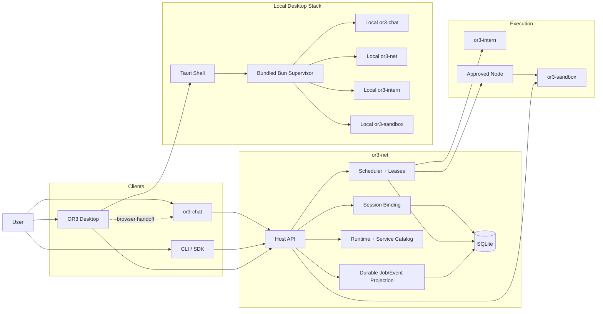
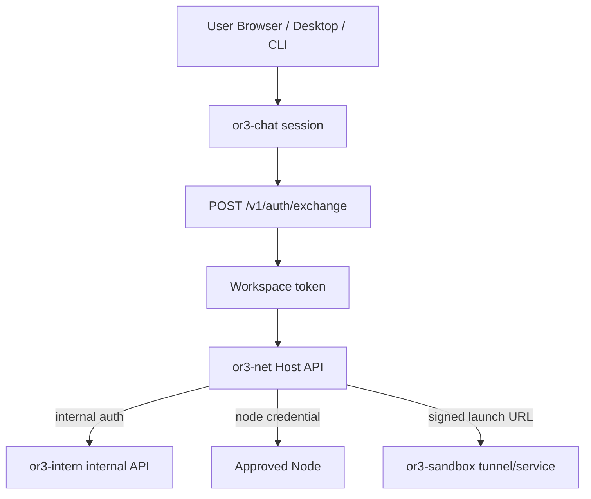
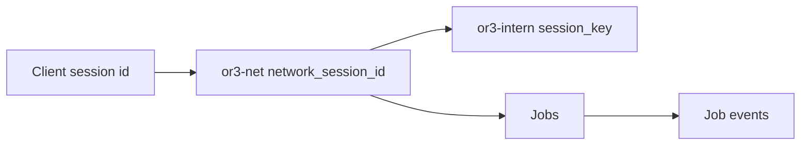
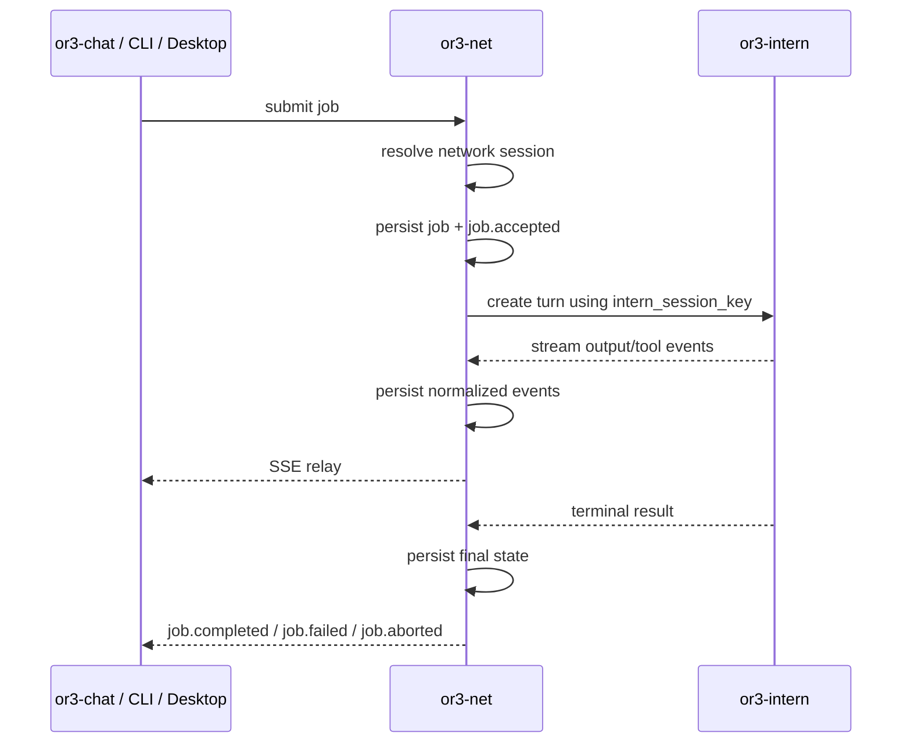
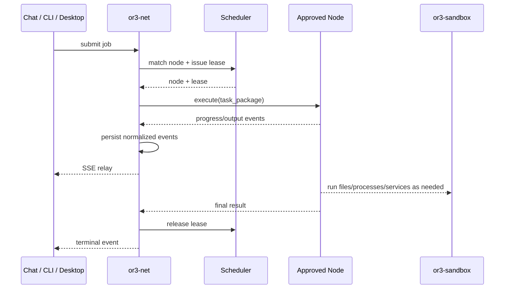
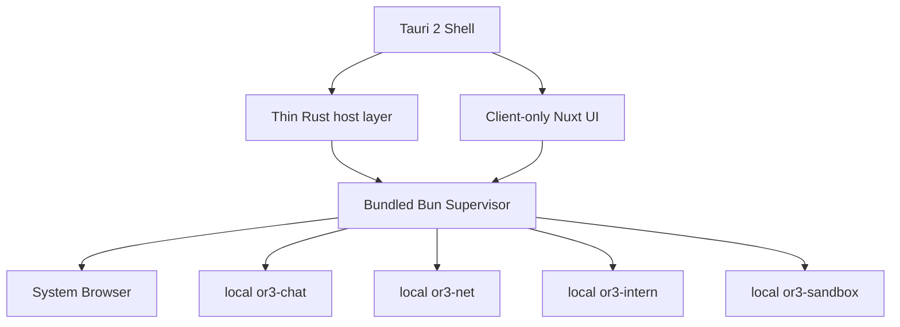

# OR3 Net Architecture

This document describes the **target architecture** for OR3 once the planned `or3-net`, `or3-chat`, `or3-intern`, `or3-sandbox`, and desktop work is implemented.

It is meant to be the easy-to-understand, whole-system view:

- what each repo owns
- how requests move through the system
- where data lives
- how auth, sessions, jobs, previews, and services work
- how the future desktop product fits in

This is the **intended final shape**, not just the current code snapshot.

## 1. The short version

If you remember only one thing, remember this:

- **`or3-chat`** is the user-facing app and identity source.
- **`or3-net`** is the control plane and coordination layer.
- **`or3-intern`** is the execution brain for turns, tools, memory, and agent policy.
- **`or3-sandbox`** is the sandbox and runtime manager for isolated files, processes, tunnels, and services.
- **OR3 Desktop** is a local launcher/operator shell on top of `or3-net`, not a replacement for it.

## 2. Big Picture



## 3. Responsibility Split

| Component | Owns | Does not own |
| --- | --- | --- |
| `or3-chat` | user auth UX, workspace context, plugin UX, pane previews, browser session state | remote scheduling, node control, sandbox control, execution policy |
| `or3-net` | public control plane, host API, sessions, jobs, leases, node registry, provider catalogs, service launch, previews, operator APIs | LLM turn logic, memory engine internals, sandbox runtime internals |
| `or3-intern` | turn execution, tool loops, memory, subagent policy, quotas, audit, execution session meaning | user login, browser-facing control plane, sandbox lifecycle |
| `or3-sandbox` | isolated runtime lifecycle, exec, files, TTY, tunnels, snapshots, quotas, runtime health | OR3 workspace auth, node approval, job routing, chat session ownership |
| OR3 Desktop | local machine orchestration, local updates, logs, launch/open flows, remote-host attach UX | canonical sessions/jobs, remote node auth, direct remote sandbox or intern control |

## 4. Mental Model

The easiest way to think about the system is as four layers:

### 1. User layer

The user interacts with:

- `or3-chat` in the browser
- OR3 Desktop on their machine
- CLI or SDK clients

### 2. Control-plane layer

`or3-net` is the center of the system. It decides:

- who is allowed to do what
- which session a request belongs to
- whether a job runs locally or remotely
- which node is eligible
- how services and previews are exposed

### 3. Execution layer

`or3-intern` performs the actual agent turn execution:

- model calls
- tool loops
- memory retrieval
- subagent rules
- quotas and audit

### 4. Isolation/runtime layer

`or3-sandbox` provides isolated places for code, files, services, and browser tunnels to live.

## 5. Target Deployment Shapes

There are really three supported ways this system is used.

### A. Browser-first hosted flow

- User signs into `or3-chat`
- `or3-chat` exchanges session proof for an `or3-net` workspace token
- `or3-chat` submits jobs to `or3-net`
- `or3-net` calls `or3-intern` or an approved node
- previews/services are opened via `or3-net`

### B. Desktop local stack

- OR3 Desktop launches a bundled local stack
- local `or3-chat`, `or3-net`, `or3-intern`, and `or3-sandbox` run on the user’s machine
- desktop opens those browser surfaces externally
- desktop supervises lifecycle, logs, updates, and local health

### C. Remote operator/client flow

- Desktop or CLI attaches to a remote `or3-net` host
- all remote actions go through the host API
- no SSH and no direct `or3-intern` or `or3-sandbox` calls from clients

## 6. Auth and Trust Boundaries



### Public auth

Public clients authenticate to `or3-net` through:

- short-lived workspace bearer tokens from `POST /v1/auth/exchange`
- workspace-scoped API keys for CLI/SDK/operator clients

### Internal auth

Internal service-to-service auth is separate:

- `or3-net -> or3-intern` uses internal service auth
- `or3-net -> node` uses approved-node credentials
- browser service launches use short-lived launch URLs, not sandbox admin credentials

### Why this matters

This prevents the browser client from becoming a privileged runtime controller.

The browser or desktop UI asks for **jobs**, **previews**, and **services**.
It does not get raw control of:

- sandbox bearer tokens
- arbitrary tunnels
- `or3-intern` internal APIs
- node credentials

## 7. Canonical Data Ownership

This is the most important part for understanding the architecture cleanly.

| Data | Canonical owner |
| --- | --- |
| user identity, workspace membership, chat thread UI state | `or3-chat` |
| network session binding, job routing, operator-visible event history | `or3-net` |
| execution session meaning, memory, tool loop state, audit | `or3-intern` |
| isolated files, processes, tunnels, snapshots, runtime state | `or3-sandbox` |
| local service lifecycle, update checkpoints, local logs | OR3 Desktop supervisor |

### What `or3-net` stores

`or3-net` stores **control-plane state**, not full chat history:

- workspaces
- agents
- jobs
- leases
- nodes
- node credentials
- previews
- API keys
- `network_sessions`
- `job_events`

### What `or3-net` explicitly should not become

It should not become:

- a second chat database
- a second memory engine
- a copy of `or3-intern` transcripts

## 8. Session Model

The final system uses an explicit three-part session bridge:

1. **Client session identity**
   - from `or3-chat`, CLI, SDK, or desktop context
   - examples: chat thread ID, pane ID, CLI session ID

2. **`or3-net` network session**
   - durable coordination record in `network_sessions`
   - links client identity to execution identity

3. **`or3-intern` execution session**
   - `intern_session_key`
   - the canonical execution/memory session inside `or3-intern`



This gives the system:

- replayable operator history
- stable reconnect behavior
- browser/client recovery after refresh
- clear ownership boundaries

## 9. Job Execution Path

There are two execution modes: local and remote.

### Local execution via `or3-intern`



### Remote execution via approved nodes



### Why the scheduler matters

The scheduler is responsible for:

- matching capabilities
- respecting isolation class
- enforcing node approval and health
- consuming issued node credentials
- releasing capacity immediately on terminal states

That is what turns `or3-net` from “just an API wrapper” into a real control plane.

## 10. Provider Model

The final system has two related but different registries:

### Runtime provider registry

These are execution-capable backends:

- `or3-intern`
- `nullclaw`
- future hosted/local runtimes

They advertise:

- execution capability
- launch/abort behavior
- session semantics
- health
- control features

### Service/app registry

These are launchable user-facing UIs:

- `openclaw`
- future dashboards
- other web apps

They advertise:

- launch modes
- browser suitability
- iframe suitability
- restart/revoke capabilities

This distinction matters because `openclaw` is not the abstraction for the whole system.
It is just one launchable app.

## 11. Files, Previews, and Services

The product model is deliberately simple:

- **files** = workspace-owned artifacts inside the workspace sandbox boundary
- **previews** = user-viewable outputs
- **services** = running apps that expose HTTP/WebSocket UIs or APIs

### Static preview

Examples:

- generated websites
- docs builds
- HTML reports

Usually:

- served directly from files
- iframe-friendly
- good for pane embedding in `or3-chat`

### Live service

Examples:

- `openclaw`
- app dev server
- dashboard UI

Usually:

- backed by a process
- may require a temporary tunnel
- may open externally in the browser

### Why users never think about ports

The public product contract is:

- launch a **service**
- open a **preview**

Not:

- create raw tunnel
- manage proxy token
- paste sandbox credential

That complexity stays behind `or3-net`.

## 12. Service Launch Flow

For sandbox-backed services like `openclaw`, the browser launch flow looks like this:

1. User clicks `Open Dashboard` in `or3-chat`, desktop, or another client
2. Client calls `or3-net`
3. `or3-net` checks workspace and service authorization
4. `or3-net` creates or reuses a private `or3-sandbox` tunnel
5. `or3-net` requests a short-lived signed browser URL
6. `or3-net` returns an opaque `launch_url`
7. Browser opens the app through that narrow capability

This is the main reason `or3-net` exists as a distinct layer: it turns raw runtime mechanics into product-safe launch semantics.

## 13. Desktop Architecture

The future OR3 desktop app is not a second control plane. It is a local operator shell.



### Desktop owns

- local install/start/stop/restart/reset
- local logs and health
- local update/rollback
- local browser handoff
- remote host attach UX

### Desktop does not own

- canonical jobs/sessions
- remote scheduling
- remote node approval/auth
- direct remote sandbox control

### Local sandbox posture

On macOS, desktop uses a managed `QEMU`/`HVF` local VM path for `or3-sandbox`.

Important distinction:

- macOS `HVF` is a local/dev-grade VM posture
- Linux/KVM remains the production reference posture

The desktop app should be honest about that.

## 14. Security and Safety Rules

The final architecture relies on a few hard rules:

- workspace tokens are separate from node credentials
- browser clients never receive raw sandbox admin credentials
- service launches are narrow and short-lived
- warm pools are workspace-scoped only
- runtimes must be reset before reuse
- `or3-net` persists durable terminal states and normalized event history
- desktop local control uses a local authenticated boundary

This keeps the system understandable because each layer has a narrow responsibility and a narrow trust scope.

## 15. What the Repo Looks Like When This Is Implemented

At a high level, the `or3-net` repo becomes:

```text
or3-net/
  src/                 # host API, contracts, scheduler, execution, nodes, previews
  sdk/                 # typed SDKs for intern, sandbox, and possibly host clients
  cli/                 # operator and developer CLI
  supervisor/          # bundled Bun local orchestration daemon
  desktop/             # Tauri + client-only Nuxt shell
  planning/            # architecture and implementation plans
```

### `src/`

Owns:

- public host API
- session binding
- durable event projection
- scheduler and leases
- node registry
- preview/service launch
- provider catalogs

### `supervisor/`

Owns:

- local machine state
- service lifecycle
- bundle updates
- local rollback
- local browser-open actions

### `desktop/`

Owns:

- user-facing local operator shell
- tray/menu-bar
- local/remote host attach UI
- update and logs UI

## 16. The Practical “How It All Works Together” Story

If everything is implemented, the normal OR3 story looks like this:

1. A user signs into `or3-chat`
2. `or3-chat` resolves the current workspace
3. It exchanges that session for a short-lived `or3-net` token
4. It submits work to `or3-net`
5. `or3-net` resolves the network session and stores job metadata
6. `or3-net` decides whether to run locally through `or3-intern` or remotely through an approved node
7. The execution backend may use `or3-sandbox` to provide isolated files, processes, services, and previews
8. `or3-net` normalizes all of that into stable job events, sessions, previews, and service launches
9. `or3-chat`, desktop, CLI, and operator tools all consume the same control-plane truth

That is the real value of `or3-net`:

it is the layer that makes **multiple clients**, **multiple runtimes**, and **multiple execution environments** feel like one system instead of a pile of related projects.

## 17. Related Planning Docs

The most important detailed plans behind this document are:

- `planning/01-responsibilities.md`
- `planning/02-communication-architecture.md`
- `planning/03-security-model.md`
- `planning/04-host-api.md`
- `planning/08-files-tunnels-previews.md`
- `planning/remote-execution-completion/requirements.md`
- `planning/operator-session-completion/design.md`
- `planning/chat-v1-integration/design.md`
- `planning/desktop/design.md`

If you want the shortest explanation, read this file.
If you want implementation detail, follow those plan docs.
