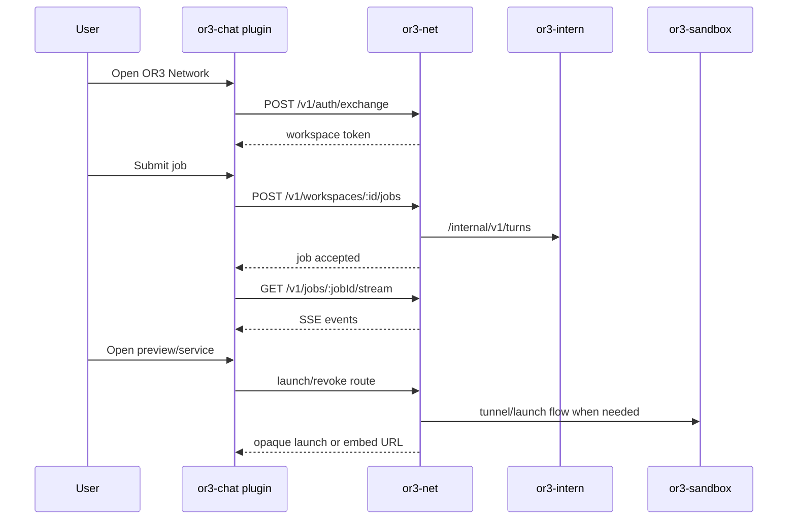

# Chat V1 Integration — Design

## Overview

This design completes the user-facing OR3 Network flow by making `or3-chat` a first-class client of `or3-net` through a plugin surface.

The design stays aligned with current repo architecture:

- `or3-chat` remains local-first and plugin-centric
- `or3-net` remains the only browser-facing integration backend for network features
- `or3-intern` and `or3-sandbox` remain server-side dependencies hidden behind `or3-net`

The result should feel like a single product flow:

1. user opens the OR3 Network plugin in chat
2. plugin exchanges the active chat session for an `or3-net` token
3. plugin resolves or creates the current network session binding
4. user submits a job
5. live progress and final results stream back through `or3-net`
6. user can abort, inspect history, or open previews/services from the same context

## Affected areas

### `or3-chat`

- `/Users/brendon/Documents/or3/or3-chat/app/plugins/**`
  - plugin registration and route/sidebar integration
- `/Users/brendon/Documents/or3/or3-chat/app/composables/**`
  - `useSessionContext()` reuse, token exchange composable, host API client, streaming state helpers
- `/Users/brendon/Documents/or3/or3-chat/app/components/**`
  - OR3 Network page, job list, stream view, node/service cards, preview pane UI
- `/Users/brendon/Documents/or3/or3-chat/tests/**`
  - plugin/component/integration tests

### `or3-net`

- `src/api/app.ts`
  - session-aware host API behavior for plugin consumers
- `src/console/index.ts`
  - optional parity improvements and route reuse
- `tests/app.phase2.test.ts`, `tests/previews.phase45.test.ts`
  - host-side regressions for browser-facing workflows

### Cross-repo contract docs

- `/Users/brendon/Documents/or3/or3-chat/planning/or3-net-plan.md`
- `/Users/brendon/Documents/or3-net/planning/operator-session-completion/**`
- `/Users/brendon/Documents/or3-intern/planning/or3-net-plan.md`

## Control flow / architecture

### Token exchange

The plugin should use a dedicated composable, not ad hoc fetches in components.

Responsibilities:

- read current workspace/user identity from existing `useSessionContext()`-style flows
- prepare a provider-agnostic session proof
- call `POST /v1/auth/exchange`
- cache the returned token in memory only
- invalidate and re-exchange on workspace switch or token expiry

### Session-aware job flow

The plugin should not invent its own session identity; it should bind to the host session model.

Preferred flow:

- when the user opens a chat-thread-linked OR3 Network view, the plugin derives `client_kind = "or3-chat"` and `client_session_id = <thread-or-pane-id>`
- the first job submission resolves or creates the `network_session_id` through the host API
- subsequent job submissions reuse that `network_session_id`
- after refresh or reconnect, the plugin reloads jobs and event history for the same session binding

### Streaming UX

Use SSE for the primary happy path, with a bounded recovery path.

- subscribe to `GET /v1/jobs/:jobId/stream`
- append live events to local reactive state
- on disconnect, re-fetch the job and recent event history from `or3-net`
- if the job is terminal, stop reconnecting

This matches the current event model and avoids browser WebSocket complexity.

### Service and preview UX

There should be two clear UX modes:

- **service launch** for node-backed dashboards like OpenClaw
- **preview pane** for static or iframe-safe outputs

The plugin should treat both as host-issued capabilities:

- never manage raw ports or tunnel tokens directly
- only open `launch_url` / `embed_url` returned by `or3-net`
- show `Open in New Tab` fallback whenever embedding is not supported or fails

## Data and persistence

### In `or3-chat`

Keep local persistence light:

- in-memory token cache
- small UI prefs in existing local storage/KV patterns if appropriate
- no long-lived storage of `or3-net` bearer tokens

### In `or3-net`

Reuse the operator/session model:

- session binding persists in `or3-net`
- jobs and job events remain authoritative there for network inspection
- previews and service launches remain host-issued and workspace-scoped

### Cross-repo ownership

- `or3-chat` owns UI composition, current workspace, and client session identity
- `or3-net` owns network session binding, job routing, replayable event history, and browser launch capabilities
- `or3-intern` owns execution history, memory, and the internal meaning of `session_key`

## Interfaces and types

### `or3-chat` client composables

Suggested internal composables:

- `useOr3NetAuth()`
  - token exchange and refresh
- `useOr3NetClient()`
  - typed host API wrapper
- `useOr3NetSession()`
  - resolve/reuse current `network_session_id`
- `useOr3NetJobStream()`
  - subscribe/recover/replay current job events

### Host API expectations

The plugin needs at least:

- `POST /v1/auth/exchange`
- `POST /v1/workspaces/:workspaceId/jobs`
- `GET /v1/workspaces/:workspaceId/jobs`
- `GET /v1/jobs/:jobId`
- `GET /v1/jobs/:jobId/stream`
- `POST /v1/jobs/:jobId/abort`
- session inspection/replay routes from the operator/session plan
- service launch and preview routes already planned in `or3-net`

### UI components

At minimum:

- plugin shell/page
- recent jobs list
- active job stream panel
- node/service list with launch actions
- preview pane wrapper with fallback states

These should follow existing Nuxt/UI patterns instead of introducing a separate frontend stack.

## Failure modes and safeguards

- **Token expired**
  - retry exchange once using the current workspace session, then surface auth failure
- **Workspace switched mid-stream**
  - cancel the old subscription, invalidate token/session state, and reload for the new workspace
- **Session mismatch**
  - clear local binding and resolve again through host API
- **Preview refused in iframe**
  - show fallback state with `Open in New Tab`
- **Launch URL expired**
  - request a fresh launch from `or3-net`; do not reuse stale URLs
- **Permission denied**
  - surface a clear UI state instead of silently hiding all context
- **Static mode**
  - plugin remains disabled unless explicitly configured

## Testing strategy

- **`or3-chat` tests**
  - token exchange composable behavior
  - workspace switch invalidation/rebind
  - SSE disconnect recovery
  - abort UI state transitions
  - preview pane fallback behavior
- **`or3-net` tests**
  - browser-facing host API expectations used by the plugin
  - session-aware job and preview/service routes
- **Cross-repo end-to-end tests**
  - authenticated job submission from chat UI to `or3-net`
  - live stream rendering and abort
  - dashboard launch via opaque URL
  - iframe-safe preview open plus external fallback
