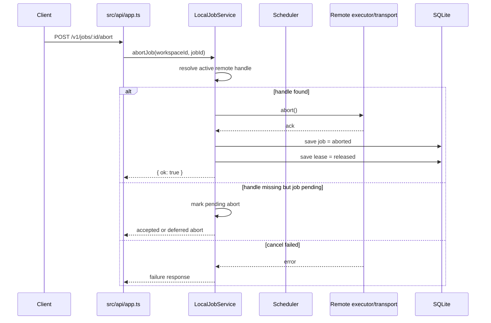

# Control Plane Hardening — Design

## Overview

This remediation plan keeps `or3-net` in its current Bun/TypeScript + SQLite architecture and fixes the reported issues by tightening the existing execution, scheduler, API, preview, SDK, and operator layers.

The design stays intentionally incremental:

- Fix the execution correctness bugs at the root by making remote jobs cancellable and leases releasable.
- Normalize malformed request bodies at the HTTP boundary instead of leaking runtime parser behavior.
- Add bounded cleanup to preview launch capability indexes rather than replacing the preview model.
- Bring the sandbox SDK and remote transport paths into contract parity with the services they already target.
- Expand API/CLI/console coverage by reusing existing database state and service objects instead of adding a separate operator backend.

## Affected areas

- `src/execution/local-jobs.ts`
  - Owns job submission, terminal-state persistence, local-vs-remote routing, and abort behavior.
- `src/scheduler/scheduler.ts`
  - Owns lease issuance and active-capacity accounting.
- `src/db/client.ts`
  - Already persists jobs, leases, nodes, credentials, previews, and likely API keys; will be reused for new operator routes and lease state transitions.
- `src/api/app.ts`
  - Owns HTTP request parsing, route coverage, and response normalization.
- `src/previews/service.ts`
  - Owns preview launch capability minting, resolution, revoke, and reverse indexes.
- `src/nodes/executor.ts`, `src/nodes/transport.ts`, `src/nodes/transport-https.ts`, `src/nodes/transport-wss.ts`, `src/nodes/registry.ts`
  - Own the remote-node execution protocol, transport abstraction, auth material, and approval lifecycle.
- `sdk/sandbox/client.ts`, `sdk/sandbox/types.ts`
  - Own the TypeScript wire contract to `or3-sandbox`.
- `sdk/intern/*`
  - Own the service contract assumptions for `or3-intern`.
- `cli/index.ts`
  - Owns the operator CLI command surface.
- `src/console/index.ts`
  - Owns the built-in operator console surface.
- `tests/local-jobs.test.ts`, `tests/app.phase2.test.ts`, `tests/previews.phase45.test.ts`, `tests/sdk.clients.test.ts`, `tests/transport.test.ts`, `tests/nodes.phase3.test.ts`, `tests/cli.test.ts`, `tests/console.test.ts`
  - Existing test homes for the affected behavior.

## Control flow / architecture

### 1. Remote execution lifecycle becomes cancel-aware

Today `LocalJobService` only tracks `backendJobIds` for local `or3-intern` execution. Remote jobs return a single promise and disappear behind that abstraction, so abort has no live upstream handle.

The remediation keeps `LocalJobService` as the job orchestrator, but makes the remote path explicit:

- `runRemoteTask()` issues a lease and starts a remote execution run.
- The remote executor returns a run handle that includes:
  - a `result` promise (or async stream wrapper)
  - an `abort()` method
  - enough identity to release any transport-local resources
- `LocalJobService` stores that handle in an in-memory map keyed by `jobId`.
- `abortJob()` checks, in order:
  - remote execution handle
  - local intern backend job ID
  - pending-not-yet-started execution
- `finalizeAbort()` only runs after upstream cancellation is confirmed or the job is known not to have started.

A minimal shape is:

```ts
interface RemoteExecutionHandle {
  result: Promise<JobResult>;
  abort(): Promise<void>;
}
```

If streamed remote execution is added in the same pass, the handle can grow into:

```ts
interface RemoteExecutionRun {
  stream?: AsyncIterable<JobStreamEvent>;
  result: Promise<JobResult>;
  abort(): Promise<void>;
}
```

### 2. Lease release moves into the remote execution `finally` path

`LeaseScheduler.issueLease()` already returns a stored lease record. The missing piece is lifecycle closure.

`runRemoteTask()` should:

1. issue and persist the lease
2. attach the leased node to the job
3. start remote execution
4. publish `job.started`
5. await the remote result or error
6. in a `finally` block, mark the lease released or terminal-failed

That keeps scheduler capacity accurate regardless of whether the remote job:

- completes normally
- throws during execution
- is aborted successfully
- fails during startup after lease issuance

### 3. Abort becomes a two-phase state machine instead of an optimistic local mutation

The bug report is correct that returning `{ ok: true }` before remote cancellation is routed upstream makes abort fictional.

The fixed behavior should follow this rule:

- **If execution has an active cancel path:** call it first, then persist `job.aborted`.
- **If execution has not started yet but is queued locally:** record pending-abort and prevent start/final completion.
- **If execution is already terminal:** return success/no-op without changing state.
- **If the upstream cancel path fails:** return an error and do not locally finalize abort as though it succeeded.

This keeps terminal job states monotonic and truthful.



### 4. HTTP JSON parsing is normalized at the request boundary

`readOptionalJson()` is the right boundary to classify malformed JSON. The design change is intentionally small:

- empty body → `{}`
- malformed body → `HttpError(400, "invalid JSON body")`
- valid body → parsed payload

This avoids per-route duplication and ensures all routes using optional JSON receive the same stable error behavior.

### 5. Preview launch capability state gets explicit pruning helpers

`PreviewService` currently has three in-memory indexes:

- `launchCapabilities`
- `previewLaunchTokens`
- `scopedLaunchTokens`

The service should add a single internal deletion helper that removes a token from all relevant indexes, then call it from:

- expiry handling during `resolveLaunchCapability()`
- preview revoke
- scope revoke
- any successful cleanup path where a capability should no longer survive

This preserves the current in-memory model and HTTP behavior while preventing unbounded token retention.

### 6. Sandbox SDK is brought into wire-level parity

The current `sdk/sandbox` client is too narrow and assumes the wrong streaming semantics. The fix should keep the SDK internal to `or3-net` unless/until it is extracted, but make its wire contract accurate.

Key corrections:

- use the real stream activation mechanism for exec streaming
- parse the actual event/chunk format emitted by `or3-sandbox`
- align request/response types with `or3-sandbox/internal/model`
- add only the methods `or3-net` needs now, while clearly marking any intentionally deferred endpoints

This design avoids speculative SDK expansion while removing incorrect assumptions that would break real sandbox-backed nodes.

### 7. Remote transport becomes execution-aware instead of request-only

The current transport interface is too weak for remote-job lifecycle control. It supports a one-shot request and an unused stream method.

The transport layer should be refactored around remote execution operations instead of bare JSON-RPC request/response alone. Two viable shapes fit the current codebase:

```ts
interface NodeRpcTransport {
  readonly kind: "https" | "outbound-wss";
  execute(task: TaskPackage, auth: NodeAuthContext): Promise<RemoteExecutionHandle>;
  abort(jobId: string, auth: NodeAuthContext): Promise<void>;
}
```

or, if request/response framing must stay explicit:

```ts
interface NodeRpcTransport {
  request(request: NodeRequest, auth?: NodeAuthContext): Promise<NodeResponse>;
  openExecution(request: NodeRequest, auth?: NodeAuthContext): Promise<RemoteExecutionHandle>;
}
```

The first shape is preferable for remediation work because it makes cancellation a first-class requirement.

Design expectations by transport:

- **HTTPS**
  - include the issued node credential in headers
  - support explicit remote abort calls
  - optionally support streamed execution if the node contract already defines it
- **Outbound WSS**
  - maintain a connection/session registry instead of only an injected handler
  - correlate execution requests, responses, stream frames, and abort requests by request/job ID
  - surface connection loss as an execution failure that still releases the lease

### 8. Certification/auth policy is enforced at scheduling time

`NodeManifest.certification` already exists, but scheduling ignores it. The least disruptive fix is to keep certification policy in the scheduler or a scheduler-adjacent filter rather than moving it into storage.

Suggested approach:

- introduce an optional scheduler policy/config object
- when managed-mode certification enforcement is on:
  - require a non-expired certification block
  - optionally constrain issuer allowlists if that policy already exists elsewhere
- continue reusing existing approval and health checks

This is a filter-layer change, not a persistence redesign.

### 9. Operator surfaces are expanded by reusing existing services

The API, CLI, and console should stay thin wrappers over `LocalJobService`, DB query helpers, auth, and any existing API-key service/storage.

Planned additions:

- HTTP routes for workspace job listing and API-key management
- CLI commands that directly call those routes
- console sections for:
  - workspace overview/job list
  - approval queue / node state visibility
  - API-key operations
  - job stream selection or inspection

No separate SPA or frontend stack is needed; the existing minimal HTML console pattern is sufficient.

## Data and persistence

- **SQLite schema changes:** none are required for the core correctness fixes if existing `jobs`, `leases`, `nodes`, `node_credentials`, `previews`, and API-key tables already carry the needed state.
- **Potential additive migration:** only introduce one if API-key management surfaces expose a missing persisted field such as revocation metadata that is not already present.
- **In-memory state additions:** add a remote execution handle map in `LocalJobService`. This is intentionally process-local because it only represents active executions.
- **Session/workspace implications:** none beyond preserving existing workspace scoping checks for jobs, nodes, previews, leases, and API keys.
- **Config changes:** likely optional scheduler/managed-mode policy knobs for certification enforcement and possibly transport auth defaults. Keep them additive with safe defaults.

## Interfaces and types

### Remote execution lifecycle

```ts
interface RemoteExecutionHandle {
  readonly result: Promise<JobResult>;
  abort(): Promise<void>;
}
```

`RemoteNodeExecutor` should expose a start-oriented API instead of returning only a final result:

```ts
class RemoteNodeExecutor {
  startTask(node: StoredNode, taskPackage: TaskPackage): Promise<RemoteExecutionHandle>;
}
```

### Lease release helper

A small helper inside `LocalJobService` or `LeaseScheduler` should centralize transition to a non-active lease state:

```ts
releaseLease(workspaceId: string, leaseId: string, releasedAt?: string): void
```

This avoids duplicating lease row update logic across success, failure, and abort paths.

### Request-body parsing

Keep `HttpError` as the boundary error type and normalize malformed bodies through it:

```ts
const readOptionalJson = async (request: Request): Promise<unknown>
```

### Preview cleanup helper

```ts
private deleteCapability(token: string, capability: LaunchCapability): void
```

The helper should delete from all three indexes and be the only path that mutates reverse index membership.

## Failure modes and safeguards

- **Abort after completion:** return a stable success/no-op response; do not emit a second terminal event.
- **Abort transport failure:** surface a failure response and keep the job non-aborted until confirmed.
- **Remote execution throws after lease issuance:** persist `job.failed`, then release the lease in `finally`.
- **Transport disconnect mid-job:** convert to a terminal failure, release the lease, and terminate any stream subscribers predictably.
- **Malformed JSON:** return `400 invalid JSON body`; do not leak parser internals.
- **Preview capability expired or revoked:** prune indexes, then return the existing client-facing state error.
- **Missing node credential / expired credential:** fail scheduling or transport setup clearly; do not silently fall back to unauthenticated calls.
- **Managed-mode certification mismatch:** treat the node as ineligible for scheduling rather than approved-but-runnable.
- **Cross-repo contract drift:** gate new transport/SDK assumptions behind explicit compatibility tests so `or3-net` does not encode stale behavior.

## Testing strategy

- **Unit tests**
  - `tests/local-jobs.test.ts`
    - remote abort invokes upstream abort
    - no `job.completed` after successful remote abort
    - remote completion/failure/abort releases lease
    - second job schedules immediately after remote terminal state
  - `tests/previews.phase45.test.ts`
    - expiry lookup prunes capabilities
    - revoke removes reverse index entries
    - repeated launch/revoke cycles remain bounded
  - `tests/sdk.clients.test.ts`
    - sandbox exec streaming matches real wire semantics
    - added SDK methods parse expected payloads
  - `tests/transport.test.ts`
    - HTTPS auth header propagation
    - outbound WSS request/abort correlation

- **HTTP/integration tests**
  - `tests/app.phase2.test.ts`
    - malformed JSON returns `400` with stable error text
    - new jobs-list and API-key routes enforce workspace scope and auth
  - `tests/nodes.phase3.test.ts`
    - scheduler refuses uncertified nodes in managed mode
    - approved nodes without usable transport/auth are not selected

- **CLI/console tests**
  - `tests/cli.test.ts`
    - job list and API-key commands hit the right routes
  - `tests/console.test.ts`
    - console renders new operator sections and uses authenticated workflows

- **Cross-repo compatibility checks**
  - Validate `sdk/sandbox` against the real `or3-sandbox` API behavior.
  - Validate `sdk/intern` request/event assumptions against the current `or3-intern` service surface before expanding remote-node features that depend on it.
