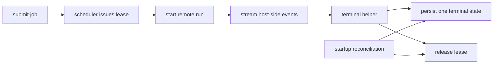

# Overview

This plan keeps `or3-net` simple: fix the existing control-plane seams instead of inventing a new architecture. The solution centers on four small moves:

1. make remote execution lifecycle-aware instead of promise-only,
2. enforce lease cleanup and terminal-state monotonicity in one place,
3. freeze the remote and sandbox contracts with tests, and
4. add only the operator/API surfaces needed to inspect and recover the system.

This fits the current Bun server, SQLite persistence, scheduler, transport registry, and built-in console model.

# Affected areas

- `src/execution/*` — remote job handle tracking, terminal-state guards, abort flow, reconciliation.
- `src/scheduler/*` — lease accounting, candidate eligibility, certification-aware scheduling.
- `src/nodes/*` — transport lifecycle contract, credential use, heartbeat/capability handling.
- `sdk/sandbox/*` — corrected daemon contract for the subset of `or3-sandbox` endpoints `or3-net` actually uses.
- `src/api/app.ts`, `cli/index.ts`, `src/console/*` — stable error envelopes, idempotent flows, minimal operator inspection surfaces.
- `tests/*` — regression, contract, restart-repair, and operator/API coverage.

# Control flow / architecture

`or3-net` keeps ownership of job state, lease state, and terminal semantics.

Remote execution flow:

1. Scheduler selects a node only if approval, health, capabilities, transport, credentials, and certification posture are all usable.
2. Executor starts a remote run and receives a `RemoteExecutionRun`-style handle containing stream attachment, abort, and terminal completion hooks.
3. `LocalJobService` normalizes remote progress into the existing job event stream and persists exactly one terminal outcome.
4. A shared terminal helper releases the lease, clears any active handle, and refuses later contradictory events.
5. On startup, reconciliation scans durable jobs and leases, repairs stale pairings, and releases ghost capacity conservatively.



# Data and persistence

SQLite remains authoritative.

Likely additive changes only:

- lease state may need an explicit released or repaired transition if it does not already exist everywhere it is used,
- remote execution tracking stays in memory and is keyed by durable `job_id`,
- preview/service capability cleanup should reuse one deletion path so reverse indexes do not leak.

Config changes:

- none required for the main stabilization wave beyond using existing managed-mode and transport settings,
- if idempotency storage is added, keep it additive and scoped to current sensitive flows only.

# Interfaces and types

Keep the new interfaces narrow.

Example transport shape:

```ts
interface RemoteExecutionRun {
  stream(): AsyncIterable<JobStreamEvent>
  abort(reason?: string): Promise<void>
  result: Promise<JobResult>
}
```

Example executor contract:

```ts
startRemoteExecution(input: ScheduledRemoteTask): Promise<RemoteExecutionRun>
```

Sandbox contract work should stay validation-first: compare `sdk/sandbox/types.ts` and `sdk/sandbox/client.ts` against `or3-sandbox` API behavior and only implement the surfaces the adapter currently consumes.

# Failure modes and safeguards

- Abort races: terminal helper ignores later completion after confirmed abort.
- Transport disconnects: fail the job with a stable remote transport error and release the lease.
- Restart during active remote run: reconciliation decides between reattachment, conservative failure, or lease release based on durable job/lease state.
- Credential drift: scheduling fails early with a clear node-unusable error.
- Malformed client input: API returns stable `400` envelopes instead of raw parser or stack text.
- Preview token churn: one cleanup path removes forward and reverse indexes on resolve, revoke, and expiry.

# Testing strategy

- Unit tests for terminal-state monotonicity, lease release helper behavior, scheduler eligibility, and preview cleanup.
- Transport tests for execute/stream/abort parity across HTTPS and WSS.
- Contract tests for the sandbox client against documented `or3-sandbox` request/response and stream framing.
- Restart/reconciliation regression tests using SQLite-backed job and lease fixtures.
- API, CLI, and console tests for job list, node inspection, launch revocation, malformed JSON, and idempotent retry behavior.
