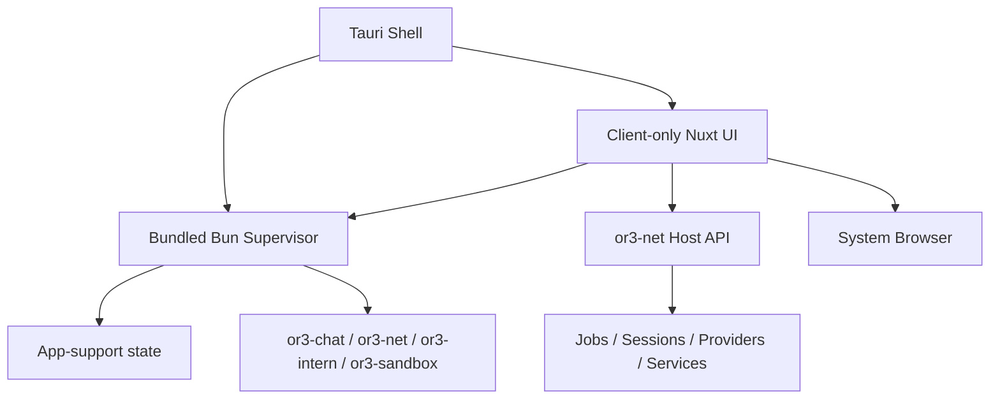

# OR3 Desktop Control Center on Top of OR3 Net — Design

## Overview

This design adds a desktop product family to the existing `or3-net` repository without changing the ownership model that the rest of the OR3 plans already rely on.

The solution is intentionally layered:

- existing `src/**` remains the host and control-plane core
- new `supervisor/**` becomes the bundled local orchestration daemon
- new `desktop/**` becomes the `Tauri 2` shell with a client-only `Nuxt` app
- shared desktop contracts live in a shared package or module rather than being duplicated across host, supervisor, and desktop UI

The core design rule is:

- desktop owns machine-local orchestration and browser launch
- `or3-net` owns remote and local control-plane truth
- browser apps remain browser apps

This fits the current architecture because `or3-net` already owns jobs, sessions, nodes, services, previews, CLI workflows, and a minimal operator console. Desktop extends that control-plane foundation instead of replacing it.

## Affected areas

### Existing `or3-net` host code

> **Cross-ref:** Runtime-provider contracts, adapter registry, and runtime session/catalog routes are planned in `planning/runtime-contract/`. Desktop consumes `RuntimeDescriptor`, `RuntimeNodeDescriptor`, and the `/v1/workspaces/:wsId/runtimes` and `/v1/workspaces/:wsId/runtime-sessions` route families.

- `/Users/brendon/Documents/or3-net/src/api/app.ts`
  - add the operator and provider-catalog routes desktop depends on (runtime routes defined in `planning/runtime-contract/`)
- `/Users/brendon/Documents/or3-net/src/contracts/*.ts` and `src/contracts/runtime/`
  - extend contract metadata with runtime-provider, service-app, and desktop-facing capability shapes
- `/Users/brendon/Documents/or3-net/src/execution/**`
  - reused for host-side job, status, and session workflows surfaced to desktop
- `/Users/brendon/Documents/or3-net/src/nodes/**`
  - reused for node, runtime, and service metadata surfaced through provider catalogs
- `/Users/brendon/Documents/or3-net/src/previews/**`
  - reused for service-launch and preview capability metadata
- `/Users/brendon/Documents/or3-net/cli/index.ts`
  - likely remains a thin control-plane consumer; desktop should not fork its logic
- `/Users/brendon/Documents/or3-net/src/console/index.ts`
  - continues to exist for web/operator parity and should share host routes with desktop

### New supervisor package family

- `/Users/brendon/Documents/or3-net/supervisor/**`
  - Bun/TypeScript local orchestration daemon
  - local state storage, local auth, process lifecycle, update staging, rollback, and log streaming

### New desktop package family

- `/Users/brendon/Documents/or3-net/desktop/**`
  - client-only `Nuxt` shell app
  - pages for local stack, remote attachments, providers, updates, logs, and failures
- `/Users/brendon/Documents/or3-net/desktop/src-tauri/**`
  - thin Rust host for Tauri boot, tray/menu-bar, sidecar start, updater hooks, browser-open actions, and macOS integration

### Repo/package configuration

- `/Users/brendon/Documents/or3-net/package.json`
  - root scripts and workspace layout for host, supervisor, and desktop work

## Control flow / architecture

The desktop product runs as a machine-local shell around the existing OR3 control plane.

### Startup flow

1. Tauri launches the desktop app and starts the bundled Bun supervisor sidecar.
2. The supervisor initializes the app-support directory, version metadata, local auth token, managed-instance inventory, and update state.
3. The client-only `Nuxt` shell connects to the supervisor over a local authenticated HTTP API.
4. The supervisor reports current service inventory, runtime health, ports, bundle versions, and pending recovery or rollback state.
5. The shell renders local stack and remote attachment state using local supervisor state plus remote `or3-net` host metadata.

### Local machine orchestration flow

1. User clicks a local action such as `Start`, `Restart`, `Reset`, `Open Chat`, or `Open Admin`.
2. The shell calls the local supervisor API.
3. The supervisor performs lifecycle reconciliation first:
   - detect stale PID files
   - detect occupied ports
   - inspect current service health
   - refuse ambiguous “already running but unhealthy” states
4. The supervisor starts or repairs the requested local service set.
5. For browser-open actions, the supervisor verifies readiness before returning the local URL to open.
6. The shell asks Tauri to open the returned URL in the user’s browser.

### Remote attachment flow

1. User adds a remote OR3 host descriptor.
2. The shell stores only the host descriptor and user-facing metadata in desktop state.
3. The shell fetches jobs, sessions, providers, services, and previews through `or3-net` host APIs only.
4. The shell merges host capability metadata with local desktop affordances to render allowed actions.

### Provider rendering flow

Desktop renders two catalogs:

- **runtime providers**
  - execution-capable backends such as `or3-intern` and `nullclaw`
  - advertise lifecycle, session, launch, and control capabilities
- **service or app providers**
  - launchable UIs such as `openclaw`
  - advertise launch modes, browser actions, iframe policy, restartability, and revoke support

Both desktop and browser clients consume these catalogs from shared host contracts rather than hard-coded app-specific conditionals.

For runtime providers specifically, the host contract source of truth is `planning/runtime-contract/`: desktop consumes `RuntimeDescriptor` for provider rows and `RuntimeNodeDescriptor` for per-node drill-down and action gating.



## Data and persistence

### Desktop supervisor state

Supervisor state lives under the desktop app-support directory on macOS.

Persisted supervisor data includes:

- managed instance inventory
- last-known service ports and health
- bundle versions
- update staging metadata
- rollback checkpoints
- remote host descriptors and non-secret display metadata

The local supervisor auth token is ephemeral per app launch by default. It is not a second long-lived session layer for the OR3 platform.

### Control-plane state

Desktop does not create a second canonical session store.

`or3-net` continues to use the planned durable session and event projection model from `planning/operator-session-completion`, especially:

- `network_sessions`
- `job_events`

Desktop consumes that model through host APIs rather than duplicating it in local desktop storage.

### Local sandboxing posture

For local sandboxing on macOS:

- desktop uses a bundled or managed `QEMU`/`HVF` path aligned with `or3-sandbox`’s existing QEMU runtime support
- desktop defaults to a VM-backed local runtime selection rather than a trusted-Docker default
- desktop must still present the posture honestly:
  - macOS `HVF` is a local and development-grade VM path
  - Linux with KVM remains the production reference posture documented by `or3-sandbox`

No desktop docs should collapse those two postures into a single production-equivalent claim.

## Interfaces and types

### Supervisor API

The supervisor exposes a local authenticated HTTP API for machine-local orchestration:

- `GET /v1/local/instances`
- `GET /v1/local/instances/:id`
- `POST /v1/local/instances/:id/start`
- `POST /v1/local/instances/:id/stop`
- `POST /v1/local/instances/:id/restart`
- `POST /v1/local/instances/:id/reset`
- `GET /v1/local/instances/:id/logs`
- `GET /v1/local/providers`
- `GET /v1/local/updates`
- `POST /v1/local/updates/check`
- `POST /v1/local/updates/apply`
- `POST /v1/local/browser/open`

The local API is for machine-local orchestration only. It does not replace `or3-net` host APIs.

### Host API additions

Desktop depends on these `or3-net` host capabilities landing through the existing Bun host:

- jobs list / inspect / abort
- sessions list / detail / event replay
- API key create / list / revoke
- provider catalog routes
- runtime launch / health / control routes
- service or app catalog and launch routes

These routes stay inside `src/api/app.ts` and related host services so the desktop client consumes the same surface as CLI, console, and browser clients.

### Shared types

Add shared desktop-facing contracts such as:

```ts
type ManagedInstance = {
  id: string;
  kind: "or3-chat" | "or3-net" | "or3-intern" | "or3-sandbox";
  status: "stopped" | "starting" | "running" | "degraded" | "failed";
  version?: string;
  ports: number[];
  health?: "unknown" | "healthy" | "degraded" | "failed";
  last_error?: string;
};

type ManagedServiceDescriptor = {
  id: string;
  label: string;
  kind: "core_service" | "sidecar" | "local_runtime";
  required: boolean;
};

type DesktopProviderDescriptor = {
  id: string;
  kind: "runtime" | "service_app";
  capabilities: string[];
  health?: "unknown" | "healthy" | "degraded" | "failed";
  launchable: boolean;
};

type OpenTarget = {
  kind: "local-chat" | "local-admin" | "operator" | "remote-host";
  url: string;
  label: string;
  auth_hint?: "normal-web-auth";
};

type UpdateBundleManifest = {
  bundle_version: string;
  shell_version: string;
  supervisor_version: string;
  services: Array<{ id: string; version: string }>;
  migration_hooks: string[];
  rollback_checkpoint_required: boolean;
};

type UpdatePlan = {
  from_version: string;
  to_version: string;
  requires_restart: boolean;
  compatibility_notes: string[];
  rollback_checkpoint_id: string;
};
```

Capability metadata must clearly distinguish:

- `runtime` providers
- `service_app` providers

That distinction prevents `openclaw` from becoming the accidental abstraction for runtimes and keeps `or3-intern` or `nullclaw` from being modeled as browser apps.

## Failure modes and safeguards

The implementation must handle these failure modes explicitly:

- **Supervisor boot failure**
  - Tauri shows a clear degraded desktop state instead of claiming local control is available.
- **Stale PID or port conflict**
  - supervisor reconciles before claiming start success and surfaces a structured repair error when cleanup fails.
- **Service not ready during browser handoff**
  - supervisor blocks or retries open until readiness or returns a clear failure without opening a dead URL.
- **Missing or unhealthy QEMU/HVF prerequisites**
  - desktop shows a sandbox doctor failure and does not market local sandbox features as healthy.
- **Remote host auth failure**
  - desktop invalidates the attachment session state and surfaces a clear host-auth error instead of quietly hiding data.
- **Update apply failure**
  - supervisor stops the apply, restores the prior checkpoint, and marks the failed bundle as non-active.
- **Log safety**
  - supervisor redacts secrets, tokens, cookies, and sensitive env values from local logs and error surfaces.
- **Desktop/supervisor version mismatch**
  - the shell refuses incompatible control actions and prompts for update or rollback instead of guessing protocol compatibility.

## Testing strategy

### Bun / TypeScript tests

Add Bun tests for:

- supervisor lifecycle control
- local API auth and authorization
- local log redaction
- update staging, apply, and rollback
- provider-merging and capability rendering logic

### Existing host tests

Extend existing `or3-net` Bun tests for:

- operator routes desktop depends on
- provider catalog contracts
- runtime and service metadata exposure
- backward-compatible host behavior for existing CLI or console consumers

### Desktop UI tests

Add `Nuxt`-level tests for:

- client state recovery
- local stack pages
- remote attachment pages
- update state rendering
- action gating
- browser handoff initiation

### Tauri / Rust smoke coverage

Add smoke coverage for:

- sidecar supervisor boot
- tray/menu-bar hooks
- updater entrypoints
- browser-open actions
- local shutdown and relaunch behavior

### macOS end-to-end smoke path

Add a macOS smoke path that proves:

1. fresh install
2. bundled supervisor boot
3. local OR3 stack start
4. browser open for local chat and admin
5. update check and apply
6. rollback on failed update

This keeps the desktop planning grounded in a consumer-release path instead of only unit-test coverage.
