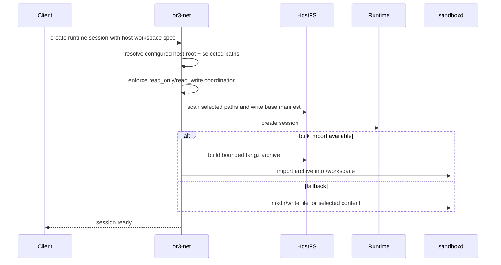
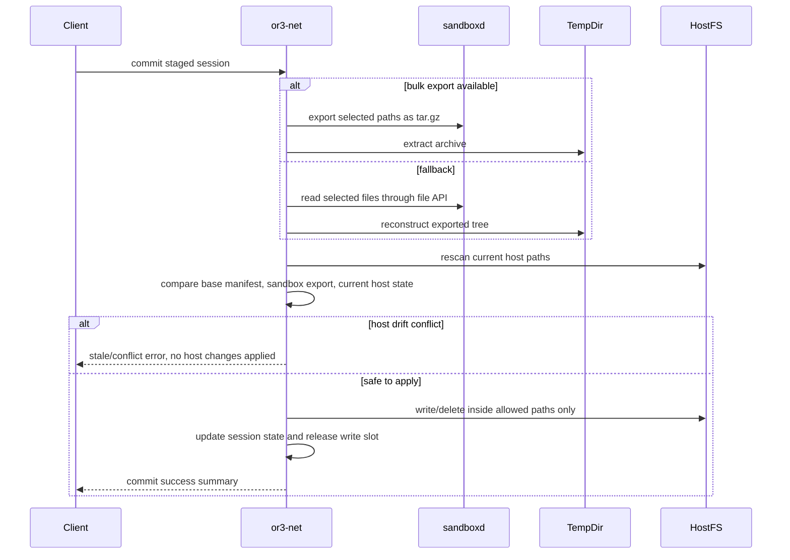

# Host-Owned Workspace Staging — Design

## Overview

This design replaces the idea of a persistent distributed workspace store with a smaller model:

- the host machine owns the canonical workspace files
- `or3-net` coordinates staging and commit
- isolated runtimes receive staged copies of selected paths
- `or3-sandbox` provides the execution and transfer substrate
- `or3-intern` remains an execution brain, not a file transport owner

Why this fits the current architecture:

- `or3-net` already owns workspace-scoped auth, session state, runtime planning, and the sandbox SDK
- `or3-sandbox` already has durable `/workspace` mounts, file APIs, and snapshot support
- the current runtime-contract plan already anticipates `copy-in`, `copy-out`, and `workspace-materialize`, so this narrows that work instead of inventing a parallel system
- it avoids turning `or3-net` into a separate blob-store-backed filesystem product

---

## Affected areas

### `or3-net`

- `planning/runtime-contract/*`
  - narrow the runtime-contract scope so host-workspace staging becomes the primary file-transfer model
- `planning/main/*`
  - align host API and security docs with explicit host-staging terminology
- `src/contracts/runtime/*`
  - add or reduce types around `workspace_source`, `workspace_paths`, `workspace_mode`, staging transport, and commit results
- `src/runtime/sessions.ts`
  - own prepare, commit, discard, and reconcile behavior for host-staged sessions
- `src/runtime/adapters/sandbox.ts`
  - use sandbox bulk import/export or per-file fallback
- `src/db/schema.ts` and `src/db/client.ts`
  - persist only bounded session metadata and coordination state
- `src/api/app.ts`
  - expose explicit prepare/commit/discard or session create/commit routes
- new local staging helper package such as `src/runtime/workspace-stage.ts`
  - scan host paths, write base manifests, validate commit output, and apply safe host updates

### `or3-sandbox`

- `internal/api/router.go`
  - add bulk workspace archive endpoints if adopted
- `internal/service/service.go`
  - implement safe import/export archive helpers inside the existing workspace root
- `docs/api-reference.md`
  - document archive import/export behavior, limits, and safety rules
- existing file APIs remain the fallback path and compatibility surface

### `or3-intern`

- no required code-path ownership changes
- optional doc note in `planning/or3-net-plan.md` or service API docs to confirm workspace staging stays outside `or3-intern`

---

## Control flow / architecture

### Session preparation



### Commit flow



### Key behavior choices

- No implicit background sync.
- No live shared mount into remote or untrusted sandboxes.
- No general file history service in `or3-net`.
- No multi-writer merge behavior.
- Commit is explicit and host-side validated.

---

## Data and persistence

### `or3-net` SQLite changes

Reuse the planned `runtime_sessions` tables from `planning/runtime-contract/`, but extend the stored session configuration with host-staging metadata.

Recommended durable fields:

- `workspace_source_kind` — `none | host`
- `host_workspace_root` — normalized configured host root for the session
- `workspace_stage_mode` — `read_only | read_write`
- `workspace_stage_transport` — `archive | file_api | auto`
- `workspace_paths_json` — bounded selected relative paths
- `base_manifest_ref` — on-disk manifest file reference
- `staging_status` — `preparing | ready | committing | conflict | committed | discarded | failed`

Recommended index:

- partial or equivalent active-writer index keyed by `(workspace_id, host_workspace_root)` for read-write sessions

This can be implemented either by:

- adding explicit columns to `runtime_sessions`, or
- using `config_json` for infrequently queried fields plus explicit columns for writer coordination

The simpler practical choice is:

- explicit columns for `host_workspace_root`, `workspace_stage_mode`, and `staging_status`
- `config_json` for selected paths and transport preferences

### On-disk staging data

Large manifests and exported trees should stay off SQLite.

Recommended `or3-net` staging layout:

```text
.data/workspace-stage/
  <session-id>/
    base-manifest.json
    export/
    import/
    commit-summary.json
```

Manifest entries should include:

- relative path
- kind (`file | directory`)
- size
- mtime
- sha256 for files

This keeps comparison deterministic while avoiding inline DB blobs.

### `or3-sandbox` data changes

No new durable sandbox metadata model is required for v1.

Optional new endpoints:

- `POST /v1/sandboxes/{id}/workspace-import`
  - request body: `.tar.gz`
  - extracts into `/workspace`
- `POST /v1/sandboxes/{id}/workspace-export`
  - request body: JSON list of allowed relative paths
  - response body: `.tar.gz`

The existing file APIs remain the compatibility fallback.

### `or3-intern`

No schema, config, or persistence changes are required.

---

## Interfaces and types

### `or3-net` runtime session input additions

```ts
interface HostWorkspaceStageSpec {
  source_kind: "host";
  paths: string[];
  mode: "read_only" | "read_write";
  transport?: "archive" | "file_api" | "auto";
}

interface RuntimeSessionCreateInput {
  preset_id?: string;
  required_capabilities?: string[];
  workspace_stage?: HostWorkspaceStageSpec;
}
```

### Commit result

```ts
interface WorkspaceCommitResult {
  session_id: string;
  status: "committed" | "conflict" | "rejected";
  written_paths: string[];
  deleted_paths: string[];
  conflict_paths: string[];
}
```

### Manifest entry

```ts
interface WorkspaceStageManifestEntry {
  path: string;
  kind: "file" | "directory";
  size_bytes: number;
  modified_at: string;
  sha256?: string;
}
```

### `or3-sandbox` archive substrate

```ts
interface ImportWorkspaceArchiveOptions {
  strip_components?: number;
  overwrite?: boolean;
}

interface ExportWorkspaceArchiveRequest {
  paths: string[];
}
```

If archive endpoints are not added immediately, `SandboxClient` stays source-compatible and `or3-net` uses `mkdir` plus `writeFile` / `readFile`.

---

## Failure modes and safeguards

### Invalid host configuration

- Reject session preparation when the workspace has no configured host root.
- Normalize and verify the configured host root before use.
- Do not let clients submit an arbitrary absolute host path at request time.

### Path traversal or escape

- Store and compare relative paths only.
- Reject `..`, absolute paths, symlink escapes, and paths outside the selected set.
- Apply sandbox output into a temporary directory first, never directly onto the host root.

### Oversized staging payloads

- Enforce archive size limits in `or3-sandbox`.
- Keep per-file fallback behind bounded size or file-count thresholds.
- Reject staging specs that exceed configured host-side limits.

### Stale host writes

- If a host file changed since the base manifest and the sandbox also changed it, reject commit.
- Do not silently overwrite host drift.

### Partial commit failure

- Build a host-side apply plan before mutating host files.
- Apply writes atomically where practical and record a commit summary.
- On failure, return `failed` without pretending commit succeeded.

### Orphaned write coordination

- Persist active writer state with runtime sessions.
- Reconcile on startup and release stale writer slots for destroyed or failed sessions.

### Sandbox API capability mismatch

- Prefer archive import/export when supported.
- Fallback to file API for small transfers.
- Return a normalized capability error when a requested transfer mode is unavailable.

### `or3-intern` contract drift

- Keep host staging out of the `or3-intern` service contract.
- Pass only metadata already acceptable in existing request context.

---

## Testing strategy

### `or3-net`

- unit tests for path normalization, manifest capture, diff detection, stale-write rejection, and safe apply behavior
- SQLite tests for runtime session staging fields and active-writer coordination
- integration tests with fake sandbox client covering:
  - prepare session
  - read-only session reject on commit
  - read-write commit success
  - host drift conflict
  - restart reconciliation releasing stale writer state
  - archive path unavailable -> file API fallback

### `or3-sandbox`

- API tests for archive import/export path safety and size limits
- regression tests ensuring file APIs remain unchanged
- archive round-trip tests for directories, deletes, and symlink/traversal rejection

### `or3-intern`

- no new runtime tests required unless request metadata changes
- if any request metadata is added, add a small service contract regression confirming backward compatibility

### Docs and planning regression

- update `planning/runtime-contract/*` to narrow the file-transfer model
- update `planning/main/04-host-api.md` and `planning/main/03-security-model.md` to reflect explicit host staging
- document that this plan intentionally defers a distributed workspace store
