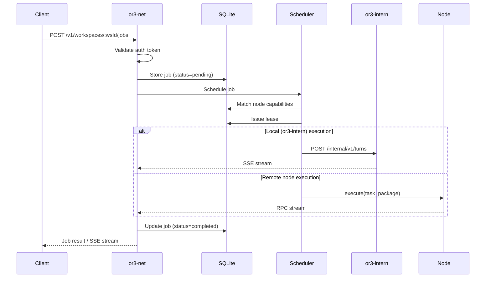
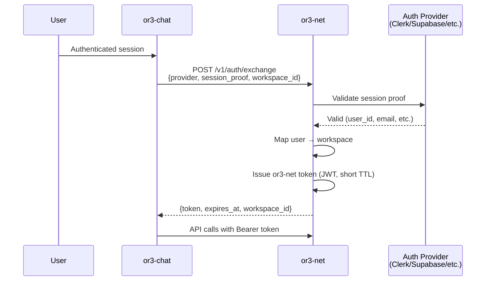

# OR3 Network v1 — Technical Design

> **Cross-ref:** A typed runtime adapter contract wrapping the node protocol layer is planned in `planning/runtime-contract/`. It adds `RuntimeAdapter`, `RuntimeRegistry`, runtime session management, and public runtime catalog/session APIs above the existing node RPC and transport infrastructure described below.

## Overview

OR3 Network (`or3-net`) is a Bun/TypeScript application that serves as the control and communications layer for the OR3 ecosystem. It sits between client applications (or3-chat, CLI, third-party SDKs) and the execution infrastructure (or3-intern + or3-sandbox nodes).

### System Context

```
┌────────────┐     ┌────────────┐     ┌─────────────┐
│  or3-chat   │     │  CLI/SDK   │     │ Third-Party  │
│  (plugin)   │     │  clients   │     │   clients    │
└─────┬──────┘     └──────┬─────┘     └──────┬───────┘
      │                   │                   │
      │  token exchange   │  API key          │  API key
      ▼                   ▼                   ▼
┌─────────────────────────────────────────────────────┐
│                    or3-net                          │
│  ┌──────────┐ ┌──────────┐ ┌──────────┐ ┌────────┐ │
│  │ Auth     │ │ Job      │ │ Node     │ │ Web    │ │
│  │ Service  │ │ Router   │ │ Registry │ │Console │ │
│  └──────────┘ └──────────┘ └──────────┘ └────────┘ │
│  ┌──────────┐ ┌──────────┐ ┌──────────┐            │
│  │ Lease    │ │ Warm     │ │ SQLite   │            │
│  │Scheduler │ │ Pool     │ │ State    │            │
│  └──────────┘ └──────────┘ └──────────┘            │
└────────┬──────────────┬────────────────┬────────────┘
         │              │                │
    internal SDK   node protocol    node protocol
         │         (HTTPS/WSS)     (outbound WSS)
         ▼              ▼                ▼
┌────────────┐  ┌───────────────┐  ┌───────────┐
│ or3-intern │  │ sandbox node  │  │  remote    │
│ (primary)  │  │ (adapter)     │  │  node      │
└────────────┘  └───────┬───────┘  └───────────┘
                        │
                   sandbox SDK
                        ▼
                ┌───────────────┐
                │  or3-sandbox  │
                │  (daemon)     │
                └───────────────┘
```

---

## Architecture

### Core Components

| Component           | Responsibility                                                                                |
| ------------------- | --------------------------------------------------------------------------------------------- |
| **Auth Service**    | Token exchange (or3-chat sessions → or3-net tokens), API key validation, workspace resolution |
| **Job Router**      | Accepts job submissions, routes to or3-intern or remote nodes, tracks job lifecycle           |
| **Node Registry**   | Stores enrolled node manifests, manages approval state, tracks node health                    |
| **Lease Scheduler** | Matches jobs to nodes, issues time-bounded leases, handles recovery                           |
| **Warm Pool**       | Manages pre-reset sandbox nodes for fast job startup                                          |
| **SQLite State**    | Persists workspaces, nodes, jobs, leases, API keys                                            |
| **Web Console**     | Minimal authenticated UI for monitoring and management                                        |
| **Intern SDK**      | TypeScript client for the or3-intern internal service API                                     |
| **Sandbox SDK**     | TypeScript client for the or3-sandbox HTTP API                                                |
| **Node Adapter**    | Implements the OR3 node protocol backed by or3-sandbox                                        |

### Request Flow



---

## Phase 0: Prerequisites

### or3-intern Internal Service API

A new `serve --service` mode (or a new `service` subcommand) that starts an HTTP server alongside the existing channel/heartbeat workers.

**New Go file:** `cmd/or3-intern/service.go`

The service API reuses the existing `agent.Runtime` but wraps calls behind an authenticated HTTP handler:

```
POST /internal/v1/turns
  Request:  { session_key, message, tool_policy?, meta? }
  Response: SSE stream OR JSON result

POST /internal/v1/subagents
  Request:  { task, prompt_snapshot, tool_policy, timeout }
  Response: { job_id, status }

GET  /internal/v1/jobs/:jobId/stream
  Response: SSE stream (text deltas, tool calls, completion)

POST /internal/v1/jobs/:jobId/abort
  Response: { ok: true }
```

Authentication: shared HMAC-signed tokens on an `Authorization: Bearer <token>` header. The service API is not publicly routable.

### or3-sandbox TypeScript SDK

A TypeScript package wrapping the existing or3-sandbox REST API:

```typescript
interface SandboxClient {
  // Lifecycle
  create(req: CreateSandboxRequest): Promise<Sandbox>;
  list(): Promise<Sandbox[]>;
  get(sandboxId: string): Promise<Sandbox>;
  delete(sandboxId: string): Promise<void>;
  start(sandboxId: string): Promise<Sandbox>;
  stop(sandboxId: string, force?: boolean): Promise<Sandbox>;
  suspend(sandboxId: string): Promise<Sandbox>;
  resume(sandboxId: string): Promise<Sandbox>;

  // Execution
  exec(sandboxId: string, req: ExecRequest): Promise<Execution>;
  execStream(sandboxId: string, req: ExecRequest): AsyncIterable<ExecEvent>;
  tty(sandboxId: string, req: TTYRequest): Promise<TTYSession>;

  // Files
  readFile(sandboxId: string, path: string): Promise<FileContent>;
  writeFile(sandboxId: string, path: string, content: string): Promise<void>;
  writeFileBytes(
    sandboxId: string,
    path: string,
    data: Uint8Array,
  ): Promise<void>;
  deleteFile(sandboxId: string, path: string): Promise<void>;
  mkdir(sandboxId: string, path: string): Promise<void>;

  // Tunnels
  createTunnel(sandboxId: string, req: CreateTunnelRequest): Promise<Tunnel>;
  listTunnels(sandboxId: string): Promise<Tunnel[]>;
  revokeTunnel(tunnelId: string): Promise<void>;

  // Snapshots
  createSnapshot(
    sandboxId: string,
    req: CreateSnapshotRequest,
  ): Promise<Snapshot>;
  listSnapshots(sandboxId: string): Promise<Snapshot[]>;
  getSnapshot(snapshotId: string): Promise<Snapshot>;
  restoreSnapshot(
    snapshotId: string,
    req: RestoreSnapshotRequest,
  ): Promise<Sandbox>;

  // Runtime/Admin
  runtimeInfo(): Promise<RuntimeInfo>;
  runtimeHealth(): Promise<RuntimeHealth>;
  runtimeCapacity(): Promise<CapacityReport>;
  getQuota(): Promise<QuotaView>;
  getMetrics(): Promise<string>;
}
```

All types map 1:1 to the existing Go model types in `or3-sandbox/internal/model/model.go`.

### or3-intern TypeScript SDK

```typescript
interface InternClient {
  submitTurn(req: TurnRequest): Promise<TurnResult>;
  submitTurnStream(req: TurnRequest): AsyncIterable<TurnEvent>;
  spawnSubagent(req: SubagentRequest): Promise<SubagentJob>;
  streamJob(jobId: string): AsyncIterable<JobEvent>;
  abortJob(jobId: string): Promise<void>;
}

interface TurnRequest {
  sessionKey: string;
  message: string;
  toolPolicy?: ToolPolicy;
  meta?: Record<string, unknown>;
}

interface TurnEvent {
  type: "text_delta" | "tool_call" | "tool_result" | "completion" | "error";
  data: unknown;
}
```

---

## or3-net Core Design

### Project Structure

```
or3-net/
├── src/
│   ├── index.ts              # Entry point
│   ├── config.ts             # Configuration loading
│   ├── server.ts             # HTTP server setup
│   ├── db/
│   │   ├── schema.ts         # SQLite schema (drizzle or raw)
│   │   ├── migrations/       # Schema migrations
│   │   └── client.ts         # DB client
│   ├── auth/
│   │   ├── exchange.ts       # Token exchange logic
│   │   ├── apikeys.ts        # API key validation
│   │   ├── middleware.ts      # Auth middleware
│   │   └── types.ts          # Auth types
│   ├── api/
│   │   ├── router.ts         # Route definitions
│   │   ├── workspaces.ts     # Workspace endpoints
│   │   ├── nodes.ts          # Node management endpoints
│   │   ├── jobs.ts           # Job submission / streaming
│   │   ├── agents.ts         # Agent definition endpoints
│   │   └── auth.ts           # Auth endpoints
│   ├── scheduler/
│   │   ├── scheduler.ts      # Job → Node matching
│   │   ├── leases.ts         # Lease lifecycle
│   │   └── warmpool.ts       # Warm pool manager
│   ├── nodes/
│   │   ├── registry.ts       # Node enrollment/approval
│   │   ├── protocol.ts       # OR3 node RPC schema
│   │   ├── transport-https.ts # Host-dials-node transport
│   │   ├── transport-wss.ts   # Node-dials-host transport
│   │   └── adapter-sandbox.ts # or3-sandbox adapter
│   ├── contracts/
│   │   ├── manifest.ts       # NodeManifest type + validation
│   │   ├── task-package.ts   # TaskPackage type
│   │   ├── lease.ts          # Lease type
│   │   └── index.ts          # Re-exports
│   └── console/
│       ├── server.ts         # Static file serving
│       └── views/            # HTML/JS templates
├── sdk/
│   ├── intern/
│   │   ├── client.ts         # or3-intern SDK
│   │   ├── types.ts          # SDK types
│   │   └── index.ts
│   └── sandbox/
│       ├── client.ts         # or3-sandbox SDK
│       ├── types.ts          # SDK types
│       └── index.ts
├── cli/
│   ├── index.ts              # CLI entry point
│   ├── commands/             # Command implementations
│   └── util.ts
├── package.json
├── tsconfig.json
└── bunfig.toml
```

### Database Schema

Using Bun's built-in SQLite support with WAL mode:

```typescript
// Workspaces
const workspaces = {
  id: "TEXT PRIMARY KEY",
  name: "TEXT NOT NULL",
  config: "TEXT", // JSON blob
  created_at: "INTEGER NOT NULL",
  updated_at: "INTEGER NOT NULL",
};

// API Keys
const api_keys = {
  id: "TEXT PRIMARY KEY",
  workspace_id: "TEXT NOT NULL REFERENCES workspaces(id)",
  key_hash: "TEXT NOT NULL",
  name: "TEXT NOT NULL",
  scopes: "TEXT", // JSON array
  created_at: "INTEGER NOT NULL",
  expires_at: "INTEGER",
  revoked_at: "INTEGER",
};

// Nodes
const nodes = {
  id: "TEXT PRIMARY KEY",
  workspace_id: "TEXT NOT NULL REFERENCES workspaces(id)",
  manifest: "TEXT NOT NULL", // JSON NodeManifest
  pubkey_fingerprint: "TEXT NOT NULL",
  status: "TEXT NOT NULL", // pending | approved | revoked
  adapter_kind: "TEXT NOT NULL", // sandbox | remote
  approved_at: "INTEGER",
  revoked_at: "INTEGER",
  last_seen_at: "INTEGER",
  created_at: "INTEGER NOT NULL",
};

// Jobs
const jobs = {
  id: "TEXT PRIMARY KEY",
  workspace_id: "TEXT NOT NULL REFERENCES workspaces(id)",
  agent_id: "TEXT",
  node_id: "TEXT REFERENCES nodes(id)",
  lease_id: "TEXT",
  status: "TEXT NOT NULL", // pending | scheduled | running | completed | failed | aborted
  task_package: "TEXT NOT NULL", // JSON TaskPackage
  result: "TEXT", // JSON result
  error: "TEXT",
  created_at: "INTEGER NOT NULL",
  started_at: "INTEGER",
  completed_at: "INTEGER",
};

// Leases
const leases = {
  id: "TEXT PRIMARY KEY",
  node_id: "TEXT NOT NULL REFERENCES nodes(id)",
  job_id: "TEXT NOT NULL REFERENCES jobs(id)",
  workspace_id: "TEXT NOT NULL REFERENCES workspaces(id)",
  profile: "TEXT NOT NULL",
  ttl_seconds: "INTEGER NOT NULL",
  state: "TEXT NOT NULL", // active | expired | released | failed
  reset_required: "INTEGER NOT NULL DEFAULT 1",
  created_at: "INTEGER NOT NULL",
  expires_at: "INTEGER NOT NULL",
  released_at: "INTEGER",
};

// Agents
const agents = {
  id: "TEXT PRIMARY KEY",
  workspace_id: "TEXT NOT NULL REFERENCES workspaces(id)",
  name: "TEXT NOT NULL",
  instructions: "TEXT NOT NULL",
  tool_policy: "TEXT", // JSON
  node_requirements: "TEXT", // JSON
  created_at: "INTEGER NOT NULL",
  updated_at: "INTEGER NOT NULL",
};

// Node Credentials
const node_credentials = {
  id: "TEXT PRIMARY KEY",
  node_id: "TEXT NOT NULL REFERENCES nodes(id)",
  token_hash: "TEXT NOT NULL",
  issued_at: "INTEGER NOT NULL",
  expires_at: "INTEGER NOT NULL",
  rotated_at: "INTEGER",
};
```

### Authentication Design

#### Token Exchange Flow



The exchange endpoint accepts a `provider` discriminator and a `session_proof` blob. The proof format varies by provider:

- **Clerk**: short-lived session JWT
- **Supabase**: access token
- **Custom**: configurable validation endpoint

`or3-net` validates the proof against the provider, maps the user to a workspace, and issues its own short-lived JWT.

#### API Key Flow

API keys are generated via CLI or web console, stored as salted hashes in SQLite, and validated on each request. Keys are workspace-scoped with configurable permission scopes.

### Node Protocol Design

#### Manifest & Enrollment

```typescript
interface NodeManifest {
  node_id: string;
  pubkey: string; // Ed25519 public key (base64)
  signature: string; // Signed manifest hash
  adapter_kind: "sandbox" | "remote";
  capabilities: string[]; // e.g. ['exec', 'file_io', 'network']
  isolation_class: string; // e.g. 'docker-trusted', 'qemu-hardened'
  supports_transports: ("https" | "outbound-wss")[];
  resource_limits: {
    max_concurrent_jobs: number;
    cpu_cores: number;
    memory_mb: number;
    disk_mb: number;
  };
  lease_policy: {
    max_ttl_seconds: number;
    supports_warm_pool: boolean;
    reset_methods: ("process_kill" | "fs_scrub" | "credential_rotation")[];
  };
  certification?: {
    issuer: string;
    certificate: string;
    expires_at: string;
  };
  version: string;
}
```

#### RPC Schema

The node RPC protocol uses JSON-RPC 2.0 style messages over the chosen transport:

```typescript
// Host → Node
type NodeRequest =
  | { method: "execute"; params: TaskPackage; id: string }
  | { method: "heartbeat"; id: string }
  | { method: "abort"; params: { job_id: string }; id: string };

// Node → Host
type NodeResponse =
  | { id: string; result: ExecutionResult }
  | { id: string; error: { code: number; message: string } };

// Node → Host (streaming during execute)
type NodeEvent =
  | { event: "output"; data: { text: string } }
  | { event: "tool_call"; data: { name: string; params: unknown } }
  | { event: "tool_result"; data: { name: string; result: string } }
  | { event: "progress"; data: { percent: number; message: string } }
  | { event: "complete"; data: ExecutionResult }
  | { event: "error"; data: { code: number; message: string } };
```

#### Transport: Host-Dials-Node (HTTPS/WSS)

```
or3-net ──HTTPS POST──► node/rpc        (request-response)
or3-net ──WSS────────►  node/rpc/stream  (streaming execute)
```

#### Transport: Node-Dials-Host (Outbound WSS)

For NAT/home-lab nodes:

```
node ──outbound WSS──► or3-net/v1/nodes/connect
                       (long-lived connection, host dispatches over it)
```

### Lease Scheduler Design

The scheduler is a simple priority queue backed by SQLite:

1. Job arrives → scheduler queries approved nodes matching `capabilities` and `isolation_class`
2. Among matching nodes, select the one with fewest active leases
3. Issue a lease with bounded TTL
4. If no nodes match or all are at capacity → job stays in `pending` with retry

Lease states: `active → released` (normal), `active → expired` (timeout), `active → failed` (node drop).

### Warm Pool Design

For sandbox-backed nodes only:

```
  ┌────────────────────────────────────────────┐
  │              Warm Pool Manager             │
  │                                            │
  │  Pool Target: N sandboxes per workspace    │
  │                                            │
  │  ┌─────┐ ┌─────┐ ┌─────┐                  │
  │  │ready│ │ready│ │reset │                  │
  │  │  1  │ │  2  │ │ting 3│                  │
  │  └─────┘ └─────┘ └──────┘                  │
  │                                            │
  │  Acquire: take ready sandbox → mark leased │
  │  Release: kill → scrub → rotate → check    │
  └────────────────────────────────────────────┘
```

Reset sequence on release:

1. Kill all processes in sandbox
2. Scrub workspace filesystem
3. Rotate sandbox credentials
4. Health check (exec a trivial command, verify clean state)
5. Return to pool as `ready`

### Streaming Architecture

All streaming uses Server-Sent Events (SSE) for HTTP clients and native WebSocket for the or3-chat plugin pane app:

```
Client ─── GET /v1/jobs/:id/stream ──► or3-net ──► or3-intern (SSE proxy)
                                                ──► remote node (RPC stream proxy)
```

SSE event types:

- `text_delta`: incremental text output
- `tool_call`: tool invocation event
- `tool_result`: tool result event
- `status`: job status change
- `error`: error event
- `done`: stream complete

### or3-chat Plugin Design

The plugin ships as an `or3-plugin-network` package using the existing OR3 plugin system:

```
or3-plugin-network/
├── index.ts                # Plugin registration
├── sidebar/
│   └── NetworkSidebar.vue  # Agent/job management
├── pane/
│   └── JobStream.vue       # Live streaming output
├── dashboard/
│   └── NetworkSettings.vue # Node approval, API keys
├── posts/
│   └── network-config.ts   # Custom post type for saved configs
└── composables/
    ├── useNetworkApi.ts    # or3-net API client
    └── useJobStream.ts     # SSE streaming composable
```

### Error Handling

All API errors use a consistent envelope:

```typescript
interface APIError {
  error: {
    code: string; // machine-readable (e.g., 'NODE_NOT_FOUND')
    message: string; // human-readable
    details?: unknown; // optional structured detail
  };
  status: number;
}
```

Internal errors use a `ServiceResult` pattern:

```typescript
type ServiceResult<T> =
  | { ok: true; value: T }
  | { ok: false; error: { code: string; message: string } };
```

### Configuration

```typescript
interface Or3NetConfig {
  host: string; // Listen address (default: "0.0.0.0")
  port: number; // Listen port (default: 3100)

  db: {
    path: string; // SQLite database path
  };

  auth: {
    jwtSecret: string; // Secret for signing or3-net tokens
    tokenTTLSeconds: number; // Default: 3600
    providers: {
      // Provider validation endpoints
      [provider: string]: {
        type: "clerk" | "supabase" | "custom";
        publicKey?: string;
        apiUrl?: string;
      };
    };
  };

  intern: {
    url: string; // or3-intern service URL
    secret: string; // Shared auth secret
  };

  sandbox?: {
    url: string; // or3-sandbox URL
    token: string; // Auth token
  };

  nodes: {
    warmPoolSize: number; // Default: 2
    leaseDefaultTTL: number; // Default: 300s
    leaseMaxTTL: number; // Default: 3600s
  };

  managed: {
    enabled: boolean; // Enable managed/certified mode
    certifiedManifests: string[]; // Allowed manifest hashes
  };

  console: {
    enabled: boolean; // Enable web console
  };
}
```

Configuration is loaded from `or3-net.config.json` (or `.toml`) with env var overrides using the `OR3_NET_` prefix.

### Testing Strategy

#### Unit Tests

- Auth: token exchange validation, API key hashing, middleware
- Scheduler: job matching, lease lifecycle, capacity tracking
- Node registry: enrollment validation, manifest signature verification
- Warm pool: reset sequence, health checks

#### Integration Tests

- Full job submission → or3-intern execution → result return
- Node enrollment → approval → job scheduling → completion
- Token exchange with mock providers
- Workspace isolation (cross-workspace rejection)
- Warm pool reset and reuse cycle
- Dual transport (HTTPS + outbound WSS)
- Stream proxy (SSE end-to-end)

#### End-to-End Tests

- or3-chat plugin → token exchange → job submission → stream → completion
- CLI → job submission → stream output
- Node enrollment via CLI → approval via web console → job execution

#### Performance Tests

- Streaming latency (text delta < 200ms)
- Job startup with warm pool vs. cold start
- Concurrent job scheduling under load
