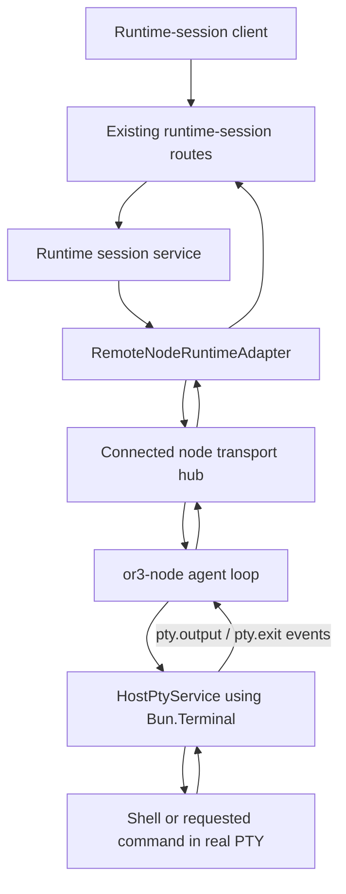

# OR3 Node Agent PTY Design

## Overview

Proper PTY support is feasible with Bun alone for Linux and macOS.

Context7 research confirms that Bun's Terminal API supports real PTY allocation through `Bun.spawn({ terminal })` and exposes the required control surface through `proc.terminal.write(...)`, `resize(...)`, `setRawMode(...)`, and `close(...)`. The same research also confirms that Bun Terminal support is POSIX-only and does not currently support Windows.

Because the current product stance already hides PTY on Windows, the best-fit design is:

- implement a real Bun-backed PTY backend in `or3-node` for Linux and macOS
- keep Windows PTY disabled and explicitly unsupported in this phase
- avoid adding `node-pty` now
- leave a clean backend seam so `node-pty` can be introduced later if Windows PTY becomes required

This fits the current architecture because:

- `or3-node` already has a `HostPtyService` seam
- `or3-node` already has `pty_*` RPC request handling in the agent loop
- `or3-net` already has `pty_*` request schemas in the node protocol
- the remaining gap is the missing real PTY backend, missing PTY event framing, and missing runtime-adapter projection in `or3-net`
- OR3 Net treats PTY as the extension capability `ext:or3:pty` internally while still accepting the node-side PTY signal from `or3-node`

## Affected areas

### `or3-node`

- `src/host-control/pty.ts`
  - Replace the pipe-backed placeholder with a Bun Terminal-backed PTY implementation for Linux/macOS.
- `src/host-control/paths.ts`
  - Reuse cwd validation so PTY launch respects the same allowed-root behavior as exec where applicable.
- `src/transport/agent-loop.ts`
  - Wire PTY output and exit events onto the node socket and perform disconnect cleanup.
- `src/runtime-capabilities.ts`
  - Re-advertise `pty` only when the real PTY backend is supported and enabled.
- `src/cli/index.ts`
  - Instantiate the PTY service in the foreground launch path once it is real and intended to be exposed.
- `tests/host-control-pty.test.ts`
  - Convert scaffold-oriented tests into backend-contract tests.
- `tests/agent-loop.test.ts`
  - Add PTY event routing, close, and disconnect cleanup coverage.
- `README.md` and operational docs
  - Update the support matrix and remove language that implies PTY is already complete.

### `or3-net`

- `src/contracts/protocol.ts`
  - Extend `nodeEventSchema` with PTY-specific output and exit events.
- `src/contracts/runtime/adapter.ts`
  - Add optional PTY methods and PTY stream/result types to the runtime adapter contract.
- `src/runtime/adapters/remote-node.ts`
  - Project PTY capability from node manifests, normalize the capability into `ext:or3:pty` internally, and implement PTY operations by forwarding to the connected node.
- runtime session service / existing API routes under `src/api/**`
  - Extend the existing runtime-session path to expose PTY operations without creating a second public API family.
- `tests/runtime/adapters/remote-node.test.ts`
  - Add PTY capability and failure-path coverage.
- integration tests covering runtime sessions
  - Add PTY open/input/resize/close/output/exit coverage through the connected-node path.

## Control flow / architecture



### Runtime behavior

1. A runtime session already exists or is created through the current OR3 Net session flow.
2. The client requests PTY open against that session.
3. `RemoteNodeRuntimeAdapter` validates the node capability and forwards `pty_open` to the connected node.
4. `or3-node` creates a real PTY using `Bun.spawn({ terminal: { cols, rows, data(...) } })`.
5. The PTY backend streams terminal output through PTY-specific node events.
6. `or3-net` forwards or normalizes those events back through the runtime-session surface.
7. Resize, input, and close commands route back through the same session-scoped path.
8. Process exit or disconnect produces a PTY exit event and deterministic cleanup.

## Data and persistence

### SQLite and control-plane persistence

No SQLite schema change is required for the initial implementation.

Rationale:

- PTY sessions are live transport state, not durable control-plane state
- the control plane already tracks nodes, leases, runtime sessions, and health
- PTY session identity can remain in memory and be invalidated on disconnect

A migration should only be considered if a later requirement needs durable PTY audit trails or resumable terminals, neither of which is necessary for this phase.

### Agent-local persistence

No new durable PTY store is required for the initial implementation.

Agent-local behavior should be:

- PTY session handles are in-memory only
- reconnect does not resume a prior PTY
- shutdown or disconnect closes active PTYs
- recent PTY failures can reuse the existing local diagnostics/logging path instead of a new store

### Config and env changes

Likely `or3-node` config additions:

- `enablePty: boolean` or equivalent explicit capability toggle
- `ptyDefaultCommand` only if a default shell override is needed beyond platform defaults
- `ptyMaxConcurrentSessions`
- optional default `cols` and `rows` if the caller does not provide them

The config should remain small. If PTY is enabled by default on supported POSIX hosts, the runtime capability helper still must gate on real platform support.

## Interfaces and types

### `or3-node` PTY backend

Keep a backend seam so the implementation can stay Bun-first now and add `node-pty` later only if needed.

Suggested shape:

```ts
interface PtyBackendSession {
  readonly ptyId: string;
  readonly sessionId: string;
  readonly createdAt: string;
  write(data: string): void;
  resize(cols: number, rows: number): void;
  close(): void;
}
```

Internally, the Bun-backed session owns:

- a `Subprocess`
- its `proc.terminal`
- output callback wiring from the terminal `data(...)` hook
- exit handling via `proc.exited` and `onExit`

### Node protocol additions

The existing request verbs are adequate, but the event model is incomplete.

Add PTY-specific node events such as:

```ts
{ event: "pty.output", data: { pty_id: string, text: string } }
{ event: "pty.exit", data: { pty_id: string, exit_code: number, signal?: string } }
```

Why add these instead of reusing generic `output`:

- PTY streams are session-interactive, not job-result output
- PTY close and exit need explicit correlation to a PTY id
- the control plane should not confuse PTY traffic with one-shot exec traffic

### Runtime adapter contract changes in `or3-net`

`src/contracts/runtime/adapter.ts` currently has no PTY-specific surface. Add optional methods such as:

```ts
openPty?(input: { workspace_id: string; session_ref: string; cols?: number; rows?: number; command?: string; args?: string[]; env?: Record<string, string>; cwd?: string }): Promise<{ pty_id: string }>
writePty?(input: { workspace_id: string; session_ref: string; pty_id: string; data: string }): Promise<{ accepted: boolean }>
resizePty?(input: { workspace_id: string; session_ref: string; pty_id: string; cols: number; rows: number }): Promise<{ resized: boolean }>
closePty?(input: { workspace_id: string; session_ref: string; pty_id: string }): Promise<{ closed: boolean }>
streamPty?(input: { workspace_id: string; session_ref: string; pty_id: string; cursor?: string }): Promise<AsyncIterable<{ event: "output" | "exit"; text?: string; exit_code?: number; signal?: string }>>
```

These remain optional so other runtime adapters do not have to implement them.

### `RemoteNodeRuntimeAdapter`

Implement the PTY methods only when:

- the selected node is approved and connected
- the node manifest advertises `pty`
- the session reference resolves to that node

Failure mapping should stay aligned with current runtime errors:

- disconnected node -> `adapter_unavailable`
- unsupported capability -> `unsupported_capability`
- missing PTY id -> `adapter_internal` or a narrower PTY-not-found error if the runtime contract gains one

## Failure modes and safeguards

- **Unsupported platform**
  - `or3-node` returns a capability/config error and does not advertise PTY.
- **Disconnected node**
  - `or3-net` rejects PTY operations with adapter-unavailable semantics and invalidates any active PTY streams.
- **Missing session or PTY id**
  - request fails clearly; no silent no-op beyond idempotent close semantics if explicitly desired.
- **Oversized or runaway output**
  - apply the same bounded buffering discipline already used for session logs; stream output incrementally instead of accumulating it.
- **Agent restart**
  - active PTYs are not resumed; callers must reopen.
- **Windows host**
  - PTY remains disabled in this phase. If product scope later requires Windows PTY, introduce a pluggable `node-pty` backend rather than contorting the Bun-only path.
- **Backend insufficiency discovered during implementation**
  - preserve the backend seam in `or3-node`; if Bun PTY fails on required POSIX cases, switch only the backend implementation to `node-pty` without changing the wire contract.

## Testing strategy

### `or3-node` unit and integration tests

- real-backend PTY lifecycle tests in `tests/host-control-pty.test.ts`
  - open
  - write/input echo behavior
  - resize callback behavior
  - exit signaling
  - unsupported platform handling
- agent-loop tests in `tests/agent-loop.test.ts`
  - PTY event emission
  - PTY close on disconnect
  - missing PTY id and disabled capability paths

### `or3-net` unit tests

- protocol schema tests for PTY event validation
- `tests/runtime/adapters/remote-node.test.ts`
  - capability gating
  - PTY request forwarding
  - PTY error mapping

### Cross-repo integration tests

- session create -> PTY open -> input -> resize -> close
- node disconnect during PTY session
- PTY disabled on Windows manifests
- PTY hidden when backend support is unavailable

### Manual validation

- Linux/macOS: run a real shell, confirm prompt rendering, color output, and resize behavior
- Windows: confirm PTY remains unavailable and errors clearly without hanging

## Bun vs `node-pty` decision

Decision for this plan:

- **Use Bun Terminal API for the actual implementation in this phase.**
- **Do not add `node-pty` now.**

Reasoning:

- Bun already exposes the required PTY primitives for Linux/macOS.
- The product stance already treats Windows PTY as deferred.
- Adding `node-pty` now would introduce a native dependency and packaging complexity without solving a current in-scope requirement.

Fallback rule:

- If Windows PTY becomes required, or if Bun PTY proves insufficient on supported POSIX hosts during implementation, add a backend abstraction and switch the backend implementation to `node-pty` while keeping the OR3 wire contract and runtime-adapter contract unchanged.
