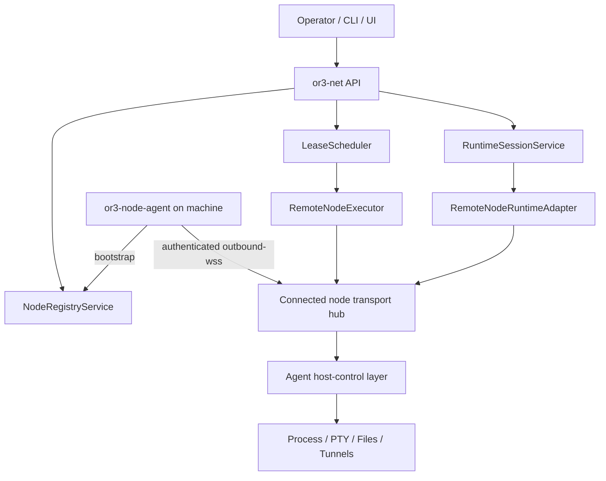

# OR3 Node Agent Design

## Overview

`or3-node-agent` is the machine-side counterpart to OR3 Net.

It is a separate installable project that runs on a computer you want to control. OR3 Net remains the control plane: it owns enrollment approval, workspace auth, leases, runtime selection, previews, and the public API. The node agent owns machine-local execution and machine-control primitives.

This design fits the current `or3-net` architecture because the repository already has the beginnings of the right model:

- signed node manifests in `src/contracts/core.ts`
- node enrollment and approval in `src/nodes/registry.ts`
- transport abstractions in `src/nodes/transport*.ts`
- remote execution orchestration in `src/nodes/executor.ts`
- runtime projection in `src/runtime/adapters/remote-node.ts`

The plan does **not** replace those seams. It turns them into a real deployable machine agent.

An explicit design constraint for this project is: make the node agent work well with `or3-net` **without** requiring a large new control-plane architecture inside `or3-net`.

That means:

- prefer extending existing `src/contracts`, `src/nodes`, `src/runtime`, and `src/api/app.ts` surfaces
- avoid introducing brand-new public API families when an existing node or runtime-session route can own the behavior
- avoid adding parallel scheduling, auth, or persistence systems when the current control-plane model already covers the need

The default operator experience should be:

1. `bun install -g or3-node`
2. `or3-node launch`
3. follow a short interactive bootstrap flow if local config is missing
4. approve the node in OR3 Net
5. start controlling the machine

## Affected areas

- `src/contracts/core.ts`
  - Keep the node manifest as the canonical machine capability declaration; extend only if the agent needs additional stable capability metadata.
- `src/contracts/protocol.ts`
  - Define the machine ↔ control-plane RPC contract for handshake, execution, heartbeat, abort, and later runtime-session / PTY / file operations.
- `src/nodes/registry.ts`
  - Add bootstrap-token or claim-based enrollment so agents do not need broad workspace bearer tokens as their long-lived auth model.
- `src/nodes/transport.ts`
  - Evolve the transport interfaces from basic remote execution toward richer machine-control operations while preserving simple request/response boundaries.
- `src/nodes/transport-wss.ts`
  - Replace the current in-process simulation role with a real reverse-connection session manager for connected agents.
- `src/nodes/transport-https.ts`
  - Keep as a dev/fallback transport for basic request/response cases.
- `src/nodes/executor.ts`
  - Resolve live agent connections and credentials, start work, heartbeat nodes, and later delegate runtime-session operations.
- `src/runtime/adapters/remote-node.ts`
  - Grow from `exec`-only projection into a real remote machine runtime adapter supporting session lifecycle plus selected capabilities.
- `src/api/app.ts`
  - Add bootstrap routes and keep the existing workspace-scoped node and runtime-session APIs as the public surface.
- future project: `or3-node-agent/`
  - New standalone Bun/TypeScript project for the installable agent.

## Minimal `or3-net` change strategy

The preferred implementation strategy is conservative:

1. keep `or3-net` public routes mostly unchanged
2. keep workspace auth, approval, leases, and previews where they already live
3. upgrade the existing node transport path from “mostly conceptual” to “real connected agent”
4. extend `RemoteNodeRuntimeAdapter` instead of inventing a second remote-machine runtime path

Concretely, the biggest acceptable `or3-net` changes are:

- a narrow bootstrap-token flow for node enrollment
- a real connected-node hub behind the existing `outbound-wss` transport concept
- protocol extensions in existing internal node contracts
- incremental capability support in `RemoteNodeExecutor` and `RemoteNodeRuntimeAdapter`

What to avoid in `or3-net`:

- a second daemon-specific control-plane subsystem
- a new browser-facing API family just for node-agent machine control
- duplicate persistence for node/session/auth state outside current control-plane stores
- separate remote-session orchestration unrelated to runtime sessions

## Packaging and CLI UX

### Package name and command

The installable package should be named so the operator experience stays short and memorable.

Preferred shape:

- package: `or3-node`
- executable: `or3-node`

That keeps the primary path aligned with:

```bash
bun install -g or3-node
or3-node launch
```

Internally the project can still live in a folder such as `or3-node-agent/`, but the shipped CLI should optimize for the shorter command name.

### `or3-node launch`

`or3-node launch` should be the main entrypoint, not a thin wrapper around many mandatory setup steps.

Recommended behavior:

- load config if it already exists
- if identity does not exist, generate it
- if enrollment is missing, guide the operator through bootstrap flags or an interactive prompt
- if approval is still pending, report that clearly and continue polling or exit with a clear next step
- once approved and credentialed, connect to OR3 Net and start the main agent loop

Advanced commands can exist, but they should be support commands around the main launch flow:

- `or3-node launch`
- `or3-node doctor`
- `or3-node reset`
- `or3-node service install`
- `or3-node service uninstall`

Avoid making `init` and `enroll` mandatory for the common happy path.

## Control flow / architecture

### High-level model



### Primary phases

1. **Bootstrap**
  - `or3-node launch` generates or loads a persistent node keypair.
  - If enrollment is missing, the command accepts flags or prompts for a short-lived bootstrap token / claim flow scoped to one workspace.
  - Agent submits a signed manifest to OR3 Net.

2. **Approval**
   - OR3 Net stores the node as `pending`.
   - Operator approves the node through existing node administration flows.
   - OR3 Net issues a node runtime credential.

3. **Reverse connect**
   - Agent opens an outbound authenticated WSS connection to OR3 Net.
   - Control plane binds the live connection to the approved node id.
   - Health and last-seen status update off that connection.

4. **Execution / machine control**
   - Lease scheduler or runtime-session service selects the remote node.
   - Control plane sends RPCs over the live connection.
   - Agent executes machine-local operations and streams normalized events back.

### Why outbound WSS first

The existing repo already models `outbound-wss` as a transport kind. That is the correct default for a real installed machine agent because:

- it avoids inbound firewall and NAT issues
- it lets the agent authenticate once and maintain liveness
- it supports both one-shot execution and interactive control later
- it keeps OR3 Net in the role of broker instead of requiring browsers or clients to reach the machine directly

HTTPS transport still matters for dev and fallback cases, but it should not be the main production shape.

This also keeps `or3-net` changes smaller because the repo already has `outbound-wss` in the node transport model; the work is primarily making that real rather than inventing an unrelated transport architecture.

## Data and persistence

### Control plane (`or3-net`)

Existing SQLite-backed control-plane tables remain the source of truth for:

- enrolled nodes
- node approval state
- node credentials
- leases
- runtime sessions
- jobs

Likely control-plane additions:

- bootstrap enrollment tokens or claim records
- connected-node session state for reverse connections
- optional richer node health metadata and last transport error

### Agent-local persistence

The agent should keep local persistence intentionally small. A simple SQLite file or file-backed storage is enough.

Persist at least:

- node identity keypair or reference to OS keychain storage
- enrolled node id and control-plane URL
- active node runtime credential and expiry
- minimal reconnect state
- recent execution metadata and last error for debugging
- optional PTY / tunnel / session metadata if restart recovery is supported

Explicitly avoid turning the agent into a second scheduler or deep local orchestration store.

### Config and env

Agent config should cover:

- control-plane base URL
- workspace-scoped bootstrap mode or token source
- allowed execution roots
- shell / PTY defaults
- execution limits
- file limits
- runtime mode (`host` first; optional containerized host-control adapters later)
- advertised capabilities toggles

The default config story should be minimal:

- no hand-edited config file required for the common path
- first launch can persist a generated config file after interactive setup
- flags and env vars can override persisted config for automation and service installs

### Runtime-session implications

The existing OR3 Net runtime-session API should remain unchanged.

The design change is internal:

- `RemoteNodeRuntimeAdapter` stops being `exec`-only
- the node protocol grows session-oriented verbs for the capabilities the agent actually supports
- capability checks stay explicit at runtime selection and request validation time

This is intentionally cheaper than adding a second public remote-control API to `or3-net`.

## Interfaces and types

### Agent project shape

Recommended future project structure:

```text
or3-node-agent/
  src/
    cli/
    config/
    identity/
    enroll/
    transport/
    host-control/
    exec/
    pty/
    files/
    tunnels/
    storage/
    telemetry/
```

The CLI package should expose a Bun bin entry for `or3-node` so global install works cleanly.

### Machine control boundary

Even though v1 is a single agent binary, keep a strict internal boundary for machine-local operations.

```ts
export interface HostControlService {
  getInfo(): Promise<HostInfo>;
  getHealth(): Promise<HostHealth>;

  exec(input: HostExecRequest): Promise<HostExecHandle>;
  abort(execId: string): Promise<void>;

  createSession?(input: HostSessionCreateRequest): Promise<HostSessionHandle>;
  destroySession?(sessionId: string): Promise<void>;
  execInSession?(sessionId: string, input: HostExecRequest): Promise<HostExecHandle>;
  getLogs?(sessionId: string): Promise<HostLogChunk[]>;

  readFile?(input: HostReadFileRequest): Promise<Uint8Array>;
  writeFile?(input: HostWriteFileRequest): Promise<void>;
  copyOut?(input: HostCopyOutRequest): Promise<HostFileResult>;
  copyIn?(input: HostCopyInRequest): Promise<HostFileResult>;

  openPty?(input: HostPtyCreateRequest): Promise<HostPtyHandle>;
  openTunnel?(input: HostTunnelRequest): Promise<HostTunnelHandle>;
}
```

This keeps a future `sandboxd` split possible without forcing it now.

### Control-plane ↔ agent RPC

Current protocol already supports:

```ts
method: "handshake" | "execute" | "heartbeat" | "abort"
```

Recommended staged extension:

#### Phase 1
- keep the existing execution RPCs working with a real outbound connection
- add connection registration and credential validation around `outbound-wss`

#### Phase 2
- add runtime-session verbs, for example:

```ts
method:
  | "runtime.create_session"
  | "runtime.get_session"
  | "runtime.destroy_session"
  | "runtime.exec"
  | "runtime.get_logs"
  | "runtime.copy_in"
  | "runtime.copy_out"
```

#### Phase 3
- add interactive and service verbs only when needed:

```ts
method:
  | "runtime.pty.open"
  | "runtime.pty.input"
  | "runtime.pty.resize"
  | "runtime.pty.close"
  | "runtime.tunnel.open"
  | "runtime.tunnel.close"
```

The public OR3 Net API does not need to mirror these internal method names.

### Bootstrap contract

To avoid giving the installed agent broad workspace API credentials, add a control-plane bootstrap contract.

Suggested shape:

- operator mints a short-lived enrollment token from OR3 Net
- agent redeems it once with its signed manifest
- control plane returns pending enrollment metadata
- after approval, agent receives or fetches its node runtime credential through a narrow follow-up flow

This is safer than baking a normal workspace bearer token into a long-lived system service.

### Launch modes

The CLI should distinguish a few clear modes without making them all required:

- `or3-node launch`
  - default interactive or flag-driven startup path
- `or3-node launch --token ... --url ...`
  - non-interactive bootstrap for automation
- `or3-node launch --foreground`
  - explicit local-debug mode if service mode exists later
- `or3-node service install`
  - optional follow-up for `systemd`, `launchd`, or Windows service wiring

This keeps “get started” and “run as a background service” separate in the UX.

## Failure modes and safeguards

- **Bootstrap token expired or invalid**
  - Agent remains unenrolled; local logs explain the failure; no partial approval state is assumed.
- **Manifest signature mismatch**
  - OR3 Net rejects enrollment; existing node id reuse with a different pubkey remains blocked.
- **Approved node loses credential**
  - Reverse connection fails auth; control plane marks health stale; no new work starts.
- **Reverse connection disconnects**
  - In-flight operations follow documented behavior; node health degrades after timeout; reconnect is attempted with backoff.
- **Capability mismatch**
  - OR3 Net rejects runtime-session or service requests before dispatch when requirements exceed manifest capabilities.
- **Host exec runaway output**
  - Agent truncates output according to config and returns structured overflow metadata.
- **Invalid path / path traversal**
  - File operations fail locally before touching the host filesystem.
- **PTY orphaning**
  - Agent cleans up PTYs on disconnect, timeout, or explicit close.
- **Unsafe host defaults**
  - Sensitive capabilities remain opt-in and reflected in the advertised manifest.
- **Cross-platform gaps**
  - Unsupported PTY or tunnel features are capability-disabled rather than partially emulated.

## Testing strategy

### Unit tests

Use Bun tests for:

- bootstrap token validation and enrollment state transitions
- manifest signing and verification round trips
- runtime credential storage and rotation
- outbound WSS session auth and reconnection behavior
- host-control limits: timeout, stdout/stderr caps, stdin caps, allowed roots
- protocol normalization between agent events and OR3 Net job/runtime events

### Integration tests

Add integration coverage in `or3-net` for:

- enroll → approve → credential issue → reverse connect
- remote execution over a live connected transport
- heartbeat and health-state updates
- lease issuance to a connected node
- remote runtime-session create / exec / destroy once session verbs are added
- failure cases: revoked credential, stale connection, unsupported capability

### Regression tests

Protect existing behavior with tests around:

- `NodeRegistryService` approval and credential rotation
- `RemoteNodeExecutor` transport resolution
- `RemoteNodeRuntimeAdapter` capability gating and error mapping
- `src/api/app.ts` node routes and any new bootstrap endpoints

### Manual smoke coverage

Plan simple end-to-end scripts for:

- install agent
- enroll/pair machine
- approve node
- run first remote command
- abort a long-running command
- reconnect after agent restart
- optional PTY and file smoke flows when implemented
