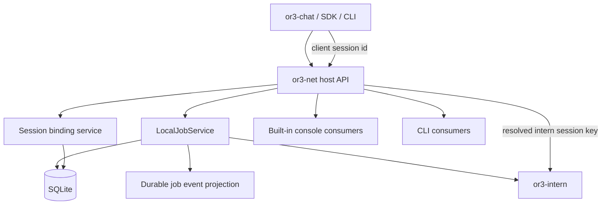

# Operator Session Completion — Design

## Overview

This design completes two missing pieces in `or3-net`:

- the operator-facing control-plane surface
- the explicit OR3-wide session contract

The guiding principle is to keep the design small and durable.

`or3-net` should not become a second chat database or a second memory engine. Instead, it should become the authoritative place for:

- session binding between client identity and execution identity
- durable job/event projections for network inspection
- operator workflows over jobs, nodes, keys, and previews

## Affected areas

- `src/api/app.ts`
  - new routes for jobs list, API keys, session views, and job/session event history
- `src/auth/service.ts`
  - API-key creation already exists; list/revoke flows must be surfaced through the host API
- `src/db/client.ts`, `src/db/schema.ts`
  - likely additive session-binding and event-log tables plus query helpers
- `src/execution/local-jobs.ts`
  - must persist normalized job events into the durable event projection
- `cli/index.ts`
  - new operator workflows
- `src/console/index.ts`
  - authenticated overview and action surface for operators
- `sdk/intern/*`
  - only if session-aware submit/replay semantics require a slight request-contract update
- cross-repo docs:
  - `/Users/brendon/Documents/or3-intern/planning/or3-net-plan.md`
  - `/Users/brendon/Documents/or3/or3-chat/planning/or3-net-plan.md`

## Control flow / architecture

### Canonical session model

The current implicit model is “whatever `session_key` the caller passes to `or3-intern`.” That is too weak for a platform-wide coordination layer.

The proposed model adds a durable `network session` binding in `or3-net`:

- `workspace_id`
- `network_session_id`
- `client_kind` (`or3-chat`, `cli`, `sdk`, etc.)
- `client_session_id` (chat thread or equivalent external identifier)
- `intern_session_key`
- `initiator_subject`
- `status`
- timestamps and last activity markers

This does **not** duplicate the full thread transcript. It provides the stable bridge between chat-facing identity and execution-facing identity.

### Job submission flow

Instead of treating `session_key` as an opaque raw string, the host API resolves or creates a session binding:

1. caller submits a job with either:
   - a known `network_session_id`, or
   - a `client_session_id` + `client_kind`, or
   - a legacy `session_key` during compatibility mode
2. `or3-net` resolves the binding
3. `or3-net` submits the turn to `or3-intern` using the resolved `intern_session_key`
4. `or3-net` persists the job with a pointer to the `network_session_id`
5. normalized job events are written to a durable event table as they are published

Compatibility rule:

- legacy callers that only provide `session_key` still work
- `or3-net` creates an implicit session binding around that key if needed

### Durable event projection

SSE remains the live transport, but operator inspection must not depend on an active stream connection.

The design adds a small durable event projection in SQLite for normalized job/session events:

- `job.accepted`
- `job.started`
- `text.delta`
- `tool.call`
- `tool.result`
- `job.completed`
- `job.failed`
- `job.aborted`

Retention can be bounded by:

- max events per job/session
- age-based pruning on startup or write path

This gives CLI, console, and later `or3-chat` views a replayable inspection source without turning `or3-net` into the system of record for all conversation content.

### Operator surfaces

The operator surfaces should all sit on the same host API:

- HTTP is the single control-plane interface
- CLI is a thin wrapper over those routes
- Console is a thin HTML client over those routes

That avoids privileged bypass paths and keeps auth/scope behavior consistent.



## Data and persistence

### Additive SQLite changes

A minimal additive model is appropriate here.

#### `network_sessions`

Suggested columns:

- `workspace_id`
- `id`
- `client_kind`
- `client_session_id`
- `intern_session_key`
- `initiator_subject`
- `status`
- `created_at`
- `updated_at`
- `last_job_id`
- `last_activity_at`
- `closed_at`

Purpose:

- durable resolution of “which OR3 session is this?”
- restart-safe session lookup
- bridge across chat/control-plane/execution layers

#### `job_events`

Suggested columns:

- `workspace_id`
- `id`
- `job_id`
- `network_session_id`
- `event_type`
- `sequence`
- `payload_json`
- `created_at`

Purpose:

- replayable normalized event history for inspection
- session/job timeline views for CLI, console, and future UI consumers

These are additive, workspace-scoped tables and do not disturb existing job rows.

### Backward compatibility

- existing job routes remain valid
- existing job IDs remain valid
- existing API tokens and scopes remain valid
- raw `session_key` callers continue to work during a compatibility window

## Interfaces and types

### Host API additions

Likely routes:

- `GET /v1/workspaces/:workspaceId/jobs`
- `GET /v1/workspaces/:workspaceId/sessions`
- `GET /v1/workspaces/:workspaceId/sessions/:sessionId`
- `GET /v1/workspaces/:workspaceId/sessions/:sessionId/events`
- `GET /v1/workspaces/:workspaceId/api-keys`
- `POST /v1/workspaces/:workspaceId/api-keys`
- `POST /v1/workspaces/:workspaceId/api-keys/:apiKeyId/revoke`

Job submission can remain on the current route with additive fields:

```ts
interface CreateJobRequest {
  session_key?: string;
  network_session_id?: string;
  client_kind?: "or3-chat" | "cli" | "sdk";
  client_session_id?: string;
  message: string;
  allowed_tools?: string[];
  meta?: Record<string, unknown>;
}
```

### Session resolution service

A small service object inside `src/session/**` or adjacent existing code should:

- resolve or create a network session binding
- map legacy `session_key` callers to an implicit binding
- update `last_activity_at` and `last_job_id`
- provide list/get helpers for operator surfaces

This is intentionally an internal service, not a new public subsystem.

### Event projection writer

`LocalJobService` should publish events in two places:

- in-memory stream broker for live clients
- durable `job_events` projection for replay and operator surfaces

The durable writer should assign per-job sequence numbers and prune by retention policy.

## Failure modes and safeguards

- **No session binding found for a client request**
  - create one when allowed; otherwise return a 400 with a clear missing-session error
- **Legacy raw session key caller**
  - create or reuse a compatibility session binding and continue
- **Excessive event growth**
  - prune by retention window and/or per-job cap
- **Sensitive tool outputs**
  - store normalized event payloads using the same bounded output policy already used for streaming; avoid dumping raw oversized artifacts into the event table
- **Workspace mismatch**
  - fail before binding resolution or event lookup
- **Console drift from CLI/API**
  - prevent by consuming only host API routes from the console

## Testing strategy

- **SQLite-backed tests**
  - session binding create/resolve/update behavior
  - workspace isolation for sessions and job events
  - retention pruning of durable event history
- **API tests**
  - jobs list filters
  - API key create/list/revoke flows
  - session detail and event replay routes
  - backward-compatible job submission using raw `session_key`
- **CLI tests**
  - job list, job abort, API key management
- **Console tests**
  - authenticated overview rendering for jobs/nodes/keys/previews
- **Cross-repo contract tests/docs**
  - `or3-chat` workspace switch expectations
  - `or3-intern` session key ownership remains canonical for execution and memory
