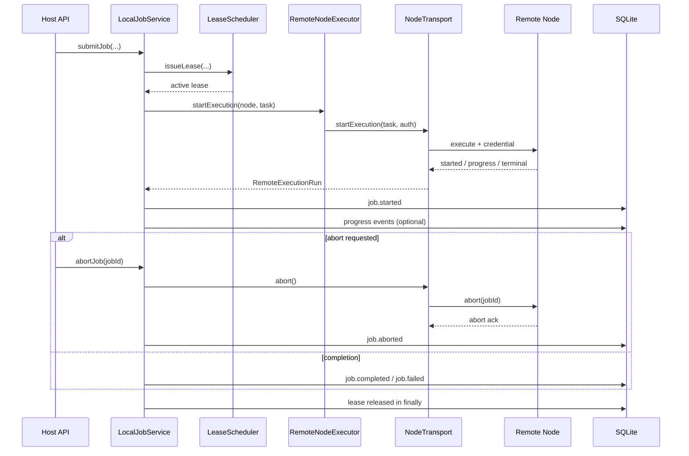

# Remote Execution Completion — Design

## Overview

This plan completes the remote execution foundation in `or3-net` without changing the repo’s basic architecture.

The design keeps the current split of responsibilities:

- `or3-net` owns durable job, lease, node, and credential state
- `or3-intern` remains the local execution authority
- `or3-sandbox` remains the first remote backend
- transports stay inside `src/nodes/**`

The main change is conceptual: remote execution stops being a one-shot request and becomes a lifecycle with explicit start, abort, result, and cleanup semantics.

## Affected areas

- `src/execution/local-jobs.ts`
  - Tracks active remote runs, owns terminal-state truthfulness, and releases leases.
- `src/nodes/executor.ts`
  - Stops returning only `Promise<JobResult>` and instead returns a remote run handle.
- `src/nodes/transport.ts`
  - Needs an execution-oriented interface rather than a thin request wrapper.
- `src/nodes/transport-https.ts`
  - Must include node credentials and support explicit abort.
- `src/nodes/transport-wss.ts`
  - Must maintain request correlation and long-running execution state.
- `src/nodes/transport-registry.ts`
  - Must resolve transports that satisfy runtime policy, not just any registered transport.
- `src/scheduler/scheduler.ts`
  - Must enforce runtime transport/certification eligibility and count only active leases.
- `src/nodes/registry.ts`
  - Already issues node credentials; those credentials must become consumable at execution time.
- `sdk/sandbox/client.ts`, `sdk/sandbox/types.ts`
  - Must align with the live `or3-sandbox` contract.
- `src/nodes/adapter-sandbox.ts`
  - Must consume the corrected SDK and normalize sandbox output into host job results/events.
- `tests/local-jobs.test.ts`, `tests/nodes.phase3.test.ts`, `tests/transport.test.ts`, `tests/sdk.clients.test.ts`
  - Main regression homes.

## Control flow / architecture

### Remote execution lifecycle

`LocalJobService` remains the top-level job orchestrator. The remote path changes from:

- issue lease
- await `executeTask()`
- persist terminal state

to:

- issue lease
- resolve node + runtime policy
- start a remote run and store a handle keyed by `jobId`
- publish `job.started`
- optionally relay normalized progress events
- await terminal result or upstream cancel outcome
- release lease and clear in-memory run state in `finally`

A minimal runtime shape is:

```ts
interface RemoteExecutionRun {
  readonly nodeId: string;
  readonly result: Promise<JobResult>;
  readonly stream?: AsyncIterable<JobStreamEvent>;
  abort(): Promise<void>;
}
```

### Transport interface

The current `request()` abstraction is too weak for truthful lifecycle control. The transport layer should become execution-aware:

```ts
interface NodeTransportAuthContext {
  readonly workspaceId: string;
  readonly nodeId: string;
  readonly credential: {
    token: string;
    expiresAt: string;
  };
}

interface NodeRpcTransport {
  readonly kind: "https" | "outbound-wss";
  startExecution(task: TaskPackage, auth: NodeTransportAuthContext): Promise<RemoteExecutionRun>;
}
```

The concrete transport may still use JSON-RPC frames internally, but `LocalJobService` and `RemoteNodeExecutor` should not have to reassemble lifecycle semantics from raw request/response primitives.

### HTTPS transport behavior

For HTTPS nodes:

- include the issued node credential in headers
- call an execute endpoint or execute RPC route that returns a correlated run handle
- if the node supports streaming, convert transport frames into normalized `JobStreamEvent`s
- call an explicit abort path for remote cancellation

### Outbound WSS transport behavior

For outbound WSS nodes:

- keep a live connection/session registry
- correlate `execute`, streamed progress, `abort`, and terminal reply frames by request or job ID
- fail active runs deterministically when the connection drops

This does not require federation or a new broker; it requires a real in-process connection registry instead of an injected one-shot handler.



## Data and persistence

### SQLite

Prefer to keep the existing tables.

- `jobs` already stores terminal outcome and `node_id`
- `leases` already stores lease state
- `nodes` and `node_credentials` already store runtime eligibility inputs

The default design does **not** require a schema migration if:

- active remote handles remain in memory only
- lease transitions continue to use existing `state` values
- credential resolution can be derived from the latest non-rotated credential row

A migration is only justified if transport correlation or runtime policy requires persisted fields that cannot be reconstructed from current tables.

### In-memory state

Add bounded in-memory maps for:

- `activeRemoteRuns: Map<jobId, RemoteExecutionRun>`
- outbound-WSS connection/session registry
- request correlation for long-running remote execution

All such state must be removed in terminal `finally` paths.

### Config and policy

Additive config is acceptable for:

- managed-mode certification enforcement
- transport defaults/timeouts
- outbound-WSS connection limits

Safe defaults must preserve current OSS behavior unless managed-mode is explicitly enabled.

## Interfaces and types

### `LocalJobService`

- track remote runs keyed by `jobId`
- abort remote runs before finalizing `job.aborted`
- release leases and clear handles in `finally`
- normalize transport failures into stable host-side error codes

### `RemoteNodeExecutor`

Current behavior:

```ts
executeTask(node, task): Promise<JobResult>
```

Target behavior:

```ts
startExecution(node: StoredNode, task: TaskPackage): Promise<RemoteExecutionRun>
```

### `sdk/sandbox`

The SDK should align with the live Go API rather than the current simplified shapes.

Priority methods to implement or correct:

- sandbox CRUD: `create`, `list`, `get`, `delete`
- lifecycle: `start`, `stop`, `suspend`, `resume`
- exec: `exec`, `execStream`
- files: `readFile`, `writeFile`, `deleteFile`, `mkdir`
- tunnels: `createTunnel`, `listTunnels`, `revokeTunnel`, `createSignedUrl` if consumed by `or3-net`
- snapshots: create/list/get/restore if needed by warm-pool or preview flows
- runtime: `runtimeInfo`, `runtimeHealth`, `runtimeCapacity`
- quotas and metrics used by operator/runtime views

The SDK can still expose a smaller public surface than the whole daemon, but every included method must be wire-correct.

Current validation status:

- the corrected `sdk/sandbox` surface now matches the `or3-net` flows currently exercised by remote execution, warm-pool use, and service-launch preparation
- `SandboxNodeAdapter` continues to rely only on `create/get/delete/list`, `exec`, `writeFile`, `createTunnel`, `listTunnels`, and warm-pool lifecycle methods; no adapter code change was required after the SDK correction
- snapshot APIs remain intentionally deferred because current `or3-net` warm-pool and preview flows do not call them

### Explicit snapshot deferral

Snapshot methods are left out of the current implementation on purpose.

- `or3-net` remote execution currently resets warm sandboxes through lifecycle + exec flows, not snapshot restore flows
- preview/service-launch behavior currently depends on tunnel and file contracts, not snapshot endpoints
- `or3-sandbox` documents snapshot endpoints as available for future use, so the deferment is an SDK surface-choice rather than a backend gap

If warm-pool reset or preview promotion moves to snapshot-based reuse in a later phase, add those methods alongside the first consuming adapter code and wire-contract tests.

## Failure modes and safeguards

- **Remote abort fails**
  - Return an API failure, preserve non-terminal or failed state, do not fake `aborted`.
- **Remote node disconnects**
  - Fail the run deterministically, release lease, clear handle.
- **Transport mismatch**
  - Exclude node from scheduling rather than attempting an unsafe fallback.
- **Expired or rotated node credential**
  - Treat node as unusable for new work until refreshed.
- **Certification invalid in managed mode**
  - Exclude node during scheduling and surface a clear reason.
- **Sandbox SDK wire drift**
  - Catch via contract tests against the documented `or3-sandbox` behavior.
- **Handle leaks**
  - Remove in-memory remote run and request-correlation state in every terminal path.

## Testing strategy

- **Unit tests**
  - `LocalJobService` remote abort correctness
  - no conflicting terminal states after abort
  - lease release in success/failure/abort paths
  - scheduler candidate filtering for transport/certification/auth eligibility
- **Transport tests**
  - HTTPS and outbound-WSS parity for execute/abort semantics
  - connection-drop behavior
  - runtime credential forwarding
- **SDK tests**
  - exec streaming framing against the actual sandbox SSE contract
  - JSON shape tests for files, tunnels, runtime, snapshots, quota, and metrics methods
- **Regression tests**
  - second remote job schedules immediately after first terminal state
  - managed-mode excludes uncertified nodes
  - sandbox-backed adapter still supports service launch and warm-pool flows after SDK changes

## Cross-repo validation notes

- `or3-sandbox`
  - The updated SDK behavior still matches the documented `?stream=1` exec contract in `/Users/brendon/Documents/or3-sandbox/planning/or3-net-plan.md`: raw `stdout`/`stderr` chunks plus terminal `result` payload.
  - The current `or3-net` adapter usage remains within the documented sandbox scope: lifecycle, exec, files, tunnels, runtime info/health/capacity, quotas, and metrics.
  - Snapshot APIs are documented in `or3-sandbox` but are not yet required by the current `or3-net` adapter flows.
- `or3-intern`
  - Remote lifecycle normalization still matches the local service contract described in `/Users/brendon/Documents/or3-intern/docs/api-reference.md`.
  - Clients continue to see the same host-level sequence shape: `job.accepted`, deterministic `job.started`, zero or more normalized deltas, then exactly one terminal event.
  - Remote abort and disconnect handling now preserve that contract by collapsing transport-specific behavior into stable host-side failure or abort events.
