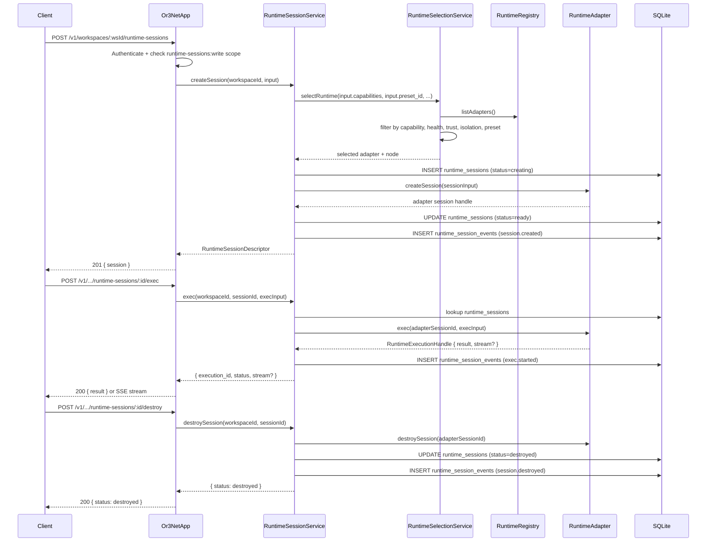

# Runtime Contract with Adapter Plugins v1 — Design

## Overview

This design adds a runtime adapter abstraction layer above the existing node RPC contract in `or3-net`. The layer introduces:

1. A **contract package** (`src/contracts/runtime/`) defining typed manifests, descriptors, capabilities, session shapes, execution handles, artifact descriptors, and error envelopes.
2. A **runtime registry** (`src/runtime/registry.ts`) for startup adapter registration, manifest validation, and health aggregation.
3. A **runtime selection service** (`src/runtime/selection.ts`) for capability-based adapter/node matching.
4. A **runtime session service** (`src/runtime/sessions.ts`) for session lifecycle management with DB persistence.
5. Three **adapter implementations** wrapping existing infrastructure: `or3-sandbox`, `remote-node-agent`, and `local-container`.
6. **Public API routes** in `src/api/app.ts` for runtime catalog and runtime session management.
7. **DB tables** (`runtime_sessions`, `runtime_session_events`, `runtime_artifacts`) with a new schema migration.

The design wraps rather than replaces the current node protocol, transport registry, executor, sandbox adapter, scheduler, and warm pool. Existing callers (`LocalJobService`, CLI, console) continue to use the current paths unchanged.

### Scope boundary

This design owns the reusable runtime substrate only.

- It defines generic runtime contracts, adapter registration, session lifecycle, persistence, and runtime APIs.
- It may include generic workspace-related capability and session fields where needed for staged runtime use.
- It does **not** own canonical host workspace resolution, selected-path manifest capture, stale-write conflict checks, explicit host commit/discard flows, or single-writer coordination for host-backed staged sessions.
- Those host-specific semantics belong to `planning/host-workspace-staging/design.md` and must layer on this substrate rather than redefine it.
- `workspace-materialize` in this design means explicit staged copy semantics compatible with host-owned staging, not a canonical runtime-owned workspace store.

### Why this fits

- The existing `SandboxNodeAdapter` and `RemoteNodeExecutor` already encapsulate backend-specific logic. The new `RuntimeAdapter` interface is a thin uniform shell around those.
- The existing `LeaseScheduler` and `NodeTransportRegistry` become internal implementation details of the `remote-node-agent` adapter.
- The existing `SandboxClient` SDK becomes the internal implementation detail of the `or3-sandbox` adapter.
- The existing `network_sessions` and `job_events` tables continue to serve `LocalJobService`; the new tables serve only runtime sessions.
- New API routes use the same auth and error-envelope patterns already established in `src/api/app.ts` and `src/contracts/platform/`.

---

## Affected areas

### `src/contracts/runtime/` (new)

New contract package defining all runtime-layer types:

- `manifest.ts` — `RuntimeAdapterManifest` schema
- `descriptors.ts` — `RuntimeDescriptor`, `RuntimeNodeDescriptor`, `RuntimeSessionDescriptor`
- `capabilities.ts` — core capability union, extension namespace, `RuntimeCapabilitySet`
- `execution.ts` — `RuntimeExecutionRequest`, `RuntimeExecutionHandle`, execution events
- `artifacts.ts` — `RuntimeArtifactDescriptor`
- `errors.ts` — `RuntimeErrorEnvelope`, runtime-specific error codes
- `sessions.ts` — `RuntimeSessionCreateInput`, `RuntimeSessionState`
- `adapter.ts` — `RuntimeAdapter` interface
- `index.ts` — barrel export

Any workspace-related fields added here should remain substrate-oriented and must not hard-code host-root resolution or commit policy.

### `src/runtime/` (new)

New runtime service package:

- `registry.ts` — `RuntimeRegistry` class
- `selection.ts` — `RuntimeSelectionService` class
- `sessions.ts` — `RuntimeSessionService` class
- `adapters/sandbox.ts` — `SandboxRuntimeAdapter` wrapping `SandboxNodeAdapter` + `SandboxClient`
- `adapters/remote-node.ts` — `RemoteNodeRuntimeAdapter` wrapping `NodeRegistryService` + `LeaseScheduler` + `RemoteNodeExecutor`
- `adapters/local-container.ts` — `LocalContainerRuntimeAdapter` using Bun `child_process` for Docker CLI

### `src/db/schema.ts` (modified)

Add new migration (version 6) with three tables: `runtime_sessions`, `runtime_session_events`, `runtime_artifacts`.

### `src/db/client.ts` (modified)

Add `WorkspaceStore` methods for runtime session CRUD, event append, artifact save/list.

### `src/api/app.ts` (modified)

Add route matching and handlers for the 11 new runtime routes.

### `src/contracts/platform/error-codes.ts` (modified)

Add runtime-specific error codes to the platform error code registry.

### `src/auth/tokens.ts` (no change, existing scopes system)

New scopes (`runtimes:read`, `runtimes:write`, `runtime-sessions:read`, `runtime-sessions:write`) are string values validated by existing `AuthService.authenticateBearerToken()` scope checks.

### Existing packages (no change)

- `src/nodes/` — `NodeRegistryService`, `RemoteNodeExecutor`, `SandboxNodeAdapter`, `NodeTransportRegistry` all remain intact. Used internally by adapters.
- `src/scheduler/` — `LeaseScheduler`, `WarmPoolManager` remain intact. Used internally by adapters.
- `src/session/` — `SessionBindingService` remains intact. Used only by `LocalJobService`.
- `src/execution/` — `LocalJobService` remains intact. Not routed through the runtime contract.
- `sdk/sandbox/` — `SandboxClient` remains intact. Used internally by the sandbox adapter.
- `sdk/intern/` — `InternClient` remains intact. Used only by `LocalJobService`.

---

## Control flow / architecture

### Startup registration flow

```
Server boot
  │
  ├─ Construct RuntimeRegistry
  │
  ├─ Register SandboxRuntimeAdapter
  │    └─ manifest validation (Zod parse)
  │    └─ adapter stored in registry map
  │
  ├─ Register RemoteNodeRuntimeAdapter
  │    └─ manifest validation
  │    └─ adapter stored in registry map
  │
  ├─ Register LocalContainerRuntimeAdapter (if Docker available)
  │    └─ manifest validation
  │    └─ adapter stored in registry map
  │
  ├─ Construct RuntimeSelectionService(registry)
  ├─ Construct RuntimeSessionService(registry, selection, database)
  │
  └─ Pass services to Or3NetApp
```

### Runtime session lifecycle flow



### Adapter delegation for `or3-sandbox`

```
SandboxRuntimeAdapter
  │
  ├─ createSession()
  │    └─ WarmPoolManager.acquire(workspaceId)
  │    └─ returns sandbox ID as adapter session handle
  │
  ├─ exec()
  │    └─ SandboxClient.execStream(sandboxId, request)
  │    └─ wraps as RuntimeExecutionHandle
  │
  ├─ copyIn() → SandboxClient.writeFile()
  ├─ copyOut() → SandboxClient.readFile()
  ├─ getLogs() → SandboxClient.exec(["cat", logPath])
  ├─ health() → SandboxClient.runtimeHealth()
  │
  └─ destroySession()
       └─ SandboxClient.delete(sandboxId)
```

### Adapter delegation for `remote-node-agent`

```
RemoteNodeRuntimeAdapter
  │
  ├─ listNodes()
  │    └─ NodeRegistryService.listNodes(workspaceId)
  │    └─ filter to adapter_kind === 'remote' and status === 'approved'
  │
  ├─ createSession()
  │    └─ LeaseScheduler.issueLease(scheduleInput)
  │    └─ returns lease ID + node ID as adapter session handle
  │
  ├─ exec()
  │    └─ NodeTransportRegistry.resolve(node)
  │    └─ RemoteNodeExecutor.startExecution(node, taskPackage)
  │    └─ wraps NodeExecutionHandle as RuntimeExecutionHandle
  │
  ├─ health()
  │    └─ RemoteNodeExecutor.heartbeat(node)
  │
  └─ destroySession()
       └─ LeaseScheduler.releaseLease(leaseId)
```

### Adapter delegation for `local-container`

```
LocalContainerRuntimeAdapter
  │
  ├─ health()
  │    └─ Bun.spawn(["docker", "info"]) — check daemon reachable
  │
  ├─ createSession()
  │    └─ Bun.spawn(["docker", "create", ...]) → container ID
  │    └─ Bun.spawn(["docker", "start", containerId])
  │    └─ returns container ID as adapter session handle
  │
  ├─ exec()
  │    └─ Bun.spawn(["docker", "exec", containerId, ...])
  │    └─ wraps as RuntimeExecutionHandle with exit code and stdout/stderr
  │
  ├─ stop() → Bun.spawn(["docker", "stop", containerId])
  ├─ copyIn() → Bun.spawn(["docker", "cp", src, "containerId:dest"])
  ├─ copyOut() → Bun.spawn(["docker", "cp", "containerId:src", dest])
  │
  └─ destroySession()
       └─ Bun.spawn(["docker", "rm", "-f", containerId])
```

---

## Data and persistence

### New SQLite tables (migration version 6)

#### `runtime_sessions`

| Column | Type | Notes |
|--------|------|-------|
| workspace_id | TEXT NOT NULL | FK → workspaces(id) |
| id | TEXT NOT NULL | Primary key with workspace_id |
| adapter_id | TEXT NOT NULL | Which adapter owns this session |
| adapter_session_ref | TEXT | Adapter-internal handle (sandbox ID, lease ID, container ID) |
| node_id | TEXT | Selected node, if applicable |
| preset_id | TEXT | Requested preset |
| status | TEXT NOT NULL | `creating`, `ready`, `stopping`, `stopped`, `destroying`, `destroyed`, `failed` |
| capabilities_json | TEXT NOT NULL | Declared capabilities for this session |
| config_json | TEXT | Session creation config snapshot |
| isolation_class | TEXT | |
| trust_tier | TEXT | |
| error_json | TEXT | Last error if status=failed |
| created_at | INTEGER NOT NULL | |
| updated_at | INTEGER NOT NULL | |
| destroyed_at | INTEGER | |

Primary key: `(workspace_id, id)`

Indexes:
- `idx_runtime_sessions_workspace_status ON runtime_sessions(workspace_id, status)`
- `idx_runtime_sessions_workspace_adapter ON runtime_sessions(workspace_id, adapter_id)`

#### `runtime_session_events`

| Column | Type | Notes |
|--------|------|-------|
| workspace_id | TEXT NOT NULL | FK → workspaces(id) |
| id | TEXT NOT NULL | Event ID |
| session_id | TEXT NOT NULL | FK → runtime_sessions |
| event_type | TEXT NOT NULL | `session.created`, `session.ready`, `exec.started`, `exec.completed`, `session.stopped`, `session.destroyed`, `session.failed` |
| sequence | INTEGER NOT NULL | Monotonic per session |
| payload_json | TEXT NOT NULL | |
| created_at | INTEGER NOT NULL | |

Primary key: `(workspace_id, id)`

Indexes:
- `idx_runtime_session_events_session_seq ON runtime_session_events(workspace_id, session_id, sequence)`

#### `runtime_artifacts`

| Column | Type | Notes |
|--------|------|-------|
| workspace_id | TEXT NOT NULL | FK → workspaces(id) |
| id | TEXT NOT NULL | Artifact ID |
| session_id | TEXT NOT NULL | FK → runtime_sessions |
| path | TEXT NOT NULL | |
| kind | TEXT NOT NULL | |
| content_type | TEXT NOT NULL | |
| size_bytes | INTEGER NOT NULL | |
| source_json | TEXT | Source metadata |
| created_at | INTEGER NOT NULL | |

Primary key: `(workspace_id, id)`

Indexes:
- `idx_runtime_artifacts_session ON runtime_artifacts(workspace_id, session_id)`

### No foreign-key relationships to existing tables

The runtime tables reference `workspaces(id)` only. No FK to `nodes`, `jobs`, `network_sessions`, `leases`, or `job_events`. Adapter-internal references (node IDs, lease IDs, sandbox IDs) are stored as opaque strings in `adapter_session_ref`.

### Config/env changes

No new environment variables or config file changes in v1. Adapter registration is code-driven at startup.

---

## Interfaces and types

### RuntimeAdapterManifest

```ts
const runtimeAdapterManifestSchema = z.object({
  adapter_id: nonEmptyStringSchema,           // e.g. "or3-sandbox", "remote-node-agent", "local-container"
  display_name: nonEmptyStringSchema,
  version: nonEmptyStringSchema,
  adapter_kind: z.enum(["sandbox", "remote", "local", "fly", "cloudflare", "ssh-vm", "akash"]),
  isolation_class: nonEmptyStringSchema,       // e.g. "vm", "container", "process", "none"
  trust_tier: z.enum(["production", "staging", "development", "untrusted"]),
  locality: z.enum(["local", "remote", "hybrid"]),
  capabilities: z.array(runtimeCapabilitySchema),
  supported_presets: z.array(nonEmptyStringSchema).default([]),
  session_modes: z.array(z.enum(["ephemeral", "persistent"])).default(["ephemeral"]),
});
```

### RuntimeAdapter interface

```ts
interface RuntimeAdapter {
  readonly manifest: RuntimeAdapterManifest;

  // Required
  health(): Promise<RuntimeAdapterHealth>;
  listNodes(workspaceId: string): Promise<RuntimeNodeDescriptor[]>;
  createSession(workspaceId: string, input: RuntimeSessionCreateInput): Promise<RuntimeAdapterSessionHandle>;
  getSession(workspaceId: string, ref: string): Promise<RuntimeAdapterSessionStatus>;
  listSessions(workspaceId: string): Promise<RuntimeAdapterSessionStatus[]>;
  destroySession(workspaceId: string, ref: string): Promise<void>;
  exec(workspaceId: string, ref: string, input: RuntimeExecutionRequest): Promise<RuntimeExecutionHandle>;
  copyIn(workspaceId: string, ref: string, input: RuntimeCopyInput): Promise<void>;
  copyOut(workspaceId: string, ref: string, input: RuntimeCopyOutput): Promise<RuntimeCopyResult>;
  getLogs(workspaceId: string, ref: string, input: RuntimeLogRequest): Promise<RuntimeLogResult>;

  // Optional (capability-gated)
  stop?(workspaceId: string, ref: string): Promise<void>;
  resume?(workspaceId: string, ref: string): Promise<void>;
  streamLogs?(workspaceId: string, ref: string, input: RuntimeLogRequest): AsyncIterable<string>;
  fileBrowse?(workspaceId: string, ref: string, path: string): Promise<RuntimeFileEntry[]>;
  fileRead?(workspaceId: string, ref: string, path: string): Promise<RuntimeFileContent>;
  fileWrite?(workspaceId: string, ref: string, path: string, content: string | Uint8Array): Promise<void>;
  fileDelete?(workspaceId: string, ref: string, path: string): Promise<void>;
  materializeWorkspace?(workspaceId: string, ref: string, input: RuntimeWorkspaceMaterializeInput): Promise<void>;
  exposeService?(workspaceId: string, ref: string, input: RuntimeServiceExposeInput): Promise<RuntimeServiceExposeResult>;
  snapshot?(workspaceId: string, ref: string): Promise<RuntimeSnapshotResult>;
  pushArtifact?(workspaceId: string, ref: string, input: RuntimeArtifactPushInput): Promise<RuntimeArtifactDescriptor>;
}
```

### RuntimeExecutionHandle

```ts
interface RuntimeExecutionHandle {
  readonly execution_id: string;
  readonly stream?: AsyncIterable<RuntimeExecutionEvent>;
  readonly result: Promise<RuntimeExecutionResult>;
  abort(): Promise<void>;
}

interface RuntimeExecutionResult {
  readonly exit_code: number;
  readonly stdout?: string;
  readonly stderr?: string;
  readonly artifacts: RuntimeArtifactDescriptor[];
  readonly meta: Record<string, unknown>;
}

type RuntimeExecutionEvent =
  | { event: "stdout"; data: string }
  | { event: "stderr"; data: string }
  | { event: "exit"; data: { exit_code: number } };
```

### RuntimeErrorEnvelope

```ts
const runtimeErrorCodeValues = [
  "unsupported_capability",
  "policy_denied",
  "adapter_unavailable",
  "session_not_found",
  "session_destroyed",
  "exec_failed",
  "exec_timeout",
  "copy_failed",
  "log_unavailable",
  "adapter_internal",
] as const;

const runtimeErrorEnvelopeSchema = z.object({
  code: z.enum(runtimeErrorCodeValues),
  message: nonEmptyStringSchema,
  retriable: z.boolean().default(false),
  details: jsonObjectSchema.default({}),
  retry_after_ms: positiveIntegerSchema.optional(),
});
```

### RuntimeRegistry

```ts
class RuntimeRegistry {
  register(adapter: RuntimeAdapter): void;       // validates manifest, rejects duplicates
  get(adapterId: string): RuntimeAdapter | undefined;
  list(): RuntimeAdapter[];
  health(): Promise<Map<string, RuntimeAdapterHealth>>;
}
```

### RuntimeSelectionService

```ts
interface RuntimeSelectionCriteria {
  required_capabilities?: string[];
  preset_id?: string;
  isolation_class?: string;
  trust_tier?: string;
  locality?: string;
}

class RuntimeSelectionService {
  select(workspaceId: string, criteria: RuntimeSelectionCriteria): Promise<{
    adapter: RuntimeAdapter;
    node?: RuntimeNodeDescriptor;
  }>;
}
```

### Public API route signatures

All routes follow existing patterns in `src/api/app.ts`:

- Auth: `authenticateBearerToken()` → `WorkspacePrincipal`
- Scope check: `requireScope(principal, "runtimes:read")` or similar
- Error: `errorResponse()` → `ErrorEnvelope`
- Success: JSON response with typed body

---

## Failure modes and safeguards

### Adapter unavailable at startup

If an adapter's health check fails during registration, it is registered with `health_status: "degraded"`. The selection service skips degraded adapters. The runtime catalog API surfaces the degraded status to clients.

### Adapter fails during session create

`RuntimeSessionService.createSession()` catches adapter errors, maps them to `RuntimeErrorEnvelope`, marks the DB session as `failed`, emits a `session.failed` event, and returns a typed error response through the API.

### Adapter fails during exec

`RuntimeSessionService.exec()` catches adapter errors, maps them to `RuntimeErrorEnvelope`, emits an `exec.failed` event, and returns a typed error. The session remains in `ready` state (exec failure does not destroy the session).

### Adapter fails during destroy

`RuntimeSessionService.destroySession()` always marks the DB record as `destroyed` even if the adapter-side cleanup throws. The adapter error is logged and included in the `session.destroyed` event payload as `cleanup_error`.

### Transport loss (remote-node-agent)

`RemoteNodeRuntimeAdapter` catches `RemoteExecutionError` from the transport layer and maps it to `RuntimeErrorEnvelope` with `adapter_unavailable` or `exec_failed` code. Retriable flag is preserved from the transport error.

### Docker daemon unavailable (local-container)

`LocalContainerRuntimeAdapter.health()` returns `{ status: "unavailable" }` if `docker info` fails. `createSession()` throws `adapter_unavailable`. The selection service never selects an unavailable adapter.

### Restart reconciliation

On startup, `RuntimeSessionService` queries non-terminal sessions (`creating`, `ready`, `stopping`), probes adapter health for each, and:
- If adapter is healthy and session is still alive adapter-side → mark `ready`.
- If adapter is healthy but session is gone adapter-side → mark `destroyed`.
- If adapter is unhealthy → mark `failed` with reconciliation error.

### Unsupported capability calls

If a client requests a capability the selected adapter does not declare, the session service returns a `unsupported_capability` error before delegating to the adapter. This is enforced at the service layer, not the adapter.

---

## Testing strategy

### Contract tests (`tests/contracts/runtime/`)

- Validate all runtime Zod schemas parse their fixture files correctly.
- Validate `RuntimeAdapterManifest` rejects invalid capability declarations.
- Validate `RuntimeErrorEnvelope` maps to `ErrorEnvelope` for API responses.
- Validate capability union covers all core capabilities.
- Validate reserved adapter kinds exist in the type model.

### Adapter conformance tests (`tests/runtime/`)

- For each adapter (`or3-sandbox`, `remote-node-agent`, `local-container`):
  - Manifest passes validation.
  - Required methods are implemented.
  - Declared capabilities match implemented optional methods.
  - Unsupported optional methods are absent or throw correctly.
  - Error normalization produces valid `RuntimeErrorEnvelope`.

### Adapter parity tests

- `or3-sandbox`: exec, abort, file transfer, logs, and health produce equivalent results to direct `SandboxNodeAdapter` calls.
- `remote-node-agent`: exec and health produce equivalent results to direct `RemoteNodeExecutor` calls.
- `local-container`: exec produces correct exit codes, stdout/stderr, and handles timeout correctly.

### API route tests (`tests/api/`)

- Auth and scope enforcement for all 11 routes.
- 404 for nonexistent runtimes and sessions.
- `unsupported_capability` error for capability-gated operations.
- Coexistence with existing `/sessions`, `/nodes`, `/jobs` routes—no regressions.

### Persistence tests (`tests/runtime/`)

- Session create/get/list/destroy round-trip through SQLite.
- Event append and sequence monotonicity.
- Artifact save/list per session.
- Restart reconciliation marks orphaned sessions correctly.
- Destroy always persists even when adapter cleanup fails.

### Selection tests (`tests/runtime/`)

- Selection by capability, health, trust tier, isolation class, locality, and preset eligibility.
- Policy denial for unsupported capabilities.
- Degraded adapters are excluded.
- Empty adapter registry returns clear error.

### Desktop catalog tests

- Runtime catalog API returns descriptors with enough metadata for UI rendering without adapter-specific branches.
- Session state transitions are visible through the API.
