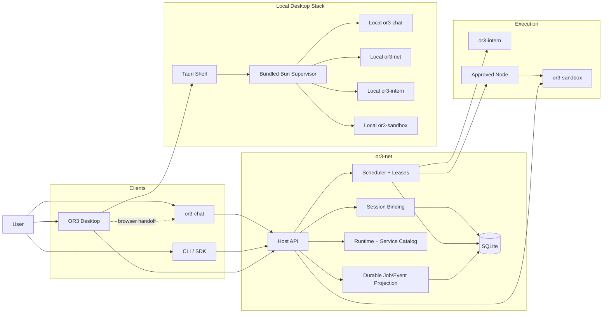
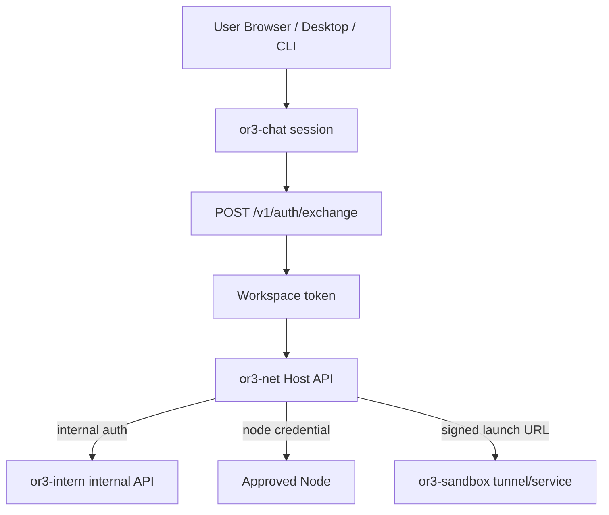
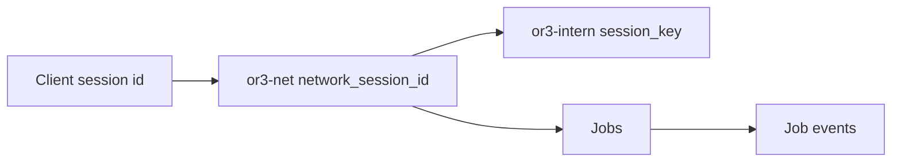
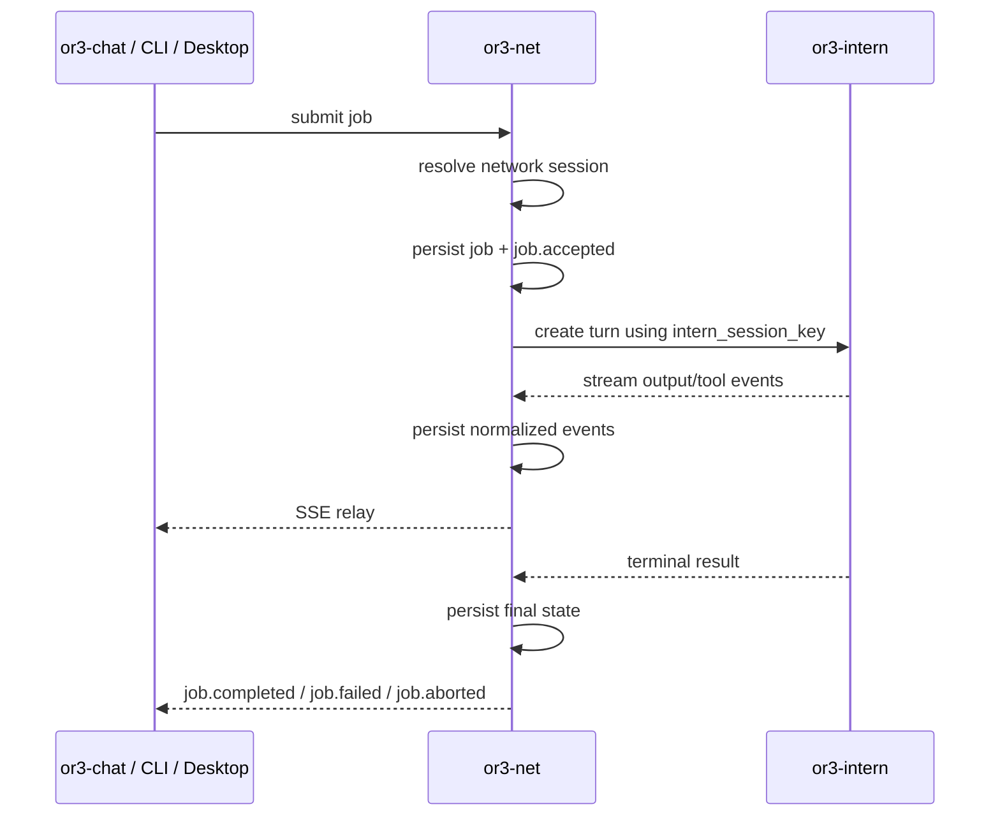
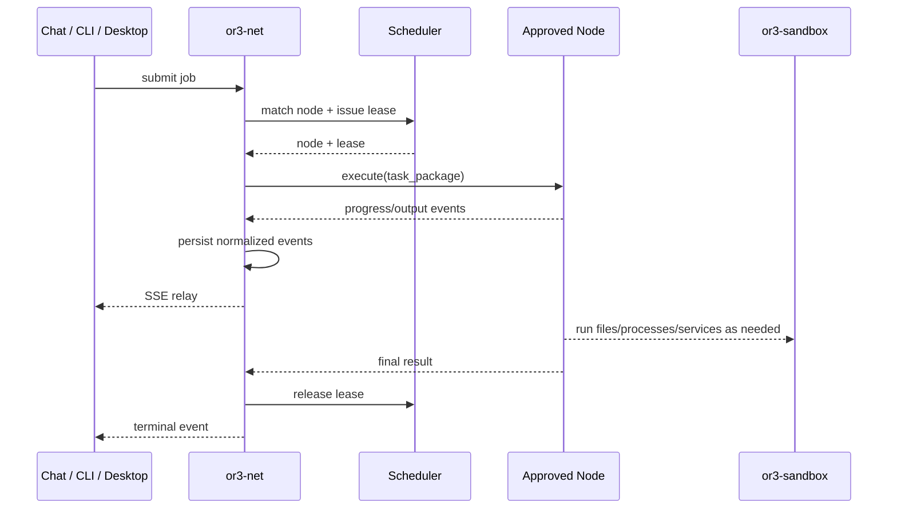
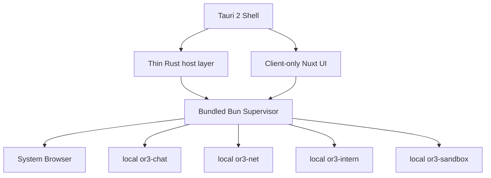

This file is a merged representation of a subset of the codebase, containing files not matching ignore patterns, combined into a single document by Repomix.

# File Summary

## Purpose
This file contains a packed representation of a subset of the repository's contents that is considered the most important context.
It is designed to be easily consumable by AI systems for analysis, code review,
or other automated processes.

## File Format
The content is organized as follows:
1. This summary section
2. Repository information
3. Directory structure
4. Repository files (if enabled)
5. Multiple file entries, each consisting of:
  a. A header with the file path (## File: path/to/file)
  b. The full contents of the file in a code block

## Usage Guidelines
- This file should be treated as read-only. Any changes should be made to the
  original repository files, not this packed version.
- When processing this file, use the file path to distinguish
  between different files in the repository.
- Be aware that this file may contain sensitive information. Handle it with
  the same level of security as you would the original repository.

## Notes
- Some files may have been excluded based on .gitignore rules and Repomix's configuration
- Binary files are not included in this packed representation. Please refer to the Repository Structure section for a complete list of file paths, including binary files
- Files matching these patterns are excluded: planning, **/*.test.ts
- Files matching patterns in .gitignore are excluded
- Files matching default ignore patterns are excluded
- Files are sorted by Git change count (files with more changes are at the bottom)

# Directory Structure
```
cli/
  index.ts
docs/
  api/
    http-api.md
  concepts/
    jobs-and-sessions.md
    mental-model.md
    runtimes-and-nodes.md
  sdk/
    intern-sdk.md
    sandbox-sdk.md
  getting-started.md
  README.md
sdk/
  intern/
    client.ts
    index.ts
    types.ts
  sandbox/
    client.ts
    index.ts
    types.ts
src/
  agents/
    index.ts
    service.ts
  api/
    app.ts
    index.ts
    response-helpers.ts
  auth/
    index.ts
    service.ts
    tokens.ts
  console/
    index.ts
  contracts/
    platform/
      auth.ts
      compat.ts
      error-codes.ts
      index.ts
      stream-events.ts
      types.ts
    runtime/
      adapter.ts
      artifacts.ts
      capabilities.ts
      descriptors.ts
      errors.ts
      execution.ts
      index.ts
      manifest.ts
      README.md
      sessions.ts
    core.ts
    index.ts
    previews.ts
    protocol.ts
    shared.ts
  db/
    client.ts
    index.ts
    schema.ts
  execution/
    job-streams.ts
    local-jobs.ts
  lib/
    crypto.ts
    ids.ts
    time.ts
  nodes/
    adapter-sandbox.ts
    executor.ts
    index.ts
    registry.ts
    signatures.ts
    transport-https.ts
    transport-registry.ts
    transport-wss.ts
    transport.ts
  previews/
    service.ts
  runtime/
    adapters/
      index.ts
      local-container.ts
      remote-node.ts
      sandbox.ts
    index.ts
    README.md
    registry.ts
    selection.ts
    sessions.ts
    workspace-stage.ts
  scheduler/
    index.ts
    scheduler.ts
    warmpool.ts
  session/
    index.ts
    service.ts
  workspace/
    files.ts
    host-staging.ts
  index.ts
  server.ts
tests/
  contracts/
    fixtures/
      audit-context.json
      auth-exchange.request.json
      auth-exchange.response.json
      capability-grant.json
      error-envelope.401.json
      error-envelope.403.json
      error-envelope.404.json
      error-envelope.409.json
      error-envelope.429.json
      intern-stream-events.jsonl
      intern-turn-request.json
      intern-turn-response.json
      job-stream-events.jsonl
      platform-session-ref.json
      runtime-adapter-manifest.json
      runtime-artifact-descriptor.json
      runtime-descriptor.json
      runtime-error-envelope.adapter_internal.json
      runtime-error-envelope.adapter_unavailable.json
      runtime-error-envelope.copy_failed.json
      runtime-error-envelope.exec_failed.json
      runtime-error-envelope.exec_timeout.json
      runtime-error-envelope.log_unavailable.json
      runtime-error-envelope.policy_denied.json
      runtime-error-envelope.session_destroyed.json
      runtime-error-envelope.session_not_found.json
      runtime-error-envelope.unsupported_capability.json
      runtime-execution-request.json
      runtime-session-descriptor.json
      sandbox-create-request.json
      sandbox-create-response.json
      sandbox-error-response.json
      sandbox-exec-response.json
      sandbox-exec-stream-events.jsonl
      workspace-principal.json
    helpers.ts
.gitignore
eslint.config.mjs
index.ts
or3-net.md
package.json
README.md
tsconfig.json
```

# Files

## File: docs/api/http-api.md
````markdown
# HTTP API

This document explains the main OR3 Net HTTP API exposed by the control plane.

It is not generated reference documentation.
Instead, it is a practical guide to the route groups, authentication model, and common request flows.

## Base ideas

Most routes are scoped to a workspace:

- `/v1/workspaces/:workspaceId/...`

There are also a few global or quasi-global routes:

- `/v1/auth/exchange`
- `/v1/launch/:token`
- `/v1/jobs/:jobId...`
- `/console`

## Authentication model

OR3 Net accepts bearer auth in the standard `Authorization` header.

```http
Authorization: Bearer <token>
```

Two bearer formats are supported:

- **workspace token**: a signed OR3 token minted by `AuthService`
- **API key**: a stored workspace-scoped key looked up by hash

### Auth exchange

The route for exchanging upstream proof into an OR3 bearer token is:

- `POST /v1/auth/exchange`

It accepts provider-specific `session_proof` data and returns a workspace token.

Use this route when you already have identity proof from another auth system and need an OR3-native bearer token for the control plane.

## Error model

HTTP errors are normalized into a platform error envelope.
A typical response includes:

- `error`
- `code`
- `status`
- `request_id`
- optional `retry_after_ms`

A related `X-Request-Id` header is also included.

## Route groups

### Auth

- `POST /v1/auth/exchange`

Purpose:

- turn external session proof into an OR3 workspace token

### Jobs

- `GET /v1/workspaces/:workspaceId/jobs`
- `POST /v1/workspaces/:workspaceId/jobs`
- `GET /v1/jobs/:jobId`
- `GET /v1/jobs/:jobId/stream`
- `POST /v1/jobs/:jobId/abort`

Purpose:

- submit jobs
- list workspace jobs
- inspect a single job
- stream live output
- abort running work

Typical create-job input includes:

- session identity (`network_session_id`, or `client_kind` + `client_session_id`, or `session_key`)
- `message`
- optional `allowed_tools`
- optional metadata
- optional profile name
- execution target

### API keys

- `GET /v1/workspaces/:workspaceId/api-keys`
- `POST /v1/workspaces/:workspaceId/api-keys`
- `POST /v1/workspaces/:workspaceId/api-keys/:apiKeyId/revoke`

Purpose:

- create secondary credentials for workspace-scoped callers
- list issued keys
- revoke old credentials

### Sessions

- `GET /v1/workspaces/:workspaceId/sessions`
- `GET /v1/workspaces/:workspaceId/sessions/:sessionId`
- `GET /v1/workspaces/:workspaceId/sessions/:sessionId/events`

Purpose:

- inspect network-session bindings and their retained event history

### Runtime inventory

- `GET /v1/workspaces/:workspaceId/runtimes`
- `GET /v1/workspaces/:workspaceId/runtimes/:runtimeId`
- `GET /v1/workspaces/:workspaceId/runtimes/:runtimeId/nodes`

Purpose:

- inspect registered runtimes and the nodes they expose

### Runtime sessions

- `GET /v1/workspaces/:workspaceId/runtime-sessions`
- `POST /v1/workspaces/:workspaceId/runtime-sessions`
- `GET /v1/workspaces/:workspaceId/runtime-sessions/:sessionId`
- `POST /v1/workspaces/:workspaceId/runtime-sessions/:sessionId/exec`
- `POST /v1/workspaces/:workspaceId/runtime-sessions/:sessionId/stop`
- `POST /v1/workspaces/:workspaceId/runtime-sessions/:sessionId/destroy`
- `POST /v1/workspaces/:workspaceId/runtime-sessions/:sessionId/commit`
- `POST /v1/workspaces/:workspaceId/runtime-sessions/:sessionId/discard`
- `GET /v1/workspaces/:workspaceId/runtime-sessions/:sessionId/staging`
- `GET /v1/workspaces/:workspaceId/runtime-sessions/:sessionId/logs`
- `POST /v1/workspaces/:workspaceId/runtime-sessions/:sessionId/files:copy-in`
- `POST /v1/workspaces/:workspaceId/runtime-sessions/:sessionId/files:copy-out`

Purpose:

- create and manage execution environments
- run commands inside them
- move files in and out
- inspect logs
- stage, commit, or discard host workspace changes

### Agents

- `GET /v1/workspaces/:workspaceId/agents`
- `POST /v1/workspaces/:workspaceId/agents`
- `GET /v1/workspaces/:workspaceId/agents/:agentId`
- `PUT /v1/workspaces/:workspaceId/agents/:agentId`
- `DELETE /v1/workspaces/:workspaceId/agents/:agentId`

Purpose:

- store reusable agent definitions inside a workspace

### Nodes and node services

- `GET /v1/workspaces/:workspaceId/nodes`
- `POST /v1/workspaces/:workspaceId/nodes/enroll`
- `POST /v1/workspaces/:workspaceId/nodes/:nodeId/approve`
- `GET /v1/workspaces/:workspaceId/nodes/:nodeId/services`
- `POST /v1/workspaces/:workspaceId/nodes/:nodeId/services/:serviceId/launch`
- `POST /v1/workspaces/:workspaceId/nodes/:nodeId/services/:serviceId/revoke`
- `POST /v1/workspaces/:workspaceId/nodes/:nodeId/services/:serviceId/restart`

Purpose:

- enroll and approve remote nodes
- inspect service capabilities published by nodes
- launch, revoke, or restart node-backed services

### Previews and launch tokens

- `GET /v1/workspaces/:workspaceId/previews`
- `POST /v1/workspaces/:workspaceId/previews`
- `POST /v1/workspaces/:workspaceId/previews/:previewId/launch`
- `POST /v1/workspaces/:workspaceId/previews/:previewId/revoke`
- `GET /v1/launch/:token`
- `GET /v1/launch/:token/:path*`

Purpose:

- register preview descriptors
- mint launch capabilities
- resolve file-backed or redirect-backed launch targets
- revoke access when preview state changes

## Common flows

### Flow: exchange auth and submit a job

1. `POST /v1/auth/exchange`
2. store returned bearer token
3. `POST /v1/workspaces/:workspaceId/jobs`
4. `GET /v1/jobs/:jobId/stream`

### Flow: create and use a runtime session

1. `POST /v1/workspaces/:workspaceId/runtime-sessions`
2. `POST /v1/workspaces/:workspaceId/runtime-sessions/:sessionId/exec`
3. optionally `files:copy-in` or `files:copy-out`
4. optionally `commit` or `discard`
5. `destroy`

### Flow: approve a node for remote execution

1. node submits manifest to `nodes/enroll`
2. operator approves via `nodes/:nodeId/approve`
3. control plane issues runtime credential
4. lease scheduler can start assigning jobs to the node

## Request IDs

OR3 Net uses request ids in both success and error paths to make debugging easier.
If a caller already has a request id, it should send `X-Request-Id`.
Otherwise the server creates one.

## Practical advice

- Treat workspace id as required context, not a cosmetic path segment
- Prefer job streaming for live UX, but use job records for durable state
- Use runtime sessions only when you need environment continuity
- Use previews and launch tokens for browser access instead of exposing raw backend URLs

## Related docs

- [Mental Model](../concepts/mental-model.md)
- [Jobs and Sessions](../concepts/jobs-and-sessions.md)
- [Runtimes and Nodes](../concepts/runtimes-and-nodes.md)
- [Intern SDK](../sdk/intern-sdk.md)
- [Sandbox SDK](../sdk/sandbox-sdk.md)
````

## File: docs/concepts/jobs-and-sessions.md
````markdown
# Jobs and Sessions

This document explains the pieces of OR3 Net that most callers interact with first.

## Jobs

A **job** is the control-plane record for requested work.

A job contains the high-level facts the system needs to track:

- `job_id`
- `workspace_id`
- `status`
- creation and terminal timestamps
- optional result
- optional error

In practice, a job is paired with a `TaskPackage`, which carries the instructions and scheduling requirements used by the execution path.

## Job lifecycle

A job usually moves through these states:

- `pending`
- `scheduled`
- `running`
- `completed`
- `failed`
- `aborted`

Not every backend uses every state in exactly the same way, but the control plane preserves this shared lifecycle.

## Job events

OR3 Net stores job events separately from the job row.
This matters for two reasons:

1. the current job state stays easy to query
2. stream history remains available even after the job reaches a terminal state

Examples of job stream events include:

- `job.accepted`
- `job.started`
- `text.delta`
- `tool.call`
- `tool.result`
- `job.completed`
- `job.failed`
- `job.aborted`

The in-memory `JobStreamBroker` handles live fanout.
The database handles retained history.

## Network sessions

A **network session** represents the caller-side session identity that jobs belong to.

This is useful when a caller reconnects or submits multiple related jobs.
Instead of treating every request as unrelated, OR3 Net can bind them to one durable session record.

Network sessions can be resolved from:

- an existing `network_session_id`
- a `client_kind` plus `client_session_id`
- a `session_key`

This logic lives in [src/session/service.ts](../../src/session/service.ts).

## Why network sessions exist

Without network sessions, the control plane could still run jobs, but it would lose important context:

- which client thread or conversation a job belongs to
- the last job associated with a caller
- activity timestamps for session-aware UX or analytics
- a stable `PlatformSessionRef` that downstream systems can use

## Platform session reference

When OR3 Net resolves a network session, it can also produce a `PlatformSessionRef`.

This is the normalized public session identity that downstream APIs and Intern-aware flows use.

It contains:

- `workspace_id`
- `client_kind`
- `client_session_id`
- `network_session_id`
- `session_key`

## Runtime sessions

A **runtime session** is not the same thing as a network session.

A runtime session is an adapter-managed execution environment.
Examples:

- a running sandbox instance
- a local Docker container
- a remote node lease mapped into the runtime adapter contract

Runtime sessions matter when you need an environment that persists across multiple operations, such as:

- multiple exec calls
- staged workspace content
- file transfers
- service exposure
- later commit or discard of changes

## How jobs and runtime sessions fit together

A simple job can run without the caller ever thinking about runtime sessions.
That is the right default mental model.

Runtime sessions show up when the system needs more than one-shot execution.

A useful way to think about it is:

- **job** = work request
- **network session** = caller identity continuity
- **runtime session** = execution environment continuity

## Common mistakes

### Mistake: treating `session_key` as a runtime session id

`session_key` belongs to the network-session and Intern-facing side.
It is not the same as `runtime_session_id`.

### Mistake: assuming job history only exists in the live stream

Live streaming is only one view.
OR3 Net also retains structured job events.

### Mistake: assuming abort means no persisted record exists

Even aborted work remains part of control-plane history.
The terminal state changes, but the job record still exists.

## Related docs

- [Mental Model](mental-model.md)
- [Runtimes and Nodes](runtimes-and-nodes.md)
- [HTTP API](../api/http-api.md)
````

## File: docs/concepts/mental-model.md
````markdown
# Mental Model

This document explains how to think about OR3 Net without needing to read the whole codebase first.

## The one-sentence model

OR3 Net is a **workspace-scoped execution control plane**.

It accepts authenticated requests, stores control-plane state, and routes execution to one of several runtime backends.

## The major layers

OR3 Net is easiest to understand as five layers.

### 1. Contracts

Contracts are the stable shapes used across the system.

Examples:

- job contracts
- runtime-session contracts
- platform auth and error envelopes
- preview contracts

These live under [src/contracts](../../src/contracts).

### 2. Control-plane services

These are the stateful services that coordinate behavior.

Examples:

- `AuthService`
- `LocalJobService`
- `SessionBindingService`
- `PreviewService`
- `RuntimeSessionService`
- `NodeRegistryService`
- `LeaseScheduler`

These mostly live under [src](../../src).

### 3. Persistence

OR3 Net persists control-plane state in SQLite through `ControlPlaneDatabase` and `WorkspaceStore`.

Persisted records include:

- workspaces
- jobs
- job events
- API keys
- network sessions
- runtime sessions
- runtime artifacts
- nodes and node credentials
- leases
- previews
- idempotency records

See [src/db/client.ts](../../src/db/client.ts) and [src/db/schema.ts](../../src/db/schema.ts).

### 4. Runtime backends

Execution does not happen inside the control plane itself.
The control plane delegates to runtime adapters.

Built-in adapters include:

- local container
- sandbox
- remote node

See [src/runtime/adapters](../../src/runtime/adapters).

### 5. External surfaces

These are how other systems talk to OR3 Net.

- the Bun HTTP API under `/v1/...`
- the built-in console at `/console`
- the package exports from [src/index.ts](../../src/index.ts)
- the SDKs under [sdk](../../sdk)

## The most important boundaries

### Workspace is the main isolation boundary

Almost everything important belongs to a workspace.

That includes:

- jobs
- API keys
- sessions
- nodes
- previews
- runtime sessions

This is why many routes start with `/v1/workspaces/:workspaceId/...`.

### Job and runtime session are different things

A **job** is a request to do work.
A **runtime session** is an execution environment.

A job might use a runtime session, but they are not the same abstraction.

### Network session and runtime session are different things

A **network session** represents the caller relationship.
It helps group jobs by client session identity.

A **runtime session** represents the environment where execution happens.

Do not treat them as interchangeable.

### Node and runtime adapter are different things

A **runtime adapter** is a control-plane integration surface.
A **node** is a remote execution worker.

For example:

- the remote-node adapter knows how to use approved nodes
- an individual approved node is the worker that actually runs something

## A typical flow

Here is the normal path from request to execution.

1. A caller authenticates or provides an existing OR3 bearer token.
2. OR3 Net resolves the caller to a workspace principal.
3. A job submission is validated and persisted.
4. A network session binding is resolved or created.
5. The control plane chooses a backend:
   - local intern flow
   - sandbox-backed flow
   - remote node flow
6. Stream events and terminal state are persisted.
7. The caller reads job state, stream output, or resulting artifacts.

## Why this architecture exists

This split gives OR3 Net a few important properties:

- **stable contracts** even when execution backends differ
- **local persistence** for observability and recovery
- **pluggable runtimes** through the runtime adapter interface
- **workspace scoping** for security and multi-tenant behavior
- **replayable control-plane state** such as jobs, sessions, and events

## What OR3 Net deliberately does not try to be

OR3 Net is not:

- a model provider SDK
- a frontend framework
- a universal cluster scheduler
- a replacement for sandbox or Intern services

It coordinates those systems rather than replacing them.

## Recommended reading order

- [Jobs and Sessions](jobs-and-sessions.md)
- [Runtimes and Nodes](runtimes-and-nodes.md)
- [HTTP API](../api/http-api.md)
````

## File: docs/concepts/runtimes-and-nodes.md
````markdown
# Runtimes and Nodes

This document explains how OR3 Net chooses where work runs.

## Runtime adapters

A **runtime adapter** is OR3 Net’s abstraction for an execution backend.

The control plane does not want every caller to care about the differences between:

- a local container
- a sandbox
- a remote worker node

So it exposes a shared runtime contract instead.

That contract includes capabilities such as:

- create session
- destroy session
- exec
- copy in / copy out
- log access
- file browsing and file reads/writes
- workspace staging
- service exposure
- snapshots

See [src/contracts/runtime](../../src/contracts/runtime).

## Built-in runtime adapters

OR3 Net currently ships with three main built-in adapters.

### Local container

The local-container adapter uses Docker on the host machine.

Use it when you want:

- a simple local development backend
- ephemeral container-based execution
- a backend with no external service dependency beyond Docker

### Sandbox

The sandbox adapter uses the sandbox service through the sandbox SDK.

Use it when you want:

- API-driven sandbox lifecycle
- filesystem operations
- archive import/export
- service tunnels
- execution in a dedicated sandbox environment

### Remote node

The remote-node adapter presents approved remote nodes through the same runtime session contract.

Use it when you want:

- leased remote capacity
- node-based scheduling
- explicit capability and certification gating

## Capabilities

Runtimes and nodes advertise capabilities.
Selection and validation are capability-driven.

Examples include:

- `exec`
- `copy-in`
- `copy-out`
- `file-browse`
- `log-stream`
- `service-expose`
- `workspace-write`

A request can declare required capabilities.
If the chosen runtime does not satisfy them, OR3 Net rejects the request instead of making a hidden downgrade.

## Runtime selection

Runtime selection is handled by `RuntimeSelectionService`.

It considers:

- required capabilities
- preset support
- trust tier
- isolation class
- locality
- adapter health
- node health

This means OR3 Net does not just pick the first available backend.
It scores candidates against the request.

## Runtime sessions

A runtime session is an adapter-owned environment represented by a control-plane record.

Typical runtime session operations include:

- create
- exec
- stop
- destroy
- copy files in/out
- read logs
- inspect staging state
- commit or discard workspace changes

## Host workspace staging

One of the more important OR3 Net concepts is **workspace staging**.

This is how selected host files are materialized into a runtime session and later reconciled back to the host.

Why stage files instead of writing directly to the host?

Because staging provides:

- explicit selection of which paths are in scope
- transport flexibility such as archive or file API
- diffing between baseline, host, and exported state
- conflict detection during commit
- rollback support when applying writes back to the host

See [src/runtime/workspace-stage.ts](../../src/runtime/workspace-stage.ts).

## Nodes

A **node** is a remote worker that publishes a signed manifest.

That manifest describes things like:

- node id
- adapter kind
- capabilities
- isolation class
- supported transports
- resource limits
- lease policy
- optional certification

Nodes are not immediately trusted just because they exist.
They go through enrollment and approval.

## Node lifecycle

The usual node path looks like this:

1. node submits a signed manifest
2. OR3 Net verifies the signature
3. node is stored as `pending`
4. an operator or workflow approves the node
5. OR3 Net issues a short-lived runtime credential
6. the scheduler can now lease the node for work

## Leases

A **lease** is the short-lived assignment of a node to a job.

Leases exist because remote-node execution needs explicit ownership of capacity.
A lease tracks:

- the chosen node
- the requested profile
- TTL
- state
- whether reset is required

The `LeaseScheduler` evaluates eligibility before issuing a lease.

Eligibility can fail for reasons such as:

- node not approved
- stale health
- missing capability
- isolation mismatch
- no registered transport
- missing runtime credential
- invalid certification
- node already at capacity

## Previews and service launch

Runtimes and nodes can also produce browser-facing experiences.
OR3 Net models these as previews or service-launch capabilities.

Examples:

- a web dashboard exposed from a sandbox
- a file-backed static preview
- a signed launch URL for a private tunnel

The key point is that OR3 Net treats these as control-plane concepts with expiry and revocation, not just random URLs.

## Related docs

- [Mental Model](mental-model.md)
- [Jobs and Sessions](jobs-and-sessions.md)
- [HTTP API](../api/http-api.md)
- [Sandbox SDK](../sdk/sandbox-sdk.md)
````

## File: docs/sdk/intern-sdk.md
````markdown
# Intern SDK

This guide explains the `sdk/intern` package and when to use it.

## What the Intern SDK is for

The Intern SDK is the TypeScript client for the internal turn-processing service used by OR3 Net.

Use it when you need to:

- submit a turn request
- stream incremental job output
- spawn a subagent
- attach to an existing job stream
- abort a running Intern job

The main implementation is `HttpInternClient` in [sdk/intern/client.ts](../../sdk/intern/client.ts).

## Core idea

The Intern SDK is not a general OR3 Net client.
It is a client for the **Intern service**.

That means it sits one layer closer to turn processing than the OR3 Net HTTP API does.

If you need workspace-level control-plane behavior, start with the OR3 Net HTTP API.
If you need direct turn and subagent operations against Intern, use this SDK.

## Main interface

The transport-neutral interface is `InternClient`.
It exposes:

- `submitTurn(...)`
- `submitTurnStream(...)`
- `spawnSubagent(...)`
- `streamJob(...)`
- `abortJob(...)`

## Authentication model

`HttpInternClient` signs a short-lived service bearer token from a shared secret.

Important implications:

- callers do not pass a long-lived workspace token to this SDK
- the SDK itself creates the bearer token used for each request
- the shared secret must match what the Intern service expects

## Request context propagation

Many Intern calls optionally carry request context headers.
These help preserve trace and workspace context.

The request context can include:

- `requestId`
- `workspaceId`
- `networkSessionId`

This is useful when OR3 Net is acting as the caller and wants Intern-side logs or tracing to line up with control-plane state.

## Common usage

### Submit a turn and wait for JSON

```ts
import { HttpInternClient } from 'or3-net/sdk/intern';

const client = new HttpInternClient({
  baseUrl: 'http://127.0.0.1:3000',
  secret: process.env.INTERN_SHARED_SECRET!,
});

const response = await client.submitTurn({
  sessionKey: 'svc:demo',
  message: 'say hello',
  requestContext: {
    requestId: 'req_demo',
    workspaceId: 'ws_demo',
  },
});
```

### Submit a turn and stream output

```ts
for await (const event of client.submitTurnStream({
  sessionKey: 'svc:demo',
  message: 'write a short summary',
})) {
  console.log(event.event, event.data);
}
```

### Spawn a subagent

```ts
const result = await client.spawnSubagent({
  parentSessionKey: 'svc:demo',
  task: 'Review the draft and list missing risks',
  promptSnapshot: [
    { role: 'user', content: 'Draft goes here' },
  ],
});
```

## Error handling

Failed HTTP calls are normalized into `InternRequestError`.

It includes:

- `status`
- optional parsed `response`
- optional `retryAfterMs`

This makes it easier to branch on capability or availability failures.

A helper is also provided:

- `isInternSubagentsUnavailable(error)`

Use it when subagents are optional rather than guaranteed.

## Streaming behavior

Streaming methods parse SSE frames using the standard pattern:

- `event: ...`
- `data: ...`

This is intentionally simple and easy to reason about.

Important constraint:

- if the response body is missing, the client throws instead of pretending the stream completed cleanly

## When not to use this SDK

Do not use the Intern SDK when you need:

- workspace API key management
- runtime session lifecycle
- preview management
- node enrollment or approval
- launch token resolution

Those are OR3 Net control-plane responsibilities, not Intern SDK responsibilities.

Use the OR3 Net HTTP API for those workflows.

## Related docs

- [HTTP API](../api/http-api.md)
- [Jobs and Sessions](../concepts/jobs-and-sessions.md)
````

## File: docs/sdk/sandbox-sdk.md
````markdown
# Sandbox SDK

This guide explains the `sdk/sandbox` package and how it fits into OR3 Net.

## What the Sandbox SDK is for

The Sandbox SDK is the TypeScript client for the sandbox service.

Use it when you need to program against sandbox APIs such as:

- sandbox lifecycle
- command execution
- filesystem operations
- workspace archive import/export
- tunnels and signed launch URLs
- runtime health and capacity queries

The main implementation is `HttpSandboxClient` in [sdk/sandbox/client.ts](../../sdk/sandbox/client.ts).

## Core idea

The sandbox service is an execution backend.
The Sandbox SDK talks to that backend directly.

OR3 Net uses this SDK internally to implement:

- the sandbox runtime adapter
- warm sandbox pooling
- sandbox-backed node service launches
- archive-based workspace staging

## Main interface

The transport-neutral interface is `SandboxClient`.

It covers five broad areas.

### 1. Sandbox lifecycle

- `create(...)`
- `list()`
- `get(...)`
- `delete(...)`
- `start(...)`
- `stop(...)`
- `suspend(...)`
- `resume(...)`

### 2. Execution

- `exec(...)`
- `execStream(...)`

### 3. Filesystem

- `readFile(...)`
- `writeFile(...)`
- `deleteFile(...)`
- `mkdir(...)`
- `importWorkspaceArchive(...)`
- `exportWorkspaceArchive(...)`

### 4. Tunnels

- `createTunnel(...)`
- `listTunnels(...)`
- `revokeTunnel(...)`
- `createSignedTunnelUrl(...)`

### 5. Runtime and quota introspection

- `runtimeInfo()`
- `runtimeHealth()`
- `runtimeCapacity()`
- `getQuota()`
- `getMetrics()`

## Authentication model

Unlike the Intern SDK, the sandbox SDK uses a static bearer token supplied at client construction time.

```ts
const client = new HttpSandboxClient({
  baseUrl: 'http://127.0.0.1:8080',
  token: process.env.SANDBOX_TOKEN!,
});
```

## Request context propagation

The sandbox SDK can forward:

- `X-Request-Id`
- `X-Workspace-Id`

This is useful when OR3 Net wants sandbox-side logs or traces to line up with control-plane requests.

## Common usage

### Create a sandbox

```ts
const sandbox = await client.create({
  workspace_id: 'ws_demo',
  start: true,
});
```

### Run a command

```ts
const result = await client.exec(sandbox.id, {
  command: ['sh', '-lc', 'echo hello'],
});
```

### Stream execution output

```ts
for await (const event of client.execStream(sandbox.id, {
  command: ['sh', '-lc', 'for i in 1 2 3; do echo $i; done'],
})) {
  console.log(event.event, event.data);
}
```

### Read and write files

```ts
await client.writeFile(sandbox.id, {
  path: '/workspace/notes.txt',
  content: 'hello from the SDK',
});

const file = await client.readFile(sandbox.id, '/workspace/notes.txt');
```

### Create a tunnel and mint a signed URL

```ts
const tunnel = await client.createTunnel(sandbox.id, {
  target_port: 3000,
  protocol: 'http',
  auth_mode: 'token',
  visibility: 'private',
});

const signed = await client.createSignedTunnelUrl(tunnel.id, {
  path: '/',
  ttl_seconds: 300,
});
```

## Error handling

Failed requests are normalized into `SandboxRequestError`.

It includes:

- `status`
- optional parsed `response`
- optional `retryAfterMs`

That makes the client usable in retry-aware orchestration code without forcing callers to parse raw responses.

## Important constraints

### Streaming is SSE-based

`execStream(...)` expects SSE-style frames.
If the response body is missing, the client throws.

### Archive import/export is byte-oriented

Workspace archive APIs intentionally move raw bytes rather than JSON wrappers.
This keeps the API better suited to tar/gzip style transfers.

### The SDK is backend-facing, not control-plane-facing

The Sandbox SDK is for talking to the sandbox service directly.
It does not manage:

- OR3 Net jobs
- OR3 Net runtime sessions
- OR3 Net previews
- OR3 Net auth exchange

Those remain OR3 Net control-plane concerns.

## How OR3 Net uses this SDK

Inside OR3 Net, the sandbox SDK powers several higher-level abstractions:

- `SandboxRuntimeAdapter`
- `WarmPoolManager`
- `SandboxNodeAdapter`

This means most application code can stay at the OR3 Net layer while the sandbox-specific behavior is isolated behind the SDK and adapter boundaries.

## Related docs

- [Runtimes and Nodes](../concepts/runtimes-and-nodes.md)
- [HTTP API](../api/http-api.md)
````

## File: docs/getting-started.md
````markdown
# Getting Started with OR3 Net

This guide is for developers who want to understand what OR3 Net does and how to run it locally.

## The short version

OR3 Net is a control plane.
It does not do the actual model inference or sandboxing by itself.
Instead, it coordinates:

- **authentication**
- **workspace-scoped jobs**
- **network sessions**
- **runtime session lifecycle**
- **remote node enrollment and leasing**
- **preview and service-launch capabilities**

If you remember one thing, remember this:

> OR3 Net receives a request in the context of a workspace, persists the request as control-plane state, and then routes execution to the right backend.

## Install

```bash
bun install
```

## Validate the repo

```bash
bun run typecheck
bun run lint
bun test
```

## Common entry points

### Package entry

The public package surface re-exports from [src/index.ts](../src/index.ts).

### HTTP server

The simplest server entry point is [src/server.ts](../src/server.ts).
It exposes:

- `createServerApp(...)`
- `startServer(...)`

### CLI

The repo also includes a CLI entry under [cli](../cli).
This is useful for manual auth, job, and node workflows.

## First concepts to learn

Before diving into endpoints or classes, understand these concepts:

- **Workspace**: the isolation boundary for jobs, API keys, sessions, previews, and runtimes
- **Job**: a unit of work submitted to the control plane
- **Network session**: a durable binding between a caller and related jobs
- **Runtime session**: an execution environment managed through the runtime adapter contract
- **Node**: a remote execution worker that can be enrolled and approved
- **Lease**: a short-lived assignment of a node to a job
- **Preview**: a launchable URL or file-backed browser target

Read these next:

- [Mental Model](concepts/mental-model.md)
- [Jobs and Sessions](concepts/jobs-and-sessions.md)
- [Runtimes and Nodes](concepts/runtimes-and-nodes.md)

## Typical local development flow

A practical local setup usually looks like this:

1. create a `ControlPlaneDatabase`
2. create an `AuthService`
3. create a `LocalJobService`
4. optionally register runtime adapters such as local container or sandbox
5. start the HTTP server with `startServer(...)`

In other words, the control plane is assembled from services rather than hidden behind global state.

## Where to look next

- For route-level behavior, see [HTTP API](api/http-api.md)
- For internal-turn and subagent requests, see [Intern SDK](sdk/intern-sdk.md)
- For sandbox lifecycle and exec APIs, see [Sandbox SDK](sdk/sandbox-sdk.md)
````

## File: docs/README.md
````markdown
# OR3 Net Documentation

This folder explains OR3 Net from three angles:

- **Concepts**: the mental model, architecture, and core entities
- **HTTP API**: what the control plane exposes over `/v1/...`
- **SDKs**: how to talk to Intern and Sandbox services from TypeScript

If you are new to the project, start here:

1. [Getting Started](getting-started.md)
2. [Mental Model](concepts/mental-model.md)
3. [Jobs and Sessions](concepts/jobs-and-sessions.md)
4. [Runtimes and Nodes](concepts/runtimes-and-nodes.md)
5. [HTTP API](api/http-api.md)
6. [Intern SDK](sdk/intern-sdk.md)
7. [Sandbox SDK](sdk/sandbox-sdk.md)

## What OR3 Net is

OR3 Net is a Bun/TypeScript control plane for workspace-scoped execution.
It sits between callers and execution backends.

At a high level it is responsible for:

- exchanging external session proof for OR3 bearer tokens
- accepting jobs inside a workspace
- persisting jobs, sessions, leases, nodes, previews, and runtime sessions
- routing work to local, sandbox, or remote-node runtimes
- exposing a stable HTTP API and reusable TypeScript SDK contracts

## Documentation map

- [Getting Started](getting-started.md)
- [Concepts](concepts/mental-model.md)
- [Jobs and Sessions](concepts/jobs-and-sessions.md)
- [Runtimes and Nodes](concepts/runtimes-and-nodes.md)
- [HTTP API](api/http-api.md)
- [Intern SDK](sdk/intern-sdk.md)
- [Sandbox SDK](sdk/sandbox-sdk.md)

## Design principles

These docs follow a few simple rules:

- explain **why** a concept exists before listing fields or methods
- keep the difference between **control plane**, **runtime**, **node**, and **SDK** explicit
- prefer realistic request and usage examples over abstract definitions
- call out important constraints, not just happy-path behavior

## Source of truth

The documentation in this folder is meant to match the current codebase, especially:

- [src/index.ts](../src/index.ts)
- [src/server.ts](../src/server.ts)
- [src/api/app.ts](../src/api/app.ts)
- [src/runtime/index.ts](../src/runtime/index.ts)
- [sdk/intern](../sdk/intern)
- [sdk/sandbox](../sdk/sandbox)
````

## File: src/contracts/runtime/README.md
````markdown
# Runtime Contract

`src/contracts/runtime/` defines the typed runtime substrate used by `or3-net` to describe execution backends, runtime nodes, runtime sessions, execution requests, artifacts, and runtime-specific errors.

## What lives here

- `capabilities.ts` — core runtime capabilities plus `ext:<adapter>:<name>` extension capabilities
- `manifest.ts` — `RuntimeAdapterManifest` and related enums for adapter kind, trust tier, locality, and session mode
- `descriptors.ts` — `RuntimeDescriptor`, `RuntimeNodeDescriptor`, and `RuntimeSessionDescriptor`
- `sessions.ts` — session input and state contracts
- `execution.ts` — execution request, handle, and stream event contracts
- `artifacts.ts` — runtime artifact descriptors
- `errors.ts` — `RuntimeError`, `RuntimeErrorEnvelope`, and API-envelope mapping
- `adapter.ts` — the `RuntimeAdapter` interface implemented by runtime providers

## Plugin model

Runtime providers register a manifest plus a `RuntimeAdapter` implementation at server startup through `RuntimeRegistry`.

The contract is intentionally provider-agnostic:

- core code branches only on declared capabilities
- adapter-specific extensions use the namespaced `ext:<adapter>:<name>` pattern
- unsupported operations must fail with normalized runtime errors rather than provider-specific exceptions

## Relationship to the rest of `or3-net`

This package does not replace the existing node protocol or sandbox SDK.

Instead, it wraps the current execution infrastructure behind a uniform contract:

- `SandboxRuntimeAdapter` wraps the sandbox SDK and warm-pool behavior
- `RemoteNodeRuntimeAdapter` wraps node registry, lease scheduling, and remote execution
- `LocalContainerRuntimeAdapter` wraps local Docker-based development execution

Public runtime routes in `src/api/app.ts` and runtime services in `src/runtime/` consume these contracts directly.
````

## File: src/runtime/README.md
````markdown
# Runtime Services

`src/runtime/` contains the server-side runtime substrate built on top of `src/contracts/runtime/`.

## Components

- `registry.ts` — startup registration and health aggregation for runtime adapters
- `selection.ts` — capability-based runtime and node selection
- `sessions.ts` — persistent runtime session lifecycle, execution delegation, artifact recording, and restart reconciliation
- `adapters/` — first-party runtime adapter implementations

## Startup registration

`src/server.ts` is the default startup integration point.

When available, server startup now:

- creates a `RuntimeRegistry`
- always registers `LocalContainerRuntimeAdapter`
- registers `SandboxRuntimeAdapter` when a `SandboxClient` is configured
- registers `RemoteNodeRuntimeAdapter` when DB, node registry, lease scheduler, and remote executor dependencies are available
- creates `RuntimeSelectionService` and `RuntimeSessionService`
- kicks off `RuntimeSessionService.reconcileOnStartup()`
- passes the resulting services into `Or3NetApp`

Manual `runtimeRegistry` and `runtimeSessionService` overrides are still allowed for tests or custom bootstraps.

## Adapter registration rules

Adapters should:

- declare only capabilities they actually implement at the adapter layer
- normalize backend-specific errors into `RuntimeError`
- preserve runtime session state honestly so reconciliation and polling can reason about transitions
- keep provider-specific details behind the adapter boundary

## Public API boundary

The runtime layer backs these route families in `src/api/app.ts`:

- `/v1/workspaces/:workspaceId/runtimes`
- `/v1/workspaces/:workspaceId/runtimes/:runtimeId`
- `/v1/workspaces/:workspaceId/runtime-sessions`
- `/v1/workspaces/:workspaceId/runtime-sessions/:sessionId/*`

Those routes use the same auth and error-envelope patterns as the rest of `or3-net`, while remaining distinct from the existing `/sessions`, `/nodes`, and `/jobs` resources.
````

## File: tests/contracts/fixtures/audit-context.json
````json
{
  "request_id": "req_demo",
  "workspace_id": "ws_demo",
  "subject": "user_123",
  "network_session_id": "sess_demo",
  "job_id": "job_demo",
  "session_key": "svc:sess_demo",
  "sandbox_id": "sbx_demo"
}
````

## File: tests/contracts/fixtures/auth-exchange.request.json
````json
{
  "provider": "clerk",
  "session_proof": {
    "jwt": "header.payload.signature"
  },
  "workspace_id": "ws_demo"
}
````

## File: tests/contracts/fixtures/auth-exchange.response.json
````json
{
  "token": "payload.signature",
  "workspace_id": "ws_demo",
  "expires_at": "2099-01-01T00:15:00.000Z",
  "scopes": ["jobs:read", "jobs:write"]
}
````

## File: tests/contracts/fixtures/capability-grant.json
````json
[
  {
    "capability_id": "cap_preview",
    "workspace_id": "ws_demo",
    "kind": "preview-launch",
    "scope": {"preview_id": "preview_1"},
    "expires_at": "2099-01-01T00:10:00.000Z",
    "revoked_at": null
  },
  {
    "capability_id": "cap_service",
    "workspace_id": "ws_demo",
    "kind": "service-launch",
    "scope": {"node_id": "node_1", "service_id": "openclaw"},
    "expires_at": "2099-01-01T00:10:00.000Z",
    "revoked_at": null
  },
  {
    "capability_id": "cap_tunnel",
    "workspace_id": "ws_demo",
    "kind": "tunnel-access",
    "scope": {"tunnel_id": "tun_1"},
    "expires_at": "2099-01-01T00:10:00.000Z",
    "revoked_at": null
  },
  {
    "capability_id": "cap_file",
    "workspace_id": "ws_demo",
    "kind": "file-download",
    "scope": {"path": "/workspace/report.md"},
    "expires_at": "2099-01-01T00:10:00.000Z",
    "revoked_at": null
  }
]
````

## File: tests/contracts/fixtures/error-envelope.401.json
````json
{
  "error": "unauthorized",
  "code": "auth.token_invalid",
  "status": 401,
  "request_id": "req_401"
}
````

## File: tests/contracts/fixtures/error-envelope.403.json
````json
{
  "error": "missing required scope",
  "code": "auth.insufficient_scope",
  "status": 403,
  "request_id": "req_403"
}
````

## File: tests/contracts/fixtures/error-envelope.404.json
````json
{
  "error": "job not found",
  "code": "resource.not_found",
  "status": 404,
  "request_id": "req_404"
}
````

## File: tests/contracts/fixtures/error-envelope.409.json
````json
{
  "error": "duplicate idempotency key",
  "code": "resource.conflict",
  "status": 409,
  "request_id": "req_409"
}
````

## File: tests/contracts/fixtures/error-envelope.429.json
````json
{
  "error": "rate limit exceeded",
  "code": "rate.limit_exceeded",
  "status": 429,
  "request_id": "req_429",
  "retry_after_ms": 1500
}
````

## File: tests/contracts/fixtures/intern-stream-events.jsonl
````
{"event":"text_delta","data":{"job_id":"job_intern_1","delta":"hello"}}
{"event":"tool_call","data":{"job_id":"job_intern_1","name":"read_file"}}
{"event":"tool_result","data":{"job_id":"job_intern_1","name":"read_file","result":{"text":"ok"}}}
{"event":"completion","data":{"job_id":"job_intern_1","status":"completed","final_text":"done"}}
````

## File: tests/contracts/fixtures/intern-turn-request.json
````json
{
  "session_key": "svc:sess_demo",
  "message": "hello world",
  "allowed_tools": ["read_file"],
  "meta": {"source": "contract-test"},
  "profile_name": "fast"
}
````

## File: tests/contracts/fixtures/intern-turn-response.json
````json
{
  "job_id": "job_intern_1",
  "status": "completed",
  "final_text": "done"
}
````

## File: tests/contracts/fixtures/job-stream-events.jsonl
````
{"event":"job.accepted","data":{"job_id":"job_1"}}
{"event":"job.started","data":{"job_id":"job_1","started_at":"2099-01-01T00:00:01.000Z"}}
{"event":"text.delta","data":{"text":"hello"}}
{"event":"tool.call","data":{"name":"shell","tool_call_id":"call_1","arguments":{"command":"pwd"}}}
{"event":"tool.result","data":{"name":"shell","tool_call_id":"call_1","result":{"stdout":"/workspace"}}}
{"event":"job.completed","data":{"job_id":"job_1","output_text":"done","artifacts":[],"meta":{}}}
{"event":"job.failed","data":{"code":"remote_execution_failed","message":"boom","retriable":false,"details":{}}}
{"event":"job.aborted","data":{"job_id":"job_2"}}
{"event":"error","data":{"error":"rate limit exceeded","code":"rate.limit_exceeded","status":429,"request_id":"req_stream","retry_after_ms":1000}}
````

## File: tests/contracts/fixtures/platform-session-ref.json
````json
{
  "workspace_id": "ws_demo",
  "client_kind": "chat",
  "client_session_id": "chat-tab-1",
  "network_session_id": "sess_demo",
  "session_key": "svc:sess_demo"
}
````

## File: tests/contracts/fixtures/runtime-adapter-manifest.json
````json
{
  "adapter_id": "sandbox-default",
  "display_name": "Sandbox Runtime",
  "version": "1.0.0",
  "adapter_kind": "sandbox",
  "isolation_class": "container",
  "trust_tier": "development",
  "locality": "local",
  "capabilities": ["exec", "copy-in", "copy-out", "workspace-materialize", "ext:sandbox:warm-pool"],
  "supported_presets": ["default", "browser"],
  "session_modes": ["ephemeral", "persistent"]
}
````

## File: tests/contracts/fixtures/runtime-artifact-descriptor.json
````json
{
  "artifact_id": "artifact_demo",
  "session_id": "rts_demo",
  "path": "/workspace/out/report.txt",
  "kind": "file",
  "content_type": "text/plain",
  "size_bytes": 12,
  "source": {
    "command": "bun test"
  }
}
````

## File: tests/contracts/fixtures/runtime-descriptor.json
````json
{
  "adapter_id": "sandbox-default",
  "display_name": "Sandbox Runtime",
  "isolation_class": "container",
  "trust_tier": "development",
  "locality": "local",
  "health": {
    "status": "healthy",
    "message": "sandbox reachable",
    "checked_at": "2026-03-14T12:00:00Z"
  },
  "capabilities": ["exec", "copy-in", "copy-out", "workspace-materialize"],
  "supported_presets": ["default"],
  "session_modes": ["ephemeral"]
}
````

## File: tests/contracts/fixtures/runtime-error-envelope.adapter_internal.json
````json
{
  "code": "adapter_internal",
  "message": "adapter raised an internal error",
  "retriable": false,
  "details": {
    "adapter_id": "sandbox-default"
  }
}
````

## File: tests/contracts/fixtures/runtime-error-envelope.adapter_unavailable.json
````json
{
  "code": "adapter_unavailable",
  "message": "sandbox adapter is unavailable",
  "retriable": true,
  "details": {
    "adapter_id": "sandbox-default"
  },
  "retry_after_ms": 5000
}
````

## File: tests/contracts/fixtures/runtime-error-envelope.copy_failed.json
````json
{
  "code": "copy_failed",
  "message": "file copy failed",
  "retriable": false,
  "details": {
    "path": "/workspace/missing.txt"
  }
}
````

## File: tests/contracts/fixtures/runtime-error-envelope.exec_failed.json
````json
{
  "code": "exec_failed",
  "message": "command execution failed",
  "retriable": false,
  "details": {
    "command": "bun test"
  }
}
````

## File: tests/contracts/fixtures/runtime-error-envelope.exec_timeout.json
````json
{
  "code": "exec_timeout",
  "message": "command execution exceeded timeout",
  "retriable": true,
  "details": {
    "timeout_ms": 30000
  },
  "retry_after_ms": 1000
}
````

## File: tests/contracts/fixtures/runtime-error-envelope.log_unavailable.json
````json
{
  "code": "log_unavailable",
  "message": "logs are unavailable for this runtime",
  "retriable": true,
  "details": {
    "session_id": "rts_demo"
  },
  "retry_after_ms": 1500
}
````

## File: tests/contracts/fixtures/runtime-error-envelope.policy_denied.json
````json
{
  "code": "policy_denied",
  "message": "requested runtime policy is denied",
  "retriable": false,
  "details": {
    "required_capability": "internet"
  }
}
````

## File: tests/contracts/fixtures/runtime-error-envelope.session_destroyed.json
````json
{
  "code": "session_destroyed",
  "message": "runtime session is already destroyed",
  "retriable": false,
  "details": {
    "session_id": "rts_demo"
  }
}
````

## File: tests/contracts/fixtures/runtime-error-envelope.session_not_found.json
````json
{
  "code": "session_not_found",
  "message": "runtime session was not found",
  "retriable": false,
  "details": {
    "session_id": "rts_missing"
  }
}
````

## File: tests/contracts/fixtures/runtime-error-envelope.unsupported_capability.json
````json
{
  "code": "unsupported_capability",
  "message": "adapter does not support workspace-materialize",
  "retriable": false,
  "details": {
    "capability": "workspace-materialize"
  }
}
````

## File: tests/contracts/fixtures/runtime-execution-request.json
````json
{
  "command": "bun",
  "args": ["test"],
  "cwd": "/workspace/project",
  "env": {
    "CI": "1"
  },
  "timeout_ms": 30000,
  "stdin": "",
  "background": false
}
````

## File: tests/contracts/fixtures/runtime-session-descriptor.json
````json
{
  "session_id": "rts_demo",
  "workspace_id": "ws_demo",
  "adapter_id": "sandbox-default",
  "node_id": "node_sandbox_local",
  "status": "ready",
  "capabilities": ["exec", "copy-in", "copy-out"],
  "isolation_class": "container",
  "trust_tier": "development",
  "preset_id": "default",
  "created_at": "2026-03-14T12:00:00Z",
  "updated_at": "2026-03-14T12:05:00Z"
}
````

## File: tests/contracts/fixtures/sandbox-create-request.json
````json
{
  "workspace_id": "ws_demo",
  "base_image_ref": "ghcr.io/or3/base:latest",
  "start": true,
  "allow_tunnels": true,
  "network_mode": "private"
}
````

## File: tests/contracts/fixtures/sandbox-create-response.json
````json
{
  "id": "sbx_demo",
  "status": "running",
  "workspace_id": "ws_demo",
  "runtime_backend": "docker",
  "network_mode": "private"
}
````

## File: tests/contracts/fixtures/sandbox-error-response.json
````json
{
  "error": "sandbox not found",
  "code": "sandbox.not_found",
  "status": 404
}
````

## File: tests/contracts/fixtures/sandbox-exec-response.json
````json
{
  "exit_code": 0,
  "stdout": "hello\n",
  "stderr": "",
  "status": "completed"
}
````

## File: tests/contracts/fixtures/sandbox-exec-stream-events.jsonl
````
{"event":"stdout","data":{"chunk":"hello"}}
{"event":"stderr","data":{"chunk":"warning"}}
{"event":"result","data":{"exit_code":0}}
````

## File: tests/contracts/fixtures/workspace-principal.json
````json
{
  "subject": "user_123",
  "workspace_id": "ws_demo",
  "scopes": ["jobs:read", "jobs:write"],
  "auth_type": "workspace-token",
  "issued_at": 4102444800,
  "expires_at": 4102445700
}
````

## File: tests/contracts/helpers.ts
````typescript
export const readFixtureText = async (name: string): Promise<string> =>
  await Bun.file(new URL(`./fixtures/${name}`, import.meta.url)).text();

export const readFixtureJson = async <T>(name: string): Promise<T> =>
  JSON.parse(await readFixtureText(name)) as T;

export const readJsonLines = async <T>(name: string): Promise<T[]> =>
  (await readFixtureText(name))
    .trim()
    .split("\n")
    .filter((line) => line.trim() !== "")
    .map((line) => JSON.parse(line) as T);
````

## File: eslint.config.mjs
````javascript
import js from '@eslint/js';
import importPlugin from 'eslint-plugin-import';
import tseslint from 'typescript-eslint';

export default tseslint.config(
  {
    ignores: ['dist/**', 'coverage/**', 'node_modules/**', 'eslint.config.mjs'],
  },
  js.configs.recommended,
  importPlugin.flatConfigs.recommended,
  importPlugin.flatConfigs.typescript,
  ...tseslint.configs.strictTypeChecked,
  ...tseslint.configs.stylisticTypeChecked,
  {
    files: ['**/*.{ts,tsx,mts,cts}'],
    languageOptions: {
      parserOptions: {
        project: './tsconfig.json',
        tsconfigRootDir: import.meta.dirname,
      },
    },
    settings: {
      'import/core-modules': ['bun:sqlite', 'bun:test'],
      'import/resolver': {
        typescript: true,
      },
    },
    rules: {
      '@typescript-eslint/no-explicit-any': 'error',
      '@typescript-eslint/no-unsafe-assignment': 'error',
      '@typescript-eslint/no-unsafe-argument': 'error',
      '@typescript-eslint/no-unsafe-call': 'error',
      '@typescript-eslint/no-unsafe-member-access': 'error',
      '@typescript-eslint/no-unsafe-return': 'error',
      '@typescript-eslint/no-unsafe-enum-comparison': 'error',
      '@typescript-eslint/consistent-type-definitions': ['error', 'interface'],
      '@typescript-eslint/consistent-type-imports': ['error', { prefer: 'type-imports', fixStyle: 'inline-type-imports' }],
      '@typescript-eslint/explicit-function-return-type': ['error', { allowExpressions: true }],
      '@typescript-eslint/no-import-type-side-effects': 'error',
      '@typescript-eslint/no-redundant-type-constituents': 'error',
      '@typescript-eslint/no-unnecessary-type-assertion': 'error',
      '@typescript-eslint/no-unnecessary-type-parameters': 'error',
      '@typescript-eslint/no-confusing-void-expression': ['error', { ignoreArrowShorthand: false }],
      '@typescript-eslint/switch-exhaustiveness-check': 'error',
      'import/first': 'error',
      'import/newline-after-import': 'error',
      'import/no-default-export': 'error',
      'import/no-duplicates': 'error',
    },
  },
  {
    files: ['**/*.js', '**/*.mjs'],
    rules: {
      'import/no-default-export': 'off',
    },
  },
);
````

## File: or3-net.md
````markdown
# OR3 Net Architecture

This document describes the **target architecture** for OR3 once the planned `or3-net`, `or3-chat`, `or3-intern`, `or3-sandbox`, and desktop work is implemented.

It is meant to be the easy-to-understand, whole-system view:

- what each repo owns
- how requests move through the system
- where data lives
- how auth, sessions, jobs, previews, and services work
- how the future desktop product fits in

This is the **intended final shape**, not just the current code snapshot.

## 1. The short version

If you remember only one thing, remember this:

- **`or3-chat`** is the user-facing app and identity source.
- **`or3-net`** is the control plane and coordination layer.
- **`or3-intern`** is the execution brain for turns, tools, memory, and agent policy.
- **`or3-sandbox`** is the sandbox and runtime manager for isolated files, processes, tunnels, and services.
- **OR3 Desktop** is a local launcher/operator shell on top of `or3-net`, not a replacement for it.

## 2. Big Picture



## 3. Responsibility Split

| Component | Owns | Does not own |
| --- | --- | --- |
| `or3-chat` | user auth UX, workspace context, plugin UX, pane previews, browser session state | remote scheduling, node control, sandbox control, execution policy |
| `or3-net` | public control plane, host API, sessions, jobs, leases, node registry, provider catalogs, service launch, previews, operator APIs | LLM turn logic, memory engine internals, sandbox runtime internals |
| `or3-intern` | turn execution, tool loops, memory, subagent policy, quotas, audit, execution session meaning | user login, browser-facing control plane, sandbox lifecycle |
| `or3-sandbox` | isolated runtime lifecycle, exec, files, TTY, tunnels, snapshots, quotas, runtime health | OR3 workspace auth, node approval, job routing, chat session ownership |
| OR3 Desktop | local machine orchestration, local updates, logs, launch/open flows, remote-host attach UX | canonical sessions/jobs, remote node auth, direct remote sandbox or intern control |

## 4. Mental Model

The easiest way to think about the system is as four layers:

### 1. User layer

The user interacts with:

- `or3-chat` in the browser
- OR3 Desktop on their machine
- CLI or SDK clients

### 2. Control-plane layer

`or3-net` is the center of the system. It decides:

- who is allowed to do what
- which session a request belongs to
- whether a job runs locally or remotely
- which node is eligible
- how services and previews are exposed

### 3. Execution layer

`or3-intern` performs the actual agent turn execution:

- model calls
- tool loops
- memory retrieval
- subagent rules
- quotas and audit

### 4. Isolation/runtime layer

`or3-sandbox` provides isolated places for code, files, services, and browser tunnels to live.

## 5. Target Deployment Shapes

There are really three supported ways this system is used.

### A. Browser-first hosted flow

- User signs into `or3-chat`
- `or3-chat` exchanges session proof for an `or3-net` workspace token
- `or3-chat` submits jobs to `or3-net`
- `or3-net` calls `or3-intern` or an approved node
- previews/services are opened via `or3-net`

### B. Desktop local stack

- OR3 Desktop launches a bundled local stack
- local `or3-chat`, `or3-net`, `or3-intern`, and `or3-sandbox` run on the user’s machine
- desktop opens those browser surfaces externally
- desktop supervises lifecycle, logs, updates, and local health

### C. Remote operator/client flow

- Desktop or CLI attaches to a remote `or3-net` host
- all remote actions go through the host API
- no SSH and no direct `or3-intern` or `or3-sandbox` calls from clients

## 6. Auth and Trust Boundaries



### Public auth

Public clients authenticate to `or3-net` through:

- short-lived workspace bearer tokens from `POST /v1/auth/exchange`
- workspace-scoped API keys for CLI/SDK/operator clients

### Internal auth

Internal service-to-service auth is separate:

- `or3-net -> or3-intern` uses internal service auth
- `or3-net -> node` uses approved-node credentials
- browser service launches use short-lived launch URLs, not sandbox admin credentials

### Why this matters

This prevents the browser client from becoming a privileged runtime controller.

The browser or desktop UI asks for **jobs**, **previews**, and **services**.
It does not get raw control of:

- sandbox bearer tokens
- arbitrary tunnels
- `or3-intern` internal APIs
- node credentials

## 7. Canonical Data Ownership

This is the most important part for understanding the architecture cleanly.

| Data | Canonical owner |
| --- | --- |
| user identity, workspace membership, chat thread UI state | `or3-chat` |
| network session binding, job routing, operator-visible event history | `or3-net` |
| execution session meaning, memory, tool loop state, audit | `or3-intern` |
| isolated files, processes, tunnels, snapshots, runtime state | `or3-sandbox` |
| local service lifecycle, update checkpoints, local logs | OR3 Desktop supervisor |

### What `or3-net` stores

`or3-net` stores **control-plane state**, not full chat history:

- workspaces
- agents
- jobs
- leases
- nodes
- node credentials
- previews
- API keys
- `network_sessions`
- `job_events`

### What `or3-net` explicitly should not become

It should not become:

- a second chat database
- a second memory engine
- a copy of `or3-intern` transcripts

## 8. Session Model

The final system uses an explicit three-part session bridge:

1. **Client session identity**
   - from `or3-chat`, CLI, SDK, or desktop context
   - examples: chat thread ID, pane ID, CLI session ID

2. **`or3-net` network session**
   - durable coordination record in `network_sessions`
   - links client identity to execution identity

3. **`or3-intern` execution session**
   - `intern_session_key`
   - the canonical execution/memory session inside `or3-intern`



This gives the system:

- replayable operator history
- stable reconnect behavior
- browser/client recovery after refresh
- clear ownership boundaries

## 9. Job Execution Path

There are two execution modes: local and remote.

### Local execution via `or3-intern`



### Remote execution via approved nodes



### Why the scheduler matters

The scheduler is responsible for:

- matching capabilities
- respecting isolation class
- enforcing node approval and health
- consuming issued node credentials
- releasing capacity immediately on terminal states

That is what turns `or3-net` from “just an API wrapper” into a real control plane.

## 10. Provider Model

The final system has two related but different registries:

### Runtime provider registry

These are execution-capable backends:

- `or3-intern`
- `nullclaw`
- future hosted/local runtimes

They advertise:

- execution capability
- launch/abort behavior
- session semantics
- health
- control features

### Service/app registry

These are launchable user-facing UIs:

- `openclaw`
- future dashboards
- other web apps

They advertise:

- launch modes
- browser suitability
- iframe suitability
- restart/revoke capabilities

This distinction matters because `openclaw` is not the abstraction for the whole system.
It is just one launchable app.

## 11. Files, Previews, and Services

The product model is deliberately simple:

- **files** = workspace-owned artifacts inside the workspace sandbox boundary
- **previews** = user-viewable outputs
- **services** = running apps that expose HTTP/WebSocket UIs or APIs

### Static preview

Examples:

- generated websites
- docs builds
- HTML reports

Usually:

- served directly from files
- iframe-friendly
- good for pane embedding in `or3-chat`

### Live service

Examples:

- `openclaw`
- app dev server
- dashboard UI

Usually:

- backed by a process
- may require a temporary tunnel
- may open externally in the browser

### Why users never think about ports

The public product contract is:

- launch a **service**
- open a **preview**

Not:

- create raw tunnel
- manage proxy token
- paste sandbox credential

That complexity stays behind `or3-net`.

## 12. Service Launch Flow

For sandbox-backed services like `openclaw`, the browser launch flow looks like this:

1. User clicks `Open Dashboard` in `or3-chat`, desktop, or another client
2. Client calls `or3-net`
3. `or3-net` checks workspace and service authorization
4. `or3-net` creates or reuses a private `or3-sandbox` tunnel
5. `or3-net` requests a short-lived signed browser URL
6. `or3-net` returns an opaque `launch_url`
7. Browser opens the app through that narrow capability

This is the main reason `or3-net` exists as a distinct layer: it turns raw runtime mechanics into product-safe launch semantics.

## 13. Desktop Architecture

The future OR3 desktop app is not a second control plane. It is a local operator shell.



### Desktop owns

- local install/start/stop/restart/reset
- local logs and health
- local update/rollback
- local browser handoff
- remote host attach UX

### Desktop does not own

- canonical jobs/sessions
- remote scheduling
- remote node approval/auth
- direct remote sandbox control

### Local sandbox posture

On macOS, desktop uses a managed `QEMU`/`HVF` local VM path for `or3-sandbox`.

Important distinction:

- macOS `HVF` is a local/dev-grade VM posture
- Linux/KVM remains the production reference posture

The desktop app should be honest about that.

## 14. Security and Safety Rules

The final architecture relies on a few hard rules:

- workspace tokens are separate from node credentials
- browser clients never receive raw sandbox admin credentials
- service launches are narrow and short-lived
- warm pools are workspace-scoped only
- runtimes must be reset before reuse
- `or3-net` persists durable terminal states and normalized event history
- desktop local control uses a local authenticated boundary

This keeps the system understandable because each layer has a narrow responsibility and a narrow trust scope.

## 15. What the Repo Looks Like When This Is Implemented

At a high level, the `or3-net` repo becomes:

```text
or3-net/
  src/                 # host API, contracts, scheduler, execution, nodes, previews
  sdk/                 # typed SDKs for intern, sandbox, and possibly host clients
  cli/                 # operator and developer CLI
  supervisor/          # bundled Bun local orchestration daemon
  desktop/             # Tauri + client-only Nuxt shell
  planning/            # architecture and implementation plans
```

### `src/`

Owns:

- public host API
- session binding
- durable event projection
- scheduler and leases
- node registry
- preview/service launch
- provider catalogs

### `supervisor/`

Owns:

- local machine state
- service lifecycle
- bundle updates
- local rollback
- local browser-open actions

### `desktop/`

Owns:

- user-facing local operator shell
- tray/menu-bar
- local/remote host attach UI
- update and logs UI

## 16. The Practical “How It All Works Together” Story

If everything is implemented, the normal OR3 story looks like this:

1. A user signs into `or3-chat`
2. `or3-chat` resolves the current workspace
3. It exchanges that session for a short-lived `or3-net` token
4. It submits work to `or3-net`
5. `or3-net` resolves the network session and stores job metadata
6. `or3-net` decides whether to run locally through `or3-intern` or remotely through an approved node
7. The execution backend may use `or3-sandbox` to provide isolated files, processes, services, and previews
8. `or3-net` normalizes all of that into stable job events, sessions, previews, and service launches
9. `or3-chat`, desktop, CLI, and operator tools all consume the same control-plane truth

That is the real value of `or3-net`:

it is the layer that makes **multiple clients**, **multiple runtimes**, and **multiple execution environments** feel like one system instead of a pile of related projects.

## 17. Related Planning Docs

The most important detailed plans behind this document are:

- `planning/01-responsibilities.md`
- `planning/02-communication-architecture.md`
- `planning/03-security-model.md`
- `planning/04-host-api.md`
- `planning/08-files-tunnels-previews.md`
- `planning/remote-execution-completion/requirements.md`
- `planning/operator-session-completion/design.md`
- `planning/chat-v1-integration/design.md`
- `planning/desktop/design.md`

If you want the shortest explanation, read this file.
If you want implementation detail, follow those plan docs.
````

## File: sdk/intern/index.ts
````typescript
/**
 * @module sdk/intern/index
 *
 * Purpose:
 * Barrel export for the Intern SDK client and contract types.
 */
export * from "./client.ts";
export * from "./types.ts";
````

## File: sdk/sandbox/index.ts
````typescript
/**
 * @module sdk/sandbox/index
 *
 * Purpose:
 * Barrel export for the sandbox SDK client and contract types.
 */
export * from "./client.ts";
export * from "./types.ts";
````

## File: src/agents/index.ts
````typescript
/**
 * @module src/agents/index
 *
 * Purpose:
 * Barrel export for agent persistence services.
 */
export * from "./service.ts";
````

## File: src/agents/service.ts
````typescript
/**
 * @module src/agents/service
 *
 * Purpose:
 * Thin service layer for CRUD-style access to stored workspace agents.
 *
 * Non-responsibilities:
 * - Does not execute agents
 * - Does not validate scheduling or runtime compatibility beyond schema checks
 */
import type { Agent } from "../contracts/index.ts";
import type { ControlPlaneDatabase, StoredAgent } from "../db/index.ts";

/**
 * Purpose:
 * Provides workspace-scoped persistence operations for reusable agent
 * definitions.
 */
export class AgentService {
  public constructor(private readonly database: ControlPlaneDatabase) {}

  /** Purpose: Lists all saved agents for a workspace. */
  public listAgents(workspaceId: string): StoredAgent[] {
    return this.database.workspace(workspaceId).listAgents();
  }

  /** Purpose: Fetches a single saved agent by id. */
  public getAgent(workspaceId: string, agentId: string): StoredAgent {
    return this.database.workspace(workspaceId).getAgent(agentId);
  }

  /** Purpose: Creates or updates a stored agent definition. */
  public saveAgent(workspaceId: string, agentInput: Agent): StoredAgent {
    return this.database.workspace(workspaceId).saveAgent(agentInput);
  }

  /** Purpose: Deletes a stored agent definition. */
  public deleteAgent(workspaceId: string, agentId: string): void {
    this.database.workspace(workspaceId).deleteAgent(agentId);
  }
}
````

## File: src/api/response-helpers.ts
````typescript
/**
 * @module src/api/response-helpers
 *
 * Purpose:
 * Centralizes common HTTP response helpers so all API handlers emit consistent
 * request ids and platform error envelopes.
 */
import { createId } from "../lib/ids.ts";
import { createErrorEnvelope, type CreateErrorEnvelopeInput } from "../contracts/platform/compat.ts";

/**
 * Purpose:
 * Resolves the request id that should be attached to logs and error responses.
 *
 * Behavior:
 * Reuses a caller-supplied id when present, otherwise creates a new OR3-style
 * request identifier.
 */
export const resolveRequestId = (headerValue: string | null): string => {
  const normalized = headerValue?.trim();
  if (normalized !== undefined && normalized !== "") {
    return normalized;
  }
  return createId("req");
};

/**
 * Purpose:
 * Serializes a platform error envelope into an HTTP `Response`.
 *
 * Behavior:
 * Always includes `X-Request-Id` and maps retry timing to an HTTP
 * `Retry-After` header when the envelope carries retry metadata.
 */
export const errorResponse = (input: CreateErrorEnvelopeInput): Response => {
  const envelope = createErrorEnvelope(input);
  return Response.json(envelope, {
    status: input.status,
    headers: {
      "X-Request-Id": envelope.request_id,
      ...(envelope.retry_after_ms === undefined
        ? {}
        : { "Retry-After": String(Math.ceil(envelope.retry_after_ms / 1000)) }),
    },
  });
};
````

## File: src/auth/index.ts
````typescript
/**
 * @module src/auth/index
 *
 * Purpose:
 * Defines the external session-proof validation boundary used by OR3 Net auth.
 * This interface lets callers plug in provider-specific session verification
 * without coupling the core auth service to a single identity system.
 */
/**
 * Purpose:
 * Contract for converting provider-specific session proof into an internal
 * workspace-scoped identity.
 *
 * Behavior:
 * Implementations validate upstream identity material and return the resolved
 * user, workspace, and granted scopes used to mint OR3 workspace tokens.
 *
 * Constraints:
 * - Must reject invalid or expired proofs
 * - Must return a workspace that the user is allowed to access
 * - The returned scopes become the token's effective authorization surface
 *
 * Non-Goals:
 * - Does not mint OR3 bearer tokens directly
 * - Does not persist sessions on behalf of the auth service
 */
export interface SessionProofValidator {
  validateSessionProof(input: {
    provider: string;
    session_proof: Record<string, unknown>;
    workspace_hint?: string;
  }): Promise<{ user_id: string; workspace_id: string; scopes: string[] }>;
}
````

## File: src/contracts/platform/auth.ts
````typescript
/**
 * @module src/contracts/platform/auth
 *
 * Purpose:
 * Auth request and response contracts for exchanging upstream session proof into
 * OR3 workspace tokens.
 */
import { z } from "zod";

import { authTokenSchema } from "../core.ts";
import { nonEmptyStringSchema } from "../shared.ts";

/**
 * Purpose:
 * Request payload used by auth exchange endpoints.
 *
 * Behavior:
 * Carries opaque provider proof plus an optional workspace hint when the caller
 * wants to target a specific workspace.
 */
export const exchangeSessionRequestSchema = z.object({
  provider: nonEmptyStringSchema,
  session_proof: z.record(z.string(), z.unknown()),
  workspace_id: nonEmptyStringSchema.optional(),
});

/** Purpose: Auth exchange response reusing the canonical auth-token contract. */
export const exchangeSessionResponseSchema = authTokenSchema;

export type ExchangeSessionRequest = z.infer<typeof exchangeSessionRequestSchema>;
export type ExchangeSessionResponse = z.infer<typeof exchangeSessionResponseSchema>;
````

## File: src/contracts/platform/index.ts
````typescript
/**
 * @module src/contracts/platform/index
 *
 * Purpose:
 * Barrel export for platform-facing auth, error, session, and stream contracts.
 */
export * from "./auth.ts";
export * from "./compat.ts";
export * from "./error-codes.ts";
export * from "./stream-events.ts";
export * from "./types.ts";
````

## File: src/contracts/platform/stream-events.ts
````typescript
/**
 * @module src/contracts/platform/stream-events
 *
 * Purpose:
 * Defines the normalized stream-event envelope sent to OR3 Net clients during
 * job execution.
 *
 * Behavior:
 * Events present a platform-stable stream regardless of whether the underlying
 * runtime emits legacy node events or richer adapter-specific payloads.
 */
import { z } from "zod";

import { jobErrorSchema, jobResultSchema } from "../core.ts";
import { isoDateTimeSchema, jsonObjectSchema, nonEmptyStringSchema } from "../shared.ts";
import { errorEnvelopeSchema } from "./types.ts";

/**
 * Purpose:
 * Discriminated union of platform stream events emitted over SSE or similar
 * incremental transports.
 */
export const platformStreamEventSchema = z.discriminatedUnion("event", [
  z.object({
    event: z.literal("job.accepted"),
    data: z.object({ job_id: nonEmptyStringSchema }),
  }),
  z.object({
    event: z.literal("job.started"),
    data: z.object({
      job_id: nonEmptyStringSchema,
      started_at: isoDateTimeSchema.optional(),
    }),
  }),
  z.object({
    event: z.literal("text.delta"),
    data: z.object({ text: z.string() }),
  }),
  z.object({
    event: z.literal("tool.call"),
    data: z.object({
      name: nonEmptyStringSchema,
      tool_call_id: nonEmptyStringSchema.optional(),
      arguments: z.union([z.string(), jsonObjectSchema]).optional(),
    }),
  }),
  z.object({
    event: z.literal("tool.result"),
    data: z.object({
      name: nonEmptyStringSchema,
      tool_call_id: nonEmptyStringSchema.optional(),
      result: z.union([z.string(), jsonObjectSchema]).optional(),
      content: z.string().optional(),
    }),
  }),
  z.object({
    event: z.literal("job.completed"),
    data: jobResultSchema.extend({
      job_id: nonEmptyStringSchema.optional(),
    }),
  }),
  z.object({
    event: z.literal("job.failed"),
    data: z.union([
      jobErrorSchema,
      errorEnvelopeSchema,
    ]),
  }),
  z.object({
    event: z.literal("job.aborted"),
    data: z.object({ job_id: nonEmptyStringSchema }),
  }),
  z.object({
    event: z.literal("error"),
    data: errorEnvelopeSchema,
  }),
]);

/**
 * Purpose:
 * Type-level view of the normalized platform stream contract.
 */
export type PlatformStreamEvent = z.infer<typeof platformStreamEventSchema>;
````

## File: src/contracts/platform/types.ts
````typescript
/**
 * @module src/contracts/platform/types
 *
 * Purpose:
 * Platform-scoped identity, capability, audit, and error-envelope contracts
 * shared by OR3 Net APIs.
 *
 * Constraints:
 * - These schemas define the external surface consumed by clients
 * - Field names stay in snake_case to match API payloads and stored rows
 */
import { z } from "zod";

import {
  isoDateTimeSchema,
  jsonObjectSchema,
  nonEmptyStringSchema,
  positiveIntegerSchema,
} from "../shared.ts";
import { platformErrorCodes } from "./error-codes.ts";

/** Purpose: Authenticated caller identity after OR3 bearer-token resolution. */
export const workspacePrincipalSchema = z.object({
  subject: nonEmptyStringSchema,
  workspace_id: nonEmptyStringSchema,
  scopes: z.array(nonEmptyStringSchema).min(1),
  auth_type: z.enum(["workspace-token", "api-key"]),
  issued_at: positiveIntegerSchema,
  expires_at: positiveIntegerSchema,
});

/** Purpose: Supported client kinds that can own a platform session. */
export const platformSessionClientKindSchema = z.enum(["chat", "cli", "sdk", "console", "legacy"]);

/**
 * Purpose:
 * Stable session reference handed back to clients so future calls can be bound
 * to the same network session.
 */
export const platformSessionRefSchema = z.object({
  workspace_id: nonEmptyStringSchema,
  client_kind: platformSessionClientKindSchema,
  client_session_id: nonEmptyStringSchema,
  network_session_id: nonEmptyStringSchema,
  session_key: nonEmptyStringSchema,
});

/** Purpose: Capability-grant categories surfaced to clients. */
export const capabilityGrantKindSchema = z.enum(["preview-launch", "service-launch", "tunnel-access", "file-download"]);

/** Purpose: Time-bounded delegated capability grant. */
export const capabilityGrantSchema = z.object({
  capability_id: nonEmptyStringSchema,
  workspace_id: nonEmptyStringSchema,
  kind: capabilityGrantKindSchema,
  scope: jsonObjectSchema.default({}),
  expires_at: isoDateTimeSchema,
  revoked_at: isoDateTimeSchema.nullable(),
});

/** Purpose: Classification for secrets managed by the platform. */
export const secretClassSchema = z.enum(["user-local", "control-plane", "service-bootstrap", "ephemeral-capability"]);

/** Purpose: Metadata reference for a managed secret without exposing the value. */
export const secretRefSchema = z.object({
  secret_id: nonEmptyStringSchema,
  class: secretClassSchema,
  owner_scope: nonEmptyStringSchema,
  created_at: isoDateTimeSchema,
  rotated_at: isoDateTimeSchema.nullable(),
});

/** Purpose: Schema view of the canonical platform error-code set. */
export const platformErrorCodeSchema = z.enum(Object.values(platformErrorCodes));

/**
 * Purpose:
 * Standard machine-readable error envelope returned by OR3 Net APIs.
 */
export const errorEnvelopeSchema = z.object({
  error: nonEmptyStringSchema,
  code: platformErrorCodeSchema,
  status: positiveIntegerSchema,
  request_id: nonEmptyStringSchema,
  retry_after_ms: positiveIntegerSchema.optional(),
});

/**
 * Purpose:
 * Audit metadata captured alongside requests and execution events.
 */
export const auditContextSchema = z.object({
  request_id: nonEmptyStringSchema,
  workspace_id: nonEmptyStringSchema,
  subject: nonEmptyStringSchema,
  network_session_id: nonEmptyStringSchema.optional(),
  job_id: nonEmptyStringSchema.optional(),
  session_key: nonEmptyStringSchema.optional(),
  sandbox_id: nonEmptyStringSchema.optional(),
});

export type AuditContext = z.infer<typeof auditContextSchema>;
export type CapabilityGrant = z.infer<typeof capabilityGrantSchema>;
export type ErrorEnvelope = z.infer<typeof errorEnvelopeSchema>;
export type PlatformSessionRef = z.infer<typeof platformSessionRefSchema>;
export type SecretRef = z.infer<typeof secretRefSchema>;
export type WorkspacePrincipalContract = z.infer<typeof workspacePrincipalSchema>;
````

## File: src/contracts/runtime/adapter.ts
````typescript
/**
 * @module src/contracts/runtime/adapter
 *
 * Purpose:
 * Defines the runtime adapter interface and the operational payloads used to
 * manage sessions, files, logs, services, and artifacts.
 *
 * Responsibilities:
 * - Standardize the minimum adapter contract OR3 Net can target
 * - Describe optional capabilities through explicit optional methods
 * - Keep runtime payloads transport-neutral and snake_case aligned
 */
import { z } from "zod";

import { isoDateTimeSchema, jsonObjectSchema, nonEmptyStringSchema, nonNegativeIntegerSchema } from "../shared.ts";
import type { RuntimeArtifactDescriptor } from "./artifacts.ts";
import { runtimeArtifactDescriptorSchema } from "./artifacts.ts";
import { RuntimeCapabilitySet, runtimeCapabilitySetSchema } from "./capabilities.ts";
import type { RuntimeNodeDescriptor, RuntimeAdapterHealth } from "./descriptors.ts";
import type { RuntimeExecutionHandle, RuntimeExecutionRequest } from "./execution.ts";
import type { RuntimeAdapterManifest } from "./manifest.ts";
import type { RuntimeSessionCreateInput, RuntimeSessionState } from "./sessions.ts";
import { runtimeSessionStateSchema } from "./sessions.ts";

/** Purpose: Port-number schema used by service-exposure contracts. */
const runtimePortNumberSchema = z.number().int().min(1).max(65535);

/** Purpose: Adapter-owned reference to a runtime session. */
export const runtimeAdapterSessionHandleSchema = z.object({
  ref: nonEmptyStringSchema,
  adapter_id: nonEmptyStringSchema,
  status: runtimeSessionStateSchema,
  node_id: nonEmptyStringSchema.optional(),
  capabilities: runtimeCapabilitySetSchema.default(RuntimeCapabilitySet.fromValues([])),
});

/** Purpose: Request payload for copying host-provided content into a session. */
export const runtimeCopyInInputSchema = z.object({
  session_ref: nonEmptyStringSchema,
  destination_path: nonEmptyStringSchema,
  content_text: z.string().optional(),
  content_base64: z.string().optional(),
  source_path: nonEmptyStringSchema.optional(),
  overwrite: z.boolean().default(true),
});

/** Purpose: Request payload for copying content out of a runtime session. */
export const runtimeCopyOutInputSchema = z.object({
  session_ref: nonEmptyStringSchema,
  source_path: nonEmptyStringSchema,
  destination_path: nonEmptyStringSchema.optional(),
  encoding: z.enum(["text", "base64"]).default("text"),
});

/** Purpose: Result envelope for file transfer operations. */
export const runtimeFileTransferResultSchema = z.object({
  path: nonEmptyStringSchema,
  bytes_transferred: nonNegativeIntegerSchema,
  encoding: z.enum(["text", "base64"]).optional(),
  content_text: z.string().optional(),
  content_base64: z.string().optional(),
});

/** Purpose: Input payload for batched or cursor-based log retrieval. */
export const runtimeGetLogsInputSchema = z.object({
  session_ref: nonEmptyStringSchema,
  cursor: z.string().optional(),
  limit: nonNegativeIntegerSchema.optional(),
});

/** Purpose: Single runtime log chunk returned from log APIs or streams. */
export const runtimeLogChunkSchema = z.object({
  stream: z.enum(["stdout", "stderr", "system"]).default("stdout"),
  message: z.string(),
  cursor: z.string().optional(),
  created_at: isoDateTimeSchema.optional(),
});

/** Purpose: Paginated runtime log retrieval result. */
export const runtimeLogsResultSchema = z.object({
  chunks: z.array(runtimeLogChunkSchema).default([]),
  next_cursor: z.string().optional(),
});

/** Purpose: Directory browsing request against an adapter-managed filesystem. */
export const runtimeFileBrowseInputSchema = z.object({
  session_ref: nonEmptyStringSchema,
  path: nonEmptyStringSchema.optional(),
  recursive: z.boolean().default(false),
});

/** Purpose: Directory entry metadata returned by runtime file browsing. */
export const runtimeFileEntrySchema = z.object({
  path: nonEmptyStringSchema,
  kind: z.enum(["file", "directory"]),
  size_bytes: nonNegativeIntegerSchema.optional(),
  modified_at: isoDateTimeSchema.optional(),
});

/** Purpose: Runtime file read request payload. */
export const runtimeFileReadInputSchema = z.object({
  session_ref: nonEmptyStringSchema,
  path: nonEmptyStringSchema,
  encoding: z.enum(["text", "base64"]).default("text"),
});

/** Purpose: Result payload for runtime file reads. */
export const runtimeFileReadResultSchema = z.object({
  path: nonEmptyStringSchema,
  encoding: z.enum(["text", "base64"]),
  content_text: z.string().optional(),
  content_base64: z.string().optional(),
  size_bytes: nonNegativeIntegerSchema.optional(),
});

/** Purpose: Runtime file write request payload. */
export const runtimeFileWriteInputSchema = z.object({
  session_ref: nonEmptyStringSchema,
  path: nonEmptyStringSchema,
  content_text: z.string().optional(),
  content_base64: z.string().optional(),
  overwrite: z.boolean().default(true),
});

/** Purpose: Runtime file deletion request payload. */
export const runtimeFileDeleteInputSchema = z.object({
  session_ref: nonEmptyStringSchema,
  path: nonEmptyStringSchema,
  recursive: z.boolean().default(false),
});

/**
 * Purpose:
 * Request payload for staging workspace content into a runtime session.
 */
export const runtimeWorkspaceMaterializeInputSchema = z.object({
  session_ref: nonEmptyStringSchema,
  source: z.object({
    kind: nonEmptyStringSchema,
    reference: nonEmptyStringSchema.optional(),
    paths: z.array(nonEmptyStringSchema).default([]),
  }),
  mode: z.enum(["read_only", "read_write"]),
  transport: z.enum(["auto", "archive", "file_api"]).default("auto"),
});

/** Purpose: Result payload returned after workspace materialization. */
export const runtimeWorkspaceMaterializeResultSchema = z.object({
  staged_paths: z.array(nonEmptyStringSchema).default([]),
  mode: z.enum(["read_only", "read_write"]),
  transport: z.enum(["archive", "file_api"]),
  metadata: jsonObjectSchema.default({}),
});

/** Purpose: Request payload for exposing a service from a runtime session. */
export const runtimeExposeServiceInputSchema = z.object({
  session_ref: nonEmptyStringSchema,
  service_name: nonEmptyStringSchema,
  port: runtimePortNumberSchema,
  visibility: z.enum(["private", "public"]).default("private"),
});

/** Purpose: Result returned after a runtime adapter exposes a service. */
export const runtimeExposeServiceResultSchema = z.object({
  service_id: nonEmptyStringSchema,
  launch_url: z.url().optional(),
  visibility: z.enum(["private", "public"]),
});

/** Purpose: Snapshot creation request for adapters that support checkpoints. */
export const runtimeSnapshotInputSchema = z.object({
  session_ref: nonEmptyStringSchema,
  label: nonEmptyStringSchema.optional(),
});

/** Purpose: Snapshot metadata returned by adapters that support checkpoints. */
export const runtimeSnapshotResultSchema = z.object({
  snapshot_id: nonEmptyStringSchema,
  created_at: isoDateTimeSchema,
  metadata: jsonObjectSchema.default({}),
});

/** Purpose: Artifact upload request payload for runtime adapters. */
export const runtimePushArtifactInputSchema = z.object({
  session_ref: nonEmptyStringSchema,
  artifact: runtimeArtifactDescriptorSchema,
});

export type RuntimeAdapterSessionHandle = z.infer<typeof runtimeAdapterSessionHandleSchema>;
export type RuntimeCopyInInput = z.infer<typeof runtimeCopyInInputSchema>;
export type RuntimeCopyOutInput = z.infer<typeof runtimeCopyOutInputSchema>;
export type RuntimeFileTransferResult = z.infer<typeof runtimeFileTransferResultSchema>;
export type RuntimeGetLogsInput = z.infer<typeof runtimeGetLogsInputSchema>;
export type RuntimeLogsResult = z.infer<typeof runtimeLogsResultSchema>;
export type RuntimeFileBrowseInput = z.infer<typeof runtimeFileBrowseInputSchema>;
export type RuntimeFileEntry = z.infer<typeof runtimeFileEntrySchema>;
export type RuntimeFileReadInput = z.infer<typeof runtimeFileReadInputSchema>;
export type RuntimeFileReadResult = z.infer<typeof runtimeFileReadResultSchema>;
export type RuntimeFileWriteInput = z.infer<typeof runtimeFileWriteInputSchema>;
export type RuntimeFileDeleteInput = z.infer<typeof runtimeFileDeleteInputSchema>;
export type RuntimeWorkspaceMaterializeInput = z.infer<typeof runtimeWorkspaceMaterializeInputSchema>;
export type RuntimeWorkspaceMaterializeResult = z.infer<typeof runtimeWorkspaceMaterializeResultSchema>;
export type RuntimeExposeServiceInput = z.infer<typeof runtimeExposeServiceInputSchema>;
export type RuntimeExposeServiceResult = z.infer<typeof runtimeExposeServiceResultSchema>;
export type RuntimeSnapshotInput = z.infer<typeof runtimeSnapshotInputSchema>;
export type RuntimeSnapshotResult = z.infer<typeof runtimeSnapshotResultSchema>;
export type RuntimePushArtifactInput = z.infer<typeof runtimePushArtifactInputSchema>;

/**
 * Purpose:
 * Runtime adapter interface implemented by each execution backend.
 *
 * Behavior:
 * Required methods cover the minimum lifecycle OR3 Net needs to create sessions,
 * execute work, move files, and read logs. Optional methods advertise richer
 * capabilities such as browsing, staging, snapshots, or service exposure.
 *
 * Non-Goals:
 * - Does not prescribe how an adapter stores its own internal state
 * - Does not require every adapter to support every runtime capability
 */
export interface RuntimeAdapter {
  readonly manifest: RuntimeAdapterManifest;

  health(input?: { workspace_id?: string }): Promise<RuntimeAdapterHealth>;
  listNodes(input: { workspace_id: string }): Promise<RuntimeNodeDescriptor[]>;
  createSession(input: {
    workspace_id: string;
    session_id: string;
    config: RuntimeSessionCreateInput;
  }): Promise<RuntimeAdapterSessionHandle>;
  listSessions?(input: {
    workspace_id: string;
    status?: RuntimeSessionState;
  }): Promise<RuntimeAdapterSessionHandle[]>;
  getSession?(input: {
    workspace_id: string;
    session_ref: string;
  }): Promise<RuntimeAdapterSessionHandle | null>;
  destroySession(input: {
    workspace_id: string;
    session_ref: string;
  }): Promise<{ destroyed: boolean; message?: string }>;
  exec(input: {
    workspace_id: string;
    session_ref: string;
    request: RuntimeExecutionRequest;
  }): Promise<RuntimeExecutionHandle>;
  copyIn(input: { workspace_id: string } & RuntimeCopyInInput): Promise<RuntimeFileTransferResult>;
  copyOut(input: { workspace_id: string } & RuntimeCopyOutInput): Promise<RuntimeFileTransferResult>;
  getLogs(input: { workspace_id: string } & RuntimeGetLogsInput): Promise<RuntimeLogsResult>;
  stop?(input: { workspace_id: string; session_ref: string }): Promise<{ stopped: boolean; status: RuntimeSessionState }>;
  resume?(input: { workspace_id: string; session_ref: string }): Promise<{ resumed: boolean; status: RuntimeSessionState }>;
  streamLogs?(input: { workspace_id: string } & RuntimeGetLogsInput): Promise<AsyncIterable<z.infer<typeof runtimeLogChunkSchema>>>;
  fileBrowse?(input: { workspace_id: string } & RuntimeFileBrowseInput): Promise<RuntimeFileEntry[]>;
  fileRead?(input: { workspace_id: string } & RuntimeFileReadInput): Promise<RuntimeFileReadResult>;
  fileWrite?(input: { workspace_id: string } & RuntimeFileWriteInput): Promise<RuntimeFileTransferResult>;
  fileDelete?(input: { workspace_id: string } & RuntimeFileDeleteInput): Promise<{ deleted: boolean; path: string }>;
  materializeWorkspace?(input: { workspace_id: string } & RuntimeWorkspaceMaterializeInput): Promise<RuntimeWorkspaceMaterializeResult>;
  exposeService?(input: { workspace_id: string } & RuntimeExposeServiceInput): Promise<RuntimeExposeServiceResult>;
  snapshot?(input: { workspace_id: string } & RuntimeSnapshotInput): Promise<RuntimeSnapshotResult>;
  pushArtifact?(input: { workspace_id: string } & RuntimePushArtifactInput): Promise<RuntimeArtifactDescriptor>;
}
````

## File: src/contracts/runtime/artifacts.ts
````typescript
/**
 * @module src/contracts/runtime/artifacts
 *
 * Purpose:
 * Artifact descriptor contract for files produced within runtime sessions.
 */
import { z } from "zod";

import { jsonObjectSchema, nonEmptyStringSchema, nonNegativeIntegerSchema } from "../shared.ts";

/**
 * Purpose:
 * Metadata for an artifact emitted or uploaded by a runtime session.
 */
export const runtimeArtifactDescriptorSchema = z.object({
  artifact_id: nonEmptyStringSchema,
  session_id: nonEmptyStringSchema,
  path: nonEmptyStringSchema,
  kind: nonEmptyStringSchema,
  content_type: nonEmptyStringSchema,
  size_bytes: nonNegativeIntegerSchema,
  source: jsonObjectSchema.default({}),
});

export type RuntimeArtifactDescriptor = z.infer<typeof runtimeArtifactDescriptorSchema>;
````

## File: src/contracts/runtime/capabilities.ts
````typescript
/**
 * @module src/contracts/runtime/capabilities
 *
 * Purpose:
 * Defines the normalized runtime capability vocabulary used by adapters,
 * manifests, and selection logic.
 *
 * Constraints:
 * - Core capabilities use stable literals
 * - Extension capabilities must follow the `ext:<namespace>:<name>` pattern
 */
import { z } from "zod";

/** Purpose: Stable built-in runtime capability values recognized by OR3 Net. */
export const runtimeCoreCapabilityValues = [
  "exec",
  "stop",
  "resume",
  "copy-in",
  "copy-out",
  "file-browse",
  "file-rw",
  "workspace-materialize",
  "log-stream",
  "service-expose",
  "snapshot",
  "artifact-push",
  "internet",
  "public-ingress",
  "persistent-session",
  "browser",
  "package-install",
  "secret-inject",
  "workspace-write",
] as const;

/**
 * Purpose:
 * Human guidance for capabilities that have non-obvious semantics or layering
 * boundaries.
 */
export const runtimeCapabilityNotes = {
  "workspace-materialize":
    "Stages selected workspace content into a runtime session. Host root resolution and explicit commit semantics stay in the host-workspace-staging layer.",
} as const;

const runtimeExtensionCapabilityPattern = /^ext:[a-z0-9][a-z0-9-]*:[a-z0-9][a-z0-9-]*$/;

/** Purpose: Schema for built-in runtime capabilities. */
export const runtimeCoreCapabilitySchema = z.enum(runtimeCoreCapabilityValues);
/** Purpose: Schema for extension-defined runtime capabilities. */
export const runtimeExtensionCapabilitySchema = z.string().regex(runtimeExtensionCapabilityPattern);
/** Purpose: Union of built-in and extension-defined runtime capabilities. */
export const runtimeCapabilitySchema = z.union([
  runtimeCoreCapabilitySchema,
  runtimeExtensionCapabilitySchema,
]);

export type RuntimeCapability = z.infer<typeof runtimeCapabilitySchema>;

/**
 * Purpose:
 * Ordered set-like container for runtime capabilities.
 *
 * Behavior:
 * Deduplicates input values while preserving insertion order so manifests remain
 * predictable when serialized back to arrays.
 */
export class RuntimeCapabilitySet extends Array<RuntimeCapability> {
  static fromValues(values: Iterable<RuntimeCapability>): RuntimeCapabilitySet {
    return new RuntimeCapabilitySet(...new Set(values));
  }

  has(capability: RuntimeCapability): boolean {
    return this.includes(capability);
  }

  hasAll(required: Iterable<RuntimeCapability>): boolean {
    return Array.from(required).every((capability) => this.includes(capability));
  }
}

/**
 * Purpose:
 * Schema that normalizes capability arrays into a deduplicated
 * `RuntimeCapabilitySet`.
 */
export const runtimeCapabilitySetSchema = z
  .array(runtimeCapabilitySchema)
  .transform((capabilities) => RuntimeCapabilitySet.fromValues(capabilities));
````

## File: src/contracts/runtime/execution.ts
````typescript
/**
 * @module src/contracts/runtime/execution
 *
 * Purpose:
 * Execution request, event, and result contracts used by runtime adapters.
 */
import { z } from "zod";

import { jsonObjectSchema, nonEmptyStringSchema, nonNegativeIntegerSchema, positiveIntegerSchema } from "../shared.ts";
import { runtimeArtifactDescriptorSchema } from "./artifacts.ts";

/** Purpose: Command-execution request accepted by runtime adapters. */
export const runtimeExecutionRequestSchema = z.object({
  command: nonEmptyStringSchema,
  args: z.array(z.string()).default([]),
  cwd: nonEmptyStringSchema.optional(),
  env: z.record(z.string(), z.string()).default({}),
  timeout_ms: positiveIntegerSchema.optional(),
  stdin: z.string().optional(),
  background: z.boolean().default(false),
});

/** Purpose: Incremental stdout chunk emitted during execution. */
export const runtimeExecutionStdoutEventSchema = z.object({
  type: z.literal("stdout"),
  chunk: z.string(),
});

/** Purpose: Incremental stderr chunk emitted during execution. */
export const runtimeExecutionStderrEventSchema = z.object({
  type: z.literal("stderr"),
  chunk: z.string(),
});

/** Purpose: Terminal execution event emitted when a process exits. */
export const runtimeExecutionExitEventSchema = z.object({
  type: z.literal("exit"),
  exit_code: nonNegativeIntegerSchema,
  signal: z.string().optional(),
});

/** Purpose: Incremental runtime execution event union. */
export const runtimeExecutionEventSchema = z.discriminatedUnion("type", [
  runtimeExecutionStdoutEventSchema,
  runtimeExecutionStderrEventSchema,
  runtimeExecutionExitEventSchema,
]);

/** Purpose: Final runtime execution result captured after process completion. */
export const runtimeExecutionResultSchema = z.object({
  exit_code: nonNegativeIntegerSchema,
  stdout: z.string().default(""),
  stderr: z.string().default(""),
  artifacts: z.array(runtimeArtifactDescriptorSchema).default([]),
  meta: jsonObjectSchema.default({}),
});

/** Purpose: Result returned when an in-flight execution is aborted. */
export const runtimeExecutionAbortResultSchema = z.object({
  acknowledged: z.boolean(),
  message: z.string().optional(),
});

export type RuntimeExecutionRequest = z.infer<typeof runtimeExecutionRequestSchema>;
export type RuntimeExecutionEvent = z.infer<typeof runtimeExecutionEventSchema>;
export type RuntimeExecutionResult = z.infer<typeof runtimeExecutionResultSchema>;
export type RuntimeExecutionAbortResult = z.infer<typeof runtimeExecutionAbortResultSchema>;

/**
 * Purpose:
 * Handle returned by runtime adapters for an active or completed execution.
 *
 * Behavior:
 * Exposes an optional incremental event stream, a completion promise, and an
 * abort method so callers can integrate with foreground or background flows.
 */
export interface RuntimeExecutionHandle {
  execution_id: string;
  stream?: AsyncIterable<RuntimeExecutionEvent>;
  result: Promise<RuntimeExecutionResult>;
  abort(): Promise<RuntimeExecutionAbortResult>;
}
````

## File: src/contracts/runtime/index.ts
````typescript
/**
 * @module src/contracts/runtime/index
 *
 * Purpose:
 * Barrel export for runtime adapter, session, execution, artifact, and error
 * contracts.
 */
export * from "./adapter.ts";
export * from "./artifacts.ts";
export * from "./capabilities.ts";
export * from "./descriptors.ts";
export * from "./errors.ts";
export * from "./execution.ts";
export * from "./manifest.ts";
export * from "./sessions.ts";
````

## File: src/contracts/runtime/manifest.ts
````typescript
/**
 * @module src/contracts/runtime/manifest
 *
 * Purpose:
 * Contract for describing a runtime adapter's identity, trust posture, and
 * supported capabilities.
 */
import { z } from "zod";

import { nonEmptyStringSchema } from "../shared.ts";
import { runtimeCapabilitySetSchema } from "./capabilities.ts";

/** Purpose: Stable adapter-kind literals understood by runtime selection. */
export const runtimeAdapterKindValues = [
  "sandbox",
  "remote",
  "local",
  "fly",
  "cloudflare",
  "ssh-vm",
  "akash",
] as const;
/** Purpose: Trust tiers surfaced to scheduling and policy decisions. */
export const runtimeTrustTierValues = [
  "production",
  "staging",
  "development",
  "untrusted",
] as const;
/** Purpose: Locality values describing where runtime execution occurs. */
export const runtimeLocalityValues = ["local", "remote", "hybrid"] as const;
/** Purpose: Runtime session persistence modes. */
export const runtimeSessionModeValues = ["ephemeral", "persistent"] as const;

const runtimeVersionSchema = z.string().regex(/^\d+\.\d+\.\d+(?:[-+][A-Za-z0-9.-]+)?$/);

export const runtimeAdapterKindSchema = z.enum(runtimeAdapterKindValues);
export const runtimeTrustTierSchema = z.enum(runtimeTrustTierValues);
export const runtimeLocalitySchema = z.enum(runtimeLocalityValues);
export const runtimeSessionModeSchema = z.enum(runtimeSessionModeValues);

/**
 * Purpose:
 * Canonical manifest published by a runtime adapter implementation.
 */
export const runtimeAdapterManifestSchema = z.object({
  adapter_id: nonEmptyStringSchema,
  display_name: nonEmptyStringSchema,
  version: runtimeVersionSchema,
  adapter_kind: runtimeAdapterKindSchema,
  isolation_class: nonEmptyStringSchema,
  trust_tier: runtimeTrustTierSchema,
  locality: runtimeLocalitySchema,
  capabilities: runtimeCapabilitySetSchema,
  supported_presets: z.array(nonEmptyStringSchema).default([]),
  session_modes: z.array(runtimeSessionModeSchema).min(1),
});

export type RuntimeAdapterManifest = z.infer<typeof runtimeAdapterManifestSchema>;
export type RuntimeAdapterKind = z.infer<typeof runtimeAdapterKindSchema>;
export type RuntimeTrustTier = z.infer<typeof runtimeTrustTierSchema>;
export type RuntimeLocality = z.infer<typeof runtimeLocalitySchema>;
export type RuntimeSessionMode = z.infer<typeof runtimeSessionModeSchema>;
````

## File: src/contracts/core.ts
````typescript
/**
 * @module src/contracts/core
 *
 * Purpose:
 * Canonical control-plane contracts for jobs, leases, agents, workspaces, and
 * related policy objects. These schemas define the stable wire surface shared by
 * the API, persistence layer, and runtime adapters.
 *
 * Constraints:
 * - Field names remain snake_case to match stored rows and API payloads
 * - Zod defaults are part of the contract, not just implementation detail
 */
import { z } from "zod";

import {
  isoDateTimeSchema,
  jsonObjectSchema,
  nonEmptyStringSchema,
  nonNegativeIntegerSchema,
  positiveIntegerSchema,
} from "./shared.ts";

/** Purpose: Supported runtime adapter kinds. */
export const adapterKindValues = ["local", "remote", "sandbox"] as const;
/** Purpose: Supported node transport channels. */
export const transportKindValues = ["https", "outbound-wss"] as const;
export const resetMethodValues = [
  "process_kill",
  "fs_scrub",
  "credential_rotation",
] as const;
export const leaseStateValues = ["active", "expired", "released", "failed"] as const;
export const jobStatusValues = [
  "pending",
  "scheduled",
  "running",
  "completed",
  "failed",
  "aborted",
] as const;
export const nodeApprovalStatusValues = ["pending", "approved", "revoked"] as const;
export const nodeHealthStatusValues = ["unknown", "healthy", "degraded", "stale"] as const;
export const toolPolicyModeValues = ["allow_all", "deny_all", "allow_list", "deny_list"] as const;
export const adapterKindSchema = z.enum(adapterKindValues);
export const transportKindSchema = z.enum(transportKindValues);
export const resetMethodSchema = z.enum(resetMethodValues);
export const leaseStateSchema = z.enum(leaseStateValues);
export const jobStatusSchema = z.enum(jobStatusValues);
export const nodeApprovalStatusSchema = z.enum(nodeApprovalStatusValues);
export const nodeHealthStatusSchema = z.enum(nodeHealthStatusValues);

/**
 * Purpose:
 * Describes how tool invocations are permitted or blocked for an agent or task.
 *
 * Constraints:
 * - `allow_list` requires at least one `allowed_tools` entry
 * - `deny_list` requires at least one `blocked_tools` entry
 */
export const toolPolicySchema = z
  .object({
    mode: z.enum(toolPolicyModeValues),
    allowed_tools: z.array(nonEmptyStringSchema).default([]),
    blocked_tools: z.array(nonEmptyStringSchema).default([]),
  })
  .superRefine((value, context) => {
    if (value.mode === "allow_list" && value.allowed_tools.length === 0) {
      context.addIssue({
        code: "custom",
        message: "allow_list policies must declare at least one allowed tool",
        path: ["allowed_tools"],
      });
    }

    if (value.mode === "deny_list" && value.blocked_tools.length === 0) {
      context.addIssue({
        code: "custom",
        message: "deny_list policies must declare at least one blocked tool",
        path: ["blocked_tools"],
      });
    }
  });

/**
 * Purpose:
 * Expresses node-selection hints used by scheduling and runtime selection.
 */
export const nodeRequirementsSchema = z.object({
  adapter_kind: adapterKindSchema.optional(),
  capabilities: z.array(nonEmptyStringSchema).default([]),
  isolation_class: nonEmptyStringSchema.optional(),
  preferred_node_ids: z.array(nonEmptyStringSchema).default([]),
});

/**
 * Purpose:
 * Signed capability and resource declaration published by a node.
 */
export const nodeManifestSchema = z.object({
  node_id: nonEmptyStringSchema,
  pubkey: nonEmptyStringSchema,
  signature: nonEmptyStringSchema,
  adapter_kind: adapterKindSchema,
  capabilities: z.array(nonEmptyStringSchema).min(1),
  isolation_class: nonEmptyStringSchema,
  supports_transports: z.array(transportKindSchema).min(1),
  resource_limits: z.object({
    max_concurrent_jobs: positiveIntegerSchema,
    cpu_cores: positiveIntegerSchema,
    memory_mb: positiveIntegerSchema,
    disk_mb: positiveIntegerSchema,
  }),
  lease_policy: z.object({
    max_ttl_seconds: positiveIntegerSchema,
    supports_warm_pool: z.boolean(),
    reset_methods: z.array(resetMethodSchema).min(1),
  }),
  certification: z
    .object({
      issuer: nonEmptyStringSchema,
      certificate: nonEmptyStringSchema,
      expires_at: isoDateTimeSchema,
    })
    .optional(),
  version: nonEmptyStringSchema,
});

/**
 * Purpose:
 * Portable artifact payload returned by jobs and runtime operations.
 *
 * Constraints:
 * - At least one content source must be provided
 */
export const artifactDescriptorSchema = z
  .object({
    artifact_id: nonEmptyStringSchema,
    path: nonEmptyStringSchema,
    kind: nonEmptyStringSchema,
    content_type: nonEmptyStringSchema,
    size_bytes: nonNegativeIntegerSchema,
    text: z.string().optional(),
    bytes_base64: z.string().optional(),
    source_url: z.url().optional(),
  })
  .refine(
    (value) => value.text !== undefined || value.bytes_base64 !== undefined || value.source_url !== undefined,
    {
      message: "artifact descriptors must provide inline text, bytes, or a source URL",
    },
  );

/** Purpose: Lease request profile used during node acquisition. */
export const leaseProfileSchema = z.object({
  profile_id: nonEmptyStringSchema,
  ttl_seconds: positiveIntegerSchema,
  isolation_class: nonEmptyStringSchema.optional(),
  required_capabilities: z.array(nonEmptyStringSchema).default([]),
});

/** Purpose: Limits how deeply jobs may spawn delegated subagents. */
export const subagentPolicySchema = z.object({
  enabled: z.boolean(),
  max_depth: nonNegativeIntegerSchema,
  max_jobs: nonNegativeIntegerSchema,
});

/**
 * Purpose:
 * Complete unit of work dispatched to a runtime node.
 */
export const taskPackageSchema = z.object({
  workspace_id: nonEmptyStringSchema,
  job_id: nonEmptyStringSchema,
  kind: nonEmptyStringSchema,
  instructions: nonEmptyStringSchema,
  artifacts: z.array(artifactDescriptorSchema).default([]),
  tool_policy: toolPolicySchema,
  timeout: z.object({
    soft_ms: positiveIntegerSchema,
    hard_ms: positiveIntegerSchema.optional(),
  }),
  lease_profile: leaseProfileSchema,
  subagent_policy: subagentPolicySchema,
  metadata: jsonObjectSchema.default({}),
});

/** Purpose: Active or historical node lease contract. */
export const leaseSchema = z.object({
  lease_id: nonEmptyStringSchema,
  node_id: nonEmptyStringSchema,
  profile: leaseProfileSchema,
  ttl: positiveIntegerSchema,
  reset_required: z.boolean(),
  state: leaseStateSchema,
});

/** Purpose: Structured successful job output payload. */
export const jobResultSchema = z.object({
  output_text: z.string().optional(),
  artifacts: z.array(artifactDescriptorSchema).default([]),
  meta: jsonObjectSchema.default({}),
});

/** Purpose: Structured failed job payload surfaced over APIs and streams. */
export const jobErrorSchema = z.object({
  code: nonEmptyStringSchema,
  message: nonEmptyStringSchema,
  retriable: z.boolean().default(false),
  details: jsonObjectSchema.default({}),
});

/** Purpose: Persisted job state exposed by the control plane. */
export const jobSchema = z.object({
  job_id: nonEmptyStringSchema,
  workspace_id: nonEmptyStringSchema,
  status: jobStatusSchema,
  node_id: nonEmptyStringSchema.optional(),
  created_at: isoDateTimeSchema,
  started_at: isoDateTimeSchema.optional(),
  completed_at: isoDateTimeSchema.optional(),
  result: jobResultSchema.optional(),
  error: jobErrorSchema.optional(),
});

/** Purpose: Saved reusable agent definition bound to a workspace. */
export const agentSchema = z.object({
  agent_id: nonEmptyStringSchema,
  workspace_id: nonEmptyStringSchema,
  name: nonEmptyStringSchema,
  instructions: nonEmptyStringSchema,
  tool_policy: toolPolicySchema,
  node_requirements: nodeRequirementsSchema,
  created_at: isoDateTimeSchema.optional(),
  updated_at: isoDateTimeSchema.optional(),
});

/** Purpose: Workspace metadata known to the OR3 Net control plane. */
export const workspaceSchema = z.object({
  workspace_id: nonEmptyStringSchema,
  name: nonEmptyStringSchema,
  created_at: isoDateTimeSchema,
  updated_at: isoDateTimeSchema.optional(),
  config: jsonObjectSchema.optional(),
});

/** Purpose: Signed or minted auth token payload returned to API clients. */
export const authTokenSchema = z.object({
  token: nonEmptyStringSchema,
  workspace_id: nonEmptyStringSchema,
  expires_at: isoDateTimeSchema,
  scopes: z.array(nonEmptyStringSchema).min(1),
});

export type AdapterKind = z.infer<typeof adapterKindSchema>;
export type Agent = z.infer<typeof agentSchema>;
export type ArtifactDescriptor = z.infer<typeof artifactDescriptorSchema>;
export type AuthToken = z.infer<typeof authTokenSchema>;
export type Job = z.infer<typeof jobSchema>;
export type JobError = z.infer<typeof jobErrorSchema>;
export type JobResult = z.infer<typeof jobResultSchema>;
export type Lease = z.infer<typeof leaseSchema>;
export type LeaseProfile = z.infer<typeof leaseProfileSchema>;
export type NodeHealthStatus = z.infer<typeof nodeHealthStatusSchema>;
export type NodeApprovalStatus = z.infer<typeof nodeApprovalStatusSchema>;
export type NodeManifest = z.infer<typeof nodeManifestSchema>;
export type NodeRequirements = z.infer<typeof nodeRequirementsSchema>;
export type TaskPackage = z.infer<typeof taskPackageSchema>;
export type ToolPolicy = z.infer<typeof toolPolicySchema>;
export type Workspace = z.infer<typeof workspaceSchema>;
````

## File: src/contracts/previews.ts
````typescript
/**
 * @module src/contracts/previews
 *
 * Purpose:
 * Preview and workspace-file contracts used to describe browser-launchable
 * outputs from runtime sessions.
 *
 * Constraints:
 * - Payloads remain snake_case to match API and persistence surfaces
 * - Preview descriptors separate transport metadata from launch intent
 */
import { z } from "zod";

import {
  isoDateTimeSchema,
  nonEmptyStringSchema,
  nonNegativeIntegerSchema,
} from "./shared.ts";

/** Purpose: Supported workspace file entry kinds exposed to preview flows. */
export const workspaceFileKindValues = ["file", "directory"] as const;
/** Purpose: Stable preview categories surfaced by the platform. */
export const previewKindValues = ["static-site", "web-app", "dashboard", "artifact-preview"] as const;
export const previewDeliveryModeValues = [
  "embedded",
  "external",
  "embedded-preferred",
  "external-preferred",
] as const;
export const previewSourceTypeValues = ["files", "live-service"] as const;
export const previewStatusValues = ["ready", "pending", "revoked", "expired", "error"] as const;
export const launchModeHintValues = ["pane", "new_tab", "external_browser"] as const;

/**
 * Purpose:
 * Metadata for a file or directory within a workspace preview source.
 */
export const workspaceFileEntrySchema = z.object({
  workspace_id: nonEmptyStringSchema,
  path: nonEmptyStringSchema,
  kind: z.enum(workspaceFileKindValues),
  size_bytes: nonNegativeIntegerSchema,
  mime_type: z.string().optional(),
  etag: z.string().optional(),
  modified_at: isoDateTimeSchema,
});

/**
 * Purpose:
 * Control-plane view of a published or pending preview.
 */
export const previewDescriptorSchema = z.object({
  preview_id: nonEmptyStringSchema,
  workspace_id: nonEmptyStringSchema,
  node_id: nonEmptyStringSchema.optional(),
  kind: z.enum(previewKindValues),
  delivery_mode: z.enum(previewDeliveryModeValues),
  source_type: z.enum(previewSourceTypeValues),
  path: nonEmptyStringSchema.optional(),
  port: nonNegativeIntegerSchema.optional(),
  entry_path: nonEmptyStringSchema.optional(),
  service_id: nonEmptyStringSchema.optional(),
  status: z.enum(previewStatusValues),
  embed_url: z.url().optional(),
  launch_url: z.url().optional(),
  expires_at: isoDateTimeSchema.optional(),
  supports_iframe: z.boolean(),
  supports_new_tab: z.boolean(),
});

/**
 * Purpose:
 * Client hint payload used when asking the platform to launch a preview.
 */
export const previewLaunchRequestSchema = z.object({
  launch_mode_hint: z.enum(launchModeHintValues).optional(),
  path_hint: nonEmptyStringSchema.optional(),
});

/**
 * Purpose:
 * Normalized preview launch response describing the URL and embedding support
 * the caller should use.
 */
export const previewLaunchMetadataSchema = z.object({
  preview_id: nonEmptyStringSchema,
  workspace_id: nonEmptyStringSchema,
  launch_url: z.url(),
  embed_url: z.url().optional(),
  delivery_mode: z.enum(previewDeliveryModeValues),
  supports_iframe: z.boolean(),
  supports_new_tab: z.boolean(),
  reused_tunnel: z.boolean().default(false),
  service_status: z.enum(previewStatusValues),
  expires_at: isoDateTimeSchema,
});

export type PreviewDescriptor = z.infer<typeof previewDescriptorSchema>;
export type PreviewLaunchMetadata = z.infer<typeof previewLaunchMetadataSchema>;
export type PreviewLaunchRequest = z.infer<typeof previewLaunchRequestSchema>;
export type WorkspaceFileEntry = z.infer<typeof workspaceFileEntrySchema>;
````

## File: src/contracts/protocol.ts
````typescript
/**
 * @module src/contracts/protocol
 *
 * Purpose:
 * Wire protocol contracts for communication between the control plane and remote
 * execution nodes.
 *
 * Responsibilities:
 * - Define request and response envelopes for node RPC-style exchanges
 * - Define incremental node and job stream event payloads
 *
 * Non-responsibilities:
 * - Does not define public client-facing stream envelopes
 * - Does not describe transport details such as SSE or WebSocket framing
 */
import { z } from "zod";

import { jobErrorSchema, jobResultSchema, nodeManifestSchema, taskPackageSchema } from "./core.ts";
import { nonEmptyStringSchema, nonNegativeIntegerSchema } from "./shared.ts";

/** Purpose: Progress payload emitted by nodes during long-running execution. */
export const executionProgressSchema = z.object({
  percent: nonNegativeIntegerSchema.max(100),
  message: nonEmptyStringSchema,
});

/**
 * Purpose:
 * Request union accepted by OR3-compatible node transports.
 */
export const nodeRequestSchema = z.discriminatedUnion("method", [
  z.object({
    id: nonEmptyStringSchema,
    method: z.literal("handshake"),
    params: nodeManifestSchema,
  }),
  z.object({
    id: nonEmptyStringSchema,
    method: z.literal("execute"),
    params: taskPackageSchema,
  }),
  z.object({
    id: nonEmptyStringSchema,
    method: z.literal("heartbeat"),
  }),
  z.object({
    id: nonEmptyStringSchema,
    method: z.literal("abort"),
    params: z.object({
      job_id: nonEmptyStringSchema,
    }),
  }),
]);

/** Purpose: Response envelope for node RPC requests. */
export const nodeResponseSchema = z.union([
  z.object({
    id: nonEmptyStringSchema,
    result: jobResultSchema,
  }),
  z.object({
    id: nonEmptyStringSchema,
    error: jobErrorSchema,
  }),
]);

/** Purpose: Incremental event stream emitted directly by execution nodes. */
export const nodeEventSchema = z.discriminatedUnion("event", [
  z.object({
    event: z.literal("output"),
    data: z.object({
      text: z.string(),
    }),
  }),
  z.object({
    event: z.literal("tool_call"),
    data: z.object({
      name: nonEmptyStringSchema,
      params: z.record(z.string(), z.unknown()),
    }),
  }),
  z.object({
    event: z.literal("tool_result"),
    data: z.object({
      name: nonEmptyStringSchema,
      result: z.string(),
    }),
  }),
  z.object({
    event: z.literal("progress"),
    data: executionProgressSchema,
  }),
  z.object({
    event: z.literal("complete"),
    data: jobResultSchema,
  }),
  z.object({
    event: z.literal("error"),
    data: jobErrorSchema,
  }),
]);

/**
 * Purpose:
 * Normalized job-level event stream used internally by the control plane.
 */
export const jobStreamEventSchema = z.discriminatedUnion("event", [
  z.object({ event: z.literal("job.accepted"), data: z.object({ job_id: nonEmptyStringSchema }) }),
  z.object({ event: z.literal("job.started"), data: z.object({ job_id: nonEmptyStringSchema }) }),
  z.object({ event: z.literal("text.delta"), data: z.object({ text: z.string() }) }),
  z.object({ event: z.literal("tool.call"), data: z.object({ name: nonEmptyStringSchema }) }),
  z.object({ event: z.literal("tool.result"), data: z.object({ name: nonEmptyStringSchema, result: z.string() }) }),
  z.object({ event: z.literal("job.completed"), data: jobResultSchema }),
  z.object({ event: z.literal("job.aborted"), data: z.object({ job_id: nonEmptyStringSchema }) }),
  z.object({ event: z.literal("job.failed"), data: jobErrorSchema }),
]);

export type JobStreamEvent = z.infer<typeof jobStreamEventSchema>;
export type NodeEvent = z.infer<typeof nodeEventSchema>;
export type NodeRequest = z.infer<typeof nodeRequestSchema>;
export type NodeResponse = z.infer<typeof nodeResponseSchema>;
````

## File: src/contracts/shared.ts
````typescript
/**
 * @module src/contracts/shared
 *
 * Purpose:
 * Shared primitive schemas and serialization helpers used across OR3 Net
 * contract modules.
 *
 * Responsibilities:
 * - Define reusable JSON and scalar schema fragments
 * - Provide schema-backed serialization and parsing helpers
 *
 * Non-responsibilities:
 * - Does not define domain-specific platform or runtime payloads
 */
import { z } from "zod";

/**
 * Purpose:
 * JSON primitive subset accepted by OR3 contract helpers.
 */
export type JsonPrimitive = boolean | null | number | string;
/**
 * Purpose:
 * Recursive JSON value type used for contract metadata and generic payloads.
 */
export type JsonValue = JsonPrimitive | JsonValue[] | { [key: string]: JsonValue };

/** Purpose: Reusable schema for required trimmed strings. */
export const nonEmptyStringSchema = z.string().trim().min(1);
/** Purpose: ISO-8601 datetime schema with explicit timezone offset. */
export const isoDateTimeSchema = z.iso.datetime({ offset: true });
/** Purpose: Positive integer schema for counts, durations, and ids. */
export const positiveIntegerSchema = z.number().int().positive();
/** Purpose: Non-negative integer schema for counters and byte sizes. */
export const nonNegativeIntegerSchema = z.number().int().nonnegative();

/**
 * Purpose:
 * Recursive JSON schema for metadata blobs that must remain transport-safe.
 */
export const jsonValueSchema: z.ZodType<JsonValue> = z.lazy(() =>
  z.union([
    z.string(),
    z.number(),
    z.boolean(),
    z.null(),
    z.array(jsonValueSchema),
    z.record(z.string(), jsonValueSchema),
  ]),
);

/** Purpose: JSON object schema backed by string keys and JSON values. */
export const jsonObjectSchema = z.record(z.string(), jsonValueSchema);

/**
 * Purpose:
 * Validates a value with a schema before serializing it to JSON.
 */
export const serializeWithSchema = <TSchema extends z.ZodType>(
  schema: TSchema,
  value: z.input<TSchema>,
): string => JSON.stringify(schema.parse(value));

/**
 * Purpose:
 * Parses JSON text and validates the decoded value against the supplied schema.
 */
export const parseWithSchema = <TSchema extends z.ZodType>(
  schema: TSchema,
  payload: string,
): z.output<TSchema> => schema.parse(JSON.parse(payload) as unknown);

/**
 * Purpose:
 * Parses an optional JSON payload when present, preserving `null` inputs.
 */
export const parseOptionalWithSchema = <TSchema extends z.ZodType>(
  schema: TSchema,
  payload: string | null,
): z.output<TSchema> | null => {
  if (payload === null) {
    return null;
  }

  return parseWithSchema(schema, payload);
};
````

## File: src/db/index.ts
````typescript
/**
 * @module src/db/index
 *
 * Purpose:
 * Barrel export for the OR3 Net control-plane database client and schema types.
 */
export * from "./client.ts";
export * from "./schema.ts";
````

## File: src/lib/crypto.ts
````typescript
/**
 * @module src/lib/crypto
 *
 * Purpose:
 * Shared cryptographic primitives for OR3 Net auth and integrity checks.
 *
 * Non-responsibilities:
 * - Does not manage key storage
 * - Does not implement asymmetric signing or encryption
 */
const encoder = new TextEncoder();

const toArrayBuffer = (value: string): ArrayBuffer => {
  const encoded = encoder.encode(value);
  return encoded.buffer.slice(encoded.byteOffset, encoded.byteOffset + encoded.byteLength);
};

const toHex = (bytes: Uint8Array): string =>
  Array.from(bytes, (value) => value.toString(16).padStart(2, "0")).join("");

/**
 * Purpose:
 * Computes the SHA-256 digest of a UTF-8 string and returns it as lowercase hex.
 */
export const sha256Hex = async (input: string): Promise<string> => {
  const digest = await crypto.subtle.digest("SHA-256", toArrayBuffer(input));
  return toHex(new Uint8Array(digest));
};

/**
 * Purpose:
 * Computes an HMAC-SHA256 signature for a message using a shared secret.
 */
export const hmacSha256Hex = async (secret: string, message: string): Promise<string> => {
  const key = await crypto.subtle.importKey(
    "raw",
    toArrayBuffer(secret),
    { name: "HMAC", hash: "SHA-256" },
    false,
    ["sign"],
  );
  const signature = await crypto.subtle.sign("HMAC", key, toArrayBuffer(message));
  return toHex(new Uint8Array(signature));
};

/**
 * Purpose:
 * Encodes UTF-8 text as unpadded base64url for token-safe transport.
 */
export const encodeBase64Url = (value: string): string => Buffer.from(value, "utf8").toString("base64url");
/**
 * Purpose:
 * Decodes base64url text produced by OR3 token helpers.
 */
export const decodeBase64Url = (value: string): string => Buffer.from(value, "base64url").toString("utf8");
/**
 * Purpose:
 * Normalizes and hashes a plaintext API key before storage or lookup.
 */
export const hashApiKey = async (token: string): Promise<string> => sha256Hex(token.trim());
````

## File: src/lib/ids.ts
````typescript
/**
 * @module src/lib/ids
 *
 * Purpose:
 * Generates OR3-style identifiers with stable, human-recognizable prefixes.
 */
/**
 * Purpose:
 * Creates a random identifier in the `<prefix>_<uuid>` format used across OR3
 * control-plane records.
 *
 * Constraints:
 * - Uses `crypto.randomUUID()` for randomness
 * - Removes hyphens to keep ids compact and transport-friendly
 */
export const createId = (prefix: string): string => {
  const suffix = crypto.randomUUID().replaceAll("-", "");
  return `${prefix}_${suffix}`;
};
````

## File: src/lib/time.ts
````typescript
/**
 * @module src/lib/time
 *
 * Purpose:
 * Small time-format helpers shared by persistence and contract code.
 */
/**
 * Purpose:
 * Converts a millisecond timestamp into an ISO-8601 UTC string suitable for OR3
 * wire contracts and stored rows.
 */
export const toIsoDateTime = (timestampMs: number): string => new Date(timestampMs).toISOString();
/**
 * Purpose:
 * Parses an ISO-8601 timestamp string into Unix milliseconds.
 *
 * Constraints:
 * - Returns `NaN` for invalid input because it delegates to `Date.parse()`
 */
export const fromIsoDateTime = (timestamp: string): number => Date.parse(timestamp);
````

## File: src/runtime/adapters/index.ts
````typescript
/**
 * @module src/runtime/adapters/index
 *
 * Purpose:
 * Barrel export for built-in runtime adapter implementations.
 */
export * from "./sandbox.ts";
export * from "./remote-node.ts";
export * from "./local-container.ts";
````

## File: src/runtime/adapters/local-container.ts
````typescript
/**
 * @module src/runtime/adapters/local-container
 *
 * Purpose:
 * Runtime adapter that executes work inside a local Docker container.
 *
 * Constraints:
 * - Requires a working `docker` CLI on the host
 * - Supports only ephemeral sessions
 */
import { Buffer } from "node:buffer";

import type {
  RuntimeAdapter,
  RuntimeAdapterManifest,
  RuntimeAdapterHealth,
  RuntimeAdapterSessionHandle,
  RuntimeCopyInInput,
  RuntimeCopyOutInput,
  RuntimeExecutionHandle,
  RuntimeExecutionRequest,
  RuntimeFileTransferResult,
  RuntimeGetLogsInput,
  RuntimeLogsResult,
  RuntimeNodeDescriptor,
  RuntimeSessionCreateInput,
} from "../../contracts/runtime/index.ts";
import { RuntimeCapabilitySet, RuntimeError } from "../../contracts/runtime/index.ts";
import { createId } from "../../lib/ids.ts";

/** Purpose: Result returned by the low-level container command runner. */
export interface LocalContainerCommandResult {
  readonly stdout: string;
  readonly stderr: string;
  readonly exitCode: number;
}

/** Purpose: Abstraction over the command runner used to invoke Docker. */
export interface LocalContainerCommandRunner {
  run(args: string[], options?: { stdin?: string; timeoutMs?: number }): Promise<LocalContainerCommandResult>;
}

/** Purpose: Construction options for the local-container runtime adapter. */
export interface LocalContainerRuntimeAdapterOptions {
  readonly image?: string;
  readonly runner?: LocalContainerCommandRunner;
}

const manifest: RuntimeAdapterManifest = {
  adapter_id: "local-container",
  display_name: "Local Container",
  version: "1.0.0",
  adapter_kind: "local",
  isolation_class: "container",
  trust_tier: "development",
  locality: "local",
  capabilities: RuntimeCapabilitySet.fromValues(["exec", "stop", "copy-in", "copy-out", "file-rw", "workspace-write"]),
  supported_presets: [],
  session_modes: ["ephemeral"],
};

/**
 * Purpose:
 * Docker-backed runtime adapter for local development and simple isolated exec.
 */
export class LocalContainerRuntimeAdapter implements RuntimeAdapter {
  public readonly manifest = manifest;
  private readonly image: string;
  private readonly runner: LocalContainerCommandRunner;

  public constructor(options: LocalContainerRuntimeAdapterOptions = {}) {
    this.image = options.image ?? "alpine:3.19";
    this.runner = options.runner ?? new BunDockerCommandRunner();
  }

  public async health(): Promise<RuntimeAdapterHealth> {
    try {
      await this.runDocker(["info"]);
      return { status: "healthy", checked_at: new Date().toISOString() };
    } catch {
      return { status: "unavailable", checked_at: new Date().toISOString() };
    }
  }

  public listNodes(input: { workspace_id: string }): Promise<RuntimeNodeDescriptor[]> {
    void input;
    return Promise.resolve([
      {
        node_id: "docker-daemon",
        runtime_id: this.manifest.adapter_id,
        health: { status: "unknown", checked_at: new Date().toISOString() },
        capabilities: this.manifest.capabilities,
        resource_limits: {},
        locality: this.manifest.locality,
      },
    ]);
  }

  public async createSession(input: { workspace_id: string; session_id: string; config: RuntimeSessionCreateInput }): Promise<RuntimeAdapterSessionHandle> {
    void input;
    try {
      const created = await this.runDocker([
        "create",
        this.image,
        "sh",
        "-lc",
        "while true; do sleep 3600; done",
      ]);
      const containerId = created.stdout.trim();
      await this.runDocker(["start", containerId]);
      return {
        ref: containerId,
        adapter_id: this.manifest.adapter_id,
        status: "ready",
        capabilities: this.manifest.capabilities,
      };
    } catch (error: unknown) {
      throw mapDockerError(error, "adapter_unavailable");
    }
  }

  public async destroySession(input: { workspace_id: string; session_ref: string }): Promise<{ destroyed: boolean; message?: string }> {
    void input.workspace_id;
    await this.runDocker(["rm", "-f", input.session_ref]);
    return { destroyed: true };
  }

  public exec(input: { workspace_id: string; session_ref: string; request: RuntimeExecutionRequest }): Promise<RuntimeExecutionHandle> {
    void input.workspace_id;
    const executionId = createId("rtexec");
    return Promise.resolve({
      execution_id: executionId,
      result: this.execResult(input.session_ref, input.request),
      abort: () => Promise.resolve({ acknowledged: false, message: "docker exec abort is not supported" }),
    });
  }

  public async copyIn(input: { workspace_id: string } & RuntimeCopyInInput): Promise<RuntimeFileTransferResult> {
    void input.workspace_id;
    const content = resolveContent(input.content_text, input.content_base64);
    const tempPath = `${Bun.env["TMPDIR"] ?? "/tmp"}/${createId("rtcopy")}.txt`;

    await Bun.write(tempPath, content);
    try {
      await this.runDocker(["cp", tempPath, `${input.session_ref}:${input.destination_path}`]);
      return { path: input.destination_path, bytes_transferred: Buffer.byteLength(content) };
    } finally {
      await Bun.file(tempPath).delete().catch(() => {
        return undefined;
      });
    }
  }

  public async copyOut(input: { workspace_id: string } & RuntimeCopyOutInput): Promise<RuntimeFileTransferResult> {
    void input.workspace_id;
    if (input.destination_path !== undefined) {
      await this.runDocker(["cp", `${input.session_ref}:${input.source_path}`, input.destination_path]);
      return { path: input.destination_path, bytes_transferred: 0 };
    }

    const result = await this.runDocker(["exec", input.session_ref, "cat", input.source_path]);
    if (input.encoding === "base64") {
      return {
        path: input.source_path,
        bytes_transferred: Buffer.byteLength(result.stdout),
        encoding: "base64",
        content_base64: Buffer.from(result.stdout, "utf8").toString("base64"),
      };
    }
    return {
      path: input.source_path,
      bytes_transferred: Buffer.byteLength(result.stdout),
      encoding: "text",
      content_text: result.stdout,
    };
  }

  public async getLogs(input: { workspace_id: string } & RuntimeGetLogsInput): Promise<RuntimeLogsResult> {
    void input.workspace_id;
    const limit = input.limit ?? 100;
    const result = await this.runDocker(["logs", "--tail", String(limit), input.session_ref]);
    return {
      chunks: result.stdout === "" ? [] : [{ stream: "stdout", message: result.stdout }],
    };
  }

  public async stop(input: { workspace_id: string; session_ref: string }): Promise<{ stopped: boolean; status: "stopped" }> {
    void input.workspace_id;
    await this.runDocker(["stop", input.session_ref]);
    return { stopped: true, status: "stopped" };
  }

  private async execResult(
    sessionRef: string,
    request: RuntimeExecutionRequest,
  ): Promise<{ exit_code: number; stdout: string; stderr: string; artifacts: []; meta: Record<string, never> }> {
    const envArgs = Object.entries(request.env).flatMap(([key, value]) => ["-e", `${key}=${value}`]);
    const args = [
      "exec",
      ...envArgs,
      ...(request.cwd === undefined ? [] : ["-w", request.cwd]),
      sessionRef,
      request.command,
      ...request.args,
    ];
    const result = await this.runDocker(args, {
      ...(request.stdin === undefined ? {} : { stdin: request.stdin }),
      ...(request.timeout_ms === undefined ? {} : { timeoutMs: request.timeout_ms }),
    });
    return {
      exit_code: result.exitCode,
      stdout: result.stdout,
      stderr: result.stderr,
      artifacts: [],
      meta: {},
    };
  }

  private async runDocker(args: string[], options: { stdin?: string; timeoutMs?: number } = {}): Promise<LocalContainerCommandResult> {
    try {
      return await this.runner.run(args, options);
    } catch (error: unknown) {
      throw mapDockerError(error, "adapter_internal");
    }
  }
}

class BunDockerCommandRunner implements LocalContainerCommandRunner {
  public async run(args: string[], options: { stdin?: string; timeoutMs?: number } = {}): Promise<LocalContainerCommandResult> {
    const controller = new AbortController();
    const timeoutId =
      options.timeoutMs === undefined
        ? undefined
        : setTimeout(() => {
            controller.abort(new Error("docker command timed out"));
          }, options.timeoutMs);
    try {
      const command = Bun.spawn(["docker", ...args], {
        stdin: options.stdin === undefined ? "ignore" : new Blob([options.stdin]),
        stdout: "pipe",
        stderr: "pipe",
        signal: controller.signal,
      });
      const [stdout, stderr, exitCode] = await Promise.all([
        new Response(command.stdout).text(),
        new Response(command.stderr).text(),
        command.exited,
      ]);
      if (exitCode !== 0) {
        throw new Error(stderr || stdout || `docker ${args[0] ?? "command"} failed`);
      }
      return { stdout, stderr, exitCode };
    } catch (error: unknown) {
      if (controller.signal.aborted) {
        throw new RuntimeError("exec_timeout", error instanceof Error ? error.message : "docker command timed out", {
          retriable: true,
          cause: error,
        });
      }
      throw error;
    } finally {
      if (timeoutId !== undefined) {
        clearTimeout(timeoutId);
      }
    }
  }
}

const resolveContent = (contentText?: string, contentBase64?: string): string => {
  if (contentText !== undefined) {
    return contentText;
  }
  if (contentBase64 !== undefined) {
    return Buffer.from(contentBase64, "base64").toString("utf8");
  }
  throw new RuntimeError("copy_failed", "copy-in requires inline content");
};

const mapDockerError = (error: unknown, fallbackCode: RuntimeError["code"]): RuntimeError => {
  if (error instanceof RuntimeError) {
    return error;
  }
  const message = error instanceof Error ? error.message : "docker runtime failed";
  if (message.includes("Cannot connect to the Docker daemon") || message.includes("docker: command not found")) {
    return new RuntimeError("adapter_unavailable", message, { retriable: true, cause: error });
  }
  return new RuntimeError(fallbackCode, message, { cause: error });
};
````

## File: src/runtime/adapters/remote-node.ts
````typescript
/**
 * @module src/runtime/adapters/remote-node
 *
 * Purpose:
 * Runtime adapter that projects remote approved nodes into the generic runtime
 * adapter contract.
 */
import type {
  JobResult,
  NodeExecutionHandle,
  RemoteExecutionError,
  StoredNode,
  TaskPackage,
} from "../../index.ts";
import type {
  RuntimeAdapter,
  RuntimeAdapterManifest,
  RuntimeAdapterHealth,
  RuntimeAdapterSessionHandle,
  RuntimeCopyInInput,
  RuntimeCopyOutInput,
  RuntimeExecutionEvent,
  RuntimeExecutionHandle,
  RuntimeExecutionRequest,
  RuntimeFileTransferResult,
  RuntimeGetLogsInput,
  RuntimeLogsResult,
  RuntimeNodeDescriptor,
  RuntimeSessionCreateInput,
} from "../../contracts/runtime/index.ts";
import {
  RuntimeCapabilitySet,
  RuntimeError,
} from "../../contracts/runtime/index.ts";
import type { ControlPlaneDatabase } from "../../db/index.ts";
import { createId } from "../../lib/ids.ts";

/** Purpose: Required collaborating services for the remote-node runtime adapter. */
export interface RemoteNodeRuntimeAdapterDependencies {
  readonly database: ControlPlaneDatabase;
  readonly nodeRegistryService: { listNodes(workspaceId: string): StoredNode[] };
  readonly leaseScheduler: {
    issueLease(input: { workspace_id: string; job_id: string; task_package: TaskPackage }): { lease: { lease_id: string; node_id: string; state: string } };
    releaseLease(workspaceId: string, leaseId: string, state?: "released" | "expired" | "failed"): unknown;
  };
  readonly remoteNodeExecutor: {
    startExecution(node: StoredNode, taskPackage: TaskPackage): Promise<NodeExecutionHandle>;
    heartbeat(node: StoredNode): Promise<void>;
    canExecute?(node: StoredNode): boolean;
  };
}

const manifest: RuntimeAdapterManifest = {
  adapter_id: "remote-node-agent",
  display_name: "Remote Node Agent",
  version: "1.0.0",
  adapter_kind: "remote",
  isolation_class: "remote-node",
  trust_tier: "production",
  locality: "remote",
  capabilities: RuntimeCapabilitySet.fromValues(["exec"]),
  supported_presets: [],
  session_modes: ["ephemeral"],
};

/**
 * Purpose:
 * Adapter that delegates runtime execution to approved remote nodes via the
 * lease scheduler and remote node executor.
 */
export class RemoteNodeRuntimeAdapter implements RuntimeAdapter {
  public readonly manifest = manifest;
  private readonly implementedCapabilities = this.manifest.capabilities;

  public constructor(private readonly dependencies: RemoteNodeRuntimeAdapterDependencies) {}

  public async health(input: { workspace_id?: string } = {}): Promise<RuntimeAdapterHealth> {
    const node = this.listApprovedRemoteNodes(input.workspace_id).find((candidate) => this.canExecute(candidate));
    if (node === undefined) {
      return { status: "unknown", checked_at: new Date().toISOString() };
    }
    try {
      await this.dependencies.remoteNodeExecutor.heartbeat(node);
      return { status: "healthy", checked_at: new Date().toISOString() };
    } catch (error: unknown) {
      throw mapRemoteError(error, "adapter_unavailable", { node_id: node.manifest.node_id });
    }
  }

  public listNodes(input: { workspace_id: string }): Promise<RuntimeNodeDescriptor[]> {
    return Promise.resolve(this.listApprovedRemoteNodes(input.workspace_id).map((node) => ({
      node_id: node.manifest.node_id,
      runtime_id: this.manifest.adapter_id,
      health: { status: mapNodeHealth(node.health_status), checked_at: node.last_seen_at ?? new Date().toISOString() },
      capabilities: this.implementedCapabilities,
      resource_limits: {
        max_concurrent_execs: node.manifest.resource_limits.max_concurrent_jobs,
        cpu_cores: node.manifest.resource_limits.cpu_cores,
        memory_mb: node.manifest.resource_limits.memory_mb,
        disk_mb: node.manifest.resource_limits.disk_mb,
      },
      locality: "remote",
    })));
  }

  public createSession(input: { workspace_id: string; session_id: string; config: RuntimeSessionCreateInput }): Promise<RuntimeAdapterSessionHandle> {
    const jobId = createId("rtjob");
    const taskPackage = buildTaskPackage(input.workspace_id, jobId, input.session_id, input.config, "pending");
    this.dependencies.database.workspace(input.workspace_id).saveJob({
      job: {
        job_id: jobId,
        workspace_id: input.workspace_id,
        status: "pending",
        created_at: new Date().toISOString(),
      },
      task_package: taskPackage,
    });

    try {
      const lease = this.dependencies.leaseScheduler.issueLease({
        workspace_id: input.workspace_id,
        job_id: jobId,
        task_package: taskPackage,
      });
      this.requireRemoteNode(input.workspace_id, lease.lease.node_id);
      return Promise.resolve({
        ref: lease.lease.lease_id,
        adapter_id: this.manifest.adapter_id,
        node_id: lease.lease.node_id,
        status: lease.lease.state === "active" ? "ready" : "creating",
        capabilities: this.implementedCapabilities,
      });
    } catch (error: unknown) {
      return Promise.reject(mapRemoteError(error, "adapter_unavailable", { workspace_id: input.workspace_id }));
    }
  }

  public getSession(input: { workspace_id: string; session_ref: string }): Promise<RuntimeAdapterSessionHandle | null> {
    try {
      const lease = this.dependencies.database.workspace(input.workspace_id).getLease(input.session_ref);
      this.requireRemoteNode(input.workspace_id, lease.lease.node_id);
      return Promise.resolve({
        ref: lease.lease.lease_id,
        adapter_id: this.manifest.adapter_id,
        node_id: lease.lease.node_id,
        status: lease.lease.state === "active" ? "ready" : "destroyed",
        capabilities: this.implementedCapabilities,
      });
    } catch (error: unknown) {
      if (error instanceof Error && error.message.toLowerCase().includes("not found")) {
        return Promise.resolve(null);
      }
      return Promise.reject(mapRemoteError(error, "adapter_internal", { session_ref: input.session_ref }));
    }
  }

  public destroySession(input: { workspace_id: string; session_ref: string }): Promise<{ destroyed: boolean; message?: string }> {
    try {
      this.dependencies.leaseScheduler.releaseLease(input.workspace_id, input.session_ref, "released");
      return Promise.resolve({ destroyed: true });
    } catch (error: unknown) {
      return Promise.reject(mapRemoteError(error, "adapter_internal", { session_ref: input.session_ref }));
    }
  }

  public async exec(input: { workspace_id: string; session_ref: string; request: RuntimeExecutionRequest }): Promise<RuntimeExecutionHandle> {
    const lease = this.dependencies.database.workspace(input.workspace_id).getLease(input.session_ref);
    const node = this.requireRemoteNode(input.workspace_id, lease.lease.node_id);
    const taskPackage = buildExecTaskPackage(input.workspace_id, createId("rtjobexec"), node, input.request);
    try {
      const handle = await this.dependencies.remoteNodeExecutor.startExecution(node, taskPackage);
      return {
        execution_id: createId("rtexec"),
        ...(handle.stream === undefined ? {} : { stream: mapNodeStream(handle.stream) }),
        result: handle.result.then((result) => toRuntimeResult(result, input.session_ref)),
        abort: async () => {
          try {
            await handle.abort();
            return { acknowledged: true };
          } catch (error: unknown) {
            throw mapRemoteError(error, "adapter_internal", { node_id: node.manifest.node_id });
          }
        },
      };
    } catch (error: unknown) {
      throw mapRemoteError(error, "exec_failed", { node_id: node.manifest.node_id });
    }
  }

  public copyIn(input: { workspace_id: string } & RuntimeCopyInInput): Promise<RuntimeFileTransferResult> {
    void input;
    return Promise.reject(new RuntimeError("unsupported_capability", "remote runtime does not support copy-in"));
  }

  public copyOut(input: { workspace_id: string } & RuntimeCopyOutInput): Promise<RuntimeFileTransferResult> {
    void input;
    return Promise.reject(new RuntimeError("unsupported_capability", "remote runtime does not support copy-out"));
  }

  public getLogs(input: { workspace_id: string } & RuntimeGetLogsInput): Promise<RuntimeLogsResult> {
    void input;
    return Promise.reject(new RuntimeError("log_unavailable", "remote runtime logs are unavailable"));
  }

  private listApprovedRemoteNodes(workspaceId?: string): StoredNode[] {
    if (workspaceId === undefined) {
      return [];
    }
    return this.dependencies.nodeRegistryService
      .listNodes(workspaceId)
      .filter((node) => node.manifest.adapter_kind === "remote" && node.status === "approved");
  }

  private requireRemoteNode(workspaceId: string, nodeId: string): StoredNode {
    const node = this.listApprovedRemoteNodes(workspaceId).find((candidate) => candidate.manifest.node_id === nodeId);
    if (node === undefined) {
      throw new RuntimeError("adapter_unavailable", `remote node ${nodeId} is not available`, {
        details: { workspace_id: workspaceId, node_id: nodeId },
      });
    }
    return node;
  }

  private canExecute(node: StoredNode): boolean {
    return this.dependencies.remoteNodeExecutor.canExecute?.(node) ?? true;
  }
}

const buildTaskPackage = (
  workspaceId: string,
  jobId: string,
  sessionId: string,
  config: RuntimeSessionCreateInput,
  kind: string,
): TaskPackage => ({
  workspace_id: workspaceId,
  job_id: jobId,
  kind,
  instructions: `runtime session ${sessionId}`,
  artifacts: [],
  tool_policy: { mode: "deny_all", allowed_tools: [], blocked_tools: [] },
  timeout: {
    soft_ms: config.timeout_rules.soft_ms ?? 60_000,
    ...(config.timeout_rules.hard_ms === undefined ? {} : { hard_ms: config.timeout_rules.hard_ms }),
  },
  lease_profile: {
    profile_id: config.preset_id ?? "runtime-session",
    ttl_seconds: 300,
    required_capabilities: config.required_capabilities === undefined ? [] : [...config.required_capabilities],
  },
  subagent_policy: { enabled: false, max_depth: 0, max_jobs: 0 },
  metadata: { runtime_session: true, session_id: sessionId },
});

const buildExecTaskPackage = (
  workspaceId: string,
  jobId: string,
  node: StoredNode,
  request: RuntimeExecutionRequest,
): TaskPackage => ({
  workspace_id: workspaceId,
  job_id: jobId,
  kind: "runtime-exec",
  instructions: [request.command, ...request.args].join(" "),
  artifacts: [],
  tool_policy: { mode: "deny_all", allowed_tools: [], blocked_tools: [] },
  timeout: {
    soft_ms: request.timeout_ms ?? 60_000,
  },
  lease_profile: {
    profile_id: "runtime-exec",
    ttl_seconds: 300,
    isolation_class: node.manifest.isolation_class,
    required_capabilities: ["exec"],
  },
  subagent_policy: { enabled: false, max_depth: 0, max_jobs: 0 },
  metadata: {
    runtime_exec: true,
    cwd: request.cwd ?? "",
    env: request.env,
    stdin: request.stdin ?? "",
  },
});

const mapNodeStream = async function* (
  stream: AsyncIterable<{ event: string; data: Record<string, unknown> }>,
): AsyncIterable<RuntimeExecutionEvent> {
  for await (const event of stream) {
    if (event.event === "text.delta" && typeof event.data["text"] === "string") {
      yield { type: "stdout", chunk: event.data["text"] };
    }
  }
};

const toRuntimeResult = (result: JobResult, sessionRef: string): {
  exit_code: number;
  stdout: string;
  stderr: string;
  artifacts: {
    artifact_id: string;
    session_id: string;
    path: string;
    kind: string;
    content_type: string;
    size_bytes: number;
    source: JobResult["meta"];
  }[];
  meta: JobResult["meta"];
} => ({
  exit_code: 0,
  stdout: result.output_text ?? "",
  stderr: "",
  artifacts: result.artifacts.map((artifact) => ({
    artifact_id: artifact.artifact_id,
    session_id: sessionRef,
    path: artifact.path,
    kind: artifact.kind,
    content_type: artifact.content_type,
    size_bytes: artifact.size_bytes,
    source: {},
  })),
  meta: result.meta,
});

const mapNodeHealth = (status: StoredNode["health_status"]): RuntimeAdapterHealth["status"] => {
  switch (status) {
    case "healthy":
      return "healthy";
    case "degraded":
      return "degraded";
    case "stale":
      return "unavailable";
    default:
      return "unknown";
  }
};

const isRemoteExecutionError = (error: unknown): error is RemoteExecutionError =>
  error instanceof Error && error.name === "RemoteExecutionError";

const mapRemoteError = (error: unknown, fallbackCode: RuntimeError["code"], details: Record<string, unknown> = {}): RuntimeError => {
  if (error instanceof RuntimeError) {
    return error;
  }
  if (isRemoteExecutionError(error)) {
    return new RuntimeError(
      fallbackCode === "adapter_unavailable" ? "adapter_unavailable" : fallbackCode,
      error.message,
      {
        retriable: true,
        details: { ...details, remote_code: error.code },
        cause: error,
      },
    );
  }
  return new RuntimeError(fallbackCode, error instanceof Error ? error.message : "remote runtime failed", {
    details,
    cause: error,
  });
};
````

## File: src/runtime/registry.ts
````typescript
/**
 * @module src/runtime/registry
 *
 * Purpose:
 * In-memory registry of available runtime adapter implementations.
 */
import {
  type RuntimeAdapter,
  type RuntimeAdapterHealth,
  type RuntimeAdapterManifest,
  runtimeAdapterManifestSchema,
} from "../contracts/runtime/index.ts";

const unavailableHealth = (): RuntimeAdapterHealth => ({
  status: "unavailable",
  checked_at: new Date().toISOString(),
});

/**
 * Purpose:
 * Stores runtime adapters by id and exposes health aggregation utilities.
 */
export class RuntimeRegistry {
  private readonly adapters = new Map<string, RuntimeAdapter>();

  /** Purpose: Registers a runtime adapter after validating its manifest. */
  public register(adapter: RuntimeAdapter): RuntimeAdapterManifest {
    const manifest = runtimeAdapterManifestSchema.parse(adapter.manifest);
    if (this.adapters.has(manifest.adapter_id)) {
      throw new Error(`runtime adapter ${manifest.adapter_id} is already registered`);
    }

    this.adapters.set(manifest.adapter_id, adapter);
    return manifest;
  }

  /** Purpose: Returns a runtime adapter by id when registered. */
  public get(adapterId: string): RuntimeAdapter | undefined {
    return this.adapters.get(adapterId);
  }

  /** Purpose: Lists all registered runtime adapters. */
  public list(): RuntimeAdapter[] {
    return [...this.adapters.values()];
  }

  /** Purpose: Aggregates runtime health across all registered adapters. */
  public async health(workspaceId?: string): Promise<Record<string, RuntimeAdapterHealth>> {
    const entries = await Promise.all(
      this.list().map(async (adapter) => {
        try {
          const health = await adapter.health(workspaceId === undefined ? undefined : { workspace_id: workspaceId });
          return [adapter.manifest.adapter_id, health] as const;
        } catch {
          return [adapter.manifest.adapter_id, unavailableHealth()] as const;
        }
      }),
    );

    return Object.fromEntries(entries);
  }
}
````

## File: src/runtime/selection.ts
````typescript
/**
 * @module src/runtime/selection
 *
 * Purpose:
 * Chooses the best available runtime adapter or node for a workspace based on
 * capabilities, trust tier, locality, and health.
 */
import {
  type RuntimeAdapter,
  type RuntimeAdapterHealth,
  type RuntimeCapability,
  type RuntimeNodeDescriptor,
  type RuntimeTrustTier,
  type RuntimeLocality,
  RuntimeError,
} from "../contracts/runtime/index.ts";
import type { RuntimeRegistry } from "./registry.ts";

const healthRank: Record<RuntimeAdapterHealth["status"], number> = {
  healthy: 4,
  degraded: 3,
  unknown: 2,
  unavailable: 0,
};

const trustTierRank: Record<RuntimeTrustTier, number> = {
  production: 4,
  staging: 3,
  development: 2,
  untrusted: 1,
};

const localityRank: Record<RuntimeLocality, number> = {
  local: 3,
  hybrid: 2,
  remote: 1,
};

/** Purpose: Criteria used to select a runtime adapter or node. */
export interface RuntimeSelectionCriteria {
  readonly required_capabilities?: readonly RuntimeCapability[];
  readonly preset_id?: string;
  readonly trust_tier?: RuntimeTrustTier;
  readonly isolation_class?: string;
  readonly locality?: RuntimeLocality;
}

/** Purpose: Selected runtime target including adapter health and optional node. */
export interface RuntimeSelectionResult {
  readonly adapter: RuntimeAdapter;
  readonly health: RuntimeAdapterHealth;
  readonly node?: RuntimeNodeDescriptor;
}

/**
 * Purpose:
 * Scores available runtime adapters and nodes against requested criteria.
 */
export class RuntimeSelectionService {
  public constructor(private readonly registry: RuntimeRegistry) {}

  /** Purpose: Selects the best runtime target for the given workspace and criteria. */
  public async select(workspaceId: string, criteria: RuntimeSelectionCriteria): Promise<RuntimeSelectionResult> {
    const requiredCapabilities = [...(criteria.required_capabilities ?? [])];
    const candidates: (RuntimeSelectionResult | null)[] = await Promise.all(
      this.registry.list().map(async (adapter) => {
        const adapterHealth = await getAdapterHealth(adapter, workspaceId);
        if (healthRank[adapterHealth.status] === 0) {
          return null;
        }

        if (!hasAllCapabilities(adapter.manifest.capabilities, requiredCapabilities)) {
          return null;
        }

        if (
          criteria.preset_id !== undefined &&
          !adapter.manifest.supported_presets.includes(criteria.preset_id)
        ) {
          return null;
        }

        if (
          criteria.trust_tier !== undefined &&
          trustTierRank[adapter.manifest.trust_tier] < trustTierRank[criteria.trust_tier]
        ) {
          return null;
        }

        if (criteria.locality !== undefined && adapter.manifest.locality !== criteria.locality) {
          return null;
        }

        const nodes = await adapter.listNodes({ workspace_id: workspaceId });
        const node = selectBestNode(nodes, criteria, requiredCapabilities);
        if (nodes.length > 0 && node === undefined) {
          return null;
        }

        return node === undefined ? { adapter, health: adapterHealth } : { adapter, health: adapterHealth, node };
      }),
    );

    const available = candidates.filter((candidate): candidate is RuntimeSelectionResult => candidate !== null);
    if (available.length === 0) {
      throw new RuntimeError("policy_denied", "no runtime adapter matches the requested criteria", {
        details: {
          workspace_id: workspaceId,
          required_capabilities: requiredCapabilities,
          preset_id: criteria.preset_id,
          trust_tier: criteria.trust_tier,
          isolation_class: criteria.isolation_class,
          locality: criteria.locality,
        },
      });
    }
    const [selected] = available.sort((left, right) => compareCandidates(left, right, criteria));
    if (selected === undefined) {
      throw new RuntimeError("adapter_internal", "invariant: available candidates were empty after validation");
    }

    return selected;
  }
}

const getAdapterHealth = async (
  adapter: RuntimeAdapter,
  workspaceId: string,
): Promise<RuntimeAdapterHealth> => {
  try {
    return await adapter.health({ workspace_id: workspaceId });
  } catch {
    return {
      status: "unavailable",
      checked_at: new Date().toISOString(),
    };
  }
};

const selectBestNode = (
  nodes: readonly RuntimeNodeDescriptor[],
  criteria: RuntimeSelectionCriteria,
  requiredCapabilities: readonly RuntimeCapability[],
): RuntimeNodeDescriptor | undefined =>
  [...nodes]
    .filter((node) => healthRank[node.health.status] > 0)
    .filter((node) => hasAllCapabilities(node.capabilities, requiredCapabilities))
    .filter((node) => criteria.locality === undefined || node.locality === criteria.locality)
    .sort((left, right) => compareNodes(left, right, criteria))[0];

const compareCandidates = (
  left: RuntimeSelectionResult,
  right: RuntimeSelectionResult,
  criteria: RuntimeSelectionCriteria,
): number => {
  const leftLocality = left.node?.locality ?? left.adapter.manifest.locality;
  const rightLocality = right.node?.locality ?? right.adapter.manifest.locality;
  const scores: [number, number][] = [
    [healthRank[left.health.status], healthRank[right.health.status]],
    [
      matchScore(left.adapter.manifest.isolation_class, criteria.isolation_class),
      matchScore(right.adapter.manifest.isolation_class, criteria.isolation_class),
    ],
    [localityPreference(leftLocality, criteria.locality), localityPreference(rightLocality, criteria.locality)],
    [trustTierRank[left.adapter.manifest.trust_tier], trustTierRank[right.adapter.manifest.trust_tier]],
  ];

  for (const [leftScore, rightScore] of scores) {
    if (leftScore !== rightScore) {
      return rightScore - leftScore;
    }
  }

  return left.adapter.manifest.adapter_id.localeCompare(right.adapter.manifest.adapter_id);
};

const compareNodes = (
  left: RuntimeNodeDescriptor,
  right: RuntimeNodeDescriptor,
  criteria: RuntimeSelectionCriteria,
): number => {
  const scores: [number, number][] = [
    [healthRank[left.health.status], healthRank[right.health.status]],
    [matchScore(left.locality, criteria.locality), matchScore(right.locality, criteria.locality)],
    [
      matchScore(left.resource_limits.max_concurrent_execs, undefined),
      matchScore(right.resource_limits.max_concurrent_execs, undefined),
    ],
  ];

  for (const [leftScore, rightScore] of scores) {
    if (leftScore !== rightScore) {
      return rightScore - leftScore;
    }
  }

  return left.node_id.localeCompare(right.node_id);
};

const matchScore = <T>(value: T | undefined, expected: T | undefined): number => {
  if (value === undefined) {
    return 0;
  }

  if (expected === undefined) {
    return 1;
  }

  return value === expected ? 3 : 0;
};

const localityPreference = (value: RuntimeLocality, required: RuntimeLocality | undefined): number => {
  if (required !== undefined) {
    return value === required ? 5 : 0;
  }

  return localityRank[value];
};

const hasAllCapabilities = (
  declaredCapabilities: { includes(capability: RuntimeCapability): boolean },
  requiredCapabilities: readonly RuntimeCapability[],
): boolean => requiredCapabilities.every((capability) => declaredCapabilities.includes(capability));
````

## File: src/runtime/workspace-stage.ts
````typescript
/**
 * @module src/runtime/workspace-stage
 *
 * Purpose:
 * Filesystem helpers for staging selected host-workspace content into runtime
 * sessions and reconciling it back out safely.
 *
 * Responsibilities:
 * - Build deterministic manifests for selected paths
 * - Compute stage diffs and apply them with rollback support
 * - Package and extract staged content as archives
 * - Enforce path-safety rules to prevent directory traversal
 */
import { createHash } from "node:crypto";
import { createReadStream, createWriteStream, promises as fs } from "node:fs";
import path from "node:path";
import { pipeline } from "node:stream/promises";
import { createGzip, createGunzip } from "node:zlib";
import tar from "tar-stream";
import type { Headers as TarHeaders } from "tar-stream";
import { z } from "zod";

/** Purpose: Single tracked entry in a workspace stage manifest. */
export interface WorkspaceStageManifestEntry {
  readonly path: string;
  readonly kind: "file" | "directory";
  readonly size_bytes: number;
  readonly modified_at: string;
  readonly sha256?: string;
}

/** Purpose: Baseline or exported manifest for a staged workspace selection. */
export interface WorkspaceStageManifest {
  readonly selected_paths: string[];
  readonly entries: WorkspaceStageManifestEntry[];
}

/** Purpose: Reconciliation diff between host and exported staged content. */
export interface WorkspaceStageDiff {
  readonly written_paths: string[];
  readonly deleted_paths: string[];
  readonly conflict_paths: string[];
}

/** Purpose: Transport capabilities advertised by a runtime adapter for staging. */
export interface WorkspaceStageTransportCapabilities {
  readonly archive: boolean;
  readonly file_api: boolean;
}

const STAGE_ROOT_DIRNAME = "workspace-stage";

const workspaceStageManifestEntrySchema = z.object({
  path: z.string(),
  kind: z.enum(["file", "directory"]),
  size_bytes: z.number(),
  modified_at: z.string(),
  sha256: z.string().optional(),
});

const workspaceStageManifestSchema = z.object({
  selected_paths: z.array(z.string()),
  entries: z.array(workspaceStageManifestEntrySchema),
});

/** Purpose: Returns the root directory used to store all workspace stages. */
export const getWorkspaceStageRoot = (baseDir = process.cwd()): string => path.join(baseDir, ".data", STAGE_ROOT_DIRNAME);

/** Purpose: Returns the stage directory for a specific runtime session. */
export const getWorkspaceStageSessionDir = (sessionId: string, baseDir = process.cwd()): string =>
  path.join(getWorkspaceStageRoot(baseDir), sessionId);

/**
 * Purpose:
 * Normalizes a requested stage path and rejects traversal outside the workspace.
 */
export const normalizeStagePath = (requestedPath: string): string => {
  const normalized = requestedPath.replaceAll("\\", "/").replace(/^\/+/, "");
  if (normalized.trim() === "") {
    return "";
  }
  const cleaned = path.posix.normalize(normalized);
  if (cleaned === "." || cleaned === "") {
    return "";
  }
  if (cleaned === ".." || cleaned.startsWith("../")) {
    throw new Error(`path escapes workspace: ${requestedPath}`);
  }
  return cleaned;
};

/** Purpose: Resolves a relative path within a root while enforcing containment. */
export const resolveWithinRoot = (root: string, relativePath: string): string => {
  const target = path.resolve(root, normalizeStagePath(relativePath));
  const resolvedRoot = path.resolve(root);
  if (target !== resolvedRoot && !target.startsWith(`${resolvedRoot}${path.sep}`)) {
    throw new Error(`path escapes workspace root: ${relativePath}`);
  }
  return target;
};

/** Purpose: Ensures the session-specific stage directory exists. */
export const ensureWorkspaceStageDir = async (sessionId: string, baseDir = process.cwd()): Promise<string> => {
  const dir = getWorkspaceStageSessionDir(sessionId, baseDir);
  await fs.mkdir(dir, { recursive: true });
  return dir;
};

/** Purpose: Persists the baseline manifest used for later diffing and commit. */
export const writeBaseManifest = async (
  sessionId: string,
  manifest: WorkspaceStageManifest,
  baseDir = process.cwd(),
): Promise<string> => {
  const stageDir = await ensureWorkspaceStageDir(sessionId, baseDir);
  const manifestPath = path.join(stageDir, "base-manifest.json");
  await fs.writeFile(manifestPath, JSON.stringify(manifest, null, 2));
  return manifestPath;
};

/** Purpose: Reads and validates the persisted baseline stage manifest. */
export const readBaseManifest = async (sessionId: string, baseDir = process.cwd()): Promise<WorkspaceStageManifest> => {
  const manifestPath = path.join(getWorkspaceStageSessionDir(sessionId, baseDir), "base-manifest.json");
  const parsed = workspaceStageManifestSchema.parse(JSON.parse(await fs.readFile(manifestPath, "utf8")));
  return {
    selected_paths: parsed.selected_paths,
    entries: parsed.entries.map((entry) => ({
      path: entry.path,
      kind: entry.kind,
      size_bytes: entry.size_bytes,
      modified_at: entry.modified_at,
      ...(entry.sha256 === undefined ? {} : { sha256: entry.sha256 }),
    })),
  };
};

/** Purpose: Deletes all staged filesystem state for a runtime session. */
export const clearWorkspaceStage = async (sessionId: string, baseDir = process.cwd()): Promise<void> => {
  await fs.rm(getWorkspaceStageSessionDir(sessionId, baseDir), { recursive: true, force: true });
};

/** Purpose: Scans selected host-workspace paths into a deterministic manifest. */
export const scanWorkspaceSelection = async (root: string, selectedPaths: readonly string[]): Promise<WorkspaceStageManifest> => {
  const uniquePaths = [...new Set(selectedPaths.map((entry) => normalizeStagePath(entry)).filter((entry) => entry !== ""))].sort();
  const entries = new Map<string, WorkspaceStageManifestEntry>();
  for (const selectedPath of uniquePaths) {
    const target = resolveWithinRoot(root, selectedPath);
    const stats = await fs.stat(target).catch((error: unknown) => {
      if ((error as NodeJS.ErrnoException).code === "ENOENT") {
        return null;
      }
      throw error;
    });
    if (stats === null) {
      continue;
    }
    await collectManifestEntries(root, selectedPath, target, entries);
  }
  return {
    selected_paths: uniquePaths,
    entries: [...entries.values()].sort((left, right) => left.path.localeCompare(right.path)),
  };
};

const collectManifestEntries = async (
  root: string,
  relativePath: string,
  absolutePath: string,
  entries: Map<string, WorkspaceStageManifestEntry>,
): Promise<void> => {
  const stats = await fs.lstat(absolutePath);
  if (stats.isSymbolicLink()) {
    throw new Error(`symlink entries are not allowed in staged workspaces: ${relativePath}`);
  }
  const normalizedPath = normalizeStagePath(relativePath);
  if (stats.isDirectory()) {
    entries.set(normalizedPath, {
      path: normalizedPath,
      kind: "directory",
      size_bytes: 0,
      modified_at: stats.mtime.toISOString(),
    });
    for (const child of (await fs.readdir(absolutePath)).sort()) {
      await collectManifestEntries(root, path.posix.join(normalizedPath, child), path.join(absolutePath, child), entries);
    }
    return;
  }
  if (!stats.isFile()) {
    throw new Error(`unsupported workspace entry kind for ${relativePath}`);
  }
  entries.set(normalizedPath, {
    path: normalizedPath,
    kind: "file",
    size_bytes: stats.size,
    modified_at: stats.mtime.toISOString(),
    sha256: await sha256File(absolutePath),
  });
};

const sha256File = async (filePath: string): Promise<string> => {
  const hash = createHash("sha256");
  await pipeline(createReadStream(filePath), hash);
  return hash.digest("hex");
};

const entrySignature = (entry: WorkspaceStageManifestEntry | undefined): string => {
  if (entry === undefined) {
    return "missing";
  }
  return `${entry.kind}:${entry.kind === "file" ? entry.sha256 ?? "" : ""}`;
};

/** Purpose: Computes the write/delete/conflict diff for a staged workspace commit. */
export const diffWorkspaceStage = (
  baseManifest: WorkspaceStageManifest,
  currentHostManifest: WorkspaceStageManifest,
  exportedManifest: WorkspaceStageManifest,
): WorkspaceStageDiff => {
  const baseEntries = new Map(baseManifest.entries.map((entry) => [entry.path, entry]));
  const hostEntries = new Map(currentHostManifest.entries.map((entry) => [entry.path, entry]));
  const exportedEntries = new Map(exportedManifest.entries.map((entry) => [entry.path, entry]));
  const allPaths = [...new Set([...baseEntries.keys(), ...hostEntries.keys(), ...exportedEntries.keys()])].sort();
  const writtenPaths: string[] = [];
  const deletedPaths: string[] = [];
  const conflictPaths: string[] = [];

  for (const candidatePath of allPaths) {
    const baseEntry = baseEntries.get(candidatePath);
    const hostEntry = hostEntries.get(candidatePath);
    const exportedEntry = exportedEntries.get(candidatePath);
    const sandboxChanged = entrySignature(baseEntry) !== entrySignature(exportedEntry);
    const hostChanged = entrySignature(baseEntry) !== entrySignature(hostEntry);
    if (sandboxChanged && hostChanged && entrySignature(hostEntry) !== entrySignature(exportedEntry)) {
      conflictPaths.push(candidatePath);
      continue;
    }
    if (entrySignature(hostEntry) === entrySignature(exportedEntry)) {
      continue;
    }
    if (exportedEntry === undefined) {
      if (hostEntry?.kind === "file") {
        deletedPaths.push(candidatePath);
      }
      continue;
    }
    if (exportedEntry.kind === "file") {
      writtenPaths.push(candidatePath);
    }
  }

  return { written_paths: writtenPaths, deleted_paths: deletedPaths, conflict_paths: conflictPaths };
};

/**
 * Purpose:
 * Applies a staged workspace diff to the host workspace with rollback on
 * partial failure.
 */
export const applyWorkspaceStageDiff = async (
  hostRoot: string,
  exportRoot: string,
  diff: WorkspaceStageDiff,
  sessionId: string,
  baseDir = process.cwd(),
): Promise<void> => {
  const stageDir = await ensureWorkspaceStageDir(sessionId, baseDir);
  const backupDir = path.join(stageDir, "rollback-backup");
  const createdPaths = new Set<string>();
  const backedUpFiles = new Map<string, string>();
  await fs.mkdir(backupDir, { recursive: true });
  try {
    for (const relativePath of diff.written_paths) {
      const sourcePath = resolveWithinRoot(exportRoot, relativePath);
      const targetPath = resolveWithinRoot(hostRoot, relativePath);
      const backupPath = path.join(backupDir, relativePath);
      await fs.mkdir(path.dirname(targetPath), { recursive: true });
      const existing = await fs.stat(targetPath).catch(() => null);
      if (existing?.isFile() === true) {
        await fs.mkdir(path.dirname(backupPath), { recursive: true });
        await fs.copyFile(targetPath, backupPath);
        backedUpFiles.set(relativePath, backupPath);
      } else if (existing === null) {
        createdPaths.add(relativePath);
      }
      await fs.copyFile(sourcePath, targetPath);
    }

    for (const relativePath of diff.deleted_paths) {
      const targetPath = resolveWithinRoot(hostRoot, relativePath);
      const existing = await fs.stat(targetPath).catch(() => null);
      if (existing?.isFile() !== true) {
        continue;
      }
      const backupPath = path.join(backupDir, relativePath);
      await fs.mkdir(path.dirname(backupPath), { recursive: true });
      await fs.copyFile(targetPath, backupPath);
      backedUpFiles.set(relativePath, backupPath);
      await fs.rm(targetPath, { force: true });
    }
  } catch (error: unknown) {
    await Promise.all(
      [...backedUpFiles.entries()].map(async ([relativePath, backupPath]) => {
        const targetPath = resolveWithinRoot(hostRoot, relativePath);
        await fs.mkdir(path.dirname(targetPath), { recursive: true });
        await fs.copyFile(backupPath, targetPath);
      }),
    );
    await Promise.all(
      [...createdPaths].map(async (relativePath) => {
        await fs.rm(resolveWithinRoot(hostRoot, relativePath), { force: true });
      }),
    );
    throw error;
  }
};

/** Purpose: Reconstructs an exported workspace tree by reading files through a file API. */
export const reconstructExportFromFileApi = async (
  destinationRoot: string,
  trackedFilePaths: readonly string[],
  reader: (relativePath: string) => Promise<string | null>,
): Promise<WorkspaceStageManifest> => {
  await fs.rm(destinationRoot, { recursive: true, force: true });
  await fs.mkdir(destinationRoot, { recursive: true });
  const selected = [...new Set(trackedFilePaths.map((entry) => normalizeStagePath(entry)).filter((entry) => entry !== ""))].sort();
  for (const relativePath of selected) {
    const content = await reader(relativePath);
    if (content === null) {
      continue;
    }
    const targetPath = resolveWithinRoot(destinationRoot, relativePath);
    await fs.mkdir(path.dirname(targetPath), { recursive: true });
    await fs.writeFile(targetPath, content, "utf8");
  }
  return await scanWorkspaceSelection(destinationRoot, selected);
};

/** Purpose: Selects the best available workspace staging transport. */
export const selectWorkspaceStageTransport = (
  requestedTransport: "auto" | "archive" | "file_api",
  selectedPaths: readonly string[],
  manifest: WorkspaceStageManifest,
  capabilities: WorkspaceStageTransportCapabilities,
): "archive" | "file_api" => {
  const hasDirectories = manifest.entries.some((entry) => entry.kind === "directory");
  if (requestedTransport === "archive") {
    if (!capabilities.archive) {
      throw new Error("archive transport is unavailable");
    }
    return "archive";
  }
  if (requestedTransport === "file_api") {
    if (!capabilities.file_api) {
      throw new Error("file_api transport is unavailable");
    }
    return "file_api";
  }
  if (hasDirectories && capabilities.archive) {
    return "archive";
  }
  if (capabilities.file_api) {
    return "file_api";
  }
  if (capabilities.archive) {
    return "archive";
  }
  throw new Error(`no supported workspace staging transport for ${selectedPaths.join(", ")}`);
};

/** Purpose: Creates a gzipped tar archive for a staged workspace manifest. */
export const createWorkspaceArchive = async (
  hostRoot: string,
  manifest: WorkspaceStageManifest,
  outputPath: string,
): Promise<void> => {
  await fs.mkdir(path.dirname(outputPath), { recursive: true });
  const pack = tar.pack();
  const output = createWriteStream(outputPath);
  const gzip = createGzip();
  const done = pipeline(pack, gzip, output);
  for (const entry of manifest.entries) {
    const absolutePath = resolveWithinRoot(hostRoot, entry.path);
    if (entry.kind === "directory") {
      await new Promise<void>((resolve, reject) => {
        pack.entry({ name: entry.path, type: "directory", mode: 0o755 }, (error?: Error | null) => {
          if (error != null) {
            reject(error);
            return;
          }
          resolve();
        });
      });
      continue;
    }
    const buffer = await fs.readFile(absolutePath);
    await new Promise<void>((resolve, reject) => {
      pack.entry({ name: entry.path, type: "file", mode: 0o644, size: buffer.length }, buffer, (error?: Error | null) => {
        if (error != null) {
          reject(error);
          return;
        }
        resolve();
      });
    });
  }
  pack.finalize();
  await done;
};

/**
 * Purpose:
 * Extracts a workspace archive into a destination directory with basic byte and
 * file-count limits.
 */
export const extractWorkspaceArchive = async (
  archivePath: string,
  destinationRoot: string,
  limits: { max_bytes?: number; max_files?: number } = {},
): Promise<void> => {
  await fs.rm(destinationRoot, { recursive: true, force: true });
  await fs.mkdir(destinationRoot, { recursive: true });
  const extract = tar.extract();
  let fileCount = 0;
  let totalBytes = 0;

  extract.on("entry", (header: TarHeaders, stream: NodeJS.ReadableStream, next: () => void) => {
    void (async () => {
      try {
        const relativePath = normalizeStagePath(header.name);
        const targetPath = resolveWithinRoot(destinationRoot, relativePath);
        switch (header.type) {
          case "directory":
            await fs.mkdir(targetPath, { recursive: true });
            await drain(stream);
            break;
          case "file": {
            fileCount += 1;
            totalBytes += header.size ?? 0;
            if (limits.max_files !== undefined && fileCount > limits.max_files) {
              throw new Error(`archive exceeds max file count ${String(limits.max_files)}`);
            }
            if (limits.max_bytes !== undefined && totalBytes > limits.max_bytes) {
              throw new Error(`archive exceeds max bytes ${String(limits.max_bytes)}`);
            }
            await fs.mkdir(path.dirname(targetPath), { recursive: true });
            await pipeline(stream, createWriteStream(targetPath));
            break;
          }
          case null:
          case undefined:
          case "link":
          case "symlink":
          case "character-device":
          case "block-device":
          case "fifo":
          case "contiguous-file":
          case "pax-header":
          case "pax-global-header":
          case "gnu-long-link-path":
          case "gnu-long-path":
          default:
            throw new Error(`unsupported archive entry type: ${header.type ?? "unknown"}`);
        }
        next();
      } catch (error) {
        extract.destroy(error as Error);
      }
    })();
  });

  await pipeline(createReadStream(archivePath), createGunzip(), extract);
};

const drain = async (stream: NodeJS.ReadableStream): Promise<void> => {
  for await (const _chunk of stream as AsyncIterable<unknown>) {
    void _chunk;
  }
};
````

## File: src/scheduler/index.ts
````typescript
/**
 * @module src/scheduler/index
 *
 * Purpose:
 * Barrel export for lease scheduling helpers.
 */
export * from "./scheduler.ts";

/** Purpose: Lightweight view of a scheduler candidate node and its active lease count. */
export interface SchedulerCandidate {
  readonly node_id: string;
  readonly active_leases: number;
}
````

## File: src/session/index.ts
````typescript
/**
 * @module src/session/index
 *
 * Purpose:
 * Barrel export for network-session binding services.
 */
export * from "./service.ts";
````

## File: src/workspace/host-staging.ts
````typescript
/**
 * @module src/workspace/host-staging
 *
 * Purpose:
 * Resolves host-workspace staging configuration from stored workspace metadata.
 */
import path from "node:path";
import { z } from "zod";

import type { StoredWorkspace } from "../db/schema.ts";
import { nonEmptyStringSchema } from "../contracts/shared.ts";

const hostWorkspaceConfigSchema = z.object({
  host_workspace: z
    .object({
      root: nonEmptyStringSchema,
      enabled: z.boolean().default(true),
    })
    .optional(),
});

/** Purpose: Optional parameters for resolving a host workspace root path. */
export interface ResolveHostWorkspaceRootOptions {
  readonly baseDir?: string;
}

/** Purpose: Reads host-workspace staging config from a stored workspace record. */
export const getHostWorkspaceConfig = (workspace: StoredWorkspace): { root: string; enabled: boolean } | null => {
  const parsed = hostWorkspaceConfigSchema.parse(workspace.config ?? {});
  if (!parsed.host_workspace?.enabled) {
    return null;
  }
  return parsed.host_workspace;
};

/**
 * Purpose:
 * Resolves the absolute host-workspace root for a workspace when host staging is
 * enabled.
 */
export const resolveHostWorkspaceRoot = (workspace: StoredWorkspace, options: ResolveHostWorkspaceRootOptions = {}): string | null => {
  const config = getHostWorkspaceConfig(workspace);
  if (config === null) {
    return null;
  }
  return path.resolve(options.baseDir ?? process.cwd(), config.root);
};
````

## File: index.ts
````typescript
export * from "./src/index.ts";
````

## File: tsconfig.json
````json
{
  "compilerOptions": {
    // Environment setup & latest features
    "lib": ["ESNext"],
    "target": "ESNext",
    "module": "Preserve",
    "moduleDetection": "force",
    "jsx": "react-jsx",
    "allowJs": true,

    // Bundler mode
    "moduleResolution": "bundler",
    "allowImportingTsExtensions": true,
    "verbatimModuleSyntax": true,
    "noEmit": true,

    // Best practices
    "strict": true,
    "exactOptionalPropertyTypes": true,
    "noImplicitAny": true,
    "noImplicitReturns": true,
    "noImplicitThis": true,
    "useUnknownInCatchVariables": true,
    "skipLibCheck": true,
    "noFallthroughCasesInSwitch": true,
    "noUncheckedIndexedAccess": true,
    "noImplicitOverride": true,
    "noUnusedLocals": true,
    "noUnusedParameters": true,
    "noPropertyAccessFromIndexSignature": true,

    // Paths
    "baseUrl": ".",
    "paths": {
      "@/*": ["src/*"],
      "@sdk/*": ["sdk/*"],
      "@cli/*": ["cli/*"]
    }
  },
  "include": ["src", "sdk", "cli", "tests", "index.ts", "eslint.config.mjs"]
}
````

## File: src/api/index.ts
````typescript
/**
 * @module src/api/index
 *
 * Purpose:
 * Shared API metadata contracts and helper re-exports used by the OR3 Net HTTP
 * layer.
 */
/**
 * Purpose:
 * Lightweight description of a registered API route for discovery and docs.
 */
export interface RouteDescriptor {
  readonly method: string;
  readonly path: string;
  readonly summary: string;
}

export * from "./response-helpers.ts";
````

## File: src/contracts/runtime/descriptors.ts
````typescript
/**
 * @module src/contracts/runtime/descriptors
 *
 * Purpose:
 * Descriptor contracts used to report runtime health, available nodes, and live
 * session state back to the control plane and API consumers.
 */
import { z } from "zod";

import { isoDateTimeSchema, nonEmptyStringSchema, positiveIntegerSchema } from "../shared.ts";
import { runtimeCapabilitySetSchema } from "./capabilities.ts";
import { runtimeErrorEnvelopeSchema } from "./errors.ts";
import {
  runtimeAdapterManifestSchema,
  runtimeLocalitySchema,
  runtimeSessionModeSchema,
  runtimeTrustTierSchema,
} from "./manifest.ts";
import {
  runtimeSessionStateSchema,
  runtimeWorkspaceStageSpecSchema,
  runtimeWorkspaceStageTransportSchema,
  runtimeWorkspaceStagingStatusSchema,
  workspaceCommitResultSchema,
} from "./sessions.ts";

/** Purpose: Normalized health states reported by runtime adapters and nodes. */
export const runtimeHealthStatusValues = ["unknown", "healthy", "degraded", "unavailable"] as const;
export const runtimeHealthStatusSchema = z.enum(runtimeHealthStatusValues);

/** Purpose: Health snapshot for an adapter or node at a point in time. */
export const runtimeAdapterHealthSchema = z.object({
  status: runtimeHealthStatusSchema,
  message: z.string().optional(),
  checked_at: isoDateTimeSchema,
});

/** Purpose: Resource-limit metadata advertised by a node. */
export const runtimeResourceLimitsSchema = z.object({
  max_concurrent_execs: positiveIntegerSchema.optional(),
  cpu_cores: positiveIntegerSchema.optional(),
  memory_mb: positiveIntegerSchema.optional(),
  disk_mb: positiveIntegerSchema.optional(),
});

/** Purpose: High-level descriptor for a runtime adapter implementation. */
export const runtimeDescriptorSchema = z.object({
  adapter_id: runtimeAdapterManifestSchema.shape.adapter_id,
  display_name: runtimeAdapterManifestSchema.shape.display_name,
  isolation_class: runtimeAdapterManifestSchema.shape.isolation_class,
  trust_tier: runtimeTrustTierSchema,
  locality: runtimeLocalitySchema,
  health: runtimeAdapterHealthSchema,
  capabilities: runtimeCapabilitySetSchema,
  supported_presets: runtimeAdapterManifestSchema.shape.supported_presets,
  session_modes: z.array(runtimeSessionModeSchema).min(1),
});

/** Purpose: Per-node descriptor used for remote runtime inventory. */
export const runtimeNodeDescriptorSchema = z.object({
  node_id: nonEmptyStringSchema,
  runtime_id: nonEmptyStringSchema,
  health: runtimeAdapterHealthSchema,
  capabilities: runtimeCapabilitySetSchema,
  resource_limits: runtimeResourceLimitsSchema.default({}),
  locality: runtimeLocalitySchema,
});

/**
 * Purpose:
 * Control-plane view of a runtime session, including workspace staging and
 * commit metadata when applicable.
 */
export const runtimeSessionDescriptorSchema = z.object({
  session_id: nonEmptyStringSchema,
  workspace_id: nonEmptyStringSchema,
  adapter_id: nonEmptyStringSchema,
  node_id: nonEmptyStringSchema.optional(),
  status: runtimeSessionStateSchema,
  capabilities: runtimeCapabilitySetSchema,
  isolation_class: nonEmptyStringSchema,
  trust_tier: runtimeTrustTierSchema,
  preset_id: nonEmptyStringSchema.optional(),
  created_at: isoDateTimeSchema,
  updated_at: isoDateTimeSchema,
  destroyed_at: isoDateTimeSchema.optional(),
  workspace_stage: runtimeWorkspaceStageSpecSchema.optional(),
  host_workspace_root: nonEmptyStringSchema.optional(),
  workspace_stage_mode: z.enum(["read_only", "read_write"]).optional(),
  workspace_stage_transport: runtimeWorkspaceStageTransportSchema.optional(),
  staging_status: runtimeWorkspaceStagingStatusSchema.default("none"),
  last_commit: workspaceCommitResultSchema.optional(),
  error: runtimeErrorEnvelopeSchema.optional(),
});

export type RuntimeAdapterHealth = z.infer<typeof runtimeAdapterHealthSchema>;
export type RuntimeDescriptor = z.infer<typeof runtimeDescriptorSchema>;
export type RuntimeNodeDescriptor = z.infer<typeof runtimeNodeDescriptorSchema>;
export type RuntimeSessionDescriptor = z.infer<typeof runtimeSessionDescriptorSchema>;
````

## File: src/contracts/runtime/errors.ts
````typescript
/**
 * @module src/contracts/runtime/errors
 *
 * Purpose:
 * Canonical runtime error vocabulary and conversion helpers between runtime and
 * public platform error envelopes.
 *
 * Constraints:
 * - Runtime error codes stay more specific than public platform codes
 * - Mapping to HTTP-facing errors is centralized here to avoid drift
 */
import { z } from "zod";

import { platformErrorCodes } from "../platform/error-codes.ts";
import type { ErrorEnvelope } from "../platform/types.ts";
import { jsonObjectSchema, nonEmptyStringSchema, nonNegativeIntegerSchema } from "../shared.ts";

/** Purpose: Stable runtime error-code literals used across adapters. */
export const runtimeErrorCodeValues = [
  "unsupported_capability",
  "policy_denied",
  "adapter_unavailable",
  "session_not_found",
  "session_destroyed",
  "exec_failed",
  "exec_timeout",
  "copy_failed",
  "log_unavailable",
  "stale_host_write_conflict",
  "unsupported_staging_transport",
  "workspace_root_missing",
  "read_only_commit_denied",
  "adapter_internal",
] as const;

export const runtimeErrorCodeSchema = z.enum(runtimeErrorCodeValues);

/** Purpose: Structured runtime error payload safe for storage and transport. */
export const runtimeErrorEnvelopeSchema = z.object({
  code: runtimeErrorCodeSchema,
  message: nonEmptyStringSchema,
  retriable: z.boolean().default(false),
  details: jsonObjectSchema.default({}),
  retry_after_ms: nonNegativeIntegerSchema.optional(),
});

export type RuntimeErrorCode = z.infer<typeof runtimeErrorCodeSchema>;
export type RuntimeErrorEnvelope = z.infer<typeof runtimeErrorEnvelopeSchema>;

const runtimeErrorCodeToPlatformCode: Record<RuntimeErrorCode, (typeof platformErrorCodes)[keyof typeof platformErrorCodes]> = {
  unsupported_capability: platformErrorCodes.runtimeUnsupportedCapability,
  policy_denied: platformErrorCodes.runtimePolicyDenied,
  adapter_unavailable: platformErrorCodes.runtimeAdapterUnavailable,
  session_not_found: platformErrorCodes.runtimeSessionNotFound,
  session_destroyed: platformErrorCodes.resourceConflict,
  exec_failed: platformErrorCodes.runtimeExecFailed,
  exec_timeout: platformErrorCodes.runtimeExecTimeout,
  copy_failed: platformErrorCodes.serverInternal,
  log_unavailable: platformErrorCodes.serverUnavailable,
  stale_host_write_conflict: platformErrorCodes.resourceConflict,
  unsupported_staging_transport: platformErrorCodes.inputInvalidParameter,
  workspace_root_missing: platformErrorCodes.inputInvalidParameter,
  read_only_commit_denied: platformErrorCodes.runtimePolicyDenied,
  adapter_internal: platformErrorCodes.serverInternal,
};

const runtimeErrorCodeToStatus: Record<RuntimeErrorCode, number> = {
  unsupported_capability: 400,
  policy_denied: 403,
  adapter_unavailable: 503,
  session_not_found: 404,
  session_destroyed: 409,
  exec_failed: 500,
  exec_timeout: 504,
  copy_failed: 500,
  log_unavailable: 503,
  stale_host_write_conflict: 409,
  unsupported_staging_transport: 400,
  workspace_root_missing: 400,
  read_only_commit_denied: 403,
  adapter_internal: 500,
};

/**
 * Purpose:
 * Rich runtime error class that preserves retriable metadata and optional cause.
 */
export class RuntimeError extends Error {
  readonly code: RuntimeErrorCode;
  readonly retriable: boolean;
  readonly details: Record<string, unknown>;
  readonly retryAfterMs: number | undefined;

  constructor(
    code: RuntimeErrorCode,
    message: string,
    options: {
      retriable?: boolean;
      details?: Record<string, unknown>;
      retryAfterMs?: number;
      cause?: unknown;
    } = {},
  ) {
    super(message, options.cause !== undefined ? { cause: options.cause } : undefined);
    this.name = "RuntimeError";
    this.code = code;
    this.retriable = options.retriable ?? false;
    this.details = options.details ?? {};
    this.retryAfterMs = options.retryAfterMs;
  }

  /**
   * Purpose:
   * Converts the runtime error instance into the canonical envelope shape.
   */
  toEnvelope(): RuntimeErrorEnvelope {
    return runtimeErrorEnvelopeSchema.parse({
      code: this.code,
      message: this.message,
      retriable: this.retriable,
      details: this.details,
      retry_after_ms: this.retryAfterMs,
    });
  }
}

/**
 * Purpose:
 * Converts a runtime error into the public API error-envelope shape.
 */
export const runtimeErrorToApiEnvelope = (
  error: RuntimeError | RuntimeErrorEnvelope,
  requestId: string,
): ErrorEnvelope => {
  const envelope = error instanceof RuntimeError ? error.toEnvelope() : runtimeErrorEnvelopeSchema.parse(error);

  return {
    error: envelope.message,
    code: runtimeErrorCodeToPlatformCode[envelope.code],
    status: runtimeErrorCodeToStatus[envelope.code],
    request_id: nonEmptyStringSchema.parse(requestId),
    retry_after_ms: envelope.retry_after_ms,
  };
};
````

## File: src/contracts/runtime/sessions.ts
````typescript
/**
 * @module src/contracts/runtime/sessions
 *
 * Purpose:
 * Session creation, staging, policy, and commit contracts shared by runtime
 * adapters and the control plane.
 *
 * Constraints:
 * - Workspace staging stays explicit and separate from raw workspace refs
 * - Field names remain snake_case across persistence and API layers
 */
import { z } from "zod";

import { jsonObjectSchema, nonEmptyStringSchema, positiveIntegerSchema } from "../shared.ts";
import { runtimeCapabilitySetSchema } from "./capabilities.ts";
import { runtimeSessionModeSchema, runtimeSessionModeValues } from "./manifest.ts";

/** Purpose: Lifecycle states for runtime sessions. */
export const runtimeSessionStateValues = [
  "creating",
  "ready",
  "stopping",
  "stopped",
  "destroying",
  "destroyed",
  "failed",
] as const;

/** Purpose: Workspace access modes for a runtime session. */
export const runtimeWorkspaceModeValues = ["none", "read_only", "read_write"] as const;
export const runtimeWorkspaceStageTransportValues = ["auto", "archive", "file_api"] as const;
export const runtimeWorkspaceStageSourceKindValues = ["host"] as const;
export const runtimeWorkspaceStagingStatusValues = [
  "none",
  "preparing",
  "ready",
  "committing",
  "conflict",
  "committed",
  "discarded",
  "failed",
] as const;

export const runtimeSessionStateSchema = z.enum(runtimeSessionStateValues);
export const runtimeWorkspaceModeSchema = z.enum(runtimeWorkspaceModeValues);
export const runtimeWorkspaceStageTransportSchema = z.enum(runtimeWorkspaceStageTransportValues);
export const runtimeWorkspaceStagingStatusSchema = z.enum(runtimeWorkspaceStagingStatusValues);

/** Purpose: Reference to an environment value that should be materialized at runtime. */
export const runtimeEnvRefSchema = z.object({
  name: nonEmptyStringSchema,
  ref: nonEmptyStringSchema,
});

/** Purpose: Reference to a managed secret that should be injected at runtime. */
export const runtimeSecretRefSchema = z.object({
  name: nonEmptyStringSchema,
  secret_ref: nonEmptyStringSchema,
});

/** Purpose: Workspace reference used when the runtime can resolve source content directly. */
export const runtimeWorkspaceRefSchema = z.object({
  kind: nonEmptyStringSchema,
  reference: nonEmptyStringSchema.optional(),
  paths: z.array(nonEmptyStringSchema).default([]),
});

/** Purpose: Network access policy requested for a runtime session. */
export const runtimeNetworkPolicySchema = z.object({
  internet_access: z.boolean().default(false),
  ingress: z.enum(["none", "private", "public"]).default("none"),
});

/** Purpose: Resource hints used to influence adapter scheduling or provisioning. */
export const runtimeResourceHintsSchema = z.object({
  cpu_cores: positiveIntegerSchema.optional(),
  memory_mb: positiveIntegerSchema.optional(),
  disk_mb: positiveIntegerSchema.optional(),
  metadata: jsonObjectSchema.default({}),
});

/** Purpose: Soft and hard runtime timeout rules. */
export const runtimeTimeoutRulesSchema = z.object({
  soft_ms: positiveIntegerSchema.optional(),
  hard_ms: positiveIntegerSchema.optional(),
});

/** Purpose: Rules controlling artifact capture and upload. */
export const runtimeArtifactRulesSchema = z.object({
  capture_paths: z.array(nonEmptyStringSchema).default([]),
  push_on_completion: z.boolean().default(false),
  metadata: jsonObjectSchema.default({}),
});

/**
 * Purpose:
 * Explicit workspace staging request for adapters that need host content copied
 * into the runtime before execution.
 */
export const runtimeWorkspaceStageSpecSchema = z.object({
  source_kind: z.literal(runtimeWorkspaceStageSourceKindValues[0]),
  paths: z.array(nonEmptyStringSchema).min(1),
  mode: z.enum(["read_only", "read_write"]),
  transport: runtimeWorkspaceStageTransportSchema.default("auto"),
});

/** Purpose: Result payload returned after committing staged workspace changes. */
export const workspaceCommitResultSchema = z.object({
  session_id: nonEmptyStringSchema,
  status: z.enum(["committed", "conflict", "rejected"]),
  written_paths: z.array(nonEmptyStringSchema).default([]),
  deleted_paths: z.array(nonEmptyStringSchema).default([]),
  conflict_paths: z.array(nonEmptyStringSchema).default([]),
});

/**
 * Purpose:
 * Complete runtime-session creation request understood by adapters.
 */
export const runtimeSessionCreateInputSchema = z.object({
  preset_id: nonEmptyStringSchema.optional(),
  required_capabilities: runtimeCapabilitySetSchema.optional(),
  workspace_ref: runtimeWorkspaceRefSchema.optional(),
  workspace_stage: runtimeWorkspaceStageSpecSchema.optional(),
  workspace_mode: runtimeWorkspaceModeSchema.default("none"),
  network_policy: runtimeNetworkPolicySchema.default({
    internet_access: false,
    ingress: "none",
  }),
  resource_hints: runtimeResourceHintsSchema.default({ metadata: {} }),
  persistence_mode: runtimeSessionModeSchema.default(runtimeSessionModeValues[0]),
  env_refs: z.array(runtimeEnvRefSchema).default([]),
  secret_refs: z.array(runtimeSecretRefSchema).default([]),
  timeout_rules: runtimeTimeoutRulesSchema.default({}),
  artifact_rules: runtimeArtifactRulesSchema.default({
    capture_paths: [],
    push_on_completion: false,
    metadata: {},
  }),
});

export type RuntimeSessionCreateInput = z.infer<typeof runtimeSessionCreateInputSchema>;
export type RuntimeSessionState = z.infer<typeof runtimeSessionStateSchema>;
export type RuntimeWorkspaceMode = z.infer<typeof runtimeWorkspaceModeSchema>;
export type RuntimeWorkspaceRef = z.infer<typeof runtimeWorkspaceRefSchema>;
export type RuntimeWorkspaceStageSpec = z.infer<typeof runtimeWorkspaceStageSpecSchema>;
export type RuntimeWorkspaceStageTransport = z.infer<typeof runtimeWorkspaceStageTransportSchema>;
export type RuntimeWorkspaceStagingStatus = z.infer<typeof runtimeWorkspaceStagingStatusSchema>;
export type WorkspaceCommitResult = z.infer<typeof workspaceCommitResultSchema>;
````

## File: src/nodes/index.ts
````typescript
/**
 * @module src/nodes/index
 *
 * Purpose:
 * Barrel export for node enrollment, transport, execution, and signature
 * helpers.
 */
export * from "./registry.ts";
export * from "./signatures.ts";
export * from "./executor.ts";
export * from "./transport.ts";
export * from "./transport-https.ts";
export * from "./transport-registry.ts";
export * from "./transport-wss.ts";

/**
 * Purpose:
 * Minimal node transport descriptor shared by some higher-level wiring code.
 */
export interface NodeTransport {
  readonly kind: "https" | "outbound-wss";
}
````

## File: src/nodes/signatures.ts
````typescript
/**
 * @module src/nodes/signatures
 *
 * Purpose:
 * Canonical manifest signing and verification helpers for enrolled nodes.
 *
 * Constraints:
 * - Manifests are canonicalized with stable object-key ordering
 * - Signature fields are excluded from the signed payload
 */
import nacl from "tweetnacl";

import type { NodeManifest } from "../contracts/index.ts";

const encoder = new TextEncoder();

const sortJson = (value: unknown): unknown => {
  if (Array.isArray(value)) {
    return value.map(sortJson);
  }
  if (value !== null && typeof value === "object") {
    return Object.fromEntries(
      Object.entries(value)
        .sort(([left], [right]) => left.localeCompare(right))
        .map(([key, nested]) => [key, sortJson(nested)]),
    );
  }
  return value;
};

/** Purpose: Canonicalizes a node manifest into bytes for signing and verification. */
export const canonicalizeManifestPayload = (manifestInput: NodeManifest): Uint8Array => {
  const { signature, ...unsignedManifest } = manifestInput;
  void signature;
  return encoder.encode(JSON.stringify(sortJson(unsignedManifest)));
};

/** Purpose: Verifies a detached Ed25519 signature for a node manifest. */
export const verifyNodeManifestSignature = (manifestInput: NodeManifest): boolean => {
  const payload = canonicalizeManifestPayload(manifestInput);
  const publicKey = Buffer.from(manifestInput.pubkey, "base64");
  const signature = Buffer.from(manifestInput.signature, "base64");
  return nacl.sign.detached.verify(payload, new Uint8Array(signature), new Uint8Array(publicKey));
};

/** Purpose: Signs a node manifest using the supplied Ed25519 secret key. */
export const signNodeManifest = (manifestInput: Omit<NodeManifest, "signature">, secretKey: Uint8Array): string => {
  const payload = canonicalizeManifestPayload({ ...manifestInput, signature: Buffer.alloc(64).toString("base64") });
  return Buffer.from(nacl.sign.detached(payload, secretKey)).toString("base64");
};
````

## File: src/runtime/adapters/sandbox.ts
````typescript
/**
 * @module src/runtime/adapters/sandbox
 *
 * Purpose:
 * Runtime adapter backed by the OR3 sandbox service.
 */
import { Buffer } from "node:buffer";

import type {
  RuntimeAdapter,
  RuntimeAdapterManifest,
  RuntimeAdapterHealth,
  RuntimeAdapterSessionHandle,
  RuntimeCopyInInput,
  RuntimeCopyOutInput,
  RuntimeExecutionHandle,
  RuntimeExecutionRequest,
  RuntimeFileTransferResult,
  RuntimeGetLogsInput,
  RuntimeLogsResult,
  RuntimeNodeDescriptor,
  RuntimeSessionCreateInput,
} from "../../contracts/runtime/index.ts";
import { RuntimeCapabilitySet, RuntimeError } from "../../contracts/runtime/index.ts";
import { createId } from "../../lib/ids.ts";
import { WarmPoolManager } from "../../scheduler/warmpool.ts";
import type { SandboxClient, SandboxRequestError } from "../../../sdk/sandbox/index.ts";

/** Purpose: Construction options for the sandbox runtime adapter. */
export interface SandboxRuntimeAdapterOptions {
  readonly sandboxClient: SandboxClient;
  readonly warmPoolManager?: WarmPoolManager;
}

const manifest: RuntimeAdapterManifest = {
  adapter_id: "or3-sandbox",
  display_name: "OR3 Sandbox",
  version: "1.0.0",
  adapter_kind: "sandbox",
  isolation_class: "sandbox",
  trust_tier: "development",
  locality: "local",
  capabilities: RuntimeCapabilitySet.fromValues([
    "exec",
    "stop",
    "copy-in",
    "copy-out",
    "file-browse",
    "file-rw",
    "log-stream",
    "service-expose",
    "workspace-write",
  ]),
  supported_presets: [],
  session_modes: ["ephemeral"],
};

/**
 * Purpose:
 * Adapter that maps runtime-session operations onto sandbox instances.
 */
export class SandboxRuntimeAdapter implements RuntimeAdapter {
  public readonly manifest = manifest;
  private readonly warmPoolManager: WarmPoolManager;

  public constructor(private readonly options: SandboxRuntimeAdapterOptions) {
    this.warmPoolManager = options.warmPoolManager ?? new WarmPoolManager(options.sandboxClient);
  }

  public async health(): Promise<RuntimeAdapterHealth> {
    try {
      const health = await this.options.sandboxClient.runtimeHealth();
      return {
        status: toRuntimeHealthStatus(health.status),
        checked_at: new Date().toISOString(),
      };
    } catch (error: unknown) {
      throw mapSandboxError(error, "adapter_unavailable");
    }
  }

  public async listNodes(): Promise<RuntimeNodeDescriptor[]> {
    let info: {
      cpu_cores?: number;
      memory_mb?: number;
      disk_mb?: number;
      max_concurrent_execs?: number;
    } = {};
    try {
      const runtimeInfo = await this.options.sandboxClient.runtimeInfo();
      info = {
        ...(typeof runtimeInfo["cpu_cores"] === "number" ? { cpu_cores: runtimeInfo["cpu_cores"] } : {}),
        ...(typeof runtimeInfo["memory_mb"] === "number" ? { memory_mb: runtimeInfo["memory_mb"] } : {}),
        ...(typeof runtimeInfo["disk_mb"] === "number" ? { disk_mb: runtimeInfo["disk_mb"] } : {}),
        ...(typeof runtimeInfo["max_concurrent_execs"] === "number" ? { max_concurrent_execs: runtimeInfo["max_concurrent_execs"] } : {}),
      };
    } catch {
      void 0;
    }
    const health = await this.health().catch(() => ({ status: "unknown" as const, checked_at: new Date().toISOString() }));
    const resourceLimits = {
      ...(typeof info.cpu_cores === "number" ? { cpu_cores: info.cpu_cores } : {}),
      ...(typeof info.memory_mb === "number" ? { memory_mb: info.memory_mb } : {}),
      ...(typeof info.disk_mb === "number" ? { disk_mb: info.disk_mb } : {}),
      ...(typeof info.max_concurrent_execs === "number" ? { max_concurrent_execs: info.max_concurrent_execs } : {}),
    };

    return [
      {
        node_id: "sandbox-runtime",
        runtime_id: this.manifest.adapter_id,
        health,
        capabilities: this.manifest.capabilities,
        resource_limits: resourceLimits,
        locality: this.manifest.locality,
      },
    ];
  }

  public async createSession(input: { workspace_id: string; session_id: string; config: RuntimeSessionCreateInput }): Promise<RuntimeAdapterSessionHandle> {
    void input.session_id;
    void input.config;
    try {
      const sandbox = await this.warmPoolManager.acquire(input.workspace_id);
      return {
        ref: sandbox.id,
        adapter_id: this.manifest.adapter_id,
        status: "ready",
        capabilities: this.manifest.capabilities,
      };
    } catch (error: unknown) {
      throw mapSandboxError(error, "adapter_unavailable");
    }
  }

  public async listSessions(input: { workspace_id: string }): Promise<RuntimeAdapterSessionHandle[]> {
    try {
      const sandboxes = await this.options.sandboxClient.list();
      return sandboxes
        .filter((sandbox) => sandbox.workspace_id === input.workspace_id)
        .map((sandbox) => ({
          ref: sandbox.id,
          adapter_id: this.manifest.adapter_id,
          status: mapSandboxStatusToSessionState(sandbox.status),
          capabilities: this.manifest.capabilities,
        }));
    } catch (error: unknown) {
      throw mapSandboxError(error, "adapter_unavailable");
    }
  }

  public async getSession(input: { workspace_id: string; session_ref: string }): Promise<RuntimeAdapterSessionHandle | null> {
    void input.workspace_id;
    try {
      const sandbox = await this.options.sandboxClient.get(input.session_ref);
      return {
        ref: sandbox.id,
        adapter_id: this.manifest.adapter_id,
        status: mapSandboxStatusToSessionState(sandbox.status),
        capabilities: this.manifest.capabilities,
      };
    } catch (error: unknown) {
      if (isSandboxRequestError(error) && error.status === 404) {
        return null;
      }
      throw mapSandboxError(error, "adapter_unavailable");
    }
  }

  public async destroySession(input: { workspace_id: string; session_ref: string }): Promise<{ destroyed: boolean; message?: string }> {
    void input.workspace_id;
    try {
      await this.options.sandboxClient.delete(input.session_ref);
      return { destroyed: true };
    } catch (error: unknown) {
      throw mapSandboxError(error, "adapter_internal");
    }
  }

  public exec(input: { workspace_id: string; session_ref: string; request: RuntimeExecutionRequest }): Promise<RuntimeExecutionHandle> {
    void input.workspace_id;
    const executionId = createId("rtexec");
    return Promise.resolve({
      execution_id: executionId,
      result: this.collectExecResult(input.session_ref, input.request),
      abort: () => Promise.resolve({ acknowledged: false, message: "sandbox exec abort is not supported" }),
    });
  }

  public async copyIn(input: { workspace_id: string } & RuntimeCopyInInput): Promise<RuntimeFileTransferResult> {
    void input.workspace_id;
    try {
      const content = resolveCopyInContent(input);
      await this.options.sandboxClient.writeFile(input.session_ref, {
        path: input.destination_path,
        content,
      });
      return {
        path: input.destination_path,
        bytes_transferred: Buffer.byteLength(content),
      };
    } catch (error: unknown) {
      throw mapSandboxError(error, "copy_failed");
    }
  }

  public async copyOut(input: { workspace_id: string } & RuntimeCopyOutInput): Promise<RuntimeFileTransferResult> {
    void input.workspace_id;
    try {
      const file = await this.options.sandboxClient.readFile(input.session_ref, input.source_path);
      const contentText = file.content ?? (file.content_base64 === undefined ? "" : Buffer.from(file.content_base64, "base64").toString("utf8"));
      const bytes = Buffer.byteLength(contentText);
      if (input.encoding === "base64") {
        return {
          path: file.path,
          bytes_transferred: bytes,
          encoding: "base64",
          content_base64: Buffer.from(contentText, "utf8").toString("base64"),
        };
      }
      return {
        path: file.path,
        bytes_transferred: bytes,
        encoding: "text",
        content_text: contentText,
      };
    } catch (error: unknown) {
      throw mapSandboxError(error, "copy_failed");
    }
  }

  public getLogs(input: { workspace_id: string } & RuntimeGetLogsInput): Promise<RuntimeLogsResult> {
    void input;
    return Promise.resolve({ chunks: [] });
  }

  public async stop(input: { workspace_id: string; session_ref: string }): Promise<{ stopped: boolean; status: "stopped" }> {
    void input.workspace_id;
    try {
      await this.options.sandboxClient.stop(input.session_ref);
      return { stopped: true, status: "stopped" };
    } catch (error: unknown) {
      throw mapSandboxError(error, "adapter_internal");
    }
  }

  public getWorkspaceStageTransportCapabilities(): { archive: boolean; file_api: boolean } {
    return { archive: true, file_api: true };
  }

  public async importWorkspaceArchive(input: {
    workspace_id: string;
    session_ref: string;
    archive_bytes: Uint8Array;
  }): Promise<{ bytes_transferred: number }> {
    void input.workspace_id;
    try {
      await this.options.sandboxClient.importWorkspaceArchive(input.session_ref, input.archive_bytes);
      return { bytes_transferred: input.archive_bytes.byteLength };
    } catch (error: unknown) {
      throw mapSandboxError(error, "copy_failed");
    }
  }

  public async exportWorkspaceArchive(input: {
    workspace_id: string;
    session_ref: string;
    paths: string[];
  }): Promise<{ archive_bytes: Uint8Array; bytes_transferred: number }> {
    void input.workspace_id;
    try {
      const archiveBytes = await this.options.sandboxClient.exportWorkspaceArchive(input.session_ref, { paths: input.paths });
      return { archive_bytes: archiveBytes, bytes_transferred: archiveBytes.byteLength };
    } catch (error: unknown) {
      throw mapSandboxError(error, "copy_failed");
    }
  }

  private async collectExecResult(
    sessionRef: string,
    request: RuntimeExecutionRequest,
  ): Promise<{ exit_code: number; stdout: string; stderr: string; artifacts: []; meta: Record<string, never> }> {
    try {
      let stdoutChunks: string[] = [];
      let stderrChunks: string[] = [];
      let exitCode: number | null = null;
      for await (const event of this.options.sandboxClient.execStream(sessionRef, {
        command: [request.command, ...request.args],
        ...(request.cwd === undefined ? {} : { cwd: request.cwd }),
      })) {
        if (event.event === "stdout" && typeof event.data["chunk"] === "string") {
          stdoutChunks.push(event.data["chunk"]);
        }
        if (event.event === "stderr" && typeof event.data["chunk"] === "string") {
          stderrChunks.push(event.data["chunk"]);
        }
        if (event.event === "result") {
          if (typeof event.data["stdout"] === "string") {
            stdoutChunks = [event.data["stdout"]];
          }
          if (typeof event.data["stderr"] === "string") {
            stderrChunks = [event.data["stderr"]];
          }
          if (typeof event.data["exit_code"] === "number") {
            exitCode = event.data["exit_code"];
          }
        }
      }
      if (exitCode === null) {
        throw new RuntimeError("exec_failed", "sandbox exec stream ended without an exit code");
      }
      return {
        exit_code: exitCode,
        stdout: stdoutChunks.join(""),
        stderr: stderrChunks.join(""),
        artifacts: [],
        meta: {},
      };
    } catch (error: unknown) {
      throw mapSandboxError(error, "exec_failed");
    }
  }
}

const resolveCopyInContent = (input: RuntimeCopyInInput): string => {
  if (input.content_text !== undefined) {
    return input.content_text;
  }
  if (input.content_base64 !== undefined) {
    return Buffer.from(input.content_base64, "base64").toString("utf8");
  }
  throw new RuntimeError("copy_failed", "sandbox copy-in requires inline content", {
    details: { destination_path: input.destination_path },
  });
};

const toRuntimeHealthStatus = (status: string): RuntimeAdapterHealth["status"] => {
  switch (status) {
    case "healthy":
    case "ok":
      return "healthy";
    case "degraded":
      return "degraded";
    case "unavailable":
      return "unavailable";
    default:
      return "unknown";
  }
};

const mapSandboxStatusToSessionState = (status: string): RuntimeAdapterSessionHandle["status"] => {
  switch (status) {
    case "running":
      return "ready";
    case "stopped":
      return "stopped";
    case "starting":
    case "created":
      return "creating";
    case "deleting":
      return "destroying";
    case "deleted":
      return "destroyed";
    default:
      return "failed";
  }
};

const isSandboxRequestError = (error: unknown): error is SandboxRequestError =>
  error instanceof Error && error.name === "SandboxRequestError";

const mapSandboxError = (error: unknown, fallbackCode: RuntimeError["code"]): RuntimeError => {
  if (error instanceof RuntimeError) {
    return error;
  }
  if (isSandboxRequestError(error)) {
    return new RuntimeError(
      fallbackCode === "exec_failed" ? "exec_failed" : fallbackCode,
      error.message,
      {
        retriable: error.status >= 500,
        ...(error.retryAfterMs === undefined ? {} : { retryAfterMs: error.retryAfterMs }),
        details: error.response === undefined ? {} : { status: error.status, response: error.response },
        cause: error,
      },
    );
  }
  return new RuntimeError(fallbackCode, error instanceof Error ? error.message : "sandbox adapter failed", {
    cause: error,
  });
};
````

## File: src/runtime/sessions.ts
````typescript
/**
 * @module src/runtime/sessions
 *
 * Purpose:
 * Orchestrates runtime-session lifecycle, execution, and host-workspace staging
 * on top of the runtime adapter contract.
 *
 * Responsibilities:
 * - Select a runtime adapter and create sessions
 * - Persist session state and event history
 * - Proxy execution, file transfer, logs, and stop/destroy operations
 * - Coordinate host-workspace staging, commit, and discard flows
 */
import { promises as fs } from "node:fs";
import path from "node:path";

import type {
  RuntimeAdapter,
  RuntimeCapability,
  RuntimeCopyInInput,
  RuntimeCopyOutInput,
  RuntimeFileTransferResult,
  RuntimeGetLogsInput,
  RuntimeLogsResult,
  RuntimeSessionCreateInput,
  RuntimeSessionDescriptor,
  RuntimeSessionState,
  RuntimeExecutionHandle,
  WorkspaceCommitResult,
} from "../contracts/runtime/index.ts";
import { RuntimeError, runtimeErrorEnvelopeSchema } from "../contracts/runtime/index.ts";
import type { ControlPlaneDatabase, StoredRuntimeSession } from "../db/index.ts";
import { createId } from "../lib/ids.ts";
import type { RuntimeSelectionService } from "./selection.ts";
import type { RuntimeRegistry } from "./registry.ts";
import { resolveHostWorkspaceRoot } from "../workspace/host-staging.ts";
import {
  applyWorkspaceStageDiff,
  clearWorkspaceStage,
  createWorkspaceArchive,
  diffWorkspaceStage,
  ensureWorkspaceStageDir,
  extractWorkspaceArchive,
  readBaseManifest,
  resolveWithinRoot,
  reconstructExportFromFileApi,
  scanWorkspaceSelection,
  selectWorkspaceStageTransport,
  writeBaseManifest,
} from "./workspace-stage.ts";

/** Purpose: Filter options for listing runtime sessions. */
export interface RuntimeSessionListFilter {
  readonly status?: RuntimeSessionState;
  readonly adapter_id?: string;
  readonly limit?: number;
}

/** Purpose: Summary returned after startup runtime-session reconciliation. */
export interface RuntimeSessionReconciliationSummary {
  readonly recovered: number;
  readonly destroyed: number;
  readonly failed: number;
}

/** Purpose: Optional filesystem roots used by the runtime session service. */
export interface RuntimeSessionServiceOptions {
  readonly stagingBaseDir?: string;
  readonly hostWorkspaceBaseDir?: string;
}

/** Purpose: Workspace staging status summary for a runtime session. */
export interface RuntimeSessionStageStatus {
  readonly session_id: string;
  readonly staging_status: RuntimeSessionDescriptor["staging_status"];
  readonly host_workspace_root?: string;
  readonly workspace_stage_mode?: RuntimeSessionDescriptor["workspace_stage_mode"];
  readonly selected_paths: string[];
  readonly tracked_paths: string[];
  readonly last_commit?: WorkspaceCommitResult;
}

interface ArchiveWorkspaceStageAdapter {
  getWorkspaceStageTransportCapabilities?: () => { archive: boolean; file_api: boolean };
  importWorkspaceArchive(input: {
    workspace_id: string;
    session_ref: string;
    archive_bytes: Uint8Array;
  }): Promise<{ bytes_transferred: number }>;
  exportWorkspaceArchive(input: {
    workspace_id: string;
    session_ref: string;
    paths: string[];
  }): Promise<{ archive_bytes: Uint8Array; bytes_transferred: number }>;
}

/**
 * Purpose:
 * High-level service for runtime-session lifecycle and staged workspace flows.
 *
 * Constraints:
 * - Requires adapters to advertise capabilities explicitly
 * - Enforces single active read-write writer per host workspace root
 */
export class RuntimeSessionService {
  private readonly stagingBaseDir: string;
  private readonly hostWorkspaceBaseDir: string;

  public constructor(
    private readonly registry: RuntimeRegistry,
    private readonly selection: RuntimeSelectionService,
    private readonly database: ControlPlaneDatabase,
    options: RuntimeSessionServiceOptions = {},
  ) {
    this.stagingBaseDir = options.stagingBaseDir ?? process.cwd();
    this.hostWorkspaceBaseDir = options.hostWorkspaceBaseDir ?? process.cwd();
  }

  /** Purpose: Selects an adapter and creates a persisted runtime session. */
  public async createSession(workspaceId: string, input: RuntimeSessionCreateInput): Promise<RuntimeSessionDescriptor> {
    const config = normalizeConfig(input);
    const requiredCapabilities = [...(config.required_capabilities ?? [])];
    const selected = await this.selection.select(workspaceId, {
      required_capabilities: requiredCapabilities,
      ...(config.preset_id === undefined ? {} : { preset_id: config.preset_id }),
    });

    if (!hasAllCapabilities(selected.adapter.manifest.capabilities, requiredCapabilities)) {
      throw new RuntimeError("unsupported_capability", "selected adapter does not satisfy the requested capabilities", {
        details: {
          adapter_id: selected.adapter.manifest.adapter_id,
          required_capabilities: requiredCapabilities,
        },
      });
    }

    const sessionId = createId("rtsess");
    const store = this.database.workspace(workspaceId);
    const initialCapabilities = selected.node?.capabilities ?? selected.adapter.manifest.capabilities;
    const workspaceStage = config.workspace_stage;
    const hostWorkspaceRoot = workspaceStage === undefined ? undefined : this.resolveConfiguredHostWorkspaceRoot(workspaceId);

    if (workspaceStage?.mode === "read_write" && hostWorkspaceRoot !== undefined) {
      this.ensureNoActiveWriter(store.findActiveRuntimeStageWriter(hostWorkspaceRoot, sessionId), hostWorkspaceRoot);
    }

    store.saveRuntimeSession({
      session_id: sessionId,
      adapter_id: selected.adapter.manifest.adapter_id,
      status: "creating",
      capabilities: initialCapabilities,
      config,
      ...(hostWorkspaceRoot === undefined ? {} : { host_workspace_root: hostWorkspaceRoot }),
      ...(workspaceStage === undefined ? {} : { workspace_stage_mode: workspaceStage.mode, staging_status: "preparing" as const }),
      isolation_class: selected.adapter.manifest.isolation_class,
      trust_tier: selected.adapter.manifest.trust_tier,
      ...(selected.node?.node_id === undefined ? {} : { node_id: selected.node.node_id }),
      ...(config.preset_id === undefined ? {} : { preset_id: config.preset_id }),
    });
    store.appendRuntimeSessionEvent({
      session_id: sessionId,
      event_type: "session.creating",
      payload: {
        adapter_id: selected.adapter.manifest.adapter_id,
        node_id: selected.node?.node_id ?? null,
      },
    });

    try {
      const handle = await selected.adapter.createSession({
        workspace_id: workspaceId,
        session_id: sessionId,
        config,
      });
      const capabilities = handle.capabilities.length > 0 ? handle.capabilities : initialCapabilities;
      if (workspaceStage !== undefined && hostWorkspaceRoot !== undefined) {
        const transport = await this.prepareWorkspaceStage({
          workspaceId,
          sessionId,
          adapter: selected.adapter,
          sessionRef: handle.ref,
          hostWorkspaceRoot,
          config,
        });
        store.touchRuntimeSession(sessionId, { workspace_stage_transport: transport });
      }
      const stored = store.touchRuntimeSession(sessionId, {
        adapter_session_ref: handle.ref,
        node_id: handle.node_id ?? selected.node?.node_id ?? null,
        status: handle.status,
        capabilities,
        ...(workspaceStage === undefined ? {} : { staging_status: handle.status === "ready" ? "ready" as const : "preparing" as const }),
        error: null,
      });
      store.appendRuntimeSessionEvent({
        session_id: sessionId,
        event_type: handle.status === "ready" ? "session.ready" : "session.creating",
        payload: {
          adapter_session_ref: handle.ref,
          node_id: handle.node_id ?? selected.node?.node_id ?? null,
          status: handle.status,
          capabilities: [...capabilities],
        },
      });
      return stored.session;
    } catch (error: unknown) {
      const runtimeError = normalizeRuntimeError(error, "adapter_internal", {
        adapter_id: selected.adapter.manifest.adapter_id,
        session_id: sessionId,
      });
      const envelope = runtimeErrorEnvelopeSchema.parse(runtimeError.toEnvelope());
      store.touchRuntimeSession(sessionId, {
        status: "failed",
        error: envelope,
      });
      store.appendRuntimeSessionEvent({
        session_id: sessionId,
        event_type: "session.failed",
        payload: {
          code: envelope.code,
          message: envelope.message,
          retriable: envelope.retriable,
        },
      });
      throw runtimeError;
    }
  }

  /** Purpose: Fetches a single runtime session descriptor. */
  public getSession(workspaceId: string, sessionId: string): RuntimeSessionDescriptor {
    return this.requireSession(workspaceId, sessionId).session;
  }

  /** Purpose: Lists runtime session descriptors for a workspace. */
  public listSessions(workspaceId: string, filter: RuntimeSessionListFilter = {}): RuntimeSessionDescriptor[] {
    return this.database
      .workspace(workspaceId)
      .listRuntimeSessions(filter)
      .map((entry) => entry.session);
  }

  /** Purpose: Executes a command inside an existing runtime session. */
  public async exec(workspaceId: string, sessionId: string, request: Parameters<RuntimeAdapter["exec"]>[0]["request"]): Promise<RuntimeExecutionHandle> {
    const stored = this.requireSession(workspaceId, sessionId);
    const adapter = this.requireAdapter(stored.session.adapter_id);
    const sessionRef = requireSessionRef(stored);
    ensureReadySession(stored.session);
    ensureCapability(stored, "exec");

    const handle = await adapter.exec({
      workspace_id: workspaceId,
      session_ref: sessionRef,
      request,
    });
    this.database.workspace(workspaceId).appendRuntimeSessionEvent({
      session_id: sessionId,
      event_type: "exec.started",
      payload: {
        execution_id: handle.execution_id,
        command: request.command,
        args: request.args,
      },
    });

    return {
      execution_id: handle.execution_id,
      ...(handle.stream === undefined ? {} : { stream: handle.stream }),
      abort: () => handle.abort(),
      result: handle.result
        .then((result) => {
          const store = this.database.workspace(workspaceId);
          for (const artifact of result.artifacts) {
            store.saveRuntimeArtifact({ artifact });
          }
          store.appendRuntimeSessionEvent({
            session_id: sessionId,
            event_type: "exec.completed",
            payload: {
              execution_id: handle.execution_id,
              exit_code: result.exit_code,
              artifact_count: result.artifacts.length,
            },
          });
          return result;
        })
        .catch((error: unknown) => {
          const runtimeError = normalizeRuntimeError(error, "exec_failed", {
            execution_id: handle.execution_id,
            session_id: sessionId,
          });
          this.database.workspace(workspaceId).appendRuntimeSessionEvent({
            session_id: sessionId,
            event_type: "exec.failed",
            payload: {
              execution_id: handle.execution_id,
              code: runtimeError.code,
              message: runtimeError.message,
            },
          });
          throw runtimeError;
        }),
    };
  }

  /** Purpose: Requests that a runtime session transition into a stopped state. */
  public async stopSession(workspaceId: string, sessionId: string): Promise<RuntimeSessionDescriptor> {
    const stored = this.requireSession(workspaceId, sessionId);
    const adapter = this.requireAdapter(stored.session.adapter_id);
    const sessionRef = requireSessionRef(stored);
    ensureCapability(stored, "stop");
    if (adapter.stop === undefined) {
      throw new RuntimeError("unsupported_capability", `adapter ${stored.session.adapter_id} does not support stop`, {
        details: { adapter_id: stored.session.adapter_id, capability: "stop" },
      });
    }

    const result = await adapter.stop({ workspace_id: workspaceId, session_ref: sessionRef });
    const updated = this.database.workspace(workspaceId).touchRuntimeSession(sessionId, {
      status: result.status,
    });
    this.database.workspace(workspaceId).appendRuntimeSessionEvent({
      session_id: sessionId,
      event_type: result.status === "stopped" ? "session.stopped" : "session.stopping",
      payload: {
        stopped: result.stopped,
        status: result.status,
      },
    });
    return updated.session;
  }

  /** Purpose: Destroys a runtime session and clears any staged workspace state. */
  public async destroySession(workspaceId: string, sessionId: string): Promise<RuntimeSessionDescriptor> {
    const stored = this.requireSession(workspaceId, sessionId);
    const adapter = this.requireAdapter(stored.session.adapter_id);
    const sessionRef = requireSessionRef(stored);
    let cleanupError: RuntimeError | null = null;

    try {
      await adapter.destroySession({ workspace_id: workspaceId, session_ref: sessionRef });
    } catch (error) {
      cleanupError = normalizeRuntimeError(error, "adapter_internal", {
        adapter_id: stored.session.adapter_id,
        session_id: sessionId,
      });
    }

    const destroyedAt = new Date().toISOString();
    const updated = this.database.workspace(workspaceId).touchRuntimeSession(sessionId, {
      status: "destroyed",
      destroyed_at: destroyedAt,
      ...(cleanupError === null ? {} : { error: cleanupError.toEnvelope() }),
    });
    this.database.workspace(workspaceId).appendRuntimeSessionEvent({
      session_id: sessionId,
      event_type: "session.destroyed",
      payload: {
        destroyed_at: destroyedAt,
        cleanup_error:
          cleanupError === null
            ? null
            : {
                code: cleanupError.code,
                message: cleanupError.message,
              },
      },
    });

    await clearWorkspaceStage(sessionId, this.stagingBaseDir);

    return updated.session;
  }

  public async commitWorkspaceStage(workspaceId: string, sessionId: string): Promise<WorkspaceCommitResult> {
    const stored = this.requireSession(workspaceId, sessionId);
    ensureReadySession(stored.session);
    const workspaceStage = stored.config?.workspace_stage;
    if (workspaceStage === undefined || stored.session.host_workspace_root === undefined) {
      throw new RuntimeError("policy_denied", `runtime session ${sessionId} does not have host workspace staging`, {
        details: { session_id: sessionId },
      });
    }
    if (workspaceStage.mode === "read_only") {
      throw new RuntimeError("read_only_commit_denied", `runtime session ${sessionId} is read-only`, {
        details: { session_id: sessionId },
      });
    }
    const hostWorkspaceRoot = stored.session.host_workspace_root;
    const store = this.database.workspace(workspaceId);
    store.touchRuntimeSession(sessionId, { staging_status: "committing" });
    const baseManifest = await readBaseManifest(sessionId, this.stagingBaseDir);
    const currentHostManifest = await scanWorkspaceSelection(hostWorkspaceRoot, baseManifest.selected_paths);
    const exportRoot = path.join(await ensureWorkspaceStageDir(sessionId, this.stagingBaseDir), "export");
    const exportedManifest = await this.exportWorkspaceStageSnapshot({
      workspaceId,
      sessionId,
      stored,
      baseManifest,
      exportRoot,
    });
    const diff = diffWorkspaceStage(baseManifest, currentHostManifest, exportedManifest);
    if (diff.conflict_paths.length > 0) {
      const result = {
        session_id: sessionId,
        status: "conflict",
        written_paths: [],
        deleted_paths: [],
        conflict_paths: diff.conflict_paths,
      } satisfies WorkspaceCommitResult;
      store.touchRuntimeSession(sessionId, { staging_status: "conflict", last_commit: result });
      throw new RuntimeError("stale_host_write_conflict", `host workspace changed for ${diff.conflict_paths.join(", ")}`, {
        details: { session_id: sessionId, conflict_paths: diff.conflict_paths },
      });
    }
    await applyWorkspaceStageDiff(hostWorkspaceRoot, exportRoot, diff, sessionId, this.stagingBaseDir);
    const result = {
      session_id: sessionId,
      status: "committed",
      written_paths: diff.written_paths,
      deleted_paths: diff.deleted_paths,
      conflict_paths: [],
    } satisfies WorkspaceCommitResult;
    store.touchRuntimeSession(sessionId, { staging_status: "committed", last_commit: result });
    store.appendRuntimeSessionEvent({
      session_id: sessionId,
      event_type: "workspace.committed",
      payload: result,
    });
    return result;
  }

  public async discardWorkspaceStage(workspaceId: string, sessionId: string): Promise<RuntimeSessionDescriptor> {
    const stored = this.requireSession(workspaceId, sessionId);
    if (stored.config?.workspace_stage === undefined) {
      return stored.session;
    }
    await clearWorkspaceStage(sessionId, this.stagingBaseDir);
    const updated = this.database.workspace(workspaceId).touchRuntimeSession(sessionId, { staging_status: "discarded" });
    this.database.workspace(workspaceId).appendRuntimeSessionEvent({
      session_id: sessionId,
      event_type: "workspace.discarded",
      payload: { session_id: sessionId },
    });
    return updated.session;
  }

  public async getWorkspaceStageStatus(workspaceId: string, sessionId: string): Promise<RuntimeSessionStageStatus> {
    const stored = this.requireSession(workspaceId, sessionId);
    const manifest = stored.config?.workspace_stage === undefined ? null : await readBaseManifest(sessionId, this.stagingBaseDir);
    return {
      session_id: stored.session.session_id,
      staging_status: stored.session.staging_status,
      ...(stored.session.host_workspace_root === undefined ? {} : { host_workspace_root: stored.session.host_workspace_root }),
      ...(stored.session.workspace_stage_mode === undefined ? {} : { workspace_stage_mode: stored.session.workspace_stage_mode }),
      selected_paths: manifest?.selected_paths ?? [],
      tracked_paths: manifest?.entries.map((entry) => entry.path) ?? [],
      ...(stored.session.last_commit === undefined ? {} : { last_commit: stored.session.last_commit }),
    };
  }

  public async getLogs(workspaceId: string, sessionId: string, input: Omit<RuntimeGetLogsInput, "session_ref">): Promise<RuntimeLogsResult> {
    const stored = this.requireSession(workspaceId, sessionId);
    const adapter = this.requireAdapter(stored.session.adapter_id);
    return await adapter.getLogs({
      workspace_id: workspaceId,
      session_ref: requireSessionRef(stored),
      ...input,
    });
  }

  public async copyIn(workspaceId: string, sessionId: string, input: Omit<RuntimeCopyInInput, "session_ref">): Promise<RuntimeFileTransferResult> {
    const stored = this.requireSession(workspaceId, sessionId);
    ensureCapability(stored, "copy-in");
    const adapter = this.requireAdapter(stored.session.adapter_id);
    return await adapter.copyIn({
      workspace_id: workspaceId,
      session_ref: requireSessionRef(stored),
      ...input,
    });
  }

  public async copyOut(workspaceId: string, sessionId: string, input: Omit<RuntimeCopyOutInput, "session_ref">): Promise<RuntimeFileTransferResult> {
    const stored = this.requireSession(workspaceId, sessionId);
    ensureCapability(stored, "copy-out");
    const adapter = this.requireAdapter(stored.session.adapter_id);
    return await adapter.copyOut({
      workspace_id: workspaceId,
      session_ref: requireSessionRef(stored),
      ...input,
    });
  }

  public async reconcileOnStartup(): Promise<RuntimeSessionReconciliationSummary> {
    const summary = { recovered: 0, destroyed: 0, failed: 0 };

    for (const workspace of this.database.listWorkspaces()) {
      const store = this.database.workspace(workspace.workspace_id);
      const sessions = store
        .listRuntimeSessions({ limit: 500 })
        .filter((entry) => entry.session.status === "creating" || entry.session.status === "ready" || entry.session.status === "stopping");

      for (const entry of sessions) {
        const adapter = this.registry.get(entry.session.adapter_id);
        if (adapter === undefined) {
          markFailed(store, entry, new RuntimeError("adapter_unavailable", `runtime adapter ${entry.session.adapter_id} is not registered`), "session.reconciled.failed");
          summary.failed += 1;
          continue;
        }

        const health = await adapter.health({ workspace_id: workspace.workspace_id }).catch(() => ({
          status: "unavailable" as const,
          checked_at: new Date().toISOString(),
        }));
        if (health.status === "unavailable") {
          markFailed(store, entry, new RuntimeError("adapter_unavailable", `runtime adapter ${entry.session.adapter_id} is unavailable`, {
            retriable: true,
          }), "session.reconciled.failed");
          summary.failed += 1;
          continue;
        }

        if (adapter.getSession === undefined) {
          if (entry.session.status === "creating") {
            markFailed(store, entry, new RuntimeError("adapter_internal", `runtime adapter ${entry.session.adapter_id} cannot reconcile creating sessions`), "session.reconciled.failed");
            summary.failed += 1;
          }
          continue;
        }

        const sessionRef = entry.adapter_session_ref;
        if (sessionRef === null) {
          markFailed(store, entry, new RuntimeError("adapter_internal", "runtime session is missing adapter_session_ref"), "session.reconciled.failed");
          summary.failed += 1;
          continue;
        }

        const adapterSession = await adapter.getSession({
          workspace_id: workspace.workspace_id,
          session_ref: sessionRef,
        });

        if (adapterSession === null) {
          store.touchRuntimeSession(entry.session.session_id, {
            status: "destroyed",
            destroyed_at: new Date().toISOString(),
          });
          store.appendRuntimeSessionEvent({
            session_id: entry.session.session_id,
            event_type: "session.reconciled.destroyed",
            payload: { reason: "adapter_session_missing" },
          });
          summary.destroyed += 1;
          continue;
        }

        if (adapterSession.status !== entry.session.status) {
          store.touchRuntimeSession(entry.session.session_id, {
            status: adapterSession.status,
            node_id: adapterSession.node_id ?? null,
            capabilities: adapterSession.capabilities,
          });
          store.appendRuntimeSessionEvent({
            session_id: entry.session.session_id,
            event_type: "session.reconciled.recovered",
            payload: {
              status: adapterSession.status,
              node_id: adapterSession.node_id ?? null,
            },
          });
          summary.recovered += 1;
        }
      }

      for (const entry of store.listRuntimeSessions({ limit: 500 })) {
        if (entry.session.staging_status === "committing") {
          store.touchRuntimeSession(entry.session.session_id, { staging_status: "failed" });
        }
      }
    }

    return summary;
  }

  private requireSession(workspaceId: string, sessionId: string): StoredRuntimeSession {
    try {
      return this.database.workspace(workspaceId).getRuntimeSession(sessionId);
    } catch (error: unknown) {
      if (error instanceof Error && error.message.toLowerCase().includes("not found")) {
        throw new RuntimeError("session_not_found", `runtime session ${sessionId} was not found`, {
          details: { workspace_id: workspaceId, session_id: sessionId },
          cause: error,
        });
      }
      throw error;
    }
  }

  private requireAdapter(adapterId: string): RuntimeAdapter {
    const adapter = this.registry.get(adapterId);
    if (adapter === undefined) {
      throw new RuntimeError("adapter_unavailable", `runtime adapter ${adapterId} is not registered`, {
        details: { adapter_id: adapterId },
      });
    }
    return adapter;
  }

  private resolveConfiguredHostWorkspaceRoot(workspaceId: string): string {
    const workspace = this.database.getWorkspace(workspaceId);
    const hostWorkspaceRoot = resolveHostWorkspaceRoot(workspace, { baseDir: this.hostWorkspaceBaseDir });
    if (hostWorkspaceRoot === null) {
      throw new RuntimeError("workspace_root_missing", `workspace ${workspaceId} does not have a configured host workspace root`, {
        details: { workspace_id: workspaceId },
      });
    }
    return hostWorkspaceRoot;
  }

  private ensureNoActiveWriter(activeWriter: StoredRuntimeSession | null, hostWorkspaceRoot: string): void {
    if (activeWriter !== null) {
      throw new RuntimeError("stale_host_write_conflict", `workspace ${hostWorkspaceRoot} already has an active read-write staged session`, {
        details: { workspace_session_id: activeWriter.session.session_id, host_workspace_root: hostWorkspaceRoot },
      });
    }
  }

  private collectTrackedFilePaths(manifest: Awaited<ReturnType<typeof readBaseManifest>>): string[] {
    return manifest.entries.filter((entry) => entry.kind === "file").map((entry) => entry.path);
  }

  private async prepareWorkspaceStage(input: {
    workspaceId: string;
    sessionId: string;
    adapter: RuntimeAdapter;
    sessionRef: string;
    hostWorkspaceRoot: string;
    config: RuntimeSessionCreateInput;
  }): Promise<"archive" | "file_api"> {
    const workspaceStage = input.config.workspace_stage;
    if (workspaceStage === undefined) {
      return "file_api";
    }
    const manifest = await scanWorkspaceSelection(input.hostWorkspaceRoot, workspaceStage.paths);
    await writeBaseManifest(input.sessionId, manifest, this.stagingBaseDir);
    const archiveAdapter = asArchiveWorkspaceStageAdapter(input.adapter);
    const transport = selectWorkspaceStageTransport(workspaceStage.transport, workspaceStage.paths, manifest, {
      archive: archiveAdapter?.getWorkspaceStageTransportCapabilities?.().archive ?? archiveAdapter !== null,
      file_api: true,
    });
    if (transport === "archive") {
      if (archiveAdapter === null) {
        throw new RuntimeError("unsupported_staging_transport", `transport ${transport} is not available for adapter ${input.adapter.manifest.adapter_id}`, {
          details: { adapter_id: input.adapter.manifest.adapter_id, transport },
        });
      }
      const stageDir = await ensureWorkspaceStageDir(input.sessionId, this.stagingBaseDir);
      const archivePath = path.join(stageDir, "workspace-import.tar.gz");
      await createWorkspaceArchive(input.hostWorkspaceRoot, manifest, archivePath);
      await archiveAdapter.importWorkspaceArchive({
        workspace_id: input.workspaceId,
        session_ref: input.sessionRef,
        archive_bytes: await fs.readFile(archivePath),
      });
      return transport;
    }
    for (const entry of manifest.entries) {
      if (entry.kind !== "file") {
        continue;
      }
      const content = await fs.readFile(resolveWithinRoot(input.hostWorkspaceRoot, entry.path), "utf8");
      await input.adapter.copyIn({
        workspace_id: input.workspaceId,
        session_ref: input.sessionRef,
        destination_path: `/${entry.path}`,
        content_text: content,
        overwrite: true,
      });
    }
    return transport;
  }

  private async exportWorkspaceStageSnapshot(input: {
    workspaceId: string;
    sessionId: string;
    stored: StoredRuntimeSession;
    baseManifest: Awaited<ReturnType<typeof readBaseManifest>>;
    exportRoot: string;
  }): Promise<Awaited<ReturnType<typeof scanWorkspaceSelection>>> {
    const adapter = this.requireAdapter(input.stored.session.adapter_id);
    const sessionRef = requireSessionRef(input.stored);
    const transport = input.stored.session.workspace_stage_transport ?? input.stored.config?.workspace_stage?.transport ?? "file_api";
    if (transport === "archive") {
      const archiveAdapter = asArchiveWorkspaceStageAdapter(adapter);
      if (archiveAdapter === null) {
        throw new RuntimeError("unsupported_staging_transport", `transport ${transport} is not available for adapter ${input.stored.session.adapter_id}`, {
          details: { adapter_id: input.stored.session.adapter_id, transport },
        });
      }
      const archivePath = path.join(await ensureWorkspaceStageDir(input.sessionId, this.stagingBaseDir), "workspace-export.tar.gz");
      const exportResult = await archiveAdapter.exportWorkspaceArchive({
        workspace_id: input.workspaceId,
        session_ref: sessionRef,
        paths: input.baseManifest.selected_paths,
      });
      await fs.writeFile(archivePath, exportResult.archive_bytes);
      await extractWorkspaceArchive(archivePath, input.exportRoot, { max_bytes: 64 * 1024 * 1024, max_files: 10_000 });
      return await scanWorkspaceSelection(input.exportRoot, input.baseManifest.selected_paths);
    }
    const trackedFiles = this.collectTrackedFilePaths(input.baseManifest);
    return await reconstructExportFromFileApi(input.exportRoot, trackedFiles, async (relativePath) => {
      try {
        const transfer = await this.copyOut(input.workspaceId, input.sessionId, { source_path: `/${relativePath}`, encoding: "text" });
        return transfer.content_text ?? null;
      } catch (error: unknown) {
        if (error instanceof RuntimeError && error.code === "copy_failed") {
          return null;
        }
        throw error;
      }
    });
  }
}

const asArchiveWorkspaceStageAdapter = (adapter: RuntimeAdapter): ArchiveWorkspaceStageAdapter | null =>
  "importWorkspaceArchive" in adapter && typeof adapter.importWorkspaceArchive === "function" &&
  "exportWorkspaceArchive" in adapter && typeof adapter.exportWorkspaceArchive === "function"
    ? (adapter as RuntimeAdapter & ArchiveWorkspaceStageAdapter)
    : null;

const normalizeConfig = (input: RuntimeSessionCreateInput): RuntimeSessionCreateInput => input;

const requireSessionRef = (stored: StoredRuntimeSession): string => {
  if (stored.adapter_session_ref === null) {
    throw new RuntimeError("adapter_internal", `runtime session ${stored.session.session_id} is missing an adapter session reference`, {
      details: { session_id: stored.session.session_id },
    });
  }
  return stored.adapter_session_ref;
};

const ensureReadySession = (session: RuntimeSessionDescriptor): void => {
  if (session.status === "destroyed") {
    throw new RuntimeError("session_destroyed", `runtime session ${session.session_id} is destroyed`, {
      details: { session_id: session.session_id },
    });
  }
  if (session.status !== "ready") {
    throw new RuntimeError("policy_denied", `runtime session ${session.session_id} is not ready`, {
      details: { session_id: session.session_id, status: session.status },
    });
  }
};

const ensureCapability = (stored: StoredRuntimeSession, capability: RuntimeCapability): void => {
  if (!stored.session.capabilities.includes(capability)) {
    throw new RuntimeError("unsupported_capability", `runtime session ${stored.session.session_id} does not support ${capability}`, {
      details: {
        session_id: stored.session.session_id,
        capability,
      },
    });
  }
};

const normalizeRuntimeError = (
  error: unknown,
  fallbackCode: RuntimeError["code"],
  details: Record<string, unknown> = {},
): RuntimeError => {
  if (error instanceof RuntimeError) {
    return error;
  }

  return new RuntimeError(
    fallbackCode,
    error instanceof Error ? error.message : "runtime adapter operation failed",
    {
      details,
      cause: error,
      retriable: fallbackCode === "adapter_unavailable" || fallbackCode === "exec_timeout",
    },
  );
};

const hasAllCapabilities = (
  declaredCapabilities: { includes(capability: RuntimeCapability): boolean },
  requiredCapabilities: readonly RuntimeCapability[],
): boolean => requiredCapabilities.every((capability) => declaredCapabilities.includes(capability));

const markFailed = (
  store: ReturnType<ControlPlaneDatabase["workspace"]>,
  entry: StoredRuntimeSession,
  error: RuntimeError,
  eventType: string,
): void => {
  store.touchRuntimeSession(entry.session.session_id, {
    status: "failed",
    error: error.toEnvelope(),
  });
  store.appendRuntimeSessionEvent({
    session_id: entry.session.session_id,
    event_type: eventType,
    payload: {
      code: error.code,
      message: error.message,
    },
  });
};
````

## File: src/workspace/files.ts
````typescript
/**
 * @module src/workspace/files
 *
 * Purpose:
 * Simple in-memory workspace file store used by OR3 Net preview and staging
 * flows in development-oriented scenarios.
 *
 * Constraints:
 * - Storage is process-local and non-persistent
 * - Enforces conservative file count and file size limits
 */
import type { WorkspaceFileEntry } from "../contracts/index.ts";

interface StoredFile {
  readonly entry: WorkspaceFileEntry;
  readonly content: string;
}

const MAX_FILE_SIZE_BYTES = 10 * 1024 * 1024;
const MAX_FILES_PER_WORKSPACE = 500;

/**
 * Purpose:
 * Keeps small workspace files in memory for quick preview and file-serving
 * flows.
 */
export class InMemoryWorkspaceFileService {
  private readonly files = new Map<string, Map<string, StoredFile>>();

  /** Purpose: Stores or replaces a workspace file after enforcing size limits. */
  public putFile(workspaceId: string, entry: WorkspaceFileEntry, content: string): void {
    const workspaceFiles = this.files.get(workspaceId) ?? new Map<string, StoredFile>();
    if (content.length > MAX_FILE_SIZE_BYTES) {
      throw new Error(`file exceeds maximum size of ${String(MAX_FILE_SIZE_BYTES)} bytes`);
    }
    if (workspaceFiles.size >= MAX_FILES_PER_WORKSPACE && !workspaceFiles.has(entry.path)) {
      throw new Error(`workspace file limit of ${String(MAX_FILES_PER_WORKSPACE)} reached`);
    }
    workspaceFiles.set(entry.path, { entry, content });
    this.files.set(workspaceId, workspaceFiles);
  }

  /** Purpose: Lists known file entries for a workspace. */
  public listFiles(workspaceId: string): WorkspaceFileEntry[] {
    return Array.from(this.files.get(workspaceId)?.values() ?? []).map((file) => file.entry);
  }

  /** Purpose: Reads a stored file entry and its in-memory content. */
  public readFile(workspaceId: string, path: string): { entry: WorkspaceFileEntry; content: string } {
    const file = this.files.get(workspaceId)?.get(path);
    if (file === undefined) {
      throw new Error(`file ${path} was not found in workspace ${workspaceId}`);
    }
    return file;
  }
}
````

## File: src/auth/tokens.ts
````typescript
/**
 * @module src/auth/tokens
 *
 * Purpose:
 * Implements the signed workspace-token format used by OR3 Net bearer auth.
 * Tokens are compact, HMAC-signed payloads that carry workspace scope and
 * expiry without requiring a database lookup.
 *
 * Constraints:
 * - Signature verification uses HMAC-SHA256 over the encoded payload
 * - Claims stay in snake_case to match the public auth contract
 * - Validation rejects expired tokens before returning a principal
 */
import { z } from "zod";
import nacl from "tweetnacl";

import type { AuthToken } from "../contracts/index.ts";
import type { WorkspacePrincipalContract } from "../contracts/platform/types.ts";
import { authTokenSchema, nonEmptyStringSchema } from "../contracts/index.ts";
import { decodeBase64Url, encodeBase64Url, hmacSha256Hex } from "../lib/crypto.ts";

const workspaceTokenClaimsSchema = z.object({
  subject: nonEmptyStringSchema.optional(),
  sub: nonEmptyStringSchema.optional(),
  workspace_id: nonEmptyStringSchema,
  scopes: z.array(nonEmptyStringSchema).min(1),
  iat: z.number().int().positive(),
  exp: z.number().int().positive(),
  kind: z.literal("workspace-token"),
}).superRefine((value, context) => {
  if (value.subject === undefined && value.sub === undefined) {
    context.addIssue({
      code: "custom",
      message: "workspace token requires subject",
      path: ["subject"],
    });
  }
});

/**
 * Purpose:
 * Public workspace principal type returned after bearer-token validation.
 */
export type WorkspacePrincipal = WorkspacePrincipalContract;

/**
 * Purpose:
 * Inputs required to mint a workspace-scoped bearer token.
 */
export interface IssueWorkspaceTokenInput {
  readonly secret: string;
  readonly subject: string;
  readonly workspace_id: string;
  readonly scopes: string[];
  readonly ttlMs?: number;
  readonly now?: Date;
}

/**
 * Purpose:
 * Issues a signed OR3 workspace token.
 *
 * Behavior:
 * Encodes validated claims, signs them with the shared secret, and returns the
 * token plus surfaced expiry metadata for the caller.
 *
 * Constraints:
 * - Default TTL is 15 minutes
 * - `scopes` must be non-empty
 */
export const issueWorkspaceToken = async (input: IssueWorkspaceTokenInput): Promise<AuthToken> => {
  const now = input.now ?? new Date();
  const expiresAt = new Date(now.getTime() + (input.ttlMs ?? 15 * 60_000));
  const claims = workspaceTokenClaimsSchema.parse({
    subject: input.subject,
    sub: input.subject,
    workspace_id: input.workspace_id,
    scopes: input.scopes,
    iat: Math.floor(now.getTime() / 1000),
    exp: Math.floor(expiresAt.getTime() / 1000),
    kind: "workspace-token",
  });
  const payload = encodeBase64Url(JSON.stringify(claims));
  const signature = await hmacSha256Hex(input.secret, payload);

  return authTokenSchema.parse({
    token: `${payload}.${signature}`,
    workspace_id: input.workspace_id,
    expires_at: expiresAt.toISOString(),
    scopes: input.scopes,
  });
};

/**
 * Purpose:
 * Validates a previously issued workspace token and converts it into the public
 * workspace principal contract.
 *
 * Behavior:
 * Verifies token shape, compares signatures in constant time, validates claim
 * structure, and rejects expired tokens.
 *
 * @throws Error when the token format, signature, or expiry is invalid.
 */
export const validateWorkspaceToken = async (
  secret: string,
  token: string,
  now = new Date(),
): Promise<WorkspacePrincipal> => {
  const [payloadPart, signaturePart] = token.trim().split(".", 2);
  if (payloadPart === undefined || signaturePart === undefined) {
    throw new Error("invalid workspace token format");
  }

  const expectedSignature = await hmacSha256Hex(secret, payloadPart);
  const expectedSignatureBytes = hexToBytes(expectedSignature);
  const providedSignatureBytes = hexToBytes(signaturePart);
  const signaturesMatch =
    expectedSignatureBytes !== null &&
    expectedSignatureBytes.length === providedSignatureBytes?.length &&
    nacl.verify(expectedSignatureBytes, providedSignatureBytes);
  if (!signaturesMatch) {
    throw new Error("invalid workspace token signature");
  }

  const claims = workspaceTokenClaimsSchema.parse(JSON.parse(decodeBase64Url(payloadPart)) as unknown);
  const nowSeconds = Math.floor(now.getTime() / 1000);
  if (claims.exp <= nowSeconds) {
    throw new Error("workspace token expired");
  }

  return {
    subject: claims.subject ?? claims.sub ?? "",
    workspace_id: claims.workspace_id,
    scopes: claims.scopes,
    auth_type: "workspace-token",
    issued_at: claims.iat,
    expires_at: claims.exp,
  };
};

const hexToBytes = (value: string): Uint8Array | null => {
  if (value.length === 0 || value.length % 2 !== 0 || !/^[0-9a-f]+$/i.test(value)) {
    return null;
  }

  const bytes = new Uint8Array(value.length / 2);
  for (let index = 0; index < value.length; index += 2) {
    bytes[index / 2] = Number.parseInt(value.slice(index, index + 2), 16);
  }
  return bytes;
};
````

## File: src/contracts/platform/compat.ts
````typescript
/**
 * @module src/contracts/platform/compat
 *
 * Purpose:
 * Compatibility helpers that normalize internal runtime state and transport
 * errors into the stable platform contract surface.
 *
 * Responsibilities:
 * - Build error envelopes from transport-specific failures
 * - Convert stored session rows into public platform session references
 * - Normalize legacy job stream events into platform stream events
 */
import type { StoredNetworkSession } from "../../db/index.ts";
import type { JobStreamEvent } from "../protocol.ts";
import { platformErrorCodes, type PlatformErrorCode } from "./error-codes.ts";
import type { ErrorEnvelope, PlatformSessionRef } from "./types.ts";
import type { PlatformStreamEvent } from "./stream-events.ts";
import { isRemoteExecutionError } from "../../nodes/transport.ts";
import { InternRequestError } from "../../../sdk/intern/types.ts";
import { SandboxRequestError } from "../../../sdk/sandbox/types.ts";

/**
 * Purpose:
 * Input required to build a platform error envelope.
 */
export interface CreateErrorEnvelopeInput {
  readonly error: string;
  readonly code?: PlatformErrorCode;
  readonly status: number;
  readonly request_id: string;
  readonly retry_after_ms?: number | undefined;
}

/**
 * Purpose:
 * Creates a normalized platform error envelope with a default code when the
 * caller omits one.
 */
export const createErrorEnvelope = (input: CreateErrorEnvelopeInput): ErrorEnvelope => ({
  error: input.error,
  code: input.code ?? defaultErrorCodeForStatus(input.status),
  status: input.status,
  request_id: input.request_id,
  ...(input.retry_after_ms === undefined ? {} : { retry_after_ms: input.retry_after_ms }),
});

/**
 * Purpose:
 * Maps a stored network-session row to the public `PlatformSessionRef` shape.
 */
export const toPlatformSessionRef = (session: StoredNetworkSession): PlatformSessionRef => ({
  workspace_id: session.workspace_id,
  client_kind: normalizeClientKind(session.client_kind),
  client_session_id: session.client_session_id ?? session.network_session_id,
  network_session_id: session.network_session_id,
  session_key: session.intern_session_key,
});

/**
 * Purpose:
 * Normalizes legacy node job-stream events into the platform event contract.
 *
 * Non-Goals:
 * - Does not preserve transport-specific fields that are not part of the public
 *   platform stream surface
 */
export const normalizeLegacyJobStreamEvent = (event: JobStreamEvent): PlatformStreamEvent => {
  switch (event.event) {
    case "job.accepted":
      return event;
    case "job.started":
      return {
        event: "job.started",
        data: {
          job_id: event.data.job_id,
        },
      };
    case "text.delta":
      return {
        event: "text.delta",
        data: { text: event.data.text },
      };
    case "tool.call":
      return {
        event: "tool.call",
        data: { name: event.data.name },
      };
    case "tool.result":
      return {
        event: "tool.result",
        data: { name: event.data.name, result: event.data.result },
      };
    case "job.completed":
      return {
        event: "job.completed",
        data: event.data,
      };
    case "job.aborted":
      return event;
    case "job.failed":
      return {
        event: "job.failed",
        data: event.data,
      };
  }
};

/**
 * Purpose:
 * Chooses the default platform error code for an HTTP status code.
 */
export const defaultErrorCodeForStatus = (status: number): PlatformErrorCode => {
  switch (status) {
    case 400:
      return platformErrorCodes.inputInvalidParameter;
    case 401:
      return platformErrorCodes.authTokenInvalid;
    case 403:
      return platformErrorCodes.authInsufficientScope;
    case 404:
      return platformErrorCodes.resourceNotFound;
    case 409:
      return platformErrorCodes.resourceConflict;
    case 429:
      return platformErrorCodes.rateLimitExceeded;
    case 503:
      return platformErrorCodes.serverUnavailable;
    default:
      return platformErrorCodes.serverInternal;
  }
};

/**
 * Purpose:
 * Converts errors from the intern SDK and remote execution path into the public
 * platform error envelope shape.
 */
export const normalizeInternError = (error: unknown, request_id: string): ErrorEnvelope => {
  if (error instanceof InternRequestError) {
    return createErrorEnvelope({
      error: error.message,
      status: error.status,
      request_id,
      ...(error.retryAfterMs === undefined ? {} : { retry_after_ms: error.retryAfterMs }),
    });
  }
  if (isRemoteExecutionError(error)) {
    const status = error.code === "remote_execution_failed" ? 500 : 503;
    return createErrorEnvelope({
      error: error.message,
      status,
      request_id,
      code: status === 500 ? platformErrorCodes.serverInternal : platformErrorCodes.serverUnavailable,
    });
  }
  return createErrorEnvelope({
    error: error instanceof Error ? error.message : "Intern request failed",
    status: 500,
    request_id,
    code: platformErrorCodes.serverInternal,
  });
};

/**
 * Purpose:
 * Converts sandbox SDK request failures into the public platform error-envelope
 * shape.
 */
export const normalizeSandboxError = (error: unknown, request_id: string): ErrorEnvelope => {
  if (error instanceof SandboxRequestError) {
    return createErrorEnvelope({
      error: error.message,
      status: error.status,
      request_id,
      code: sandboxCodeToPlatformErrorCode(error.response?.code, error.status),
      ...(error.retryAfterMs === undefined ? {} : { retry_after_ms: error.retryAfterMs }),
    });
  }
  return createErrorEnvelope({
    error: error instanceof Error ? error.message : "Sandbox request failed",
    status: 500,
    request_id,
    code: platformErrorCodes.serverInternal,
  });
};

const normalizeClientKind = (value: string): PlatformSessionRef["client_kind"] => {
  switch (value) {
    case "chat":
    case "cli":
    case "sdk":
    case "console":
    case "legacy":
      return value;
    default:
      return "legacy";
  }
};

const sandboxCodeToPlatformErrorCode = (code: string | undefined, status: number): PlatformErrorCode => {
  switch (code) {
    case undefined:
      return defaultErrorCodeForStatus(status);
    case "unauthorized":
      return platformErrorCodes.authTokenInvalid;
    case "forbidden":
      return platformErrorCodes.authInsufficientScope;
    case "not_found":
      return platformErrorCodes.resourceNotFound;
    case "conflict":
      return platformErrorCodes.resourceConflict;
    case "invalid_request":
    case "payload_too_large":
      return platformErrorCodes.inputInvalidParameter;
    case "rate_limited":
      return platformErrorCodes.rateLimitExceeded;
    case "bad_gateway":
      return platformErrorCodes.serverUnavailable;
    default:
      return defaultErrorCodeForStatus(status);
  }
};
````

## File: src/contracts/platform/error-codes.ts
````typescript
/**
 * @module src/contracts/platform/error-codes
 *
 * Purpose:
 * Canonical platform error-code registry used by HTTP responses and stream
 * events. These values are stable identifiers that clients should branch on
 * instead of free-form error messages.
 */
export const platformErrorCodes = {
  authTokenExpired: "auth.token_expired",
  authTokenInvalid: "auth.token_invalid",
  authInsufficientScope: "auth.insufficient_scope",
  authWorkspaceMismatch: "auth.workspace_mismatch",
  runtimeUnsupportedCapability: "runtime.unsupported_capability",
  runtimePolicyDenied: "runtime.policy_denied",
  runtimeAdapterUnavailable: "runtime.adapter_unavailable",
  runtimeSessionNotFound: "runtime.session_not_found",
  runtimeExecFailed: "runtime.exec_failed",
  runtimeExecTimeout: "runtime.exec_timeout",
  resourceNotFound: "resource.not_found",
  resourceConflict: "resource.conflict",
  rateLimitExceeded: "rate.limit_exceeded",
  inputMalformedBody: "input.malformed_body",
  inputInvalidParameter: "input.invalid_parameter",
  capabilityExpired: "capability.expired",
  capabilityRevoked: "capability.revoked",
  serverInternal: "server.internal",
  serverUnavailable: "server.unavailable",
} as const;

/**
 * Purpose:
 * Union of all stable platform error-code literals.
 */
export type PlatformErrorCode = (typeof platformErrorCodes)[keyof typeof platformErrorCodes];
````

## File: src/contracts/index.ts
````typescript
/**
 * @module src/contracts/index
 *
 * Purpose:
 * Barrel export for OR3 Net public contracts. Collects core, platform, runtime,
 * preview, protocol, and shared schema surfaces behind one import path.
 */
export * from "./core.ts";
export * from "./platform/index.ts";
export * from "./previews.ts";
export * from "./protocol.ts";
export * from "./runtime/index.ts";
export * from "./shared.ts";
````

## File: src/nodes/transport-registry.ts
````typescript
/**
 * @module src/nodes/transport-registry
 *
 * Purpose:
 * Resolves which remote node transport should be used for a given stored node.
 */
import type { StoredNode } from "../db/index.ts";

import type { NodeRpcTransport } from "./transport.ts";

/**
 * Purpose:
 * Result returned when describing how a node transport was or was not resolved.
 */
export type NodeTransportResolution =
  | {
      readonly ok: true;
      readonly transport: NodeRpcTransport;
      readonly source: "node" | "kind";
    }
  | {
      readonly ok: false;
      readonly reason: "no_registered_transport" | "unsupported_registered_transport";
      readonly message: string;
    };

/**
 * Purpose:
 * Registry of transport implementations keyed by node or transport kind.
 */
export class NodeTransportRegistry {
  private readonly nodeTransports = new Map<string, NodeRpcTransport>();
  private readonly kindTransports = new Map<NodeRpcTransport["kind"], NodeRpcTransport>();

  /** Purpose: Registers a transport override for a specific workspace-scoped node. */
  public registerNodeTransport(workspaceId: string, nodeId: string, transport: NodeRpcTransport): void {
    this.nodeTransports.set(buildNodeKey(workspaceId, nodeId), transport);
  }

  /** Purpose: Registers a default transport implementation for a transport kind. */
  public registerKindTransport(kind: NodeRpcTransport["kind"], transport: NodeRpcTransport): void {
    this.kindTransports.set(kind, transport);
  }

  /** Purpose: Reports whether a node can currently be resolved to a transport. */
  public canResolve(node: StoredNode): boolean {
    return this.describeResolution(node).ok;
  }

  /** Purpose: Explains how a node would resolve to a transport or why it cannot. */
  public describeResolution(node: StoredNode): NodeTransportResolution {
    const direct = this.nodeTransports.get(buildNodeKey(node.workspace_id, node.manifest.node_id));
    if (direct !== undefined) {
      if (node.manifest.supports_transports.includes(direct.kind)) {
        return { ok: true, transport: direct, source: "node" };
      }

      return {
        ok: false,
        reason: "unsupported_registered_transport",
        message: `registered node transport ${direct.kind} is not supported by node ${node.manifest.node_id}`,
      };
    }

    for (const kind of node.manifest.supports_transports) {
      const transport = this.kindTransports.get(kind);
      if (transport !== undefined) {
        return { ok: true, transport, source: "kind" };
      }
    }

    return {
      ok: false,
      reason: "no_registered_transport",
      message: `no registered transport matches node ${node.manifest.node_id} (${node.manifest.supports_transports.join(", ")})`,
    };
  }

  /** Purpose: Resolves a node to a usable transport or throws. */
  public resolve(node: StoredNode): NodeRpcTransport {
    const resolution = this.describeResolution(node);
    if (resolution.ok) {
      return resolution.transport;
    }

    throw new Error(resolution.message);
  }
}

const buildNodeKey = (workspaceId: string, nodeId: string): string => `${workspaceId}:${nodeId}`;
````

## File: src/runtime/index.ts
````typescript
/**
 * @module src/runtime/index
 *
 * Purpose:
 * Barrel export for runtime adapters, selection, registries, session services,
 * and workspace staging utilities.
 */
export * from "./adapters/index.ts";
export * from "./registry.ts";
export * from "./selection.ts";
export * from "./sessions.ts";
export * from "./workspace-stage.ts";
````

## File: src/scheduler/warmpool.ts
````typescript
/**
 * @module src/scheduler/warmpool
 *
 * Purpose:
 * Maintains a small pool of healthy sandbox instances per workspace so runtime
 * and node flows can acquire warm sandboxes with lower latency.
 *
 * Constraints:
 * - Pooling is process-local
 * - Unhealthy sandboxes are quarantined and deleted
 */
import type { SandboxClient, SandboxInfo } from "../../sdk/sandbox/index.ts";

/** Purpose: Optional tuning knobs for sandbox warm-pool behavior. */
interface WarmPoolOptions {
  readonly maxPoolSizePerWorkspace?: number;
  readonly allowTunnels?: boolean;
  readonly healthTimeoutMs?: number;
  readonly healthPollIntervalMs?: number;
}

/**
 * Purpose:
 * Acquires, reuses, and quarantines sandbox instances for low-latency execution.
 */
export class WarmPoolManager {
  private readonly readySandboxes = new Map<string, SandboxInfo[]>();
  private readonly quarantinedSandboxes = new Set<string>();
  private readonly maxPoolSizePerWorkspace: number;
  private readonly allowTunnels: boolean;
  private readonly healthTimeoutMs: number;
  private readonly healthPollIntervalMs: number;

  public constructor(
    private readonly sandboxClient: SandboxClient,
    options: WarmPoolOptions = {},
  ) {
    this.maxPoolSizePerWorkspace = options.maxPoolSizePerWorkspace ?? 2;
    this.allowTunnels = options.allowTunnels ?? false;
    this.healthTimeoutMs = options.healthTimeoutMs ?? 15_000;
    this.healthPollIntervalMs = options.healthPollIntervalMs ?? 100;
  }

  /** Purpose: Returns a healthy sandbox for a workspace, reusing pooled instances when possible. */
  public async acquire(workspaceId: string): Promise<SandboxInfo> {
    const pool = this.readySandboxes.get(workspaceId);
    if (pool !== undefined && pool.length > 0) {
      const sandbox = pool.shift();
      if (sandbox !== undefined) {
        if (await this.isHealthy(sandbox)) {
          return sandbox;
        }
        await this.quarantine(sandbox);
      }
    }
    return this.createHealthySandbox(workspaceId);
  }

  /** Purpose: Returns a sandbox to the pool or deletes it when the pool is full. */
  public async release(workspaceId: string, sandbox: SandboxInfo): Promise<void> {
    const pool = this.readySandboxes.get(workspaceId) ?? [];
    if (pool.length >= this.maxPoolSizePerWorkspace) {
      await this.sandboxClient.delete(sandbox.id).catch(() => undefined);
      return;
    }

    const replacement = await this.resetForReuse(sandbox, workspaceId);
    if (replacement === null) {
      await this.quarantine(sandbox);
      return;
    }

    pool.push(replacement);
    this.readySandboxes.set(workspaceId, pool);
  }

  /** Purpose: Keeps a node-owned sandbox alive if healthy, otherwise replaces it. */
  public async retainForNode(workspaceId: string, sandbox: SandboxInfo): Promise<SandboxInfo> {
    if (await this.isHealthy(sandbox)) {
      return sandbox;
    }

    await this.quarantine(sandbox);
    return this.createHealthySandbox(workspaceId);
  }

  private async resetForReuse(sandbox: SandboxInfo, workspaceId: string): Promise<SandboxInfo | null> {
    try {
      await this.sandboxClient.delete(sandbox.id);
      return await this.createHealthySandbox(workspaceId);
    } catch {
      return null;
    }
  }

  private async createHealthySandbox(workspaceId: string): Promise<SandboxInfo> {
    const created = await this.sandboxClient.create(this.buildCreateRequest(workspaceId));
    try {
      return (await this.isHealthy(created)) ? created : await this.awaitHealthy(created.id);
    } catch (error) {
      await this.quarantineById(created.id);
      throw error;
    }
  }

  private buildCreateRequest(workspaceId: string): { workspace_id: string; start: true; allow_tunnels?: true } {
    return this.allowTunnels
      ? { workspace_id: workspaceId, start: true, allow_tunnels: true }
      : { workspace_id: workspaceId, start: true };
  }

  private async isHealthy(sandbox: SandboxInfo): Promise<boolean> {
    if (this.quarantinedSandboxes.has(sandbox.id)) {
      return false;
    }

    try {
      const current = await this.sandboxClient.get(sandbox.id);
      return current.status === "running";
    } catch {
      return false;
    }
  }

  private async quarantine(sandbox: SandboxInfo): Promise<void> {
    await this.quarantineById(sandbox.id);
  }

  private async quarantineById(sandboxId: string): Promise<void> {
    this.quarantinedSandboxes.add(sandboxId);
    try {
      await this.sandboxClient.delete(sandboxId);
    } catch {
      return;
    }
  }

  private async awaitHealthy(sandboxId: string): Promise<SandboxInfo> {
    const deadline = Date.now() + this.healthTimeoutMs;
    let lastSeen: SandboxInfo | null = null;
    let lastError: unknown = null;
    while (Date.now() < deadline) {
      try {
        const current = await this.sandboxClient.get(sandboxId);
        lastSeen = current;
        lastError = null;
        if (current.status === "running") {
          return current;
        }
      } catch (error) {
        lastError = error;
        break;
      }
      await Bun.sleep(this.healthPollIntervalMs);
    }
    if (lastError instanceof Error) {
      throw new Error(`sandbox ${sandboxId} did not become healthy (${lastError.message})`);
    }
    if (lastSeen !== null) {
      throw new Error(`sandbox ${sandboxId} did not become healthy (last status: ${lastSeen.status})`);
    }
    throw new Error(`sandbox ${sandboxId} did not become healthy`);
  }
}
````

## File: .gitignore
````
# dependencies (bun install)
node_modules

# output
out
dist
*.tgz

# code coverage
coverage
*.lcov

# logs
logs
_.log
report.[0-9]_.[0-9]_.[0-9]_.[0-9]_.json

# dotenv environment variable files
.env
.env.development.local
.env.test.local
.env.production.local
.env.local

# caches
.eslintcache
.cache
*.tsbuildinfo

# IntelliJ based IDEs
.idea

# Finder (MacOS) folder config
.DS_Store

planning/complete
.jscpd-review
.data
````

## File: cli/index.ts
````typescript
export const cliName = "or3-net";

interface CliDependencies {
	readonly fetch: typeof fetch;
	readonly stdout: { write(chunk: string): void };
	readonly stderr: { write(chunk: string): void };
}

interface ParsedArgs {
	readonly commandPath: string[];
	readonly flags: Record<string, string>;
	readonly booleanFlags: ReadonlySet<string>;
}

const defaultBaseUrl = "http://127.0.0.1:3001";

export const runCli = async (argv: string[], deps: CliDependencies): Promise<number> => {
	const parsed = parseArgs(argv);
	const [section, action] = parsed.commandPath;

	if (section === undefined || section === "help" || parsed.booleanFlags.has("help")) {
		deps.stdout.write(renderHelp());
		return 0;
	}

	try {
		switch (`${section}:${action ?? ""}`) {
			case "auth:exchange":
				await handleAuthExchange(parsed.flags, deps);
				return 0;
			case "api-keys:list":
				await handleJsonRequest("GET", buildWorkspacePath(parsed.flags, "/api-keys"), parsed.flags, deps);
				return 0;
			case "api-keys:create":
				await handleJsonRequest(
					"POST",
					buildWorkspacePath(parsed.flags, "/api-keys"),
					parsed.flags,
					deps,
					{
						name: requireFlag(parsed.flags, "name"),
						scopes: splitCsv(requireFlag(parsed.flags, "scopes")),
						...(parsed.flags["expires-at"] === undefined ? {} : { expires_at: parsed.flags["expires-at"] }),
					},
				);
				return 0;
			case "api-keys:revoke":
				await handleJsonRequest(
					"POST",
					buildWorkspacePath(parsed.flags, `/api-keys/${requireFlag(parsed.flags, "api-key-id")}/revoke`),
					parsed.flags,
					deps,
				);
				return 0;
			case "nodes:list":
				await handleJsonRequest("GET", buildWorkspacePath(parsed.flags, "/nodes"), parsed.flags, deps);
				return 0;
			case "nodes:approve":
				await handleJsonRequest("POST", buildWorkspacePath(parsed.flags, `/nodes/${requireFlag(parsed.flags, "node-id")}/approve`), parsed.flags, deps);
				return 0;
			case "services:list":
				await handleJsonRequest(
					"GET",
					buildWorkspacePath(parsed.flags, `/nodes/${requireFlag(parsed.flags, "node-id")}/services`),
					parsed.flags,
					deps,
				);
				return 0;
			case "services:revoke":
				await handleJsonRequest(
					"POST",
					buildWorkspacePath(parsed.flags, `/nodes/${requireFlag(parsed.flags, "node-id")}/services/${requireFlag(parsed.flags, "service-id")}/revoke`),
					parsed.flags,
					deps,
				);
				return 0;
			case "services:restart":
				await handleJsonRequest(
					"POST",
					buildWorkspacePath(parsed.flags, `/nodes/${requireFlag(parsed.flags, "node-id")}/services/${requireFlag(parsed.flags, "service-id")}/restart`),
					parsed.flags,
					deps,
				);
				return 0;
			case "nodes:enroll":
				await handleJsonRequest(
					"POST",
					buildWorkspacePath(parsed.flags, "/nodes/enroll"),
					parsed.flags,
					deps,
					parseJsonFlag(parsed.flags, "manifest-json"),
				);
				return 0;
			case "jobs:submit":
				await handleJsonRequest(
					"POST",
					buildWorkspacePath(parsed.flags, "/jobs"),
					parsed.flags,
					deps,
					{
						session_key: requireFlag(parsed.flags, "session-key"),
						message: requireFlag(parsed.flags, "message"),
						allowed_tools: splitCsv(parsed.flags["allowed-tools"]),
					},
				);
				return 0;
			case "jobs:list": {
				const search = new URLSearchParams();
				if (parsed.flags["status"] !== undefined) {
					search.set("status", parsed.flags["status"]);
				}
				if (parsed.flags["session-id"] !== undefined) {
					search.set("network_session_id", parsed.flags["session-id"]);
				}
				const path = `${buildWorkspacePath(parsed.flags, "/jobs")}${search.size === 0 ? "" : `?${search.toString()}`}`;
				await handleJsonRequest("GET", path, parsed.flags, deps);
				return 0;
			}
			case "jobs:get":
				await handleJsonRequest("GET", `/v1/jobs/${requireFlag(parsed.flags, "job-id")}`, parsed.flags, deps);
				return 0;
			case "jobs:abort":
				await handleJsonRequest("POST", `/v1/jobs/${requireFlag(parsed.flags, "job-id")}/abort`, parsed.flags, deps);
				return 0;
			case "jobs:stream":
				await handleStreamRequest(`/v1/jobs/${requireFlag(parsed.flags, "job-id")}/stream`, parsed.flags, deps);
				return 0;
			case "sessions:list":
				await handleJsonRequest("GET", buildWorkspacePath(parsed.flags, "/sessions"), parsed.flags, deps);
				return 0;
			case "sessions:get":
				await handleJsonRequest(
					"GET",
					buildWorkspacePath(parsed.flags, `/sessions/${requireFlag(parsed.flags, "session-id")}`),
					parsed.flags,
					deps,
				);
				return 0;
			case "sessions:events":
				await handleJsonRequest(
					"GET",
					buildWorkspacePath(parsed.flags, `/sessions/${requireFlag(parsed.flags, "session-id")}/events`),
					parsed.flags,
					deps,
				);
				return 0;
			case "previews:list":
				await handleJsonRequest("GET", buildWorkspacePath(parsed.flags, "/previews"), parsed.flags, deps);
				return 0;
			case "previews:revoke":
				await handleJsonRequest(
					"POST",
					buildWorkspacePath(parsed.flags, `/previews/${requireFlag(parsed.flags, "preview-id")}/revoke`),
					parsed.flags,
					deps,
				);
				return 0;
			case "agents:list":
				await handleJsonRequest("GET", buildWorkspacePath(parsed.flags, "/agents"), parsed.flags, deps);
				return 0;
			default:
				deps.stderr.write(`Unknown command: ${parsed.commandPath.join(" ")}\n\n${renderHelp()}`);
				return 1;
		}
	} catch (error) {
		deps.stderr.write(`${error instanceof Error ? error.message : "CLI command failed"}\n`);
		return 1;
	}
};

const parseArgs = (argv: string[]): ParsedArgs => {
	const commandPath: string[] = [];
	const flags: Record<string, string> = {};
	const booleanFlags = new Set<string>();

	for (let index = 0; index < argv.length; index += 1) {
		const value = argv[index];
		if (value === undefined) {
			continue;
		}
		if (value.startsWith("--")) {
			const key = value.slice(2);
			const next = argv[index + 1];
			if (next === undefined || next.startsWith("--")) {
				booleanFlags.add(key);
				continue;
			}
			flags[key] = next;
			index += 1;
			continue;
		}

		commandPath.push(value);
	}

	return { commandPath, flags, booleanFlags };
};

const buildWorkspacePath = (flags: Record<string, string>, suffix: string): string =>
	`/v1/workspaces/${requireFlag(flags, "workspace-id")}${suffix}`;

const requireFlag = (flags: Record<string, string>, key: string): string => {
	const value = flags[key];
	if (value === undefined || value.trim() === "") {
		throw new Error(`Missing required flag --${key}`);
	}
	return value;
};

const parseJsonFlag = (flags: Record<string, string>, key: string): unknown => JSON.parse(requireFlag(flags, key)) as unknown;

const splitCsv = (value: string | undefined): string[] =>
	value === undefined || value.trim() === "" ? [] : value.split(",").map((item) => item.trim()).filter((item) => item !== "");

const buildUrl = (flags: Record<string, string>, path: string): URL => new URL(path, flags["base-url"] ?? defaultBaseUrl);

const authHeaders = (flags: Record<string, string>, includeJson: boolean): Record<string, string> => ({
	...(flags["token"] === undefined ? {} : { Authorization: `Bearer ${flags["token"]}` }),
	...(includeJson ? { "Content-Type": "application/json" } : {}),
});

const handleAuthExchange = async (flags: Record<string, string>, deps: CliDependencies): Promise<void> => {
	await handleJsonRequest(
		"POST",
		"/v1/auth/exchange",
		flags,
		deps,
		{
			provider: flags["provider"] ?? "test",
			workspace_id: requireFlag(flags, "workspace-id"),
			session_proof: flags["proof-json"] === undefined ? { ok: true } : parseJsonFlag(flags, "proof-json"),
		},
	);
};

const handleJsonRequest = async (
	method: string,
	path: string,
	flags: Record<string, string>,
	deps: CliDependencies,
	body?: unknown,
): Promise<void> => {
	const response = await deps.fetch(buildUrl(flags, path), {
		method,
		headers: authHeaders(flags, body !== undefined),
		...(body === undefined ? {} : { body: JSON.stringify(body) }),
	});
	const text = await response.text();
	if (!response.ok) {
		throw new Error(text === "" ? `Request failed with status ${String(response.status)}` : text);
	}
	deps.stdout.write(`${formatJson(text)}\n`);
};

const handleStreamRequest = async (path: string, flags: Record<string, string>, deps: CliDependencies): Promise<void> => {
	const response = await deps.fetch(buildUrl(flags, path), {
		method: "GET",
		headers: authHeaders(flags, false),
	});
	if (!response.ok) {
		throw new Error(`Stream request failed with status ${String(response.status)}`);
	}
	deps.stdout.write(`${await response.text()}\n`);
};

const formatJson = (text: string): string => {
	try {
		return JSON.stringify(JSON.parse(text) as unknown, null, 2);
	} catch {
		return text;
	}
};

const renderHelp = (): string => `${cliName} commands:
	auth exchange --workspace-id <id> [--provider test] [--proof-json '{"ok":true}'] [--base-url <url>]
	api-keys list --workspace-id <id> --token <token> [--base-url <url>]
	api-keys create --workspace-id <id> --token <token> --name <name> --scopes jobs:read,jobs:write [--expires-at <iso>] [--base-url <url>]
	api-keys revoke --workspace-id <id> --api-key-id <id> --token <token> [--base-url <url>]
	nodes list --workspace-id <id> --token <token> [--base-url <url>]
	nodes enroll --workspace-id <id> --token <token> --manifest-json '<json>' [--base-url <url>]
	nodes approve --workspace-id <id> --node-id <id> --token <token> [--base-url <url>]
	services list --workspace-id <id> --node-id <id> --token <token> [--base-url <url>]
	services revoke --workspace-id <id> --node-id <id> --service-id <id> --token <token> [--base-url <url>]
	services restart --workspace-id <id> --node-id <id> --service-id <id> --token <token> [--base-url <url>]
	jobs submit --workspace-id <id> --session-key <key> --message <text> --token <token> [--allowed-tools a,b]
	jobs list --workspace-id <id> --token <token> [--status running|terminal|all] [--session-id <id>] [--base-url <url>]
	jobs get --job-id <id> --token <token> [--base-url <url>]
	jobs abort --job-id <id> --token <token> [--base-url <url>]
	jobs stream --job-id <id> --token <token> [--base-url <url>]
	sessions list --workspace-id <id> --token <token> [--base-url <url>]
	sessions get --workspace-id <id> --session-id <id> --token <token> [--base-url <url>]
	sessions events --workspace-id <id> --session-id <id> --token <token> [--base-url <url>]
	previews list --workspace-id <id> --token <token> [--base-url <url>]
	previews revoke --workspace-id <id> --preview-id <id> --token <token> [--base-url <url>]
	agents list --workspace-id <id> --token <token> [--base-url <url>]
`;

if (import.meta.main) {
	const exitCode = await runCli(Bun.argv.slice(2), {
		fetch,
		stdout: { write: (chunk) => process.stdout.write(chunk) },
		stderr: { write: (chunk) => process.stderr.write(chunk) },
	});
	process.exit(exitCode);
}
````

## File: sdk/intern/client.ts
````typescript
/**
 * @module sdk/intern/client
 *
 * Purpose:
 * HTTP implementation of the Intern SDK. Wraps the internal turn, subagent, and
 * job-stream endpoints behind a small typed client.
 *
 * Constraints:
 * - Auth uses short-lived service bearer tokens signed from a shared secret
 * - Stream parsing assumes SSE-style `event:` and `data:` framing
 */
import type {
  InternAbortResponse,
  InternClient,
  InternErrorResponse,
  InternJobEvent,
  InternSubagentRequest,
  InternSubagentResponse,
  InternTurnRequest,
  InternTurnResponse,
} from "./types.ts";
import { InternRequestError } from "./types.ts";
import { encodeBase64Url, hmacSha256Hex } from "../../src/lib/crypto.ts";

/** Purpose: Construction options for the HTTP Intern client. */
interface InternClientOptions {
  readonly baseUrl: string;
  readonly secret: string;
  readonly fetch?: typeof fetch;
}

/** Purpose: Claims embedded in a short-lived Intern service bearer token. */
interface ServiceTokenClaims {
  readonly iat: number;
  readonly nonce: string;
}

/**
 * Purpose:
 * Talks to the Intern HTTP API using signed service bearer tokens.
 *
 * Behavior:
 * Sends JSON requests for turn and subagent creation, exposes streaming methods
 * for SSE job output, and normalizes failed responses into `InternRequestError`.
 *
 * @example
 * ```ts
 * const client = new HttpInternClient({
 *   baseUrl: 'http://127.0.0.1:3000',
 *   secret: process.env.INTERN_SHARED_SECRET!,
 * });
 * ```
 */
export class HttpInternClient implements InternClient {
  private readonly fetchImpl: typeof fetch;

  public constructor(private readonly options: InternClientOptions) {
    this.fetchImpl = options.fetch ?? fetch;
  }

  /** Purpose: Submits a turn request and waits for the JSON response. */
  public async submitTurn(request: InternTurnRequest): Promise<InternTurnResponse> {
    const response = await this.fetchImpl(new URL("/internal/v1/turns", this.options.baseUrl), {
      method: "POST",
      headers: await this.createHeaders({}, request.requestContext),
      body: JSON.stringify(serializeTurnRequest(request)),
    });
    return parseJsonResponse<InternTurnResponse>(response);
  }

  /** Purpose: Submits a turn request and yields streamed job events. */
  public async *submitTurnStream(request: InternTurnRequest): AsyncIterable<InternJobEvent> {
    const response = await this.fetchImpl(new URL("/internal/v1/turns", this.options.baseUrl), {
      method: "POST",
      headers: await this.createHeaders({ Accept: "text/event-stream" }, request.requestContext),
      body: JSON.stringify(serializeTurnRequest(request)),
    });
    yield* parseEventStream(response);
  }

  /** Purpose: Spawns a subagent and waits for the JSON response. */
  public async spawnSubagent(request: InternSubagentRequest): Promise<InternSubagentResponse> {
    const response = await this.fetchImpl(new URL("/internal/v1/subagents", this.options.baseUrl), {
      method: "POST",
      headers: await this.createHeaders({}, request.requestContext),
      body: JSON.stringify(serializeSubagentRequest(request)),
    });
    return parseJsonResponse<InternSubagentResponse>(response);
  }

  /** Purpose: Opens an SSE stream for an existing Intern job. */
  public async *streamJob(jobId: string): AsyncIterable<InternJobEvent> {
    const response = await this.fetchImpl(new URL(`/internal/v1/jobs/${jobId}/stream`, this.options.baseUrl), {
      method: "GET",
      headers: await this.createHeaders({ Accept: "text/event-stream" }),
    });
    yield* parseEventStream(response);
  }

  /** Purpose: Requests cancellation of an Intern job. */
  public async abortJob(jobId: string): Promise<InternAbortResponse> {
    const response = await this.fetchImpl(new URL(`/internal/v1/jobs/${jobId}/abort`, this.options.baseUrl), {
      method: "POST",
      headers: await this.createHeaders(),
    });
    return parseJsonResponse<InternAbortResponse>(response);
  }

  private async createHeaders(extra: Record<string, string> = {}, requestContext?: InternTurnRequest["requestContext"]): Promise<Headers> {
    const headers = new Headers(extra);
    headers.set("Authorization", `Bearer ${await issueServiceBearerToken(this.options.secret)}`);
    headers.set("Content-Type", "application/json");
    if (requestContext?.requestId !== undefined && requestContext.requestId.trim() !== "") {
      headers.set("X-Request-Id", requestContext.requestId);
    }
    if (requestContext?.workspaceId !== undefined && requestContext.workspaceId.trim() !== "") {
      headers.set("X-Workspace-Id", requestContext.workspaceId);
    }
    if (requestContext?.networkSessionId !== undefined && requestContext.networkSessionId.trim() !== "") {
      headers.set("X-Network-Session-Id", requestContext.networkSessionId);
    }
    return headers;
  }
}

const issueServiceBearerToken = async (secret: string, now = new Date()): Promise<string> => {
  const claims: ServiceTokenClaims = {
    iat: Math.floor(now.getTime() / 1000),
    nonce: crypto.randomUUID().replaceAll("-", ""),
  };
  const payload = encodeBase64Url(JSON.stringify(claims));
  const signature = await hmacSha256Hex(secret, payload);
  return `${payload}.${signature}`;
};

const parseJsonResponse = async <T>(response: Response): Promise<T> => {
  if (!response.ok) {
    throw await toInternRequestError(response, "Intern request failed");
  }
  return (await response.json()) as T;
};

const parseEventStream = async function* (response: Response): AsyncIterable<InternJobEvent> {
  if (!response.ok) {
    throw await toInternRequestError(response, "Intern stream failed");
  }
  if (response.body === null) {
    throw new Error("Intern stream response missing body");
  }

  const body = response.body as ReadableStream<Uint8Array>;
  const decoder = new TextDecoder();
  let buffer = "";

  for await (const value of body as AsyncIterable<Uint8Array>) {
    buffer += decoder.decode(value, { stream: true });
    const frames = buffer.split("\n\n");
    buffer = frames.pop() ?? "";

    for (const frame of frames) {
      const event = parseEventFrame(frame);
      if (event !== null) {
        yield event;
      }
    }
  }

  buffer += decoder.decode();

  if (buffer.trim() !== "") {
    const event = parseEventFrame(buffer);
    if (event !== null) {
      yield event;
    }
  }
};

const parseEventFrame = (frame: string): InternJobEvent | null => {
  const lines = frame.split("\n");
  let eventType: string | null = null;
  const dataLines: string[] = [];

  for (const line of lines) {
    if (line.startsWith("event:")) {
      eventType = line.slice(6).trim();
      continue;
    }
    if (line.startsWith("data:")) {
      dataLines.push(line.slice(5).trim());
    }
  }

  if (eventType === null || dataLines.length === 0) {
    return null;
  }

  return {
    event: eventType,
    data: JSON.parse(dataLines.join("\n")) as Record<string, unknown>,
  };
};

const serializeTurnRequest = (request: InternTurnRequest): Record<string, unknown> => ({
  session_key: request.sessionKey,
  ...(request.platformSessionRef === undefined ? {} : { platform_session_ref: request.platformSessionRef }),
  message: request.message,
  ...(request.allowedTools === undefined ? {} : { allowed_tools: request.allowedTools }),
  ...(request.meta === undefined ? {} : { meta: request.meta }),
  ...(request.profileName === undefined ? {} : { profile_name: request.profileName }),
});

const serializeSubagentRequest = (request: InternSubagentRequest): Record<string, unknown> => ({
  parent_session_key: request.parentSessionKey,
  task: request.task,
  prompt_snapshot: request.promptSnapshot,
  ...(request.allowedTools === undefined ? {} : { allowed_tools: request.allowedTools }),
  ...(request.timeoutSeconds === undefined ? {} : { timeout_seconds: request.timeoutSeconds }),
  ...(request.meta === undefined ? {} : { meta: request.meta }),
  ...(request.profileName === undefined ? {} : { profile_name: request.profileName }),
  ...(request.channel === undefined ? {} : { channel: request.channel }),
  ...(request.replyTo === undefined ? {} : { reply_to: request.replyTo }),
});

const toInternRequestError = async (response: Response, prefix: string): Promise<InternRequestError> => {
  let payload: InternErrorResponse | undefined;
  try {
    payload = (await response.clone().json()) as InternErrorResponse;
  } catch {
    payload = undefined;
  }
  const retryAfterHeader = response.headers.get("Retry-After");
  const retryAfterMs = retryAfterHeader === null ? undefined : Number.parseInt(retryAfterHeader, 10) * 1_000;
  return new InternRequestError(
    payload?.error ?? `${prefix} with status ${String(response.status)}`,
    response.status,
    payload,
    Number.isFinite(retryAfterMs) ? retryAfterMs : undefined,
  );
};
````

## File: sdk/intern/types.ts
````typescript
/**
 * @module sdk/intern/types
 *
 * Purpose:
 * Shared request, response, streaming, and error contracts for the Intern SDK.
 *
 * Responsibilities:
 * - Define the stable client-facing request/response shapes
 * - Provide lightweight runtime validation schemas for API payloads
 * - Establish the request-context headers the HTTP client can propagate
 */
import { z } from "zod";
import { jsonObjectSchema, nonEmptyStringSchema } from "../../src/contracts/shared.ts";
import { platformSessionRefSchema, type PlatformSessionRef } from "../../src/contracts/platform/types.ts";

/** Purpose: Request-scoped metadata propagated as Intern HTTP headers. */
export interface InternRequestContext {
  readonly requestId?: string;
  readonly workspaceId?: string;
  readonly networkSessionId?: string;
}

/** Purpose: Input payload for a top-level Intern turn request. */
export interface InternTurnRequest {
  readonly sessionKey: string;
  readonly platformSessionRef?: PlatformSessionRef;
  readonly requestContext?: InternRequestContext;
  readonly message: string;
  readonly allowedTools?: string[];
  readonly meta?: Record<string, unknown>;
  readonly profileName?: string;
}

/** Purpose: Response returned after a turn is accepted or completed. */
export interface InternTurnResponse {
  readonly job_id: string;
  readonly status: string;
  readonly final_text?: string;
  readonly error?: string;
}

/** Purpose: Input payload for spawning a delegated Intern subagent. */
export interface InternSubagentRequest {
  readonly parentSessionKey: string;
  readonly task: string;
  readonly promptSnapshot: Record<string, unknown>[];
  readonly requestContext?: InternRequestContext;
  readonly allowedTools?: string[];
  readonly timeoutSeconds?: number;
  readonly meta?: Record<string, unknown>;
  readonly profileName?: string;
  readonly channel?: string;
  readonly replyTo?: string;
}

/** Purpose: Response returned after a subagent request is accepted. */
export interface InternSubagentResponse {
  readonly job_id: string;
  readonly child_session_key: string;
  readonly status: string;
}

/** Purpose: Incremental event emitted by Intern job streams. */
export interface InternJobEvent {
  readonly event: string;
  readonly data: Record<string, unknown>;
}

/** Purpose: Response returned after an Intern job abort attempt. */
export interface InternAbortResponse {
  readonly ok: boolean;
  readonly job_id: string;
  readonly status?: string;
}

/** Purpose: Error payload shape returned by Intern HTTP endpoints. */
export interface InternErrorResponse {
  readonly error?: string;
  readonly code?: string;
  readonly status?: number;
}

/**
 * Purpose:
 * Rich error thrown by the Intern SDK when an HTTP request fails.
 *
 * Behavior:
 * Preserves response status, parsed error payload, and retry timing when the
 * server provides `Retry-After`.
 */
export class InternRequestError extends Error {
  public override readonly name = "InternRequestError";

  public constructor(
    message: string,
    public readonly status: number,
    public readonly response?: InternErrorResponse,
    public readonly retryAfterMs?: number,
  ) {
    super(message);
  }
}

/** Purpose: Detects request failures that mean subagent support is unavailable. */
export const isInternSubagentsUnavailable = (error: unknown): error is InternRequestError =>
  error instanceof InternRequestError && (error.status === 404 || error.status === 503);

/**
 * Purpose:
 * Transport-neutral client interface for the Intern service.
 */
export interface InternClient {
  submitTurn(request: InternTurnRequest): Promise<InternTurnResponse>;
  submitTurnStream(request: InternTurnRequest): AsyncIterable<InternJobEvent>;
  spawnSubagent(request: InternSubagentRequest): Promise<InternSubagentResponse>;
  streamJob(jobId: string): AsyncIterable<InternJobEvent>;
  abortJob(jobId: string): Promise<InternAbortResponse>;
}

/** Purpose: Wire schema for serialized turn requests. */
export const internTurnRequestSchema = z.object({
  session_key: nonEmptyStringSchema,
  platform_session_ref: platformSessionRefSchema.optional(),
  message: nonEmptyStringSchema,
  allowed_tools: z.array(nonEmptyStringSchema).optional(),
  meta: jsonObjectSchema.optional(),
  profile_name: nonEmptyStringSchema.optional(),
});

/** Purpose: Wire schema for turn responses. */
export const internTurnResponseSchema = z.object({
  job_id: nonEmptyStringSchema,
  status: nonEmptyStringSchema,
  final_text: z.string().optional(),
  error: z.string().optional(),
});

/** Purpose: Wire schema for streamed Intern job events. */
export const internJobEventSchema = z.object({
  event: nonEmptyStringSchema,
  data: jsonObjectSchema,
});

/** Purpose: Wire schema for job abort responses. */
export const internAbortResponseSchema = z.object({
  ok: z.boolean(),
  job_id: nonEmptyStringSchema,
  status: nonEmptyStringSchema.optional(),
});
````

## File: src/nodes/registry.ts
````typescript
/**
 * @module src/nodes/registry
 *
 * Purpose:
 * Enrolls and approves remote nodes for a workspace, including short-lived
 * runtime credential issuance.
 */
import type { z } from "zod";

import type { NodeHealthStatus } from "../contracts/index.ts";
import type { ControlPlaneDatabase, StoredNode } from "../db/index.ts";
import { createId } from "../lib/ids.ts";
import { hashApiKey, sha256Hex } from "../lib/crypto.ts";
import { nodeManifestSchema } from "../contracts/index.ts";
import { verifyNodeManifestSignature } from "./signatures.ts";

/** Purpose: Enrollment payload for a node manifest. */
export const enrollNodeRequestSchema = nodeManifestSchema;

/** Purpose: Construction options for the node registry service. */
export interface NodeRegistryOptions {
  readonly database: ControlPlaneDatabase;
  readonly credentialTtlMs?: number;
}

/**
 * Purpose:
 * Manages node enrollment records and approval-time credential rotation.
 */
export class NodeRegistryService {
  private readonly credentialTtlMs: number;

  public constructor(private readonly options: NodeRegistryOptions) {
    this.credentialTtlMs = options.credentialTtlMs ?? 60 * 60_000;
  }

  /** Purpose: Verifies and stores a node manifest for a workspace. */
  public async enrollNode(workspaceId: string, manifestInput: z.input<typeof enrollNodeRequestSchema>): Promise<StoredNode> {
    const manifest = enrollNodeRequestSchema.parse(manifestInput);
    if (!verifyNodeManifestSignature(manifest)) {
      throw new Error("invalid node manifest signature");
    }

    const workspaceStore = this.options.database.workspace(workspaceId);
    const existing = workspaceStore.listNodes().find((node) => node.manifest.node_id === manifest.node_id);
    const fingerprint = await sha256Hex(manifest.pubkey);
    if (existing !== undefined && existing.pubkey_fingerprint !== fingerprint) {
      throw new Error("node id already exists with a different public key");
    }

    return workspaceStore.saveNode({
      manifest,
      pubkey_fingerprint: fingerprint,
      status: "pending",
      ...(existing?.health_status === undefined ? {} : { health_status: existing.health_status as NodeHealthStatus }),
      last_seen_at: existing?.last_seen_at ?? new Date().toISOString(),
    });
  }

  /** Purpose: Lists enrolled nodes for a workspace. */
  public listNodes(workspaceId: string): StoredNode[] {
    return this.options.database.workspace(workspaceId).listNodes();
  }

  /** Purpose: Fetches a single enrolled node. */
  public getNode(workspaceId: string, nodeId: string): StoredNode {
    return this.options.database.workspace(workspaceId).getNode(nodeId);
  }

  /**
   * Purpose:
   * Approves a node and issues a fresh transport credential, rotating any prior
   * active credentials for that node.
   */
  public async approveNode(workspaceId: string, nodeId: string): Promise<{
    node: StoredNode;
    credential: { token: string; expires_at: string };
  }> {
    const workspaceStore = this.options.database.workspace(workspaceId);
    const current = workspaceStore.getNode(nodeId);
    const node = workspaceStore.saveNode({
      manifest: current.manifest,
      pubkey_fingerprint: current.pubkey_fingerprint,
      status: "approved",
      health_status:
        current.health_status === "unknown"
          ? "healthy"
          : (current.health_status as NodeHealthStatus),
      approved_at: new Date().toISOString(),
      last_seen_at: current.last_seen_at ?? new Date().toISOString(),
    });

    const token = `or3n_${createId("cred")}`;
    const rotatedAt = new Date().toISOString();
    for (const credential of workspaceStore.listNodeCredentials(nodeId).filter((item) => item.rotated_at === null)) {
      workspaceStore.saveNodeCredential({
        credential_id: credential.credential_id,
        node_id: credential.node_id,
        token_hash: credential.token_hash,
        issued_at: credential.issued_at,
        expires_at: credential.expires_at,
        rotated_at: rotatedAt,
      });
    }
    const expiresAt = new Date(Date.now() + this.credentialTtlMs).toISOString();
    workspaceStore.saveNodeCredential({
      credential_id: createId("nodecred"),
      node_id: nodeId,
      token_hash: await hashApiKey(token),
      token_ciphertext: token,
      expires_at: expiresAt,
    });

    return {
      node,
      credential: {
        token,
        expires_at: expiresAt,
      },
    };
  }
}
````

## File: src/nodes/transport-https.ts
````typescript
/**
 * @module src/nodes/transport-https
 *
 * Purpose:
 * HTTPS-based node transport for request/response style remote execution.
 *
 * Constraints:
 * - Best suited to short-lived buffered execution responses
 * - Incremental stream support is synthesized from returned node events
 */
import { createId } from "../lib/ids.ts";
import { nodeEventSchema, nodeResponseSchema, type JobStreamEvent, type NodeEvent, type NodeRequest, type NodeResponse } from "../contracts/index.ts";

import {
  nodeEventsToResult,
  normalizeNodeEvent,
  parseNodeResponseResult,
  type NodeExecutionHandle,
  type NodeExecutionContext,
  type NodeRpcTransport,
} from "./transport.ts";

/**
 * Purpose:
 * Talks to OR3-compatible nodes over authenticated HTTPS POST requests.
 */
export class HttpsNodeTransport implements NodeRpcTransport {
  public readonly kind = "https" as const;

  public constructor(
    private readonly options: {
      readonly endpoint: string;
      readonly fetch?: typeof fetch;
    },
  ) {}

  private async request(request: NodeRequest, context: NodeExecutionContext, endpoint = this.options.endpoint): Promise<NodeResponse> {
    const fetchImpl = this.options.fetch ?? fetch;
    const response = await fetchImpl(endpoint, {
      method: "POST",
      headers: {
        "Content-Type": "application/json",
        Authorization: `Bearer ${context.credential.token}`,
      },
      body: JSON.stringify(request),
    });
    if (!response.ok) {
      throw new Error(`HTTPS node transport failed with status ${String(response.status)}`);
    }
    if (response.status === 204) {
      return { id: request.id, result: { output_text: "", artifacts: [], meta: {} } };
    }
    return nodeResponseSchema.parse((await response.json()) as NodeResponse);
  }

  public async startExecution(taskPackage: Parameters<NodeRpcTransport["startExecution"]>[0], context: NodeExecutionContext): Promise<NodeExecutionHandle> {
    const fetchImpl = this.options.fetch ?? fetch;
    const response = await fetchImpl(this.options.endpoint, {
      method: "POST",
      headers: {
        "Content-Type": "application/json",
        Authorization: `Bearer ${context.credential.token}`,
      },
      body: JSON.stringify({
        id: createId("rpc"),
        method: "execute",
        params: taskPackage,
      } satisfies NodeRequest),
    });

    if (!response.ok) {
      throw new Error(`HTTPS node transport failed with status ${String(response.status)}`);
    }

    const payload = (await response.json()) as NodeResponse | { events?: NodeEvent[] };
    const events = Array.isArray((payload as { events?: unknown }).events)
      ? ((payload as { events: unknown[] }).events.map((event) => nodeEventSchema.parse(event)))
      : [];
    const fallback = "id" in payload ? parseNodeResponseResult(nodeResponseSchema.parse(payload)) : undefined;

    return {
      nodeId: context.nodeId,
      stream: createNormalizedStream(events),
      result: Promise.resolve().then(() => nodeEventsToResult(events, fallback)),
      abort: async () => {
        await this.request(
          {
            id: createId("rpc"),
            method: "abort",
            params: { job_id: taskPackage.job_id },
          },
          context,
          `${this.options.endpoint.replace(/\/$/, "")}/abort`,
        );
      },
    };
  }

  public async heartbeat(context: NodeExecutionContext): Promise<void> {
    await this.request(
      {
        id: createId("rpc"),
        method: "heartbeat",
      },
      context,
    );
  }
}

const createNormalizedStream = (events: readonly NodeEvent[]): AsyncIterable<JobStreamEvent> => ({
  [Symbol.asyncIterator](): AsyncIterator<JobStreamEvent> {
    let index = 0;

    return {
      next(): Promise<IteratorResult<JobStreamEvent>> {
        while (index < events.length) {
          const event = events[index];
          index += 1;
          if (event === undefined) {
            break;
          }

          const normalized = normalizeNodeEvent(event);
          if (normalized !== null) {
            return Promise.resolve({ done: false, value: normalized });
          }
        }

        return Promise.resolve({ done: true, value: undefined });
      },
    };
  },
});
````

## File: src/session/service.ts
````typescript
/**
 * @module src/session/service
 *
 * Purpose:
 * Resolves client-facing session identity into persisted network-session rows.
 * This gives OR3 Net a stable session reference even when callers reconnect
 * using different identifiers.
 *
 * Responsibilities:
 * - Reuse existing bindings when a known session is presented
 * - Create new network sessions when only client or service identity exists
 * - Produce platform-facing session references for downstream APIs
 *
 * Non-responsibilities:
 * - Does not authorize the caller
 * - Does not schedule or execute jobs
 */
import { createId } from "../lib/ids.ts";
import type { ControlPlaneDatabase, StoredNetworkSession } from "../db/index.ts";
import { toPlatformSessionRef } from "../contracts/platform/compat.ts";
import type { PlatformSessionRef } from "../contracts/platform/types.ts";

/**
 * Purpose:
 * Input used to resolve or create a persisted network-session binding.
 *
 * Behavior:
 * Callers may identify a session through a persisted OR3 session id, a client
 * session tuple, or an internal session key.
 */
export interface ResolveSessionBindingInput {
  readonly workspace_id: string;
  readonly network_session_id?: string;
  readonly client_kind?: string;
  readonly client_session_id?: string;
  readonly session_key?: string;
  readonly initiator_subject?: string;
}

/**
 * Purpose:
 * Result returned when a resolved binding also needs the normalized platform
 * session reference exposed over API contracts.
 */
export interface ResolvedPlatformSessionBinding {
  readonly binding: StoredNetworkSession;
  readonly platform_session_ref: PlatformSessionRef;
}

/**
 * Purpose:
 * Creates and reuses durable network-session bindings for incoming callers.
 *
 * Constraints:
 * - Every resolved binding belongs to exactly one workspace
 * - Missing identifiers are rejected rather than guessed
 */
export class SessionBindingService {
  public constructor(private readonly database: ControlPlaneDatabase) {}

  /**
   * Purpose:
   * Resolves the best available session identifier to a stored binding.
   *
   * Behavior:
   * Prefers explicit network-session ids, then client identity, then internal
   * session keys. Existing bindings are touched to refresh activity timestamps.
   *
   * @throws Error when the caller provides no usable session identity.
   */
  public resolveBinding(input: ResolveSessionBindingInput): StoredNetworkSession {
    const store = this.database.workspace(input.workspace_id);
    const now = new Date().toISOString();

    if (input.network_session_id !== undefined) {
      const existing = store.getNetworkSession(input.network_session_id);
      return store.touchNetworkSession(existing.network_session_id, {
        last_activity_at: now,
      });
    }

    if (input.client_kind !== undefined && input.client_session_id !== undefined) {
      const existing = store.findNetworkSessionByClient(input.client_kind, input.client_session_id);
      if (existing !== null) {
        return store.touchNetworkSession(existing.network_session_id, {
          last_activity_at: now,
        });
      }

      const networkSessionId = createId("sess");
      return store.saveNetworkSession({
        network_session_id: networkSessionId,
        client_kind: input.client_kind,
        client_session_id: input.client_session_id,
        intern_session_key: input.session_key ?? `svc:${networkSessionId}`,
        status: "active",
        created_at: now,
        updated_at: now,
        last_activity_at: now,
        ...(input.initiator_subject === undefined ? {} : { initiator_subject: input.initiator_subject }),
      });
    }

    if (input.session_key !== undefined) {
      const existing = store.findNetworkSessionByInternSessionKey(input.session_key);
      if (existing !== null) {
        return store.touchNetworkSession(existing.network_session_id, {
          last_activity_at: now,
        });
      }

      const networkSessionId = createId("sess");
      return store.saveNetworkSession({
        network_session_id: networkSessionId,
        client_kind: input.client_kind ?? "legacy",
        intern_session_key: input.session_key,
        status: "active",
        created_at: now,
        updated_at: now,
        last_activity_at: now,
        ...(input.client_session_id === undefined ? {} : { client_session_id: input.client_session_id }),
        ...(input.initiator_subject === undefined ? {} : { initiator_subject: input.initiator_subject }),
      });
    }

    throw new Error("job submission requires network_session_id, client session identity, or session_key");
  }

  /**
   * Purpose:
   * Returns both the stored binding and the normalized platform session ref
   * derived from it.
   */
  public resolvePlatformSessionBinding(input: ResolveSessionBindingInput): ResolvedPlatformSessionBinding {
    const binding = this.resolveBinding(input);
    return {
      binding,
      platform_session_ref: toPlatformSessionRef(binding),
    };
  }

  /**
   * Purpose:
   * Updates binding activity and optional status metadata after a job or client
   * lifecycle change.
   */
  public touchBinding(workspaceId: string, networkSessionId: string, input: { last_job_id?: string; status?: string; closed_at?: string } = {}): StoredNetworkSession {
    const now = new Date().toISOString();
    return this.database.workspace(workspaceId).touchNetworkSession(networkSessionId, {
      ...input,
      last_activity_at: now,
    });
  }

  /**
   * Purpose:
   * Lists persisted network-session bindings for a workspace.
   */
  public listBindings(workspaceId: string, input: { limit?: number } = {}): StoredNetworkSession[] {
    return this.database.workspace(workspaceId).listNetworkSessions(input);
  }

  /**
   * Purpose:
   * Fetches a single persisted network-session binding.
   */
  public getBinding(workspaceId: string, networkSessionId: string): StoredNetworkSession {
    return this.database.workspace(workspaceId).getNetworkSession(networkSessionId);
  }
}
````

## File: src/auth/service.ts
````typescript
/**
 * @module src/auth/service
 *
 * Purpose:
 * Core authentication service for OR3 Net. Bridges external session proofs and
 * stored API keys into a single workspace-scoped bearer-token model.
 *
 * Responsibilities:
 * - Exchange provider session proofs for OR3 bearer tokens
 * - Authenticate bearer tokens backed by workspace tokens or API keys
 * - Create, list, and revoke API keys within a workspace
 *
 * Non-responsibilities:
 * - Does not implement provider-specific proof validation itself
 * - Does not authorize individual API routes beyond token scope resolution
 */
import type { ControlPlaneDatabase, StoredApiKey } from "../db/index.ts";

import { createId } from "../lib/ids.ts";
import { hashApiKey } from "../lib/crypto.ts";
import type { AuthToken } from "../contracts/index.ts";
import { issueWorkspaceToken, validateWorkspaceToken, type WorkspacePrincipal } from "./tokens.ts";

/**
 * Purpose:
 * Provider boundary for validating an upstream login artifact before OR3 issues
 * a workspace-scoped bearer token.
 */
export interface SessionProofValidator {
  validateSessionProof(input: {
    provider: string;
    session_proof: Record<string, unknown>;
    workspace_hint?: string;
  }): Promise<{ user_id: string; workspace_id: string; scopes: string[] }>;
}

/**
 * Purpose:
 * Construction options for `AuthService`.
 *
 * Constraints:
 * - `secret` must remain stable for the lifetime of issued workspace tokens
 * - `database` must be the canonical control-plane store for API keys
 */
export interface AuthServiceOptions {
  readonly secret: string;
  readonly database: ControlPlaneDatabase;
  readonly sessionProofValidator: SessionProofValidator;
  readonly tokenTtlMs?: number;
}

/**
 * Purpose:
 * Payload accepted when exchanging a provider session proof for an OR3 token.
 */
export interface ExchangeSessionInput {
  readonly provider: string;
  readonly session_proof: Record<string, unknown>;
  readonly workspace_id?: string;
}

/**
 * Purpose:
 * Authenticates incoming callers and issues workspace-scoped access tokens.
 *
 * Behavior:
 * The service first prefers signed workspace tokens. If token validation fails
 * for reasons other than expiration, it falls back to API-key lookup so both
 * auth modes share the same bearer header surface.
 *
 * Constraints:
 * - Workspace-token TTL defaults to 15 minutes
 * - API key expiry is surfaced as an absolute Unix timestamp
 *
 * Non-Goals:
 * - Does not track refresh tokens or long-lived user sessions
 * - Does not perform per-route scope checks
 */
export class AuthService {
  private readonly tokenTtlMs: number;

  public constructor(private readonly options: AuthServiceOptions) {
    this.tokenTtlMs = options.tokenTtlMs ?? 15 * 60_000;
  }

  /**
   * Purpose:
   * Exchanges validated provider session proof for a signed OR3 auth token.
   */
  public async exchangeSessionProof(input: ExchangeSessionInput): Promise<AuthToken> {
    const validated = await this.options.sessionProofValidator.validateSessionProof({
      provider: input.provider,
      session_proof: input.session_proof,
      ...(input.workspace_id === undefined ? {} : { workspace_hint: input.workspace_id }),
    });

    return issueWorkspaceToken({
      secret: this.options.secret,
      subject: validated.user_id,
      workspace_id: validated.workspace_id,
      scopes: validated.scopes,
      ttlMs: this.tokenTtlMs,
    });
  }

  /**
   * Purpose:
   * Resolves a bearer header into a workspace principal.
   *
   * Behavior:
   * Accepts either a signed workspace token or a raw API key. Expired workspace
   * tokens are not treated as API keys so callers get the correct auth error.
   *
   * @throws Error when the header is missing, malformed, expired, or invalid.
   */
  public async authenticateBearerToken(headerValue: string | null): Promise<WorkspacePrincipal> {
    if (headerValue === null) {
      throw new Error("missing bearer token");
    }

    const [scheme, value] = headerValue.trim().split(/\s+/, 2);
    if (scheme?.toLowerCase() !== "bearer" || value === undefined || value.trim() === "") {
      throw new Error("missing bearer token");
    }

    try {
      return await validateWorkspaceToken(this.options.secret, value);
    } catch (error) {
      if (isExpiredWorkspaceTokenError(error)) {
        throw error;
      }
      const apiKey = await this.authenticateApiKey(value);
      const issuedAt = Math.floor(Date.parse(apiKey.created_at) / 1000);
      const expiresAt = apiKey.expires_at === null
        ? MAX_API_KEY_EXPIRY_SECONDS
        : Math.floor(Date.parse(apiKey.expires_at) / 1000);
      return {
        subject: apiKey.api_key_id,
        workspace_id: apiKey.workspace_id,
        scopes: apiKey.scopes,
        auth_type: "api-key",
        issued_at: issuedAt,
        expires_at: expiresAt,
      };
    }
  }

  /**
   * Purpose:
   * Creates a new workspace API key record and returns the only plaintext copy.
   *
   * Constraints:
   * - The returned `api_key` value cannot be recovered from storage later
   * - Stored records persist only the hashed token value
   */
  public async createApiKey(input: {
    readonly workspace_id: string;
    readonly name: string;
    readonly scopes: string[];
    readonly expires_at?: string;
  }): Promise<{ api_key: string; record: StoredApiKey }> {
    const rawToken = `or3k_${createId("token")}`;
    const keyHash = await hashApiKey(rawToken);
    const record = this.options.database.saveApiKey({
      api_key_id: createId("api"),
      workspace_id: input.workspace_id,
      name: input.name,
      key_hash: keyHash,
      scopes: input.scopes,
      ...(input.expires_at === undefined ? {} : { expires_at: input.expires_at }),
    });
    return { api_key: rawToken, record };
  }

  /**
   * Purpose:
   * Lists active and revoked API keys for a workspace from the control-plane
   * store.
   */
  public listApiKeys(workspaceId: string): StoredApiKey[] {
    return this.options.database.listApiKeys(workspaceId);
  }

  /**
   * Purpose:
   * Marks an API key as revoked so future bearer authentication fails.
   */
  public revokeApiKey(workspaceId: string, apiKeyId: string): StoredApiKey {
    return this.options.database.revokeApiKey(workspaceId, apiKeyId);
  }

  private async authenticateApiKey(rawToken: string): Promise<StoredApiKey> {
    const keyHash = await hashApiKey(rawToken);
    const apiKey = this.options.database.findActiveApiKeyByHash(keyHash);
    if (apiKey === null) {
      throw new Error("invalid bearer token");
    }
    return apiKey;
  }
}

/** Unix timestamp for 9999-12-31T23:59:59Z — effectively "never expires" for API keys. */
const MAX_API_KEY_EXPIRY_SECONDS = 253402300799;

const isExpiredWorkspaceTokenError = (error: unknown): boolean =>
  error instanceof Error && error.message.toLowerCase().includes("workspace token expired");
````

## File: src/console/index.ts
````typescript
/**
 * @module src/console/index
 *
 * Purpose:
 * Embeds a lightweight operator console used to exercise OR3 Net APIs during
 * development and manual testing.
 *
 * Non-Goals:
 * - Does not replace a full admin UI
 * - Does not provide stronger auth or persistence than the underlying API
 */
/** Purpose: Canonical path where the built-in operator console is served. */
export const consoleEntryPath = "/console";

/**
 * Purpose:
 * Renders the self-contained HTML operator console.
 *
 * Behavior:
 * Produces a static document with minimal client-side JavaScript so the API can
 * be inspected without any external build step.
 */
export const renderConsoleHtml = (): string => `<!doctype html>
<html lang="en">
	<head>
		<meta charset="utf-8" />
		<meta name="viewport" content="width=device-width, initial-scale=1" />
		<title>OR3 Net Console</title>
		<style>
			:root { color-scheme: dark; }
			body { font-family: ui-sans-serif, system-ui, sans-serif; margin: 0; background: #0b1020; color: #e5ecff; }
			main { max-width: 1100px; margin: 0 auto; padding: 24px; }
			h1, h2 { margin: 0 0 12px; }
			.grid { display: grid; grid-template-columns: repeat(auto-fit, minmax(280px, 1fr)); gap: 16px; }
			.card { background: #141b34; border: 1px solid #253159; border-radius: 12px; padding: 16px; }
			label { display: block; font-size: 12px; margin-bottom: 6px; color: #9fb3ff; }
			input, textarea, select { width: 100%; box-sizing: border-box; padding: 10px; border-radius: 8px; border: 1px solid #31406f; background: #0f1730; color: #f6f8ff; margin-bottom: 10px; }
			textarea { min-height: 90px; }
			button { padding: 10px 12px; border-radius: 8px; border: 1px solid #4762b1; background: #29408a; color: white; cursor: pointer; margin-right: 8px; margin-bottom: 8px; }
			button.secondary { background: #18254d; }
			pre { white-space: pre-wrap; word-break: break-word; background: #09101f; padding: 12px; border-radius: 8px; border: 1px solid #203055; min-height: 80px; }
			.actions { display: flex; flex-wrap: wrap; gap: 8px; }
		</style>
	</head>
	<body>
		<main>
			<h1>OR3 Net Console</h1>
			<p>Minimal authenticated operator console for jobs, nodes, API keys, sessions, previews, and service actions.</p>
			<div class="grid">
				<section class="card">
					<h2>Session</h2>
					<label for="baseUrl">Base URL</label>
					<input id="baseUrl" value="http://127.0.0.1:3001" />
					<label for="workspaceId">Workspace ID</label>
					<input id="workspaceId" value="ws_demo" />
					<label for="token">Workspace token or API key</label>
					<textarea id="token"></textarea>
					<div class="actions">
						<button id="loadJobs">List Jobs</button>
						<button id="loadNodes">List Nodes</button>
						<button id="loadApiKeys" class="secondary">List API Keys</button>
						<button id="loadSessions" class="secondary">List Sessions</button>
						<button id="loadAgents" class="secondary">List Agents</button>
						<button id="loadPreviews" class="secondary">List Previews</button>
					</div>
				</section>
				<section class="card">
					<h2>Jobs</h2>
					<label for="sessionKey">Session key</label>
					<input id="sessionKey" value="svc:console" />
					<label for="clientSessionId">Client session ID</label>
					<input id="clientSessionId" value="thread_console" />
					<label for="jobMessage">Message</label>
					<textarea id="jobMessage">say hello from the console</textarea>
					<div class="actions">
						<button id="submitJob">Submit Job</button>
						<button id="loadSessionEvents" class="secondary">Load Session Events</button>
					</div>
				</section>
				<section class="card">
					<h2>API Keys</h2>
					<label for="apiKeyName">Key name</label>
					<input id="apiKeyName" value="console-operator" />
					<label for="apiKeyScopes">Scopes (comma-separated)</label>
					<input id="apiKeyScopes" value="jobs:read,jobs:write" />
					<div class="actions">
						<button id="createApiKey">Create API Key</button>
						<button id="loadApiKeysPanel" class="secondary">Refresh API Keys</button>
					</div>
				</section>
				<section class="card">
					<h2>Sessions</h2>
					<label for="sessionId">Network session ID</label>
					<input id="sessionId" value="" />
					<div class="actions">
						<button id="loadSessionDetail">Load Session</button>
						<button id="loadSessionsPanel" class="secondary">Refresh Sessions</button>
					</div>
				</section>
				<section class="card">
					<h2>Service Actions</h2>
					<label for="nodeId">Node ID</label>
					<input id="nodeId" value="node_service" />
					<label for="serviceId">Service ID</label>
					<input id="serviceId" value="openclaw" />
					<div class="actions">
						<button id="openDashboard">Open Dashboard</button>
						<button id="revokeAccess" class="secondary">Revoke Access</button>
						<button id="restartService" class="secondary">Restart Service</button>
					</div>
				</section>
				<section class="card">
					<h2>Output</h2>
					<pre id="output">Ready.</pre>
				</section>
			</div>
		</main>
		<script>
			const output = document.getElementById('output');
			const safeLaunchUrl = (value) => {
				try {
					const url = new URL(value);
					return url.protocol === 'http:' || url.protocol === 'https:' ? url.toString() : null;
				} catch {
					return null;
				}
			};
			const getConfig = () => ({
				baseUrl: document.getElementById('baseUrl').value,
				workspaceId: document.getElementById('workspaceId').value,
				token: document.getElementById('token').value.trim(),
				nodeId: document.getElementById('nodeId').value,
				serviceId: document.getElementById('serviceId').value,
			});
			const headers = (withJson = false) => {
				const token = getConfig().token;
				return {
					...(token ? { Authorization: 'Bearer ' + token } : {}),
					...(withJson ? { 'Content-Type': 'application/json' } : {}),
				};
			};
			const write = (value) => { output.textContent = typeof value === 'string' ? value : JSON.stringify(value, null, 2); };
			const call = async (path, init = {}) => {
				const response = await fetch(new URL(path, getConfig().baseUrl), { ...init, headers: { ...headers(init.body !== undefined), ...(init.headers || {}) } });
				const text = await response.text();
				try { return { status: response.status, body: JSON.parse(text) }; } catch { return { status: response.status, body: text }; }
			};

			document.getElementById('loadJobs').onclick = async () => {
				const { workspaceId } = getConfig();
				write(await call('/v1/workspaces/' + workspaceId + '/jobs'));
			};

			document.getElementById('loadNodes').onclick = async () => {
				const { workspaceId } = getConfig();
				write(await call('/v1/workspaces/' + workspaceId + '/nodes'));
			};
			document.getElementById('loadApiKeys').onclick = async () => {
				const { workspaceId } = getConfig();
				write(await call('/v1/workspaces/' + workspaceId + '/api-keys'));
			};
			document.getElementById('loadSessions').onclick = async () => {
				const { workspaceId } = getConfig();
				write(await call('/v1/workspaces/' + workspaceId + '/sessions'));
			};
			document.getElementById('loadAgents').onclick = async () => {
				const { workspaceId } = getConfig();
				write(await call('/v1/workspaces/' + workspaceId + '/agents'));
			};
			document.getElementById('loadPreviews').onclick = async () => {
				const { workspaceId } = getConfig();
				write(await call('/v1/workspaces/' + workspaceId + '/previews'));
			};
			document.getElementById('submitJob').onclick = async () => {
				const { workspaceId } = getConfig();
				write(await call('/v1/workspaces/' + workspaceId + '/jobs', {
					method: 'POST',
					body: JSON.stringify({
						client_kind: 'console',
						client_session_id: document.getElementById('clientSessionId').value,
						session_key: document.getElementById('sessionKey').value,
						message: document.getElementById('jobMessage').value,
					}),
				}));
			};
			document.getElementById('loadSessionEvents').onclick = async () => {
				const { workspaceId } = getConfig();
				const sessionId = document.getElementById('sessionId').value;
				write(await call('/v1/workspaces/' + workspaceId + '/sessions/' + sessionId + '/events'));
			};
			document.getElementById('createApiKey').onclick = async () => {
				const { workspaceId } = getConfig();
				write(await call('/v1/workspaces/' + workspaceId + '/api-keys', {
					method: 'POST',
					body: JSON.stringify({
						name: document.getElementById('apiKeyName').value,
						scopes: document.getElementById('apiKeyScopes').value.split(',').map((item) => item.trim()).filter(Boolean),
					}),
				}));
			};
			document.getElementById('loadApiKeysPanel').onclick = async () => {
				const { workspaceId } = getConfig();
				write(await call('/v1/workspaces/' + workspaceId + '/api-keys'));
			};
			document.getElementById('loadSessionDetail').onclick = async () => {
				const { workspaceId } = getConfig();
				const sessionId = document.getElementById('sessionId').value;
				write(await call('/v1/workspaces/' + workspaceId + '/sessions/' + sessionId));
			};
			document.getElementById('loadSessionsPanel').onclick = async () => {
				const { workspaceId } = getConfig();
				write(await call('/v1/workspaces/' + workspaceId + '/sessions'));
			};
			document.getElementById('openDashboard').onclick = async () => {
				const { workspaceId, nodeId, serviceId } = getConfig();
					const result = await call('/v1/workspaces/' + workspaceId + '/nodes/' + nodeId + '/services/' + serviceId + '/launch', { method: 'POST' });
					write(result);
					if (result.status === 200 && result.body && result.body.launch_url) {
						const launchUrl = safeLaunchUrl(result.body.launch_url);
						if (launchUrl === null) {
							write('Blocked non-HTTP launch URL: ' + result.body.launch_url);
							return;
						}
						window.open(launchUrl, '_blank', 'noopener');
					}
				};
			document.getElementById('revokeAccess').onclick = async () => {
				const { workspaceId, nodeId, serviceId } = getConfig();
				write(await call('/v1/workspaces/' + workspaceId + '/nodes/' + nodeId + '/services/' + serviceId + '/revoke', { method: 'POST' }));
			};
			document.getElementById('restartService').onclick = async () => {
				const { workspaceId, nodeId, serviceId } = getConfig();
				write(await call('/v1/workspaces/' + workspaceId + '/nodes/' + nodeId + '/services/' + serviceId + '/restart', { method: 'POST' }));
			};
		</script>
	</body>
</html>`;
````

## File: src/execution/job-streams.ts
````typescript
/**
 * @module src/execution/job-streams
 *
 * Purpose:
 * In-memory job stream broker used to fan out job events to subscribers and SSE
 * clients.
 *
 * Constraints:
 * - History is bounded per job
 * - Terminal streams are retained only for a short post-completion window
 * - State is process-local and not persisted across restarts
 */
import type { JobStreamEvent } from "../contracts/index.ts";
import { normalizeLegacyJobStreamEvent } from "../contracts/platform/compat.ts";

interface JobStreamState {
  readonly history: JobHistoryBuffer;
  readonly subscribers: Set<(event: JobStreamEvent) => void>;
  terminal: boolean;
  cleanupTimer: ReturnType<typeof setTimeout> | null;
}

/**
 * Purpose:
 * Keeps recent job stream history and live subscribers for process-local event
 * fanout.
 */
export class JobStreamBroker {
  private readonly streams = new Map<string, JobStreamState>();

  public constructor(
    private readonly terminalRetentionMs = 60_000,
    private readonly maxHistoryEvents = 128,
  ) {}

  /** Purpose: Publishes a job event to history and active subscribers. */
  public publish(jobId: string, event: JobStreamEvent): void {
    const state = this.ensure(jobId);
    state.history.push(event);
    if (event.event === "job.completed" || event.event === "job.failed" || event.event === "job.aborted") {
      state.terminal = true;
      this.scheduleCleanup(jobId, state);
    }
    for (const subscriber of state.subscribers) {
      subscriber(event);
    }
  }

  /** Purpose: Returns the retained event history for a job stream. */
  public history(jobId: string): JobStreamEvent[] {
    return this.ensure(jobId).history.events();
  }

  /**
   * Purpose:
   * Creates an SSE-formatted stream for a job, replaying retained history before
   * forwarding live events.
   */
  public stream(jobId: string): ReadableStream<Uint8Array> {
    const encoder = new TextEncoder();
    const state = this.ensure(jobId);
    let subscriber: ((event: JobStreamEvent) => void) | null = null;

    return new ReadableStream<Uint8Array>({
      start: (controller) => {
        if (state.cleanupTimer !== null) {
          clearTimeout(state.cleanupTimer);
          state.cleanupTimer = null;
        }
        for (const chunk of state.history.encodedChunks(encoder)) {
          controller.enqueue(chunk);
        }

        if (state.terminal) {
          this.scheduleCleanup(jobId, state);
          controller.close();
          return;
        }

        subscriber = (event: JobStreamEvent): void => {
          controller.enqueue(encoder.encode(formatSseEvent(event)));
          if (event.event === "job.completed" || event.event === "job.failed" || event.event === "job.aborted") {
            if (subscriber !== null) {
              state.subscribers.delete(subscriber);
            }
            this.scheduleCleanup(jobId, state);
            controller.close();
          }
        };

        state.subscribers.add(subscriber);
      },
      cancel: () => {
        if (subscriber !== null) {
          state.subscribers.delete(subscriber);
          this.scheduleCleanup(jobId, state);
        }
      },
    });
  }

  /** Purpose: Reports whether a job stream is currently known to the broker. */
  public has(jobId: string): boolean {
    return this.streams.has(jobId);
  }

  private ensure(jobId: string): JobStreamState {
    const existing = this.streams.get(jobId);
    if (existing !== undefined) {
      return existing;
    }

    const created: JobStreamState = {
      history: new JobHistoryBuffer(this.maxHistoryEvents),
      subscribers: new Set(),
      terminal: false,
      cleanupTimer: null,
    };
    this.streams.set(jobId, created);
    return created;
  }

  private scheduleCleanup(jobId: string, state: JobStreamState): void {
    if (!state.terminal || state.subscribers.size > 0) {
      return;
    }
    if (state.cleanupTimer !== null) {
      clearTimeout(state.cleanupTimer);
    }
    state.cleanupTimer = setTimeout(() => {
      const current = this.streams.get(jobId);
      if (current?.terminal && current.subscribers.size === 0) {
        this.streams.delete(jobId);
      }
    }, this.terminalRetentionMs);
  }
}

const formatSseEvent = (event: JobStreamEvent): string => {
  const normalized = normalizeLegacyJobStreamEvent(event);
  return `event: ${normalized.event}\ndata: ${JSON.stringify(normalized.data)}\n\n`;
};

interface JobHistoryEntry {
  readonly event: JobStreamEvent;
  encoded: Uint8Array | null;
}

class JobHistoryBuffer {
  private readonly entries: JobHistoryEntry[] = [];
  private start = 0;

  public constructor(private readonly maxEntries: number) {}

  public push(event: JobStreamEvent): void {
    this.entries.push({ event, encoded: null });
    if (this.length() <= this.maxEntries) {
      return;
    }

    this.start += 1;
    if (this.start >= Math.max(32, this.maxEntries)) {
      this.entries.splice(0, this.start);
      this.start = 0;
    }
  }

  public events(): JobStreamEvent[] {
    return this.entries.slice(this.start).map((entry) => entry.event);
  }

  public encodedChunks(encoder: TextEncoder): Uint8Array[] {
    const chunks: Uint8Array[] = [];
    for (let index = this.start; index < this.entries.length; index += 1) {
      const entry = this.entries[index];
      if (entry === undefined) {
        continue;
      }
      entry.encoded ??= encoder.encode(formatSseEvent(entry.event));
      chunks.push(entry.encoded);
    }
    return chunks;
  }

  private length(): number {
    return this.entries.length - this.start;
  }
}
````

## File: src/nodes/adapter-sandbox.ts
````typescript
/**
 * @module src/nodes/adapter-sandbox
 *
 * Purpose:
 * Bridges sandbox runtime primitives into the higher-level node and preview
 * workflows used by OR3 Net service actions.
 */
import type { PreviewDescriptor, PreviewLaunchMetadata, TaskPackage } from "../contracts/index.ts";
import type { AuditContext } from "../contracts/platform/types.ts";
import type { StoredNode } from "../db/index.ts";
import { WarmPoolManager } from "../scheduler/warmpool.ts";
import type { SandboxClient, SandboxExecEvent, SandboxInfo, SandboxRequestContext, SandboxTunnel } from "../../sdk/sandbox/index.ts";

/** Purpose: Human-facing description of a service exposed by a sandbox-backed node. */
export interface NodeServiceDescriptor {
  readonly service_id: string;
  readonly label: string;
  readonly status: "ready" | "unknown";
  readonly launchable: boolean;
  readonly target_port: number;
}

interface InternalServiceLaunch {
  readonly target_url: string;
  readonly delivery_mode: PreviewLaunchMetadata["delivery_mode"];
  readonly supports_iframe: boolean;
  readonly supports_new_tab: boolean;
  readonly reused_tunnel: boolean;
  readonly service_status: PreviewLaunchMetadata["service_status"];
  readonly expires_at: string;
}

/**
 * Purpose:
 * Provides sandbox-backed execution and service-launch helpers for nodes that
 * map to ephemeral OR3 sandboxes.
 */
export class SandboxNodeAdapter {
  private readonly executionWarmPool: WarmPoolManager;
  private readonly serviceWarmPool: WarmPoolManager;
  private readonly nodeSandboxes = new Map<string, SandboxInfo>();

  public constructor(private readonly sandboxClient: SandboxClient) {
    this.executionWarmPool = new WarmPoolManager(sandboxClient);
    this.serviceWarmPool = new WarmPoolManager(sandboxClient, { allowTunnels: true });
  }

  /** Purpose: Executes a task and returns the sandbox plus final exit code. */
  public async executeTask(workspaceId: string, taskPackage: TaskPackage): Promise<{ sandbox: SandboxInfo; exit_code: number }> {
    return await this.executeTaskWithProgress(workspaceId, taskPackage);
  }

  /** Purpose: Executes a task while optionally streaming raw sandbox exec events. */
  public async executeTaskWithProgress(
    workspaceId: string,
    taskPackage: TaskPackage,
    onEvent?: (event: SandboxExecEvent) => Promise<void> | void,
  ): Promise<{ sandbox: SandboxInfo; exit_code: number }> {
    const requestContext = getSandboxRequestContext(taskPackage);
    const sandbox = await this.executionWarmPool.acquire(workspaceId);
    try {
      for (const artifact of taskPackage.artifacts) {
        if (artifact.text !== undefined) {
          await this.sandboxClient.writeFile(sandbox.id, { path: artifact.path, content: artifact.text }, requestContext);
        }
      }
      let exitCode: number | null = null;
      for await (const event of this.sandboxClient.execStream(
        sandbox.id,
        {
          command: ["sh", "-lc", taskPackage.instructions],
        },
        requestContext,
      )) {
        await onEvent?.({
          ...event,
          data: {
            ...event.data,
            sandbox_id: sandbox.id,
          },
        });
        if (event.event === "result" && typeof event.data["exit_code"] === "number") {
          exitCode = event.data["exit_code"];
        }
      }
      if (exitCode === null) {
        throw new Error("sandbox exec stream ended without exit code");
      }
      return { sandbox, exit_code: exitCode };
    } finally {
      await this.executionWarmPool.release(workspaceId, sandbox);
    }
  }

  /** Purpose: Lists service capabilities declared by a stored node manifest. */
  public listServices(node: StoredNode): NodeServiceDescriptor[] {
    return node.manifest.capabilities
      .filter((capability) => capability.startsWith("service:"))
      .map(parseServiceCapability)
      .filter((service): service is NodeServiceDescriptor => service !== null);
  }

  /** Purpose: Prepares a signed launch target for a node-owned service. */
  public async prepareServiceLaunch(
    workspaceId: string,
    node: StoredNode,
    serviceId: string,
    requestContext?: SandboxRequestContext,
  ): Promise<InternalServiceLaunch> {
    const service = this.listServices(node).find((candidate) => candidate.service_id === serviceId);
    if (service === undefined) {
      throw new Error(`service ${serviceId} is not available on node ${node.manifest.node_id}`);
    }

    const sandbox = await this.ensureNodeSandbox(workspaceId, node.manifest.node_id);
    const { tunnel, reused } = await this.ensureTunnel(sandbox.id, service.target_port, requestContext);
    const signedUrl = await this.sandboxClient.createSignedTunnelUrl(tunnel.id, { path: "/" }, requestContext);
    return {
      target_url: signedUrl.url,
      delivery_mode: "external",
      supports_iframe: false,
      supports_new_tab: true,
      reused_tunnel: reused,
      service_status: "ready",
      expires_at: signedUrl.expires_at,
    };
  }

  /** Purpose: Restarts a node service by replacing its backing sandbox. */
  public async restartService(
    workspaceId: string,
    node: StoredNode,
    serviceId: string,
    requestContext?: SandboxRequestContext,
  ): Promise<{ service_id: string; status: "ready" }> {
    const service = this.listServices(node).find((candidate) => candidate.service_id === serviceId);
    if (service === undefined) {
      throw new Error(`service ${serviceId} is not available on node ${node.manifest.node_id}`);
    }

    const nodeKey = buildNodeKey(workspaceId, node.manifest.node_id);
    const existing = this.nodeSandboxes.get(nodeKey);
    if (existing !== undefined) {
      this.nodeSandboxes.delete(nodeKey);
      try {
        await this.sandboxClient.delete(existing.id, requestContext);
      } catch {
        // best effort restart cleanup
      }
    }

    const replacement = await this.serviceWarmPool.acquire(workspaceId);
    this.nodeSandboxes.set(nodeKey, replacement);
    return {
      service_id: service.service_id,
      status: "ready",
    };
  }

  /** Purpose: Revokes active launch access for a node-owned service tunnel. */
  public async revokeServiceLaunch(
    workspaceId: string,
    node: StoredNode,
    serviceId: string,
    requestContext?: SandboxRequestContext,
  ): Promise<number> {
    const service = this.listServices(node).find((candidate) => candidate.service_id === serviceId);
    if (service === undefined) {
      return 0;
    }

    const sandbox = this.nodeSandboxes.get(buildNodeKey(workspaceId, node.manifest.node_id));
    if (sandbox === undefined) {
      return 0;
    }

    const tunnel = (await this.sandboxClient.listTunnels(sandbox.id, requestContext)).find((candidate) => candidate.target_port === service.target_port);
    if (tunnel === undefined) {
      return 0;
    }

    await this.sandboxClient.revokeTunnel(tunnel.id, requestContext);
    return 1;
  }

  /** Purpose: Builds a preview descriptor from a prepared launch capability. */
  public createPreviewDescriptor(workspaceId: string, node: StoredNode, launch: PreviewLaunchMetadata): PreviewDescriptor {
    return {
      preview_id: launch.preview_id,
      workspace_id: workspaceId,
      node_id: node.manifest.node_id,
      kind: "dashboard",
      delivery_mode: launch.delivery_mode,
      source_type: "live-service",
      service_id: "openclaw",
      status: "ready",
      launch_url: launch.launch_url,
      expires_at: launch.expires_at,
      supports_iframe: launch.supports_iframe,
      supports_new_tab: launch.supports_new_tab,
    };
  }

  private async ensureTunnel(
    sandboxId: string,
    targetPort: number,
    requestContext?: SandboxRequestContext,
  ): Promise<{ tunnel: SandboxTunnel; reused: boolean }> {
    const existing = (await this.sandboxClient.listTunnels(sandboxId, requestContext)).find((tunnel) => tunnel.target_port === targetPort);
    if (existing !== undefined) {
      return { tunnel: existing, reused: true };
    }
    const tunnel = await this.sandboxClient.createTunnel(
      sandboxId,
      {
        target_port: targetPort,
        protocol: "http",
        auth_mode: "token",
        visibility: "private",
      },
      requestContext,
    );
    return { tunnel, reused: false };
  }

  private async ensureNodeSandbox(workspaceId: string, nodeId: string): Promise<SandboxInfo> {
    const key = buildNodeKey(workspaceId, nodeId);
    const existing = this.nodeSandboxes.get(key);
    if (existing !== undefined) {
      const retained = await this.serviceWarmPool.retainForNode(workspaceId, existing);
      this.nodeSandboxes.set(key, retained);
      return retained;
    }

    const created = await this.serviceWarmPool.acquire(workspaceId);
    this.nodeSandboxes.set(key, created);
    return created;
  }
}

const parseServiceCapability = (capability: string): NodeServiceDescriptor | null => {
  const [, serviceId, portValue, ...labelParts] = capability.split(":");
  if (serviceId === undefined || portValue === undefined) {
    return null;
  }

  const targetPort = Number.parseInt(portValue, 10);
  if (!Number.isFinite(targetPort) || targetPort <= 0) {
    return null;
  }

  return {
    service_id: serviceId,
    label: labelParts.join(":") || serviceId,
    status: "ready",
    launchable: true,
    target_port: targetPort,
  };
};

const buildNodeKey = (workspaceId: string, nodeId: string): string => `${workspaceId}:${nodeId}`;

const getSandboxRequestContext = (taskPackage: TaskPackage): SandboxRequestContext | undefined => {
  const rawAuditContext = taskPackage.metadata["audit_context"];
  if (typeof rawAuditContext !== "object" || rawAuditContext === null) {
    return undefined;
  }

  const auditContext = rawAuditContext as Partial<AuditContext>;
  return {
    ...(typeof auditContext.request_id === "string" ? { requestId: auditContext.request_id } : {}),
    ...(typeof auditContext.workspace_id === "string" ? { workspaceId: auditContext.workspace_id } : {}),
  };
};
````

## File: src/nodes/executor.ts
````typescript
/**
 * @module src/nodes/executor
 *
 * Purpose:
 * Connects approved stored nodes to registered transports and credentials so the
 * control plane can start or monitor remote execution.
 */
import type { ControlPlaneDatabase } from "../db/index.ts";
import type { JobResult, StoredNode, TaskPackage } from "../index.ts";

import type { NodeTransportRegistry } from "./transport-registry.ts";
import { RemoteExecutionError, type NodeExecutionHandle, type NodeTransportCredential } from "./transport.ts";

/**
 * Purpose:
 * Starts remote node execution using the appropriate transport and credential.
 */
export class RemoteNodeExecutor {
  public constructor(
    private readonly transportRegistry: NodeTransportRegistry,
    private readonly database?: ControlPlaneDatabase,
  ) {}

  /** Purpose: Reports whether the node currently has enough wiring to execute work. */
  public canExecute(node: StoredNode): boolean {
    if (!this.transportRegistry.describeResolution(node).ok) {
      return false;
    }

    if (this.database === undefined) {
      return true;
    }

    const credential = this.database.workspace(node.workspace_id).getActiveNodeCredential(node.manifest.node_id);
    return credential?.token_ciphertext !== null && credential !== null;
  }

  /** Purpose: Starts remote execution on a node using an explicit or stored credential. */
  public async startExecution(
    node: StoredNode,
    taskPackage: TaskPackage,
    credential?: { token: string; expires_at: string },
  ): Promise<NodeExecutionHandle> {
    let transport;
    try {
      transport = this.transportRegistry.resolve(node);
    } catch (error) {
      throw new RemoteExecutionError(
        "remote_execution_start_failed",
        error instanceof Error ? error.message : `no runtime transport is available for node ${node.manifest.node_id}`,
        { details: { node_id: node.manifest.node_id } },
      );
    }
    const resolvedCredential = this.resolveCredential(node, credential);
    return transport.startExecution(taskPackage, {
      workspaceId: node.workspace_id,
      nodeId: node.manifest.node_id,
      credential: resolvedCredential,
    });
  }

  /** Purpose: Convenience helper that waits for a remote execution result. */
  public async executeTask(node: StoredNode, taskPackage: TaskPackage): Promise<JobResult> {
    const run = await this.startExecution(node, taskPackage);
    return run.result;
  }

  /** Purpose: Sends a heartbeat request when the resolved transport supports it. */
  public async heartbeat(
    node: StoredNode,
    credential?: { token: string; expires_at: string },
  ): Promise<void> {
    let transport;
    try {
      transport = this.transportRegistry.resolve(node);
    } catch (error) {
      throw new RemoteExecutionError(
        "remote_execution_start_failed",
        error instanceof Error ? error.message : `no runtime transport is available for node ${node.manifest.node_id}`,
        { details: { node_id: node.manifest.node_id } },
      );
    }

    if (transport.heartbeat === undefined) {
      return;
    }

    await transport.heartbeat({
      workspaceId: node.workspace_id,
      nodeId: node.manifest.node_id,
      credential: this.resolveCredential(node, credential),
    });
  }

  private resolveCredential(node: StoredNode, credential?: { token: string; expires_at: string }): NodeTransportCredential {
    if (credential !== undefined) {
      return {
        token: credential.token,
        expiresAt: credential.expires_at,
      };
    }

    if (this.database === undefined) {
      throw new RemoteExecutionError(
        "remote_execution_start_failed",
        `no runtime credential is available for node ${node.manifest.node_id}`,
        { details: { node_id: node.manifest.node_id } },
      );
    }

    const stored = this.database.workspace(node.workspace_id).getActiveNodeCredential(node.manifest.node_id);
    if (stored?.token_ciphertext == null) {
      throw new RemoteExecutionError(
        "remote_execution_start_failed",
        `no runtime credential is available for node ${node.manifest.node_id}`,
        { details: { node_id: node.manifest.node_id } },
      );
    }

    return {
      token: stored.token_ciphertext,
      expiresAt: stored.expires_at,
    };
  }
}
````

## File: src/nodes/transport.ts
````typescript
/**
 * @module src/nodes/transport
 *
 * Purpose:
 * Shared node transport contracts and error-normalization helpers used by the
 * remote execution path.
 */
import type { JobError, JobResult, JobStreamEvent, NodeEvent, NodeResponse, TaskPackage } from "../contracts/index.ts";

/** Purpose: Transport interface implemented by remote node RPC connectors. */
export interface NodeRpcTransport {
  readonly kind: "https" | "outbound-wss";
  startExecution(taskPackage: TaskPackage, context: NodeExecutionContext): Promise<NodeExecutionHandle>;
  heartbeat?(context: NodeExecutionContext): Promise<void>;
}

/** Purpose: Time-bounded credential material used for node transport auth. */
export interface NodeTransportCredential {
  readonly token: string;
  readonly expiresAt: string;
}

/** Purpose: Execution context supplied to a node transport invocation. */
export interface NodeExecutionContext {
  readonly workspaceId: string;
  readonly nodeId: string;
  readonly credential: NodeTransportCredential;
}

/** Purpose: Handle returned when a node transport starts executing a task. */
export interface NodeExecutionHandle {
  readonly nodeId: string;
  readonly stream?: AsyncIterable<JobStreamEvent>;
  readonly result: Promise<JobResult>;
  abort(): Promise<void>;
}

/**
 * Purpose:
 * Rich error type for failures that occur while starting, streaming, or aborting
 * remote node execution.
 */
export class RemoteExecutionError extends Error {
  public readonly retriable: boolean;
  public readonly details: Record<string, unknown>;

  public constructor(
    public readonly code:
      | "remote_execution_start_failed"
      | "remote_transport_disconnected"
      | "remote_abort_failed"
      | "remote_execution_failed",
    message: string,
    options: {
      readonly retriable?: boolean;
      readonly details?: Record<string, unknown>;
    } = {},
  ) {
    super(message);
    this.name = "RemoteExecutionError";
    this.retriable = options.retriable ?? true;
    this.details = options.details ?? {};
  }
}

/** Purpose: Type guard for `RemoteExecutionError`. */
export const isRemoteExecutionError = (value: unknown): value is RemoteExecutionError => value instanceof RemoteExecutionError;

/** Purpose: Normalizes an unknown failure into a `RemoteExecutionError`. */
export const toRemoteExecutionError = (
  value: unknown,
  fallback:
    | "remote_execution_start_failed"
    | "remote_transport_disconnected"
    | "remote_abort_failed"
    | "remote_execution_failed",
  details: Record<string, unknown> = {},
): RemoteExecutionError => {
  if (isRemoteExecutionError(value)) {
    return value;
  }

  return new RemoteExecutionError(
    fallback,
    value instanceof Error ? value.message : "Remote execution failed",
    { details },
  );
};

/** Purpose: Converts a remote execution error into the canonical job-error shape. */
export const remoteExecutionErrorToJobError = (error: RemoteExecutionError): JobError => ({
  code: error.code,
  message: error.message,
  retriable: error.retriable,
  details: toJsonRecord(error.details),
});

/** Purpose: Normalizes raw node events into control-plane job stream events. */
export const normalizeNodeEvent = (event: NodeEvent): JobStreamEvent | null => {
  switch (event.event) {
    case "output":
      return { event: "text.delta", data: { text: event.data.text } };
    case "tool_call":
      return { event: "tool.call", data: { name: event.data.name } };
    case "tool_result":
      return { event: "tool.result", data: { name: event.data.name, result: event.data.result } };
    case "progress":
      return { event: "text.delta", data: { text: event.data.message } };
    case "complete":
    case "error":
      return null;
  }
};

/** Purpose: Extracts the terminal result from a sequence of node events. */
export const nodeEventsToResult = (events: readonly NodeEvent[], fallback?: JobResult): JobResult => {
  for (const event of events) {
    if (event.event === "complete") {
      return event.data;
    }
    if (event.event === "error") {
      throw new Error(event.data.message);
    }
  }

  if (fallback !== undefined) {
    return fallback;
  }

  throw new RemoteExecutionError("remote_transport_disconnected", "remote execution ended without a terminal event");
};

/** Purpose: Converts a job error payload into a plain `Error` instance. */
export const nodeErrorToError = (error: JobError): Error => new Error(error.message);

/** Purpose: Resolves a node RPC response into a successful job result or throws. */
export const parseNodeResponseResult = (response: NodeResponse): JobResult => {
  if ("error" in response) {
    throw nodeErrorToError(response.error);
  }

  return response.result;
};

const toJsonRecord = (value: Record<string, unknown>): JobError["details"] => {
  const record: JobError["details"] = {};
  for (const [key, entry] of Object.entries(value)) {
    if (
      typeof entry === "string" ||
      typeof entry === "number" ||
      typeof entry === "boolean" ||
      entry === null ||
      Array.isArray(entry) ||
      typeof entry === "object"
    ) {
      record[key] = entry as JobError["details"][string];
    }
  }
  return record;
};
````

## File: package.json
````json
{
  "name": "or3-net",
  "module": "index.ts",
  "type": "module",
  "private": true,
  "scripts": {
    "cli": "bun run cli/index.ts",
    "lint": "bunx eslint . --max-warnings 0",
    "test:contracts": "bun test tests/contracts/*.test.ts tests/sdk.clients.test.ts",
    "typecheck": "bunx tsc --noEmit",
    "test": "bun test"
  },
  "devDependencies": {
    "@eslint/js": "^10.0.1",
    "@types/bun": "latest",
    "@types/tar-stream": "^3.1.4",
    "eslint": "^9.22.0",
    "eslint-import-resolver-typescript": "^4.4.4",
    "eslint-plugin-import": "^2.32.0",
    "typescript-eslint": "^8.57.0"
  },
  "peerDependencies": {
    "typescript": "^5"
  },
  "dependencies": {
    "tar-stream": "^3.1.8",
    "tweetnacl": "^1.0.3",
    "zod": "^4.3.6"
  }
}
````

## File: README.md
````markdown
# or3-net

`or3-net` is the Bun/TypeScript control plane for OR3 network execution: auth exchange, workspace-scoped jobs, node enrollment, previews, service launch, CLI workflows, a typed runtime adapter/session contract, and a minimal built-in operator console.

## Install

```bash
bun install
```

## Validate

```bash
bun run typecheck && bun run lint && bun test
```

## Documentation

Detailed project documentation now lives under [docs/README.md](docs/README.md).

Recommended starting points:

- [docs/getting-started.md](docs/getting-started.md)
- [docs/concepts/mental-model.md](docs/concepts/mental-model.md)
- [docs/api/http-api.md](docs/api/http-api.md)
- [docs/sdk/intern-sdk.md](docs/sdk/intern-sdk.md)
- [docs/sdk/sandbox-sdk.md](docs/sdk/sandbox-sdk.md)

## CLI

```bash
bun run cli -- help
bun run cli -- auth exchange --workspace-id ws_demo
bun run cli -- nodes list --workspace-id ws_demo --token <token>
 bun run cli -- jobs list --workspace-id ws_demo --token <token>
 bun run cli -- api-keys list --workspace-id ws_demo --token <token>
bun run cli -- jobs submit --workspace-id ws_demo --token <token> --session-key svc:demo --message "hello"
```

## Console

The built-in operator console is served at `/console` by the Bun server. It provides a minimal authenticated UI for nodes, jobs, previews, and service actions such as `Open Dashboard`, `Revoke Access`, and `Restart Service`.

## Contract and Config Alignment

- Contract fixtures and boundary notes live under [planning/platform-standardization](planning/platform-standardization).
- Hardening-specific contract notes live in [planning/control-plane-hardening/compatibility-notes.md](planning/control-plane-hardening/compatibility-notes.md).
- Canonical deployment env prefixes are `OR3_NET_*`, `OR3_INTERN_*`, and `OR3_SANDBOX_*`; orchestration should translate those into repo-native runtime settings before each process starts.
- Shared secret precedence is launch-time env or mounted secret paths → instance-local config → repo defaults.
- Cross-repo key mapping and secret ownership are documented in [planning/platform-standardization/config-alignment.md](planning/platform-standardization/config-alignment.md).
- Contract fixture drift is enforced in CI via [.github/workflows/contracts.yml](.github/workflows/contracts.yml).
- `or3-intern` subagents are treated as an optional capability: `POST /internal/v1/subagents` may return `503` when upstream subagents are disabled, so callers should treat that endpoint as capability-gated rather than universally available.
````

## File: sdk/sandbox/client.ts
````typescript
/**
 * @module sdk/sandbox/client
 *
 * Purpose:
 * HTTP implementation of the sandbox SDK. Wraps sandbox lifecycle, execution,
 * filesystem, tunnel, and runtime endpoints behind a typed client.
 *
 * Constraints:
 * - Uses bearer-token auth for every request
 * - Stream parsing assumes SSE-style framing for exec streams
 */
import type {
  CreateSandboxRequest,
  CreateTunnelRequest,
  CreateTunnelSignedUrlRequest,
  SandboxClient,
  SandboxErrorResponse,
  SandboxExecEvent,
  SandboxExecRequest,
  SandboxExecResult,
  SandboxFileContent,
  SandboxInfo,
  SandboxRequestContext,
  RuntimeCapacity,
  RuntimeHealth,
  RuntimeInfo,
  SandboxQuota,
  SandboxTunnel,
  SandboxTunnelSignedUrl,
  SandboxWriteFileRequest,
} from "./types.ts";
import { SandboxRequestError } from "./types.ts";

/** Purpose: Internal request options shared by the sandbox HTTP client methods. */
interface SandboxRequestInit {
  readonly method: string;
  readonly body?: unknown;
  readonly rawBody?: ArrayBuffer | Blob | FormData | string | Uint8Array | URLSearchParams;
  readonly headers?: Record<string, string>;
  readonly requestContext?: SandboxRequestContext | undefined;
}

/**
 * Purpose:
 * Talks to the sandbox HTTP API using a static bearer token.
 *
 * Behavior:
 * Sends JSON by default, supports raw byte uploads for archive import, and
 * normalizes failed responses into `SandboxRequestError`.
 *
 * @example
 * ```ts
 * const client = new HttpSandboxClient({
 *   baseUrl: 'http://127.0.0.1:8080',
 *   token: process.env.SANDBOX_TOKEN!,
 * });
 * ```
 */
export class HttpSandboxClient implements SandboxClient {
  public constructor(
    private readonly options: {
      readonly baseUrl: string;
      readonly token: string;
      readonly fetch?: typeof fetch;
    },
  ) {}

  /** Purpose: Creates a sandbox instance. */
  public async create(request: CreateSandboxRequest, requestContext?: SandboxRequestContext): Promise<SandboxInfo> {
    return this.requestJson<SandboxInfo>("/v1/sandboxes", { method: "POST", body: request, requestContext });
  }

  /** Purpose: Lists visible sandbox instances. */
  public async list(requestContext?: SandboxRequestContext): Promise<SandboxInfo[]> {
    return this.requestJson<SandboxInfo[]>("/v1/sandboxes", { method: "GET", requestContext });
  }

  /** Purpose: Fetches a single sandbox descriptor. */
  public async get(sandboxId: string, requestContext?: SandboxRequestContext): Promise<SandboxInfo> {
    return this.requestJson<SandboxInfo>(`/v1/sandboxes/${sandboxId}`, { method: "GET", requestContext });
  }

  /** Purpose: Deletes a sandbox instance. */
  public async delete(sandboxId: string, requestContext?: SandboxRequestContext): Promise<void> {
    await this.request(`/v1/sandboxes/${sandboxId}`, { method: "DELETE", requestContext });
  }

  /** Purpose: Starts a sandbox instance. */
  public async start(sandboxId: string, requestContext?: SandboxRequestContext): Promise<SandboxInfo> {
    return this.requestJson<SandboxInfo>(`/v1/sandboxes/${sandboxId}/start`, { method: "POST", requestContext });
  }

  /** Purpose: Stops a sandbox instance. */
  public async stop(sandboxId: string, requestContext?: SandboxRequestContext): Promise<SandboxInfo> {
    return this.requestJson<SandboxInfo>(`/v1/sandboxes/${sandboxId}/stop`, { method: "POST", requestContext });
  }

  /** Purpose: Suspends a sandbox instance. */
  public async suspend(sandboxId: string, requestContext?: SandboxRequestContext): Promise<SandboxInfo> {
    return this.requestJson<SandboxInfo>(`/v1/sandboxes/${sandboxId}/suspend`, { method: "POST", requestContext });
  }

  /** Purpose: Resumes a suspended sandbox instance. */
  public async resume(sandboxId: string, requestContext?: SandboxRequestContext): Promise<SandboxInfo> {
    return this.requestJson<SandboxInfo>(`/v1/sandboxes/${sandboxId}/resume`, { method: "POST", requestContext });
  }

  /** Purpose: Executes a command in a sandbox and waits for the final result. */
  public async exec(sandboxId: string, request: SandboxExecRequest, requestContext?: SandboxRequestContext): Promise<SandboxExecResult> {
    return this.requestJson<SandboxExecResult>(`/v1/sandboxes/${sandboxId}/exec`, { method: "POST", body: request, requestContext });
  }

  /** Purpose: Executes a command in a sandbox and yields streamed exec events. */
  public async *execStream(sandboxId: string, request: SandboxExecRequest, requestContext?: SandboxRequestContext): AsyncIterable<SandboxExecEvent> {
    const response = await this.request(`/v1/sandboxes/${sandboxId}/exec?stream=1`, {
      method: "POST",
      body: request,
      headers: { Accept: "text/event-stream" },
      requestContext,
    });
    if (response.body === null) {
      throw new Error("Sandbox stream response missing body");
    }
    const decoder = new TextDecoder();
    let buffer = "";
    for await (const value of response.body as AsyncIterable<Uint8Array>) {
      buffer += decoder.decode(value, { stream: true });
      const frames = buffer.split("\n\n");
      buffer = frames.pop() ?? "";
      for (const frame of frames) {
        const event = parseSseFrame(frame);
        if (event !== null) {
          yield event;
        }
      }
    }
    buffer += decoder.decode();
    if (buffer.trim() !== "") {
      const event = parseSseFrame(buffer);
      if (event !== null) {
        yield event;
      }
    }
  }

  /** Purpose: Reads a file from a sandbox filesystem. */
  public async readFile(sandboxId: string, path: string, requestContext?: SandboxRequestContext): Promise<SandboxFileContent> {
    return this.requestJson<SandboxFileContent>(`/v1/sandboxes/${sandboxId}/files${normalizeFilePath(path)}`, {
      method: "GET",
		requestContext,
    });
  }

  /** Purpose: Writes a file into a sandbox filesystem. */
  public async writeFile(sandboxId: string, request: SandboxWriteFileRequest, requestContext?: SandboxRequestContext): Promise<void> {
    await this.request(`/v1/sandboxes/${sandboxId}/files${normalizeFilePath(request.path)}`, {
      method: "PUT",
      body: { content: request.content },
		requestContext,
    });
  }

  /** Purpose: Deletes a file from a sandbox filesystem. */
  public async deleteFile(sandboxId: string, path: string, requestContext?: SandboxRequestContext): Promise<void> {
    await this.request(`/v1/sandboxes/${sandboxId}/files${normalizeFilePath(path)}`, { method: "DELETE", requestContext });
  }

  /** Purpose: Creates a directory within a sandbox filesystem. */
  public async mkdir(sandboxId: string, path: string, requestContext?: SandboxRequestContext): Promise<void> {
    await this.request(`/v1/sandboxes/${sandboxId}/mkdir`, {
      method: "POST",
      body: { path },
		requestContext,
    });
  }

  /** Purpose: Uploads a workspace archive into a sandbox. */
  public async importWorkspaceArchive(sandboxId: string, archive: Uint8Array, requestContext?: SandboxRequestContext): Promise<void> {
    await this.request(`/v1/sandboxes/${sandboxId}/workspace-import`, {
      method: "POST",
      rawBody: archive,
      headers: { "Content-Type": "application/gzip" },
      requestContext,
    });
  }

  /** Purpose: Exports selected workspace content from a sandbox as bytes. */
  public async exportWorkspaceArchive(
    sandboxId: string,
    request: { paths?: string[] } = {},
    requestContext?: SandboxRequestContext,
  ): Promise<Uint8Array> {
    return this.requestBytes(`/v1/sandboxes/${sandboxId}/workspace-export`, {
      method: "POST",
      body: request,
      requestContext,
    });
  }

  /** Purpose: Creates a new tunnel for a sandbox service port. */
  public async createTunnel(sandboxId: string, request: CreateTunnelRequest, requestContext?: SandboxRequestContext): Promise<SandboxTunnel> {
    return this.requestJson<SandboxTunnel>(`/v1/sandboxes/${sandboxId}/tunnels`, { method: "POST", body: request, requestContext });
  }

  /** Purpose: Lists tunnels attached to a sandbox. */
  public async listTunnels(sandboxId: string, requestContext?: SandboxRequestContext): Promise<SandboxTunnel[]> {
    return this.requestJson<SandboxTunnel[]>(`/v1/sandboxes/${sandboxId}/tunnels`, { method: "GET", requestContext });
  }

  /** Purpose: Revokes an existing tunnel. */
  public async revokeTunnel(tunnelId: string, requestContext?: SandboxRequestContext): Promise<void> {
    await this.request(`/v1/tunnels/${tunnelId}`, { method: "DELETE", requestContext });
  }

  /** Purpose: Mints a signed URL for a private tunnel. */
  public async createSignedTunnelUrl(tunnelId: string, request: CreateTunnelSignedUrlRequest = {}, requestContext?: SandboxRequestContext): Promise<SandboxTunnelSignedUrl> {
    return this.requestJson<SandboxTunnelSignedUrl>(`/v1/tunnels/${tunnelId}/signed-url`, { method: "POST", body: request, requestContext });
  }

  /** Purpose: Fetches general runtime information from the sandbox service. */
  public async runtimeInfo(requestContext?: SandboxRequestContext): Promise<RuntimeInfo> {
    return this.requestJson<RuntimeInfo>("/v1/runtime/info", { method: "GET", requestContext });
  }

  /** Purpose: Fetches runtime health from the sandbox service. */
  public async runtimeHealth(requestContext?: SandboxRequestContext): Promise<RuntimeHealth> {
    return this.requestJson<RuntimeHealth>("/v1/runtime/health", { method: "GET", requestContext });
  }

  /** Purpose: Fetches runtime capacity from the sandbox service. */
  public async runtimeCapacity(requestContext?: SandboxRequestContext): Promise<RuntimeCapacity> {
    return this.requestJson<RuntimeCapacity>("/v1/runtime/capacity", { method: "GET", requestContext });
  }

  /** Purpose: Fetches the caller's sandbox quota information. */
  public async getQuota(requestContext?: SandboxRequestContext): Promise<SandboxQuota> {
    return this.requestJson<SandboxQuota>("/v1/quotas/me", { method: "GET", requestContext });
  }

  /** Purpose: Fetches raw Prometheus-style metrics text from the sandbox service. */
  public async getMetrics(requestContext?: SandboxRequestContext): Promise<string> {
    return await (await this.request("/metrics", { method: "GET", requestContext })).text();
  }

  private async request(path: string, init: SandboxRequestInit): Promise<Response> {
    const fetchImpl = this.options.fetch ?? fetch;
    const hasRawBody = init.rawBody !== undefined;
    const requestHeaders: Record<string, string> = {
    Authorization: `Bearer ${this.options.token}`,
    ...(init.body === undefined || hasRawBody ? {} : { "Content-Type": "application/json" }),
    ...(init.headers ?? {}),
  };
  if (init.requestContext?.requestId !== undefined && init.requestContext.requestId.trim() !== "") {
    requestHeaders["X-Request-Id"] = init.requestContext.requestId;
  }
  if (init.requestContext?.workspaceId !== undefined && init.requestContext.workspaceId.trim() !== "") {
    requestHeaders["X-Workspace-Id"] = init.requestContext.workspaceId;
  }
    const response = await fetchImpl(new URL(path, this.options.baseUrl), {
      method: init.method,
      headers: requestHeaders,
    ...(hasRawBody ? { body: init.rawBody } : init.body === undefined ? {} : { body: JSON.stringify(init.body) }),
    });
    if (!response.ok) {
      throw await toSandboxRequestError(response, "Sandbox request failed");
    }
    return response;
  }

  private async requestJson<T>(path: string, init: SandboxRequestInit): Promise<T> {
    return (await (await this.request(path, init)).json()) as T;
  }

  private async requestBytes(path: string, init: SandboxRequestInit): Promise<Uint8Array> {
    const buffer = await (await this.request(path, init)).arrayBuffer();
    return new Uint8Array(buffer);
  }
}

const parseSseFrame = (frame: string): SandboxExecEvent | null => {
  let event: string | null = null;
  const dataLines: string[] = [];
  for (const line of frame.split("\n")) {
    if (line.startsWith("event:")) {
      event = line.slice(6).trim();
    } else if (line.startsWith("data:")) {
      dataLines.push(line.slice(5).trim());
    }
  }
  if (event === null || dataLines.length === 0) {
    return null;
  }
  const rawData = dataLines.join("\n");
  if (event === "stdout" || event === "stderr") {
    return { event, data: { chunk: rawData } };
  }
  return { event, data: JSON.parse(rawData) as Record<string, unknown> };
};

const toSandboxRequestError = async (response: Response, prefix: string): Promise<SandboxRequestError> => {
  let payload: SandboxErrorResponse | undefined;
  try {
    payload = (await response.clone().json()) as SandboxErrorResponse;
  } catch {
    payload = undefined;
  }
  const retryAfterHeader = response.headers.get("Retry-After");
  const retryAfterMs = retryAfterHeader === null ? undefined : Number.parseInt(retryAfterHeader, 10) * 1_000;
  return new SandboxRequestError(
    payload?.error ?? `${prefix} with status ${String(response.status)}`,
    response.status,
    payload,
    Number.isFinite(retryAfterMs) ? retryAfterMs : undefined,
  );
};

const normalizeFilePath = (path: string): string => (path.startsWith("/") ? path : `/${path}`);
````

## File: sdk/sandbox/types.ts
````typescript
/**
 * @module sdk/sandbox/types
 *
 * Purpose:
 * Shared request, response, streaming, and error contracts for the sandbox SDK.
 *
 * Responsibilities:
 * - Define typed shapes for sandbox lifecycle, filesystem, exec, and tunnel APIs
 * - Provide runtime validation schemas for common payloads
 * - Describe the transport-neutral `SandboxClient` interface
 */
import { z } from "zod";
import { isoDateTimeSchema, jsonObjectSchema, nonEmptyStringSchema } from "../../src/contracts/shared.ts";

/** Purpose: Request-scoped metadata propagated as sandbox HTTP headers. */
export interface SandboxRequestContext {
  readonly requestId?: string;
  readonly workspaceId?: string;
}

/** Purpose: High-level sandbox status object returned by lifecycle APIs. */
export interface SandboxInfo {
  readonly id: string;
  readonly status: string;
  readonly workspace_id?: string;
  readonly runtime_backend?: string;
  readonly network_mode?: string;
}

/** Purpose: File read result returned by sandbox file APIs. */
export interface SandboxFileContent {
  readonly path: string;
  readonly content?: string;
  readonly content_base64?: string;
  readonly encoding?: string;
}

/** Purpose: Command execution request for a sandbox process. */
export interface SandboxExecRequest {
  readonly command: string[];
  readonly cwd?: string;
}

/** Purpose: Incremental event emitted by sandbox execution streams. */
export interface SandboxExecEvent {
  readonly event: string;
  readonly data: Record<string, unknown>;
}

/** Purpose: Final execution result returned by non-streaming sandbox exec. */
export interface SandboxExecResult {
  readonly exit_code: number;
  readonly stdout?: string;
  readonly stderr?: string;
  readonly status?: string;
}

/** Purpose: File write request for sandbox filesystem APIs. */
export interface SandboxWriteFileRequest {
  readonly path: string;
  readonly content: string;
}

/** Purpose: Optional path selection for workspace archive export. */
export interface SandboxWorkspaceExportRequest {
  readonly paths?: string[];
}

/** Purpose: Descriptor for an active sandbox tunnel. */
export interface SandboxTunnel {
  readonly id: string;
  readonly sandbox_id: string;
  readonly target_port: number;
  readonly endpoint: string;
  readonly access_token?: string;
  readonly auth_mode?: string;
  readonly visibility?: string;
}

/** Purpose: Request payload for creating a sandbox instance. */
export interface CreateSandboxRequest {
  readonly workspace_id?: string;
  readonly base_image_ref?: string;
  readonly start?: boolean;
  readonly allow_tunnels?: boolean;
  readonly network_mode?: string;
}

/** Purpose: Request payload for creating a sandbox tunnel. */
export interface CreateTunnelRequest {
  readonly target_port: number;
  readonly protocol?: string;
  readonly auth_mode?: string;
  readonly visibility?: string;
}

/** Purpose: Request payload for minting a signed tunnel URL. */
export interface CreateTunnelSignedUrlRequest {
  readonly path?: string;
  readonly ttl_seconds?: number;
}

/** Purpose: Signed URL result returned for a sandbox tunnel. */
export interface SandboxTunnelSignedUrl {
  readonly url: string;
  readonly expires_at: string;
  readonly capability_id?: string;
}

/** Purpose: Error payload shape returned by sandbox HTTP endpoints. */
export interface SandboxErrorResponse {
  readonly error: string;
  readonly code?: string;
  readonly status?: number;
}

/**
 * Purpose:
 * Rich error thrown by the sandbox SDK when an HTTP request fails.
 */
export class SandboxRequestError extends Error {
  public override readonly name = "SandboxRequestError";

  public constructor(
    message: string,
    public readonly status: number,
    public readonly response?: SandboxErrorResponse,
    public readonly retryAfterMs?: number,
  ) {
    super(message);
  }
}

/** Purpose: Runtime health payload returned by the sandbox service. */
export interface RuntimeHealth {
  readonly status: string;
  readonly [key: string]: unknown;
}

/** Purpose: Opaque runtime info payload returned by the sandbox service. */
export type RuntimeInfo = Readonly<Record<string, unknown>>;

/** Purpose: Opaque runtime capacity payload returned by the sandbox service. */
export type RuntimeCapacity = Readonly<Record<string, unknown>>;

/** Purpose: Opaque quota payload returned by the sandbox service. */
export type SandboxQuota = Readonly<Record<string, unknown>>;

/**
 * Purpose:
 * Transport-neutral client interface for sandbox lifecycle, filesystem,
 * execution, tunnel, and runtime APIs.
 */
export interface SandboxClient {
  create(request: CreateSandboxRequest, requestContext?: SandboxRequestContext): Promise<SandboxInfo>;
  list(requestContext?: SandboxRequestContext): Promise<SandboxInfo[]>;
  get(sandboxId: string, requestContext?: SandboxRequestContext): Promise<SandboxInfo>;
  delete(sandboxId: string, requestContext?: SandboxRequestContext): Promise<void>;
  start(sandboxId: string, requestContext?: SandboxRequestContext): Promise<SandboxInfo>;
  stop(sandboxId: string, requestContext?: SandboxRequestContext): Promise<SandboxInfo>;
  suspend(sandboxId: string, requestContext?: SandboxRequestContext): Promise<SandboxInfo>;
  resume(sandboxId: string, requestContext?: SandboxRequestContext): Promise<SandboxInfo>;
  exec(sandboxId: string, request: SandboxExecRequest, requestContext?: SandboxRequestContext): Promise<SandboxExecResult>;
  execStream(sandboxId: string, request: SandboxExecRequest, requestContext?: SandboxRequestContext): AsyncIterable<SandboxExecEvent>;
  readFile(sandboxId: string, path: string, requestContext?: SandboxRequestContext): Promise<SandboxFileContent>;
  writeFile(sandboxId: string, request: SandboxWriteFileRequest, requestContext?: SandboxRequestContext): Promise<void>;
  deleteFile(sandboxId: string, path: string, requestContext?: SandboxRequestContext): Promise<void>;
  mkdir(sandboxId: string, path: string, requestContext?: SandboxRequestContext): Promise<void>;
  importWorkspaceArchive(sandboxId: string, archive: Uint8Array, requestContext?: SandboxRequestContext): Promise<void>;
  exportWorkspaceArchive(sandboxId: string, request?: SandboxWorkspaceExportRequest, requestContext?: SandboxRequestContext): Promise<Uint8Array>;
  createTunnel(sandboxId: string, request: CreateTunnelRequest, requestContext?: SandboxRequestContext): Promise<SandboxTunnel>;
  listTunnels(sandboxId: string, requestContext?: SandboxRequestContext): Promise<SandboxTunnel[]>;
  revokeTunnel(tunnelId: string, requestContext?: SandboxRequestContext): Promise<void>;
  createSignedTunnelUrl(tunnelId: string, request?: CreateTunnelSignedUrlRequest, requestContext?: SandboxRequestContext): Promise<SandboxTunnelSignedUrl>;
  runtimeInfo(requestContext?: SandboxRequestContext): Promise<RuntimeInfo>;
  runtimeHealth(requestContext?: SandboxRequestContext): Promise<RuntimeHealth>;
  runtimeCapacity(requestContext?: SandboxRequestContext): Promise<RuntimeCapacity>;
  getQuota(requestContext?: SandboxRequestContext): Promise<SandboxQuota>;
  getMetrics(requestContext?: SandboxRequestContext): Promise<string>;
}

/** Purpose: Wire schema for sandbox creation requests. */
export const createSandboxRequestSchema = z.object({
  workspace_id: nonEmptyStringSchema.optional(),
  base_image_ref: nonEmptyStringSchema.optional(),
  start: z.boolean().optional(),
  allow_tunnels: z.boolean().optional(),
  network_mode: nonEmptyStringSchema.optional(),
});

/** Purpose: Wire schema for sandbox lifecycle responses. */
export const sandboxInfoSchema = z.object({
  id: nonEmptyStringSchema,
  status: nonEmptyStringSchema,
  workspace_id: nonEmptyStringSchema.optional(),
  runtime_backend: nonEmptyStringSchema.optional(),
  network_mode: nonEmptyStringSchema.optional(),
});

/** Purpose: Wire schema for sandbox exec requests. */
export const sandboxExecRequestSchema = z.object({
  command: z.array(nonEmptyStringSchema).min(1),
  cwd: nonEmptyStringSchema.optional(),
});

/** Purpose: Wire schema for sandbox exec stream events. */
export const sandboxExecEventSchema = z.object({
  event: nonEmptyStringSchema,
  data: jsonObjectSchema,
});

/** Purpose: Wire schema for sandbox exec results. */
export const sandboxExecResultSchema = z.object({
  exit_code: z.number().int(),
  stdout: z.string().optional(),
  stderr: z.string().optional(),
  status: nonEmptyStringSchema.optional(),
});

/** Purpose: Wire schema for sandbox tunnel descriptors. */
export const sandboxTunnelSchema = z.object({
  id: nonEmptyStringSchema,
  sandbox_id: nonEmptyStringSchema,
  target_port: z.number().int().positive(),
  endpoint: nonEmptyStringSchema,
  access_token: nonEmptyStringSchema.optional(),
  auth_mode: nonEmptyStringSchema.optional(),
  visibility: nonEmptyStringSchema.optional(),
});

/** Purpose: Wire schema for signed tunnel URL responses. */
export const sandboxTunnelSignedUrlSchema = z.object({
  url: nonEmptyStringSchema,
  expires_at: isoDateTimeSchema,
	capability_id: nonEmptyStringSchema.optional(),
});

/** Purpose: Wire schema for sandbox error responses. */
export const sandboxErrorResponseSchema = z.object({
  error: nonEmptyStringSchema,
  code: nonEmptyStringSchema,
  status: z.number().int().positive(),
});
````

## File: src/scheduler/scheduler.ts
````typescript
/**
 * @module src/scheduler/scheduler
 *
 * Purpose:
 * Issues and releases node leases for remote execution jobs.
 *
 * Behavior:
 * Evaluates workspace nodes against approval, health, capability, transport,
 * credential, certification, and capacity rules before selecting the least busy
 * eligible node.
 */
import type { ControlPlaneDatabase, StoredLease, StoredNode } from "../db/index.ts";
import type { Lease, TaskPackage } from "../contracts/index.ts";
import { createId } from "../lib/ids.ts";
import type { NodeTransportRegistry } from "../nodes/transport-registry.ts";

type NodeEligibilityIssue =
  | "not_approved"
  | "stale"
  | "missing_capability"
  | "isolation_mismatch"
  | "no_registered_transport"
  | "unsupported_registered_transport"
  | "missing_runtime_credential"
  | "missing_valid_certification"
  | "at_capacity";

/** Purpose: Construction options for the lease scheduler. */
export interface SchedulerOptions {
  readonly database: ControlPlaneDatabase;
  readonly transportRegistry?: NodeTransportRegistry;
  readonly enforceManagedCertification?: boolean;
}

/** Purpose: Input required to issue a remote-execution lease. */
export interface ScheduleJobInput {
  readonly workspace_id: string;
  readonly job_id: string;
  readonly task_package: TaskPackage;
}

/**
 * Purpose:
 * Selects nodes for remote jobs and persists the resulting lease records.
 */
export class LeaseScheduler {
  public constructor(private readonly options: SchedulerOptions) {}

  /** Purpose: Chooses an eligible node and issues a persisted active lease. */
  public issueLease(input: ScheduleJobInput): StoredLease {
    const workspaceStore = this.options.database.workspace(input.workspace_id);
    const nowMs = Date.now();
    workspaceStore.expireActiveLeases(nowMs);

    const activeLeaseCounts = new Map<string, number>();
    for (const lease of workspaceStore.listLeases()) {
      if (lease.lease.state !== "active" || Date.parse(lease.expires_at) <= nowMs) {
        continue;
      }

      activeLeaseCounts.set(lease.lease.node_id, (activeLeaseCounts.get(lease.lease.node_id) ?? 0) + 1);
    }

    const activeCredentialNodeIds = new Set(
      workspaceStore
        .listActiveNodeCredentials(nowMs)
        .filter((credential) => credential.token_ciphertext !== null)
        .map((credential) => credential.node_id),
    );

    const evaluatedNodes = workspaceStore.listNodes().map((node) => {
      const reasons = evaluateNodeEligibility(
        node,
        input.task_package,
        this.options.transportRegistry,
        this.options.enforceManagedCertification === true,
        activeCredentialNodeIds,
      );
      const activeLeases = activeLeaseCounts.get(node.manifest.node_id) ?? 0;
      return {
        node,
        activeLeases,
        reasons:
          activeLeases < node.manifest.resource_limits.max_concurrent_jobs
            ? reasons
            : [...reasons, "at_capacity" as const],
      };
    });

    const candidate = evaluatedNodes
      .filter(({ reasons }) => reasons.length === 0)
      .sort((left, right) => left.activeLeases - right.activeLeases)[0];

    if (candidate === undefined) {
      throw new Error(buildLeaseFailureMessage(evaluatedNodes));
    }

    const ttlSeconds = Math.min(
      input.task_package.lease_profile.ttl_seconds,
      candidate.node.manifest.lease_policy.max_ttl_seconds,
    );
    const createdAt = new Date().toISOString();
    const expiresAt = new Date(Date.now() + ttlSeconds * 1_000).toISOString();
    const lease: Lease = {
      lease_id: createId("lease"),
      node_id: candidate.node.manifest.node_id,
      profile: input.task_package.lease_profile,
      ttl: ttlSeconds,
      reset_required: true,
      state: "active",
    };

    return workspaceStore.saveLease({
      workspace_id: input.workspace_id,
      job_id: input.job_id,
      lease,
      created_at: createdAt,
      expires_at: expiresAt,
    });
  }

  /** Purpose: Releases an active lease with the supplied terminal state. */
  public releaseLease(workspaceId: string, leaseId: string, state: Exclude<Lease["state"], "active"> = "released"): StoredLease {
    const workspaceStore = this.options.database.workspace(workspaceId);
    return workspaceStore.releaseLease(leaseId, state, new Date().toISOString());
  }
}

const hasCapabilities = (node: StoredNode, requiredCapabilities: string[]): boolean =>
  requiredCapabilities.every((capability) => node.manifest.capabilities.includes(capability));

const hasValidCertification = (node: StoredNode): boolean => {
  const certification = node.manifest.certification;
  if (certification === undefined) {
    return false;
  }

  return Date.parse(certification.expires_at) > Date.now();
};

const isTransportEligible = (
  node: StoredNode,
  transportRegistry?: NodeTransportRegistry,
  activeCredentialNodeIds?: ReadonlySet<string>,
): NodeEligibilityIssue[] => {
  if (node.manifest.adapter_kind !== "remote") {
    return [];
  }

  if (transportRegistry === undefined) {
    return [];
  }

  const resolution = transportRegistry.describeResolution(node);
  if (!resolution.ok) {
    return [resolution.reason];
  }

  return activeCredentialNodeIds?.has(node.manifest.node_id) ?? false ? [] : ["missing_runtime_credential"];
};

const evaluateNodeEligibility = (
  node: StoredNode,
  taskPackage: TaskPackage,
  transportRegistry: NodeTransportRegistry | undefined,
  enforceManagedCertification: boolean,
  activeCredentialNodeIds: ReadonlySet<string>,
): NodeEligibilityIssue[] => {
  const reasons: NodeEligibilityIssue[] = [];
  if (node.status !== "approved") {
    reasons.push("not_approved");
  }
  if (node.health_status === "stale") {
    reasons.push("stale");
  }
  if (!hasCapabilities(node, taskPackage.lease_profile.required_capabilities)) {
    reasons.push("missing_capability");
  }
  if (
    taskPackage.lease_profile.isolation_class !== undefined &&
    node.manifest.isolation_class !== taskPackage.lease_profile.isolation_class
  ) {
    reasons.push("isolation_mismatch");
  }
  reasons.push(...isTransportEligible(node, transportRegistry, activeCredentialNodeIds));
  if (enforceManagedCertification && !hasValidCertification(node)) {
    reasons.push("missing_valid_certification");
  }
  return reasons;
};

const buildLeaseFailureMessage = (
  nodes: readonly { node: StoredNode; reasons: readonly NodeEligibilityIssue[] }[],
): string => {
  const relevant = nodes
    .filter(({ reasons }) => reasons.length > 0)
    .map(({ node, reasons }) => `${node.manifest.node_id}: ${reasons.map(describeIssue).join(", ")}`);

  if (relevant.length === 0) {
    return "no approved node is currently available for this lease profile";
  }

  return `no approved node is currently available for this lease profile (${relevant.join("; ")})`;
};

const describeIssue = (issue: NodeEligibilityIssue): string => {
  switch (issue) {
    case "not_approved":
      return "not approved";
    case "stale":
      return "health is stale";
    case "missing_capability":
      return "missing required capability";
    case "isolation_mismatch":
      return "isolation class mismatch";
    case "no_registered_transport":
      return "no registered transport";
    case "unsupported_registered_transport":
      return "registered transport is unsupported by the node";
    case "missing_runtime_credential":
      return "missing runtime credential";
    case "missing_valid_certification":
      return "missing valid certification";
    case "at_capacity":
      return "at capacity";
  }
};
````

## File: src/index.ts
````typescript
/**
 * @module src/index
 *
 * Purpose:
 * Public package entry point for OR3 Net. Re-exports the stable surfaces used by
 * servers, SDK consumers, runtime adapters, and control-plane integrations.
 *
 * Responsibilities:
 * - Expose contract schemas and inferred types
 * - Expose control-plane services and helpers
 * - Keep import paths shallow for downstream packages
 *
 * Non-responsibilities:
 * - Does not initialize runtime state
 * - Does not guarantee that every re-export is appropriate for browser usage
 */
export * from "./contracts/index.ts";
export * from "./agents/index.ts";
export * from "./auth/service.ts";
export * from "./auth/tokens.ts";
export * from "./api/app.ts";
export * from "./api/index.ts";
export * from "./db/index.ts";
export * from "./execution/job-streams.ts";
export * from "./execution/local-jobs.ts";
export * from "./lib/crypto.ts";
export * from "./lib/ids.ts";
export * from "./lib/time.ts";
export * from "./nodes/index.ts";
export * from "./nodes/adapter-sandbox.ts";
export * from "./previews/service.ts";
export * from "./runtime/index.ts";
export * from "./scheduler/index.ts";
export * from "./scheduler/warmpool.ts";
export * from "./session/index.ts";
export * from "./server.ts";
export * from "./workspace/files.ts";
export * from "./workspace/host-staging.ts";
````

## File: src/db/schema.ts
````typescript
/**
 * @module src/db/schema
 *
 * Purpose:
 * Declares the persisted row shapes, stored-object views, and migration list for
 * the OR3 Net control-plane database.
 *
 * Responsibilities:
 * - Describe SQLite row layouts in a stable TypeScript form
 * - Describe higher-level stored shapes returned by the database client
 * - Keep migration ordering explicit and reviewable
 *
 * @remarks
 * Internal API. Many exports here are public for composition and testing, but
 * the higher-level contract most callers should prefer is `ControlPlaneDatabase`
 * and `WorkspaceStore` from the database client.
 */
import type {
  Agent,
  Job,
  JobError,
  JobResult,
  Lease,
  NodeManifest,
  PreviewDescriptor,
  TaskPackage,
  Workspace,
} from "../contracts/index.ts";
import type {
  RuntimeArtifactDescriptor,
  RuntimeSessionCreateInput,
  RuntimeSessionDescriptor,
} from "../contracts/runtime/index.ts";
import type { JsonValue } from "../contracts/shared.ts";

/** Purpose: Single schema migration unit applied during database initialization. */
export interface Migration {
  readonly version: number;
  readonly name: string;
  readonly statements: readonly string[];
}

/** Purpose: Raw SQLite row for workspace records. */
export interface WorkspaceRow {
  readonly id: string;
  readonly name: string;
  readonly config_json: string | null;
  readonly created_at: number;
  readonly updated_at: number;
}

/** Purpose: Raw SQLite row for persisted API key records. */
export interface ApiKeyRow {
  readonly id: string;
  readonly workspace_id: string;
  readonly key_hash: string;
  readonly name: string;
  readonly scopes_json: string;
  readonly created_at: number;
  readonly expires_at: number | null;
  readonly revoked_at: number | null;
}

/** Purpose: Raw SQLite row for enrolled node records. */
export interface NodeRow {
  readonly id: string;
  readonly workspace_id: string;
  readonly manifest_json: string;
  readonly pubkey_fingerprint: string;
  readonly status: string;
  readonly health_status: string;
  readonly adapter_kind: string;
  readonly approved_at: number | null;
  readonly revoked_at: number | null;
  readonly last_seen_at: number | null;
  readonly last_error: string | null;
  readonly created_at: number;
}

/** Purpose: Raw SQLite row for node transport credentials. */
export interface NodeCredentialRow {
  readonly id: string;
  readonly node_id: string;
  readonly workspace_id: string;
  readonly token_hash: string;
  readonly token_ciphertext: string | null;
  readonly issued_at: number;
  readonly expires_at: number;
  readonly rotated_at: number | null;
}

/** Purpose: Raw SQLite row for persisted jobs. */
export interface JobRow {
  readonly id: string;
  readonly workspace_id: string;
  readonly network_session_id: string | null;
  readonly agent_id: string | null;
  readonly node_id: string | null;
  readonly lease_id: string | null;
  readonly status: string;
  readonly task_package_json: string;
  readonly result_json: string | null;
  readonly error_json: string | null;
  readonly created_at: number;
  readonly started_at: number | null;
  readonly completed_at: number | null;
}

/** Purpose: Raw SQLite row for persisted lease records. */
export interface LeaseRow {
  readonly id: string;
  readonly node_id: string;
  readonly job_id: string;
  readonly workspace_id: string;
  readonly profile_json: string;
  readonly ttl_seconds: number;
  readonly state: string;
  readonly reset_required: number;
  readonly created_at: number;
  readonly expires_at: number;
  readonly released_at: number | null;
}

/** Purpose: Raw SQLite row for stored workspace agents. */
export interface AgentRow {
  readonly id: string;
  readonly workspace_id: string;
  readonly name: string;
  readonly instructions: string;
  readonly tool_policy_json: string;
  readonly node_requirements_json: string;
  readonly created_at: number;
  readonly updated_at: number;
}

/** Purpose: Raw SQLite row for network session bindings. */
export interface NetworkSessionRow {
  readonly workspace_id: string;
  readonly id: string;
  readonly client_kind: string;
  readonly client_session_id: string | null;
  readonly intern_session_key: string;
  readonly initiator_subject: string | null;
  readonly status: string;
  readonly created_at: number;
  readonly updated_at: number;
  readonly last_job_id: string | null;
  readonly last_activity_at: number;
  readonly closed_at: number | null;
}

/** Purpose: Raw SQLite row for per-job event history. */
export interface JobEventRow {
  readonly workspace_id: string;
  readonly id: string;
  readonly job_id: string;
  readonly network_session_id: string | null;
  readonly event_type: string;
  readonly sequence: number;
  readonly payload_json: string;
  readonly created_at: number;
}

/** Purpose: Raw SQLite row for persisted runtime sessions. */
export interface RuntimeSessionRow {
  readonly workspace_id: string;
  readonly id: string;
  readonly adapter_id: string;
  readonly adapter_session_ref: string | null;
  readonly node_id: string | null;
  readonly preset_id: string | null;
  readonly status: string;
  readonly capabilities_json: string;
  readonly config_json: string | null;
  readonly host_workspace_root: string | null;
  readonly workspace_stage_mode: string | null;
  readonly workspace_stage_transport: string | null;
  readonly staging_status: string | null;
  readonly last_commit_json: string | null;
  readonly isolation_class: string;
  readonly trust_tier: string;
  readonly error_json: string | null;
  readonly created_at: number;
  readonly updated_at: number;
  readonly destroyed_at: number | null;
}

/** Purpose: Raw SQLite row for runtime session event history. */
export interface RuntimeSessionEventRow {
  readonly workspace_id: string;
  readonly id: string;
  readonly session_id: string;
  readonly event_type: string;
  readonly sequence: number;
  readonly payload_json: string;
  readonly created_at: number;
}

/** Purpose: Raw SQLite row for persisted runtime artifacts. */
export interface RuntimeArtifactRow {
  readonly workspace_id: string;
  readonly id: string;
  readonly session_id: string;
  readonly path: string;
  readonly kind: string;
  readonly content_type: string;
  readonly size_bytes: number;
  readonly source_json: string | null;
  readonly created_at: number;
}

/** Purpose: Raw SQLite row for preview descriptors. */
export interface PreviewRow {
  readonly id: string;
  readonly workspace_id: string;
  readonly node_id: string | null;
  readonly kind: string;
  readonly delivery_mode: string;
  readonly source_type: string;
  readonly path: string | null;
  readonly port: number | null;
  readonly entry_path: string | null;
  readonly service_id: string | null;
  readonly descriptor_json: string;
  readonly status: string;
  readonly expires_at: number | null;
  readonly revoked_at: number | null;
  readonly created_at: number;
  readonly updated_at: number;
}

/** Purpose: Raw SQLite row for idempotency records. */
export interface IdempotencyRecordRow {
  readonly scope: string;
  readonly owner_key: string;
  readonly idempotency_key: string;
  readonly request_body: string;
  readonly response_json: string;
  readonly status_code: number;
  readonly resource_id: string | null;
  readonly created_at: number;
  readonly expires_at: number;
}

/** Purpose: Parsed node record returned by the database client. */
export interface StoredNode {
  readonly workspace_id: string;
  readonly manifest: NodeManifest;
  readonly pubkey_fingerprint: string;
  readonly status: string;
  readonly health_status: string;
  readonly approved_at: string | null;
  readonly revoked_at: string | null;
  readonly last_seen_at: string | null;
  readonly last_error: string | null;
  readonly created_at: string;
}

/** Purpose: Parsed job record paired with its stored task package. */
export interface StoredJob {
  readonly job: Job;
  readonly task_package: TaskPackage;
}

/** Purpose: Parsed job record enriched with result and error diagnostics. */
export interface StoredJobWithDiagnostics extends StoredJob {
  readonly network_session_id: string | null;
  readonly error: JobError | null;
  readonly result: JobResult | null;
}

/** Purpose: Parsed lease record returned by the database client. */
export interface StoredLease {
  readonly workspace_id: string;
  readonly job_id: string;
  readonly lease: Lease;
  readonly expires_at: string;
  readonly created_at: string;
  readonly released_at: string | null;
}

/** Purpose: Parsed agent record returned by the database client. */
export interface StoredAgent extends Agent {
  readonly created_at: string;
  readonly updated_at: string;
}

/** Purpose: Parsed workspace record returned by the database client. */
export interface StoredWorkspace extends Workspace {
  readonly config: Record<string, JsonValue> | undefined;
  readonly updated_at: string;
}

/** Purpose: Parsed API key record returned by the database client. */
export interface StoredApiKey {
  readonly api_key_id: string;
  readonly workspace_id: string;
  readonly name: string;
  readonly key_hash: string;
  readonly scopes: string[];
  readonly created_at: string;
  readonly expires_at: string | null;
  readonly revoked_at: string | null;
}

/** Purpose: Parsed preview record returned by the database client. */
export interface StoredPreview {
  readonly preview: PreviewDescriptor;
  readonly revoked_at: string | null;
  readonly created_at: string;
  readonly updated_at: string;
}

/** Purpose: Parsed node credential record returned by the database client. */
export interface StoredNodeCredential {
  readonly credential_id: string;
  readonly node_id: string;
  readonly workspace_id: string;
  readonly token_hash: string;
  readonly token_ciphertext: string | null;
  readonly issued_at: string;
  readonly expires_at: string;
  readonly rotated_at: string | null;
}

/** Purpose: Parsed network session record returned by the database client. */
export interface StoredNetworkSession {
  readonly network_session_id: string;
  readonly workspace_id: string;
  readonly client_kind: string;
  readonly client_session_id: string | null;
  readonly intern_session_key: string;
  readonly initiator_subject: string | null;
  readonly status: string;
  readonly created_at: string;
  readonly updated_at: string;
  readonly last_job_id: string | null;
  readonly last_activity_at: string;
  readonly closed_at: string | null;
}

/** Purpose: Parsed job event record returned by the database client. */
export interface StoredJobEvent {
  readonly event_id: string;
  readonly workspace_id: string;
  readonly job_id: string;
  readonly network_session_id: string | null;
  readonly event_type: string;
  readonly sequence: number;
  readonly payload_json: string;
  readonly created_at: string;
}

/** Purpose: Parsed runtime session record returned by the database client. */
export interface StoredRuntimeSession {
  readonly session: RuntimeSessionDescriptor;
  readonly adapter_session_ref: string | null;
  readonly config: RuntimeSessionCreateInput | null;
}

/** Purpose: Parsed runtime session event record returned by the database client. */
export interface StoredRuntimeSessionEvent {
  readonly event_id: string;
  readonly workspace_id: string;
  readonly session_id: string;
  readonly event_type: string;
  readonly sequence: number;
  readonly payload_json: string;
  readonly created_at: string;
}

/** Purpose: Parsed runtime artifact record returned by the database client. */
export interface StoredRuntimeArtifact {
  readonly workspace_id: string;
  readonly artifact: RuntimeArtifactDescriptor;
  readonly created_at: string;
}

/** Purpose: Parsed idempotency record returned by the database client. */
export interface StoredIdempotencyRecord {
  readonly scope: string;
  readonly owner_key: string;
  readonly idempotency_key: string;
  readonly request_body: string;
  readonly response_json: string;
  readonly status_code: number;
  readonly resource_id: string | null;
  readonly created_at: string;
  readonly expires_at: string;
}

/**
 * Purpose:
 * Ordered list of schema migrations required to initialize or upgrade the
 * control-plane database.
 */
export const schemaMigrations: readonly Migration[] = [
  {
    version: 1,
    name: "initial-control-plane",
    statements: [
      "CREATE TABLE IF NOT EXISTS schema_migrations (version INTEGER PRIMARY KEY, name TEXT NOT NULL, applied_at INTEGER NOT NULL)",
      "CREATE TABLE IF NOT EXISTS workspaces (id TEXT PRIMARY KEY, name TEXT NOT NULL, config_json TEXT, created_at INTEGER NOT NULL, updated_at INTEGER NOT NULL)",
      "CREATE TABLE IF NOT EXISTS api_keys (id TEXT PRIMARY KEY, workspace_id TEXT NOT NULL REFERENCES workspaces(id) ON DELETE CASCADE, key_hash TEXT NOT NULL, name TEXT NOT NULL, scopes_json TEXT NOT NULL, created_at INTEGER NOT NULL, expires_at INTEGER, revoked_at INTEGER)",
      "CREATE INDEX IF NOT EXISTS idx_api_keys_workspace_id ON api_keys(workspace_id)",
      "CREATE TABLE IF NOT EXISTS nodes (id TEXT PRIMARY KEY, workspace_id TEXT NOT NULL REFERENCES workspaces(id) ON DELETE CASCADE, manifest_json TEXT NOT NULL, pubkey_fingerprint TEXT NOT NULL, status TEXT NOT NULL, health_status TEXT NOT NULL DEFAULT 'unknown', adapter_kind TEXT NOT NULL, approved_at INTEGER, revoked_at INTEGER, last_seen_at INTEGER, last_error TEXT, created_at INTEGER NOT NULL)",
      "CREATE INDEX IF NOT EXISTS idx_nodes_workspace_id ON nodes(workspace_id)",
      "CREATE TABLE IF NOT EXISTS node_credentials (id TEXT PRIMARY KEY, node_id TEXT NOT NULL REFERENCES nodes(id) ON DELETE CASCADE, workspace_id TEXT NOT NULL REFERENCES workspaces(id) ON DELETE CASCADE, token_hash TEXT NOT NULL, issued_at INTEGER NOT NULL, expires_at INTEGER NOT NULL, rotated_at INTEGER)",
      "CREATE INDEX IF NOT EXISTS idx_node_credentials_workspace_id ON node_credentials(workspace_id)",
      "CREATE TABLE IF NOT EXISTS jobs (id TEXT PRIMARY KEY, workspace_id TEXT NOT NULL REFERENCES workspaces(id) ON DELETE CASCADE, agent_id TEXT, node_id TEXT REFERENCES nodes(id), lease_id TEXT, status TEXT NOT NULL, task_package_json TEXT NOT NULL, result_json TEXT, error_json TEXT, created_at INTEGER NOT NULL, started_at INTEGER, completed_at INTEGER)",
      "CREATE INDEX IF NOT EXISTS idx_jobs_workspace_status ON jobs(workspace_id, status)",
      "CREATE TABLE IF NOT EXISTS leases (id TEXT PRIMARY KEY, node_id TEXT NOT NULL REFERENCES nodes(id) ON DELETE CASCADE, job_id TEXT NOT NULL REFERENCES jobs(id) ON DELETE CASCADE, workspace_id TEXT NOT NULL REFERENCES workspaces(id) ON DELETE CASCADE, profile_json TEXT NOT NULL, ttl_seconds INTEGER NOT NULL, state TEXT NOT NULL, reset_required INTEGER NOT NULL DEFAULT 1, created_at INTEGER NOT NULL, expires_at INTEGER NOT NULL, released_at INTEGER)",
      "CREATE INDEX IF NOT EXISTS idx_leases_workspace_state ON leases(workspace_id, state)",
      "CREATE TABLE IF NOT EXISTS agents (id TEXT PRIMARY KEY, workspace_id TEXT NOT NULL REFERENCES workspaces(id) ON DELETE CASCADE, name TEXT NOT NULL, instructions TEXT NOT NULL, tool_policy_json TEXT NOT NULL, node_requirements_json TEXT NOT NULL, created_at INTEGER NOT NULL, updated_at INTEGER NOT NULL)",
      "CREATE INDEX IF NOT EXISTS idx_agents_workspace_id ON agents(workspace_id)",
      "CREATE TABLE IF NOT EXISTS previews (id TEXT PRIMARY KEY, workspace_id TEXT NOT NULL REFERENCES workspaces(id) ON DELETE CASCADE, node_id TEXT REFERENCES nodes(id), kind TEXT NOT NULL, delivery_mode TEXT NOT NULL, source_type TEXT NOT NULL, path TEXT, port INTEGER, entry_path TEXT, service_id TEXT, descriptor_json TEXT NOT NULL, status TEXT NOT NULL, expires_at INTEGER, revoked_at INTEGER, created_at INTEGER NOT NULL, updated_at INTEGER NOT NULL)",
      "CREATE INDEX IF NOT EXISTS idx_previews_workspace_status ON previews(workspace_id, status)",
    ],
  },
  {
    version: 2,
    name: "workspace-scoped-keys-and-safe-fks",
    statements: [
      "PRAGMA foreign_keys = OFF",
      "ALTER TABLE api_keys RENAME TO api_keys_v1",
      "ALTER TABLE nodes RENAME TO nodes_v1",
      "ALTER TABLE node_credentials RENAME TO node_credentials_v1",
      "ALTER TABLE jobs RENAME TO jobs_v1",
      "ALTER TABLE leases RENAME TO leases_v1",
      "ALTER TABLE agents RENAME TO agents_v1",
      "ALTER TABLE previews RENAME TO previews_v1",
      "DROP INDEX IF EXISTS idx_api_keys_workspace_id",
      "DROP INDEX IF EXISTS idx_nodes_workspace_id",
      "DROP INDEX IF EXISTS idx_node_credentials_workspace_id",
      "DROP INDEX IF EXISTS idx_jobs_workspace_status",
      "DROP INDEX IF EXISTS idx_leases_workspace_state",
      "DROP INDEX IF EXISTS idx_agents_workspace_id",
      "DROP INDEX IF EXISTS idx_previews_workspace_status",
      "CREATE TABLE api_keys (workspace_id TEXT NOT NULL REFERENCES workspaces(id) ON DELETE CASCADE, id TEXT NOT NULL, key_hash TEXT NOT NULL, name TEXT NOT NULL, scopes_json TEXT NOT NULL, created_at INTEGER NOT NULL, expires_at INTEGER, revoked_at INTEGER, PRIMARY KEY (workspace_id, id))",
      "CREATE INDEX idx_api_keys_workspace_id ON api_keys(workspace_id)",
      "CREATE TABLE nodes (workspace_id TEXT NOT NULL REFERENCES workspaces(id) ON DELETE CASCADE, id TEXT NOT NULL, manifest_json TEXT NOT NULL, pubkey_fingerprint TEXT NOT NULL, status TEXT NOT NULL, health_status TEXT NOT NULL DEFAULT 'unknown', adapter_kind TEXT NOT NULL, approved_at INTEGER, revoked_at INTEGER, last_seen_at INTEGER, last_error TEXT, created_at INTEGER NOT NULL, PRIMARY KEY (workspace_id, id))",
      "CREATE INDEX idx_nodes_workspace_id ON nodes(workspace_id)",
      "CREATE TABLE node_credentials (workspace_id TEXT NOT NULL, id TEXT NOT NULL, node_id TEXT NOT NULL, token_hash TEXT NOT NULL, issued_at INTEGER NOT NULL, expires_at INTEGER NOT NULL, rotated_at INTEGER, PRIMARY KEY (workspace_id, id), FOREIGN KEY (workspace_id) REFERENCES workspaces(id) ON DELETE CASCADE, FOREIGN KEY (workspace_id, node_id) REFERENCES nodes(workspace_id, id) ON DELETE CASCADE)",
      "CREATE INDEX idx_node_credentials_workspace_id ON node_credentials(workspace_id)",
      "CREATE TABLE agents (workspace_id TEXT NOT NULL REFERENCES workspaces(id) ON DELETE CASCADE, id TEXT NOT NULL, name TEXT NOT NULL, instructions TEXT NOT NULL, tool_policy_json TEXT NOT NULL, node_requirements_json TEXT NOT NULL, created_at INTEGER NOT NULL, updated_at INTEGER NOT NULL, PRIMARY KEY (workspace_id, id))",
      "CREATE INDEX idx_agents_workspace_id ON agents(workspace_id)",
      "CREATE TABLE jobs (workspace_id TEXT NOT NULL REFERENCES workspaces(id) ON DELETE CASCADE, id TEXT NOT NULL, agent_id TEXT, node_id TEXT, lease_id TEXT, status TEXT NOT NULL, task_package_json TEXT NOT NULL, result_json TEXT, error_json TEXT, created_at INTEGER NOT NULL, started_at INTEGER, completed_at INTEGER, PRIMARY KEY (workspace_id, id), FOREIGN KEY (workspace_id, agent_id) REFERENCES agents(workspace_id, id) ON DELETE SET NULL, FOREIGN KEY (workspace_id, node_id) REFERENCES nodes(workspace_id, id) ON DELETE SET NULL)",
      "CREATE INDEX idx_jobs_workspace_status ON jobs(workspace_id, status)",
      "CREATE TABLE leases (workspace_id TEXT NOT NULL, id TEXT NOT NULL, node_id TEXT NOT NULL, job_id TEXT NOT NULL, profile_json TEXT NOT NULL, ttl_seconds INTEGER NOT NULL, state TEXT NOT NULL, reset_required INTEGER NOT NULL DEFAULT 1, created_at INTEGER NOT NULL, expires_at INTEGER NOT NULL, released_at INTEGER, PRIMARY KEY (workspace_id, id), FOREIGN KEY (workspace_id) REFERENCES workspaces(id) ON DELETE CASCADE, FOREIGN KEY (workspace_id, node_id) REFERENCES nodes(workspace_id, id) ON DELETE CASCADE, FOREIGN KEY (workspace_id, job_id) REFERENCES jobs(workspace_id, id) ON DELETE CASCADE)",
      "CREATE INDEX idx_leases_workspace_state ON leases(workspace_id, state)",
      "CREATE TABLE previews (workspace_id TEXT NOT NULL REFERENCES workspaces(id) ON DELETE CASCADE, id TEXT NOT NULL, node_id TEXT, kind TEXT NOT NULL, delivery_mode TEXT NOT NULL, source_type TEXT NOT NULL, path TEXT, port INTEGER, entry_path TEXT, service_id TEXT, descriptor_json TEXT NOT NULL, status TEXT NOT NULL, expires_at INTEGER, revoked_at INTEGER, created_at INTEGER NOT NULL, updated_at INTEGER NOT NULL, PRIMARY KEY (workspace_id, id), FOREIGN KEY (workspace_id, node_id) REFERENCES nodes(workspace_id, id) ON DELETE SET NULL)",
      "CREATE INDEX idx_previews_workspace_status ON previews(workspace_id, status)",
      "INSERT INTO api_keys (workspace_id, id, key_hash, name, scopes_json, created_at, expires_at, revoked_at) SELECT workspace_id, id, key_hash, name, scopes_json, created_at, expires_at, revoked_at FROM api_keys_v1",
      "INSERT INTO nodes (workspace_id, id, manifest_json, pubkey_fingerprint, status, health_status, adapter_kind, approved_at, revoked_at, last_seen_at, last_error, created_at) SELECT workspace_id, id, manifest_json, pubkey_fingerprint, status, health_status, adapter_kind, approved_at, revoked_at, last_seen_at, last_error, created_at FROM nodes_v1",
      "INSERT INTO node_credentials (workspace_id, id, node_id, token_hash, issued_at, expires_at, rotated_at) SELECT workspace_id, id, node_id, token_hash, issued_at, expires_at, rotated_at FROM node_credentials_v1",
      "INSERT INTO agents (workspace_id, id, name, instructions, tool_policy_json, node_requirements_json, created_at, updated_at) SELECT workspace_id, id, name, instructions, tool_policy_json, node_requirements_json, created_at, updated_at FROM agents_v1",
      "INSERT INTO jobs (workspace_id, id, agent_id, node_id, lease_id, status, task_package_json, result_json, error_json, created_at, started_at, completed_at) SELECT workspace_id, id, agent_id, node_id, lease_id, status, task_package_json, result_json, error_json, created_at, started_at, completed_at FROM jobs_v1",
      "INSERT INTO leases (workspace_id, id, node_id, job_id, profile_json, ttl_seconds, state, reset_required, created_at, expires_at, released_at) SELECT workspace_id, id, node_id, job_id, profile_json, ttl_seconds, state, reset_required, created_at, expires_at, released_at FROM leases_v1",
      "INSERT INTO previews (workspace_id, id, node_id, kind, delivery_mode, source_type, path, port, entry_path, service_id, descriptor_json, status, expires_at, revoked_at, created_at, updated_at) SELECT workspace_id, id, node_id, kind, delivery_mode, source_type, path, port, entry_path, service_id, descriptor_json, status, expires_at, revoked_at, created_at, updated_at FROM previews_v1",
      "DROP TABLE previews_v1",
      "DROP TABLE leases_v1",
      "DROP TABLE jobs_v1",
      "DROP TABLE agents_v1",
      "DROP TABLE node_credentials_v1",
      "DROP TABLE nodes_v1",
      "DROP TABLE api_keys_v1",
      "PRAGMA foreign_keys = ON",
    ],
  },
  {
    version: 3,
    name: "node-credential-runtime-token",
    statements: [
      "ALTER TABLE node_credentials ADD COLUMN token_ciphertext TEXT",
    ],
  },
  {
    version: 4,
    name: "network-sessions-and-job-events",
    statements: [
      "CREATE TABLE IF NOT EXISTS network_sessions (workspace_id TEXT NOT NULL REFERENCES workspaces(id) ON DELETE CASCADE, id TEXT NOT NULL, client_kind TEXT NOT NULL, client_session_id TEXT, intern_session_key TEXT NOT NULL, initiator_subject TEXT, status TEXT NOT NULL, created_at INTEGER NOT NULL, updated_at INTEGER NOT NULL, last_job_id TEXT, last_activity_at INTEGER NOT NULL, closed_at INTEGER, PRIMARY KEY (workspace_id, id), FOREIGN KEY (workspace_id, last_job_id) REFERENCES jobs(workspace_id, id) ON DELETE SET NULL)",
      "CREATE INDEX IF NOT EXISTS idx_network_sessions_workspace_updated ON network_sessions(workspace_id, updated_at DESC)",
      "CREATE INDEX IF NOT EXISTS idx_network_sessions_workspace_client ON network_sessions(workspace_id, client_kind, client_session_id)",
      "CREATE INDEX IF NOT EXISTS idx_network_sessions_workspace_intern_key ON network_sessions(workspace_id, intern_session_key)",
      "ALTER TABLE jobs ADD COLUMN network_session_id TEXT",
      "CREATE TABLE IF NOT EXISTS job_events (workspace_id TEXT NOT NULL REFERENCES workspaces(id) ON DELETE CASCADE, id TEXT NOT NULL, job_id TEXT NOT NULL, network_session_id TEXT, event_type TEXT NOT NULL, sequence INTEGER NOT NULL, payload_json TEXT NOT NULL, created_at INTEGER NOT NULL, PRIMARY KEY (workspace_id, id), FOREIGN KEY (workspace_id, job_id) REFERENCES jobs(workspace_id, id) ON DELETE CASCADE, FOREIGN KEY (workspace_id, network_session_id) REFERENCES network_sessions(workspace_id, id) ON DELETE SET NULL)",
      "CREATE INDEX IF NOT EXISTS idx_job_events_workspace_job_sequence ON job_events(workspace_id, job_id, sequence)",
      "CREATE INDEX IF NOT EXISTS idx_job_events_workspace_session_created ON job_events(workspace_id, network_session_id, created_at)",
    ],
  },
  {
    version: 5,
    name: "idempotency-records",
    statements: [
      "CREATE TABLE IF NOT EXISTS idempotency_records (scope TEXT NOT NULL, owner_key TEXT NOT NULL, idempotency_key TEXT NOT NULL, request_body TEXT NOT NULL, response_json TEXT NOT NULL, status_code INTEGER NOT NULL, resource_id TEXT, created_at INTEGER NOT NULL, expires_at INTEGER NOT NULL, PRIMARY KEY (scope, owner_key, idempotency_key))",
      "CREATE INDEX IF NOT EXISTS idx_idempotency_records_expires_at ON idempotency_records(expires_at)",
    ],
  },
  {
    version: 6,
    name: "runtime-sessions-and-artifacts",
    statements: [
      "CREATE TABLE IF NOT EXISTS runtime_sessions (workspace_id TEXT NOT NULL REFERENCES workspaces(id) ON DELETE CASCADE, id TEXT NOT NULL, adapter_id TEXT NOT NULL, adapter_session_ref TEXT, node_id TEXT, preset_id TEXT, status TEXT NOT NULL, capabilities_json TEXT NOT NULL, config_json TEXT, isolation_class TEXT NOT NULL, trust_tier TEXT NOT NULL, error_json TEXT, created_at INTEGER NOT NULL, updated_at INTEGER NOT NULL, destroyed_at INTEGER, PRIMARY KEY (workspace_id, id))",
      "CREATE INDEX IF NOT EXISTS idx_runtime_sessions_workspace_status ON runtime_sessions(workspace_id, status)",
      "CREATE INDEX IF NOT EXISTS idx_runtime_sessions_workspace_adapter ON runtime_sessions(workspace_id, adapter_id)",
      "CREATE TABLE IF NOT EXISTS runtime_session_events (workspace_id TEXT NOT NULL REFERENCES workspaces(id) ON DELETE CASCADE, id TEXT NOT NULL, session_id TEXT NOT NULL, event_type TEXT NOT NULL, sequence INTEGER NOT NULL, payload_json TEXT NOT NULL, created_at INTEGER NOT NULL, PRIMARY KEY (workspace_id, id), FOREIGN KEY (workspace_id, session_id) REFERENCES runtime_sessions(workspace_id, id) ON DELETE CASCADE)",
      "CREATE INDEX IF NOT EXISTS idx_runtime_session_events_session_seq ON runtime_session_events(workspace_id, session_id, sequence)",
      "CREATE TABLE IF NOT EXISTS runtime_artifacts (workspace_id TEXT NOT NULL REFERENCES workspaces(id) ON DELETE CASCADE, id TEXT NOT NULL, session_id TEXT NOT NULL, path TEXT NOT NULL, kind TEXT NOT NULL, content_type TEXT NOT NULL, size_bytes INTEGER NOT NULL, source_json TEXT, created_at INTEGER NOT NULL, PRIMARY KEY (workspace_id, id), FOREIGN KEY (workspace_id, session_id) REFERENCES runtime_sessions(workspace_id, id) ON DELETE CASCADE)",
      "CREATE INDEX IF NOT EXISTS idx_runtime_artifacts_session ON runtime_artifacts(workspace_id, session_id)",
    ],
  },
  {
    version: 7,
    name: "hot-path-lookup-indexes",
    statements: [
      "CREATE INDEX IF NOT EXISTS idx_api_keys_key_hash ON api_keys(key_hash)",
      "CREATE INDEX IF NOT EXISTS idx_node_credentials_lookup ON node_credentials(workspace_id, node_id, rotated_at, expires_at)",
    ],
  },
  {
    version: 8,
    name: "runtime-session-host-staging",
    statements: [
      "ALTER TABLE runtime_sessions ADD COLUMN host_workspace_root TEXT",
      "ALTER TABLE runtime_sessions ADD COLUMN workspace_stage_mode TEXT",
      "ALTER TABLE runtime_sessions ADD COLUMN staging_status TEXT",
      "ALTER TABLE runtime_sessions ADD COLUMN last_commit_json TEXT",
      "CREATE INDEX IF NOT EXISTS idx_runtime_sessions_workspace_host_root ON runtime_sessions(workspace_id, host_workspace_root)",
      "CREATE INDEX IF NOT EXISTS idx_runtime_sessions_workspace_stage_status ON runtime_sessions(workspace_id, staging_status)",
    ],
  },
  {
    version: 9,
    name: "runtime-session-stage-transport",
    statements: [
      "ALTER TABLE runtime_sessions ADD COLUMN workspace_stage_transport TEXT",
    ],
  },
];
````

## File: src/nodes/transport-wss.ts
````typescript
/**
 * @module src/nodes/transport-wss
 *
 * Purpose:
 * In-process outbound WebSocket style transport abstraction used for nodes that
 * maintain a long-lived reverse connection into the control plane.
 */
import { createId } from "../lib/ids.ts";
import { nodeResponseSchema, type JobResult, type JobStreamEvent, type NodeEvent, type NodeRequest, type NodeResponse, type TaskPackage } from "../contracts/index.ts";

import {
  normalizeNodeEvent,
  parseNodeResponseResult,
  type NodeExecutionContext,
  type NodeExecutionHandle,
  type NodeRpcTransport,
} from "./transport.ts";

type RequestHandler = (request: NodeRequest, context: NodeExecutionContext) => Promise<NodeResponse>;
type StreamHandler = (request: NodeRequest, context: NodeExecutionContext) => AsyncIterable<NodeEvent>;

/**
 * Purpose:
 * Simulates an outbound WSS transport using request and stream handlers attached
 * to connected nodes.
 */
export class OutboundWssNodeTransport implements NodeRpcTransport {
  public readonly kind = "outbound-wss" as const;
  private readonly handlers = new Map<string, RequestHandler>();
  private readonly streamHandlers = new Map<string, StreamHandler>();

  public constructor(handler?: (request: NodeRequest) => Promise<NodeResponse>) {
    if (handler !== undefined) {
      this.attachConnection("default", async (request) => handler(request));
    }
  }

  /** Purpose: Attaches request and optional stream handlers for a connected node. */
  public attachConnection(nodeId: string, handler: RequestHandler, streamHandler?: StreamHandler): void {
    this.handlers.set(nodeId, handler);
    if (streamHandler !== undefined) {
      this.streamHandlers.set(nodeId, streamHandler);
    }
  }

  public async startExecution(taskPackage: TaskPackage, context: NodeExecutionContext): Promise<NodeExecutionHandle> {
    const handler = this.handlers.get(context.nodeId) ?? this.handlers.get("default");
    if (handler === undefined) {
      throw new Error(`no outbound-wss connection is attached for node ${context.nodeId}`);
    }

    const request: NodeRequest = {
      id: createId("rpc"),
      method: "execute",
      params: taskPackage,
    };
    const response = nodeResponseSchema.parse(await handler(request, context));
    const streamHandler = this.streamHandlers.get(context.nodeId) ?? this.streamHandlers.get("default");
    const trackedStream =
      streamHandler === undefined
        ? undefined
        : trackExecutionStream(
            streamHandler(
              {
                id: createId("rpc"),
                method: "execute",
                params: taskPackage,
              },
              context,
            ),
            parseNodeResponseResult(response),
          );

    return {
      nodeId: context.nodeId,
      ...(trackedStream === undefined ? {} : { stream: trackedStream.stream }),
      result: trackedStream?.result ?? Promise.resolve(parseNodeResponseResult(response)),
      abort: async () => {
        await handler(
          {
            id: createId("rpc"),
            method: "abort",
            params: { job_id: taskPackage.job_id },
          },
          context,
        );
      },
    };
  }

  public async heartbeat(context: NodeExecutionContext): Promise<void> {
    const handler = this.handlers.get(context.nodeId) ?? this.handlers.get("default");
    if (handler === undefined) {
      throw new Error(`no outbound-wss connection is attached for node ${context.nodeId}`);
    }

    await handler(
      {
        id: createId("rpc"),
        method: "heartbeat",
      },
      context,
    );
  }
}

const trackExecutionStream = (
  stream: AsyncIterable<NodeEvent>,
  fallback: ReturnType<typeof parseNodeResponseResult>,
): { stream: AsyncIterable<JobStreamEvent>; result: Promise<JobResult> } => {
  const queue = createStreamQueue();

  const result = (async () => {
    let terminalResult = fallback;
    let terminalError: Error | null = null;
    let sawTerminal = false;

    try {
      for await (const event of stream) {
        if (!sawTerminal && event.event === "complete") {
          terminalResult = event.data;
          sawTerminal = true;
        } else if (!sawTerminal && event.event === "error") {
          terminalError = new Error(event.data.message);
          sawTerminal = true;
        }

        const normalized = normalizeNodeEvent(event);
        if (normalized !== null) {
          queue.push({ type: "value", value: normalized });
        }
      }

      if (terminalError !== null) {
        throw terminalError;
      }
      queue.push({ type: "done" });
      return terminalResult;
    } catch (error: unknown) {
      const thrown = error instanceof Error ? error : new Error("outbound-wss transport failed");
      queue.push({ type: "error", error: thrown });
      throw thrown;
    }
  })();

  return {
    stream: createQueuedStream(() => queue.take()),
    result,
  };
};

type StreamQueueEntry =
  | { readonly type: "value"; readonly value: JobStreamEvent }
  | { readonly type: "done" }
  | { readonly type: "error"; readonly error: unknown };

interface StreamQueueNode {
  readonly entry: StreamQueueEntry;
  next: StreamQueueNode | null;
}

const createQueuedStream = (takeEntry: () => Promise<StreamQueueEntry>): AsyncIterable<JobStreamEvent> => ({
  [Symbol.asyncIterator](): AsyncIterator<JobStreamEvent> {
    return {
      next: async (): Promise<IteratorResult<JobStreamEvent>> => {
        const entry = await takeEntry();
        switch (entry.type) {
          case "value":
            return { done: false, value: entry.value };
          case "done":
            return { done: true, value: undefined };
          case "error":
            throw entry.error;
        }
      },
    };
  },
});

const createStreamQueue = (): {
  push(entry: StreamQueueEntry): void;
  take(): Promise<StreamQueueEntry>;
} => {
  let head: StreamQueueNode | null = null;
  let tail: StreamQueueNode | null = null;
  let pendingResolve: ((entry: StreamQueueEntry) => void) | null = null;

  return {
    push(entry: StreamQueueEntry): void {
      if (pendingResolve !== null) {
        const resolve = pendingResolve;
        pendingResolve = null;
        resolve(entry);
        return;
      }

      const node: StreamQueueNode = { entry, next: null };
      if (tail === null) {
        head = node;
        tail = node;
        return;
      }

      tail.next = node;
      tail = node;
    },
    take(): Promise<StreamQueueEntry> {
      if (head !== null) {
        const node = head;
        head = node.next;
        if (head === null) {
          tail = null;
        }
        return Promise.resolve(node.entry);
      }

      return new Promise((resolve) => {
        pendingResolve = resolve;
      });
    },
  };
};
````

## File: src/server.ts
````typescript
/**
 * @module src/server
 *
 * Purpose:
 * Wires the high-level OR3 Net server surface together. This module turns a set
 * of already-constructed services into a request-handling app and optional Bun
 * HTTP server.
 *
 * Responsibilities:
 * - Resolve default runtime infrastructure when the caller omits it
 * - Start startup reconciliation for persisted runtime sessions
 * - Expose a small API for embedding or launching the control-plane server
 *
 * Non-responsibilities:
 * - Does not construct auth, database, or job services from env vars
 * - Does not persist process lifecycle state beyond runtime-session recovery
 */
import type { AuthService } from "./auth/service.ts";
import type { AgentService } from "./agents/index.ts";
import { handleAppRequest, Or3NetApp } from "./api/app.ts";
import type { ControlPlaneDatabase } from "./db/index.ts";
import type { LocalJobService } from "./execution/local-jobs.ts";
import type { SandboxNodeAdapter } from "./nodes/adapter-sandbox.ts";
import type { NodeRegistryService, RemoteNodeExecutor } from "./nodes/index.ts";
import type { PreviewService } from "./previews/service.ts";
import {
  LocalContainerRuntimeAdapter,
  RemoteNodeRuntimeAdapter,
  RuntimeRegistry,
  RuntimeSelectionService,
  RuntimeSessionService,
  SandboxRuntimeAdapter,
} from "./runtime/index.ts";
import type { LeaseScheduler } from "./scheduler/index.ts";
import type { WarmPoolManager } from "./scheduler/warmpool.ts";
import type { InMemoryWorkspaceFileService } from "./workspace/files.ts";
import type { SandboxClient } from "../sdk/sandbox/index.ts";

/**
 * Purpose:
 * Describes the service graph required to host an OR3 Net API server.
 *
 * Behavior:
 * Callers can supply only the mandatory services and allow this module to fill
 * in default runtime adapters and reconciliation helpers.
 *
 * Constraints:
 * - `authService` and `localJobService` are always required
 * - Runtime defaults are only created when the necessary dependencies exist
 */
export interface ServerOptions {
  readonly database?: ControlPlaneDatabase;
  readonly authService: AuthService;
  readonly localJobService: LocalJobService;
  readonly publicBaseUrl?: string;
  readonly runtimeRegistry?: RuntimeRegistry;
  readonly runtimeSessionService?: RuntimeSessionService;
  readonly leaseScheduler?: LeaseScheduler;
  readonly remoteNodeExecutor?: RemoteNodeExecutor;
  readonly nodeRegistryService?: NodeRegistryService;
  readonly agentService?: AgentService;
  readonly previewService?: PreviewService;
  readonly workspaceFileService?: InMemoryWorkspaceFileService;
  readonly sandboxClient?: SandboxClient;
  readonly sandboxNodeAdapter?: SandboxNodeAdapter;
  readonly warmPoolManager?: WarmPoolManager;
}

/**
 * Purpose:
 * Creates an `Or3NetApp` with the default runtime wiring applied.
 *
 * Behavior:
 * Resolves optional runtime infrastructure, starts background reconciliation,
 * and returns a request handler container without binding a network port.
 *
 * Non-Goals:
 * - Does not call `Bun.serve`
 * - Does not validate environment configuration beyond the provided services
 */
export const createServerApp = (options: ServerOptions): Or3NetApp =>
  new Or3NetApp(resolveServerOptions(options));

/**
 * Purpose:
 * Starts a Bun HTTP server for an OR3 Net app.
 *
 * Behavior:
 * Builds the application with `createServerApp()` and routes all requests
 * through `handleAppRequest()`.
 *
 * Constraints:
 * - Uses Bun's native server runtime
 * - Defaults to port `3001` when the caller does not supply one
 *
 * @example
 * ```ts
 * const server = startServer({
 *   authService,
 *   localJobService,
 *   database,
 *   port: 3001,
 * });
 * ```
 */
export const startServer = (
  options: ServerOptions & { readonly port?: number },
): ReturnType<typeof Bun.serve> => {
  const app = createServerApp(options);
  return Bun.serve({
    port: options.port ?? 3001,
    fetch: (request) => handleAppRequest(app, request),
  });
};

const resolveServerOptions = (options: ServerOptions): ServerOptions => {
  const runtimeRegistry = resolveRuntimeRegistry(options);
  const runtimeSessionService = resolveRuntimeSessionService(options, runtimeRegistry);
  startRuntimeReconciliation(runtimeSessionService);

  return {
    ...options,
    ...(runtimeRegistry === undefined ? {} : { runtimeRegistry }),
    ...(runtimeSessionService === undefined ? {} : { runtimeSessionService }),
  };
};

const resolveRuntimeRegistry = (options: ServerOptions): RuntimeRegistry | undefined => {
  if (options.runtimeRegistry !== undefined) {
    return options.runtimeRegistry;
  }

  const registry = new RuntimeRegistry();
  registry.register(new LocalContainerRuntimeAdapter());

  if (options.sandboxClient !== undefined) {
    registry.register(
      new SandboxRuntimeAdapter({
        sandboxClient: options.sandboxClient,
        ...(options.warmPoolManager === undefined ? {} : { warmPoolManager: options.warmPoolManager }),
      }),
    );
  }

  if (
    options.database !== undefined &&
    options.nodeRegistryService !== undefined &&
    options.leaseScheduler !== undefined &&
    options.remoteNodeExecutor !== undefined
  ) {
    registry.register(
      new RemoteNodeRuntimeAdapter({
        database: options.database,
        nodeRegistryService: options.nodeRegistryService,
        leaseScheduler: options.leaseScheduler,
        remoteNodeExecutor: options.remoteNodeExecutor,
      }),
    );
  }

  return registry;
};

const resolveRuntimeSessionService = (
  options: ServerOptions,
  runtimeRegistry: RuntimeRegistry | undefined,
): RuntimeSessionService | undefined => {
  if (options.runtimeSessionService !== undefined) {
    return options.runtimeSessionService;
  }

  if (options.database === undefined || runtimeRegistry === undefined) {
    return undefined;
  }

  return new RuntimeSessionService(
    runtimeRegistry,
    new RuntimeSelectionService(runtimeRegistry),
    options.database,
  );
};

const startRuntimeReconciliation = (runtimeSessionService: RuntimeSessionService | undefined): void => {
  if (runtimeSessionService === undefined) {
    return;
  }

  void runtimeSessionService.reconcileOnStartup().catch((error: unknown) => {
    console.error("runtime startup reconciliation failed", error);
  });
};
````

## File: src/previews/service.ts
````typescript
/**
 * @module src/previews/service
 *
 * Purpose:
 * Manages preview registration and short-lived launch capabilities for files and
 * live services.
 *
 * Constraints:
 * - Launch capabilities are process-local and short-lived
 * - Revoked or expired previews fail with explicit preview-state errors
 */
import type { PreviewDescriptor, PreviewLaunchMetadata, PreviewLaunchRequest } from "../contracts/index.ts";
import type { CapabilityGrant } from "../contracts/platform/types.ts";
import type { ControlPlaneDatabase, StoredPreview } from "../db/index.ts";
import { createId } from "../lib/ids.ts";

const MAX_TIMEOUT_MS = 2_147_483_647;

type LaunchCapabilityRecord =
  | {
      readonly grant: CapabilityGrant;
      readonly preview_id?: string;
      readonly scope_key?: string;
      readonly kind: "redirect";
      readonly target_url: string;
    }
  | {
      readonly grant: CapabilityGrant;
      readonly preview_id?: string;
      readonly scope_key?: string;
      readonly kind: "files";
      readonly root_path: string;
      readonly default_file_path: string;
    };

/** Purpose: Publicly resolvable launch-capability result returned after token lookup. */
export type ResolvedLaunchCapability =
  | {
      readonly kind: "redirect";
      readonly target_url: string;
      readonly workspace_id: string;
    }
  | {
      readonly kind: "files";
      readonly workspace_id: string;
      readonly file_path: string;
    };

/**
 * Purpose:
 * Error type used when preview or launch capability state forbids the requested
 * operation.
 */
export class PreviewStateError extends Error {
  public constructor(
    public readonly status: 403 | 410,
    message: string,
  ) {
    super(message);
  }
}

/**
 * Purpose:
 * Registers previews and mints or revokes launch capabilities for them.
 */
export class PreviewService {
  private readonly launchCapabilities = new Map<string, LaunchCapabilityRecord>();
  private readonly previewLaunchTokens = new Map<string, Set<string>>();
  private readonly scopedLaunchTokens = new Map<string, Set<string>>();
  private readonly revokedLaunchCapabilities = new Map<string, { revoked_at: string; expires_at: string }>();
  private readonly capabilityExpiryTimers = new Map<string, ReturnType<typeof setTimeout>>();
  private readonly maxRevokedLaunchCapabilities = 256;

  public constructor(private readonly database: ControlPlaneDatabase) {}

  /** Purpose: Lists previews registered for a workspace. */
  public listPreviews(workspaceId: string): StoredPreview[] {
    return this.database.workspace(workspaceId).listPreviews();
  }

  /** Purpose: Registers a preview descriptor after validating caller-owned fields. */
  public registerPreview(workspaceId: string, preview: PreviewDescriptor): StoredPreview {
    if (preview.launch_url !== undefined || preview.embed_url !== undefined) {
      throw new PreviewStateError(403, "caller-supplied browser URLs are not allowed");
    }

    return this.database.workspace(workspaceId).savePreview({ preview });
  }

  /** Purpose: Mints a short-lived launch capability for a preview. */
  public launchPreview(
    workspaceId: string,
    previewId: string,
    request?: PreviewLaunchRequest,
    origin = "http://localhost",
  ): PreviewLaunchMetadata {
    const stored = this.database.workspace(workspaceId).getPreview(previewId);
    if (stored.preview.status === "revoked") {
      throw new PreviewStateError(403, "preview has been revoked");
    }
    if (stored.preview.expires_at !== undefined && Date.parse(stored.preview.expires_at) <= Date.now()) {
      throw new PreviewStateError(410, "preview has expired");
    }
    const supportsIframe = shouldOfferIframe(stored.preview, request);
    const expiresAt = stored.preview.expires_at ?? new Date(Date.now() + 15 * 60_000).toISOString();

    if (stored.preview.source_type === "files") {
      return this.mintFileLaunchCapability({
        origin,
        workspace_id: workspaceId,
        preview_id: previewId,
        preview: stored.preview,
        delivery_mode: resolveDeliveryMode(stored.preview, request, supportsIframe),
        supports_iframe: supportsIframe,
        supports_new_tab: stored.preview.supports_new_tab,
        reused_tunnel: false,
        service_status: stored.preview.status,
        expires_at: expiresAt,
      });
    }

    return this.mintLaunchCapability({
      origin,
      workspace_id: workspaceId,
      preview_id: previewId,
      target_url: this.buildPreviewTargetUrl(stored.preview),
      delivery_mode: resolveDeliveryMode(stored.preview, request, supportsIframe),
      supports_iframe: supportsIframe,
      supports_new_tab: stored.preview.supports_new_tab,
      reused_tunnel: false,
      service_status: stored.preview.status,
      expires_at: expiresAt,
    });
  }

  /** Purpose: Revokes a preview and any launch capabilities tied to it. */
  public revokePreview(workspaceId: string, previewId: string): StoredPreview {
    const stored = this.database.workspace(workspaceId).getPreview(previewId);
    this.revokeLaunchCapabilitiesForPreview(previewId);
    return this.database.workspace(workspaceId).savePreview({
      preview: {
        ...stored.preview,
        status: "revoked",
      },
      revoked_at: new Date().toISOString(),
    });
  }

  /** Purpose: Mints a short-lived redirect-style launch capability. */
  public mintLaunchCapability(input: {
    readonly origin?: string;
    readonly workspace_id: string;
    readonly target_url: string;
    readonly delivery_mode: PreviewLaunchMetadata["delivery_mode"];
    readonly supports_iframe: boolean;
    readonly supports_new_tab: boolean;
    readonly reused_tunnel: boolean;
    readonly service_status: PreviewLaunchMetadata["service_status"];
    readonly expires_at: string;
    readonly preview_id?: string;
    readonly scope_key?: string;
  }): PreviewLaunchMetadata {
    const capabilityKind: CapabilityGrant["kind"] = input.preview_id === undefined ? "service-launch" : "preview-launch";
    const capability = createCapabilityGrant({
      workspace_id: input.workspace_id,
      kind: capabilityKind,
      scope: {
        ...(input.preview_id === undefined ? {} : { preview_id: input.preview_id }),
        ...(input.scope_key === undefined ? {} : { scope_key: input.scope_key }),
        target_url: input.target_url,
      },
      expires_at: input.expires_at,
    });
    this.launchCapabilities.set(capability.capability_id, {
      grant: capability,
      ...(input.preview_id === undefined ? {} : { preview_id: input.preview_id }),
      ...(input.scope_key === undefined ? {} : { scope_key: input.scope_key }),
      kind: "redirect",
      target_url: input.target_url,
    });
    this.scheduleLaunchCapabilityExpiry(capability.capability_id, capability.expires_at);

    if (input.preview_id !== undefined) {
      const existing = this.previewLaunchTokens.get(input.preview_id) ?? new Set<string>();
      existing.add(capability.capability_id);
      this.previewLaunchTokens.set(input.preview_id, existing);
    }

    if (input.scope_key !== undefined) {
      const existing = this.scopedLaunchTokens.get(input.scope_key) ?? new Set<string>();
      existing.add(capability.capability_id);
      this.scopedLaunchTokens.set(input.scope_key, existing);
    }

    const launchUrl = new URL(`/v1/launch/${capability.capability_id}`, normalizeOrigin(input.origin)).toString();
    return {
      preview_id: input.preview_id ?? capability.capability_id,
      workspace_id: input.workspace_id,
      launch_url: launchUrl,
      ...(input.supports_iframe ? { embed_url: launchUrl } : {}),
      delivery_mode: input.delivery_mode,
      supports_iframe: input.supports_iframe,
      supports_new_tab: input.supports_new_tab,
      reused_tunnel: input.reused_tunnel,
      service_status: input.service_status,
      expires_at: input.expires_at,
    };
  }

  /** Purpose: Resolves a launch capability token into its effective target. */
  public resolveLaunchCapability(token: string, requestedPath?: string): ResolvedLaunchCapability {
    const revokedCapability = this.revokedLaunchCapabilities.get(token);
    if (revokedCapability !== undefined) {
      throw new PreviewStateError(403, "launch capability has been revoked");
    }
    const capability = this.launchCapabilities.get(token);
    if (capability === undefined) {
      throw new PreviewStateError(410, "launch capability has expired");
    }
    if (Date.parse(capability.grant.expires_at) <= Date.now()) {
      this.deleteLaunchCapability(token, capability);
      throw new PreviewStateError(410, "launch capability has expired");
    }

    if (capability.kind === "redirect") {
      return {
        kind: "redirect",
        target_url: capability.target_url,
        workspace_id: capability.grant.workspace_id,
      };
    }

    return {
      kind: "files",
      workspace_id: capability.grant.workspace_id,
      file_path: resolveCapabilityFilePath(capability.root_path, capability.default_file_path, requestedPath),
    };
  }

  /** Purpose: Revokes all launch capabilities associated with a scope key. */
  public revokeLaunchScope(scopeKey: string): number {
    const tokens = this.scopedLaunchTokens.get(scopeKey);
    if (tokens === undefined) {
      return 0;
    }

    let revokedCount = 0;
    for (const token of tokens) {
      const capability = this.launchCapabilities.get(token);
      if (capability === undefined) {
        continue;
      }

      const revokedCapability: LaunchCapabilityRecord = {
        ...capability,
        grant: {
          ...capability.grant,
          revoked_at: new Date().toISOString(),
        },
      };
      this.deleteLaunchCapability(token, revokedCapability, "revoked");
      revokedCount += 1;
    }
    this.scopedLaunchTokens.delete(scopeKey);
    return revokedCount;
  }

  private revokeLaunchCapabilitiesForPreview(previewId: string): void {
    const tokens = this.previewLaunchTokens.get(previewId);
    if (tokens === undefined) {
      return;
    }

    for (const token of tokens) {
      const capability = this.launchCapabilities.get(token);
      if (capability !== undefined) {
        const revokedCapability: LaunchCapabilityRecord = {
          ...capability,
          grant: {
            ...capability.grant,
            revoked_at: new Date().toISOString(),
          },
        };
        this.deleteLaunchCapability(token, revokedCapability, "revoked");
      }
    }

    this.previewLaunchTokens.delete(previewId);
  }

  private buildPreviewTargetUrl(preview: PreviewDescriptor): string {
    if (preview.launch_url !== undefined) {
      return preview.launch_url;
    }

    throw new PreviewStateError(403, "preview target is not available");
  }

  private mintFileLaunchCapability(input: {
    readonly origin?: string;
    readonly workspace_id: string;
    readonly preview_id: string;
    readonly preview: PreviewDescriptor;
    readonly delivery_mode: PreviewLaunchMetadata["delivery_mode"];
    readonly supports_iframe: boolean;
    readonly supports_new_tab: boolean;
    readonly reused_tunnel: boolean;
    readonly service_status: PreviewLaunchMetadata["service_status"];
    readonly expires_at: string;
  }): PreviewLaunchMetadata {
    const rootPath = resolvePreviewRootPath(input.preview);
    const defaultFilePath = resolvePreviewDefaultFilePath(input.preview);
    const capability = createCapabilityGrant({
      workspace_id: input.workspace_id,
      kind: "preview-launch",
      scope: {
        preview_id: input.preview_id,
        root_path: rootPath,
        default_file_path: defaultFilePath,
      },
      expires_at: input.expires_at,
    });
    if (!isPathWithinRoot(rootPath, defaultFilePath)) {
      throw new PreviewStateError(403, "preview entry path is outside the preview root");
    }
    this.launchCapabilities.set(capability.capability_id, {
      grant: capability,
      preview_id: input.preview_id,
      kind: "files",
      root_path: rootPath,
      default_file_path: defaultFilePath,
    });
    this.scheduleLaunchCapabilityExpiry(capability.capability_id, capability.expires_at);

    const existing = this.previewLaunchTokens.get(input.preview_id) ?? new Set<string>();
    existing.add(capability.capability_id);
    this.previewLaunchTokens.set(input.preview_id, existing);

    const launchUrl = buildFileLaunchUrl(input.origin, capability.capability_id, rootPath, defaultFilePath);
    return {
      preview_id: input.preview_id,
      workspace_id: input.workspace_id,
      launch_url: launchUrl,
      ...(input.supports_iframe ? { embed_url: launchUrl } : {}),
      delivery_mode: input.delivery_mode,
      supports_iframe: input.supports_iframe,
      supports_new_tab: input.supports_new_tab,
      reused_tunnel: input.reused_tunnel,
      service_status: input.service_status,
      expires_at: input.expires_at,
    };
  }

  private deleteLaunchCapability(token: string, capability: LaunchCapabilityRecord, reason: "expired" | "revoked" = "expired"): void {
    this.clearCapabilityExpiryTimer(token);
    this.launchCapabilities.delete(token);
    this.removeCapabilityFromIndexes(token, capability);
    if (reason === "revoked" && capability.grant.revoked_at !== null) {
      this.revokedLaunchCapabilities.set(token, {
        revoked_at: capability.grant.revoked_at,
        expires_at: capability.grant.expires_at,
      });
      this.scheduleRevokedCapabilityExpiry(token, capability.grant.expires_at);
      this.trimRevokedLaunchCapabilities();
    } else {
      this.revokedLaunchCapabilities.delete(token);
    }
  }

  private scheduleLaunchCapabilityExpiry(token: string, expiresAt: string): void {
    this.clearCapabilityExpiryTimer(token);
    this.capabilityExpiryTimers.set(token, this.createExpiryTimer(token, expiresAt, () => {
      const capability = this.launchCapabilities.get(token);
      if (capability !== undefined && Date.parse(capability.grant.expires_at) <= Date.now()) {
        this.deleteLaunchCapability(token, capability, "expired");
      }
    }));
  }

  private scheduleRevokedCapabilityExpiry(token: string, expiresAt: string): void {
    this.clearCapabilityExpiryTimer(token);
    this.capabilityExpiryTimers.set(token, this.createExpiryTimer(token, expiresAt, () => {
      const revoked = this.revokedLaunchCapabilities.get(token);
      if (revoked !== undefined && Date.parse(revoked.expires_at) <= Date.now()) {
        this.revokedLaunchCapabilities.delete(token);
      }
    }));
  }

  private createExpiryTimer(token: string, expiresAt: string, onExpire: () => void): ReturnType<typeof setTimeout> {
    const remainingMs = Date.parse(expiresAt) - Date.now();
    if (remainingMs <= 0) {
      return setTimeout(() => {
        this.capabilityExpiryTimers.delete(token);
        onExpire();
      }, 0);
    }

    const delayMs = Math.min(remainingMs, MAX_TIMEOUT_MS);
    return setTimeout(() => {
      this.capabilityExpiryTimers.delete(token);
      if (Date.parse(expiresAt) > Date.now()) {
        this.capabilityExpiryTimers.set(token, this.createExpiryTimer(token, expiresAt, onExpire));
        return;
      }
      onExpire();
    }, delayMs);
  }

  private clearCapabilityExpiryTimer(token: string): void {
    const timer = this.capabilityExpiryTimers.get(token);
    if (timer === undefined) {
      return;
    }
    clearTimeout(timer);
    this.capabilityExpiryTimers.delete(token);
  }

  private trimRevokedLaunchCapabilities(): void {
    while (this.revokedLaunchCapabilities.size > this.maxRevokedLaunchCapabilities) {
      const oldest = this.revokedLaunchCapabilities.keys().next().value;
      if (oldest === undefined) {
        break;
      }
      this.clearCapabilityExpiryTimer(oldest);
      this.revokedLaunchCapabilities.delete(oldest);
    }
  }

  private removeCapabilityFromIndexes(token: string, capability: LaunchCapabilityRecord): void {
    if (capability.preview_id !== undefined) {
      const previewTokens = this.previewLaunchTokens.get(capability.preview_id);
      previewTokens?.delete(token);
      if (previewTokens?.size === 0) {
        this.previewLaunchTokens.delete(capability.preview_id);
      }
    }

    if (capability.scope_key !== undefined) {
      const scopedTokens = this.scopedLaunchTokens.get(capability.scope_key);
      scopedTokens?.delete(token);
      if (scopedTokens?.size === 0) {
        this.scopedLaunchTokens.delete(capability.scope_key);
      }
    }
  }
}

const createCapabilityGrant = (input: {
  readonly workspace_id: string;
  readonly kind: CapabilityGrant["kind"];
  readonly scope: CapabilityGrant["scope"];
  readonly expires_at: string;
}): CapabilityGrant => ({
  capability_id: createId("cap"),
  workspace_id: input.workspace_id,
  kind: input.kind,
  scope: input.scope,
  expires_at: input.expires_at,
  revoked_at: null,
});

const shouldOfferIframe = (preview: PreviewDescriptor, request?: PreviewLaunchRequest): boolean => {
  if (!preview.supports_iframe) {
    return false;
  }

  return request?.launch_mode_hint !== "new_tab" && request?.launch_mode_hint !== "external_browser";
};

const normalizeOrigin = (origin: string | undefined): string => {
  const trimmed = origin?.trim() ?? "";
  return trimmed === "" ? "http://localhost" : trimmed;
};

const normalizeAbsolutePath = (value: string): string => {
  const normalized = normalizePosixPath(value.startsWith("/") ? value : `/${value}`);
  return normalized.startsWith("/") ? normalized : `/${normalized}`;
};

const looksLikeFilePath = (value: string): boolean => getPosixBasename(value).includes(".");

const resolvePreviewRootPath = (preview: PreviewDescriptor): string => {
  if (preview.path !== undefined) {
    const normalizedPath = normalizeAbsolutePath(preview.path);
    if (preview.entry_path !== undefined || !looksLikeFilePath(normalizedPath)) {
      return normalizedPath;
    }
    return getPosixDirname(normalizedPath);
  }

  if (preview.entry_path !== undefined) {
    return getPosixDirname(normalizeAbsolutePath(preview.entry_path));
  }

  throw new PreviewStateError(403, "file-backed preview is missing a target path");
};

const resolvePreviewDefaultFilePath = (preview: PreviewDescriptor): string => {
  if (preview.entry_path !== undefined) {
    return normalizeAbsolutePath(preview.entry_path);
  }

  if (preview.path !== undefined) {
    const normalizedPath = normalizeAbsolutePath(preview.path);
    return looksLikeFilePath(normalizedPath) ? normalizedPath : joinPosixPath(normalizedPath, "index.html");
  }

  throw new PreviewStateError(403, "file-backed preview is missing a target path");
};

const buildFileLaunchUrl = (origin: string | undefined, token: string, rootPath: string, defaultFilePath: string): string => {
  const relativePath = relativePosixPath(rootPath, defaultFilePath);
  const encodedRelativePath = relativePath
    .split("/")
    .filter((segment) => segment.length > 0)
    .map((segment) => encodeURIComponent(segment))
    .join("/");
  const pathname = encodedRelativePath === "" ? `/v1/launch/${token}` : `/v1/launch/${token}/${encodedRelativePath}`;
  return new URL(pathname, normalizeOrigin(origin)).toString();
};

const resolveCapabilityFilePath = (rootPath: string, defaultFilePath: string, requestedPath?: string): string => {
  if (requestedPath === undefined || requestedPath.trim() === "") {
    return defaultFilePath;
  }

  const normalizedRoot = normalizeAbsolutePath(rootPath);
  const candidate = resolvePosixPath(normalizedRoot, requestedPath);
  if (!isPathWithinRoot(normalizedRoot, candidate)) {
    throw new PreviewStateError(403, "launch capability path is outside the preview root");
  }
  return candidate;
};

const splitPosixSegments = (value: string): string[] =>
  value
    .split("/")
    .filter((segment) => segment !== "" && segment !== ".");

const normalizePosixPath = (value: string): string => {
  const normalizedSegments: string[] = [];
  for (const segment of splitPosixSegments(value)) {
    if (segment === "..") {
      normalizedSegments.pop();
      continue;
    }
    normalizedSegments.push(segment);
  }
  return `/${normalizedSegments.join("/")}`;
};

const getPosixBasename = (value: string): string => {
  const normalized = normalizeAbsolutePath(value);
  const segments = splitPosixSegments(normalized);
  return segments.at(-1) ?? "";
};

const getPosixDirname = (value: string): string => {
  const normalized = normalizeAbsolutePath(value);
  const segments = splitPosixSegments(normalized);
  if (segments.length <= 1) {
    return "/";
  }
  return `/${segments.slice(0, -1).join("/")}`;
};

const joinPosixPath = (...parts: string[]): string => normalizeAbsolutePath(parts.join("/"));

const relativePosixPath = (from: string, to: string): string => {
  const fromSegments = splitPosixSegments(normalizeAbsolutePath(from));
  const toSegments = splitPosixSegments(normalizeAbsolutePath(to));
  let index = 0;
  while (index < fromSegments.length && index < toSegments.length && fromSegments[index] === toSegments[index]) {
    index += 1;
  }
  return [...Array.from({ length: fromSegments.length - index }, () => ".."), ...toSegments.slice(index)].join("/");
};

const resolvePosixPath = (root: string, candidate: string): string =>
  normalizeAbsolutePath(candidate.startsWith("/") ? candidate : `${normalizeAbsolutePath(root)}/${candidate}`);

const isPathWithinRoot = (rootPath: string, candidatePath: string): boolean => {
  if (rootPath === "/") {
    return candidatePath.startsWith("/");
  }
  return candidatePath === rootPath || candidatePath.startsWith(`${rootPath}/`);
};

const resolveDeliveryMode = (
  preview: PreviewDescriptor,
  request: PreviewLaunchRequest | undefined,
  supportsIframe: boolean,
): PreviewLaunchMetadata["delivery_mode"] => {
  if (request?.launch_mode_hint === "pane") {
    return supportsIframe ? "embedded" : "external-preferred";
  }
  if (request?.launch_mode_hint === "new_tab" || request?.launch_mode_hint === "external_browser") {
    return "external";
  }
  return preview.delivery_mode;
};
````

## File: src/execution/local-jobs.ts
````typescript
/**
 * @module src/execution/local-jobs
 *
 * Purpose:
 * Orchestrates job submission, streaming, persistence, and cancellation for the
 * primary OR3 Net execution path.
 *
 * Responsibilities:
 * - Validate incoming job requests and resolve session bindings
 * - Persist jobs, events, and network-session touchpoints
 * - Dispatch work to local intern execution, sandbox execution, or remote nodes
 * - Surface normalized job stream events for clients
 *
 * Non-responsibilities:
 * - Does not implement transport-specific node execution directly
 * - Does not expose HTTP semantics; callers use the API layer for that
 */
import { z } from "zod";

import { jobErrorSchema, type Job, type JobResult, type JobStreamEvent, taskPackageSchema, type TaskPackage } from "../contracts/index.ts";
import { auditContextSchema, type AuditContext, type PlatformSessionRef } from "../contracts/platform/types.ts";
import type {
  ControlPlaneDatabase,
  StartupReconciliationSummary,
  StoredJobEvent,
  StoredJobWithDiagnostics,
  StoredNetworkSession,
  StoredNode,
} from "../db/index.ts";
import { createId } from "../lib/ids.ts";
import type { RemoteNodeExecutor } from "../nodes/executor.ts";
import type { SandboxNodeAdapter } from "../nodes/adapter-sandbox.ts";
import type { LeaseScheduler } from "../scheduler/scheduler.ts";
import {
  isRemoteExecutionError,
  remoteExecutionErrorToJobError,
  toRemoteExecutionError,
  type NodeExecutionHandle,
} from "../nodes/transport.ts";
import type { InternClient, InternJobEvent } from "../../sdk/intern/index.ts";
import type { SandboxExecEvent } from "../../sdk/sandbox/index.ts";
import { JobStreamBroker } from "./job-streams.ts";
import { SessionBindingService } from "../session/service.ts";
import { normalizeInternError, normalizeSandboxError, toPlatformSessionRef } from "../contracts/platform/compat.ts";

/**
 * Purpose:
 * Public schema for job-submission requests accepted by the control plane.
 *
 * Constraints:
 * - Callers must provide some form of session identity
 * - `client_kind` is required when `client_session_id` is present
 */
export const createJobRequestSchema = z.object({
  session_key: z.string().trim().min(1).optional(),
  network_session_id: z.string().trim().min(1).optional(),
  client_kind: z.string().trim().min(1).optional(),
  client_session_id: z.string().trim().min(1).optional(),
  message: z.string().trim().min(1),
  allowed_tools: z.array(z.string().trim().min(1)).default([]),
  meta: z.record(z.string(), z.unknown()).default({}),
  profile_name: z.string().trim().min(1).optional(),
  execution_target: z.enum(["local", "remote"]).default("local"),
}).superRefine((value, ctx) => {
  if (value.network_session_id === undefined && value.session_key === undefined && value.client_session_id === undefined) {
    ctx.addIssue({
      code: "custom",
      path: ["session_key"],
      message: "job submission requires network_session_id, client_session_id, or session_key",
    });
  }

  if (value.client_session_id !== undefined && value.client_kind === undefined) {
    ctx.addIssue({
      code: "custom",
      path: ["client_kind"],
      message: "client_kind is required when client_session_id is provided",
    });
  }
});

/**
 * Purpose:
 * Dependencies and optional integration points for `LocalJobService`.
 */
export interface LocalJobServiceOptions {
  readonly database: ControlPlaneDatabase;
  readonly internClient: InternClient;
  readonly streamBroker?: JobStreamBroker;
  readonly leaseScheduler?: LeaseScheduler;
  readonly sandboxNodeAdapter?: SandboxNodeAdapter;
  readonly remoteNodeExecutor?: RemoteNodeExecutor;
  readonly sessionBindingService?: SessionBindingService;
  readonly reconcileOnStartup?: boolean;
  readonly startupReconciliationNowMs?: number;
}

interface SubmitJobOptions {
  readonly initiator_subject?: string;
  readonly request_id?: string;
}

interface LiveJobState {
  readonly workspaceId: string;
  readonly taskPackage: TaskPackage;
  readonly networkSessionId: string | null;
  job: Job;
}

const terminalStatuses = new Set<Job["status"]>(["completed", "failed", "aborted"]);

/**
 * Purpose:
 * Coordinates job lifecycle from submission through streaming, persistence, and
 * terminal reconciliation.
 *
 * Behavior:
 * Uses session bindings to anchor job identity, records every state change in
 * the database, and publishes normalized stream events through `JobStreamBroker`.
 */
export class LocalJobService {
  private readonly streamBroker: JobStreamBroker;
  private readonly sessionBindingService: SessionBindingService;
  private readonly backendJobIds = new Map<string, string>();
  private readonly pendingAbortJobs = new Set<string>();
  private readonly activeRemoteRuns = new Map<string, { workspaceId: string; leaseId: string; run: NodeExecutionHandle }>();
  private readonly liveJobs = new Map<string, LiveJobState>();
  private readonly startupReconciliationSummary: StartupReconciliationSummary | null;

  public constructor(private readonly options: LocalJobServiceOptions) {
    this.streamBroker = options.streamBroker ?? new JobStreamBroker();
    this.sessionBindingService = options.sessionBindingService ?? new SessionBindingService(options.database);
    this.startupReconciliationSummary =
      options.reconcileOnStartup === false
        ? null
        : options.database.reconcileStartupState(options.startupReconciliationNowMs);
  }

  /** Purpose: Returns any startup cleanup summary captured during construction. */
  public getStartupReconciliationSummary(): StartupReconciliationSummary | null {
    return this.startupReconciliationSummary;
  }

  /**
   * Purpose:
   * Validates, persists, and dispatches a new job for a workspace.
   */
  public submitJob(
    workspaceId: string,
    requestInput: z.input<typeof createJobRequestSchema>,
    options: SubmitJobOptions = {},
  ): { job_id: string; status: Job["status"]; workspace_id: string } {
    const request = createJobRequestSchema.parse(requestInput);
    const jobId = createId("job");
    const now = new Date().toISOString();
    const resolvedSessionBinding = this.sessionBindingService.resolvePlatformSessionBinding({
      workspace_id: workspaceId,
      ...(request.network_session_id === undefined ? {} : { network_session_id: request.network_session_id }),
      ...(request.client_kind === undefined ? {} : { client_kind: request.client_kind }),
      ...(request.client_session_id === undefined ? {} : { client_session_id: request.client_session_id }),
      ...(request.session_key === undefined ? {} : { session_key: request.session_key }),
      ...(options.initiator_subject === undefined ? {} : { initiator_subject: options.initiator_subject }),
    });
    const sessionBinding = resolvedSessionBinding.binding;
    const auditContext: AuditContext = {
      request_id: options.request_id ?? createId("req"),
      workspace_id: workspaceId,
      subject: options.initiator_subject ?? "system",
      network_session_id: sessionBinding.network_session_id,
      session_key: sessionBinding.intern_session_key,
      job_id: jobId,
    };
    const taskPackage = this.buildTaskPackage(workspaceId, jobId, sessionBinding, request, auditContext);
    const initialJob: Job = {
      job_id: jobId,
      workspace_id: workspaceId,
      status: "pending",
      created_at: now,
    };

    this.options.database.workspace(workspaceId).saveJob({
      job: initialJob,
      task_package: taskPackage,
      network_session_id: sessionBinding.network_session_id,
    });
    this.liveJobs.set(jobId, {
      workspaceId,
      taskPackage,
      networkSessionId: sessionBinding.network_session_id,
      job: initialJob,
    });
    this.sessionBindingService.touchBinding(workspaceId, sessionBinding.network_session_id, {
      last_job_id: jobId,
    });

    const accepted = this.applyEvent(workspaceId, jobId, taskPackage, {
      event: "job.accepted",
      data: { job_id: jobId },
    });
    if (accepted) {
      this.streamBroker.publish(jobId, {
        event: "job.accepted",
        data: { job_id: jobId },
      });
    }

    if (this.shouldUseRemoteExecution(workspaceId, request.execution_target)) {
      void this.runRemoteTask(jobId, workspaceId, taskPackage);
    } else if (request.execution_target === "remote") {
      this.publishIfApplied(workspaceId, jobId, taskPackage, {
        event: "job.failed",
        data: jobErrorSchema.parse({
          code: "remote_execution_start_failed",
          message: "no eligible remote node is available for this workspace",
          retriable: true,
          details: {
            workspace_id: workspaceId,
          },
        }),
      });
    } else {
      void this.runLocalTurn(jobId, workspaceId, resolvedSessionBinding.platform_session_ref, auditContext, request, taskPackage);
    }

    return {
      job_id: jobId,
      status: "pending",
      workspace_id: workspaceId,
    };
  }

  /** Purpose: Fetches a persisted job with its diagnostic metadata. */
  public getJob(workspaceId: string, jobId: string): StoredJobWithDiagnostics {
    return this.options.database.workspace(workspaceId).getJob(jobId);
  }

  /** Purpose: Lists workspace jobs with optional status and session filtering. */
  public listJobs(workspaceId: string, input: { status?: "running" | "terminal" | "all"; network_session_id?: string; limit?: number } = {}): StoredJobWithDiagnostics[] {
    return this.options.database.workspace(workspaceId).listJobsByFilter(input.status, input.network_session_id, input.limit);
  }

  /** Purpose: Lists resolved network sessions known to the local job service. */
  public listSessions(workspaceId: string, input: { limit?: number } = {}): StoredNetworkSession[] {
    return this.sessionBindingService.listBindings(workspaceId, input);
  }

  /** Purpose: Fetches a single resolved network session. */
  public getSession(workspaceId: string, sessionId: string): StoredNetworkSession {
    return this.sessionBindingService.getBinding(workspaceId, sessionId);
  }

  /** Purpose: Lists jobs associated with a single network session. */
  public listSessionJobs(workspaceId: string, sessionId: string, input: { limit?: number } = {}): StoredJobWithDiagnostics[] {
    return this.options.database.workspace(workspaceId).listJobsByFilter("all", sessionId, input.limit);
  }

  /** Purpose: Lists persisted job events associated with a network session. */
  public listSessionEvents(workspaceId: string, sessionId: string, input: { limit?: number } = {}): StoredJobEvent[] {
    return this.options.database.workspace(workspaceId).listJobEvents({ network_session_id: sessionId, ...(input.limit === undefined ? {} : { limit: input.limit }) });
  }

  /** Purpose: Opens an SSE stream for a job after confirming it exists. */
  public streamJob(workspaceId: string, jobId: string): ReadableStream<Uint8Array> {
    void this.getJob(workspaceId, jobId);
    return this.streamBroker.stream(jobId);
  }

  /** Purpose: Attempts to abort a running or queued job. */
  public async abortJob(workspaceId: string, jobId: string): Promise<{ ok: boolean; job_id: string }> {
    const stored = this.getJob(workspaceId, jobId);
    if (terminalStatuses.has(stored.job.status)) {
      return { ok: true, job_id: jobId };
    }
    const activeRemoteRun = this.activeRemoteRuns.get(jobId);
    if (activeRemoteRun !== undefined) {
      try {
        this.pendingAbortJobs.add(jobId);
        await activeRemoteRun.run.abort();
        this.finalizeRemoteRun(workspaceId, jobId, "released");
        this.finalizeAbort(workspaceId, jobId);
        this.pendingAbortJobs.delete(jobId);
        return { ok: true, job_id: jobId };
      } catch (error) {
        this.pendingAbortJobs.delete(jobId);
        this.finalizeRemoteRun(workspaceId, jobId, "failed");
        this.publishIfApplied(workspaceId, jobId, this.options.database.workspace(workspaceId).getJob(jobId).task_package, {
          event: "job.failed",
          data: remoteExecutionErrorToJobError(
            toRemoteExecutionError(error, "remote_abort_failed", { job_id: jobId, workspace_id: workspaceId }),
          ),
        });
        throw error;
      }
    }

    const backendJobId = this.backendJobIds.get(jobId);
    if (backendJobId === undefined) {
      this.pendingAbortJobs.add(jobId);
      const activeLease = this.options.database
        .workspace(workspaceId)
        .listLeases()
        .find((lease) => lease.job_id === jobId && lease.lease.state === "active");
      if (activeLease !== undefined) {
        this.options.leaseScheduler?.releaseLease(workspaceId, activeLease.lease.lease_id);
      }
      this.finalizeAbort(workspaceId, jobId);
      return { ok: true, job_id: jobId };
    }

    await this.options.internClient.abortJob(backendJobId);
    this.finalizeAbort(workspaceId, jobId);
    return { ok: true, job_id: jobId };
  }

  private buildTaskPackage(
    workspaceId: string,
    jobId: string,
    sessionBinding: ReturnType<SessionBindingService["resolveBinding"]>,
    request: z.output<typeof createJobRequestSchema>,
    auditContext: AuditContext,
  ): TaskPackage {
    const platformSessionRef = toPlatformSessionRef(sessionBinding);

    return taskPackageSchema.parse({
      workspace_id: workspaceId,
      job_id: jobId,
      kind: "turn",
      instructions: request.message,
      artifacts: [],
      tool_policy: {
        mode: request.allowed_tools.length === 0 ? "allow_all" : "allow_list",
        allowed_tools: request.allowed_tools,
        blocked_tools: [],
      },
      timeout: {
        soft_ms: 60_000,
      },
      lease_profile: {
        profile_id: request.profile_name ?? "local-default",
        ttl_seconds: 300,
        required_capabilities: ["exec"],
      },
      subagent_policy: {
        enabled: false,
        max_depth: 0,
        max_jobs: 0,
      },
      metadata: {
        ...request.meta,
        network_session_id: sessionBinding.network_session_id,
        intern_session_key: sessionBinding.intern_session_key,
        platform_session_ref: platformSessionRef,
        audit_context: auditContext,
        execution_target: request.execution_target,
        ...(request.client_kind === undefined ? {} : { client_kind: request.client_kind }),
        ...(request.client_session_id === undefined ? {} : { client_session_id: request.client_session_id }),
      },
    });
  }

  private async runLocalTurn(
    jobId: string,
    workspaceId: string,
    platformSessionRef: PlatformSessionRef,
    auditContext: AuditContext,
    request: z.output<typeof createJobRequestSchema>,
    taskPackage: TaskPackage,
  ): Promise<void> {
    let sawTerminalEvent = false;
    try {
      for await (const event of this.options.internClient.submitTurnStream({
        sessionKey: platformSessionRef.session_key,
        platformSessionRef,
        requestContext: {
          requestId: auditContext.request_id,
          workspaceId: auditContext.workspace_id,
          ...(auditContext.network_session_id === undefined
            ? {}
            : { networkSessionId: auditContext.network_session_id }),
        },
        message: request.message,
        allowedTools: request.allowed_tools,
        meta: request.meta,
        ...(request.profile_name === undefined ? {} : { profileName: request.profile_name }),
      })) {
        const backendJobId = getStringRecordValue(event.data, "job_id");
        if (backendJobId !== null) {
          this.backendJobIds.set(jobId, backendJobId);
          if (this.pendingAbortJobs.has(jobId)) {
            this.pendingAbortJobs.delete(jobId);
            await this.options.internClient.abortJob(backendJobId);
          }
        }

        const normalized = normalizeInternEvent(jobId, event);
        if (normalized === null) {
          continue;
        }

        if (isTerminalEvent(normalized)) {
          sawTerminalEvent = true;
        }

        const applied = this.applyEvent(workspaceId, jobId, taskPackage, normalized);
        if (applied) {
          this.streamBroker.publish(jobId, normalized);
        }
      }

      if (!sawTerminalEvent) {
        this.finalizeUnexpectedEof(workspaceId, jobId, taskPackage);
      }
    } catch (error) {
      const failure = toJobErrorFromEnvelope(normalizeInternError(error, auditContext.request_id));
      const failureEvent: JobStreamEvent = {
        event: "job.failed",
        data: failure,
      };
      if (this.applyEvent(workspaceId, jobId, taskPackage, failureEvent)) {
        this.streamBroker.publish(jobId, failureEvent);
      }
    }
  }

  private async runRemoteTask(jobId: string, workspaceId: string, taskPackage: TaskPackage): Promise<void> {
    const scheduler = this.options.leaseScheduler;
    if (scheduler === undefined) {
      throw new Error("remote execution path is not configured");
    }

    try {
      const lease = scheduler.issueLease({
        workspace_id: workspaceId,
        job_id: jobId,
        task_package: taskPackage,
      });
      const node = this.options.database.workspace(workspaceId).getNode(lease.lease.node_id);
      this.options.database.workspace(workspaceId).attachLease(jobId, lease.lease.lease_id, node.manifest.node_id);
      const liveJob = this.getOrHydrateLiveJobState(workspaceId, jobId, taskPackage);
      liveJob.job = {
        ...liveJob.job,
        node_id: node.manifest.node_id,
      };

      if (node.manifest.adapter_kind === "sandbox") {
        this.publishIfApplied(workspaceId, jobId, taskPackage, {
          event: "job.started",
          data: { job_id: jobId },
        });
        let terminalEventCount = 0;
        const result = await this.executeRemoteTask(workspaceId, node.manifest.adapter_kind, node, taskPackage, (event) => {
          if (isTerminalEvent(event)) {
            terminalEventCount += 1;
          }
          this.publishIfApplied(workspaceId, jobId, taskPackage, event);
        });
        if (terminalEventCount === 0) {
          this.publishIfApplied(workspaceId, jobId, taskPackage, {
            event: "job.completed",
            data: result,
          });
        }
        return;
      }

      const executor = this.options.remoteNodeExecutor;
      if (!executor?.canExecute(node)) {
        throw new Error(`no remote executor is registered for node ${node.manifest.node_id}`);
      }

      const run = await executor.startExecution(node, taskPackage);
      this.activeRemoteRuns.set(jobId, { workspaceId, leaseId: lease.lease.lease_id, run });
      this.publishIfApplied(workspaceId, jobId, taskPackage, {
        event: "job.started",
        data: { job_id: jobId },
      });
      if (this.pendingAbortJobs.delete(jobId)) {
        void run.result.catch(() => undefined);
        await run.abort();
        this.finalizeRemoteRun(workspaceId, jobId, "released");
        this.finalizeAbort(workspaceId, jobId);
        this.pendingAbortJobs.delete(jobId);
        return;
      }
      const [result] = await Promise.all([
        run.result,
        this.publishRemoteStream(workspaceId, jobId, taskPackage, run.stream),
      ]);
      this.publishIfApplied(workspaceId, jobId, taskPackage, {
        event: "job.completed",
        data: result,
      });
    } catch (error) {
      if (this.pendingAbortJobs.has(jobId) || terminalStatuses.has(this.options.database.workspace(workspaceId).getJob(jobId).job.status)) {
        return;
      }

      const failure = toRemoteExecutionJobError(error, this.options.database.workspace(workspaceId).getJob(jobId).job.status === "running" ? "running" : "starting", {
        job_id: jobId,
        workspace_id: workspaceId,
        request_id: getAuditContextFromTaskPackage(taskPackage)?.request_id,
      });
      const failureEvent: JobStreamEvent = { event: "job.failed", data: failure };
      if (this.applyEvent(workspaceId, jobId, taskPackage, failureEvent)) {
        this.streamBroker.publish(jobId, failureEvent);
      }
    } finally {
      this.finalizeRemoteRun(workspaceId, jobId, "released");
    }
  }

  private finalizeRemoteRun(workspaceId: string, jobId: string, leaseState: "released" | "failed"): void {
    const activeRemoteRun = this.activeRemoteRuns.get(jobId);
    if (activeRemoteRun !== undefined) {
      this.activeRemoteRuns.delete(jobId);
      this.options.leaseScheduler?.releaseLease(workspaceId, activeRemoteRun.leaseId, leaseState);
      return;
    }

    const lease = this.options.database
      .workspace(workspaceId)
      .listLeases()
      .find((item) => item.job_id === jobId && item.lease.state === "active");
    if (lease !== undefined) {
      this.options.leaseScheduler?.releaseLease(workspaceId, lease.lease.lease_id, leaseState);
    }
  }

  private async publishRemoteStream(
    workspaceId: string,
    jobId: string,
    taskPackage: TaskPackage,
    stream?: AsyncIterable<JobStreamEvent>,
  ): Promise<void> {
    if (stream === undefined) {
      return;
    }

    try {
      for await (const event of stream) {
        this.publishIfApplied(workspaceId, jobId, taskPackage, event);
      }
    } catch (error) {
      throw toRemoteExecutionError(error, "remote_transport_disconnected", {
        job_id: jobId,
        workspace_id: workspaceId,
      });
    }
  }

  private publishIfApplied(workspaceId: string, jobId: string, taskPackage: TaskPackage, event: JobStreamEvent): void {
    if (this.applyEvent(workspaceId, jobId, taskPackage, event)) {
      this.streamBroker.publish(jobId, event);
    }
  }

  private applyEvent(
    workspaceId: string,
    jobId: string,
    taskPackage: TaskPackage,
    event: JobStreamEvent,
  ): boolean {
    const liveJob = this.getOrHydrateLiveJobState(workspaceId, jobId, taskPackage);
    if (terminalStatuses.has(liveJob.job.status)) {
      return false;
    }

    const now = new Date().toISOString();
    let nextJob: Job;

    switch (event.event) {
      case "job.accepted":
        nextJob = {
          ...liveJob.job,
          status: "scheduled",
        };
        break;
      case "job.started":
        nextJob = {
          ...liveJob.job,
          status: "running",
          started_at: liveJob.job.started_at ?? now,
        };
        break;
      case "job.completed":
        nextJob = {
          ...liveJob.job,
          status: "completed",
          started_at: liveJob.job.started_at ?? now,
          completed_at: now,
          result: event.data,
        };
        break;
      case "job.aborted":
        nextJob = {
          ...liveJob.job,
          status: "aborted",
          started_at: liveJob.job.started_at ?? now,
          completed_at: now,
        };
        break;
      case "job.failed":
        nextJob = {
          ...liveJob.job,
          status: "failed",
          started_at: liveJob.job.started_at ?? now,
          completed_at: now,
          error: event.data,
        };
        break;
      case "text.delta":
      case "tool.call":
      case "tool.result":
        return true;
      default:
        return false;
    }

    this.persistLiveJobState(liveJob, nextJob);
    this.persistDurableEvent(workspaceId, liveJob.networkSessionId, jobId, event, getAuditContextFromTaskPackage(taskPackage));
    if (liveJob.networkSessionId !== null) {
      this.sessionBindingService.touchBinding(workspaceId, liveJob.networkSessionId, {
        last_job_id: jobId,
        ...(isTerminalEvent(event) ? { status: "active" } : {}),
      });
    }

    return true;
  }

  private shouldUseRemoteExecution(workspaceId: string, executionTarget: "local" | "remote"): boolean {
    if (executionTarget !== "remote") {
      return false;
    }
    if (this.options.leaseScheduler === undefined) {
      return false;
    }

    return this.options.database
      .workspace(workspaceId)
      .listNodes()
      .some(
        (node) =>
          node.status === "approved" &&
          node.health_status !== "stale" &&
          ((node.manifest.adapter_kind === "sandbox" && this.options.sandboxNodeAdapter !== undefined) ||
            (this.options.remoteNodeExecutor?.canExecute(node) ?? false)),
      );
  }

  private async executeRemoteTask(
    workspaceId: string,
    adapterKind: string,
    node: StoredNode,
    taskPackage: TaskPackage,
    onEvent?: (event: JobStreamEvent) => void,
  ): Promise<JobResult> {
    if (adapterKind === "sandbox") {
      const adapter = this.options.sandboxNodeAdapter;
      if (adapter === undefined) {
        throw new Error("sandbox node adapter is not configured");
      }

      const result = await adapter.executeTaskWithProgress(workspaceId, taskPackage, (event) => {
        const normalized = normalizeSandboxExecEvent(event);
        if (normalized !== null) {
          onEvent?.(normalized);
        }
      });
      return {
        output_text: `sandbox exit ${String(result.exit_code)}`,
        artifacts: [],
        meta: {
          exit_code: result.exit_code,
          sandbox_id: result.sandbox.id,
        },
      };
    }

    const executor = this.options.remoteNodeExecutor;
    if (!executor?.canExecute(node)) {
      throw new Error(`no remote executor is registered for node ${node.manifest.node_id}`);
    }

    return executor.executeTask(node, taskPackage);
  }

  private finalizeAbort(workspaceId: string, jobId: string): void {
    const liveJob = this.getOrHydrateLiveJobState(workspaceId, jobId);
    if (terminalStatuses.has(liveJob.job.status)) {
      return;
    }

    const now = new Date().toISOString();
    const nextJob: Job = {
      ...liveJob.job,
      status: "aborted",
      completed_at: now,
      started_at: liveJob.job.started_at ?? now,
    };
    this.persistLiveJobState(liveJob, nextJob);
    const event: JobStreamEvent = { event: "job.aborted", data: { job_id: jobId } };
    this.persistDurableEvent(workspaceId, liveJob.networkSessionId, jobId, event, getAuditContextFromTaskPackage(liveJob.taskPackage));
    this.streamBroker.publish(jobId, event);
  }

  private finalizeUnexpectedEof(workspaceId: string, jobId: string, taskPackage: TaskPackage): void {
    const liveJob = this.getOrHydrateLiveJobState(workspaceId, jobId, taskPackage);
    if (terminalStatuses.has(liveJob.job.status)) {
      return;
    }

    const failure = jobErrorSchema.parse({
      code: "intern_stream_ended_without_terminal_event",
      message: "Intern stream ended without a terminal event",
      retriable: true,
      details: {},
    });
    const now = new Date().toISOString();
    this.persistLiveJobState(liveJob, {
      ...liveJob.job,
      status: "failed",
      started_at: liveJob.job.started_at ?? now,
      completed_at: now,
      error: failure,
    });
    const event: JobStreamEvent = { event: "job.failed", data: failure };
    this.persistDurableEvent(workspaceId, liveJob.networkSessionId, jobId, event, getAuditContextFromTaskPackage(liveJob.taskPackage));
    this.streamBroker.publish(jobId, event);
  }

  private persistDurableEvent(
    workspaceId: string,
    networkSessionId: string | null,
    jobId: string,
    event: JobStreamEvent,
    auditContext?: AuditContext,
  ): void {
    this.options.database.workspace(workspaceId).appendJobEvent({
      job_id: jobId,
      ...(networkSessionId === null ? {} : { network_session_id: networkSessionId }),
      event_type: event.event,
      payload: summarizeEventData(event, auditContext),
    });
  }

  private getOrHydrateLiveJobState(workspaceId: string, jobId: string, taskPackage?: TaskPackage): LiveJobState {
    const existing = this.liveJobs.get(jobId);
    if (existing !== undefined) {
      return existing;
    }

    const stored = this.options.database.workspace(workspaceId).getJob(jobId);
    const hydrated: LiveJobState = {
      workspaceId,
      taskPackage: taskPackage ?? stored.task_package,
      networkSessionId: stored.network_session_id,
      job: stored.job,
    };
    this.liveJobs.set(jobId, hydrated);
    return hydrated;
  }

  private persistLiveJobState(liveJob: LiveJobState, nextJob: Job): void {
    this.options.database.workspace(liveJob.workspaceId).saveJob({
      job: nextJob,
      task_package: liveJob.taskPackage,
      ...(liveJob.networkSessionId === null ? {} : { network_session_id: liveJob.networkSessionId }),
    });
    liveJob.job = nextJob;
    if (terminalStatuses.has(nextJob.status)) {
      this.liveJobs.delete(nextJob.job_id);
    }
  }
}

const isTerminalEvent = (event: JobStreamEvent): boolean =>
  event.event === "job.completed" || event.event === "job.failed" || event.event === "job.aborted";

const toRemoteExecutionJobError = (
  error: unknown,
  phase: "starting" | "running",
  details: Record<string, unknown>,
): NonNullable<Job["error"]> => {
  const requestId = typeof details["request_id"] === "string" ? details["request_id"] : createId("req");
  if (error instanceof Error && error.name === "SandboxRequestError") {
    return toJobErrorFromEnvelope(normalizeSandboxError(error, requestId));
  }
  if (error instanceof Error && error.name === "InternRequestError") {
    return toJobErrorFromEnvelope(normalizeInternError(error, requestId));
  }
  if (isRemoteExecutionError(error)) {
    return jobErrorSchema.parse(remoteExecutionErrorToJobError(error));
  }

  const fallbackCode =
    phase === "starting"
      ? "remote_execution_start_failed"
      : isDisconnectLikeError(error)
        ? "remote_transport_disconnected"
        : "remote_execution_failed";
  return jobErrorSchema.parse(remoteExecutionErrorToJobError(toRemoteExecutionError(error, fallbackCode, details)));
};

const isDisconnectLikeError = (error: unknown): boolean => {
  if (!(error instanceof Error)) {
    return false;
  }

  return /(disconnect|connection closed|socket closed|ended without a terminal event)/i.test(error.message);
};

const normalizeInternEvent = (jobId: string, event: InternJobEvent): JobStreamEvent | null => {
  switch (event.event) {
    case "queued":
      return null;
    case "started":
      return { event: "job.started", data: { job_id: jobId } };
    case "text_delta":
      return { event: "text.delta", data: { text: getStringRecordValue(event.data, "content") ?? "" } };
    case "tool_call":
      return { event: "tool.call", data: { name: getStringRecordValue(event.data, "name") ?? "unknown" } };
    case "tool_result":
      return {
        event: "tool.result",
        data: {
          name: getStringRecordValue(event.data, "name") ?? "unknown",
          result: stringifyRecordValue(event.data["result"]),
        },
      };
    case "completion": {
      const status = getStringRecordValue(event.data, "status");
      if (status === "aborted") {
        return { event: "job.aborted", data: { job_id: jobId } };
      }
      return {
        event: "job.completed",
        data: {
          output_text: getStringRecordValue(event.data, "final_text") ?? "",
          artifacts: [],
          meta: filterRecordValues(event.data),
        },
      };
    }
    case "error":
    case "runtime_error":
      return {
        event: "job.failed",
        data: {
          code: "intern_error",
          message: getStringRecordValue(event.data, "message") ?? "Intern job failed",
          retriable: false,
          details: filterRecordValues(event.data),
        },
      };
    default:
      return null;
  }
};

const normalizeSandboxExecEvent = (event: SandboxExecEvent): JobStreamEvent | null => {
  switch (event.event) {
    case "stdout":
    case "stderr": {
      const chunk = getStringRecordValue(event.data, "chunk") ?? "";
      if (chunk === "") {
        return null;
      }
      return { event: "text.delta", data: { text: chunk } };
    }
    case "result":
      return {
        event: "job.completed",
        data: {
          output_text: `sandbox exit ${String(getNumberRecordValue(event.data, "exit_code") ?? 0)}`,
          artifacts: [],
          meta: filterRecordValues(event.data),
        },
      };
    case "error":
      return {
        event: "job.failed",
        data: {
          code: getStringRecordValue(event.data, "code") ?? "sandbox_error",
          message: getStringRecordValue(event.data, "message") ?? "Sandbox execution failed",
          retriable: false,
          details: filterRecordValues(event.data),
        },
      };
    default:
      return null;
  }
};

const getStringRecordValue = (record: Record<string, unknown>, key: string): string | null => {
  const value = record[key];
  return typeof value === "string" ? value : null;
};

const getNumberRecordValue = (record: Record<string, unknown>, key: string): number | null => {
  const value = record[key];
  return typeof value === "number" ? value : null;
};

const stringifyRecordValue = (value: unknown): string => {
  if (typeof value === "string") {
    return value;
  }
  return JSON.stringify(value);
};

const filterRecordValues = (record: Record<string, unknown>): Record<string, string | number | boolean | null> => {
  const filtered: Record<string, string | number | boolean | null> = {};
  for (const [key, value] of Object.entries(record)) {
    if (typeof value === "string" || typeof value === "number" || typeof value === "boolean" || value === null) {
      filtered[key] = value;
    }
  }
  return filtered;
};

const summarizeEventData = (event: JobStreamEvent, auditContext?: AuditContext): Record<string, unknown> => {
  const auditSummary = auditContext === undefined ? {} : { audit_context: auditContext };
  switch (event.event) {
    case "job.accepted":
    case "job.started":
    case "job.aborted":
      return { job_id: event.data.job_id, ...auditSummary };
    case "text.delta":
      return { text: event.data.text, ...auditSummary };
    case "tool.call":
      return { name: event.data.name, ...auditSummary };
    case "tool.result":
      return { name: event.data.name, result: event.data.result, ...auditSummary };
    case "job.completed":
      return {
        output_text: event.data.output_text ?? "",
        artifact_count: event.data.artifacts.length,
        meta: event.data.meta,
        ...auditSummary,
      };
    case "job.failed":
      return {
        code: event.data.code,
        message: event.data.message,
        retriable: event.data.retriable,
        ...auditSummary,
      };
  }
};

const getAuditContextFromTaskPackage = (taskPackage: TaskPackage): AuditContext | undefined => {
  const parsed = auditContextSchema.safeParse(taskPackage.metadata["audit_context"]);
  return parsed.success ? parsed.data : undefined;
};

const toJobErrorFromEnvelope = (envelope: ReturnType<typeof normalizeInternError>): NonNullable<Job["error"]> =>
  jobErrorSchema.parse({
    code: envelope.code,
    message: envelope.error,
    retriable: envelope.status >= 500 || envelope.status === 429,
    details: {
      status: envelope.status,
      request_id: envelope.request_id,
      ...(envelope.retry_after_ms === undefined ? {} : { retry_after_ms: envelope.retry_after_ms }),
    },
  });
````

## File: src/api/app.ts
````typescript
/**
 * @module src/api/app
 *
 * Purpose:
 * Main HTTP application surface for OR3 Net. This module maps incoming requests
 * to auth, job, runtime, preview, node, and workspace services while enforcing
 * consistent platform-style error handling.
 *
 * Responsibilities:
 * - Register and dispatch all first-party API routes
 * - Translate service errors into stable platform envelopes
 * - Keep request parsing, auth, and response shaping in one place
 *
 * Non-responsibilities:
 * - Does not construct service implementations
 * - Does not perform transport-level server startup
 */
import { z } from "zod";

import type { AuthService } from "../auth/service.ts";
import type { AgentService } from "../agents/index.ts";
import { agentSchema, previewDescriptorSchema, previewLaunchRequestSchema } from "../contracts/index.ts";
import { exchangeSessionRequestSchema } from "../contracts/platform/auth.ts";
import { platformErrorCodes, type PlatformErrorCode } from "../contracts/platform/error-codes.ts";
import type { AuditContext } from "../contracts/platform/types.ts";
import { defaultErrorCodeForStatus, normalizeInternError, normalizeSandboxError } from "../contracts/platform/compat.ts";
import type { WorkspacePrincipal } from "../auth/tokens.ts";
import { consoleEntryPath, renderConsoleHtml } from "../console/index.ts";
import type { LocalJobService } from "../execution/local-jobs.ts";
import { createJobRequestSchema } from "../execution/local-jobs.ts";
import type { SandboxNodeAdapter } from "../nodes/adapter-sandbox.ts";
import type { NodeRegistryService } from "../nodes/index.ts";
import { enrollNodeRequestSchema } from "../nodes/index.ts";
import { PreviewStateError, type PreviewService } from "../previews/service.ts";
import { errorResponse, resolveRequestId } from "./response-helpers.ts";
import type { InMemoryWorkspaceFileService } from "../workspace/files.ts";
import type { ControlPlaneDatabase } from "../db/index.ts";
import type { StoredIdempotencyRecord } from "../db/schema.ts";
import { sha256Hex } from "../lib/crypto.ts";
import type { RuntimeRegistry, RuntimeSessionService } from "../runtime/index.ts";
import type { RuntimeAdapter, RuntimeDescriptor, RuntimeSessionState } from "../contracts/runtime/index.ts";
import {
  RuntimeError,
  runtimeCopyInInputSchema,
  runtimeCopyOutInputSchema,
  runtimeErrorToApiEnvelope,
  runtimeExecutionRequestSchema,
  runtimeSessionCreateInputSchema,
  runtimeSessionStateSchema,
} from "../contracts/runtime/index.ts";
import { InternRequestError } from "../../sdk/intern/types.ts";
import type { SandboxRequestContext } from "../../sdk/sandbox/types.ts";
import { SandboxRequestError } from "../../sdk/sandbox/types.ts";

const DEFAULT_PUBLIC_BASE_URL = "http://localhost";
const DEFAULT_TRUSTED_REQUEST_ORIGIN_HOSTS = new Set(["localhost", "127.0.0.1", "::1", "[::1]", "or3.test"]);
const MAX_AUTH_EXCHANGE_BODY_BYTES = 128 * 1024;
const MAX_CREATE_JOB_BODY_BYTES = 256 * 1024;
const MAX_API_KEY_BODY_BYTES = 32 * 1024;
const MAX_AGENT_BODY_BYTES = 256 * 1024;
const MAX_NODE_ENROLL_BODY_BYTES = 256 * 1024;
const MAX_RUNTIME_SESSION_CREATE_BODY_BYTES = 128 * 1024;
const MAX_RUNTIME_EXEC_BODY_BYTES = 256 * 1024;
const MAX_RUNTIME_COPY_BODY_BYTES = 4 * 1024 * 1024;
const MAX_PREVIEW_BODY_BYTES = 128 * 1024;
const MAX_PREVIEW_LAUNCH_BODY_BYTES = 16 * 1024;
const MAX_LIST_QUERY_LIMIT = 100;
const MAX_RUNTIME_LOG_LIMIT = 500;
const MAX_SESSION_EVENT_LIMIT = 200;
const NO_STORE_CACHE_CONTROL = "no-store";

const createApiKeyRequestSchema = z.object({
  name: z.string().trim().min(1),
  scopes: z.array(z.string().trim().min(1)).min(1),
  expires_at: z
    .string()
    .trim()
    .min(1)
    .refine((value) => !Number.isNaN(Date.parse(value)), "invalid expires_at")
    .optional(),
});

interface AppServices {
  readonly database?: ControlPlaneDatabase;
  readonly authService: AuthService;
  readonly localJobService: LocalJobService;
  readonly publicBaseUrl?: string;
  readonly runtimeRegistry?: RuntimeRegistry;
  readonly runtimeSessionService?: RuntimeSessionService;
  readonly nodeRegistryService?: NodeRegistryService;
  readonly agentService?: AgentService;
  readonly previewService?: PreviewService;
  readonly workspaceFileService?: InMemoryWorkspaceFileService;
  readonly sandboxNodeAdapter?: SandboxNodeAdapter;
}

type RouteGroups = Record<string, string | undefined>;
type RouteHandler = (request: Request, groups: RouteGroups, url: URL) => Promise<Response> | Response;

interface RouteEntry {
  readonly pattern: URLPattern;
  readonly methods: ReadonlyMap<string, RouteHandler>;
}

/**
 * Purpose:
 * Request router and controller bundle for the OR3 Net HTTP API.
 *
 * Behavior:
 * Builds its route table once at construction time and dispatches requests to
 * service-backed handlers. Unknown routes fall back to a structured 404.
 */
export class Or3NetApp {
  private readonly routes: readonly RouteEntry[];

  public constructor(private readonly services: AppServices) {
    this.routes = this.createRoutes();
  }

  /**
   * Purpose:
   * Handles a single HTTP request against the registered OR3 Net route table.
   */
  public async fetch(request: Request): Promise<Response> {
    const url = new URL(request.url);
    let matchedPath = false;

    for (const route of this.routes) {
      const match = route.pattern.exec(url);
      if (match === null) {
        continue;
      }

      matchedPath = true;

      const handler = route.methods.get(request.method);
      if (handler !== undefined) {
        return await handler(request, match.pathname.groups, url);
      }
    }

    if (matchedPath) {
      throw new HttpError(405, "method not allowed");
    }

    throw new HttpError(404, "route not found", { code: platformErrorCodes.resourceNotFound });
  }

  private createRoutes(): readonly RouteEntry[] {
    return [
      createRoute(consoleEntryPath, {
        GET: () => htmlResponse(renderConsoleHtml()),
      }),
      createRoute("/v1/launch/:token", {
        GET: (_request, groups) => this.handleLaunchCapability(requireGroup(groups, "token")),
      }),
      createRoute("/v1/launch/:token/:path*", {
        GET: (_request, groups) => this.handleLaunchCapability(requireGroup(groups, "token"), requireGroup(groups, "path")),
      }),
      createRoute("/v1/auth/exchange", {
        POST: (request) => this.handleExchange(request),
      }),
      createRoute("/v1/workspaces/:workspaceId/jobs", {
        GET: (request, groups, url) => this.handleListJobs(request, requireGroup(groups, "workspaceId"), url),
        POST: (request, groups) => this.handleCreateJob(request, requireGroup(groups, "workspaceId")),
      }),
      createRoute("/v1/workspaces/:workspaceId/api-keys", {
        GET: (request, groups) => this.handleListApiKeys(request, requireGroup(groups, "workspaceId")),
        POST: (request, groups) => this.handleCreateApiKey(request, requireGroup(groups, "workspaceId")),
      }),
      createRoute("/v1/workspaces/:workspaceId/api-keys/:apiKeyId/revoke", {
        POST: (request, groups) => this.handleRevokeApiKey(request, requireGroup(groups, "workspaceId"), requireGroup(groups, "apiKeyId")),
      }),
      createRoute("/v1/workspaces/:workspaceId/sessions", {
        GET: (request, groups, url) => this.handleListSessions(request, requireGroup(groups, "workspaceId"), url),
      }),
      createRoute("/v1/workspaces/:workspaceId/sessions/:sessionId", {
        GET: (request, groups) => this.handleGetSession(request, requireGroup(groups, "workspaceId"), requireGroup(groups, "sessionId")),
      }),
      createRoute("/v1/workspaces/:workspaceId/sessions/:sessionId/events", {
        GET: (request, groups, url) => this.handleListSessionEvents(request, requireGroup(groups, "workspaceId"), requireGroup(groups, "sessionId"), url),
      }),
      createRoute("/v1/workspaces/:workspaceId/runtimes", {
        GET: (request, groups) => this.handleListRuntimes(request, requireGroup(groups, "workspaceId")),
      }),
      createRoute("/v1/workspaces/:workspaceId/runtimes/:runtimeId", {
        GET: (request, groups) => this.handleGetRuntime(request, requireGroup(groups, "workspaceId"), requireGroup(groups, "runtimeId")),
      }),
      createRoute("/v1/workspaces/:workspaceId/runtimes/:runtimeId/nodes", {
        GET: (request, groups) => this.handleListRuntimeNodes(request, requireGroup(groups, "workspaceId"), requireGroup(groups, "runtimeId")),
      }),
      createRoute("/v1/workspaces/:workspaceId/runtime-sessions", {
        GET: (request, groups, url) => this.handleListRuntimeSessions(request, requireGroup(groups, "workspaceId"), url),
        POST: (request, groups) => this.handleCreateRuntimeSession(request, requireGroup(groups, "workspaceId")),
      }),
      createRoute("/v1/workspaces/:workspaceId/runtime-sessions/:sessionId", {
        GET: (request, groups) => this.handleGetRuntimeSession(request, requireGroup(groups, "workspaceId"), requireGroup(groups, "sessionId")),
      }),
      createRoute("/v1/workspaces/:workspaceId/runtime-sessions/:sessionId/exec", {
        POST: (request, groups) => this.handleExecInRuntimeSession(request, requireGroup(groups, "workspaceId"), requireGroup(groups, "sessionId")),
      }),
      createRoute("/v1/workspaces/:workspaceId/runtime-sessions/:sessionId/stop", {
        POST: (request, groups) => this.handleStopRuntimeSession(request, requireGroup(groups, "workspaceId"), requireGroup(groups, "sessionId")),
      }),
      createRoute("/v1/workspaces/:workspaceId/runtime-sessions/:sessionId/destroy", {
        POST: (request, groups) => this.handleDestroyRuntimeSession(request, requireGroup(groups, "workspaceId"), requireGroup(groups, "sessionId")),
      }),
      createRoute("/v1/workspaces/:workspaceId/runtime-sessions/:sessionId/commit", {
        POST: (request, groups) => this.handleCommitRuntimeSessionWorkspace(request, requireGroup(groups, "workspaceId"), requireGroup(groups, "sessionId")),
      }),
      createRoute("/v1/workspaces/:workspaceId/runtime-sessions/:sessionId/discard", {
        POST: (request, groups) => this.handleDiscardRuntimeSessionWorkspace(request, requireGroup(groups, "workspaceId"), requireGroup(groups, "sessionId")),
      }),
      createRoute("/v1/workspaces/:workspaceId/runtime-sessions/:sessionId/staging", {
        GET: (request, groups) => this.handleGetRuntimeSessionStaging(request, requireGroup(groups, "workspaceId"), requireGroup(groups, "sessionId")),
      }),
      createRoute("/v1/workspaces/:workspaceId/runtime-sessions/:sessionId/logs", {
        GET: (request, groups, url) => this.handleGetRuntimeSessionLogs(request, requireGroup(groups, "workspaceId"), requireGroup(groups, "sessionId"), url),
      }),
      createRoute("/v1/workspaces/:workspaceId/runtime-sessions/:sessionId/files:copy-in", {
        POST: (request, groups) => this.handleCopyInRuntimeSession(request, requireGroup(groups, "workspaceId"), requireGroup(groups, "sessionId")),
      }),
      createRoute("/v1/workspaces/:workspaceId/runtime-sessions/:sessionId/files:copy-out", {
        POST: (request, groups) => this.handleCopyOutRuntimeSession(request, requireGroup(groups, "workspaceId"), requireGroup(groups, "sessionId")),
      }),
      createRoute("/v1/jobs/:jobId", {
        GET: (request, groups) => this.handleGetJob(request, requireGroup(groups, "jobId")),
      }),
      createRoute("/v1/jobs/:jobId/stream", {
        GET: (request, groups) => this.handleStreamJob(request, requireGroup(groups, "jobId")),
      }),
      createRoute("/v1/jobs/:jobId/abort", {
        POST: (request, groups) => this.handleAbortJob(request, requireGroup(groups, "jobId")),
      }),
      createRoute("/v1/workspaces/:workspaceId/agents", {
        GET: (request, groups) => this.handleListAgents(request, requireGroup(groups, "workspaceId")),
        POST: (request, groups) => this.handleCreateAgent(request, requireGroup(groups, "workspaceId")),
      }),
      createRoute("/v1/workspaces/:workspaceId/agents/:agentId", {
        GET: (request, groups) => this.handleGetAgent(request, requireGroup(groups, "workspaceId"), requireGroup(groups, "agentId")),
        PATCH: (request, groups) => this.handleUpdateAgent(request, requireGroup(groups, "workspaceId"), requireGroup(groups, "agentId")),
        PUT: (request, groups) => this.handleUpdateAgent(request, requireGroup(groups, "workspaceId"), requireGroup(groups, "agentId")),
        DELETE: (request, groups) => this.handleDeleteAgent(request, requireGroup(groups, "workspaceId"), requireGroup(groups, "agentId")),
      }),
      createRoute("/v1/workspaces/:workspaceId/nodes", {
        GET: (request, groups) => this.handleListNodes(request, requireGroup(groups, "workspaceId")),
      }),
      createRoute("/v1/workspaces/:workspaceId/nodes/enroll", {
        POST: (request, groups) => this.handleEnrollNode(request, requireGroup(groups, "workspaceId")),
      }),
      createRoute("/v1/workspaces/:workspaceId/nodes/:nodeId/approve", {
        POST: (request, groups) => this.handleApproveNode(request, requireGroup(groups, "workspaceId"), requireGroup(groups, "nodeId")),
      }),
      createRoute("/v1/workspaces/:workspaceId/nodes/:nodeId/services", {
        GET: (request, groups) => this.handleListNodeServices(request, requireGroup(groups, "workspaceId"), requireGroup(groups, "nodeId")),
      }),
      createRoute("/v1/workspaces/:workspaceId/nodes/:nodeId/services/:serviceId/launch", {
        POST: (request, groups) => this.handleLaunchNodeService(request, requireGroup(groups, "workspaceId"), requireGroup(groups, "nodeId"), requireGroup(groups, "serviceId")),
      }),
      createRoute("/v1/workspaces/:workspaceId/nodes/:nodeId/services/:serviceId/revoke", {
        POST: (request, groups) => this.handleRevokeNodeService(request, requireGroup(groups, "workspaceId"), requireGroup(groups, "nodeId"), requireGroup(groups, "serviceId")),
      }),
      createRoute("/v1/workspaces/:workspaceId/nodes/:nodeId/services/:serviceId/restart", {
        POST: (request, groups) => this.handleRestartNodeService(request, requireGroup(groups, "workspaceId"), requireGroup(groups, "nodeId"), requireGroup(groups, "serviceId")),
      }),
      createRoute("/v1/workspaces/:workspaceId/previews", {
        GET: (request, groups) => this.handleListPreviews(request, requireGroup(groups, "workspaceId")),
        POST: (request, groups) => this.handleRegisterPreview(request, requireGroup(groups, "workspaceId")),
      }),
      createRoute("/v1/workspaces/:workspaceId/previews/:previewId/launch", {
        POST: (request, groups) => this.handleLaunchPreview(request, requireGroup(groups, "workspaceId"), requireGroup(groups, "previewId")),
      }),
      createRoute("/v1/workspaces/:workspaceId/previews/:previewId/revoke", {
        POST: (request, groups) => this.handleRevokePreview(request, requireGroup(groups, "workspaceId"), requireGroup(groups, "previewId")),
      }),
      createRoute("/v1/workspaces/:workspaceId/files", {
        GET: (request, groups) => this.handleFiles(request, requireGroup(groups, "workspaceId")),
      }),
      createRoute("/v1/workspaces/:workspaceId/files/:path*", {
        GET: (request, groups) => this.handleFiles(request, requireGroup(groups, "workspaceId"), requireGroup(groups, "path")),
      }),
    ];
  }

  private async handleExchange(request: Request): Promise<Response> {
    const { parsed: payload, fingerprint } = await readRequiredJsonPayload(request, exchangeSessionRequestSchema, MAX_AUTH_EXCHANGE_BODY_BYTES);
    const idempotencyKey = resolveIdempotencyKey(request.headers.get("Idempotency-Key"));
    const idempotencyScope = `auth.exchange:${payload.provider}`;
    const idempotencyOwnerKey = payload.workspace_id ?? payload.provider;
    const existing = this.readIdempotencyRecord(idempotencyScope, idempotencyOwnerKey, idempotencyKey, fingerprint);
    if (existing !== null) {
      return jsonResponse(existing.status_code, JSON.parse(existing.response_json) as unknown);
    }
    const token = await this.services.authService.exchangeSessionProof({
      provider: payload.provider,
      session_proof: payload.session_proof,
      ...(payload.workspace_id === undefined ? {} : { workspace_id: payload.workspace_id }),
    });
    this.saveIdempotencyRecord(idempotencyScope, idempotencyOwnerKey, idempotencyKey, fingerprint, token, 200, token.workspace_id, token.expires_at);
    return jsonResponse(200, token);
  }

  private async handleCreateJob(request: Request, workspaceId: string): Promise<Response> {
    const principal = await this.requirePrincipal(request, workspaceId, "jobs:write");
    const { parsed: payload, fingerprint } = await readRequiredJsonPayload(request, createJobRequestSchema, MAX_CREATE_JOB_BODY_BYTES);
    const auditContext = createRequestAuditContext(request, principal);
    const idempotencyKey = resolveIdempotencyKey(request.headers.get("Idempotency-Key"));
    const existing = this.readIdempotencyRecord("jobs.create", principal.workspace_id, idempotencyKey, fingerprint);
    if (existing !== null) {
      return jsonResponse(existing.status_code, JSON.parse(existing.response_json) as unknown);
    }
    const job = this.services.localJobService.submitJob(principal.workspace_id, payload, {
      initiator_subject: principal.subject,
      request_id: auditContext.request_id,
    });
    this.saveIdempotencyRecord(
      "jobs.create",
      principal.workspace_id,
      idempotencyKey,
      fingerprint,
      job,
      202,
      job.job_id,
      new Date(Date.now() + 24 * 60 * 60_000).toISOString(),
    );
    return jsonResponse(202, job);
  }

  private async handleListJobs(request: Request, workspaceId: string, url: URL): Promise<Response> {
    const principal = await this.requirePrincipal(request, workspaceId, "jobs:read");
    const status = parseJobStatusFilter(url.searchParams.get("status"));
    const networkSessionId = url.searchParams.get("network_session_id") ?? undefined;
    const limit = clampLimit(parsePositiveIntegerQuery(url.searchParams.get("limit")), MAX_LIST_QUERY_LIMIT);
    const items = this.services.localJobService.listJobs(principal.workspace_id, {
      ...(status === undefined ? {} : { status }),
      ...(networkSessionId === undefined ? {} : { network_session_id: networkSessionId }),
      ...(limit === undefined ? {} : { limit }),
    });
    return jsonResponse(200, {
      items: items.map((item) => ({
        job_id: item.job.job_id,
        status: item.job.status,
        node_id: item.job.node_id ?? null,
        created_at: item.job.created_at,
        started_at: item.job.started_at ?? null,
        completed_at: item.job.completed_at ?? null,
        network_session_id: item.network_session_id,
      })),
    });
  }

  private async handleGetJob(request: Request, jobId: string): Promise<Response> {
    const principal = await this.requirePrincipal(request, undefined, "jobs:read");
    const job = this.services.localJobService.getJob(principal.workspace_id, jobId);
    return jsonResponse(200, job.job);
  }

  private async handleStreamJob(request: Request, jobId: string): Promise<Response> {
    const principal = await this.requirePrincipal(request, undefined, "jobs:read");
    const stream = this.services.localJobService.streamJob(principal.workspace_id, jobId);
    return new Response(stream, {
      status: 200,
      headers: {
        "Content-Type": "text/event-stream",
        "Cache-Control": "no-store",
        Connection: "keep-alive",
      },
    });
  }

  private async handleAbortJob(request: Request, jobId: string): Promise<Response> {
    const principal = await this.requirePrincipal(request, undefined, "jobs:write");
    const response = await this.services.localJobService.abortJob(principal.workspace_id, jobId);
    return jsonResponse(200, response);
  }

  private async handleListApiKeys(request: Request, workspaceId: string): Promise<Response> {
    const principal = await this.requirePrincipal(request, workspaceId, "api-keys:read");
    return jsonResponse(200, { items: this.services.authService.listApiKeys(principal.workspace_id).map(toApiKeyResponse) });
  }

  private async handleCreateApiKey(request: Request, workspaceId: string): Promise<Response> {
    const principal = await this.requirePrincipal(request, workspaceId, "api-keys:write");
    const payload = createApiKeyRequestSchema.parse(await readJsonBody(request, MAX_API_KEY_BODY_BYTES));
    const created = await this.services.authService.createApiKey({
      workspace_id: principal.workspace_id,
      name: payload.name,
      scopes: payload.scopes,
      ...(payload.expires_at === undefined ? {} : { expires_at: payload.expires_at }),
    });
    return jsonResponse(201, {
      api_key: created.api_key,
      record: toApiKeyResponse(created.record),
    });
  }

  private async handleRevokeApiKey(request: Request, workspaceId: string, apiKeyId: string): Promise<Response> {
    const principal = await this.requirePrincipal(request, workspaceId, "api-keys:write");
    return jsonResponse(200, {
      record: toApiKeyResponse(this.services.authService.revokeApiKey(principal.workspace_id, apiKeyId)),
    });
  }

  private async handleListSessions(request: Request, workspaceId: string, url: URL): Promise<Response> {
    const principal = await this.requirePrincipal(request, workspaceId, "sessions:read");
    const limit = clampLimit(parsePositiveIntegerQuery(url.searchParams.get("limit")), MAX_LIST_QUERY_LIMIT);
    return jsonResponse(200, {
      items: this.services.localJobService.listSessions(principal.workspace_id, { ...(limit === undefined ? {} : { limit }) }),
    });
  }

  private async handleGetSession(request: Request, workspaceId: string, sessionId: string): Promise<Response> {
    const principal = await this.requirePrincipal(request, workspaceId, "sessions:read");
    return jsonResponse(200, {
      session: this.services.localJobService.getSession(principal.workspace_id, sessionId),
      jobs: this.services.localJobService.listSessionJobs(principal.workspace_id, sessionId).map((item) => ({
        job_id: item.job.job_id,
        status: item.job.status,
        created_at: item.job.created_at,
      })),
    });
  }

  private async handleListSessionEvents(request: Request, workspaceId: string, sessionId: string, url: URL): Promise<Response> {
    const principal = await this.requirePrincipal(request, workspaceId, "sessions:read");
    const limit = clampLimit(parsePositiveIntegerQuery(url.searchParams.get("limit")), MAX_SESSION_EVENT_LIMIT);
    return jsonResponse(200, {
      items: this.services.localJobService.listSessionEvents(principal.workspace_id, sessionId, { ...(limit === undefined ? {} : { limit }) }),
    });
  }

  private async handleListRuntimes(request: Request, workspaceId: string): Promise<Response> {
    const principal = await this.requirePrincipal(request, workspaceId, "runtimes:read");
    const registry = requireRuntimeRegistry(this.services.runtimeRegistry);
    const health = await registry.health(principal.workspace_id);
    return jsonResponse(200, {
      items: registry.list().map((adapter) => toRuntimeDescriptor(adapter, health[adapter.manifest.adapter_id])),
    });
  }

  private async handleGetRuntime(request: Request, workspaceId: string, runtimeId: string): Promise<Response> {
    const principal = await this.requirePrincipal(request, workspaceId, "runtimes:read");
    const registry = requireRuntimeRegistry(this.services.runtimeRegistry);
    const adapter = registry.get(runtimeId);
    if (adapter === undefined) {
      throw new HttpError(404, `runtime ${runtimeId} was not found`, { code: platformErrorCodes.resourceNotFound });
    }
    const health = await registry.health(principal.workspace_id);
    return jsonResponse(200, {
      runtime: toRuntimeDescriptor(adapter, health[adapter.manifest.adapter_id]),
    });
  }

  private async handleListRuntimeNodes(request: Request, workspaceId: string, runtimeId: string): Promise<Response> {
    const principal = await this.requirePrincipal(request, workspaceId, "runtimes:read");
    const adapter = requireRuntimeAdapter(requireRuntimeRegistry(this.services.runtimeRegistry), runtimeId);
    return jsonResponse(200, {
      items: await adapter.listNodes({ workspace_id: principal.workspace_id }),
    });
  }

  private async handleCreateRuntimeSession(request: Request, workspaceId: string): Promise<Response> {
    const principal = await this.requirePrincipal(request, workspaceId, "runtime-sessions:write");
    const payload = runtimeSessionCreateInputSchema.parse(await readJsonBody(request, MAX_RUNTIME_SESSION_CREATE_BODY_BYTES));
    const session = await requireRuntimeSessionService(this.services.runtimeSessionService).createSession(principal.workspace_id, payload);
    return jsonResponse(201, { session });
  }

  private async handleListRuntimeSessions(request: Request, workspaceId: string, url: URL): Promise<Response> {
    const principal = await this.requirePrincipal(request, workspaceId, "runtime-sessions:read");
    const status = parseRuntimeSessionStatusFilter(url.searchParams.get("status"));
    const adapterId = url.searchParams.get("adapter_id") ?? undefined;
    const limit = clampLimit(parsePositiveIntegerQuery(url.searchParams.get("limit")), MAX_LIST_QUERY_LIMIT);
    return jsonResponse(200, {
      items: requireRuntimeSessionService(this.services.runtimeSessionService).listSessions(principal.workspace_id, {
        ...(status === undefined ? {} : { status }),
        ...(adapterId === undefined ? {} : { adapter_id: adapterId }),
        ...(limit === undefined ? {} : { limit }),
      }),
    });
  }

  private async handleGetRuntimeSession(request: Request, workspaceId: string, sessionId: string): Promise<Response> {
    const principal = await this.requirePrincipal(request, workspaceId, "runtime-sessions:read");
    return jsonResponse(200, {
      session: requireRuntimeSessionService(this.services.runtimeSessionService).getSession(principal.workspace_id, sessionId),
    });
  }

  private async handleExecInRuntimeSession(request: Request, workspaceId: string, sessionId: string): Promise<Response> {
    const principal = await this.requirePrincipal(request, workspaceId, "runtime-sessions:write");
    const payload = runtimeExecutionRequestSchema.parse(await readJsonBody(request, MAX_RUNTIME_EXEC_BODY_BYTES));
    const handle = await requireRuntimeSessionService(this.services.runtimeSessionService).exec(principal.workspace_id, sessionId, payload);
    if (wantsEventStream(request) && handle.stream !== undefined) {
      return runtimeExecutionStreamResponse(handle);
    }
    return jsonResponse(200, {
      execution_id: handle.execution_id,
      result: await handle.result,
    });
  }

  private async handleStopRuntimeSession(request: Request, workspaceId: string, sessionId: string): Promise<Response> {
    const principal = await this.requirePrincipal(request, workspaceId, "runtime-sessions:write");
    const session = await requireRuntimeSessionService(this.services.runtimeSessionService).stopSession(principal.workspace_id, sessionId);
    return jsonResponse(200, { session });
  }

  private async handleDestroyRuntimeSession(request: Request, workspaceId: string, sessionId: string): Promise<Response> {
    const principal = await this.requirePrincipal(request, workspaceId, "runtime-sessions:write");
    const session = await requireRuntimeSessionService(this.services.runtimeSessionService).destroySession(principal.workspace_id, sessionId);
    return jsonResponse(200, { session });
  }

  private async handleCommitRuntimeSessionWorkspace(request: Request, workspaceId: string, sessionId: string): Promise<Response> {
    const principal = await this.requirePrincipal(request, workspaceId, "runtime-sessions:write");
    const result = await requireRuntimeSessionService(this.services.runtimeSessionService).commitWorkspaceStage(principal.workspace_id, sessionId);
    return jsonResponse(200, { commit: result });
  }

  private async handleDiscardRuntimeSessionWorkspace(request: Request, workspaceId: string, sessionId: string): Promise<Response> {
    const principal = await this.requirePrincipal(request, workspaceId, "runtime-sessions:write");
    const session = await requireRuntimeSessionService(this.services.runtimeSessionService).discardWorkspaceStage(principal.workspace_id, sessionId);
    return jsonResponse(200, { session });
  }

  private async handleGetRuntimeSessionStaging(request: Request, workspaceId: string, sessionId: string): Promise<Response> {
    const principal = await this.requirePrincipal(request, workspaceId, "runtime-sessions:read");
    const staging = await requireRuntimeSessionService(this.services.runtimeSessionService).getWorkspaceStageStatus(principal.workspace_id, sessionId);
    return jsonResponse(200, { staging });
  }

  private async handleGetRuntimeSessionLogs(request: Request, workspaceId: string, sessionId: string, url: URL): Promise<Response> {
    const principal = await this.requirePrincipal(request, workspaceId, "runtime-sessions:read");
    const cursor = url.searchParams.get("cursor") ?? undefined;
    const limit = clampLimit(parsePositiveIntegerQuery(url.searchParams.get("limit")), MAX_RUNTIME_LOG_LIMIT);
    const logs = await requireRuntimeSessionService(this.services.runtimeSessionService).getLogs(principal.workspace_id, sessionId, {
      ...(cursor === undefined ? {} : { cursor }),
      ...(limit === undefined ? {} : { limit }),
    });
    return jsonResponse(200, logs);
  }

  private async handleCopyInRuntimeSession(request: Request, workspaceId: string, sessionId: string): Promise<Response> {
    const principal = await this.requirePrincipal(request, workspaceId, "runtime-sessions:write");
    const payload = runtimeCopyInInputSchema.omit({ session_ref: true }).parse(await readJsonBody(request, MAX_RUNTIME_COPY_BODY_BYTES));
    const transfer = await requireRuntimeSessionService(this.services.runtimeSessionService).copyIn(principal.workspace_id, sessionId, payload);
    return jsonResponse(200, { transfer });
  }

  private async handleCopyOutRuntimeSession(request: Request, workspaceId: string, sessionId: string): Promise<Response> {
    const principal = await this.requirePrincipal(request, workspaceId, "runtime-sessions:read");
    const payload = runtimeCopyOutInputSchema.omit({ session_ref: true }).parse(await readJsonBody(request, MAX_RUNTIME_COPY_BODY_BYTES));
    const transfer = await requireRuntimeSessionService(this.services.runtimeSessionService).copyOut(principal.workspace_id, sessionId, payload);
    return jsonResponse(200, { transfer });
  }

  private async handleListAgents(request: Request, workspaceId: string): Promise<Response> {
    const principal = await this.requirePrincipal(request, workspaceId, "agents:read");
    const agents = requireAgentService(this.services.agentService).listAgents(principal.workspace_id);
    return jsonResponse(200, { items: agents });
  }

  private async handleCreateAgent(request: Request, workspaceId: string): Promise<Response> {
    const principal = await this.requirePrincipal(request, workspaceId, "agents:write");
    const agent = agentSchema.parse(await readJsonBody(request, MAX_AGENT_BODY_BYTES));
    if (agent.workspace_id !== principal.workspace_id) {
      throw new HttpError(403, "workspace mismatch", { code: platformErrorCodes.authWorkspaceMismatch });
    }
    return jsonResponse(201, {
      agent: requireAgentService(this.services.agentService).saveAgent(principal.workspace_id, agent),
    });
  }

  private async handleGetAgent(request: Request, workspaceId: string, agentId: string): Promise<Response> {
    const principal = await this.requirePrincipal(request, workspaceId, "agents:read");
    const agent = requireAgentService(this.services.agentService).getAgent(principal.workspace_id, agentId);
    return jsonResponse(200, { agent });
  }

  private async handleUpdateAgent(request: Request, workspaceId: string, agentId: string): Promise<Response> {
    const principal = await this.requirePrincipal(request, workspaceId, "agents:write");
    const agent = agentSchema.parse(await readJsonBody(request, MAX_AGENT_BODY_BYTES));
    if (agent.workspace_id !== principal.workspace_id) {
      throw new HttpError(403, "workspace mismatch", { code: platformErrorCodes.authWorkspaceMismatch });
    }
    if (agent.agent_id !== agentId) {
      throw new HttpError(400, "agent id mismatch", { code: platformErrorCodes.inputInvalidParameter });
    }
    return jsonResponse(200, {
      agent: requireAgentService(this.services.agentService).saveAgent(principal.workspace_id, agent),
    });
  }

  private async handleDeleteAgent(request: Request, workspaceId: string, agentId: string): Promise<Response> {
    const principal = await this.requirePrincipal(request, workspaceId, "agents:write");
    requireAgentService(this.services.agentService).deleteAgent(principal.workspace_id, agentId);
    return new Response(null, { status: 204 });
  }

  private async handleListNodes(request: Request, workspaceId: string): Promise<Response> {
    const principal = await this.requirePrincipal(request, workspaceId, "nodes:read");
    const registry = requireNodeRegistry(this.services.nodeRegistryService);
    return jsonResponse(200, { items: registry.listNodes(principal.workspace_id) });
  }

  private async handleEnrollNode(request: Request, workspaceId: string): Promise<Response> {
    const principal = await this.requirePrincipal(request, workspaceId, "nodes:write");
    const registry = requireNodeRegistry(this.services.nodeRegistryService);
    const payload = enrollNodeRequestSchema.parse(await readJsonBody(request, MAX_NODE_ENROLL_BODY_BYTES));
    const node = await registry.enrollNode(principal.workspace_id, payload);
    return jsonResponse(202, { node });
  }

  private async handleApproveNode(request: Request, workspaceId: string, nodeId: string): Promise<Response> {
    const principal = await this.requirePrincipal(request, workspaceId, "nodes:write");
    const registry = requireNodeRegistry(this.services.nodeRegistryService);
    const approval = await registry.approveNode(principal.workspace_id, nodeId);
    return jsonResponse(200, approval);
  }

  private async handleListNodeServices(request: Request, workspaceId: string, nodeId: string): Promise<Response> {
    const principal = await this.requirePrincipal(request, workspaceId, "services:read");
    const adapter = requireSandboxAdapter(this.services.sandboxNodeAdapter);
    const node = this.requireLaunchableNode(principal.workspace_id, nodeId);
    return jsonResponse(200, { items: adapter.listServices(node) });
  }

  private async handleLaunchNodeService(request: Request, workspaceId: string, nodeId: string, serviceId: string): Promise<Response> {
    const principal = await this.requirePrincipal(request, workspaceId, "services:write");
    const adapter = requireSandboxAdapter(this.services.sandboxNodeAdapter);
    const previewService = requirePreviewService(this.services.previewService);
    const auditContext = createRequestAuditContext(request, principal);
    const node = this.requireLaunchableNode(principal.workspace_id, nodeId);
    const internalLaunch = await adapter.prepareServiceLaunch(principal.workspace_id, node, serviceId, toSandboxRequestContext(auditContext));
    const launch = previewService.mintLaunchCapability({
      origin: resolvePublicBaseUrl(this.services.publicBaseUrl, request.url),
      workspace_id: principal.workspace_id,
      scope_key: buildServiceLaunchScope(principal.workspace_id, nodeId, serviceId),
      target_url: internalLaunch.target_url,
      delivery_mode: internalLaunch.delivery_mode,
      supports_iframe: internalLaunch.supports_iframe,
      supports_new_tab: internalLaunch.supports_new_tab,
      reused_tunnel: internalLaunch.reused_tunnel,
      service_status: internalLaunch.service_status,
      expires_at: internalLaunch.expires_at,
    });
    return jsonResponse(200, launch);
  }

  private async handleRevokeNodeService(request: Request, workspaceId: string, nodeId: string, serviceId: string): Promise<Response> {
    const principal = await this.requirePrincipal(request, workspaceId, "services:write");
    const previewService = requirePreviewService(this.services.previewService);
    const auditContext = createRequestAuditContext(request, principal);
    const node = this.requireLaunchableNode(principal.workspace_id, nodeId);
    const revokedLaunches = previewService.revokeLaunchScope(buildServiceLaunchScope(principal.workspace_id, nodeId, serviceId));
    const revokedTunnels = await requireSandboxAdapter(this.services.sandboxNodeAdapter).revokeServiceLaunch(
      principal.workspace_id,
      node,
      serviceId,
      toSandboxRequestContext(auditContext),
    );
    return jsonResponse(200, { ok: true, revoked: revokedLaunches + revokedTunnels });
  }

  private async handleRestartNodeService(request: Request, workspaceId: string, nodeId: string, serviceId: string): Promise<Response> {
    const principal = await this.requirePrincipal(request, workspaceId, "services:write");
    const adapter = requireSandboxAdapter(this.services.sandboxNodeAdapter);
    const previewService = requirePreviewService(this.services.previewService);
    const auditContext = createRequestAuditContext(request, principal);
    const node = this.requireLaunchableNode(principal.workspace_id, nodeId);
    previewService.revokeLaunchScope(buildServiceLaunchScope(principal.workspace_id, nodeId, serviceId));
    const result = await adapter.restartService(principal.workspace_id, node, serviceId, toSandboxRequestContext(auditContext));
    return jsonResponse(200, result);
  }

  private async handleListPreviews(request: Request, workspaceId: string): Promise<Response> {
    const principal = await this.requirePrincipal(request, workspaceId, "previews:read");
    const previewService = requirePreviewService(this.services.previewService);
    return jsonResponse(200, { items: previewService.listPreviews(principal.workspace_id) });
  }

  private async handleRegisterPreview(request: Request, workspaceId: string): Promise<Response> {
    const principal = await this.requirePrincipal(request, workspaceId, "previews:write");
    const previewService = requirePreviewService(this.services.previewService);
    const preview = previewDescriptorSchema.parse(await readJsonBody(request, MAX_PREVIEW_BODY_BYTES));
    if (preview.workspace_id !== principal.workspace_id) {
      throw new HttpError(403, "workspace mismatch", { code: platformErrorCodes.authWorkspaceMismatch });
    }
    if (preview.launch_url !== undefined || preview.embed_url !== undefined) {
      throw new HttpError(403, "caller-supplied browser URLs are not allowed");
    }
    return jsonResponse(201, { preview: previewService.registerPreview(principal.workspace_id, preview) });
  }

  private async handleLaunchPreview(request: Request, workspaceId: string, previewId: string): Promise<Response> {
    const principal = await this.requirePrincipal(request, workspaceId, "previews:read");
    const previewService = requirePreviewService(this.services.previewService);
    void createRequestAuditContext(request, principal);
    const launchRequest = previewLaunchRequestSchema.parse(await readOptionalJson(request, MAX_PREVIEW_LAUNCH_BODY_BYTES));
    const launch = previewService.launchPreview(principal.workspace_id, previewId, launchRequest, resolvePublicBaseUrl(this.services.publicBaseUrl, request.url));
    return jsonResponse(200, launch);
  }

  private async handleRevokePreview(request: Request, workspaceId: string, previewId: string): Promise<Response> {
    const principal = await this.requirePrincipal(request, workspaceId, "previews:write");
    const previewService = requirePreviewService(this.services.previewService);
    return jsonResponse(200, { preview: previewService.revokePreview(principal.workspace_id, previewId) });
  }

  private async handleFiles(request: Request, workspaceId: string, requestedPath?: string): Promise<Response> {
    const fileService = requireWorkspaceFileService(this.services.workspaceFileService);
    const principal = await this.requirePrincipal(request, workspaceId, "files:read");
    const normalizedFilePath = requestedPath?.trim() ?? "";
    if (normalizedFilePath === "") {
      return jsonResponse(200, { items: fileService.listFiles(principal.workspace_id) });
    }

    const file = fileService.readFile(principal.workspace_id, `/${normalizedFilePath}`);
    return new Response(file.content, {
      status: 200,
      headers: {
        "Content-Type": file.entry.mime_type ?? "text/plain; charset=utf-8",
        "Cache-Control": NO_STORE_CACHE_CONTROL,
        "X-Content-Type-Options": "nosniff",
      },
    });
  }

  private handleLaunchCapability(token: string, requestedPath?: string): Response {
    const previewService = requirePreviewService(this.services.previewService);
    const resolved = previewService.resolveLaunchCapability(token, requestedPath);
    if (resolved.kind === "files") {
      const file = requireWorkspaceFileService(this.services.workspaceFileService).readFile(resolved.workspace_id, resolved.file_path);
      return new Response(file.content, {
        status: 200,
        headers: {
          "Content-Type": file.entry.mime_type ?? "text/plain; charset=utf-8",
          "Cache-Control": NO_STORE_CACHE_CONTROL,
          "X-Content-Type-Options": "nosniff",
        },
      });
    }
    return Response.redirect(resolved.target_url, 302);
  }

  private async requirePrincipal(
    request: Request,
    workspaceId: string | undefined,
    requiredScope: string,
  ): Promise<WorkspacePrincipal> {
    let principal: WorkspacePrincipal;
    try {
      principal = await this.services.authService.authenticateBearerToken(request.headers.get("Authorization"));
    } catch (error) {
      throw new HttpError(401, isExpiredAuthError(error) ? "token expired" : "unauthorized", {
        code: isExpiredAuthError(error) ? platformErrorCodes.authTokenExpired : platformErrorCodes.authTokenInvalid,
      });
    }
    if (workspaceId !== undefined && principal.workspace_id !== workspaceId) {
      throw new HttpError(403, "workspace mismatch", { code: platformErrorCodes.authWorkspaceMismatch });
    }
    if (!hasScope(principal, requiredScope)) {
      throw new HttpError(403, "missing required scope", { code: platformErrorCodes.authInsufficientScope });
    }
    return principal;
  }

  private readIdempotencyRecord(
    scope: string,
    ownerKey: string,
    idempotencyKey: string | undefined,
    requestBody: string,
  ): StoredIdempotencyRecord | null {
    if (idempotencyKey === undefined || this.services.database === undefined) {
      return null;
    }

    this.services.database.pruneExpiredIdempotencyRecords();
    const existing = this.services.database.getIdempotencyRecord(scope, ownerKey, idempotencyKey);
    if (existing === null) {
      return null;
    }
    if (existing.request_body !== requestBody) {
      throw new HttpError(409, "idempotency key was reused with a different request body", {
        code: platformErrorCodes.resourceConflict,
      });
    }
    return existing;
  }

  private saveIdempotencyRecord(
    scope: string,
    ownerKey: string,
    idempotencyKey: string | undefined,
    requestBody: string,
    responsePayload: unknown,
    statusCode: number,
    resourceId: string,
    expiresAt: string,
  ): void {
    if (idempotencyKey === undefined || this.services.database === undefined) {
      return;
    }

    this.services.database.saveIdempotencyRecord({
      scope,
      owner_key: ownerKey,
      idempotency_key: idempotencyKey,
      request_body: requestBody,
      response_json: JSON.stringify(responsePayload),
      status_code: statusCode,
      resource_id: resourceId,
      expires_at: expiresAt,
    });
  }

  private requireLaunchableNode(workspaceId: string, nodeId: string): ReturnType<NodeRegistryService["getNode"]> {
    try {
      const node = requireNodeRegistry(this.services.nodeRegistryService).getNode(workspaceId, nodeId);
      ensureLaunchableNode(node);
      return node;
    } catch (error: unknown) {
      if (error instanceof Error && isNotFoundError(error)) {
        throw new HttpError(404, "node not found", { code: platformErrorCodes.resourceNotFound });
      }
      throw error;
    }
  }
}

class HttpError extends Error {
  public readonly code: PlatformErrorCode;
  public readonly retry_after_ms: number | undefined;

  public constructor(
    public readonly status: number,
    message: string,
    options: { code?: PlatformErrorCode; retry_after_ms?: number } = {},
  ) {
    super(message);
    this.code = options.code ?? defaultErrorCodeForStatus(status);
    this.retry_after_ms = options.retry_after_ms;
  }
}

const hasScope = (principal: WorkspacePrincipal, requiredScope: string): boolean =>
  principal.scopes.includes("*") || principal.scopes.includes(requiredScope);

const jsonResponse = (status: number, payload: unknown): Response =>
  Response.json(payload, { status });

const htmlResponse = (html: string): Response =>
  new Response(html, {
    status: 200,
    headers: {
      "Content-Type": "text/html; charset=utf-8",
      "Cache-Control": NO_STORE_CACHE_CONTROL,
      "X-Content-Type-Options": "nosniff",
    },
  });

const requireGroup = (groups: Record<string, string | undefined>, key: string): string => {
  const value = groups[key];
  if (value === undefined) {
    throw new HttpError(404, `missing route parameter ${key}`, { code: platformErrorCodes.resourceNotFound });
  }
  return value;
};

const requireNodeRegistry = (service: NodeRegistryService | undefined): NodeRegistryService => {
  if (service === undefined) {
    throw new HttpError(503, "node registry is not configured", { code: platformErrorCodes.serverUnavailable });
  }
  return service;
};

const requireRuntimeRegistry = (service: RuntimeRegistry | undefined): RuntimeRegistry => {
  if (service === undefined) {
    throw new HttpError(503, "runtime registry is not configured", { code: platformErrorCodes.serverUnavailable });
  }
  return service;
};

const requireRuntimeSessionService = (service: RuntimeSessionService | undefined): RuntimeSessionService => {
  if (service === undefined) {
    throw new HttpError(503, "runtime session service is not configured", { code: platformErrorCodes.serverUnavailable });
  }
  return service;
};

const requireRuntimeAdapter = (registry: RuntimeRegistry, runtimeId: string): RuntimeAdapter => {
  const adapter = registry.get(runtimeId);
  if (adapter === undefined) {
    throw new HttpError(404, `runtime ${runtimeId} was not found`, { code: platformErrorCodes.resourceNotFound });
  }
  return adapter;
};

const requireAgentService = (service: AgentService | undefined): AgentService => {
  if (service === undefined) {
    throw new HttpError(503, "agent service is not configured", { code: platformErrorCodes.serverUnavailable });
  }
  return service;
};

const requirePreviewService = (service: PreviewService | undefined): PreviewService => {
  if (service === undefined) {
    throw new HttpError(503, "preview service is not configured", { code: platformErrorCodes.serverUnavailable });
  }
  return service;
};

const requireWorkspaceFileService = (service: InMemoryWorkspaceFileService | undefined): InMemoryWorkspaceFileService => {
  if (service === undefined) {
    throw new HttpError(503, "workspace file service is not configured", { code: platformErrorCodes.serverUnavailable });
  }
  return service;
};

const requireSandboxAdapter = (service: SandboxNodeAdapter | undefined): SandboxNodeAdapter => {
  if (service === undefined) {
    throw new HttpError(503, "sandbox node adapter is not configured", { code: platformErrorCodes.serverUnavailable });
  }
  return service;
};

const ensureLaunchableNode = (node: { status: string; health_status: string }): void => {
  if (node.status !== "approved") {
    throw new HttpError(403, "node is not approved");
  }
  if (node.health_status === "stale") {
    throw new HttpError(403, "node is not healthy enough for service launch");
  }
};

const buildServiceLaunchScope = (workspaceId: string, nodeId: string, serviceId: string): string =>
  `service:${workspaceId}:${nodeId}:${serviceId}`;

const readJsonBody = async (request: Request, maxBytes = MAX_PREVIEW_BODY_BYTES): Promise<unknown> => parseJsonBody(await readTextBody(request, maxBytes));

const readOptionalJson = async (request: Request, maxBytes = MAX_PREVIEW_LAUNCH_BODY_BYTES): Promise<unknown> => {
  const text = await readTextBody(request, maxBytes);
  if (text.trim() === "") {
    return {};
  }
  return parseJsonBody(text);
};

const parseJobStatusFilter = (value: string | null): "running" | "terminal" | "all" | undefined => {
  if (value === null || value === "") {
    return undefined;
  }
  if (value === "running" || value === "terminal" || value === "all") {
    return value;
  }
  throw new HttpError(400, "invalid status filter", { code: platformErrorCodes.inputInvalidParameter });
};

const parseRuntimeSessionStatusFilter = (value: string | null): RuntimeSessionState | undefined => {
  if (value === null || value.trim() === "") {
    return undefined;
  }
  return runtimeSessionStateSchema.parse(value);
};

const parsePositiveIntegerQuery = (value: string | null): number | undefined => {
  if (value === null || value.trim() === "") {
    return undefined;
  }
  const parsed = Number.parseInt(value, 10);
  if (!Number.isInteger(parsed) || parsed <= 0) {
    throw new HttpError(400, "invalid numeric query parameter", { code: platformErrorCodes.inputInvalidParameter });
  }
  return parsed;
};

const clampLimit = (value: number | undefined, max: number): number | undefined =>
  value === undefined ? undefined : Math.min(value, max);

const toApiKeyResponse = (record: ReturnType<AuthService["listApiKeys"]>[number]): Record<string, unknown> => ({
  api_key_id: record.api_key_id,
  workspace_id: record.workspace_id,
  name: record.name,
  scopes: record.scopes,
  created_at: record.created_at,
  expires_at: record.expires_at,
  revoked_at: record.revoked_at,
});

const toRuntimeDescriptor = (adapter: RuntimeAdapter, health?: RuntimeDescriptor["health"]): RuntimeDescriptor => ({
  adapter_id: adapter.manifest.adapter_id,
  display_name: adapter.manifest.display_name,
  isolation_class: adapter.manifest.isolation_class,
  trust_tier: adapter.manifest.trust_tier,
  locality: adapter.manifest.locality,
  health: health ?? { status: "unavailable", checked_at: new Date().toISOString() },
  capabilities: adapter.manifest.capabilities,
  supported_presets: [...adapter.manifest.supported_presets],
  session_modes: [...adapter.manifest.session_modes],
});

/**
 * Purpose:
 * Wraps `Or3NetApp.fetch()` with the shared top-level HTTP error normalization
 * used by the server entry point.
 */
export const handleAppRequest = async (app: Or3NetApp, request: Request): Promise<Response> => {
  const requestId = resolveRequestId(request.headers.get("X-Request-Id"));
  const normalizedRequest = withRequestId(request, requestId);
  try {
    const response = await app.fetch(normalizedRequest);
    response.headers.set("X-Request-Id", requestId);
    return response;
  } catch (error) {
    if (error instanceof HttpError) {
      return errorResponse({
        error: error.message,
        status: error.status,
        code: error.code,
        request_id: requestId,
        ...(error.retry_after_ms === undefined ? {} : { retry_after_ms: error.retry_after_ms }),
      });
    }
    if (error instanceof RuntimeError) {
      return errorResponse(runtimeErrorToApiEnvelope(error, requestId));
    }
    if (error instanceof SandboxRequestError) {
      return errorResponse(normalizeSandboxError(error, requestId));
    }
    if (error instanceof InternRequestError) {
      return errorResponse(normalizeInternError(error, requestId));
    }
    if (error instanceof PreviewStateError) {
      return errorResponse({
        error: error.message,
        status: error.status,
        code: previewStateErrorCode(error),
        request_id: requestId,
      });
    }
    if (error instanceof z.ZodError) {
      return errorResponse({
        error: error.issues[0]?.message ?? "invalid request",
        status: 400,
        code: platformErrorCodes.inputInvalidParameter,
        request_id: requestId,
      });
    }
    if (error instanceof Error && isNotFoundError(error)) {
      return errorResponse({
        error: error.message,
        status: 404,
        code: platformErrorCodes.resourceNotFound,
        request_id: requestId,
      });
    }
    return errorResponse({
      error: "internal server error",
      status: 500,
      code: platformErrorCodes.serverInternal,
      request_id: requestId,
    });
  }
};

const withRequestId = (request: Request, requestId: string): Request => {
  const headers = new Headers(request.headers);
  headers.set("X-Request-Id", requestId);
  return new Request(request, { headers });
};

const isNotFoundError = (error: Error): boolean => {
  const message = error.message.toLowerCase();
  return message.includes("was not found") || message.endsWith("not found");
};

const previewStateErrorCode = (error: PreviewStateError): PlatformErrorCode => {
  const message = error.message.toLowerCase();
  if (message.includes("expired")) {
    return platformErrorCodes.capabilityExpired;
  }
  if (message.includes("revoked")) {
    return platformErrorCodes.capabilityRevoked;
  }
  if (error.status === 403) {
    return platformErrorCodes.inputInvalidParameter;
  }
  return defaultErrorCodeForStatus(error.status);
};

const isExpiredAuthError = (error: unknown): boolean =>
  error instanceof Error && error.message.toLowerCase().includes("expired");

const resolveIdempotencyKey = (value: string | null): string | undefined => {
  const trimmed = value?.trim() ?? "";
  return trimmed === "" ? undefined : trimmed;
};

const wantsEventStream = (request: Request): boolean =>
  request.headers.get("Accept")?.toLowerCase().includes("text/event-stream") ?? false;

const runtimeExecutionStreamResponse = (handle: Awaited<ReturnType<RuntimeSessionService["exec"]>>): Response => {
  const encoder = new TextEncoder();
  const stream = new ReadableStream<Uint8Array>({
    start(controller) {
      void (async () => {
        try {
          if (handle.stream !== undefined) {
            for await (const event of handle.stream) {
              controller.enqueue(encoder.encode(`event: ${event.type}\ndata: ${JSON.stringify(event)}\n\n`));
            }
          }
          const result = await handle.result;
          controller.enqueue(encoder.encode(`event: result\ndata: ${JSON.stringify({ execution_id: handle.execution_id, result })}\n\n`));
          controller.close();
        } catch (error: unknown) {
          const payload = error instanceof RuntimeError ? error.toEnvelope() : { message: error instanceof Error ? error.message : "runtime exec failed" };
          controller.enqueue(encoder.encode(`event: error\ndata: ${JSON.stringify(payload)}\n\n`));
          controller.close();
        }
      })();
    },
  });

  return new Response(stream, {
    status: 200,
    headers: {
      "Content-Type": "text/event-stream",
      "Cache-Control": "no-store",
      Connection: "keep-alive",
    },
  });
};

const createRoute = (pathname: string, methods: Record<string, RouteHandler>): RouteEntry => ({
  pattern: new URLPattern({ pathname }),
  methods: new Map(Object.entries(methods)),
});

const readRequiredJsonPayload = async <T>(
  request: Request,
  schema: z.ZodType<T>,
  maxBytes: number,
): Promise<{ parsed: T; fingerprint: string }> => {
  const text = await readTextBody(request, maxBytes);
  if (text.trim() === "") {
    throw new HttpError(400, "invalid JSON body", { code: platformErrorCodes.inputMalformedBody });
  }

  const parsed = parseJsonBody(text);

  return {
    parsed: schema.parse(parsed),
    fingerprint: await sha256Hex(text),
  };
};

const createRequestAuditContext = (request: Request, principal: WorkspacePrincipal): AuditContext => ({
  request_id: resolveRequestId(request.headers.get("X-Request-Id")),
  workspace_id: principal.workspace_id,
  subject: principal.subject,
});

const toSandboxRequestContext = (auditContext: AuditContext): SandboxRequestContext => ({
  requestId: auditContext.request_id,
  workspaceId: auditContext.workspace_id,
});

const readTextBody = async (request: Request, maxBytes: number): Promise<string> => {
  const body = request.body as (AsyncIterable<Uint8Array> | null);
  if (body === null) {
    return "";
  }

  const chunks: Uint8Array[] = [];
  let totalBytes = 0;
  for await (const chunk of body) {
    totalBytes += chunk.byteLength;
    if (totalBytes > maxBytes) {
      throw new HttpError(413, "request body too large", { code: platformErrorCodes.inputMalformedBody });
    }
    chunks.push(chunk);
  }

  const merged = new Uint8Array(totalBytes);
  let offset = 0;
  for (const chunk of chunks) {
    merged.set(chunk, offset);
    offset += chunk.byteLength;
  }

  return new TextDecoder().decode(merged);
};

const parseJsonBody = (text: string): unknown => {
  try {
    return JSON.parse(text) as unknown;
  } catch (error) {
    if (error instanceof SyntaxError) {
      throw new HttpError(400, "invalid JSON body", { code: platformErrorCodes.inputMalformedBody });
    }
    throw error;
  }
};

const resolvePublicBaseUrl = (configuredPublicBaseUrl: string | undefined, requestUrl: string): string => {
  if (configuredPublicBaseUrl !== undefined && configuredPublicBaseUrl.trim() !== "") {
    return normalizePublicBaseUrl(configuredPublicBaseUrl);
  }

  const requestOrigin = new URL(requestUrl).origin;
  const parsedOrigin = new URL(requestOrigin);
  if (
    (parsedOrigin.protocol === "http:" || parsedOrigin.protocol === "https:")
    && DEFAULT_TRUSTED_REQUEST_ORIGIN_HOSTS.has(parsedOrigin.hostname)
  ) {
    return parsedOrigin.origin;
  }

  return DEFAULT_PUBLIC_BASE_URL;
};

const normalizePublicBaseUrl = (value: string): string => {
  const parsed = new URL(value);
  if (parsed.protocol !== "http:" && parsed.protocol !== "https:") {
    throw new Error("publicBaseUrl must use http or https");
  }
  return parsed.origin;
};
````

## File: src/db/client.ts
````typescript
/**
 * @module src/db/client
 *
 * Purpose:
 * Implements the OR3 Net control-plane database on top of Bun SQLite.
 *
 * Responsibilities:
 * - Validate and persist control-plane entities
 * - Translate raw SQLite rows into typed stored objects
 * - Provide workspace-scoped stores with bounded event retention
 * - Reconcile stale startup state after host restarts
 *
 * Constraints:
 * - Uses SQLite row shapes defined in `db/schema.ts`
 * - Serializes nested payloads as JSON validated by contract schemas
 */
import { Database, type SQLQueryBindings } from "bun:sqlite";
import type { z } from "zod";

import {
  agentSchema,
  jobErrorSchema,
  jobSchema,
  jobResultSchema,
  leaseSchema,
  nodeRequirementsSchema,
  nodeManifestSchema,
  toolPolicySchema,
  previewDescriptorSchema,
  taskPackageSchema,
  workspaceSchema,
} from "../contracts/index.ts";
import {
  runtimeArtifactDescriptorSchema,
  runtimeCapabilitySetSchema,
  runtimeErrorEnvelopeSchema,
  runtimeSessionCreateInputSchema,
  runtimeSessionDescriptorSchema,
  runtimeWorkspaceStagingStatusSchema,
  workspaceCommitResultSchema,
} from "../contracts/runtime/index.ts";
import { jsonObjectSchema, parseOptionalWithSchema, parseWithSchema, serializeWithSchema } from "../contracts/shared.ts";
import { fromIsoDateTime, toIsoDateTime } from "../lib/time.ts";
import type { NodeApprovalStatus, NodeHealthStatus } from "../contracts/index.ts";
import type {
  RuntimeCapability,
  RuntimeErrorEnvelope,
  RuntimeSessionState,
  RuntimeTrustTier,
  RuntimeWorkspaceStagingStatus,
  WorkspaceCommitResult,
} from "../contracts/runtime/index.ts";
import type {
  AgentRow,
  ApiKeyRow,
  JobRow,
  JobEventRow,
  IdempotencyRecordRow,
  LeaseRow,
  NodeRow,
  NodeCredentialRow,
  NetworkSessionRow,
  PreviewRow,
  RuntimeArtifactRow,
  RuntimeSessionEventRow,
  RuntimeSessionRow,
  StoredAgent,
  StoredApiKey,
  StoredJobEvent,
  StoredIdempotencyRecord,
  StoredJobWithDiagnostics,
  StoredLease,
  StoredNetworkSession,
  StoredNodeCredential,
  StoredNode,
  StoredPreview,
  StoredRuntimeArtifact,
  StoredRuntimeSession,
  StoredRuntimeSessionEvent,
  StoredWorkspace,
  WorkspaceRow,
} from "./schema.ts";
import { schemaMigrations } from "./schema.ts";

const stringArraySchema = agentSchema.shape.node_requirements.shape.capabilities;
const terminalJobStatuses = new Set<JobRow["status"]>(["completed", "failed", "aborted"]);

/** Purpose: Summary returned after startup reconciliation repairs stale state. */
export interface StartupReconciliationSummary {
  readonly failed_jobs: number;
  readonly expired_leases: number;
  readonly released_leases: number;
  readonly stale_nodes: number;
}

/** Purpose: Construction options for the control-plane database client. */
export interface DatabaseOptions {
  readonly path?: string;
  readonly staleNodeThresholdMs?: number;
  readonly jobEventRetentionPerJob?: number;
  readonly runtimeSessionEventRetentionPerSession?: number;
}

/** Purpose: Input shape for persisting or updating an enrolled node. */
export interface SaveNodeInput {
  readonly manifest: Parameters<typeof nodeManifestSchema.parse>[0];
  readonly pubkey_fingerprint: string;
  readonly status?: NodeApprovalStatus;
  readonly health_status?: NodeHealthStatus;
  readonly approved_at?: string;
  readonly revoked_at?: string;
  readonly last_seen_at?: string;
  readonly last_error?: string;
  readonly created_at?: string;
}

/** Purpose: Input shape for persisting a job and its task package. */
export interface SaveJobInput {
  readonly job: Parameters<typeof jobSchema.parse>[0];
  readonly task_package: Parameters<typeof taskPackageSchema.parse>[0];
  readonly network_session_id?: string;
}

/** Purpose: Input shape for persisting a network session binding. */
export interface SaveNetworkSessionInput {
  readonly network_session_id: string;
  readonly client_kind: string;
  readonly client_session_id?: string;
  readonly intern_session_key: string;
  readonly initiator_subject?: string;
  readonly status: string;
  readonly created_at?: string;
  readonly updated_at?: string;
  readonly last_job_id?: string;
  readonly last_activity_at?: string;
  readonly closed_at?: string;
}

/** Purpose: Partial update for an existing network session binding. */
export interface TouchNetworkSessionInput {
  readonly status?: string;
  readonly last_job_id?: string;
  readonly last_activity_at?: string;
  readonly closed_at?: string;
}

/** Purpose: Input shape for appending a retained job event. */
export interface AppendJobEventInput {
  readonly job_id: string;
  readonly network_session_id?: string;
  readonly event_type: string;
  readonly payload: Record<string, unknown>;
  readonly created_at?: string;
}

/** Purpose: Filter options for querying retained job events. */
export interface ListJobEventsInput {
  readonly job_id?: string;
  readonly network_session_id?: string;
  readonly limit?: number;
}

/** Purpose: Input shape for persisting a lease record. */
export interface SaveLeaseInput {
  readonly lease: Parameters<typeof leaseSchema.parse>[0];
  readonly workspace_id: string;
  readonly job_id: string;
  readonly created_at?: string;
  readonly expires_at: string;
  readonly released_at?: string;
}

/** Purpose: Input shape for creating or replacing a runtime session record. */
export interface SaveRuntimeSessionInput {
  readonly session_id: string;
  readonly adapter_id: string;
  readonly adapter_session_ref?: string;
  readonly node_id?: string;
  readonly preset_id?: string;
  readonly status: RuntimeSessionState;
  readonly capabilities: Iterable<RuntimeCapability>;
  readonly config?: z.input<typeof runtimeSessionCreateInputSchema>;
  readonly host_workspace_root?: string;
  readonly workspace_stage_mode?: "read_only" | "read_write";
  readonly staging_status?: RuntimeWorkspaceStagingStatus;
  readonly last_commit?: WorkspaceCommitResult;
  readonly isolation_class: string;
  readonly trust_tier: RuntimeTrustTier;
  readonly error?: RuntimeErrorEnvelope;
  readonly created_at?: string;
  readonly updated_at?: string;
  readonly destroyed_at?: string;
}

/** Purpose: Partial update for an existing runtime session record. */
export interface TouchRuntimeSessionInput {
  readonly adapter_id?: string;
  readonly adapter_session_ref?: string | null;
  readonly node_id?: string | null;
  readonly preset_id?: string | null;
  readonly status?: RuntimeSessionState;
  readonly capabilities?: Iterable<RuntimeCapability>;
  readonly config?: z.input<typeof runtimeSessionCreateInputSchema> | null;
  readonly host_workspace_root?: string | null;
  readonly workspace_stage_mode?: "read_only" | "read_write" | null;
  readonly workspace_stage_transport?: "auto" | "archive" | "file_api" | null;
  readonly staging_status?: RuntimeWorkspaceStagingStatus;
  readonly last_commit?: WorkspaceCommitResult | null;
  readonly isolation_class?: string;
  readonly trust_tier?: RuntimeTrustTier;
  readonly error?: RuntimeErrorEnvelope | null;
  readonly updated_at?: string;
  readonly destroyed_at?: string | null;
}

/** Purpose: Filter options for listing runtime sessions. */
export interface ListRuntimeSessionsInput {
  readonly status?: string;
  readonly adapter_id?: string;
  readonly limit?: number;
}

/** Purpose: Input shape for appending a retained runtime session event. */
export interface AppendRuntimeSessionEventInput {
  readonly session_id: string;
  readonly event_type: string;
  readonly payload: Record<string, unknown>;
  readonly created_at?: string;
}

/** Purpose: Input shape for persisting a runtime artifact. */
export interface SaveRuntimeArtifactInput {
  readonly artifact: Parameters<typeof runtimeArtifactDescriptorSchema.parse>[0];
  readonly created_at?: string;
}

/** Purpose: Input shape for persisting a preview record. */
export interface SavePreviewInput {
  readonly preview: Parameters<typeof previewDescriptorSchema.parse>[0];
  readonly created_at?: string;
  readonly updated_at?: string;
  readonly revoked_at?: string;
}

/** Purpose: Input shape for persisting an idempotency record. */
export interface SaveIdempotencyRecordInput {
  readonly scope: string;
  readonly owner_key: string;
  readonly idempotency_key: string;
  readonly request_body: string;
  readonly response_json: string;
  readonly status_code: number;
  readonly resource_id?: string;
  readonly created_at?: string;
  readonly expires_at: string;
}

const runningJobStatuses = ["scheduled", "running"] as const;
const activeLeaseState = "active";

const parseWorkspaceRow = (row: WorkspaceRow): StoredWorkspace => {
  const config = row.config_json === null ? undefined : parseWithSchema(jsonObjectSchema, row.config_json);
  return {
    workspace_id: row.id,
    name: row.name,
    created_at: toIsoDateTime(row.created_at),
    updated_at: toIsoDateTime(row.updated_at),
    config,
  };
};

const parseApiKeyRow = (row: ApiKeyRow): StoredApiKey => ({
  api_key_id: row.id,
  workspace_id: row.workspace_id,
  name: row.name,
  key_hash: row.key_hash,
  scopes: parseWithSchema(stringArraySchema, row.scopes_json),
  created_at: toIsoDateTime(row.created_at),
  expires_at: row.expires_at === null ? null : toIsoDateTime(row.expires_at),
  revoked_at: row.revoked_at === null ? null : toIsoDateTime(row.revoked_at),
});

const parseNodeRow = (row: NodeRow): StoredNode => ({
  workspace_id: row.workspace_id,
  manifest: nodeManifestSchema.parse(JSON.parse(row.manifest_json) as unknown),
  pubkey_fingerprint: row.pubkey_fingerprint,
  status: row.status,
  health_status: row.health_status,
  approved_at: row.approved_at === null ? null : toIsoDateTime(row.approved_at),
  revoked_at: row.revoked_at === null ? null : toIsoDateTime(row.revoked_at),
  last_seen_at: row.last_seen_at === null ? null : toIsoDateTime(row.last_seen_at),
  last_error: row.last_error,
  created_at: toIsoDateTime(row.created_at),
});

const parseJobRow = (row: JobRow): StoredJobWithDiagnostics => {
  const result = parseOptionalWithSchema(jobResultSchema, row.result_json);
  const error = parseOptionalWithSchema(jobErrorSchema, row.error_json);
  const taskPackage = parseWithSchema(taskPackageSchema, row.task_package_json);
  return {
    network_session_id: row.network_session_id,
    job: jobSchema.parse({
      job_id: row.id,
      workspace_id: row.workspace_id,
      status: row.status,
      node_id: row.node_id ?? undefined,
      created_at: toIsoDateTime(row.created_at),
      started_at: row.started_at === null ? undefined : toIsoDateTime(row.started_at),
      completed_at: row.completed_at === null ? undefined : toIsoDateTime(row.completed_at),
      result: result ?? undefined,
      error: error ?? undefined,
    }),
    task_package: taskPackage,
    result,
    error,
  };
};

const parseNetworkSessionRow = (row: NetworkSessionRow): StoredNetworkSession => ({
  network_session_id: row.id,
  workspace_id: row.workspace_id,
  client_kind: row.client_kind,
  client_session_id: row.client_session_id,
  intern_session_key: row.intern_session_key,
  initiator_subject: row.initiator_subject,
  status: row.status,
  created_at: toIsoDateTime(row.created_at),
  updated_at: toIsoDateTime(row.updated_at),
  last_job_id: row.last_job_id,
  last_activity_at: toIsoDateTime(row.last_activity_at),
  closed_at: row.closed_at === null ? null : toIsoDateTime(row.closed_at),
});

const parseJobEventRow = (row: JobEventRow): StoredJobEvent => ({
  event_id: row.id,
  workspace_id: row.workspace_id,
  job_id: row.job_id,
  network_session_id: row.network_session_id,
  event_type: row.event_type,
  sequence: row.sequence,
  payload_json: row.payload_json,
  created_at: toIsoDateTime(row.created_at),
});

const parseRuntimeSessionRow = (row: RuntimeSessionRow): StoredRuntimeSession => {
  const capabilities = parseWithSchema(runtimeCapabilitySetSchema, row.capabilities_json);
  const config = parseOptionalWithSchema(runtimeSessionCreateInputSchema, row.config_json);
  const error = parseOptionalWithSchema(runtimeErrorEnvelopeSchema, row.error_json);
  const lastCommit = parseOptionalWithSchema(workspaceCommitResultSchema, row.last_commit_json);
  const stagingStatus = row.staging_status === null ? "none" : runtimeWorkspaceStagingStatusSchema.parse(row.staging_status);

  return {
    adapter_session_ref: row.adapter_session_ref,
    config,
    session: runtimeSessionDescriptorSchema.parse({
      session_id: row.id,
      workspace_id: row.workspace_id,
      adapter_id: row.adapter_id,
      node_id: row.node_id ?? undefined,
      status: row.status,
      capabilities,
      isolation_class: row.isolation_class,
      trust_tier: row.trust_tier,
      preset_id: row.preset_id ?? undefined,
      created_at: toIsoDateTime(row.created_at),
      updated_at: toIsoDateTime(row.updated_at),
      destroyed_at: row.destroyed_at === null ? undefined : toIsoDateTime(row.destroyed_at),
      workspace_stage: config?.workspace_stage,
      host_workspace_root: row.host_workspace_root ?? undefined,
      workspace_stage_mode: row.workspace_stage_mode ?? undefined,
      workspace_stage_transport: row.workspace_stage_transport ?? config?.workspace_stage?.transport,
      staging_status: stagingStatus,
      last_commit: lastCommit ?? undefined,
      error: error ?? undefined,
    }),
  };
};

const parseRuntimeSessionEventRow = (row: RuntimeSessionEventRow): StoredRuntimeSessionEvent => ({
  event_id: row.id,
  workspace_id: row.workspace_id,
  session_id: row.session_id,
  event_type: row.event_type,
  sequence: row.sequence,
  payload_json: row.payload_json,
  created_at: toIsoDateTime(row.created_at),
});

const parseRuntimeArtifactRow = (row: RuntimeArtifactRow): StoredRuntimeArtifact => ({
  workspace_id: row.workspace_id,
  artifact: runtimeArtifactDescriptorSchema.parse({
    artifact_id: row.id,
    session_id: row.session_id,
    path: row.path,
    kind: row.kind,
    content_type: row.content_type,
    size_bytes: row.size_bytes,
    source: row.source_json === null ? undefined : parseWithSchema(jsonObjectSchema, row.source_json),
  }),
  created_at: toIsoDateTime(row.created_at),
});

const parseLeaseRow = (row: LeaseRow): StoredLease => ({
  workspace_id: row.workspace_id,
  job_id: row.job_id,
  lease: leaseSchema.parse({
    lease_id: row.id,
    node_id: row.node_id,
    profile: parseWithSchema(leaseSchema.shape.profile, row.profile_json),
    ttl: row.ttl_seconds,
    reset_required: row.reset_required === 1,
    state: row.state,
  }),
  created_at: toIsoDateTime(row.created_at),
  expires_at: toIsoDateTime(row.expires_at),
  released_at: row.released_at === null ? null : toIsoDateTime(row.released_at),
});

const parseAgentRow = (row: AgentRow): StoredAgent => ({
  agent_id: row.id,
  workspace_id: row.workspace_id,
  name: row.name,
  instructions: row.instructions,
  tool_policy: parseWithSchema(toolPolicySchema, row.tool_policy_json),
  node_requirements: parseWithSchema(nodeRequirementsSchema, row.node_requirements_json),
  created_at: toIsoDateTime(row.created_at),
  updated_at: toIsoDateTime(row.updated_at),
});

const parsePreviewRow = (row: PreviewRow): StoredPreview => ({
  preview: previewDescriptorSchema.parse(JSON.parse(row.descriptor_json) as unknown),
  revoked_at: row.revoked_at === null ? null : toIsoDateTime(row.revoked_at),
  created_at: toIsoDateTime(row.created_at),
  updated_at: toIsoDateTime(row.updated_at),
});

const parseNodeCredentialRow = (row: NodeCredentialRow): StoredNodeCredential => ({
  credential_id: row.id,
  node_id: row.node_id,
  workspace_id: row.workspace_id,
  token_hash: row.token_hash,
  token_ciphertext: row.token_ciphertext,
  issued_at: toIsoDateTime(row.issued_at),
  expires_at: toIsoDateTime(row.expires_at),
  rotated_at: row.rotated_at === null ? null : toIsoDateTime(row.rotated_at),
});

const parseIdempotencyRecordRow = (row: IdempotencyRecordRow): StoredIdempotencyRecord => ({
  scope: row.scope,
  owner_key: row.owner_key,
  idempotency_key: row.idempotency_key,
  request_body: row.request_body,
  response_json: row.response_json,
  status_code: row.status_code,
  resource_id: row.resource_id,
  created_at: toIsoDateTime(row.created_at),
  expires_at: toIsoDateTime(row.expires_at),
});

/**
 * Purpose:
 * Workspace-scoped database facade for the majority of control-plane entities.
 *
 * Behavior:
 * Validates incoming payloads, enforces workspace scoping, and applies bounded
 * retention for append-only event tables.
 */
export class WorkspaceStore {
  public constructor(
    private readonly db: Database,
    public readonly workspaceId: string,
    private readonly jobEventRetentionPerJob: number,
    private readonly runtimeSessionEventRetentionPerSession: number,
  ) {}

  /** Purpose: Persists or updates an agent within the workspace. */
  public saveAgent(agentInput: Parameters<typeof agentSchema.parse>[0], nowIso = new Date().toISOString()): StoredAgent {
    const agent = agentSchema.parse(agentInput);
    assertWorkspaceMatch("agent", this.workspaceId, agent.workspace_id);
    const nowMs = fromIsoDateTime(nowIso);

    this.db
      .prepare(
        "INSERT INTO agents (workspace_id, id, name, instructions, tool_policy_json, node_requirements_json, created_at, updated_at) VALUES (?, ?, ?, ?, ?, ?, ?, ?) ON CONFLICT(workspace_id, id) DO UPDATE SET name = excluded.name, instructions = excluded.instructions, tool_policy_json = excluded.tool_policy_json, node_requirements_json = excluded.node_requirements_json, updated_at = excluded.updated_at",
      )
      .run(
        this.workspaceId,
        agent.agent_id,
        agent.name,
        agent.instructions,
        serializeWithSchema(agentSchema.shape.tool_policy, agent.tool_policy),
        serializeWithSchema(agentSchema.shape.node_requirements, agent.node_requirements),
        nowMs,
        nowMs,
      );

    return this.getAgent(agent.agent_id);
  }

  /** Purpose: Fetches a single stored agent. */
  public getAgent(agentId: string): StoredAgent {
    const row = this.db
      .query<AgentRow, [string, string]>(
        "SELECT * FROM agents WHERE workspace_id = ? AND id = ? LIMIT 1",
      )
      .get(this.workspaceId, agentId);

    if (row === null) {
      throw new Error(`Agent ${agentId} was not found in workspace ${this.workspaceId}`);
    }

    return parseAgentRow(row);
  }

  /** Purpose: Lists stored agents for the workspace. */
  public listAgents(): StoredAgent[] {
    return this.db
      .query<AgentRow, [string]>("SELECT * FROM agents WHERE workspace_id = ? ORDER BY updated_at DESC")
      .all(this.workspaceId)
      .map(parseAgentRow);
  }

  /** Purpose: Deletes an agent from the workspace. */
  public deleteAgent(agentId: string): void {
    const result = this.db
      .prepare("DELETE FROM agents WHERE workspace_id = ? AND id = ?")
      .run(this.workspaceId, agentId);

    if (result.changes === 0) {
      throw new Error(`Agent ${agentId} was not found in workspace ${this.workspaceId}`);
    }
  }

  /** Purpose: Persists or updates an enrolled node. */
  public saveNode(nodeInput: SaveNodeInput): StoredNode {
    const manifest = nodeManifestSchema.parse(nodeInput.manifest);
    const createdAt = nodeInput.created_at ?? new Date().toISOString();

    this.db
      .prepare(
        "INSERT INTO nodes (workspace_id, id, manifest_json, pubkey_fingerprint, status, health_status, adapter_kind, approved_at, revoked_at, last_seen_at, last_error, created_at) VALUES (?, ?, ?, ?, ?, ?, ?, ?, ?, ?, ?, ?) ON CONFLICT(workspace_id, id) DO UPDATE SET manifest_json = excluded.manifest_json, pubkey_fingerprint = excluded.pubkey_fingerprint, status = excluded.status, health_status = excluded.health_status, adapter_kind = excluded.adapter_kind, approved_at = excluded.approved_at, revoked_at = excluded.revoked_at, last_seen_at = excluded.last_seen_at, last_error = excluded.last_error",
      )
      .run(
        this.workspaceId,
        manifest.node_id,
        JSON.stringify(manifest),
        nodeInput.pubkey_fingerprint,
        nodeInput.status ?? "pending",
        nodeInput.health_status ?? "unknown",
        manifest.adapter_kind,
        nodeInput.approved_at === undefined ? null : fromIsoDateTime(nodeInput.approved_at),
        nodeInput.revoked_at === undefined ? null : fromIsoDateTime(nodeInput.revoked_at),
        nodeInput.last_seen_at === undefined ? null : fromIsoDateTime(nodeInput.last_seen_at),
        nodeInput.last_error ?? null,
        fromIsoDateTime(createdAt),
      );

    return this.getNode(manifest.node_id);
  }

  /** Purpose: Fetches a single stored node. */
  public getNode(nodeId: string): StoredNode {
    const row = this.db
      .query<NodeRow, [string, string]>(
        "SELECT * FROM nodes WHERE workspace_id = ? AND id = ? LIMIT 1",
      )
      .get(this.workspaceId, nodeId);

    if (row === null) {
      throw new Error(`Node ${nodeId} was not found in workspace ${this.workspaceId}`);
    }

    return parseNodeRow(row);
  }

  /** Purpose: Lists enrolled nodes for the workspace. */
  public listNodes(): StoredNode[] {
    return this.db
      .query<NodeRow, [string]>("SELECT * FROM nodes WHERE workspace_id = ? ORDER BY created_at ASC")
      .all(this.workspaceId)
      .map(parseNodeRow);
  }

  /** Purpose: Persists or updates a node credential. */
  public saveNodeCredential(input: {
    readonly credential_id: string;
    readonly node_id: string;
    readonly token_hash: string;
    readonly token_ciphertext?: string;
    readonly issued_at?: string;
    readonly expires_at: string;
    readonly rotated_at?: string;
  }): StoredNodeCredential {
    const issuedAt = input.issued_at ?? new Date().toISOString();
    this.db
      .prepare(
        "INSERT INTO node_credentials (workspace_id, id, node_id, token_hash, token_ciphertext, issued_at, expires_at, rotated_at) VALUES (?, ?, ?, ?, ?, ?, ?, ?) ON CONFLICT(workspace_id, id) DO UPDATE SET node_id = excluded.node_id, token_hash = excluded.token_hash, token_ciphertext = excluded.token_ciphertext, issued_at = excluded.issued_at, expires_at = excluded.expires_at, rotated_at = excluded.rotated_at",
      )
      .run(
        this.workspaceId,
        input.credential_id,
        input.node_id,
        input.token_hash,
        input.token_ciphertext ?? null,
        fromIsoDateTime(issuedAt),
        fromIsoDateTime(input.expires_at),
        input.rotated_at === undefined ? null : fromIsoDateTime(input.rotated_at),
      );

    return this.getNodeCredential(input.credential_id);
  }

  /** Purpose: Fetches a single node credential. */
  public getNodeCredential(credentialId: string): StoredNodeCredential {
    const row = this.db
      .query<NodeCredentialRow, [string, string]>(
        "SELECT * FROM node_credentials WHERE workspace_id = ? AND id = ? LIMIT 1",
      )
      .get(this.workspaceId, credentialId);

    if (row === null) {
      throw new Error(`Node credential ${credentialId} was not found in workspace ${this.workspaceId}`);
    }

    return parseNodeCredentialRow(row);
  }

  /** Purpose: Lists node credentials, optionally filtered to a single node. */
  public listNodeCredentials(nodeId?: string): StoredNodeCredential[] {
    if (nodeId === undefined) {
      return this.db
        .query<NodeCredentialRow, [string]>(
          "SELECT * FROM node_credentials WHERE workspace_id = ? ORDER BY issued_at DESC",
        )
        .all(this.workspaceId)
        .map(parseNodeCredentialRow);
    }

    return this.db
      .query<NodeCredentialRow, [string, string]>(
        "SELECT * FROM node_credentials WHERE workspace_id = ? AND node_id = ? ORDER BY issued_at DESC",
      )
      .all(this.workspaceId, nodeId)
      .map(parseNodeCredentialRow);
  }

  /** Purpose: Lists unrotated, unexpired node credentials. */
  public listActiveNodeCredentials(nowMs = Date.now()): StoredNodeCredential[] {
    return this.db
      .query<NodeCredentialRow, [string, number]>(
        "SELECT * FROM node_credentials WHERE workspace_id = ? AND rotated_at IS NULL AND expires_at > ? ORDER BY issued_at DESC",
      )
      .all(this.workspaceId, nowMs)
      .map(parseNodeCredentialRow);
  }

  /** Purpose: Returns the latest active credential for a node, if any. */
  public getActiveNodeCredential(nodeId: string, nowMs = Date.now()): StoredNodeCredential | null {
    const row = this.db
      .query<NodeCredentialRow, [string, string, number]>(
        "SELECT * FROM node_credentials WHERE workspace_id = ? AND node_id = ? AND rotated_at IS NULL AND expires_at > ? ORDER BY issued_at DESC LIMIT 1",
      )
      .get(this.workspaceId, nodeId, nowMs);

    return row === null ? null : parseNodeCredentialRow(row);
  }

  /** Purpose: Persists or updates a job record and its task package. */
  public saveJob(jobInput: SaveJobInput): StoredJobWithDiagnostics {
    const job = jobSchema.parse(jobInput.job);
    const taskPackage = taskPackageSchema.parse(jobInput.task_package);
    assertWorkspaceMatch("job", this.workspaceId, job.workspace_id);
    assertWorkspaceMatch("task package", this.workspaceId, taskPackage.workspace_id);
    if (taskPackage.job_id !== job.job_id) {
      throw new Error("task package job mismatch");
    }

    this.db
      .prepare(
        "INSERT INTO jobs (workspace_id, id, agent_id, node_id, lease_id, status, task_package_json, result_json, error_json, created_at, started_at, completed_at) VALUES (?, ?, ?, ?, (SELECT lease_id FROM jobs WHERE workspace_id = ? AND id = ?), ?, ?, ?, ?, ?, ?, ?) ON CONFLICT(workspace_id, id) DO UPDATE SET agent_id = excluded.agent_id, node_id = excluded.node_id, lease_id = COALESCE(excluded.lease_id, jobs.lease_id), status = excluded.status, task_package_json = excluded.task_package_json, result_json = excluded.result_json, error_json = excluded.error_json, started_at = excluded.started_at, completed_at = excluded.completed_at",
      )
      .run(
        this.workspaceId,
        job.job_id,
        null,
        job.node_id ?? null,
        this.workspaceId,
        job.job_id,
        job.status,
        serializeWithSchema(taskPackageSchema, taskPackage),
        job.result === undefined ? null : serializeWithSchema(jobResultSchema, job.result),
        job.error === undefined ? null : serializeWithSchema(jobErrorSchema, job.error),
        fromIsoDateTime(job.created_at),
        job.started_at === undefined ? null : fromIsoDateTime(job.started_at),
        job.completed_at === undefined ? null : fromIsoDateTime(job.completed_at),
      );

    if (jobInput.network_session_id !== undefined) {
      this.db
        .prepare("UPDATE jobs SET network_session_id = ? WHERE workspace_id = ? AND id = ?")
        .run(jobInput.network_session_id, this.workspaceId, job.job_id);
    }

    return this.getJob(job.job_id);
  }

  /** Purpose: Attaches a lease and optional node assignment to an existing job. */
  public attachLease(jobId: string, leaseId: string, nodeId?: string): void {
    this.db
      .prepare("UPDATE jobs SET lease_id = ?, status = 'scheduled', node_id = COALESCE(?, node_id) WHERE workspace_id = ? AND id = ?")
      .run(leaseId, nodeId ?? null, this.workspaceId, jobId);
  }

  /** Purpose: Fetches a single stored job. */
  public getJob(jobId: string): StoredJobWithDiagnostics {
    const row = this.db
      .query<JobRow, [string, string]>("SELECT * FROM jobs WHERE workspace_id = ? AND id = ? LIMIT 1")
      .get(this.workspaceId, jobId);

    if (row === null) {
      throw new Error(`Job ${jobId} was not found in workspace ${this.workspaceId}`);
    }

    return parseJobRow(row);
  }

  /** Purpose: Lists all jobs for the workspace. */
  public listJobs(): StoredJobWithDiagnostics[] {
    return this.db
      .query<JobRow, [string]>("SELECT * FROM jobs WHERE workspace_id = ? ORDER BY created_at DESC")
      .all(this.workspaceId)
      .map(parseJobRow);
  }

  /** Purpose: Lists jobs by status bucket and optional network-session binding. */
  public listJobsByFilter(status?: "running" | "terminal" | "all", networkSessionId?: string, limit = 100): StoredJobWithDiagnostics[] {
    const clauses = ["workspace_id = ?"];
    const params: (string | number)[] = [this.workspaceId];

    if (status === "running") {
      clauses.push("status IN ('pending', 'scheduled', 'running')");
    } else if (status === "terminal") {
      clauses.push("status IN ('completed', 'failed', 'aborted')");
    }

    if (networkSessionId !== undefined) {
      clauses.push("network_session_id = ?");
      params.push(networkSessionId);
    }

    params.push(limit);

    return this.db
      .query<JobRow, (string | number)[]>(`SELECT * FROM jobs WHERE ${clauses.join(" AND ")} ORDER BY created_at DESC LIMIT ?`)
      .all(...params)
      .map(parseJobRow);
  }

  /** Purpose: Persists or updates a network session binding. */
  public saveNetworkSession(input: SaveNetworkSessionInput): StoredNetworkSession {
    const createdAt = input.created_at ?? new Date().toISOString();
    const updatedAt = input.updated_at ?? createdAt;
    const lastActivityAt = input.last_activity_at ?? updatedAt;

    this.db
      .prepare(
        "INSERT INTO network_sessions (workspace_id, id, client_kind, client_session_id, intern_session_key, initiator_subject, status, created_at, updated_at, last_job_id, last_activity_at, closed_at) VALUES (?, ?, ?, ?, ?, ?, ?, ?, ?, ?, ?, ?) ON CONFLICT(workspace_id, id) DO UPDATE SET client_kind = excluded.client_kind, client_session_id = excluded.client_session_id, intern_session_key = excluded.intern_session_key, initiator_subject = excluded.initiator_subject, status = excluded.status, updated_at = excluded.updated_at, last_job_id = excluded.last_job_id, last_activity_at = excluded.last_activity_at, closed_at = excluded.closed_at",
      )
      .run(
        this.workspaceId,
        input.network_session_id,
        input.client_kind,
        input.client_session_id ?? null,
        input.intern_session_key,
        input.initiator_subject ?? null,
        input.status,
        fromIsoDateTime(createdAt),
        fromIsoDateTime(updatedAt),
        input.last_job_id ?? null,
        fromIsoDateTime(lastActivityAt),
        input.closed_at === undefined ? null : fromIsoDateTime(input.closed_at),
      );

    return this.getNetworkSession(input.network_session_id);
  }

  /** Purpose: Fetches a single network session binding. */
  public getNetworkSession(networkSessionId: string): StoredNetworkSession {
    const row = this.db
      .query<NetworkSessionRow, [string, string]>(
        "SELECT * FROM network_sessions WHERE workspace_id = ? AND id = ? LIMIT 1",
      )
      .get(this.workspaceId, networkSessionId);

    if (row === null) {
      throw new Error(`Network session ${networkSessionId} was not found in workspace ${this.workspaceId}`);
    }

    return parseNetworkSessionRow(row);
  }

  /** Purpose: Lists network session bindings for the workspace. */
  public listNetworkSessions(input: { limit?: number } = {}): StoredNetworkSession[] {
    return this.db
      .query<NetworkSessionRow, [string, number]>(
        "SELECT * FROM network_sessions WHERE workspace_id = ? ORDER BY updated_at DESC LIMIT ?",
      )
      .all(this.workspaceId, input.limit ?? 100)
      .map(parseNetworkSessionRow);
  }

  /** Purpose: Finds the latest binding for a client-kind and client-session pair. */
  public findNetworkSessionByClient(clientKind: string, clientSessionId: string): StoredNetworkSession | null {
    const row = this.db
      .query<NetworkSessionRow, [string, string, string]>(
        "SELECT * FROM network_sessions WHERE workspace_id = ? AND client_kind = ? AND client_session_id = ? ORDER BY updated_at DESC LIMIT 1",
      )
      .get(this.workspaceId, clientKind, clientSessionId);

    return row === null ? null : parseNetworkSessionRow(row);
  }

  /** Purpose: Finds the latest binding for an intern session key. */
  public findNetworkSessionByInternSessionKey(internSessionKey: string): StoredNetworkSession | null {
    const row = this.db
      .query<NetworkSessionRow, [string, string]>(
        "SELECT * FROM network_sessions WHERE workspace_id = ? AND intern_session_key = ? ORDER BY updated_at DESC LIMIT 1",
      )
      .get(this.workspaceId, internSessionKey);

    return row === null ? null : parseNetworkSessionRow(row);
  }

  /** Purpose: Updates an existing network session binding. */
  public touchNetworkSession(networkSessionId: string, input: TouchNetworkSessionInput): StoredNetworkSession {
    const existing = this.getNetworkSession(networkSessionId);
    const lastActivityAt = input.last_activity_at ?? new Date().toISOString();

    this.db
      .prepare(
        "UPDATE network_sessions SET status = ?, updated_at = ?, last_job_id = ?, last_activity_at = ?, closed_at = ? WHERE workspace_id = ? AND id = ?",
      )
      .run(
        input.status ?? existing.status,
        fromIsoDateTime(lastActivityAt),
        input.last_job_id ?? existing.last_job_id,
        fromIsoDateTime(lastActivityAt),
        input.closed_at === undefined
          ? existing.closed_at === null
            ? null
            : fromIsoDateTime(existing.closed_at)
          : fromIsoDateTime(input.closed_at),
        this.workspaceId,
        networkSessionId,
      );

    return this.getNetworkSession(networkSessionId);
  }

  /** Purpose: Appends a retained job event and trims old events for that job. */
  public appendJobEvent(input: AppendJobEventInput): StoredJobEvent {
    const row = appendRetainedEvent({
      db: this.db,
      workspaceId: this.workspaceId,
      keyValue: input.job_id,
      retention: this.jobEventRetentionPerJob,
      createdAt: input.created_at,
      payload: input.payload,
      selectLatestSequenceSql: "SELECT sequence FROM job_events WHERE workspace_id = ? AND job_id = ? ORDER BY sequence DESC LIMIT 1",
      insertSql:
        "INSERT INTO job_events (workspace_id, id, job_id, network_session_id, event_type, sequence, payload_json, created_at) VALUES (?, ?, ?, ?, ?, ?, ?, ?)",
      insertParams: (eventId, nextSequence, payloadJson, createdAtMs) => [
        this.workspaceId,
        eventId,
        input.job_id,
        input.network_session_id ?? null,
        input.event_type,
        nextSequence,
        payloadJson,
        createdAtMs,
      ],
      trimSql: "DELETE FROM job_events WHERE workspace_id = ? AND job_id = ? AND sequence <= ?",
      trimParams: (cutoffSequence) => [this.workspaceId, input.job_id, cutoffSequence],
      selectByIdSql: "SELECT * FROM job_events WHERE workspace_id = ? AND id = ? LIMIT 1",
      parseErrorLabel: "Job event",
    });

    return parseJobEventRow(row as JobEventRow);
  }

  /** Purpose: Lists retained job events with optional job or session filters. */
  public listJobEvents(input: ListJobEventsInput = {}): StoredJobEvent[] {
    const clauses = ["workspace_id = ?"];
    const params: (string | number)[] = [this.workspaceId];

    if (input.job_id !== undefined) {
      clauses.push("job_id = ?");
      params.push(input.job_id);
    }
    if (input.network_session_id !== undefined) {
      clauses.push("network_session_id = ?");
      params.push(input.network_session_id);
    }

    params.push(input.limit ?? 100);

    return this.db
      .query<JobEventRow, (string | number)[]>(
        `SELECT * FROM (
          SELECT * FROM job_events WHERE ${clauses.join(" AND ")} ORDER BY created_at DESC, sequence DESC LIMIT ?
        ) ORDER BY created_at ASC, sequence ASC`,
      )
      .all(...params)
      .map(parseJobEventRow);
  }

  /** Purpose: Persists or updates a runtime session record. */
  public saveRuntimeSession(input: SaveRuntimeSessionInput): StoredRuntimeSession {
    const capabilities = runtimeCapabilitySetSchema.parse([...input.capabilities]);
    const config = input.config === undefined ? null : runtimeSessionCreateInputSchema.parse(input.config);
    const error = input.error === undefined ? null : runtimeErrorEnvelopeSchema.parse(input.error);
    const stagingStatus = runtimeWorkspaceStagingStatusSchema.parse(input.staging_status ?? (config?.workspace_stage === undefined ? "none" : "preparing"));
    const lastCommit = input.last_commit === undefined ? null : workspaceCommitResultSchema.parse(input.last_commit);
    const createdAt = input.created_at ?? new Date().toISOString();
    const updatedAt = input.updated_at ?? createdAt;

    this.db
      .prepare(
        "INSERT INTO runtime_sessions (workspace_id, id, adapter_id, adapter_session_ref, node_id, preset_id, status, capabilities_json, config_json, host_workspace_root, workspace_stage_mode, workspace_stage_transport, staging_status, last_commit_json, isolation_class, trust_tier, error_json, created_at, updated_at, destroyed_at) VALUES (?, ?, ?, ?, ?, ?, ?, ?, ?, ?, ?, ?, ?, ?, ?, ?, ?, ?, ?, ?) ON CONFLICT(workspace_id, id) DO UPDATE SET adapter_id = excluded.adapter_id, adapter_session_ref = excluded.adapter_session_ref, node_id = excluded.node_id, preset_id = excluded.preset_id, status = excluded.status, capabilities_json = excluded.capabilities_json, config_json = excluded.config_json, host_workspace_root = excluded.host_workspace_root, workspace_stage_mode = excluded.workspace_stage_mode, workspace_stage_transport = excluded.workspace_stage_transport, staging_status = excluded.staging_status, last_commit_json = excluded.last_commit_json, isolation_class = excluded.isolation_class, trust_tier = excluded.trust_tier, error_json = excluded.error_json, updated_at = excluded.updated_at, destroyed_at = excluded.destroyed_at",
      )
      .run(
        this.workspaceId,
        input.session_id,
        input.adapter_id,
        input.adapter_session_ref ?? null,
        input.node_id ?? null,
        input.preset_id ?? null,
        input.status,
        serializeWithSchema(runtimeCapabilitySetSchema, capabilities),
        config === null ? null : serializeWithSchema(runtimeSessionCreateInputSchema, config),
        input.host_workspace_root ?? null,
        input.workspace_stage_mode ?? null,
        config?.workspace_stage?.transport ?? null,
        stagingStatus,
        lastCommit === null ? null : serializeWithSchema(workspaceCommitResultSchema, lastCommit),
        input.isolation_class,
        input.trust_tier,
        error === null ? null : serializeWithSchema(runtimeErrorEnvelopeSchema, error),
        fromIsoDateTime(createdAt),
        fromIsoDateTime(updatedAt),
        input.destroyed_at === undefined ? null : fromIsoDateTime(input.destroyed_at),
      );

    return this.getRuntimeSession(input.session_id);
  }

  /** Purpose: Fetches a single runtime session record. */
  public getRuntimeSession(sessionId: string): StoredRuntimeSession {
    const row = this.db
      .query<RuntimeSessionRow, [string, string]>(
        "SELECT * FROM runtime_sessions WHERE workspace_id = ? AND id = ? LIMIT 1",
      )
      .get(this.workspaceId, sessionId);

    if (row === null) {
      throw new Error(`Runtime session ${sessionId} was not found in workspace ${this.workspaceId}`);
    }

    return parseRuntimeSessionRow(row);
  }

  /** Purpose: Lists runtime sessions for the workspace. */
  public listRuntimeSessions(input: ListRuntimeSessionsInput = {}): StoredRuntimeSession[] {
    const clauses = ["workspace_id = ?"];
    const params: (string | number)[] = [this.workspaceId];

    if (input.status !== undefined) {
      clauses.push("status = ?");
      params.push(input.status);
    }

    if (input.adapter_id !== undefined) {
      clauses.push("adapter_id = ?");
      params.push(input.adapter_id);
    }

    params.push(input.limit ?? 100);

    return this.db
      .query<RuntimeSessionRow, (string | number)[]>(
        `SELECT * FROM runtime_sessions WHERE ${clauses.join(" AND ")} ORDER BY updated_at DESC LIMIT ?`,
      )
      .all(...params)
      .map(parseRuntimeSessionRow);
  }

  /** Purpose: Finds another active read-write stage writer for a host workspace root. */
  public findActiveRuntimeStageWriter(hostWorkspaceRoot: string, excludeSessionId?: string): StoredRuntimeSession | null {
    const clauses = [
      "workspace_id = ?",
      "host_workspace_root = ?",
      "workspace_stage_mode = 'read_write'",
      "staging_status IN ('preparing', 'ready', 'committing')",
      "status IN ('creating', 'ready', 'stopping', 'stopped')",
    ];
    const params: string[] = [this.workspaceId, hostWorkspaceRoot];

    if (excludeSessionId !== undefined) {
      clauses.push("id != ?");
      params.push(excludeSessionId);
    }

    const row = this.db
      .query<RuntimeSessionRow, string[]>(
        `SELECT * FROM runtime_sessions WHERE ${clauses.join(" AND ")} ORDER BY updated_at DESC LIMIT 1`,
      )
      .get(...params);

    return row === null ? null : parseRuntimeSessionRow(row);
  }

  /** Purpose: Applies a partial update to an existing runtime session. */
  public touchRuntimeSession(sessionId: string, input: TouchRuntimeSessionInput): StoredRuntimeSession {
    const existing = this.getRuntimeSession(sessionId);
    const updatedAt = input.updated_at ?? new Date().toISOString();
    const capabilities =
      input.capabilities === undefined
        ? existing.session.capabilities
        : runtimeCapabilitySetSchema.parse([...input.capabilities]);
    const config =
      input.config === undefined
        ? existing.config
        : input.config === null
          ? null
          : runtimeSessionCreateInputSchema.parse(input.config);
    const error =
      input.error === undefined
        ? existing.session.error ?? null
        : input.error === null
          ? null
          : runtimeErrorEnvelopeSchema.parse(input.error);
    const stagingStatus =
      input.staging_status === undefined
        ? existing.session.staging_status
        : runtimeWorkspaceStagingStatusSchema.parse(input.staging_status);
    const lastCommit =
      input.last_commit === undefined
        ? existing.session.last_commit ?? null
        : input.last_commit === null
          ? null
          : workspaceCommitResultSchema.parse(input.last_commit);

    this.db
      .prepare(
        "UPDATE runtime_sessions SET adapter_id = ?, adapter_session_ref = ?, node_id = ?, preset_id = ?, status = ?, capabilities_json = ?, config_json = ?, host_workspace_root = ?, workspace_stage_mode = ?, workspace_stage_transport = ?, staging_status = ?, last_commit_json = ?, isolation_class = ?, trust_tier = ?, error_json = ?, updated_at = ?, destroyed_at = ? WHERE workspace_id = ? AND id = ?",
      )
      .run(
        input.adapter_id ?? existing.session.adapter_id,
        input.adapter_session_ref === undefined ? existing.adapter_session_ref : input.adapter_session_ref,
        input.node_id === undefined ? (existing.session.node_id ?? null) : input.node_id,
        input.preset_id === undefined ? (existing.session.preset_id ?? null) : input.preset_id,
        input.status ?? existing.session.status,
        serializeWithSchema(runtimeCapabilitySetSchema, capabilities),
        config === null ? null : serializeWithSchema(runtimeSessionCreateInputSchema, config),
        input.host_workspace_root === undefined ? (existing.session.host_workspace_root ?? null) : input.host_workspace_root,
        input.workspace_stage_mode === undefined ? (existing.session.workspace_stage_mode ?? null) : input.workspace_stage_mode,
        input.workspace_stage_transport === undefined ? (existing.session.workspace_stage_transport ?? null) : input.workspace_stage_transport,
        stagingStatus,
        lastCommit === null ? null : serializeWithSchema(workspaceCommitResultSchema, lastCommit),
        input.isolation_class ?? existing.session.isolation_class,
        input.trust_tier ?? existing.session.trust_tier,
        error === null ? null : serializeWithSchema(runtimeErrorEnvelopeSchema, error),
        fromIsoDateTime(updatedAt),
        input.destroyed_at === undefined
          ? existing.session.destroyed_at === undefined
            ? null
            : fromIsoDateTime(existing.session.destroyed_at)
          : input.destroyed_at === null
            ? null
            : fromIsoDateTime(input.destroyed_at),
        this.workspaceId,
        sessionId,
      );

    return this.getRuntimeSession(sessionId);
  }

  /** Purpose: Appends a retained runtime session event and trims old events. */
  public appendRuntimeSessionEvent(input: AppendRuntimeSessionEventInput): StoredRuntimeSessionEvent {
    const row = appendRetainedEvent({
      db: this.db,
      workspaceId: this.workspaceId,
      keyValue: input.session_id,
      retention: this.runtimeSessionEventRetentionPerSession,
      createdAt: input.created_at,
      payload: input.payload,
      selectLatestSequenceSql:
        "SELECT sequence FROM runtime_session_events WHERE workspace_id = ? AND session_id = ? ORDER BY sequence DESC LIMIT 1",
      insertSql:
        "INSERT INTO runtime_session_events (workspace_id, id, session_id, event_type, sequence, payload_json, created_at) VALUES (?, ?, ?, ?, ?, ?, ?)",
      insertParams: (eventId, nextSequence, payloadJson, createdAtMs) => [
        this.workspaceId,
        eventId,
        input.session_id,
        input.event_type,
        nextSequence,
        payloadJson,
        createdAtMs,
      ],
      trimSql: "DELETE FROM runtime_session_events WHERE workspace_id = ? AND session_id = ? AND sequence <= ?",
      trimParams: (cutoffSequence) => [this.workspaceId, input.session_id, cutoffSequence],
      selectByIdSql: "SELECT * FROM runtime_session_events WHERE workspace_id = ? AND id = ? LIMIT 1",
      parseErrorLabel: "Runtime session event",
    });
    return parseRuntimeSessionEventRow(row as RuntimeSessionEventRow);
  }

  /** Purpose: Lists retained runtime session events for a session. */
  public listRuntimeSessionEvents(sessionId: string, limit = 100): StoredRuntimeSessionEvent[] {
    return this.db
      .query<RuntimeSessionEventRow, [string, string, number]>(
        `SELECT * FROM (
          SELECT * FROM runtime_session_events WHERE workspace_id = ? AND session_id = ? ORDER BY created_at DESC, sequence DESC LIMIT ?
        ) ORDER BY created_at ASC, sequence ASC`,
      )
      .all(this.workspaceId, sessionId, limit)
      .map(parseRuntimeSessionEventRow);
  }

  /** Purpose: Persists a runtime artifact record. */
  public saveRuntimeArtifact(input: SaveRuntimeArtifactInput): StoredRuntimeArtifact {
    const artifact = runtimeArtifactDescriptorSchema.parse(input.artifact);
    const createdAt = input.created_at ?? new Date().toISOString();

    this.db
      .prepare(
        "INSERT INTO runtime_artifacts (workspace_id, id, session_id, path, kind, content_type, size_bytes, source_json, created_at) VALUES (?, ?, ?, ?, ?, ?, ?, ?, ?) ON CONFLICT(workspace_id, id) DO UPDATE SET session_id = excluded.session_id, path = excluded.path, kind = excluded.kind, content_type = excluded.content_type, size_bytes = excluded.size_bytes, source_json = excluded.source_json, created_at = excluded.created_at",
      )
      .run(
        this.workspaceId,
        artifact.artifact_id,
        artifact.session_id,
        artifact.path,
        artifact.kind,
        artifact.content_type,
        artifact.size_bytes,
        serializeWithSchema(jsonObjectSchema, artifact.source),
        fromIsoDateTime(createdAt),
      );

    const row = this.db
      .query<RuntimeArtifactRow, [string, string]>(
        "SELECT * FROM runtime_artifacts WHERE workspace_id = ? AND id = ? LIMIT 1",
      )
      .get(this.workspaceId, artifact.artifact_id);

    if (row === null) {
      throw new Error(`Runtime artifact ${artifact.artifact_id} was not found in workspace ${this.workspaceId}`);
    }

    return parseRuntimeArtifactRow(row);
  }

  /** Purpose: Lists runtime artifacts produced by a session. */
  public listRuntimeArtifacts(sessionId: string): StoredRuntimeArtifact[] {
    return this.db
      .query<RuntimeArtifactRow, [string, string]>(
        "SELECT * FROM runtime_artifacts WHERE workspace_id = ? AND session_id = ? ORDER BY created_at ASC, id ASC",
      )
      .all(this.workspaceId, sessionId)
      .map(parseRuntimeArtifactRow);
  }

  /** Purpose: Persists a lease and attaches it to the target job transactionally. */
  public saveLease(leaseInput: SaveLeaseInput): StoredLease {
    const lease = leaseSchema.parse(leaseInput.lease);
    assertWorkspaceMatch("lease input", this.workspaceId, leaseInput.workspace_id);
    const job = this.getJob(leaseInput.job_id);
    if (terminalJobStatuses.has(job.job.status)) {
      throw new Error("cannot attach lease to terminal job");
    }

    this.db.transaction(() => {
      this.db
        .prepare(
          "INSERT INTO leases (workspace_id, id, node_id, job_id, profile_json, ttl_seconds, state, reset_required, created_at, expires_at, released_at) VALUES (?, ?, ?, ?, ?, ?, ?, ?, ?, ?, ?) ON CONFLICT(workspace_id, id) DO UPDATE SET node_id = excluded.node_id, job_id = excluded.job_id, profile_json = excluded.profile_json, ttl_seconds = excluded.ttl_seconds, state = excluded.state, reset_required = excluded.reset_required, expires_at = excluded.expires_at, released_at = excluded.released_at",
        )
        .run(
          this.workspaceId,
          lease.lease_id,
          lease.node_id,
          leaseInput.job_id,
          serializeWithSchema(leaseSchema.shape.profile, lease.profile),
          lease.ttl,
          lease.state,
          lease.reset_required ? 1 : 0,
          fromIsoDateTime(leaseInput.created_at ?? new Date().toISOString()),
          fromIsoDateTime(leaseInput.expires_at),
          leaseInput.released_at === undefined ? null : fromIsoDateTime(leaseInput.released_at),
        );

      this.attachLease(leaseInput.job_id, lease.lease_id, lease.node_id);
    })();

    return this.getLease(lease.lease_id);
  }

  /** Purpose: Fetches a single lease record. */
  public getLease(leaseId: string): StoredLease {
    const row = this.db
      .query<LeaseRow, [string, string]>("SELECT * FROM leases WHERE workspace_id = ? AND id = ? LIMIT 1")
      .get(this.workspaceId, leaseId);

    if (row === null) {
      throw new Error(`Lease ${leaseId} was not found in workspace ${this.workspaceId}`);
    }

    return parseLeaseRow(row);
  }

  /** Purpose: Lists lease records for the workspace. */
  public listLeases(): StoredLease[] {
    return this.db
      .query<LeaseRow, [string]>("SELECT * FROM leases WHERE workspace_id = ? ORDER BY created_at DESC")
      .all(this.workspaceId)
      .map(parseLeaseRow);
  }

  /** Purpose: Marks expired active leases as expired. */
  public expireActiveLeases(nowMs = Date.now(), releasedAt = new Date(nowMs).toISOString()): number {
    return this.db
      .prepare("UPDATE leases SET state = 'expired', released_at = ? WHERE workspace_id = ? AND state = 'active' AND expires_at <= ?")
      .run(fromIsoDateTime(releasedAt), this.workspaceId, nowMs).changes;
  }

  /** Purpose: Releases a lease with a terminal non-active state. */
  public releaseLease(leaseId: string, state: "released" | "expired" | "failed", releasedAt = new Date().toISOString()): StoredLease {
    const result = this.db
      .prepare("UPDATE leases SET state = ?, released_at = ? WHERE workspace_id = ? AND id = ?")
      .run(state, fromIsoDateTime(releasedAt), this.workspaceId, leaseId);

    if (result.changes === 0) {
      throw new Error(`Lease ${leaseId} was not found in workspace ${this.workspaceId}`);
    }

    return this.getLease(leaseId);
  }

  /** Purpose: Persists or updates a preview descriptor. */
  public savePreview(previewInput: SavePreviewInput): StoredPreview {
    const preview = previewDescriptorSchema.parse(previewInput.preview);
    assertWorkspaceMatch("preview", this.workspaceId, preview.workspace_id);
    const createdAt = previewInput.created_at ?? new Date().toISOString();
    const updatedAt = previewInput.updated_at ?? createdAt;

    this.db
      .prepare(
        "INSERT INTO previews (workspace_id, id, node_id, kind, delivery_mode, source_type, path, port, entry_path, service_id, descriptor_json, status, expires_at, revoked_at, created_at, updated_at) VALUES (?, ?, ?, ?, ?, ?, ?, ?, ?, ?, ?, ?, ?, ?, ?, ?) ON CONFLICT(workspace_id, id) DO UPDATE SET node_id = excluded.node_id, kind = excluded.kind, delivery_mode = excluded.delivery_mode, source_type = excluded.source_type, path = excluded.path, port = excluded.port, entry_path = excluded.entry_path, service_id = excluded.service_id, descriptor_json = excluded.descriptor_json, status = excluded.status, expires_at = excluded.expires_at, revoked_at = excluded.revoked_at, updated_at = excluded.updated_at",
      )
      .run(
        this.workspaceId,
        preview.preview_id,
        preview.node_id ?? null,
        preview.kind,
        preview.delivery_mode,
        preview.source_type,
        preview.path ?? null,
        preview.port ?? null,
        preview.entry_path ?? null,
        preview.service_id ?? null,
        JSON.stringify(preview),
        preview.status,
        preview.expires_at === undefined ? null : fromIsoDateTime(preview.expires_at),
        previewInput.revoked_at === undefined ? null : fromIsoDateTime(previewInput.revoked_at),
        fromIsoDateTime(createdAt),
        fromIsoDateTime(updatedAt),
      );

    return this.getPreview(preview.preview_id);
  }

  /** Purpose: Fetches a single preview record. */
  public getPreview(previewId: string): StoredPreview {
    const row = this.db
      .query<PreviewRow, [string, string]>(
        "SELECT * FROM previews WHERE workspace_id = ? AND id = ? LIMIT 1",
      )
      .get(this.workspaceId, previewId);

    if (row === null) {
      throw new Error(`Preview ${previewId} was not found in workspace ${this.workspaceId}`);
    }

    return parsePreviewRow(row);
  }

  /** Purpose: Lists preview records for the workspace. */
  public listPreviews(): StoredPreview[] {
    return this.db
      .query<PreviewRow, [string]>("SELECT * FROM previews WHERE workspace_id = ? ORDER BY updated_at DESC")
      .all(this.workspaceId)
      .map(parsePreviewRow);
  }
}

/**
 * Purpose:
 * Top-level control-plane database entry point responsible for connection
 * lifecycle, schema initialization, and cross-workspace queries.
 */
export class ControlPlaneDatabase {
  public readonly sqlite: Database;
  private readonly staleNodeThresholdMs: number;
  private readonly jobEventRetentionPerJob: number;
  private readonly runtimeSessionEventRetentionPerSession: number;

  public constructor(options: DatabaseOptions = {}) {
    this.sqlite = new Database(options.path ?? ":memory:");
    this.staleNodeThresholdMs = options.staleNodeThresholdMs ?? 60_000;
    this.jobEventRetentionPerJob = options.jobEventRetentionPerJob ?? 200;
    this.runtimeSessionEventRetentionPerSession = options.runtimeSessionEventRetentionPerSession ?? 200;
    this.sqlite.run("PRAGMA journal_mode = WAL;");
    this.sqlite.run("PRAGMA foreign_keys = ON;");
  }

  /** Purpose: Applies any pending schema migrations. */
  public initialize(): void {
    this.sqlite.transaction(() => {
      this.sqlite.run(
        "CREATE TABLE IF NOT EXISTS schema_migrations (version INTEGER PRIMARY KEY, name TEXT NOT NULL, applied_at INTEGER NOT NULL)",
      );

      for (const migration of schemaMigrations) {
        const applied = this.sqlite
          .query<{ version: number }, [number]>(
            "SELECT version FROM schema_migrations WHERE version = ? LIMIT 1",
          )
          .get(migration.version);

        if (applied !== null) {
          continue;
        }

        for (const statement of migration.statements) {
          this.sqlite.run(statement);
        }

        this.sqlite
          .prepare("INSERT INTO schema_migrations (version, name, applied_at) VALUES (?, ?, ?)")
          .run(migration.version, migration.name, Date.now());
      }
    })();
  }

  /** Purpose: Closes the underlying SQLite connection. */
  public close(): void {
    this.sqlite.close();
  }

  /** Purpose: Persists or updates a workspace record. */
  public saveWorkspace(workspaceInput: Parameters<typeof workspaceSchema.parse>[0]): StoredWorkspace {
    const workspace = workspaceSchema.parse(workspaceInput);
    const createdAt = fromIsoDateTime(workspace.created_at);
    const updatedAt = fromIsoDateTime(workspace.updated_at ?? workspace.created_at);

    this.sqlite
      .prepare(
        "INSERT INTO workspaces (id, name, config_json, created_at, updated_at) VALUES (?, ?, ?, ?, ?) ON CONFLICT(id) DO UPDATE SET name = excluded.name, config_json = excluded.config_json, updated_at = excluded.updated_at",
      )
      .run(
        workspace.workspace_id,
        workspace.name,
        workspace.config === undefined ? null : JSON.stringify(workspace.config),
        createdAt,
        updatedAt,
      );

    return this.getWorkspace(workspace.workspace_id);
  }

  /** Purpose: Fetches a single workspace record. */
  public getWorkspace(workspaceId: string): StoredWorkspace {
    const row = this.sqlite
      .query<WorkspaceRow, [string]>("SELECT * FROM workspaces WHERE id = ? LIMIT 1")
      .get(workspaceId);

    if (row === null) {
      throw new Error(`Workspace ${workspaceId} was not found`);
    }

    return parseWorkspaceRow(row);
  }

  /** Purpose: Lists all known workspaces. */
  public listWorkspaces(): StoredWorkspace[] {
    return this.sqlite.query<WorkspaceRow, []>("SELECT * FROM workspaces ORDER BY created_at ASC").all().map(parseWorkspaceRow);
  }

  /** Purpose: Creates a workspace-scoped store facade. */
  public workspace(workspaceId: string): WorkspaceStore {
    return new WorkspaceStore(
      this.sqlite,
      workspaceId,
      this.jobEventRetentionPerJob,
      this.runtimeSessionEventRetentionPerSession,
    );
  }

  /** Purpose: Persists or updates an API key record. */
  public saveApiKey(input: {
    readonly api_key_id: string;
    readonly workspace_id: string;
    readonly name: string;
    readonly key_hash: string;
    readonly scopes: string[];
    readonly created_at?: string;
    readonly expires_at?: string;
    readonly revoked_at?: string;
  }): StoredApiKey {
    const createdAt = input.created_at ?? new Date().toISOString();

    this.sqlite
      .prepare(
        "INSERT INTO api_keys (workspace_id, id, key_hash, name, scopes_json, created_at, expires_at, revoked_at) VALUES (?, ?, ?, ?, ?, ?, ?, ?) ON CONFLICT(workspace_id, id) DO UPDATE SET key_hash = excluded.key_hash, name = excluded.name, scopes_json = excluded.scopes_json, expires_at = excluded.expires_at, revoked_at = excluded.revoked_at",
      )
      .run(
        input.workspace_id,
        input.api_key_id,
        input.key_hash,
        input.name,
        JSON.stringify(input.scopes),
        fromIsoDateTime(createdAt),
        input.expires_at === undefined ? null : fromIsoDateTime(input.expires_at),
        input.revoked_at === undefined ? null : fromIsoDateTime(input.revoked_at),
      );

    return this.getApiKey(input.workspace_id, input.api_key_id);
  }

  /** Purpose: Fetches a single API key record. */
  public getApiKey(workspaceId: string, apiKeyId: string): StoredApiKey {
    const row = this.sqlite
      .query<ApiKeyRow, [string, string]>(
        "SELECT * FROM api_keys WHERE workspace_id = ? AND id = ? LIMIT 1",
      )
      .get(workspaceId, apiKeyId);

    if (row === null) {
      throw new Error(`API key ${apiKeyId} was not found in workspace ${workspaceId}`);
    }

    return parseApiKeyRow(row);
  }

  /** Purpose: Looks up an active API key by its stored hash. */
  public findActiveApiKeyByHash(keyHash: string, nowMs = Date.now()): StoredApiKey | null {
    const row = this.sqlite
      .query<ApiKeyRow, [string, number]>(
        "SELECT * FROM api_keys WHERE key_hash = ? AND revoked_at IS NULL AND (expires_at IS NULL OR expires_at > ?) LIMIT 1",
      )
      .get(keyHash, nowMs);

    return row === null ? null : parseApiKeyRow(row);
  }

  /** Purpose: Lists API keys for a workspace. */
  public listApiKeys(workspaceId: string): StoredApiKey[] {
    return this.sqlite
      .query<ApiKeyRow, [string]>("SELECT * FROM api_keys WHERE workspace_id = ? ORDER BY created_at DESC")
      .all(workspaceId)
      .map(parseApiKeyRow);
  }

  /** Purpose: Marks an API key as revoked. */
  public revokeApiKey(workspaceId: string, apiKeyId: string, revokedAt = new Date().toISOString()): StoredApiKey {
    const result = this.sqlite
      .prepare("UPDATE api_keys SET revoked_at = ? WHERE workspace_id = ? AND id = ?")
      .run(fromIsoDateTime(revokedAt), workspaceId, apiKeyId);

    if (result.changes === 0) {
      throw new Error(`API key ${apiKeyId} was not found in workspace ${workspaceId}`);
    }

    return this.getApiKey(workspaceId, apiKeyId);
  }

  /** Purpose: Fetches a non-expired idempotency record if present. */
  public getIdempotencyRecord(
    scope: string,
    ownerKey: string,
    idempotencyKey: string,
    nowMs = Date.now(),
  ): StoredIdempotencyRecord | null {
    const row = this.sqlite
      .query<IdempotencyRecordRow, [string, string, string, number]>(
        "SELECT * FROM idempotency_records WHERE scope = ? AND owner_key = ? AND idempotency_key = ? AND expires_at > ? LIMIT 1",
      )
      .get(scope, ownerKey, idempotencyKey, nowMs);

    return row === null ? null : parseIdempotencyRecordRow(row);
  }

  /** Purpose: Persists or updates an idempotency record. */
  public saveIdempotencyRecord(input: SaveIdempotencyRecordInput): StoredIdempotencyRecord {
    const createdAt = input.created_at ?? new Date().toISOString();

    this.sqlite
      .prepare(
        "INSERT INTO idempotency_records (scope, owner_key, idempotency_key, request_body, response_json, status_code, resource_id, created_at, expires_at) VALUES (?, ?, ?, ?, ?, ?, ?, ?, ?) ON CONFLICT(scope, owner_key, idempotency_key) DO UPDATE SET request_body = excluded.request_body, response_json = excluded.response_json, status_code = excluded.status_code, resource_id = excluded.resource_id, created_at = excluded.created_at, expires_at = excluded.expires_at",
      )
      .run(
        input.scope,
        input.owner_key,
        input.idempotency_key,
        input.request_body,
        input.response_json,
        input.status_code,
        input.resource_id ?? null,
        fromIsoDateTime(createdAt),
        fromIsoDateTime(input.expires_at),
      );

    const record = this.getIdempotencyRecord(input.scope, input.owner_key, input.idempotency_key, 0);
    if (record === null) {
      throw new Error("idempotency record was not persisted");
    }

    return record;
  }

  /** Purpose: Deletes expired idempotency records. */
  public pruneExpiredIdempotencyRecords(nowMs = Date.now()): number {
    return this.sqlite.prepare("DELETE FROM idempotency_records WHERE expires_at <= ?").run(nowMs).changes;
  }

  /**
   * Purpose:
   * Repairs stale running jobs, expired leases, and stale node health after host
   * restart.
   */
  public reconcileStartupState(nowMs = Date.now()): StartupReconciliationSummary {
    const failableStates = runningJobStatuses.map(() => "?").join(", ");
    const failedJobs = this.sqlite
      .prepare(
        `UPDATE jobs SET status = 'failed', error_json = ?, completed_at = ? WHERE status IN (${failableStates})`,
      )
      .run(
        serializeWithSchema(jobErrorSchema, {
          code: "host_restart",
          message: "Job did not reach a terminal state before host restart",
          retriable: true,
          details: {},
        }),
        nowMs,
        ...runningJobStatuses,
      ).changes;

    const expiredLeases = this.sqlite
      .prepare("UPDATE leases SET state = 'expired', released_at = ? WHERE state = ? AND expires_at <= ?")
      .run(nowMs, activeLeaseState, nowMs).changes;

    const releasedLeases = this.sqlite
      .prepare(
        `UPDATE leases SET state = 'released', released_at = ? WHERE state = ? AND job_id IN (
          SELECT id FROM jobs WHERE workspace_id = leases.workspace_id AND status IN ('failed', 'aborted', 'completed')
        )`,
      )
      .run(nowMs, activeLeaseState).changes;

    const staleNodes = this.sqlite
      .prepare(
        "UPDATE nodes SET health_status = 'stale' WHERE status = 'approved' AND last_seen_at IS NOT NULL AND last_seen_at <= ?",
      )
      .run(nowMs - this.staleNodeThresholdMs).changes;

    return {
      failed_jobs: failedJobs,
      expired_leases: expiredLeases,
      released_leases: releasedLeases,
      stale_nodes: staleNodes,
    };
  }
}

/**
 * Purpose:
 * Convenience factory that creates, initializes, and returns a control-plane
 * database instance.
 */
export const createControlPlaneDatabase = (options?: DatabaseOptions): ControlPlaneDatabase => {
  const database = new ControlPlaneDatabase(options);
  database.initialize();
  return database;
};

const assertWorkspaceMatch = (label: string, expectedWorkspaceId: string, actualWorkspaceId: string): void => {
  if (expectedWorkspaceId !== actualWorkspaceId) {
    throw new Error(`${label} workspace mismatch`);
  }
};

const createEventId = (): string => `evt_${crypto.randomUUID().replace(/-/g, "")}`;

interface AppendRetainedEventOptions {
  readonly db: Database;
  readonly workspaceId: string;
  readonly keyValue: string;
  readonly retention: number;
  readonly createdAt: string | undefined;
  readonly payload: Record<string, unknown>;
  readonly selectLatestSequenceSql: string;
  readonly insertSql: string;
  readonly insertParams: (
    eventId: string,
    nextSequence: number,
    payloadJson: string,
    createdAtMs: number,
  ) => readonly SQLQueryBindings[];
  readonly trimSql: string;
  readonly trimParams: (cutoffSequence: number) => readonly SQLQueryBindings[];
  readonly selectByIdSql: string;
  readonly parseErrorLabel: string;
}

const appendRetainedEvent = (options: AppendRetainedEventOptions): unknown => {
  const createdAt = options.createdAt ?? new Date().toISOString();
  const eventId = createEventId();
  const payloadJson = sanitizePayloadJson(options.payload);
  const createdAtMs = fromIsoDateTime(createdAt);

  const row = options.db.transaction(() => {
    const latestSequence = options.db
      .query<{ sequence: number }, [string, string]>(options.selectLatestSequenceSql)
      .get(options.workspaceId, options.keyValue)?.sequence ?? 0;
    const nextSequence = latestSequence + 1;

    options.db.prepare(options.insertSql).run(...options.insertParams(eventId, nextSequence, payloadJson, createdAtMs));

    const cutoffSequence = nextSequence - options.retention;
    if (cutoffSequence > 0) {
      options.db.prepare(options.trimSql).run(...options.trimParams(cutoffSequence));
    }

    return options.db
      .query<unknown, [string, string]>(options.selectByIdSql)
      .get(options.workspaceId, eventId);
  })();

  if (row === null) {
    throw new Error(`${options.parseErrorLabel} ${eventId} was not found in workspace ${options.workspaceId}`);
  }

  return row;
};

const sanitizePayloadJson = (payload: Record<string, unknown>): string => JSON.stringify(sanitizeValue(payload));

const sanitizeValue = (value: unknown): unknown => {
  if (typeof value === "string") {
    if (value.length > 2048) {
      return {
        _truncated: true,
        _original_length: value.length,
        value: value.slice(0, 2048),
      };
    }
    return value;
  }
  if (Array.isArray(value)) {
    const items = value.slice(0, 25).map((entry) => sanitizeValue(entry));
    if (value.length > 25) {
      return {
        _truncated: true,
        _original_length: value.length,
        items,
      };
    }
    return items;
  }
  if (value !== null && typeof value === "object") {
    const entries = Object.entries(value as Record<string, unknown>).slice(0, 50);
    const mapped = Object.fromEntries(entries.map(([key, entry]) => [key, sanitizeValue(entry)]));
    if (Object.keys(value as Record<string, unknown>).length > 50) {
      return {
        _truncated: true,
        _original_length: Object.keys(value as Record<string, unknown>).length,
        entries: mapped,
      };
    }
    return mapped;
  }
  if (typeof value === "number" || typeof value === "boolean" || value === null) {
    return value;
  }
  if (typeof value === "bigint" || typeof value === "symbol") {
    return value.toString();
  }
  if (typeof value === "undefined") {
    return "undefined";
  }
  if (typeof value === "function") {
    return `[function ${value.name || "anonymous"}]`;
  }
  return null;
};
````
